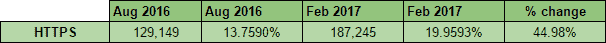
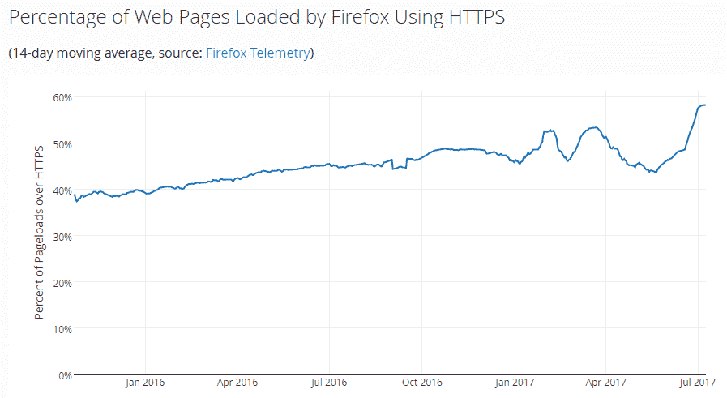
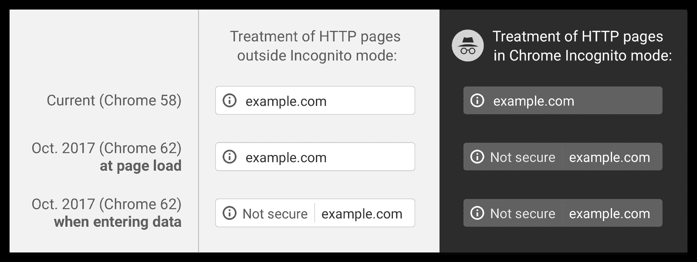
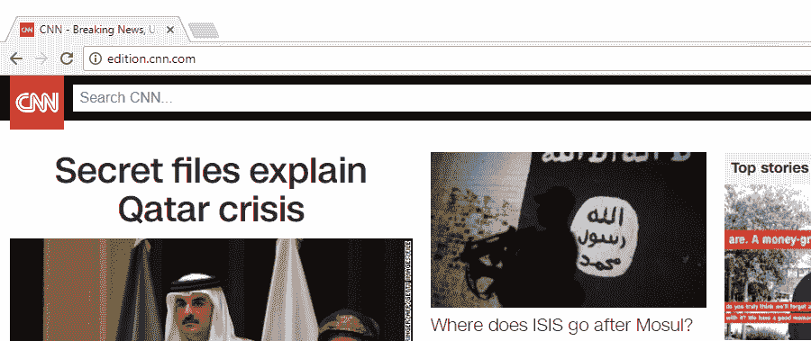
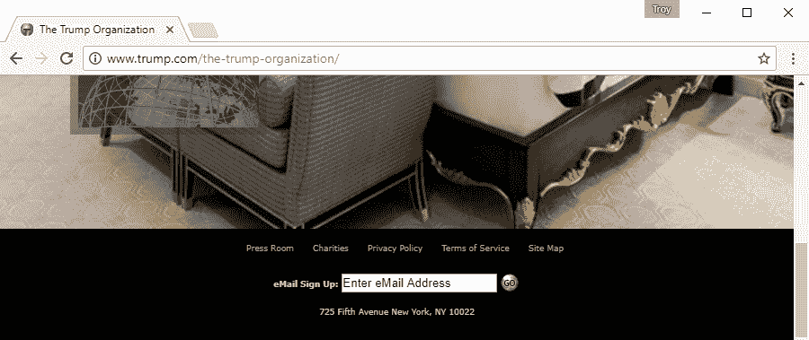
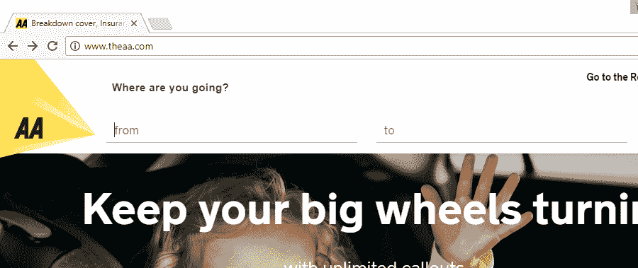

# 特洛伊·亨特:没有 HTTPS，网站的日子会变得更加艰难

> 原文：<https://www.troyhunt.com/life-is-about-to-get-harder-for-websites-without-https/?utm_source=wanqu.co&utm_campaign=Wanqu+Daily&utm_medium=website>

如果你还没有注意到，当谈到保护流量时，我们正在向“默认安全”网络快速前进。例如，早在今年 2 月，Alexa 排名前 100 万的网站中有 20%强制实施安全方案:

这些数字来自斯科特·赫尔姆的半年度报告，我们现在看到的是一个 5 个月前的数据。在写这篇文章的时候，我和他进行了一次安静的聊天，显然这个数字现在是前 100 万的 28%。更令人印象深刻的是它的变化速度——上面的图表显示，仅在 6 个月内就增长了 45%!

或许更令人印象深刻的是，Mozilla 发现近 60%的网络请求都是安全发送的:

现在，不可避免地会有很多请求集中在网络上的大玩家身上，他们无处不在地做着 HTTPS(想想 Gmail，脸书，Twitter)，但趋势很明显——HTTPS 正以一种激烈的速度被采用。早在一月份，我就写过[我们是如何到达临界点](https://www.troyhunt.com/https-adoption-has-reached-the-tipping-point/)的，部分原因是这样的浏览器措施:

不安全地提供登录或支付表单的网站的“耻辱”始于一月份的 Chrome，然后是不久之后的 Firefox(偶尔会有[相当幽默的后果](https://www.troyhunt.com/new-pluralsight-course-what-every-developer-must-know-about-https/))。这条微博发出后不久，澳航确实很好地保护了他们的网站。当访问者被告知网站不安全时，他们的愤怒不可避免地会迫使网站运营商采取行动，HTTPS 也随之而来。

但是根据这篇文章的标题，对于那些还没有全面做 HTTPS 的网站来说，生活将会变得更加艰难。这里是你将在几个月后看到的东西

让我们仔细分析一下这里发生了什么:在撰写本文时，我们使用的是 Chrome 59，它的行为与上图中的 Chrome 58 相同，因此不安全的网站没有视觉指示器来提示这一点(至少没有，除非它们包含登录或支付表单)。然而，一旦我们进入版本 62 **，所有通过 HTTP 提供表单域的网站将向用户显示“不安全”警告**。想想这意味着什么——例如，这个网站将开始显示一个警告:

它有一个搜索页面，因此输入字段。不安全的形式意味着搜索的内容可能会被截取，并且可能包含用户不希望落入监听连接的人手中的数据。

该网站还将显示警告:

是的，只是一个邮件字段(不，不是“邮件”，那是假拼！)但是，当加载不安全时，它就容易被拦截。

最后，这个还会导致浏览器警告(抱歉，[我控制不住自己](https://www.troyhunt.com/the-5-stages-of-data-breach-grief/)):

现在，您可能不认为输入到路线规划器中的信息是特别敏感的，但是浏览器是如何知道这一点的呢？它们只是文本字段，任何内容都可以输入其中。此外，这有助于推动我们使*一切*最终 HTTPS，这给我们带来了 Chrome 62 的另一个变化。

如前图所示，**所有使用匿名模式时服务不安全的网站将显示警告**。Chromium 非常正确地解释说，匿名浏览的人对隐私有更高的期望，所以当这有风险时警告他们是有意义的。但不要认为这将只是隐姓埋名的领域，这将成为主流:

> 最终，我们计划显示所有 HTTP 页面的“不安全”警告，即使在匿名模式之外

这里有一个关于这一切的重要观察:目前，我们知道安全页面是安全的，因为浏览器这样告诉我们。我们知道不安全的页面是不安全的，因为浏览器不会告诉我们它们是安全的。明白了吗？这是默认不安全的原则，也是我们越来越远离的。还要记住，这适用于浏览器加载的任何网站，所以仅仅在防火墙后面浏览内部网并不能避免警告。如果你不为 HTTPS 的所有内部业务系统提供服务，那么你的内部用户也会被告知他们“不安全”(不，告诉他们忽略警告不是你想要鼓励的行为)。

底线是这样的:**如果你通过不安全的连接提供*任何*的服务，你需要计划你默认如何去 HTTPS*现在*T5】。开发者自己也有很大的欲望去获得安全；几个月前，我在[上发布了一个新的 Pluralsight 课程，这是每个开发人员都必须知道的关于 HTTPS 的知识](https://www.troyhunt.com/new-pluralsight-course-what-every-developer-must-know-about-https/)，它在超过 6000 门课程的库中直接进入了前 10 名。如果您开始了通往安全传输层的旅程，这是一个很好的起点。**

这花了我们一段时间，但最终我们得到了一个“默认安全”的网络！

