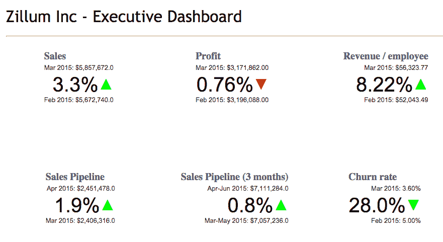
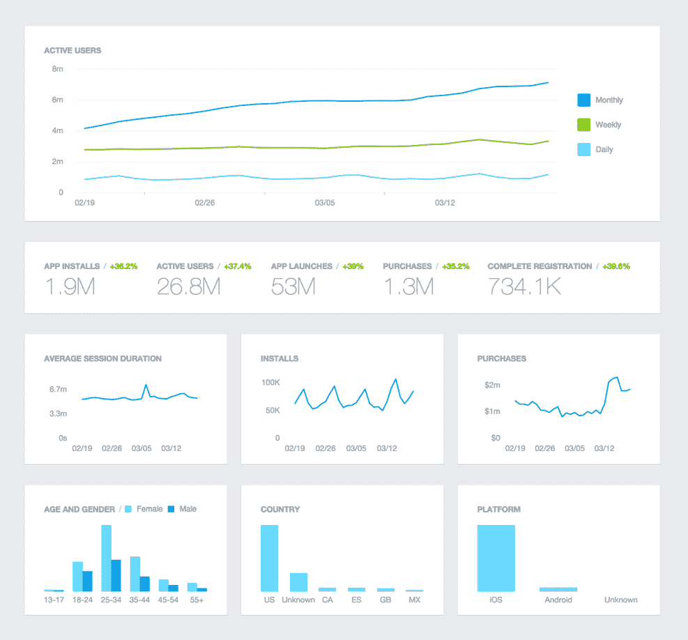

# 最低可行分析-图片-移动增长咨询和代理

> 原文：<https://mobilegrowthstack.com/mobile-app-analytics-519f5719e283?utm_source=wanqu.co&utm_campaign=Wanqu+Daily&utm_medium=website>

#### *“不可测度，不可改进”:* [*彼得·德鲁克*](https://en.wikipedia.org/wiki/Peter_Drucker)

 <noscript></noscript> 

在“数据驱动”的努力中，团队经常会陷入以下一个或多个陷阱:

*   **跟踪错误的事情，或者没有足够详细地跟踪事情，导致数据不能提供可操作的洞察力**

*   **追踪*一切*可能，** 没有计划如何利用它，知道它可能在某个时候有用。这可能导致代码膨胀，应用程序中网络连接的过度使用，以及实现或更新冗余跟踪的潜在浪费开发周期

*   **未能有效地组织和处理** 收集的数据，导致未使用或剩余的分析数据堆积如山，无法增加价值

*   **分析瘫痪:**

*   **未能使分析与新产品更新保持同步** ，导致数据不能准确反映产品使用情况

为了降低这些风险，采用精益方法进行分析跟踪以及处理收集到的数据是很有帮助的。团队最好考虑一下什么构成了**最小可行分析:**他们*需要的数据*以便做出有效的决策。随着产品的成熟和团队的成长，这个定义自然会随着时间的推移而发展。Brian Balfour 在他关于[死亡数据轮](http://www.coelevate.com/essays/growth-data-mistakes)的文章中详述了这个主题。Balfour 强调需要将数据视为一个过程，而不是一个项目。

在本文的剩余部分，我将提出一些指导方针来帮助团队计算出在不同成长阶段迭代产品和营销目标所需的最低*可行*水平的分析。

### **一堂简短的历史课和一段通往 MVP 的弯路**

在遥远的过去，手机游戏和应用程序是由手机制造商在内部开发的，并在工厂直接“闪存”到手机固件上，只能从授权服务中心进行更新，而且只能更新整个手机固件，而不是单个应用程序。应用程序和游戏是以“最终”状态发布的，只会修改以修复严重的错误。

如今，移动应用程序频繁更新，并不断迭代开发:流行的做法是在最早可行的时候推出(或至少试推出)一款“最低可行产品”，并根据早期客户群对该产品的使用情况的真实数据，调整产品和营销工作，使其适应产品市场。

这种向迭代的、基于数据的产品开发和营销努力的转变提供了纠正错误、改善用户体验、做出决策和对新信息做出反应的机会。这也给那些构建产品的人带来了越来越沉重的责任，他们需要收集、处理和分析数据，并利用这些数据为未来的努力指明方向。此外，构建“MVP”的热情是草率编码、技术债务和产品或功能开发的肥沃土壤，这些产品或功能肯定是最少的，但不一定是可行的(T2)。更糟糕的是,‘MVP’被过度设计，以至于需要一年的时间来运输和测试一个假设。

约翰·h·皮特曼在他的文章《最低可行产品的暴政》中抓住了问题的关键:MVP 通常都太低，而且往往不可行:

 *<noscript></noscript>* 

太多时候，强调的是最低限度，而不是可行性(img src: John H. Pittman)

在 Y-Combinator 博客上，Yevgeniy Brikman 指出 [MVP 更多的是一个过程](http://blog.ycombinator.com/minimum-viable-product-process/)而不是一个目的地或一个特定的产品发布:

MVP 是一个你一遍又一遍重复的过程:确定你最危险的假设，找到尽可能小的实验来测试这个假设，并利用实验的结果来纠正错误——[叶夫根尼(吉姆)布里克曼](http://blog.ycombinator.com/author/yevgeniy-brikman/)

### **注意:数据不会解决你所有的问题**

面对分析的局限性，现实一点很重要。世界上所有的数据都无法修复一个根本上糟糕的产品。有些想法简直烂透了；实际上，有很多。如果你的产品是围绕一个站不住脚的命题或有缺陷的前提构建的，数据将帮助你理解它有多糟糕，但不会提供一根魔杖来修复它。在这种情况下，跟踪一些基本的行为数据，反思令人沮丧的参与度和保留率，至少可以帮助团队意识到是时候转向——或回报投资者——而他们仍然有资金来这样做。

在更典型的情况下，群组数据将向您展示产品如何(有希望地)随着每个版本而改进，新用户和现有用户如何与功能交互，以及在注册或支付等关键流程中哪里有缺失，这些都有希望通过仔细的迭代和测试来改进。分析有助于团队将产品与竞争对手或具有类似动态的产品进行对比。分析有助于验证或反驳假设，提高对用户和更广泛市场的理解，从而有助于在许多领域做出更好的决策。这是支持精益开发方法的基本能力。

### **用于分析的核心使用案例和“内部客户”**

在决定收集什么数据之前，有必要考虑如何使用这些数据。通常，至少有 3-4 个核心用例，在组织内有不同的内部“客户”:

#  **<noscript></noscript>** 

### **仪表盘:是什么而不是为什么**

仪表板是向整个公司、高管或特定团队提供其最重要指标的即时可见性的好方法。

*战略仪表板*

战略或执行仪表板提供对公司重要的关键绩效指标(KPI)的一目了然的快照。它们提供了持续可用的健康检查和公司绩效状态。他们不会告诉你*为什么*这些数字是特定的；这不是仪表板的目的。

对于拥有移动产品的公司，最低可行的“公司仪表板”可能包括以下部分或全部内容:

*   活跃用户(常用 DAU 和 MAU)

*   特定于公司的参与度 KPI(例如:SoundCloud 使用“收听时间”作为内部参与度指标。AirBnB 使用“预订的夜晚”)

*   销售和收入数据
*   [NPS](https://en.wikipedia.org/wiki/Net_Promoter) 或类似的客户满意度分数(也可以显示某种程度的客户服务活动，如开放支持票)

首席执行官经常需要统计数据向投资者展示；让关键公司指标在控制面板中一目了然将减少临时请求和查询的数量。

 *<noscript></noscript>* 

***[整洁的高管仪表盘的绝佳范例](https://www.zoho.com/reports/blog/dashboard-types.html)***

让整个公司都看到一个仪表板有助于集中精力，减少产品性能的模糊性。

*附加仪表板*

随着公司的发展，特定的团队可能会开发他们自己的仪表盘，监控特定功能、活动或平台的 KPI。

操作仪表板对于监控较低级别的性能指标也很有用，如服务器负载、错误/崩溃、延迟等。

*避免“仪表板热”:少即是多*

很明显，很有可能会陷入“仪表板热”，添加越来越多的屏幕和统计数据，以求全面。尽量坚持团队每天都应该知道的关键信息，并将数据点和图表的数量保持在最少。

大量的仪表板不可避免地会导致对信息位置的混淆，分散注意力。临时问题最好通过*调查分析*来回答，而不是创建一个仪表板来涵盖所有可能的查询。

与公司的 KPI 一样，仪表板不应该太频繁地修改；他们的价值很大程度上来自于提供一个一致且易于理解的性能视图。然而，有必要不时地进行健康检查，以确保任何仪表板仍然有效、准确和必要；通过观察为公司或团队提供清晰、简明概述的“最小可行”KPI 集，避免仪表板爬行。

### **营销分析**

营销分析包括衡量和优化通过电子邮件/推送或第三方广告网络等渠道获取新用户的广告工作或吸引现有或流失用户的再营销工作的影响。

最终，营销分析应该揭示各种渠道和活动的投资回报率，并提供足够的粒度可见性来优化这些活动。

在非常基本的层面上，营销分析设置应提供以下信息:

*   从各种流量来源和营销活动中产生的移动**应用安装**
*   **从各种营销活动中获得的参与度、转化率和/或收入**

与分析堆栈的其余部分一样，构成最小*和可行*的*的复杂程度将随着业务增长、营销活动和预算增加而变化。*

营销分析设置的*生存能力*的定义可能因行业和应用类别而异:在竞争激烈的类别中与拥有数百万美元广告预算的企业巨头竞争的应用或游戏比其他应用或游戏具有更高的门槛。同样，如果一家公司还没有花钱通过效果营销来获得用户，而是主要通过病毒式营销、公关、交叉销售、搜索或其他“有机”渠道来增长，它可能会得到一个相当精简的营销分析堆栈；复杂性和功能随着营销活动和支出的增加而增加。

 *<noscript></noscript>* 

*脸书分析仪表板*

在发布时，脸书分析，加上从 Google Play 开发者控制台和 iTunes Connect 中获得的见解，可能会为产生最大影响的营销活动提供足够的洞察力。

随着获取和保留工作变得越来越复杂，*可行的*分析的定义也在演变。一个用于衡量应用安装活动、交叉销售链接和病毒式分享对用户获取的影响的[归因合作伙伴](https://mobilegrowthstack.com/how-to-choose-a-mobile-attribution-partner-2f45cdc88ac3)变得至关重要，同样重要的还有正确衡量推送通知和电子邮件活动的影响的方法。随着广告支出的增加，快速准确地估计新用户的留存率和 LTV 的预测分析变得越来越重要。这同样适用于自动重新计算并将片段推送到脸书和其他网络以生成相似物、重新定向和抑制列表的能力。

并非所有的获取渠道都是同等可衡量/可归因的，这可能会增加评估跨渠道营销努力的相对价值的挑战。例如，Snapchat 提供了有限的可见性(尽管[这个问题正在解决](http://www.adweek.com/digital/snapchat-advertisers-are-now-getting-data-their-app-install-campaigns-169763/))。移动应用的电视广告[很难衡量](http://wywy.com/how-to/how-to-attribute-app-downloads-to-tv-advertising/)，公关和影响者营销更是如此。

正如 Eric Seufert 和其他人所指出的，精明的营销人员不会回避在提供不完美衡量的渠道上进行绩效营销，因为这些新兴渠道对那些能够有效掌握它们的人来说有很大的好处。Brian Balfour 鼓励在[细化收购渠道组合](http://www.coelevate.com/essays/5-steps-to-choose-your-customer-acquisition-channel)时考虑不太容易衡量的渠道。最终，营销分析是关于理解和提高来自特定渠道和活动的价值(作为成本和影响的函数)。

因此，营销分析本身就是一个巨大而复杂的话题，对于一些企业来说，营销分析能力的优势可能意味着市场支配地位和败在竞争对手手中的区别。

(要深入了解复杂的营销分析和相关技术，请查看 Eric Seufert 在[移动用户获取堆栈](http://mobiledevmemo.com/mobile-user-acquisition-stack/)上的精彩帖子)。

电子邮件和推送提供商提供的现成测量工具通常只能提供有限的可见性来了解这些渠道的真实影响，因为它们往往专注于领先的转化指标，如邮件打开率和点击率。为了从信息营销活动中获取最大价值，成长型营销人员还希望将用户层面的营销活动数据吸收回他们的调查分析层，以评估对留存率、参与度和 LTV 的下游影响。这对于广告渠道来说更是如此，因为广告渠道的成本会随着活动的增加而迅速增加。

### 调查分析

仪表板对于在宏观层面上保持整个团队在同一个页面上是非常好的，但是对于关于特性如何执行、用户如何与产品交互等日常问题。需要某种程度的灵活性，这是仪表板(即使有一些花哨的过滤器)所不能提供的。

考虑一些特定的场景:

*   查看**转换漏斗**中的特定功能或用户体验(如注册、购买或使用功能)

*   **根据不同变量对群组保持度**表格进行切片和切块，例如查看“特征保持度”(使用特定特征/执行特定操作的用户的保持度)

*   **创建具有特定特征的用户群**,并从中获得可操作的洞察力

*   找出什么样的**行为或人口统计特征**将一组用户(比如那些购物者)与其他用户区分开来
*   找出用户通过应用程序选择的**路径，以及哪些功能或内容最受欢迎/未被充分利用**

这种调查可以导致关于产品、其用户、营销努力的有效性或上述所有方面的重要发现，从而产生可操作的见解，为新的细分方法或实验假设提供信息。

构建定制的 SQL 查询或仪表板来回答这些特殊的问题通常需要时间或技能，而这些都是短缺的。一个团队中的每个人都精通 SQL，并且能够编写自己的特别查询，这是非常值得培养的，因为这将减少许多瓶颈。然而，写得不好的查询会导致错误的数据和不正确的结论，所以这种方法不是没有风险的，特别是在团队成长的时候。

多功能的可视化分析工具，例如由[振幅](http://www.amplitude.com/)、 [Leanplum](http://www.leanplum.com/) 、 [Localytics](http://www.localytics.com/) 、 [Mixpanel](https://www.mixpanel.com/) 等提供的工具。在一个用户友好的界面中启用(付费)这种分析能力，团队中的每个人都可以快速掌握。在许多情况下，同一个工具可以用来建立公司仪表板，以及做更多的特别调查工作。

 *<noscript></noscript>* 

漏斗分析:一个伟大的调查工具。Img 信用:振幅

许多团队通过这些现成的产品之一来跟踪他们的所有数据，尽管许多其他团队选择拥有和维护他们自己的用户和事件数据数据仓库，维护他们自己的最终真实来源，同时将事件的子集传输到商业分析和营销工具，以享受他们灵活的用户界面的好处。维护内部数据仓库减少了对任何单一第三方解决方案的依赖，并且随着业务的成熟，还提供了构建更多自定义内部分析和报告的途径。

就调查分析的*最低可行*设置而言，最好从第一天开始(即从产品拥有真正用户的那一天开始)，就应该具备以下能力:

*   用户跟踪(识别唯一的用户，以便可以跟踪他们的行为)

*   漏斗分析
*   行为细分

后两者的先决条件是，重要事件在应用程序中发生时会被记录，并且至少有一些用户跟踪的概念，这样事件就可以归因于特定的用户。

 *<noscript></noscript>* 

*群组分析需要成为任何最低可行分析设置的一部分。Img 信用:[Localytics](http://info.localytics.com/blog/event-based-cohort-retention)T3】*

真的没有理由让*在发布时不具备*这些功能:像 [Flurry Analytics](https://y.flurry.com/) 这样的免费工具提供了所有这些功能，并且通过一个功能化的仪表板提供了更多功能。包括脸书分析、 [Fabric](https://get.fabric.io/) 甚至 iTunes Connect 在内的其他免费服务提供了一些基本的群组和细分功能，以及各自领域更专业的功能。

### 运营/开发运维分析

如果你的产品不能正常工作，除了修复它，没有什么特别重要的。现代移动产品的复杂性为关键的第三方服务、客户端崩溃、DDOS 攻击和其他类似事件导致的服务器停机、中断或 API 故障留下了充足的空间。

跟踪一些基本的东西，如服务器可用性、API 响应时间、应用崩溃等。以及设置警报，以便在发生停机时，负责修复这些东西的人员能够立即得到通知，这实际上可以挽救业务，或者至少可以大大减轻后果。

 *<noscript></noscript>* 

***[DevOps 仪表盘对于非工程师来说可能看起来有点令人生畏](https://www.infoq.com/news/2016/03/hygieia/)***

免费的报告工具，如 [Crashlytics](http://try.crashlytics.com/) 提供了对应用崩溃数量和原因的宝贵见解，并且存在许多用于监控 API 可用性的服务，包括 [APImetrics](http://apimetrics.io/) 、 [RunScope](https://www.runscope.com/api-monitoring) 等。更进一步。

### 永恒的构建与购买之争

在一定规模下，公司倾向于内部部署部分或全部分析堆栈，称成本节约和定制是核心优势。与大多数构建与购买决策一样，此类行动的决策归结为对当前和未来业务需求、核心能力和内部专业知识的评估。

任何给定产品的最低可行分析堆栈必然会随着时间的推移而变化，因为在发布时最低限度需要的衡量和报告水平将不足以支持不断增长的组织和日益复杂的产品向数百万或数亿用户发展的需求。因此，在公司成长的不同阶段，构建还是购买的争论是一个健康的话题。在早期(通常是几年)，构建和维护定制内部分析的机会成本往往超过收益，但随着时间的推移，尤其是在高速增长的情况下，这种平衡可能会发生变化。

比底层技术更重要的是数据本身，以及以获取商业价值的方式操纵和从中提取价值的能力。这种能力既有组织上的，也有技术上的，尽管成功的公司找到了在这两个方面都出类拔萃的方法。