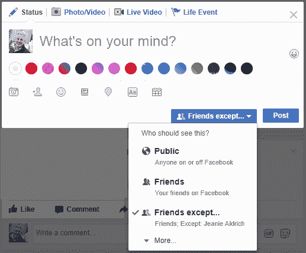

# 脸书算法矩量法问题

> 原文：<http://boffosocko.com/2017/07/11/the-facebook-algorithm-mom-problem/?utm_source=wanqu.co&utm_campaign=Wanqu+Daily&utm_medium=website>

## 一队

很长一段时间以来，我都是先把我的大部分内容发布到我的个人网站上，然后把这些内容联合发布到 Twitter、Instagram、Google+和脸书等社交媒体上。在 [Indieweb 社区](https://indieweb.org)中，这个过程被称为 [POSSE](https://indieweb.org/POSSE) 在你自己的网站上发布*帖子，在别处联合发布*的缩写。

## 脸书算法

有趣的是，社交媒体中的大多数人早就知道，这样的工作流程会导致你的内容被当作二等公民对待，特别是在脸书，它非常喜欢用户手动或使用自己的应用程序发布内容，而不是通过 API。【1】【2】【3】【4】这意味着决定一段内容接收多大受众的脸书算法，会在他们的系统内手动发布那些没有发布的帖子。简单地说，如果你不在脸书境内手动发布，就不会有那么多人会看到它。

一般来说，我并不太在乎这种发帖“税”，而是愉快地使用一个名为[社交媒体网络自动海报](https://wordpress.org/plugins/social-networks-auto-poster-facebook-twitter-g/)(又名 SNAP)的插件，将我在 WordPress 网站上的内容整合到六个社交筒仓中。

在过去的六个多月里，我注意到一种更为隐蔽的税收，那就是邮寄到脸书要缴纳的税。我称之为“脸书算法妈妈问题”。

## 事情是这样的

我在自己的个人网站上写我的内容。我自动把它转给了脸书。我的妈妈似乎每天 24 小时都在关注脸书，她会立即点击帖子上的“喜欢”。脸书算法立即认为，因为我妈妈喜欢它，所以它一定是一个与家庭相关的内容——即使它显然是关于理论数学的，而我妈妈对这一学科没有兴趣或知识。(我妈妈在脸书上有大约 180 个朋友；其中 45 个与我的重叠，而且绝大多数是近亲。

该算法将内容的呈现缩小到非常接近的家庭。然后我妈妈的姐姐看到它，并点击“喜欢”片刻之后。现在，脸书的算法创造了一个自我实现的预言，进一步缩小了我的帖子的受众范围。因此，除了五个人之外，我的帖子在脸书没有进一步曝光，这五个人是我们三个社交图上重叠的家庭圈子。自然，这些人没有一个爱我到在我认为很酷的随机技术事物上点击“喜欢”的程度。我当然不能责怪他们不喜欢这些晦涩难懂的话题，但我应该为脸书感到羞耻，因为当我最初的目标可能是其他 10 名同事时，他折磨他们让他们曝光了这些话题。

如果实际内容是脸书预测的那样，这一切都没问题，但 99%的时候，情况并非如此。总的来说，我倾向于发表关于数学、科学和其他随机技术主题的文章。我很少发布与我的家庭成员密切相关的个人信息。这类事情我会通过电话或亲自转达给他们，而不会公开发表。

## 只有母亲才会喜欢的帖子

我可以发布一些神秘的领域，比如李代数或者统计热力学，我的妈妈*，因为她是我的妈妈*，会喜欢所有的内容——不管她是否明白我在说什么。妈妈不都是这样吗？！他们应该做什么？当然是啦！

> <dfn>**妈妈——自动喜欢**</dfn>(n .)——当一位母亲自动点击他们的一个孩子发布到社交媒体上的一条内容的“喜欢”时，不是因为它有任何内在价值，而仅仅是因为内容来自他们的孩子。

她是我妈妈，她应该这样无条件地爱我！

问题是:**脸书，尽管事实上他们*知道*她是我的妈妈，但在他们的算法中没有考虑到这个事实。**

这是什么意思？这意味着要么我放弃在脸书的工作，要么我让系统阻止这些类似妈妈的事情发生。

## 防止模仿妈妈

我一直在尝试。但是怎么做呢？

脸书允许用户以一种高度精细的方式明确地锁定他们的受众，从整个公众到一个人的“朋友”圈子，一直到甚至一两个特定的人。更好的是，它们可以让你锁定预先定义的朋友圈，甚至排除特定的人。所以这是我一直在做的典型的事情，来结束我的脸书算法妈妈问题。我把我的网站设置为“除妈妈以外的朋友”或“除妈妈以外的公众”。(有时我会把我姑姑排除在外。)这意味着我妈现在看不到我发布的帖子了！

<noscript></noscript>

Facebook will let you carefully and almost surgically define who can see your posts.

## 多可怕的儿子

不要操之过急，伙计！当算法运行完它的程序，我在一天结束的时候回来，我的帖子已经可以预见地到达了它可能得到的所有观众。在这一点上，我将帖子的受众完全改为“公众”。

## 你永远也猜不到接下来会发生什么…

没错。我妈“喜欢”它！

我爱你，妈妈。感谢你们无条件的爱和支持！！

更好的是，我很高兴地告诉大家，一般来说，我想看帖子的目标受众实际上已经看到了。妈妈只是晚一点才能看到。

## 亲爱的脸书工程公司

你能解决这个算法问题吗？我确信我不是唯一一个受此折磨的儿子或女儿。

你自己注意到这个问题了吗？我很想听听其他人的看法，他们看到了类似的效果，并且非常爱他们的母亲(或其他亲密的亲人)，不会将他们从脸书的生活中剔除。