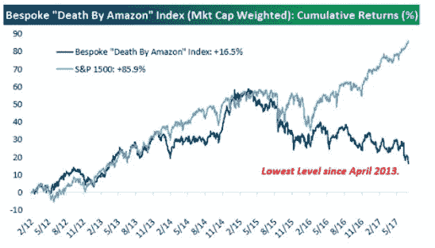
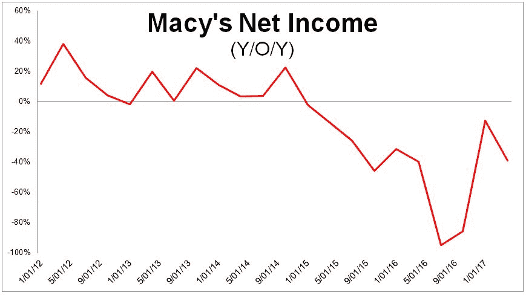
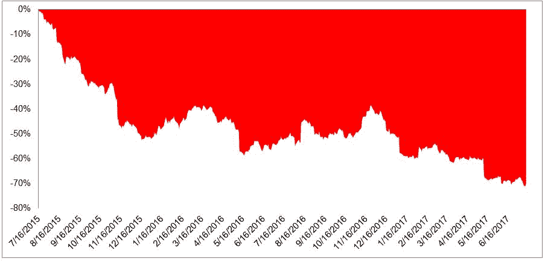
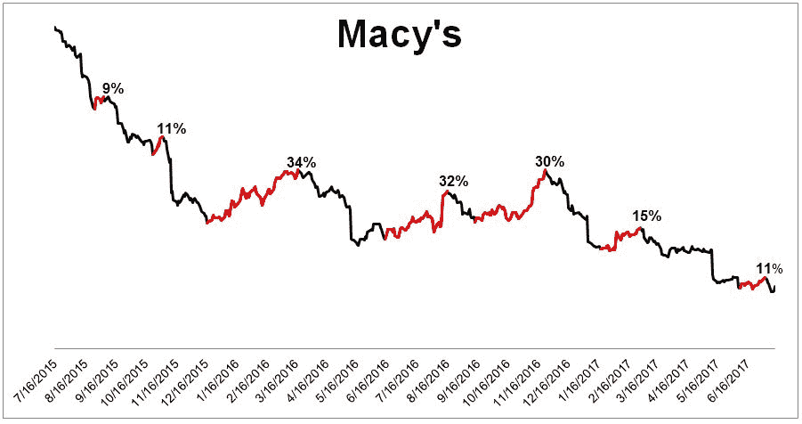
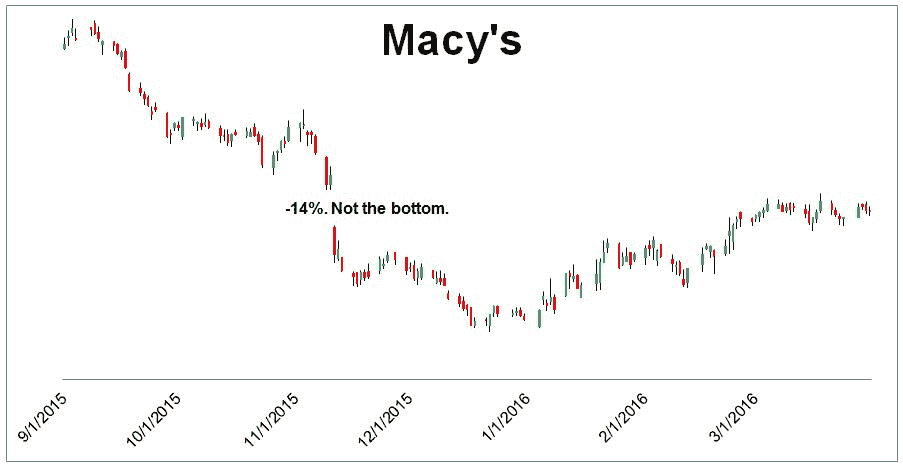
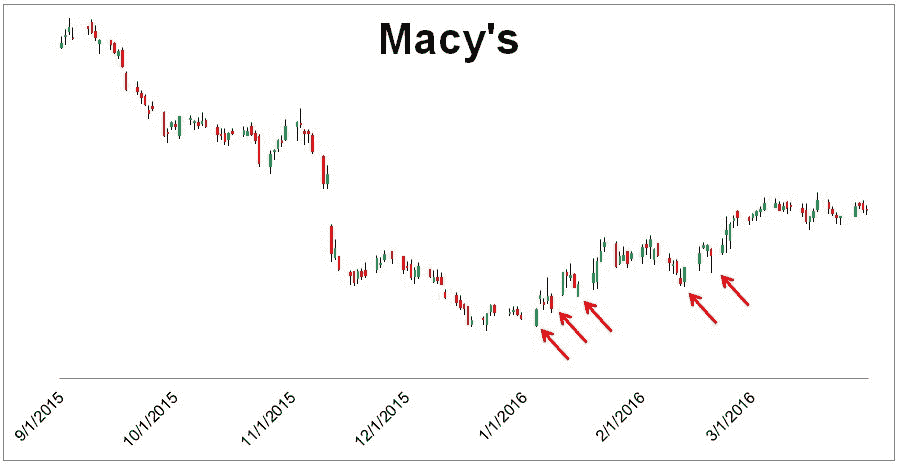
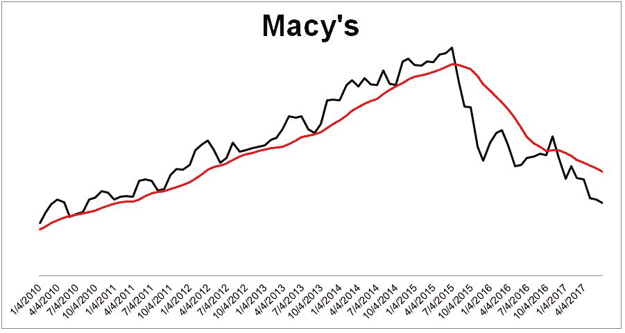
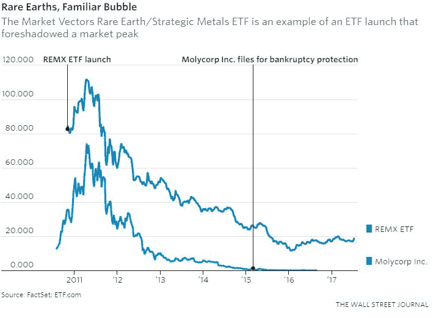
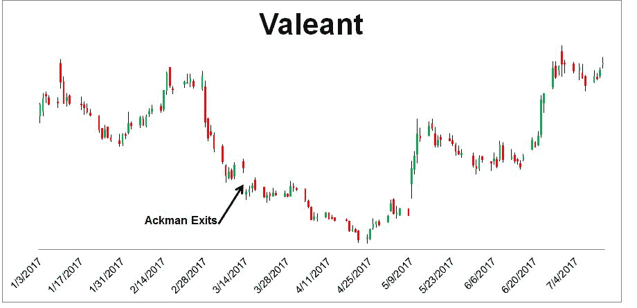

# 捕捉底部的十条规则——无关的投资者

> 原文：<http://theirrelevantinvestor.com/2017/07/14/ten-rules-for-catching-a-bottom/?utm_source=wanqu.co&utm_campaign=Wanqu+Daily&utm_medium=website>

我从未见过一个新投资者是趋势跟踪者。那是因为我们还没到开经纪账户的年龄，就被教导低买高卖。所以当我们成年后，我们去寻找便宜货。但是我们很快发现这比听起来要难。

没有人能真的低买高卖。反正不是一贯如此。成功的交易者通常高买高卖，成功的投资者低买低卖。但是如果你想抄底，想成为一个能在别人发现垃圾的地方发现宝藏的投资者，我建议你遵循一些宽泛的规则。

如今，市场上最明显的一块属于“他人垃圾”的区域是零售商。这些名字中的 54 个被[定制](https://twitter.com/bespokeinvest)称为“亚马逊之死”指数，今年下跌了 20%，处于 2013 年 4 月以来的最低水平。让我们深入研究一下，以梅西百货为例。

梅西百货有大麻烦了。在过去的 10 个季度中，其年同比净收入一直在下降，每股收益(TTM)比两年前同期下降了 56%。

这一问题已在股价大幅下跌中表现出来。在过去的两年里，它经历了 71%的崩溃。71%的大屠杀并不需要背景，但美国股市唯一一次下跌这么多是在大萧条时期。

当品牌崩溃时，人们倾向于介入并购买，主要有两个原因:

1.  很难想象像梅西百货这样知名的公司能在短短 86 天内被砍掉一半。但是 2015 年 7 月到 11 月，确实是这样。自那以后，该指数又下跌了 45%。
2.  在投资中，没有什么比在别人赚不到的地方赚钱更令人满意的了。

抄底的第一条规则是不要试图抄底。这是所有投资中最难做的事情之一。梅西百货在下跌 70%的过程中经历了三次 30%的上涨。没有一个卡住的。快速交易者赚了钱。抄底投资者受到了伤害。

规则 2:不要在经历了一天的暴跌后匆忙买入。你不必事事都拿另一面说事。股票市场并非完全有效，但当一家市值 150 亿美元的公司单日跌幅达到两位数时，通常是有充分理由的。2015 年 11 月 11 日，梅西百货下跌了 14%，在接下来的几周内又下跌了 12%。

规则 3:等待更高的低点。更高的低点并不意味着底部已经到来，但是每一个真正的 T2 底部都会经历这些。

规则 4:等待长期均线稳定下来。例如，梅西百货的 12 个月移动平均线仍在下跌。如果你等待长期均线企稳，你不会在底部买入，但安全总比后悔好。在证明无辜之前，落刀都是有罪的。

规则 5:等待 ETF 被创建。ProShares 刚刚申请了两倍和三倍杠杆的零售股票 ETF。这些备案只发生在重大动作之后，应该让所有抄底者舔舔他们的排骨。新的 ETF 是新的杂志指标。

规则 6:使用止损。选择一个你愿意损失的金额或百分比，并坚持下去。

规则 7:保持小额交易。准备好，就好像在你之前卖的人都是对的，你是错的。风险不超过资本的 1%。

规则 8:不要告诉任何人。战胜自己的情绪已经够难了，当你告诉别人你在做什么时，骄傲和自负会影响你的判断，你不太可能承认失败并继续前进。

规则 9:延长你的时间范围。很少有东西被切成两半，然后在两周内反弹。触底往往需要一段时间，所以要确保你明白你将面临什么。当追求价值时，挫折比比皆是。

规则 10:如果你忠于这个名字(祝你好运),慢慢来。你不太可能去买底部，所以做个计划，然后分散开来。例如，在接下来的四个月里，每两周购买你想购买总量的 1/8。

奖金规则:等待大牌投资者出局。例如，自从阿克曼宣布出售股份以来，Valeant 已经上涨了 43%。但是从来没有这么容易。这条消息出来后的头几周，Valeant 又跌了 30%。因此，任何认为阿克曼的退出是“解除警报”的人都大错特错了。

抄底非常困难，但是没有人能说服你不去做。你知道这是浪费时间的唯一方法就是亲自尝试。所以希望这些规则能在你下次试图接住落下的刀子时对你有所帮助。

