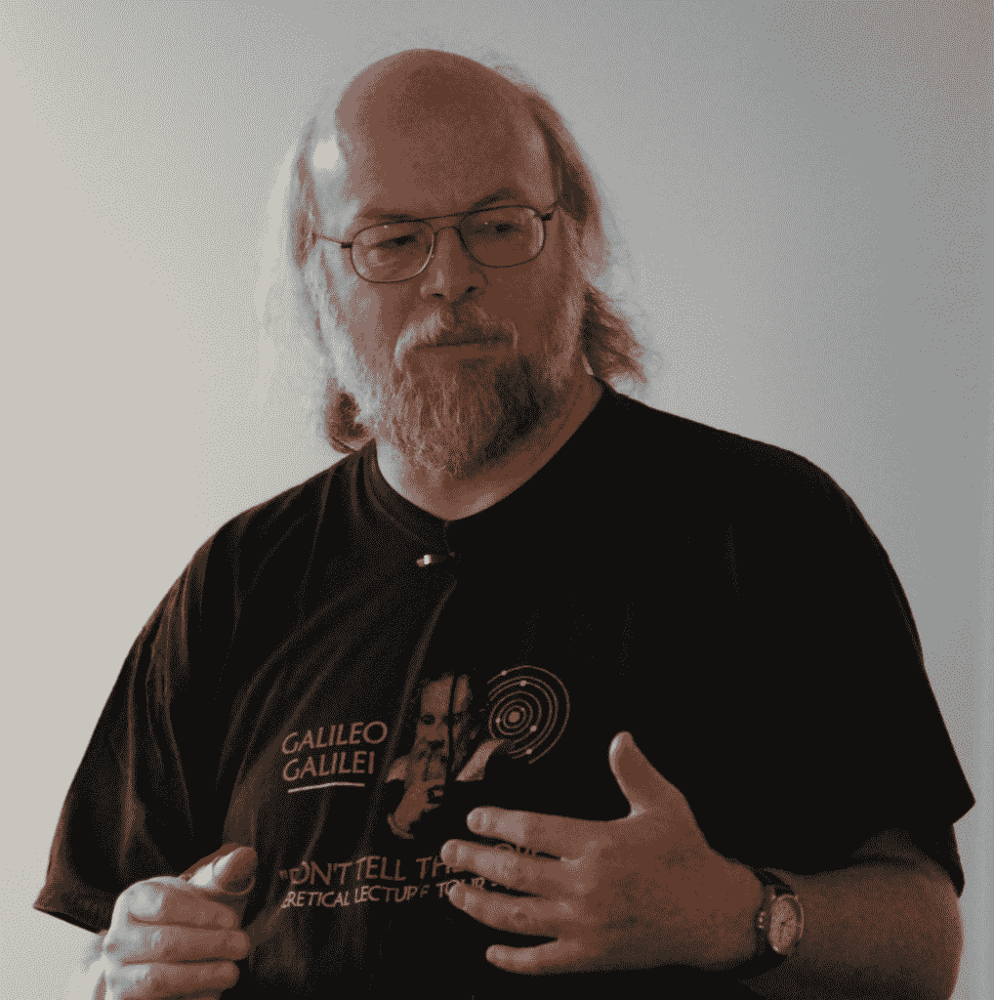

# AWS 云如何摧毁对年轻人的崇拜——詹姆斯州长的 Monkchips

> 原文：<https://redmonk.com/jgovernor/2017/05/23/how-aws-cloud-is-demolishing-the-cult-of-youth/?utm_source=wanqu.co&utm_campaign=Wanqu+Daily&utm_medium=website>

[T2】](http://jgovernor-media.redmonk.com/jgovernor/files/2017/05/gosling.png)

我们生活在一个痴迷于青春的社会。科技与更广泛的文化没有什么不同。创业文化尤其盛行于这样一种观点，即你 30 岁时就已经过了创业期。马克·扎克伯格今年 33 岁。当他还不到 30 岁的时候，一些脸书的员工悄悄地开始称他为扎克叔叔。残忍。

年轻的创始人和员工愿意也有能力工作更长时间，并且真的能熬过去。他们有更高的耐力，并且一般没有他们想花时间陪伴的家庭。他们可以完全投入手头的工作。大多数数学突破是由年轻人发现的。诚然，今天的科技巨擘都是由 20 多岁的年轻人创立的——苹果、脸书、谷歌、微软。亚马逊有点与众不同——杰夫·贝索斯创办这家公司时才 30 岁。他已经有点成熟了。

他建立了一个怎样的公司。亚马逊是未来几年最有可能价值一万亿美元的公司之一。斯科特·盖洛威的这个视频是对最有可能达到目标的四骑士的最好诠释。亚马逊在碾压它，亚马逊在拆解零售，亚马逊要“杀死品牌”。

那么，谁在雇佣员工来推动下一阶段的增长呢？一群 22 岁的年轻人，对吗？不是。所以。很多。亚马逊有很多时间给经验丰富的人才，包括管理人员和技术人员。

亚马逊网络服务公司(AWS)刚刚宣布将聘用 Java 的创始人之一詹姆斯·高斯林。他已经 62 岁了。我们不知道他会在亚马逊做什么——他很可能会设计一个水下无人机舰队，也可能会推动编程语言的创新。但他是一个灵感，他还在编码。他可以从事特定于 AWS 的 JVM 优化工作。但目前这一切都只是猜测。

与此同时，詹姆斯·汉密尔顿继续在 AWS 的计算、网络和数据中心设计方面表现出色。他开始接触数据库技术。他 50 多岁了。

XML 的发明者之一蒂姆·布雷于 2014 年加入亚马逊。他是孙的另一个校友。他现在 61 岁了。他还在编码。

当你和 AWS 工程团队坐下来的时候，你是在和成年人坐在一起。据猜测，年龄中值应该在 40-45 岁之间，比如安迪·古特曼斯，现年 41 岁，PHP 的创始人之一，现在为公司运营搜索和新 NoSQL 业务。

阿德里安·科克罗夫特于 2016 年 10 月加入 AWS。他是 1982 年毕业的，不是 2002 年。他是 AWS 的云架构战略副总裁，对于帮助推动网飞从本地 Java 毛球转变为真正的云领导的人来说，这是一个完美的角色。

伟大的工程不是数学——它涉及权衡、智慧和经验。伟大的工程师通常都是伟大的老师。芬坦最近写了杰出工程师的[现实。](https://redmonk.com/fryan/2016/12/12/on-the-myth-of-the-10x-engineer-and-the-reality-of-the-distinguished-engineer/)

“一个杰出的工程师不仅领导；他们也承担责任。一名杰出的工程师不会为了保护自己而让自己的团队陷入困境，也不会在不解释原因、不接受和理解决策的情况下做出涉及巨额回报(技术债务)的技术决策。”

他的描述非常符合 AWS 目前正在招聘的人。该公司非常重视独立团队快速工作并做出自己的决定，这需要一套特殊的技能，通常需要大量的实地经验。一个相关的趋势是从 IBM 等公司雇佣经验丰富的营销人才。

其他一些更老的公司有更老的杰出工程师，因为他们与公司一起成长。AWS 明确引入了这种体验。看到不同的价值观令人耳目一新。

AWS 是客户。

在 CC-BY-SA-3.0 许可下，图片来源 [Peter Campbell](https://petercampbell.blogspot.co.uk/) 。