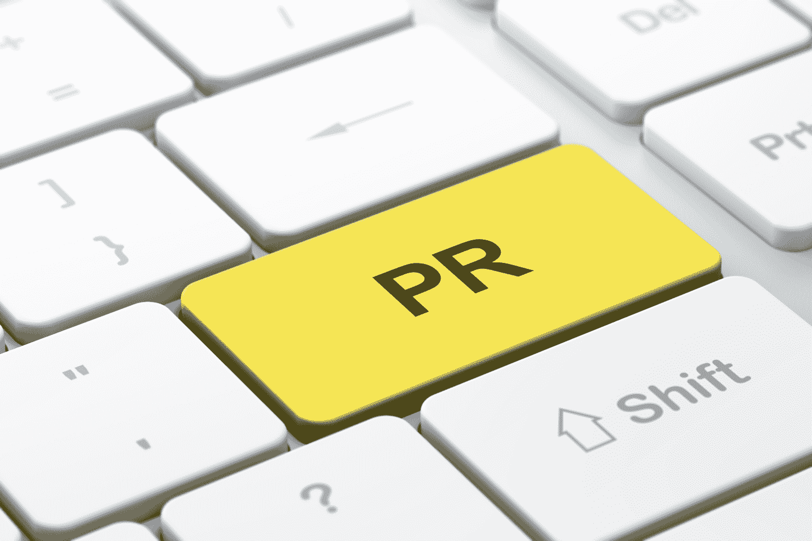
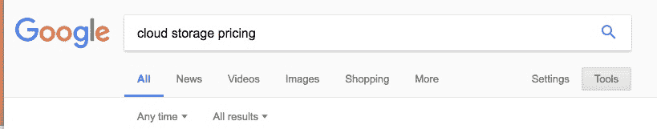
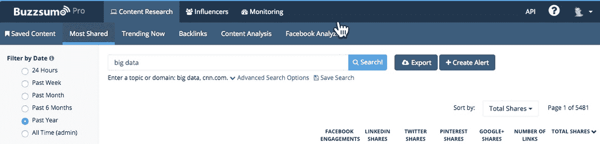

# 创业营销:如何获得你的第一个 1000 个客户

> 原文：<https://www.backblaze.com/blog/how-to-get-your-first-1000-customers/?utm_source=wanqu.co&utm_campaign=Wanqu+Daily&utm_medium=website>

[T2】](https://www.backblaze.com/blog/wp-content/uploads/2017/07/PR-Getting-First-1000-Customers.png "PR button")

如果你启动了自己的创业公司，但没人知道，你真的启动了吗？正如我在[上一篇文章](https://www.backblaze.com/blog/how-to-get-your-first-customers/)中提到的，我们最初的目标是让 1000 人使用我们的服务。但是，在没有人知道你是谁的情况下，你如何让 1000 人注册你的服务呢？

有很多方法可以吸引你的第一个 1000 个客户，但是我最喜欢的是和媒体一起发布。我会在下面解释为什么和怎么做。

## 吸引首批 1000 名客户的途径

社交关注:如果你有大量的社交关注者，这些人是你所提供服务的合理目标。特别是，如果你和他们的关系是他们会买你推荐的东西，这可能是获得你的初始客户的最简单的方法之一。然而，建立这种类型的追随者并不简单，通常需要几年的时间。

新闻不仅提供知名度和客户，但信誉和搜索引擎优化的好处。

付费广告:付费广告的优势在于，你可以控制它们何时出现，以及它们说些什么。主要的缺点是它们往往很贵，尤其是在你确定了你的定位、信息和渠道之前。

病毒式传播:当然，有一些公司是通过巨大的病毒式传播视频、博客帖子或推广来启动的。虽然这种事情发生的话会很棒，但是即使你做的一切都是对的，病毒式传播的可能性也是微乎其微的，转化率也很低。

**按:**我说过，这是我的最爱。你不需要付钱给公关公司，可以在几周内从零开始。新闻不仅提供知名度和客户，但信誉和搜索引擎优化的好处。

## 如何向媒体推销

这很简单:有一个令人信服的故事，找到合适的记者，让他们的生活变得轻松，推销，并跟进。当然，每一个都有一些细微差别，所以让我们深入研究一下。

### 有一个令人信服的故事

| [T2】](https://www.backblaze.com/blog/wp-content/uploads/2017/07/How-to-Get-Press-Attention.png "How to Get Press Attention") |  | 当你已经在创业公司工作了几个月的时候，和别人交谈时很容易迷失在细节中。记者要写的故事必须是读者会关心的。知道该讲什么故事以及如何讲，既是科学，也是艺术。以下是你的方法: |

### 你故事的基本内容

问自己以下问题，并写下答案。

*   我们在做什么？我们提供什么产品服务？
*   为什么？我们在解决什么问题？
*   有什么有趣或者独特的地方？无论是关于我们在做什么，如何做，还是为谁做。

“但是我的故事并不令人兴奋。”

相信我，他们也没有宣布成立数据备份公司。寻找让它引人注目的角度。以下是一些例子:

*   你的团队中有人以前做过重大的事情吗？(例如，建立一个成功的公司/产品，创造一些创新，营销我们都知道的东西，等等。)
*   你有感兴趣的投资者或董事会成员吗？
*   有没有一个个人故事驱使你创办了这家公司？
*   你是从一个独特的地方开始的吗？
*   你是以一种独特的方式想到这个主意的吗？
*   你能分享一些人们想知道但通常不会分享的东西吗？
*   你和一家知名公司合作吗？
*   …有什么有趣的/娱乐的/奇怪的/令人震惊的/感人的/等等吗？？

没有什么比“我们将推出一家公司来备份您的数据”更令人兴奋的了但是仍然有很多引人入胜的故事:

*   由连续创业者创立，自举一家资本密集型公司，互相承诺一年无薪。
*   挑战以前每个备份公司的建立方式，即不要求客户挑选要备份的文件。
*   设计我们自己的存储系统。
*   等等。

在最初的发布中，我们专注于“5 美元/月的无限量”和我们与 Harris Interactive 进行的一项调查的统计数据，该调查显示 94%的人没有定期备份他们的数据。

“每个人都有一个故事”，这是一句古老的谚语不管你在做什么，总有一些有趣的事情可以分享。挖掘一下。

### 标题

一旦你抓住了你认为有趣的故事，你就必须把它浓缩起来。是的，您需要电梯间推介，但这更短…这是标题推介。写下你希望记者写的标题。

不管你在做什么，总有一些有趣的事情可以分享。挖掘一下。

现在到了你必须真正诚实面对自己的时候了:如果你没有参与，你会在乎吗？

### “技术迷测试”

我试图让自己脚踏实地的一种方法是我所谓的“技术迷测试” [Techmeme](https://www.techmeme.com/) 列出了顶级科技文章。阅读标题。想象一下你在页面中间写的标题。如果你没有参与，你会点击它吗？它比其他的更引人注目还是更不引人注目。大部分科技新闻都被最大的公司所主导。如果你想被报道，你的故事应该更有说服力。如果没有，回到上面，继续探索你的故事。

### 禁运、排他性和行动呼吁

记者写新闻。因此，如果你已经宣布了某件事，然后又让一名记者去报道，除非你给他们的是还没说出来的重要消息，否则这就不再是新闻了。因此，有禁运和排他性。

禁运:禁运简单地说就是你与记者分享他们需要保密的新闻，直到某个特定的日期和时间。

如果你是苹果，这可能是一份正式的法律文件。在我们的例子中，就像说“请保持禁运，直到加利福尼亚时间 4/13/17 早上 8 点。”在球场上。一些网站明确不遵守禁运；比如说[信息](https://www.theinformation.com/)只会爆料。如果你想以后发布什么，不要在这些网站上与记者分享信息。如果你只和一个记者合作写一篇报道，并且你的发布时间是灵活的，你们可以共同制定一个发布的日期和时间。然而，如果你有一个固定的发布时间或与一些记者合作，禁运是关键。

独家报道:独家报道意味着你要给那个记者一些特别的东西。大多数记者喜欢独家新闻，因为这意味着读者必须向他们寻求报道。一种选择是让记者独家报道整个事件。如果这是你的梦想记者，这可能是有意义的。然而，另一种选择是对某些产品进行独家销售。例如，对于你的发布会，你可以给一个更关注金融的记者一个关于融资细节的独家采访&，给一个更关注技术的记者一个关于技术总监的采访。

**行动号召:**随着我们的发布，我们为 TechCrunch、Ars Technica 和 SimplyHelp 提供了 URL，让它们的首批数百名读者可以访问私有测试版。一旦每个网站的前几百名用户下载完毕，测试版就会被关闭。

因此，我们在首次发布时结合使用了禁运、独家报道和行动号召，以便能够在新闻发布前向记者简要介绍新闻，向他们提供他们可以宣布为独家报道的内容，并向读者提供对时间敏感的行动号召，以便他们实际上注册，而不只是阅读并离开。

## 如何找到最权威的网站/作者

"如果一篇新闻稿发表了，但没有人看到，那它发表了吗？"也许曾经有一段时间，通过网络发送新闻稿意味着记者会阅读并报道它。那段时间早已被遗忘。每天有 1000 多份未阅读的新闻稿发布。如果你想让你的引人注目的故事被报道，你需要找到少数关心你的记者。

### 确定出版物

找到涵盖您想要分享的故事类型的出版物。如果你从事技术行业，Techmeme 有一个[出版物排行榜](https://www.techmeme.com/lb),根据领导力和影响力进行排名。这个列表会告诉你哪些出版物可能有影响。访问这些网站，看看你的故事类型是否出现在他们的网站上。但是，一旦你确定了出版物，不要发送他们的“提示”或“新闻”电子邮件地址。在我这么做的所有时间里，我从来没有得到一个回应。这些电子邮件地址很可能出现在每个公关、新闻发布和垃圾邮件列表中，不太可能被阅读。相反…

### 确定记者

一旦你确定了哪些出版物覆盖了你所在的地区，检查一下是哪些记者在写作。浏览文章，搜索关键词和竞争对手名称。

每天有 1000 多份未阅读的新闻稿发布。

确定一个你想采访的主要记者，如果有几个好的选择的话，选择次要记者。如果你不确定哪一个应该是主要的，考虑几个测试:

*   他们真的关心空间吗？
*   他们写的有趣/引人入胜的故事能“理解”吗？
*   它们出现在 Techmeme 排行榜上吗？
*   他们的文章被喜欢/发微博/分享和评论了吗？
*   他们在社会上的影响力大吗？

### 利用谷歌

[T2】](https://www.backblaze.com/blog/wp-content/uploads/2017/07/Google-Time-Search.jpg "Google Time Search")

除了 Techmeme，或者如果你不在技术领域，谷歌将成为寻找合适记者的必备工具。在搜索框下面，您会发现许多选项卡。点击“工具”并将“任何时间”设置更改为“自定义”范围。我喜欢用过去的六个月来确保我找到了那些积极撰写我的市场的作者。我从“所有”结果开始。这将根据您的搜索词返回产品网站和文章的组合。

浏览文章，点击链接，看看文章是否切题。如果是，找到作者的名字。通常，如果你点击作者的名字，它会把你带到一个包括他们的 Twitter、LinkedIn 和/或脸书简介的个人资料页面。很多时候你会在简历中找到他们的电子邮件地址。你应该收集所有的信息，并将其添加到你的外联电子表格。点击[此处获取副本](https://docs.google.com/spreadsheets/d/1lxf0xzSt-yHcztQ2_d96M7mgzkaXmRqM_4jQ92L9VkU/edit?usp=sharing)。对文章进行评论总是一个好主意，这样可以开始建立对你名字的认知。另一个好主意是发推特或者喜欢这篇文章。

接下来，点击“新闻”标签，设置相同的搜索参数。你会得到一组不同的结果。重复相同的步骤。在两次搜索之间，你会有一个积极为谷歌认为你的市场上最权威的网站写作的作者名单。

### 如何找到社交分享最多的作者

[T2】](https://www.backblaze.com/blog/wp-content/uploads/2017/07/Buzzsumo-Author-Search.jpg "Buzzsumo Author Search")

你的下一步是找到那些文章在社交上分享最多的作家。进入 Buzzsumo，点击“分享最多”标签。输入您所在市场的搜索词以及竞争对手的名称。同样，我喜欢用过去六个月作为时间范围。你将会看到一份在脸书、LinkedIn、Twitter、Pinterest 和 Google+上分享最多的文章列表。除了找到分享最多的文章及其作者，您还可以看到一些分享文章的 Twitter 用户。许多 Twitter 用户在你的市场中有很大的影响力，所以开始关注他们和作者并与之互动是明智的。

## 如何找到作者的电子邮件地址

一些记者在报道中公布了他们的联系方式。对于那些不知道的人来说，谷歌一下经常会让你收到邮件。例如，TechCrunch 几年前写了一篇报道，其中他们[公布了](https://techcrunch.com/2014/07/14/please-dont-spam-us/)他们所有的电子邮件地址，这是对这种新服务的回应[对提供记者电子邮件地址](https://press.farm/)收取少量费用。有时，访问他们的 Twitter 页面会链接到一个个人网站，在那里他们会共享一个电子邮件地址。

当然，如果你在简历中找不到电子邮件，一切都不会失去。有两个查找邮件的好服务，[https://app.voilanorbert.com/](https://app.voilanorbert.com/)和[https://hunter.io/](https://hunter.io/)。瞧，诺伯特输入作者姓名和你找到他们文章的网站。大多数情况下，你在主要出版物上搜索一个作者，诺伯特会返回一个准确的电子邮件地址。如果没有，试试 Hunter.io。

在 Hunter.io 上，输入域名，点击“仅限个人”然后滚动搜索结果，找到作者的电子邮件。我发现诺伯特总体上更准确，但在这两者之间，你会发现大多数主要作者的电子邮件地址。

顺便说一下，电子邮件不一定是吸引记者的最佳方式。许多人都是狂热的 Twitter 用户。关注他们并参与其中——这意味着阅读/转发/喜欢他们的推文，回答他们的问题，通常在你推介他们之前会有所帮助。以后当你给他们发邮件时，你就不仅仅是一个随机的电子邮件地址了。

### 不要发垃圾邮件

现在你已经有了所有这些电子邮件地址(如果你购买了一个列表，可能有上千个)——不要发垃圾邮件。“我可以试着找出这些人当中谁会感兴趣，但是如果我给他们都发邮件，我会节省自己的时间，并且更有可能让他们中的一些人做出回应，”这种想法非常诱人不要这样做。

关注他们并参与其中——这意味着阅读/转发/喜欢他们的推文，回答他们的问题，通常在你推介他们之前会有所帮助。

首先，你要根据个人情况定制你的推销。第二，这是一个小世界，你会被认为是一个发垃圾邮件的人——声誉是金。还有，不要给记者打电话。除非你认识他们，或者他们说过愿意接听电话，否则你很可能只会惹恼他们。

### 建立关系

|  |  | 玩长线游戏。你可能只关注发布会，并希望报道这一个故事，但如果你不迅速爆发，你将有更多的机会讲述你希望媒体报道的有趣故事。要诚实，不要夸大。 |
| 当你有 500 个用户时，很容易说，“我们有几千个用户！”不要。优秀的记者会看穿这一点，但它很可能会反咬你一口。如果你不知道某事，说“我不知道，但让我帮你找出来。”大多数记者都想写读者会欣赏的有趣的故事。帮助他们做到这一点。与 5 到 10 名记者建立更深层次的关系，而不是向成千上万名记者发送垃圾邮件。 |

### 保持有条理

不需要太复杂，但是要保留一份电子表格，包括你所关心的记者的姓名、出版物和联系方式。然后，用它来记录你投给了谁，谁回复了，你是否给他们发送了他们需要的材料，以及他们是否打算写/已经写了。

### 让他们的生活变得轻松

记者们有 100 万公关人员给他们发电子邮件，在 Twitter 上和评论中与读者积极互动，跟踪他们的指标，挖掘他们的来源……同时还需要发表新文章。他们很忙。让他们的生活变得轻松，他们就更有可能参与你的生活。

#### 了解他们

在向他们推销之前，要知道他们在空白处写了什么。如果你告诉他们你的故事和他们写的故事有什么联系，这将帮助他们把故事放在上下文中，并使他们能够链接到他们以前写的故事。

#### 准备好你的材料

记者需要一些地方来获得更多的信息(准备一份情况说明书)，一个链接的 URL，至少一张图片(最好有几张可供选择)。一份情况说明书给出了他们可能需要的关于你的创业公司或产品的小片段信息:它是什么，市场有多大，定价是多少，团队中有谁，等等。URL 是他们的读者从你那里获得产品或更多信息的地方。当你推销的时候，它不一定是实时的，但是你应该能够知道网址是什么。这些图片是他们可以嵌入到文章中的:产品截图、CEO 或团队照片、信息图。浏览他们文章中包含的图片类型。不要在你的推销中发送这些，但要准备好。研究、统计和客户/合作伙伴/投资者报价也是不错的选择。

## 投

推销必须简短而有说服力。

### 主题行

回想一下你想要的标题。真的引人注目吗？你能把它缩短成一个主题行吗？包括正在发生的事情和时间。对于 TechCrunch 的迈克·阿灵顿来说，我们的第一个主题是“创业公司做‘在线时间机器’”。稍后我会加上“6 月 6 日发布”

对 ArsTechnica 的约翰·蒂莫尔来说，这是“人口统计数据:你的 4/17 文章”。为什么？因为他写了一篇题为《Wi-Fi 受年轻人欢迎；备份，没有那么多。”由于我们对备份进行了人口统计调查，我想作为一名科学编辑，他会对这些额外的数据感兴趣。

### 身体

关于邮件正文的几个关键问题。应该简短扼要，不超过几句话。这是我给约翰的实际的、原始的推销邮件:

嘿，约翰

我们下周将推出 Backblaze，它提供一种时间机器在线服务。作为研究的一部分，我阅读了您关于备份不受年轻人欢迎的文章，您希望埃森哲能为您提供人口统计数据。在为我们的邀请制发布做准备时，我赞助了哈里斯互动公司，以获得谁在做备份的人口统计数据，如果一切顺利，我应该会在周五得到这些数据。

下周开始备份意识月(是的，可能是打扫你的房子和刷牙的月)…但尽管如此…提醒读者备份一些数据的好时机？

当我拿到数据时，你有兴趣看/谈论这些数据吗？

你有兴趣去 Backblaze 看一看吗？(我也可以给你的读者一些邀请码。)

[*土佛土*](https://www.backblaze.com/company/about.html)

*首席执行官兼联合创始人*

*Backblaze 公司*

*自动、安全、高性能的在线备份*

*单元格:XXX-XXX-XXXX*

优点:它说明了我们在做什么，为什么这与他和他的读者有关，为他提供了他在一篇文章中要求的信息，与一些及时的东西相关联，显然是为他量身定制的，由首席执行官和联合创始人推介，并提供了我的手机。

缺点:太长了。

后来好了。这里有一个例子:

*主题:温度会影响[硬盘](https://www.backblaze.com/blog/how-long-do-disk-drives-last/)的寿命吗？*

*你好，彼得，关于温度是否会影响一个[硬盘](https://www.backblaze.com/blog/life-and-times-of-a-backblaze-hard-drive/)的持续时间，一直有很多争论。根据对硬盘使用寿命的分析&哪种硬盘使用寿命最长(你提到过),我们现在分析了热量对我们近 40，000 个硬盘的影响，发现…*

我们将于 5 月 12 日星期一，加利福尼亚时间早上 5 点公布结果。想先睹为快吗？

### 时机

一个常见的问题是“我应该何时启动？”哪天，什么时候？我倾向于在加州时间周二早上 8 点发布。在本周早些时候发布可以给新闻提供喘息的机会，让它活得更久。虽然你发布的可能只是一篇文章，但如果它最终获得了更大的成功，本周早些时候，其他记者(包括在其他国家的记者)可以继续报道这个故事。周一发布消息可能会很难，因为记者们通常需要在周五之前完成他们的报道，尽管理想情况下一切都是事先敲定的，但初创公司有时会在发布前利用周末时间。

加州时间上午 8 点是因为它允许文章在西海岸的一天开始时和东海岸的午餐时间发表。稍后，你可能会错过当天的发布时间。我们过去常常在早上 5 点发布，以便在东海岸成为早晨，但这似乎在覆盖范围或影响方面没有明显的好处，但确实意味着整个内部团队需要在凌晨 3 点或 4 点起床。有时这很重要，但我宁愿不要在没有这样做的时候让团队筋疲力尽。

最后，尽量避开节假日、重大公告和大型会议。如果苹果将推出他们的下一代 iPhone，许多科技记者至少会在几天前，甚至可能是一周后忙碌起来。不总是显而易见的，但是如果你可以的话，找些时间，否则你会很难得到消息。

### 追踪

坚持和烦恼之间只有一线之隔。有一次，一名记者在媒体报道了我们的声明后写信给我，“你为什么不让我知道？！我早就写下来了！”我给他发了三封关于即将发布的公告的电子邮件，他都没有回复。

我的一般原则是三封邮件。

呃。然而，我从中得到的并不是我应该给每个记者发 10 封邮件。而是有时候这些事情会发生。

我的一般原则是三封邮件。如果我已经确定了一个我认为会感兴趣的特定记者，并为他们精心准备了一份推介材料，我会在公告发布前两周向他们发送电子邮件。一周后我会跟进，两天前再跟进一次。如果他们说，“我对这个话题不感兴趣”，我会记下来，不会再就这个话题给他们发邮件。

如果是记者写的，我会阅读文章并发表评论(或者是我们团队中的某个人，比如我们的社交伙伴，@YevP 会这么做)。我们将经常通过我们的社交渠道宣传这个故事，并向可能选择分享这个故事的员工发送电子邮件。这有助于我们，但也有助于记者得到他们的故事更广泛的影响。同样，我们的目标是与记者建立关系。如果记者写的东西与你的客户有关，你就是在为你的客户提供服务，并帮助记者把这篇文章传播出去。

有时，这些故事还会在 Hacker News、Reddit、Slashdot 等网站上分享，或者成为 Twitter 上的活跃话题。同样，我们试图参与其中并回答问题(当我们这样做时，我们总是很清楚我们来自 Backblaze。)

最后，我会经常给记者发一封简短的感谢信。

## 通过媒体获得您的第一个 1000 名客户

正如我在开头提到的，获得第一批 1000 名客户的方法不止一种。我最喜欢的是和媒体一起分享你的故事。如果你想出了令人信服的故事，找到了合适的记者，让他们的生活变得轻松，推销，并跟进，你就很有可能获得报道和客户。更好的是，这种报道将为你的公司提供可信度，如果做得好，将使你成为未来媒体的资源。

像任何肌肉一样，这个过程需要锻炼。第一次可能会觉得有点令人生畏，但只要一步一步来。当你这样做几次，这个过程会变得更容易，你会知道该联系谁，并很快决定什么样的故事是有说服力的。