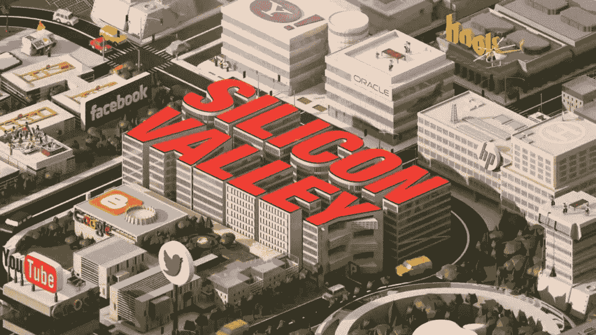
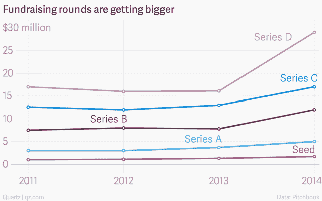
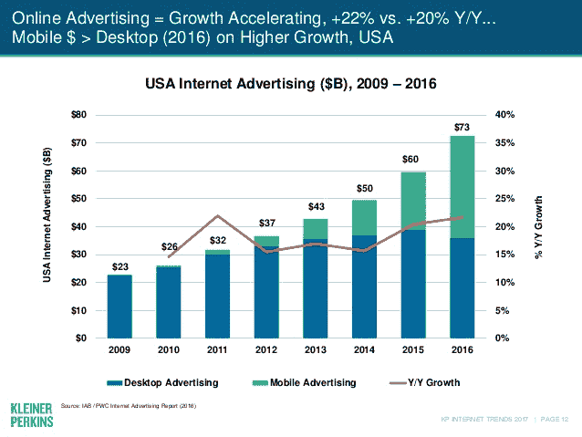
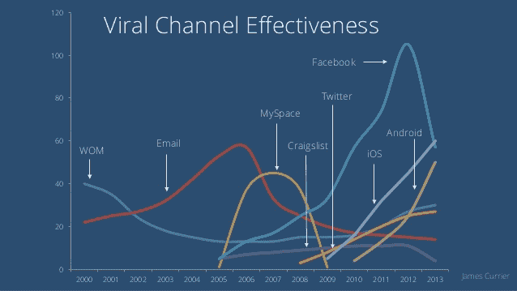

# 创业成本更低，但成长成本更高——这就是安德鲁森的原因

> 原文：<http://andrewchen.co/startups-are-cheaper-to-build-more-expensive-to-grow/?utm_source=wanqu.co&utm_campaign=Wanqu+Daily&utm_medium=website>

创业公司**应该越来越便宜。毕竟，该行业已经掀起了几波创新浪潮，在堆栈的多个层面上支持这一点:**

*   开源软件代替付费开发工具
*   AWS，而不是您自己的数据中心
*   点击广告代替超级碗广告
*   现成的 SaaS 工具与构建自己的工具
*   面向高效全球分发的应用商店

这些趋势不仅降低了制造新产品的成本，在许多情况下，还会将成本降至零。如果我们放大到 AWS /云计算，您会看到大量的竞争是如何导致成本显著降低的——甚至一些供应商免费提供服务:

> 随着云提供商急于建立新的数据中心，争夺市场份额，企业发现将计算和数据存储放入在线云的成本越来越低。根据花旗银行的数据，在过去的三年里，价格下降了大约四分之一；进一步的大幅下跌看起来几乎是不可避免的。一些提供商，如微软，已经开始向初创公司免费提供服务，希望随着他们的成长，将他们转变为付费客户。([经济学家](https://www.economist.com/news/business/21648685-cloud-computing-prices-keep-falling-whole-it-business-will-change-cheap-convenient)

然而，这是正在发生的**与**相反。相反，创业公司正在筹集更多的资本，消耗更多的资本来完成他们的系列投资。构建你的应用程序的 v1 版本可能很便宜，但获得牵引力则完全是另一回事。与十年前相比，获得牵引力的成本越来越高，而与此同时，[的增长因激烈的竞争、整合和饱和而变得越来越困难](http://andrewchen.co/growth-is-getting-hard/)。

**成本上升的原因** 成本上升有两个潜在原因:你的团队的薪资/薪酬，以及增长更多地转向付费收购。前者是显而易见的(尤其是对那些在旧金山付房租的人来说)，而后者更微妙，因为它是由许多行业趋势驱动的。

正如我们已经说过的，[增长变得越来越困难](http://andrewchen.co/growth-is-getting-hard/)，因此，开发新产品的公司正在发展他们的战略，不再依赖传统渠道，如病毒式传播、SEO 和 organic，而更多地转向规模付费收购。尽管在今天的环境下很难获得牵引力，但对于那些达到稳定增长曲线的人来说，风险资本是充足的。这意味着，当公司执行得好的时候，他们就有优势，也有自然的[产品/渠道匹配](http://www.coelevate.com/essays/product-channel-fit-for-growth)付费获取渠道。(想想高 ltv，缺乏广告竞争，善于筹款。)

**结果如何** 随着这种向规模化付费收购的转变，我们看到了伴随成本上升的四种趋势:

1.  创业公司正在筹集更多的资金来获得牵引力
2.  公司更早尝试付费营销
3.  人们越来越重视付费转诊项目，而不是病毒式传播
4.  为了打开付费渠道，公司正在寻求更深层次的货币化

让我们来看看这些趋势。

**1。创业公司正在筹集更多的资金以获得牵引力** 对付费收购的更多关注意味着创业公司需要筹集更多的资金，只有当他们能够证明他们的牵引力时。我们看到越来越多的公司在融资前筹集更多的资金以获得更多的关注，当他们进行新一轮融资时，往往是为了资助更大、更昂贵的有偿收购活动。

根据 Redpoint 的 Tom Tunguz 的分析，在 2010 年至 2016 年期间，种子轮[的中位数从 27.2 万美元增加到了 75 万美元，这种增长也延续到了后面的几轮。所有公司都在筹集更多资金，通常来自非传统投资者，以推动增长，为](http://tomtunguz.com/hardest-round-raise-2017/)[的下一轮融资或退出](https://qz.com/324351/the-new-trend-in-startup-fundraising-fewer-larger-rounds/)(来源:Quartz):

在初始阶段，这些额外的资金能够通过测试和子规模活动来购买早期增长，以补充有机增长。随着公司规模的扩大，这些更大的融资为你赢得了时间和收购资源，来打造一个可防御但昂贵的飞轮。

**2。公司更早尝试付费营销** 更多公司尝试付费收购的好消息是，现在比以往任何时候都更容易尝试付费营销。自助广告系统现在是常态，我们可以从 Snap 和 Quora 等新平台最近推出的自助广告中看到这一点。公司可以更早地测试和掌握付费支出，并以低至 50 美元的预算进行有意义的实验。这允许更早和更好地理解单位经济以及如何优化漏斗中的其他步骤。

> “今天，各种规模的广告商都希望平台能为他们提供一些基本的内置功能:自助服务、超级定位、分析、动态定价。广告平台现在的结构方式允许你用小规模的活动进行小规模的测试。制作创意只需最少的时间，对初创公司和新产品进行测试也非常容易。”

> — [Sriram Krishnan](https://twitter.com/sriramk) ，Snap 的前收入产品，脸书的移动广告平台。

互联网广告行业继续在所有渠道增长。仅脸书的广告客户数量就从 7 个月前的 400 万上升到了最近的 500 万。

这有几个含义。首先，更多的竞争(在总支出和支出者数量上)增加了全球对付费获取的关注。因此，每个人都在增加支出。

**3。更多地强调付费推荐项目而不是病毒式** 病毒式渠道不再像过去那样有效，因为自然生命周期会影响所有获取渠道。今天，在最大的社交网络推出 10 年后，大多数病毒式渠道已经达到顶峰:

随着消息平台的成熟，也许我们会看到这些社交渠道的回归，但与此同时，许多公司正在利用推荐活动来推动他们的收购。付费推荐项目也有助于建立用户参与度，让公司更快地获得网络效应，因为除了带来更多用户，它们还带来更多已经相互联系的用户。

Dropbox 的 give/get 磁盘空间是早期推荐的一个著名例子，但如今，从优步到 Airbnb 的最大公司都在利用推荐程序。

**4。更深入地货币化以打开渠道** 为了支持付费支出的增加，公司需要筹集更多的资金，或者赚更多的钱。因此，我们看到公司为更好的 ltv 进行优化，以证明更高的 CAC 和全面竞争的增加是合理的。

像 Wealthfront、Breather、Credit Karma 和 Gusto 这样的公司在其生命周期的早期都达到了很高的 ltv，这种盈利能力为他们在收购中赢得了竞争优势，因为这些更强的 ltv 为他们提供了更高的 CAC。有趣的是，据说许多金融科技公司获得单个客户的 CAC 超过 1000 美元。

在某种程度上，所有收购渠道都是一个有效的市场，这意味着比竞争对手盈利更好的公司(或者 ltv 更高，或者因为回收期更短)将能够承受更高的 CAC，并在投资上超过竞争对手。简而言之，更好的货币化是增长的竞争优势。

**结论**
当你建立自己的公司时，不要低估不断上涨的分销成本。是的，随着云计算、现成的 SaaS、开源代码以及更精细、更容易实现的绩效营销的发展，一切都变得越来越便宜。但是，由于渠道饱和、更好的竞争对手和整合的赢家通吃平台，增长也变得越来越艰难。

为了在这种环境中保持增长，你需要仔细考虑付费收购、更深层次的货币化，以及如何在这种新环境中竞争:

*   新产品在单位经济上通常是亚规模的，所以它们有负的 LTV:CAC。展示并开辟一条清晰的货币化之路，这样你才能负担得起增长。
*   没有人能够再推迟付费收购，在小预算上测试广告很容易，所以尽可能早地开始。
*   认为推荐项目是另一种形式的付费支出。你有同样的 CAC，但是你没有把钱给脸书或谷歌，而是把价值给了你的用户和他们的朋友。
*   最后，考虑如何通过解决困难的问题和用技术构筑你的护城河来深化差异化。

祝你好运！

**PS. Get new updates/analysis on tech and startups**

我写一份高质量的每周时事通讯，报道硅谷发生的事情，关注创业、营销和移动领域。

在本网站链接的“内容”(包括帖子、播客、视频)中或在社交媒体和其他平台(统称为“内容分发渠道”)中发表的观点是我自己的，并不是 AH Capital Management、l . l . c .(“a16z”)或其各自附属公司的观点。AH 资本管理公司是一家在证券交易委员会注册的投资顾问公司。注册为投资顾问并不意味着任何特殊技能或培训。这些帖子不针对任何投资者或潜在投资者，也不构成出售或购买任何证券的要约，不得用于或依赖于评估任何投资的价值。

内容不应被解释为或以任何方式依赖于投资、法律、税务或其他建议。您应该向您自己的顾问咨询有关任何投资的法律、商业、税务和其他相关事宜。这些材料中表达的任何预测、估计、预测、目标、前景和/或观点可能会在不通知的情况下发生变化，并且可能与他人表达的观点不同或相反。此处提供的任何图表仅供参考，在做出任何投资决策时不应依赖。此处包含的某些信息来自第三方来源。虽然这些信息来自据信可靠的来源，但我并未独立核实这些信息，也未对这些信息的持久准确性或其在特定情况下的适当性做出任何陈述。该内容仅在所示日期有效。

在任何情况下，本网站或相关内容分销渠道上提供的任何帖子或其他信息都不应被解释为 a16z 人员发起、讨论或提及的任何集合投资工具中的任何证券或权益的购买或销售要约。也不应被理解为提供投资咨询服务的要约；投资 a16z 管理的集合投资工具的要约将单独提出，并且仅通过特定集合投资工具的保密要约文件提出，这些文件应完整阅读，并且仅提供给符合联邦证券法规定的特定资格的人。这些投资者被定义为合格投资者和合格购买者，通常被认为有能力评估潜在投资和财务事项的优点和风险。不能保证 a16z 的投资目标会实现或投资策略会成功。对 a16z 管理的投资工具的任何投资都包含很高的风险，包括损失全部投资金额的风险。提及、提及或描述的任何投资或投资组合公司并不代表 a16z 管理的所有投资工具，也不能保证这些投资将会盈利，也不能保证将来进行的其他投资会有类似的特征或结果。a16z 管理的基金所做的投资清单可在 https://a16z.com/investments/.获得。该清单不包括发行人未允许 a16z 公开披露的投资以及对公开交易的数字资产的未宣布投资。Andreessen Horowitz 投资、集合投资工具或投资策略的过去结果不一定代表未来结果。请参见[https://a16z.com/disclosures](https://a16z.com/disclosures)了解更多重要信息。