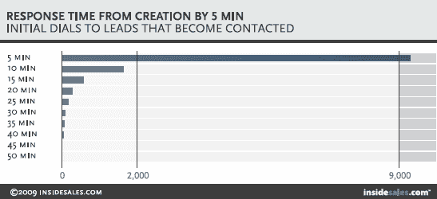

# 为什么 Twilio 的 530 亿美元机会面临风险，以及赢得机会的 3 种方式

> 原文：<https://exponents.co/twilio-market-opportunities-risks/?utm_source=wanqu.co&utm_campaign=Wanqu+Daily&utm_medium=website>

虽然 Twilio 是这篇文章的重点，但这篇文章不仅仅是关于 Twilio 的。

它可能是关于任何具有潜在颠覆性的公司，有杰出的创始人、风险投资规模的雄心、伟大的产品、一流的团队和为之献身的动力。

可能是关于你的。

*披露:2010 年至 2011 年，我在 Twilio 公司担任第一任产品营销人员。我目前没有公司的任何股票。*

Twilio 仍然是一家相对年轻的公司。它还没有盈利，而且当它的目标是成为一个可持续发展的企业时，它面临着一些严重的风险。

根据我对[公司最近的 10-K 年度报告](https://investors.twilio.com/financial-information/sec-filings/sec-filings-details/default.aspx?FilingId=11873110)的阅读，Twilio 的管理团队意识到了其中的许多问题。以下是他们阐述的三个最大的风险:

1.  Twilio 的收入严重依赖少数客户。根据 Twilio 的 2016 年 10-K，其 10 大客户占其总收入的 30%。其最大的两个客户(优步和 WhatsApp)贡献了 Twilio 2016 年收入的近 20%。WhatsApp 没有长期合同，可以随时离开，而优步可以大幅减少支出而不会受到惩罚。
2.  市场可能不会“明白”来自 Twilio 的 10-K:“开发人员和组织利用 API 将通信功能构建到他们的应用程序中仍然是相对较新的事情，开发人员和组织可能还没有认识到我们的产品和平台的需求或优势。”
3.  该公司几乎没有向企业销售的专业知识。更多来自 10-K 的信息:“过去，我们的大部分收入都依赖于软件开发人员通过我们的自助服务模式采用我们的产品，而我们目前只有一小部分收入来自企业客户…我们向企业销售的经验有限，直到最近才建立了一支以企业为中心的销售队伍。”

然而，我对同一份文件的阅读表明，该公司没有包括三项风险:

1.  Twilio 可能没有完全把握住面前 535 亿美元机会的本质。
2.  该公司似乎还没有制定出抓住这些机会的令人信服的战略。
3.  领导层可能不知道#1 和#2 的原因，也不知道该怎么做。

这三个问题可能是最大的风险..

在本文的后面，我将解释这 535 亿美元的机会来自哪里，并提出 Twilio 可以利用它们的三条潜在途径。

但就目前而言，重要的是要理解 Twilio 最初是如何取得目前的优势地位的，以及为什么它的上市战略和公司文化现在可能会阻碍它。

#### 要了解 Twilio 对开发者的关注，就需要了解它的起源故事

在 Twilio 的早期，多个天使投资人和风险投资人告诉 Twilio 的创始人，专注于软件开发者永远不会带来风险投资规模的业务。为了证明他们的观点，Twilio 的怀疑者指出，软件开发人员无法控制企业的预算。

但是劳森、库克和沃尔修斯没有被吓倒。他们深信软件开发人员掌握着未来的钥匙……不仅仅是电信，也许是整个世界。

他们勇往直前，最终从一群天使投资人(包括克里斯·萨卡、戴夫·麦克卢尔、米切尔·卡普尔和马努·库马尔)和一个风险投资人(贝塞麦风险投资伙伴的拜伦·迪特)那里获得了 100 万美元的种子资金。

在 Jeff 的领导和 Twilio 的第一位员工 [Danielle Morrill](https://www.linkedin.com/in/daniellemorrill/) (现任首席执行官和 [Mattermark](http://mattermark.com) 的联合创始人)的管理下，该公司建立了初创公司世界上最有效的开发者营销计划。

具体来说，Twilio 雇佣了一个开发人员传道者的巡回团队，赞助黑客马拉松，在网站上发布世界一流的文档，并在博客上提供深入的编码教程。

在 2010 年 Twilio 赞助的 TechCrunch Disrupt NY 黑客马拉松期间，Jared Hecht 和 Steve Martocci 使用 Twilio 的 SMS API 设计了一个群组消息应用的原型，这种以开发者为中心的策略[获得了巨大的回报](https://techcrunch.com/2010/08/26/inception-a-hackday-dream-the-story-of-groupme/)。

这款应用名为 GroupMe，后来筹集了 1145 万美元，成为 Twilio 当时最大的单一客户——到目前为止。

尽管 GroupMe 最终以超过 3000 万美元的价格卖给了 Skype，离开了 Twilio，并逐渐变得无关紧要，但对于 Twilio 的目标市场创业软件开发人员来说，它是一个极具吸引力的故事。

在 Twilio 第一届开发者大会的黑客马拉松上，蒂亚戈·帕瓦和克里斯蒂娜·冯内斯卡最终完成了基于云的呼叫中心软件原型，他们称之为 TalkDesk。

TalkDesk 在大会上赢得了现金奖，迅速从 500 家初创公司筹集了 45 万美元的天使轮投资，并继续成为一个高速增长的成功故事。

自从 20 多名天使投资人和风险投资人告诉 Twilio 的创始人专注于开发者是一条死胡同以来的九年里，该公司收购了超过 28，000 名付费客户，筹集了 2.337 亿美元的风险资本，并在纽约证券交易所进行了近 20 亿美元的首次公开募股。

此外，Twilio 的首次公开募股发生在 2016 年——这一年，一家价值 10 亿美元的科技“独角兽”损失了一半的价值，另一家以低于其筹集的价格被收购，第三家变成了穿着独角兽服装的跳蚤缠身的狗。

怀疑者错了:你可以建立一个专注于软件开发者的风险企业，杰夫·劳森、约翰·沃尔修斯和埃文·库克就是这样做的。

#### 朱棣的历史文化如何造就战略惯性

Twilio 通过专注于开发者，从无到有，再到 IPO。杰夫·劳森(Jeff Lawson)和他的联合创始人取得了成功，尽管早期的怀疑者警告他们这永远不会成功。

以这段历史为例，融入 Twilio 深厚的工程驱动型文化，并将其与创始人对开发人员受众的天然亲和力融为一体，Twilio 最新的年度报告强调开发人员优先的战略高于一切也就不足为奇了。

事实上，该报告明确指出“我们的走向市场模式主要关注于达到和服务于开发者的需求。”与此同时:

*   **单词“developer”在文档**中出现了 114 次。其中 13 起发生在报告的开头部分。
*   **Twilio 围绕开发人员定义了其使命陈述和价值主张**:“我们让开发人员能够在软件应用中构建、扩展和操作实时通信。”
*   **该公司在“增长战略”部分将“发展我们的开发者社区并加速采用”列为其第二号优先事项**，就在“继续大力投资我们的技术平台”之下

虽然我不知道领导团队目前的想法，但报告的内容强烈表明，他们认为 Twilio 的公司和产品是由开发人员为开发人员打造的……句号。

对 Twilio 开发人员优先方法的不懈关注不仅仅是自上而下的战略重点:它深深植根于公司文化中。看看 2016 年 10 月的这篇 Glassdoor 评论:

虽然来自当前员工的 Glassdoor 评论不一定是了解一家公司文化的清晰窗口，但这一条听起来是真实的:非技术人员搞乱 Twilio 氛围的感觉很小，但在五年前很明显，当时我是该公司的第一名产品营销人员和第 50 名员工。

虽然在我心理发展的那个阶段，我是一个大声的，不礼貌的，过于咄咄逼人的存在(我退休后的“善意但被误导的混蛋方法”)，我经常有一种感觉，这不仅仅是我。Twilio 的大部分普通员工似乎认为所有非技术业务员工都是不方便的必需品。

#### 为什么创造惯性的力量已经从资产变成了风险。

公司文化倾向于发展自己的集体免疫系统，这些免疫系统自然会对威胁改变事物方式的想法和人做出攻击性和敌意的反应。

对于 Twilio 来说，长期以来，专注于开发者的走向市场战略一直是一种方式。它有公司起源故事的支持，也有其背后根深蒂固的工程驱动文化的影响。

让我们明确一点:坚持不懈地关注开发人员对 Twilio 来说至关重要，他的成功依赖于公司构建开发人员喜爱的 API 和 SDK 的能力。

但现在，赋予当前“开发者优先”战略惯性的历史和文化有可能从无价的资产转化为潜在的负债……因为目前，Twilio 面前至少有 535 亿美元的市场机会，坚持下去将使整个工具包处于风险之中。

这是因为大部分 535 亿美元的机会都集中在大企业中，软件开发人员通常不是经济决策者。

具有讽刺意味的是，这正是 Twilio 早期怀疑者的正确之处:**试图通过在大企业工作的开发人员销售大企业交易是一种失败的策略**。这些怀疑论者错在怀疑该公司无论如何都能退出。

更具体地说:通过构建一套非常强大但简单的 API 和 SDK，并向软件开发人员大力宣传，Twilio 实现了近 3 亿美元的年收入和 20 亿美元的首次公开募股。

它在相当简单的用例和更复杂的点解决方案的基础上实现了这两个里程碑。

但是达到 3 亿美元的年收入却没有利润，和达到 100 亿美元/年却有很多利润是完全不同的。要达到 100 亿美元甚至更高，使用案例和单点解决方案是不够的。

#### Twilio 最大的错误:将早期用户和主流市场混为一谈

为了理解为什么 Twilio 的开发者优先走向市场战略将价值 535 亿美元的市场机会置于风险之中，让我们回忆一下杰弗里·摩尔著名的技术采用“鸿沟”模型。又来了:

现在，Twilio 在鸿沟的左边。在过去的 10 年里，它成功地主导了云通信平台“早期采用者”的市场。

鉴于 Twilio 的产品组合由 API 和 SDK 组成，其自然的早期采用者是软件开发人员、科技初创公司和大公司中精通技术的产品团队。

但一般来说，这些早期采用者已经使用其 API 和 SDK 来增强他们自己的 SaaS 产品中的电信功能，并构建应用程序、工具和解决各种战术问题的点解决方案。

在前者中，你可以看到 Twilio 为 SaaS 的产品提供语音和短信功能，如 [TalkDesk](http://talkdesk.com) 、 [RingDNA](http://ringdna.com) 和 [Zendesk Talk](https://www.zendesk.com/talk/) 。在后者中，你会看到构成 WhatsApp 和优步主要用例的“电话号码验证”、“调度通知”和“屏蔽电话号码”。

但是大游戏(我一直在说的价值 535 亿美元的游戏)不在早期采用者细分市场。它跨越了鸿沟，进入了主流市场。对于 Twilio 来说，主流将是企业。

但在企业中，Twilio 的潜在收入和利润以数十亿计，潜在客户需要完整的解决方案来解决他们巨大而昂贵的战略问题。

这又是一张鸿沟图，包括了一些特定于 Twilio 的细节:

虽然 Twilio 已经取得了一些有前途的进展，但试图说服价值数十亿美元的公司的决策者在一堆 API 和 SDK 的基础上建立完整的解决方案来解决他们最大的战略问题是一件非常困难的事情。

事实是，这些市场的决策者并不真正关心一个 API 或 SDK 是否设计精美、使用简单。

这些是每年销售额数亿、数十亿、数百亿甚至数千亿美元的公司的首席执行官、高级副总裁和副总裁。他们中的许多人甚至不知道“API”或“SDK”是什么意思。

虽然大公司的决策者可能会向公司的软件开发人员和产品团队寻求意见，但他们最终关注的是一系列完全不同的问题、愿望、目标和风险。

更具体地说，与这些产品是否能够带来巨大的节约、创造巨大的流程效率、打开主要的新收入流和释放巨大的新利润相比，Twilio 产品的技术细节对大公司高管来说毫无意义。

I'm not sure the CEO of a Fortune 500 would get this.
Photo Credit: Ed Yourden/Flickr

为了进入其自然主流市场并赢得其价值的重要份额，Twilio 需要找到一种可靠、可重复、可扩展的方式来帮助他们完成所有这些事情。

虽然我总是愿意被证明是完全错误的，但我非常怀疑开发者优先的上市策略能否奏效。

幸运的是，Twilio 至少有三种方法可以调整其走向市场战略，以服务于其天然的主流客户，为他们提供他们所需的完整解决方案，并在此过程中赢得 535 亿美元的市场机会。

然而，在我们去那里之前，让我们给我提出的这些“535 亿美元”的说法添加一些内容。

## 等待跨越鸿沟的 535 亿美元市场

摆在 Twilio 面前的 530 亿美元的市场机会是一个巨大的现有市场和没有现有解决方案的新市场的混合体。

鉴于 Twilio 的核心产品提供语音、短信和视频会议功能，让我们从这些功能易于应用的现有市场开始:

#### 统一通信和企业协作(350-500 亿美元)

统一通信是“将电子邮件、消息传递、语音、网络和视频会议结合成单一解决方案的协作软件”的一种奇特的、企业级的说法

来自 Global Market Insights [的分析师预测，到 2023 年，全球统一通信市场将从 2016 年的 348 亿美元增长到 960 亿美元](https://www.gminsights.com/industry-analysis/unified-communications-market-report)，其中“基于云的统一通信”部分预计将以 16%的 CAGR 增长。

Gartner 更加保守。他们的分析师认为，目前的 UC 市场日益成熟，在未来几年内将以不到 1%的 CAGR 增长。但他们也看好云软件，并预测基于云的会议将增长 8.1%，云电话将增长 12.5%。

统一通信领域的大玩家是思科 Spark、微软的 Skype for Business(该软件前身为 Lync)和 Mitel。Avaya 曾经是一名球员，但在 2017 年 1 月申请了第 11 章保护。

就像提供这些产品的庞大笨重的庞然大物一样，领先的统一通信解决方案往往功能强大但笨重、昂贵、难以集成，而且包装和信息混乱。有些(尤其是 Skype For Business)还长期存在视频和音频质量问题。

考虑到统一通信的整个目的是促进全球公司的协作和提高员工的工作效率，与其他任何东西都不能很好地互操作并且存在长期音频和视频问题的笨重软件似乎不太理想。

事实上，整个市场似乎已经到了颠覆的时候了。

#### 联络中心和客户服务(到 2022 年达到 150-240 亿美元)

包括服务和软件在内，联络中心解决方案的全球市场规模庞大(2015 年为 40-50 亿美元)，增长迅速(2022 年前为 22%的 CAGR)，且严重分散。

要了解呼叫中心市场的现状和原因，了解其中涉及的内容会有所帮助。首先，有呼入呼叫中心(代理人接听销售和支持电话)、呼出呼叫中心(代理人拨打销售和讨债电话)以及两者兼而有之的呼叫中心。

一些大公司运营自己的呼叫中心，而另一些公司将部分或全部业务外包给称为业务流程外包(BPOs)的供应商。

除了 CRM 之外，呼叫中心的软件基础设施由一系列不同的、相互关联的组件组成。

以下是与本文相关的部分:

*   **电话系统**。PBX 是公共交换分机的简称，它处理联络中心与电信网络的连接或使用 VoIP。它还管理所有联络中心电话的电话号码和/或分机。每个进出的电话都要经过它。
*   **一个自动呼叫分配器**。在呼入呼叫中心，ACD 会将来电路由至联络中心座席。在最简单的层面上，ACD 的工作是尽快将呼叫者与第一个可用的代理连接起来。在更复杂的情况下，自动呼叫分配器还可以根据座席的技能或呼叫者的具体情况和需求来转接呼叫。
*   **交互式语音应答系统(IVR)** 。IVR 是这样一种机器，当你打电话给一家公司寻求支持时，它会接电话，然后问你打电话有什么事。一个简单的 IVR 就像一个“自动话务员”，告诉你“按 1 销售，按 2 支持。”但是在更复杂的环境中，IVRs 将在通过 ACD 路由呼叫之前收集更多的数据。这可能包括在 CRM 中查找您的电话号码，或者询问您的帐号、生日或社会保险号的最后 4 位数字。
*   一个计算机电话集成(CTI)。顾名思义，CTIs 将电话系统(PBX)连接到代理的计算机。当 ACD 将呼叫路由到特定座席时，CTI 会从 CRM 和 IVR 中提取呼叫者的相关数据，并将其显示在座席的屏幕上。
*   **通话录音软件**。如果你在给企业打电话时听说过“为了质量和安全起见，这次通话可能会被录音”，那就是通话录音软件要起作用了。电话录音使呼叫中心经理能够记录每个代理与客户的互动。这些录音可用于培训、争议解决和纪律目的。
*   **预测拨号器**。预测拨号器用于大容量呼出呼叫中心，通过电话号码列表系统地拨号，检测占线信号和应答机。当有人接电话时，拨号器会立即将他们连接到代理。预测拨号器消除了代理自己拨打电话的需要，使他们能够将 100%的时间集中在主要任务上。

思科、Genesys 和 Avaya 是这里的现任者，他们的解决方案通常将上述所有组件结合在一个有点花哨的屋顶下。

但是，已经运行了很长时间的联络中心业务通常是通过购买和集成来自各种不同供应商的部分或全部组件来拼凑“完整的解决方案”。

无论是哪种情况，结果都是一个混乱、分散的市场，充斥着昂贵、不灵活的“解决方案”，无法适应 21 世纪快速变化的需求和挑战。

这是另一个渴望颠覆的市场。

这些是现有的市场。新的呢？

#### 物联网(35 亿美元、70 亿美元、4700 亿美元或 32 万亿美元)。

在消费领域，物联网(IoT)被过分夸大了。除了广受欢迎的 Nest 恒温器，物联网的大肆宣传的消费者应用程序迄今为止都是一纸空文。

事实证明，大多数人看不到联网洗衣机、咖啡机或烤面包机的价值。长期承诺的“冰箱知道你的牛奶什么时候坏了，并从商店订购更多的牛奶”既无处可寻，也不值得怀疑。

但在企业中，物联网有着巨大的、极具价值的应用，这些应用既未被开发，也鲜为人知。

那么，在未来几年里，这些应用程序的全球潜力有多大呢？这取决于你问谁。预测范围从  [到 2020 年 35.6 亿美元，CAGR](http://hk-iot-conference.gs1hk.org/2016/pdf/_04_Mc%20Kinsey%20-%20(Chris%20Ip%20)%20ppt%20part%20%201%20_IoT%20-%20Capturing%20the%20Opportunity%20vF%20-%2021%20June%202016.1pptx.pdf) (麦肯锡)到[到 2020 年 70 亿美元，CAGR](https://www.idc.com/prodserv/IDCdigitalHub/info.jsp?title=IDC+Market+in+a+Minute%3A+IOT&src=idc_market_in_a_minute_iot_infographic.png) (IDC)，到 2020 年 4700 亿美元(贝恩&公司)，到 2025 年 32 万亿美元，其中 70%将用于 B2B 解决方案(通用电气)

所以你有它。仅根据对这些市场机会的保守估计，Twilio 已做好准备，在未来 5 年内进军价值约 535 亿美元的市场。

但就我的品味而言，仅仅说这些机会存在是有点夸张的。具体来说，以下是 Twilio 在这些市场中具有引人注目的竞争优势的原因，以及它可以提供的一系列解决方案和实现这些目标所采用的三种不同的上市策略。

## Twilio 的 4 大竞争优势

在我们深入了解每个市场的具体情况之前，让我们先来看看 Twilio 在所有这些市场中相对于现有和潜在竞争对手的高度优势。

#### 主要优势#1:市场领先的产品组合

Twilio 产品组合的原始成员是其语音、短信和彩信 API 及其 Twilio 客户端软件开发工具包(SDK)。所有这些产品都将过去复杂的技术和运营挑战抽象化了。

具体来说，Twilio 的核心 API 和客户端 SDK 使软件开发人员可以轻松地将语音通话、文本消息和图片消息功能构建到他们的 web 和移动应用程序中……而无需购买复杂的硬件、与电信运营商谈判交易、签署合同或预先花费一分钱。

在此基础上，Twilio 增加了视频会议和 IP 消息 SDK。与之前的语音和文本消息 API 和 SDK 一样，Twilio 的可编程视频和可编程聊天 SDK 简化并加速了构建、推出和扩展新通信功能和产品的过程。

Twilio 的语音、短信和彩信 API 及其客户端、视频和聊天 SDK 构成了该公司的核心产品，但它们远非全部。事实上，正是 Twilio 的弹性 SIP Trunks、TaskRouter API 和可编程无线服务使该公司能够抓住这 535 亿美元的市场机会。

因为尽管它们的名字令人生厌、晦涩难懂，但这些产品是潜在的游戏改变者。

##### SIP 泳裤很无聊，但是 Twilio 的弹性 SIP 泳裤很赞

在高层次上，SIP 中继将基于硬件的商务电话系统连接到互联网，允许它使用 VoIP 而不是传统的电话网络来拨打和接听电话。

传统的 SIP 中继供应商通常提供他们的 SIP 中继服务，带有许多问题、难题和附加条件。

*   缓慢的部署。大多数供应商的 SIP 中继需要几天或几周的时间来提供和设置。
*   **一揽子交易**。许多 SIP 中继提供商也试图向您销售完整的电话系统，包括所有的费用、流程问题和风险。'
*   **经常性和前期成本**。大多数 SIP 中继供应商对每个中继收取月费，并坚持要求您购买最低数量的中继才能开始使用。

与大多数竞争对手提供的 SIP Trunks 不同，Twilio 的[弹性 SIP Trunks](http://twilio.com/sip-trunking) 可以即时供应:或者通过 API 编程，或者在 web 界面上点击几下。

该产品允许企业向其呼叫中心或商务电话系统添加无限容量、故障转移功能、SMS、MMS 和无硬件呼叫记录功能，而无需拆除和更换任何现有基础设施。

最值得注意的是，Twilio 的现收现付定价模式使得在投入大量资金和致力于大规模流程转型之前，可以对一切进行原型设计和测试。

我将在下面更深入地解释为什么这很重要。现在，让我们继续讨论 TaskRouter。

##### Twilio 的 TaskRouter API 非常出色

为了在最基本的层面上理解 TaskRouter API :想象一下你给一家正在做生意的公司打电话，得到带有自动菜单选项的机器，按“3”寻求技术支持。

当您按下“3”时，电话系统会将您转到等待技术支持的人群中(“呼叫队列”)，在那里您的呼叫会被第一个有空的代理接听。

在 Twilio 推出 TaskRouter API 之前，任何人想要编写能够以这种简单的方式路由呼叫或消息的软件，都必须从头开始构建所有的逻辑。

但是就像每一个 Twilio 构建的 API 一样，TaskRouter API 将几乎所有涉及的编码工作提取到一个超级简单的命令集中。

尽管 TaskRouter 很简单，但它可以处理比上述基本工作流程复杂得多的工作流程。事实上，TaskRouter API 促进的许多工作流可以创造巨大的价值。

我们将在后面更深入地讨论这些内容。

现在，让我们看看 Twilio 产品组合中的最后一块，它可以帮助它获得我一直在谈论的 535 亿美元市场机会中的大部分:可编程无线。

##### 可编程无线是 Twilio 进入多个即将繁荣的物联网解决方案的潜在入口。

[可编程无线](https://twilio.com/wireless)支持软件开发人员通过预先连接到 Twilio 的 API 和 SIM 卡购买、激活和管理 LTE 无线接入。

目前的产品仍然相对不成熟:连接只通过一家运营商(T-Mobile)提供，而且只在美国。

但是，如果 Twilio 扩展它，任何拥有软件开发人才的人都将能够使用可编程无线技术快速原型化、测试、推出和扩展一系列联网设备、产品和服务，这些设备、产品和服务可以在 LTE 覆盖的任何地方工作。

这开启的可能性是巨大的。

我将很快对此进行更多的阐述。现在，让我们来看看 Twilio 的其他核心优势。

#### 主要优势#2:近乎完全的灵活性和适应性

大多数内部解决方案和每个 SaaS 产品(甚至像 Salesforce 这样高度可定制的产品)都对公司购买和集成它施加了很大的限制。

这是由设计决定的:建立一个可扩展和盈利的软件业务需要某种程度的标准化。这通常意味着通用的接口约定和有限(即使很大)范围的潜在配置、集成和工作流。

要实施来自内部或 SaaS 供应商的新解决方案，相关公司必须调整、重新配置或淘汰并替换大量现有流程和基础架构，以适应其购买的软件中的设计、集成和工作流约束。

人们可以通过第三方的附加产品和补充解决方案来解决核心产品的一些限制和缺点。(想想:Marketo 和 Salesforce)。

但即便如此，您仍然需要将来自不同供应商的一系列产品(每个产品都有自己的界面、工作流和数据库)拼接成一个完整的解决方案。

尽管存在权衡和争论，这些解决方案仍然能够(并且经常)带来投资回报。但它们也推高了成本，增加了风险，延长了推出时间，并导致投资需要更长时间才能收回。

但是像 Twilio(行话是[平台即服务](https://en.wikipedia.org/wiki/Platform_as_a_service)，或 PaaS)这样的平台优先服务没有这样的限制。

在拥有正确计划的正确人员手中，像 Twilio 这样的平台优先产品允许公司构建和定制符合公司流程、人员和工作流的解决方案，而不是相反。

它们提供了完全定制软件的优势，没有冗长的上市时间，也没有高昂的维护和升级成本。

对于较小的公司，这种灵活性和适应性可能不值得与现成的东西进行权衡。但对大公司来说，这是一个游戏规则的改变。

#### 主要优势#3:不需要淘汰和更换。

如今，贯穿企业世界的一个热门词汇是“[数字化转型](https://en.wikipedia.org/wiki/Digital_transformation)”

许多大公司的高管都充分意识到，他们正面临着一个不断被科技初创公司和精通科技的竞争对手破坏的世界。他们知道数字技术有望带来数十亿美元的潜在节约和新的收入来源。

但他们也知道，实施必要的技术和流程变革非常困难，非常昂贵，而且充满风险。(记住:大公司都是人类在经营，人类通常都想保住自己的工作。)

倡导并推出一个脱轨的“数字化转型”项目，是让你的公司损失数百万或数千万美元，同时丢掉轻松的高管或副总裁职位的一个好方法。

考虑到这些风险，Twilio 产品及其定价模式最引人注目的优势之一是，它允许公司从小规模起步，并按照自己的速度扩张。

在实践中，这意味着如果一家公司已经向其现有系统投入了数百万美元，而高层领导还没有准备好全部投入 Twilio 和云，那么它可以简单地使用 Twilio 的弹性 SIP Trunks 来构建新的解决方案原型，或者扩展和改进其现有的基础设施，与“推倒重来”的替代方案相比，成本更低，风险也更小。

因此，如果你是一名副总裁，认为从集中式呼叫中心运营转向虚拟化运营将解决一些巨大的问题，但不想拿自己的工作冒险，那么你可以使用 Twilio 进行小规模测试。

如果测试获得了很好的结果，你可以回到高管层，向他们展示你的虚拟呼叫中心实验在他们关心的指标上表现得有多好。

#### 主要优势#4 基础设施、冗余和可扩展性。

甚至在五年前，当我还在那里工作时，Twilio 的后端基础设施可以毫不迟疑地处理需求的大幅增长。

但当时，Twilio——基于 AWS——只在一个 AWS 区域运行。因此，即使 Twilio 自己的架构坚如磐石，它仍然容易受到公司控制之外的本地化 AWS 中断的影响。

但在我离开公司的 5 年里，Twilio 创造了更多的弹性和冗余。它现在在全球五大洲 7 个地区的 22 个数据中心运营。

现在，即使北弗吉尼亚地区的所有 AWS 数据中心同时停机，Twilio 也可以将负载重定向到其他 6 个地区，从而大大降低服务中断的可能性。

这种可扩展性、冗余性和弹性在企业环境中是必不可少的，尤其是当您谈论任务关键型应用程序和工作流时。沿着这条轴线，没有一家“电信 API”公司能与之匹敌。

虽然 Twilio 还有其他一些优势，但这四个优势足以让他们在相关市场中占据引人注目的优势。

但是解决方案本身呢？

## Twilio 对大市场中一些重大问题的引人注目的解决方案

#### 对于联络中心

##### 问题:联络中心有一个留住代理的主要问题。

You'd quit, too.

虽然呼叫中心市场不乏昂贵的大问题，[其中最大的](http://www.icmi.com/Resources/People-Management/2013/10/The-Big-Payoff-Investing-In-Your-Agents-Success)是听起来很无聊但实际上相当人性化的“代理保留”问题

这里有一些关于联络中心的奇怪事实:

*   美国的大多数呼叫中心都位于大型仓库式建筑中，有一排排的小隔间，自然光很少。
*   代理每天往返工作的时间可能是单程 30 分钟到 2 小时。
*   如果他们在呼入联络中心工作，他们接听沮丧、愤怒和孤独的客户的电话每小时可以得到 10-16 美元的报酬
*   在 at outbound contact center，他们通过销售或讨债电话打断人们的工作，获得相同的报酬，这让许多人变成了愤怒、沮丧的自己。

这里有一个观点可能会让任何人都感到震惊:

很少有人愿意每天花 1-4 个小时坐在工业照明的隔间仓库里，接听沮丧、愤怒和/或孤独的人打来的电话——同时被要求遵循严格的脚本并保持积极的态度。

即使他们经常需要钱，许多联络中心代理发现这种情况如此令人沮丧，以至于他们辞职或他们的生产力崩溃，他们被解雇。

结果是，联络中心代理的平均流失率在 30%到 50%之间，每个退出或被解雇的代理都会给公司造成 5000-15000 美元的损失。

##### 解决方案:从集中式呼叫中心转向虚拟(“在家”)代理

面对集中式呼叫中心运营的高劳动力成本和巨大的流失率，大公司基本上有三种选择:

1.  **外包**。有许多海外市场有很多会说英语的人，但劳动力成本低得多，他们会愿意接受所有这些好的美国工作。当然，缺点是来自阿肯色州的客户 Bob 在支持电话中听到印度或菲律宾口音时会生气。还有:川普。
2.  **自动化**。虽然这方面的时间跨度更长，但中期未来可能会有大量语音助理机器人愿意承担所有这些美好的美国工作。不利的一面是，这项技术还有很长的路要走，你会助长机器人主导的失业热潮。
3.  **走虚拟路线。**这是一个有点违背直觉的选择:将你的呼叫中心运营留在美国，但将你的电话系统放在云端，让你的代表在家工作。凭借一台价格为 70 美元的低端 Chromebooks 和一个价格为 20 美元的完美 USB 耳机，您可以在家中部署代理，而设备中每个代理的价格不到 100 美元。

另一个观点可能不会让任何人感到震惊:当人们不必花 1-4 个小时坐在仓库的隔间里，而是可以呆在家里，花更多的时间与家人在一起时，他们会更愿意忍受愤怒的客户打来的电话和用脚本回复的苦差事。

事实上，简单地分散呼叫中心运营并[允许代理在家中工作可以减少 30-50%的人员流失](https://ww2.frost.com/files/7314/0985/8803/At-Home_Agents_A_Model_for_the_Future.pdf)，提高 10-20%的代理生产率，并在许多其他方面降低成本。

与此同时，当联络中心是虚拟的，招聘池不再受地理位置的限制。一家公司可以将搜索范围扩大到不同的时区，而不必非得在自己的隔间仓库的车程范围内寻找候选人。

有了 Twilio，一家可能希望通过虚拟化来大幅减少联络中心代理人员流失的大型企业可以缓慢地启动这一过程，将 Twilio 的[弹性 SIP 中继](https://www.twilio.com/sip-trunking)、其 [TaskRouter API](https://www.twilio.com/taskrouter) 和其[可编程语音](https://www.twilio.com/voice)产品结合在一起，通过 Twilio 路由一小部分业务量，而无需剥离任何东西。

#### 用于管理企业资产

##### 问题:用模拟系统和流程管理企业资产很糟糕(时间)。

企业资产管理是软件、人员和流程的行话，大公司使用它们来编目、跟踪、维护、升级和替换他们的资本设备。

在世界上最大的行业(能源、航空、国防、建筑、航运、制造等)的许多公司中，这些流程长期以来都围绕着文书工作、数据输入、来回电话、传真和其他手动任务的混乱组合。

正如你可能想象的那样，所有这些占用了大量本可用于更高杠杆工作的时间。

但是，由于这些行业的技术限制和缓慢的变革步伐，模拟仍然是做事的方式。

##### 解决方案:数字化、简化和/或自动化其中的大部分

如今，智能手机、平板电脑和物联网技术可以将各种各样的模拟过程数字化、简化和自动化，创造真正巨大的效率和节约。

即使没有增加任何新产品，Twilio 在所有这些方面已经有了重要的潜在作用。具体来说，Twilio 的[可编程无线](https://www.twilio.com/wireless)及其各种 API 和 SDK 的巧妙应用可以极大地简化、精简和自动化几乎所有相关的通信工作流程。

当我在 Twilio 从事产品营销工作时，这类事情的一个小例子就摆在我们面前:一家领先的软饮料公司正在推出其最新款的自动售货机，这是一种看起来很前卫的装置，可以让喝汽水的人制作自己的混合饮料。

每台新机器都配备了车载诊断软件和无线互联网连接。这有点像一台新的惠普打印机，当供应不足时，它会自己订购墨水，这些自动售货机可以跟踪他们的苏打水供应量，还可以告诉他们什么时候出现了故障或其他问题。

通常情况下，如果汽水自动售货机需要关注，车载软件会在软饮料公司的 IT 服务管理应用程序中创建一张新票。那张票会被添加到其他票的列表中，直到有人注意到。

这个过程是有效的，但是它本质上是被动和缓慢的。

因此，该公司的系统集成供应商在 Twilio 上构建了一个通知和上报工作流。现在，每当这些自动售货机中的一台需要补充或维护时，当地服务公司会立即收到一条短信或一个电话，告知详细信息……无需人工干预。

同样的核心机制——使用软件支持的通信来实现前瞻性和预测性的维护和支持——适用于世界各地办公室、工厂和机场停机坪中各种低效的人工流程。

随着越来越多的办公设备和工业机械连接到互联网上，创建响应速度更快的支持和销售流程的机会越来越大。

事实上，由 Twilio 支持的前瞻性和预测性服务和支持实现的转型每年可以在降低维修成本、提高劳动生产率和节省时间方面创造数千亿美元的价值。

##### 让销售团队对合格的呼入销售线索更加敏感

[来自潜在客户行业的研究](http://www.leadresponsemanagement.org/lrm_study)表明，在他们表达兴趣的前五分钟内，通过电话获得合格潜在客户的可能性是最高的。此后，赔率稳步下降，基本上在 25-30 分钟之间崩溃:

目前，大多数潜在客户工作流程的速度都比这慢得多。但是有了 Twilio 的 TaskRouter，这个问题的软件方面并不太难解决。

以下是高质量潜在客户的工作流程示例:

*   你网站上的某个人填写了一张联系表。根据你的 CRM/营销自动化应用程序中的数据，他们已经消费了你的大量内容，访问了你的定价页面，并观看了演示视频。
*   根据这些数据，他们可能是强有力的领导者，TaskRouter 向团队中资格或成交率最高的可用 SDR 或客户发送短信或电话。
*   如果是电话，销售代表会接听，Twilio 的文本到语音引擎会向他们读出新线索的详细信息，然后要求他们按 1 接受，或按 2 拒绝。
*   如果代表按 1，Twilio 会拨打请求联系的人，并在通话双方之间架起桥梁。
*   如果是短信，系统只需将销售线索的详细信息发送给销售代表，并提供一个可点击的电话号码。
*   与此同时，您希望向初级销售代表展示您的高绩效销售代表是如何处理大量销售线索的，因此您使用 Twilio 的电话录音功能来记录电话。
*   通话结束后，系统会录制录音，并将音频和录音附加到 CRM 中的客户记录中。

用现成的 SaaS 产品实现这种工作流通常需要将许多不同的应用程序拼接在一起，这很快就会成为一个令人头疼的问题。有了 Twilio 这样的 PaaS 产品，事情就简单多了。

##### 当潜在客户来电时，给予销售代表更多的洞察力

在硅谷，把一个电话号码放在你的网站上，另一端是一个活生生的人，这种想法通常被认为是非自愿承诺的理由。然而，这就是世界上大多数其他国家喜欢做生意的方式。

但是当你的网站上有一个“传统的”电话号码时，当有人打电话时，你得到的主要信息就是你可以从他们的电话号码中得到的任何信息(如果你的 CRM 中有这个号码的话)。

但有了 Twilio，你有了更好的选择:

*   **一键通话**。使用 Twilio Client，您可以让拥有现代浏览器的人直接从他们所在的网页拨打电话。接听电话的销售代表会确切地知道他们打电话时正在看哪一页。如果你聪明地实现它，销售代表也会确切地知道他们在打电话之前看了哪些页面。
*   **电话追踪**:如果您的公司在多个地方宣传其电话号码，或者将其包含在不同的登录页面上，您可以在每个广告或登录页面上使用 Twilio 的唯一虚拟电话号码。然后，您可以使用 Twilio 的 API 将呼叫转移到您的主业务线。区别？现在，您可以从每个电话的源头获取数据，这些数据可以在销售代表接听电话之前自动传递给他们。这样，您的销售代表无需询问就能知道潜在客户来电的目的。

无论是哪种情况，销售代表在开始通话时都会更深入地了解潜在客户的需求，使她能够更快地建立融洽的关系，避免浪费时间。结果是更多合格的销售线索和更多成交的交易。

##### 最大限度地提高客户支持代理的生产力

大公司的客户支持团队衡量的最重要的指标之一是“代理生产率”这种测量的最大指标之一是“第一次联系解决”，它计算第一次尝试成功管理的支持请求的百分比。

虽然代理的培训、能力和情绪都是很重要的因素，但解决时间长的最大因素之一实际上是另一端的客户。

具体来说，大多数人不擅长以简洁甚至准确的方式描述他们正在经历的问题。

但是 Twilio 有两款产品可以帮助销售软件、应用程序和其他数字产品的公司解决“口齿不清的讲述者”的问题:其视频 SDK 和 [Twilio Sync](https://www.twilio.com/sync) 。

Photo Credit: Glenn Koenig / Los Angeles Times

视频 SDK 使得创建如上图所示的视频支持系统变得相对容易。同时，Twilio Sync 使向代理传递有关客户产品、当前配置以及他们在支持电话或聊天时正在看的屏幕的数据变得简单

这样，支持代理就不再需要依赖客户来描述问题或捕捉并发送屏幕截图。相反，他们只需获得访问客户屏幕的许可，就能实时亲眼看到。

##### 这些问题、解决方案和市场只是 535 亿美元蛋糕的一小部分

上面描述的市场、问题和潜在的解决方案只是 Twilio 在早期用户和主流市场之间等待机会的一个例子。

当然，了解这些市场机会和跨越鸿沟抓住它们不是一回事。指出公司战略中的漏洞、风险和问题比提供解决方法更容易。

但是，如果没有…你知道…提供一些完整的解决方案，任何阐述“交付完整的解决方案”的价值的文章都不会是真正可信的。因此，这里有三种不同的走向市场战略，Twilio 可以用来跨越鸿沟，抓住其 535 亿美元的机会。

这些几乎肯定不是唯一可能的选择，每一个都有权衡、风险和缺点。我将尽力在这里阐明这些。

## Twilio 可以用来跨越鸿沟的 3 种策略

#### 潜在战略#1:转向“合作伙伴优先”的市场战略

系统集成商的生态系统很大，充满了利基市场。

它包括服务于几乎所有行业的大企业的咨询巨头和专注于单一特定行业、软件平台、技术或业务问题的精品店……以及介于两者之间的一切。

Twilio 目前有一个合作伙伴计划，其中包括一些系统集成商，但细节隐藏在其网站上，似乎很少有面向公众的活动。

因此，凭借“合作伙伴优先”战略，Twilio 将其合作伙伴计划从后座中解放出来，并使其成为驱动力。

具体而言，该公司彻底改变了其定位、故事和信息，以专注于服务于合作伙伴的目标、愿望和需求。更具体地说，它将其大部分销售、营销、客户成功和支持工作和资源转移到建设、教育、扶持和支持一支系统集成商队伍上。

##### 为什么关注系统集成商有意义

系统集成商(si)在许多方面相互竞争，但最重要的一点是他们帮助客户构思、构建和推出新系统的能力，这些新系统成功地实现了利润最大化，同时风险最小化。

鉴于之前概述的 Twilio 产品的优势，Twilio 可以为系统集成商提供大量价值:SIs 可以使用 Twilio 为大型企业问题设计潜在的解决方案，而无需花费数月时间进行开发或前期投资大量现金。

然后，他们可以使用这些概念证明来展示价值，安抚客户领导团队中规避风险的利益相关者。他们还可以建造这些低成本、低风险的原型，以赢得新的交易并扩大现有的交易。

当需要将他们的原型转化为生产解决方案时，SIs 将不必寻找可靠且可扩展的通信后端……因为他们已经在其上构建了原型。

对于 Twilio 来说，转向以 SIs 为重点的“合作伙伴优先”战略带来了许多引人注目的好处。其中，这会让朱婷:

*   **建立企业销售队伍…没有企业销售队伍**。成功的系统集成商已经拥有向企业销售大型复杂解决方案所需的专业知识和关系。与他们合作为 Twilio 提供了一个成熟的企业销售渠道，不需要考虑如何招募、雇佣、培训和保留大型企业销售队伍。
*   **交付完整的解决方案…但不构建完整的解决方案。**企业问题的完整解决方案需要的不仅仅是 API 和 SDK 等软件构建模块。它们需要用户界面、数据库、认证协议、复杂的权限控制和一大堆复杂的集成。这些正是系统集成商要做的事情。在 SIs 的帮助下，Twilio 可以为大量的主要企业问题提供解决方案，而无需自己构建、营销、销售和维护大量的解决方案。

作为一个额外的奖励，关注合作伙伴使 Twilio 能够保护和维护其大部分工程驱动的文化。

首先，由于它不必建立一个大的内部企业销售团队来销售给大企业，该公司将不必配备更多的非技术业务类型来冲淡氛围。

但也许更重要的是，授权合作伙伴让 Twilio 能够专注于它喜欢做的事情，并且迄今为止做得很好:构建和推出产品，以简单、优雅的软件包为软件开发人员提供大量功能。

事实上，早在 2012 年，当我还在那里工作时，与系统集成商的合作将有助于 Twilio 向企业销售的概念就已经得到了验证。

具体来说，总部位于芝加哥、专门从事 ServiceNow 实现的系统集成顾问 Fruition Partners 发现了 Twilio，并使用它来为大企业构建各种复杂的服务管理工作流。

其中包括:

*   **取代全球零售商昂贵的下班后客户支持服务**和容易出错的手动数据输入流程。Fruition 的解决方案每月为零售商节省了 25，000 美元，并消除了导致客户请求遗漏的频繁数据错误。
*   **简化国家粒子物理实验室的设备支持和维护流程**。最初的流程要求科学家发现实验室设备的问题，并提交支持凭证。有了 Twilio 和 ServiceNow，成果使流程变得更加主动。现在，一旦实验室设备出现问题，待命技术人员会自动接到电话，告知详细情况。他可以按“1”接受票证或“2”升级票证。
*   **上面突出显示的软饮料自动售货机支持系统**。

鉴于所有这些，像 Twilio 这样的 API/SDK 第一平台公司和系统集成商生态系统之间的互利共生是如此自然，几乎是显而易见的。

当然，没有一个伟大的战略是没有权衡、不利因素和风险的。

##### 全力以赴实施“合作伙伴优先”战略的风险和不利之处

虽然我肯定我错过了下面列表中的一些风险和缺点，但这里有几个大的:

*   **依赖合作伙伴意味着把大部分价值留在桌面上**。即使 Twilio 的 API 和 SDK 是在五年内为给定企业节省 1 亿美元的解决方案的关键组件，设计、销售、构建和实施该解决方案的系统集成商将获得大部分荣誉…并获得大部分收入。小企业也可能认为这笔收入理应属于它们，因为它们承担了大部分风险。
*   **旋转并不容易**。像任何重要的支点一样，从“开发者优先”到“合作伙伴优先”的战略转变意味着打破长期以来的身份，并处理相关的内部和后勤影响。其中一些反响需要大量的工作，比如重新制作网站和销售材料。其他的可能要痛苦得多——比如与不再适应战略或拒绝改变的老员工分道扬镳。
*   开发者观众可能会抓狂。如果你曾经观察过当[任何人建议优先考虑一个大的财务成果](https://news.ycombinator.com/item?id=13839738)或[甚至暗示伟大的营销和伟大的代码同样重要](https://news.ycombinator.com/item?id=13150723)时，黑客新闻上发生了什么，你就会知道，任何焦点从开发者身上转移都很有可能会引起激烈而痛苦的反弹。

我肯定还有更多大的。但即使没有，每一个都足以让战略重心动摇成为一个可怕的命题。

当然，在头朝下潜水之前，有很多方法可以先测试一下水。我将把这些留给以后的文章。

现在，让我们转到策略 2。

#### 潜在策略#2:细分和个性化 

如果 Twilio 希望跨越鸿沟进入企业市场，同时又不将自己的定位、故事和信息从开发者那里转移出去，它可以细分潜在受众，并个性化其营销和销售材料。

具体来说，Twilio 可以将目标受众分为 3-6 个不同的“类别”,并相应地系统地调整其网站上的信息、行动号召、注册流程和后续活动，而不是“一刀切”的网站、博客和新用户注册流程。

为了具体说明这一点，想象一下:

*   **甲是一名软件开发人员**。每个人访问的关键页面都包含关于使用 Twilio 的 API 和 SDK 开发或增强软件的惊人简单性和乐趣的信息。这些页面还包括多种编程语言的代码样本和开发人员的评价。行动号召是关于创建一个开发者帐户，获得一个 API 密钥，或者下载一个 SDK。当他们注册时，他们收到的电子邮件都是关于实现这些 API 或 SDK 的。
*   **B 是一家中型科技公司的产品主管**。当他们访问 Twilio 的网站时，关键页面关注 Twilio 如何消除风险、麻烦和前期成本，这些通常是原型设计、构建和推出高价值的新通信增强产品和功能所需的。这些页面不是代码示例，而是突出了 Twilio 使之成为可能的各种产品和功能，这些产品提供的结果，以及它们可以以多快的速度推出。这些评价都来自知名公司的产品负责人，他们支持这些观点。产品负责人注册后，注册流程会确定他们想要构建的应用或功能的类型，并让他们发送电子邮件(或短信！)相关文档发送给他们的技术团队。
*   **C 是一家大型业务流程外包公司**的所有者，专门从事外包呼叫中心业务。对于他们来说，Twilio 的网站重点介绍了使用 Twilio 建立完整呼叫中心或增强和扩展现有呼叫中心功能的好处。这个人看到的不是代码样本或潜在的应用，而是关于呼叫中心的案例研究。最初的行动号召不是试图让他们注册一个“开发人员帐户”，而是提供白皮书或网络研讨会，介绍如何建立创新的新呼叫中心，提供巨大的投资回报，在不拆除任何东西的情况下向现有呼叫中心添加强大的新功能，以及赢得大的外包合同。

看出区别了吗？

##### 为什么细分和个性化有意义

现在，Twilio 的网站假设每个访问的人要么是希望看到文档并获得 API 密钥的软件开发人员，要么是希望观看网络研讨会、下载白皮书或“与销售人员交谈”的一些不确定的“企业购买者”

由于 Twilio 的产品组合如此深入和复杂，这种对潜在受众的超广泛、二元分类导致了一个令人困惑的、多触角的网站。

为了理解我的意思，请观看我制作的这个视频，我试图从一家业务流程外包公司的所有者的虚构角度了解 Twilio 的视频 SDK:

从视频中可以看出，BPO 所有者在 Twilio 网站上的体验并不太好..但是，如果细分和个性化执行得好，体验就会完全不同。

细分其目标受众并以成熟和周到的方式个性化其网站，将使 Twilio 能够根据特定潜在客户最深切感受到的需求、目标和愿望定制其营销信息、证据、行动号召和后续活动。

具体来说，有效的个性化将使 Twilio 的网站能够同时以令人信服的方式向每一位观众介绍其产品… **而不用那种无人共鸣的宽泛的高级语言**。

它将使 to Twilio 将自己及其产品定位为系统集成商、产品经理、首席营销官、销售经理、客户支持主管、企业 It 领导和软件开发人员的理想选择，而不会将他们中的任何一个人拒之门外。

细分和个性化避免了转向“合作伙伴优先”战略的一些风险和不利之处，但它本身也有许多风险和不利之处。

##### 细分和个性化的风险和缺点

首先，涉及的内容非常多。

对于像 Twilio 这样拥有众多不同产品和潜在受众的公司来说，做好细分和个性化需要大量的前期工作和大量的持续维护。

网站上的每个关键页面都需要针对每个目标人物角色进行信息传递和设计革新。多个新的注册流程将不得不从头开始设计和编码。不同电子邮件消息、序列和分支的数量几乎是惊人的。

这只是开始。

每当 Twilio 推出一个重要的新产品，并创建一个新的页面来解释它，该页面将为每个相关的人物角色传递信息和进行设计。全面更新网站(已经是一个令人生畏的提议)将成为一场噩梦。

但细分和个性化所涉及的工作实际上可能比它所确保的缺乏重点问题更少。

在杰弗里·摩尔的经典著作《跨越鸿沟》中，摩尔认为，要成功跨越鸿沟进入主流市场，公司上下必须高度专注于赢得理想的“滩头市场”。

无论摩尔是否在所有情况下都是正确的，某种程度的专注几乎肯定会降低失败的概率。试图营销、销售和支持 Twilio 能够应对的所有不同的高价值受众，即使是一家大公司的资源也会紧张。

但对于像 Twilio 这样规模的公司(全职员工不到 800 人)，失去重点可能会减缓公司的执行力。最坏的情况下，这可能是致命的。

#### 潜在策略#3:产品化并销售自己的解决方案

凭借其一系列 API 和 SDK，Twilio 已经构建了许多原型、构建和启动完全成熟的通信应用所必需的构建模块。

但除了一个短命的自托管商务电话系统 OpenVBX 之外，该公司从未使用这些构建模块来提供完整的应用程序。

随着“产品化”战略的实施，Twilio 将软件开发留给其他公司的传统将会终结。取而代之的是，Twilio 将使用其 API 和 SDK 来构建自己的 SaaS 产品。

当然，这是 Twilio，所以这些将不仅仅是一般的专注于通信的 SaaS 产品:它们将是完全可扩展的、开发人员友好的平台式产品:有点像 Salesforce，但没有专有的编程语言、缓慢的加载时间和笨拙的 UI。

如果构建一个完整的平台式 SaaS 解决方案只是一座太远的桥梁，Twilio 可以从可扩展的软件应用或更深层次的抽象开始，让它沿着价值的阶梯向上移动，并为自己获取更多的价值

有很多种可能。目前只有两个:

*   一个可扩展的软电话。随着 WebRTC 的进步，传统的桌面电话+CTI 设置是浪费和不必要的。但是，如果一家公司想要使用 Twilio 构建自己的软件手机，并将其与现有的应用程序集成，它必须从头开始。Twilio 可以建立一个可扩展的“即插即用”的软电话，它可以很容易地与任何相关的 SaaS 产品(如 CRM 和服务台应用程序)集成，并根据订阅计划出售。
*   **面向企业的可扩展电话、消息和视频通信系统**。虽然 Twilio 的 OpenVBX 从未得到必要的爱和关注来使其可行，但它实际上在这里提供了一个可能性的暗示。尽管我有很大的偏见(在 Twilio 时，我努力推动投资 OpenVBX，但遭到拒绝)，围绕高度可定制的商业通信系统(像 WordPress.org，但用于电话、消息和视频通信，而不是网站)建立生态系统的机会似乎仍然巨大，尚未开发。四年后的今天，Twilio 仍然有充分的条件去开发它。

##### 为什么产品化解决方案有意义

构建、营销和销售自己的完整解决方案将允许 Twilio 为自己获取这些解决方案的更多价值。做得好的话，这也意味着更高的利润，更低的商品化风险，以及更多的“粘性”产品。

具体来说，交付自己的完整解决方案将同时:

*   让 Twilio 更容易根据产品产生的收入、节约和利润来为产品定价。
*   让 Twilio 的客户更难、更贵地将它拆下来，换上与之相当的竞争对手。

坦率地说，对于一个公司来说，更换进行 API 调用的代码比拆除支持其销售、支持和内部协作流程的整个通信套件需要更少的工作、时间和资金。

如果 Twilio 在公司通信栈中的主要角色围绕着一堆 API 调用，而这些 API 调用可以用 1-2 周的开发工作用功能相当、成本更低的替代方法来替代，那么这个角色就永远处于危险之中。

但是，如果这个角色围绕着成为整个通信栈，那么任何更低成本的替代方案都必须实现相当大的成本降低，才值得这么麻烦。

因此，如果 Twilio 希望跨越鸿沟进入企业，同时大幅提高利润，降低商品化风险，并以难以摆脱的方式巩固自己在客户业务中的地位，那么将自己的解决方案产品化是一种令人信服的方式。

但是和其他两种策略一样，这种策略也有很大的缺点和风险。

##### 产品化解决方案的风险和缺点

虽然产品化解决方案可以提供更高的利润、更低的商品化风险和强大的锁定能力，这在理论上听起来可能很棒，但在实践中却存在重大问题:

*   **建设 SaaS 消除了 Twilio 最强的竞争优势之一**。重申一下我上面写的:建立一个具有可伸缩商业模式的 SaaS 产品需要对你的客户实施某种程度的不灵活性。Twilio 近乎完全的灵活性和适应性是其如此引人注目的关键因素之一。
*   向企业销售 SaaS 与向开发人员销售 API 和 SDK 截然不同。正如 Twilio 的年度报告所示，其当前收入的绝大部分来自其专注于开发人员的自助服务漏斗。正如同一份报告所述，Twilio 几乎没有企业销售经验，只是最近才开始组建企业销售团队。但是，如果 Twilio 想要向企业销售 SaaS，一个大型的、有能力的(并且昂贵的)企业销售团队将是必不可少的。
*   向 SaaS 供货意味着与自己的客户竞争。尽管吃掉自己的孩子可能是任何大型平台的命运，但尚不清楚这些平台的所有者是否喜欢这一部分。根据我对杰夫·劳森的了解，他会发现与自己的客户竞争非常不愉快。Jeff 非常重视诚信和信任，他知道与客户竞争会辜负他们的信任。

我相信这里也有其他大的缺点，但是这篇文章足够长了。

## 结论:没有 API 可以跨越鸿沟... <small>...但是如果你这样做了，你就改变了世界</small>

所以一万字之后，我们在这里。

Twilio 站在鸿沟的近侧，而价值至少 530 亿美元(可能更多)的市场在另一侧等着它。但是如果该公司继续追求其“开发者第一”的走向市场战略，它可能会陷入深渊并被困在那里。

我提供了公司可以用来跨越鸿沟的三种不同策略，当然还有更多。

没有一个是容易的。事实上，我建议的所有策略和我没有建议的所有策略都非常非常难。每一种都有自己的优点、缺陷、缺点和风险。

但是正如网飞首席执行官雷德·哈斯汀斯[在去年的 TechFest 上告诉《纽约客》主编](http://venturebeat.com/2016/10/07/netflix-ceo-reed-hastings-the-movie-industry-is-a-tragedy-and-there-is-no-content-bubble/)大卫·雷姆尼克的那样。

> 大多数人不理解战略的一点是，战略是痛苦的。如果你的战略没有让你感到极度痛苦和不舒服，那你就不是很有战略眼光。

事实是，建立彻底成功的公司的一切都很艰难，充满痛苦。快乐也是吗？是的。但是巨大的压力和不确定性。领导这样一家公司意味着在走一条孤独且偶尔令人恐惧的道路时背负这些负担。

所有这些——压力、孤独、恐惧——都变得更加复杂，因为你不能让你要求跟随你的人看到你在痛苦、孤独或害怕。但是，正是这种巨大的困难使得建立一个彻底成功的公司如此特别…如此罕见。

Twilio 已经取得了令人瞩目的成就，但未来的路还很长。如果它能找到跨越鸿沟的方法，该公司将在多年后回顾过去，并意识到迄今为止发生的一切只是开始。

当我在 Twilio 工作时，公司总共有 60 人左右，我给整个团队发了一封电子邮件，告诉他们我为什么加入这家公司。

它是这样说的:

“我加入这家公司是因为我认为 Twilio 是这个故事的核心人物，这个故事以全球电话的民主化而告终。

这个故事是我认为我们可能会更多讲述的一个故事，无论是在内部还是在外部(经过更多的修饰和润色)。Jeff 在面试潜在雇员时直接谈到了这一愿景，并在白板上画出了 Twilio 在电话堆栈中的角色图:Twilio 进入了一个古老、乏味、超级强大且广受鄙视的行业(即电信)，并带来了派对。

但是软件开发人员并不是我们带来参加聚会的唯一人群。是所有人。

事实上，软件开发人员只是大多数人与电路交换和无线电话网络之间的中间层。这些网络从一开始就被垄断力量所控制，这些垄断力量通常努力将人类拒之门外，并对他们允许的少量访问征收高额税。

去他妈的。

在我看来，Twilio 代表着一种颠覆性力量，如果它能够发挥出其最大潜力，它将会打开世界上最难以穿透的黑匣子之一，在 PSTN 和光纤网络之间架起一座桥梁，让越来越多的人获得后续的好处。

在这个过程中，Twilio 可以同时赚很多钱，也许(仅仅是也许)帮助世界变得更加开放。"

我写给当时的同事和老板的话，现在和 2011 年一样真实。甚至更真实。