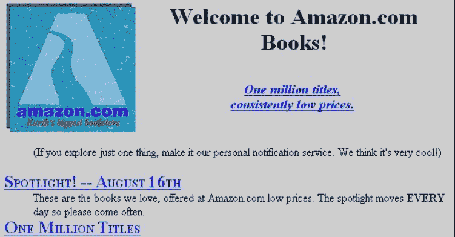

# 押注于永远不会改变 Collab Fund 的事情

> 原文：<http://www.collaborativefund.com/blog/betting-on-things-that-never-change/?utm_source=wanqu.co&utm_campaign=Wanqu+Daily&utm_medium=website>

# 赌上永远不变的东西

亚马逊在 22 年前的这个星期推出。

它的第一个网页展示了它的早期:

这件事的巧妙之处不在于改变了什么。它保持不变。

“100 万本书，持续低价”这句话听起来像营销废话。但这有助于解释为什么亚马逊在其他公司失败的领域占据了主导地位。

1995 年互联网的魅力在于押注于变革。新范式诞生了。抛弃旧策略。需要完全不同的思维。

然而，亚马逊从第一天起就开始关注这个问题。选择和价格。数千年来，企业一直在追求这一理念。

杰夫·贝索斯曾经解释过这一点的重要性:

> 我经常被问到这样的问题:“未来 10 年将会发生什么变化？”这个问题很有意思。
> 
> 我几乎从来没有得到过这样的问题:“未来 10 年什么不会改变？”我认为第二个问题实际上是两个问题中更重要一个。
> 
> 你可以围绕那些在时间上稳定的东西建立一个商业策略。在我们的零售业务中，我们知道客户想要低价，我知道这将在 10 年后成为现实。他们想要快速交货；他们想要大量的选择。很难想象 10 年后会有顾客走过来说，“杰夫，我喜欢亚马逊，我只是希望价格能再高一点。”或者，“我爱亚马逊，我只是希望你能送慢一点。”不可能。
> 
> 因此，我们知道，我们今天在这些事情上投入的精力在 10 年后仍将为我们的客户带来回报。当你知道某件事是真的，即使是长期的，你也有能力投入大量的精力。

对于大多数聪明人来说，这是一件太基本而不值得注意的重要事情。

***

变化的事物是惊人的。它们可以推动大规模增长。

但是改变本身是困难的。投资者必须在它变得明显之前发现它。消费者必须改变他们的行为以使其可行。那两点像磁铁一样互相排斥。变化的事物往往会不断变化。一家宣称“我们在做全新的事情”的公司可能每年都要改造自己和产品线，甚至更多。每一次迭代都是一场前线战斗，你会因为上一场战争而筋疲力尽，但又因为它的胜利而过于自信。所以你的胜算越来越小。一个希望在 40 年的职业生涯中驾驭多个行业连续变化的投资者面临着十级难度。实际上是先知先觉。

变化经常会创造大量的机会。巨大的机会，是的。但是企业和他们的投资者需要的不仅仅是成功的爆发。他们需要耐力。耐力在于长期的赌注。你今天可以投入精力和资本的事情，十年后仍有合理的机会结出果实。这些东西在时间上是稳定的。

对于风险投资来说，这似乎是异端邪说。马克·安德森曾被问及他的投资风格与沃伦·巴菲特相比如何。他回答道:

> [沃伦]打赌反对改变。我们赌的是改变。当他犯错的时候，是因为有些事情发生了他没有预料到的变化。当我们犯错时，那是因为我们以为会改变的事情没有改变。我们在这方面有天壤之别。

似乎方向正确。但我觉得没那么黑白分明。两个投资者追求同样的东西；他们只是重量不同。

每一项成功的投资都是推动竞争的变化和推动复合的一成不变的组合。无论规模或行业如何，这种情况的例外都很少。

自 1951 年以来，巴菲特一直持有 GEICO 的股票。在此期间，该公司从在自助餐厅专门向政府雇员销售汽车保险，发展到向每个人的 iPhones 手机销售多种保险。分析从算盘到人工智能。这些都不是小变化。但有一点保持不变，那就是保险公司直接销售比那些付费经纪人更有成本和便利优势。66 年来，这一直是巴菲特 GEICO 赌注的驱动力。它是永恒的。

Andreessen Horowitz 的合伙人 Frank Chen 最近谈到了保险初创公司的两个趋势。一个是更好的软件。“软件将改写我们购买和体验保险产品的整个方式，”他说。其次是资本结构。“我们希望看到更多的众包保险公司……这应该是一种更廉价的集资方式。”这两项创新都承诺降低成本，增加便利。就像 GEICO 的边缘一样永恒。

投资者以不同的方式衡量变化和永恒的重要性，但每个伟大的公司都有两者的一些元素。极端是事情不起作用的地方。

以 20 世纪 90 年代的三家公司为例:西尔斯、Beenz 和亚马逊。

西尔斯打赌互联网没有改变什么，反而对它不利。Beenz 打赌互联网改变了一切——创造了一种只在网上商家有效的基于点数的货币——这对它不利。亚马逊打赌互联网改变了分销，但它的战略植根于从未改变、也永远不会改变的东西。它把维恩变化图的中心钉在一边，把永恒钉在另一边。一个推动竞争，另一个推动复合。每个成功的公司都是这么做的。

***

在过去的 100 年里，我们已经从马匹发展到喷气式飞机，从邮寄信件发展到 Skype。但是，每一项可持续发展的业务都伴随着一系列永恒的战略:

*   更低的价格。

*   更快地解决问题。

*   更好地控制你的时间。

*   更多选择。

*   增加了舒适度。

*   娱乐/好奇。

*   更深层次的人际互动。

*   更大的透明度。

*   更少的间接伤害。

*   更高的社会地位。

*   增强信心/信任。

你可以在这些事情上下大赌注，因为未来人们不可能不再关心它们。

