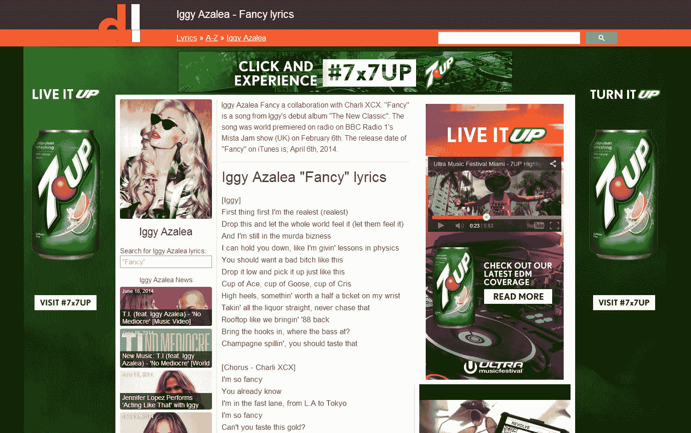

# 十年来我是如何度过每周 4 小时工作制的

> 原文：<https://www.indiehackers.com/@yvo/how-ive-lived-the-4-hour-work-week-for-a-decade?utm_source=wanqu.co&utm_campaign=Wanqu+Daily&utm_medium=website>

蒂姆·费里斯的经典著作讲述了难以捉摸的每周 4 小时工作制，自出版以来已售出 100 多万册。

虽然不是他的书的所有方面都适用于我，但在过去的十年里，我一直用我的副业项目来支撑自己，这个项目的收入最高时达到每月 10 万美元，并且只需要有限的维护。

创业界普遍认为，成功需要无数小时的努力，但我的故事表明，情况并非总是如此。

## 10 亿用户侧项目

2007 年，我推出了我的副业项目: [Directlyrics](https://www.directlyrics.com/) 。十年后，它达到了超过 10 亿次访问的里程碑。这是一个巨大的数字，特别是考虑到它只由我和一个内容编辑兼职运行过。

Directlyrics 有一些神奇的特点。作为近 10 年来最热门的歌词网站之一，它每月从搜索引擎吸引数百万游客，这些浏览量从广告中产生收入。

但真正神奇的是，它并不真的需要我来维持运转。

## 上升的必然下降

Directlyrics 背后的故事可以追溯到 2004 年。我在高中的时候，我自学了如何编码，我在寻找下一个可以构建的东西。

我注意到某个歌词网站的所有者一直在手工添加新页面到他的网站上。我觉得这样效率很低，所以我说服他让我建立一个数据库，他同意了。

很快，我发现了一种非常有效的搜索引擎优化(SEO)方法:我会搜索即将发布的歌曲，将这些歌曲添加到我的网站上(没有任何歌词)，等到歌曲发布时，我已经在谷歌排名第一了。

除了 SEO，我的网站变得如此成功，以至于不到一年我们就把它卖给了 LiveUniverse，一家位于洛杉矶的公司，由一位自称是 MySpace 联合创始人的人经营。我答应留在船上 50%的收入交易。

不幸的是，这一切很快就走下坡路了。

LiveUniverse 购买了其他几个歌词资产，并将它们全部转移到一个服务器上，引发了谷歌禁令，将我们从搜索索引中删除。他们还被几家出版商起诉，因为他们拒绝就歌词授权达成任何协议。更糟糕的是，我没有从我们的收入分成交易中得到任何报酬。

结果成了一场噩梦。

## 通往 10 亿游客的道路

快进一年。我需要花钱更新我的一个域名，但我认为不实际使用它是一种浪费，所以我买了一个新的服务器，建立了一个新的歌词网站，并在一个月后推出了它:Directlyrics.com。

Directlyrics 发展很快，但这个领域的竞争也变得更加激烈。有五家主要的公司——az lyrics、MetroLyrics、LyricsMode、Sing365.com 和我——都在争夺谷歌搜索结果的榜首，以获得每月超过 1 亿次的歌词搜索。

我们都找到了提高排名的创造性方法，但我们也很快相互抄袭，以避免被超越。

那也是收入的黄金时代。

我作为合伙人加入了一个音乐和娱乐网站网络，该网络由现已倒闭的 BuzzMedia 拥有。他们向大品牌出售广告，每千次观看支付高达 30 美元(CPM)。我带来的所有流量使它成为一个伟大的合作伙伴。BuzzMedia 甚至以数百万美元的估值收购了 Directlyrics 的少数股份。

你好，30 美元 CPM 整版收购广告，配有视频。

但所有这些收入也吸引了歌词出版商的注意。

2010 年初，我决定获得完全许可，这大大减少了我的收入。MetroLyrics 在我之前也是这么做的，AZLyrics 最终也是这么做的。

此外，到 2013 年，由于美国对销售的监管更加严格，以及完全禁止通过客户的电话账单开具发票，铃声收入几乎为零。

但总体而言，交通仍然很繁忙。在其高峰期，Directlyrics 在一个月内吸引了超过 2500 万的访问者。

## 享受每周 4 小时工作制

自诞生以来，Directlyrics 背后的堆栈基本保持不变:

这就是全部了。

我的编辑凯文在 Directlyrics 工作了 7 年。在早期，我会花时间寻找即将到来的新歌，但凯文也承担了这个角色。他在西班牙做兼职，拿固定的报酬，自己选择工作时间。

我不做任何客户支持。访问者将歌词网站视为商品工具，他们并不真正需要任何支持。如果该网站不适合他们，他们只需点击后退按钮，选择另一个网站。

虽然我从来没有真正衡量过时间支出，但 Directlyrics 非常接近于要求每周只花 4 个小时来发送电子邮件、搜索引擎优化、第三方服务、修复漏洞和处理其他问题。

我的个人收入来自网站的收入，在过去的十年里，有了这些收入，我得以和家人在世界上最美好的城市之一生活得非常舒适。

由于网站产生了足够多的收入，而对我的关注却如此之少，我可以自由地专注于我最喜欢的事情，讽刺的是，这就是开发产品。

我加入了一家绿色旅行[创业公司](https://www.crunchbase.com/organization/greenbookings#/entity)，创办了[我自己的](https://www.behance.net/gallery/4121607/Fanitycom)音乐和娱乐创业公司，为我的博客进行随机[研究](http://www.yvoschaap.com/weblog/producthuntco_hunters_analyzed)，做过白帽[黑客](https://news.ycombinator.com/item?id=5798087)，发起了几个[副业项目](https://stateofdev.com)，甚至在荷兰领先的[房地产门户网站](https://www.pararius.nl)担任首席技术官。

有时候我会回来花更多的时间在导演歌词上。当我发现一个新的(技术)机会时，我会评估它是否有利于增长或收入，如果是的话，我会将其纳入网站。否则我就把它放在一边。

这些额外的工作是一部分一部分的，基本上超过了一周几个小时。但这几个小时对我来说是最有趣和最有成效的。

## 强大而稳定

虽然我的副业没有从事下一件大事那么令人兴奋，但它的非凡价值在于它的坚韧和长寿。这让我可以做我最擅长的事情，花时间做我喜欢的事情。

我认为互联网让一个人接触到来自全球各地的 10 亿访客是一件令人惊讶的事情，我希望它能激励你！

如果您有任何反馈或问题，请在下面评论。我很乐意回答大多数问题。

顺便说一句，如果你对歌词行业的现状感到好奇，我推荐你阅读这篇关于繁荣和萧条的精彩综述。