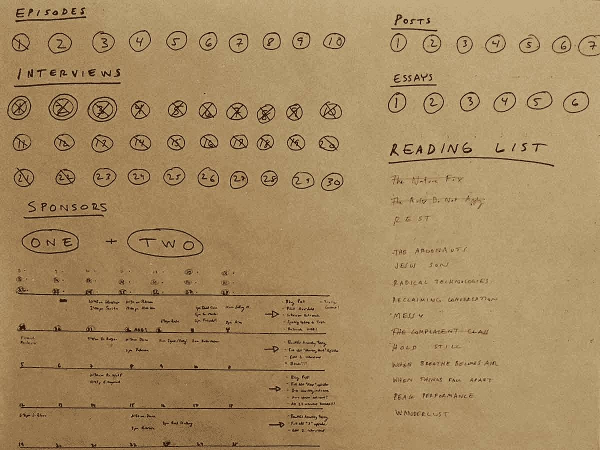

# 如何感受进步乔斯林·k·格雷

> 原文：<http://jkglei.com/progress/?utm_source=wanqu.co&utm_campaign=Wanqu+Daily&utm_medium=website>

身为人类，我们不能不以目标为导向。我们热爱前进。我们喜欢感受动力的感觉。而且，最重要的是，我们喜欢把事情从清单上勾掉。

* * *

这表现为一种叫做[完成偏差](https://jkglei.com/momentum/)的东西，这是一种令人愉快的多巴胺，每当我们认为一项任务完成时就会产生。因为我们天生渴望完成，很少有什么事情比感受进步更能让我们在工作和生活中投入。

在一项引人入胜的研究中，哈佛大学的研究员 Teresa Amabile 在 4 个月的时间里跟踪了 238 名知识工作者的情绪、动机和看法，最终收集了超过 12000 篇日记。结果是明确的:

> 在工作日，所有能提升情绪、动力和感知的事情中，最重要的是在有意义的工作中取得进展。人们越频繁地体验这种进步感，从长远来看，他们就越有可能富有创造性。无论他们是试图解决一个重大的科学之谜，还是仅仅生产一种高质量的产品或服务，每天的进步——即使是一个小小的胜利——都会让他们的感觉和表现大不相同。

在有意义的工作中取得进展是保持专注的关键。正如阿玛比尔所指出的，进步并不一定意味着巨大的飞跃——事实上，通常不是这样。一种明显的进步感通常来自于对我们的“小胜利”的刻意追踪。这又是阿马比尔:

> 当我们想到进步时，我们经常想象实现一个长期目标或经历一次重大突破的感觉有多好。这些重大胜利是伟大的——但它们相对罕见。好消息是，即使是小小的胜利也能极大地提升内心的工作生活。我们的研究参与者报告的许多进展事件只代表了微小的进步。然而，它们经常引起巨大的积极反应。请看一位高科技公司程序员的日记，她对自己当天的情绪、动机和感知进行了非常积极的自我评价:“我发现了为什么有些事情不能正常工作。我感到宽慰和高兴，因为这对我来说是一个小小的里程碑。”

然而，如果你想感受到进步，你必须跟踪它。我们大多数人每天都有或大或小的进步，但我们没有注意到它们，因为我们缺乏承认自己进步的方法。这是巨大的损失。

如今普遍存在一种不知所措的感觉。我们觉得我们有太多的事情要做，却没有足够的时间去做。我们不知疲倦地工作，但很少觉得自己在完成什么重要的事情。怎么了?

有几个因素导致了这种压倒性的局面，而进步——或者说缺乏进步——是症结所在:

*   我们沉迷于无意义的进步。我们现在生活的应用程序世界提供了无限多的方式来占据我们的大脑并快速取得进展，无论是减少未读邮件数量，在社交媒体订阅上发出通知，还是关注电子邮件订户或浏览量等指标。所有这些活动都给我们一种强烈的*进步感*，但这是假的。因为我们并没有真的在做能让我们朝着重要目标前进的工作。
*   我们无法定义我们有意义的目标。如此深陷于忙碌的循环中，我们常常忽略了缩小视野，理清我们在事物的大计划中的方向。如果你不清楚自己到底想完成什么，就很难有成就感。俗话说:没有目标就进不了球。
*   我们缺乏追踪进展的方法。即使你很擅长设定崇高的目标，如果你没有一个系统来记录你朝着目标前进的过程，你也很难保持专注。在实现一个不可思议的想法的漫长旅程中，大的成功很少，这就是为什么跟踪我们的“小成功”如此重要。

还有一个需要注意的因素:不确定性。当你在做新的事情，规划新的领域时，你很少知道这个旅程需要多长时间，因为没有人做过这个旅程。我们可以把这个概念归结为一句话:每件事都比你想象的要花更长的时间。

作家奥利弗·伯克曼最近向我介绍了霍夫施塔特定律，该定律巧妙地抓住了这一困境:

***霍夫施塔特定律:**它总是比你预期的要长，即使你把霍夫施塔特定律考虑在内。*

维基百科阐述道:“尽管尽了最大努力，包括知道任务是复杂的，但该定律的递归性质反映了广泛存在的评估复杂任务的困难。”

因为每件事花费的时间都比你想象的要长——即使你知道它会比你想象的要长——跟踪进展是至关重要的。如果你不能按时到达终点，保持专注的唯一方法就是感受到，至少，一种令人满意的动力感。

所以每当我感到不知所措时，我会问自己:

*   我怎样才能创造一种进步的感觉？
*   有没有可能把这个项目分成几个小部分？
*   真正重要的指标和里程碑是什么？

我目前正在开发一个名为*的新播客，将于 2017 年 10 月推出，这需要我进行 30 次采访，创作 10 集，并获得 2 名赞助商。每个面试都有多个小阶段:预约面试、进行面试和编辑面试。有很多事要做，我有点不知所措。*

 *所以我买了一卷 4 英尺宽的牛皮纸，并为接下来的两个月里我要做的所有事情画了一张路线图。我为所有关键部分内置了“进度跟踪器”。这是路线图:

我的播客项目进度跟踪器(有点乱)。

这是它追踪的所有东西:

*   已完成的播客集数
*   已完成的面试数量，包括当前状态(已预订、已完成或已编辑)
*   预定的赞助商数量(如果你感兴趣，给我写信；)
*   即将到来的日常任务和约会日历
*   我每周需要完成的关键行动项目

它还跟踪其他一些东西，但你不需要那么多细节。重点是，*当我追踪我的进展时，有很多事情我要划掉*:每周的任务、预定的采访、完成的剧集、找到的赞助商等等。

值得注意的是，我也在谷歌电子表格中跟踪所有这些项目，但拥有一个数字文档让我感觉毫无进展。你需要一个类比:你需要通过*写下事情*来跟踪你的进展。我们需要看到我们的进步，在现实世界中放大，去感受它。

在我创建这个路线图的那一刻，我感觉更踏实、更有动力、更有控制力。我可以看到前进的道路，我可以看到自己沿着这条道路前进。很难高估这种感觉有多好。

> 我们需要看到我们的进步，在现实世界中放大，去感受它。

当然，你不需要创建一个如此复杂或神经质的路线图来感受进步。这里的核心思想是考虑如何将项目分解成更小的任务，跟踪真正有意义的指标，并在进行过程中记录您的进展。

跟踪进展的简单方法包括:

*   为你所有的任务制作一个便利贴表格。我的座右铭是:*当有疑问时，贴上便条*。如果你感到不知所措，你能做的最简单的事情之一就是把一个项目分解成一系列小任务，所有这些都可以写在便利贴上。把它们都贴在你墙上的格子里，然后把它们划掉，或者边走边把便利贴拿掉。很简单。
*   **在每日日历上跟踪指标。**如果你没有一个更大的项目或者很难将它分解成里程碑，你可以选择一个对你有意义的每日(或每周)指标并跟踪它。例如，一个作家跟踪每天写的单词，一个销售人员跟踪打来的陌生电话，或者一个程序员跟踪写的代码行。在你的墙上钉一个月历——越大越好——记下你每天的产出。看到自己一次又一次地取得好成绩，我深受鼓舞。
*   每天花 5 分钟写日记。这就是 Teresa Amabile 研究中的参与者所做的。你只需要在每个工作日结束时花几分钟写下来，记下你的“小胜利”和任何挫折。然后，在周末或月末，翻翻你的笔记，看看你已经走了多远。很可能，你会开始对你正在取得的进步有更多的意识，并在经历挫折时观察周围的模式。我再次推荐一种模拟方法:拿一个 Moleskine，而不是用你的智能手机。

设计师 Maira Kalman 曾经告诉我，她喜欢通过阅读讣告开始新的一天。这听起来有点病态，但她这样做是为了受到鼓舞，获得视角。问:生命的尺度是什么？

我们都想进步，想创造一些有意义的东西，想被人深情地记住。当我发现自己弓着身子在电脑前浏览电子邮件时，我会努力记住这一点。我希望我的墓碑上写着:

**里普**

乔斯林·肯德尔·格雷

“她检查了所有的电子邮件。”

还是我想为更宏伟的目标而奋斗？

你呢？你想成为经常收到“零收件箱”的人，还是想在你狂野而珍贵的一生中取得更有意义的成就？

一个结果和另一个结果之间的区别很简单，就是找出如何跟踪正确的进展。

你可以沉迷于电子邮件、社交媒体和大数据的虚假进展，或者你可以致力于定义有意义的指标和里程碑，让你专注于对你来说最重要的长期创意项目。

选择权在你。*