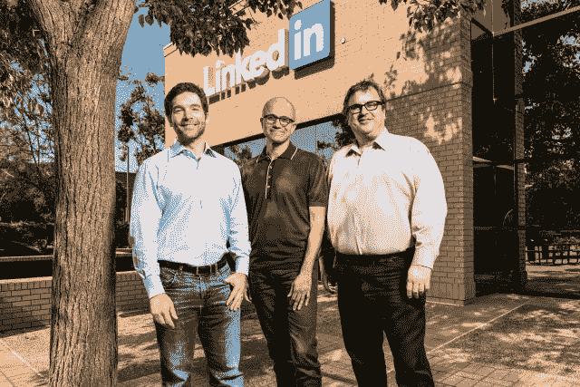

# LinkedIn:未经许可抓取我们的网站是非法的

> 原文：<https://arstechnica.com/tech-policy/2017/07/linkedin-its-illegal-to-scrape-our-website-without-permission/?utm_source=wanqu.co&utm_campaign=Wanqu+Daily&utm_medium=website>

领英首席执行官杰夫·韦纳(左)和董事长雷德·霍夫曼(右)与微软首席执行官塞特亚·纳德拉(中)。微软去年收购了 LinkedIn。

一家名为 hiQ 的小公司与 LinkedIn 陷入了一场高风险的网络抓取大战。这场斗争可能会决定反黑客法是否可以用来限制网络抓取工具的使用。

HiQ 从公开的 LinkedIn 个人资料中收集了数千名员工的数据，然后将这些数据打包出售给担心员工辞职的雇主。去年被微软收购的 LinkedIn 给 hiQ 发了一封停止信，警告说这种抓取行为违反了计算机欺诈和滥用法案，这是 1986 年的一项有争议的法律，将计算机黑客行为定为犯罪。HiQ 提起诉讼，要求法院裁定其活动事实上没有违反 CFAA。

康奈尔大学法学院教授詹姆斯·格里梅尔曼(James Grimmelmann)告诉 Ars，这里的利害关系远远超出了一家鲜为人知的公司的命运。

“许多业务都是建立在连接来自许多来源的数据之上的，”Grimmelmann 说。他认为，抓取是公司“利用这些数据做一些有趣的事情”的一种关键方式。如果未经同意的刮擦成为非法，像 hiQ 这样的初创公司将更难起步。

但是法律可能会站在 LinkedIn 一边——尤其是在北加州，那里的案件正在审理中。在 2016 年的一项裁决中，对加州拥有管辖权的第九巡回上诉法院发现，一家名为 Power Ventures 的初创公司违反了《CFAA 》,尽管脸书发出了停止函，但该公司仍继续访问脸书的服务器。

该案的一些细节有所不同——Power Ventures 在脸书用户的许可和配合下发送私人信息，而 hiQ 则在公共网页上收集数据。但是专家告诉 Ars,*Power Ventures*的先例对 hiQ 来说可能是个坏消息，因为它表明在被要求停止后继续访问一个网站足以触发反黑客法。

## “大有问题”

LinkedIn 的立场令乔治·华盛顿大学的法律学者奥林·克尔感到不安。“你不能向全世界发布，然后说‘不，你不能看’，”克尔告诉 Ars。

CFAA [将“未经授权或超越授权权限访问电脑”定为犯罪](https://www.law.cornell.edu/uscode/text/18/1030)自 30 多年前国会通过该法案以来，法院一直在努力弄清楚这意味着什么。

对该法律的一种合理解读是，一旦网站运营商要求你停止访问其网站，如果你不遵守，你就犯了罪。

这是 2016 年 *Power Ventures* 裁决提出的解释，这在加州是一个有约束力的先例。Power.com 是一个社交网络，其功能相当于一个社交网络聚合器。通过 Power.com 网站，用户可以登录脸书等其他社交网络，同时访问多个社交网络的信息。

为了扩大用户群，Power 要求用户提供他们的脸书凭据，然后在得到他们的允许后，向他们的脸书朋友发送 Power 邀请。脸书自然不喜欢这种营销策略。他们给 Power 发了一封停止通知函，还封锁了 Power 用来与脸书服务器通信的 IP 地址。

脸书提起诉讼，声称根据《CFAA》的条款，其停止通知函使得 Power 的访问未经授权。Power 不同意这种说法，并认为获得脸书用户的许可已经足够好了——它不需要脸书自己单独批准。

但是去年第九巡回上诉法院站在了脸书一边。

“电力用户可以说是给了电力公司使用脸书电脑传播信息的许可，”法院写道。"但是当脸书发出书面的停止通知函时，脸书明确取消了这一许可。"在这一点上，法院认为，“电力公司知道它不再有权进入脸书的电脑，但仍然继续这样做。”

这个结果困扰着克尔。

他举例说，想象一下，如果 CNN 给竞争对手的记者写信，要求他们的记者不要进入 cnn.com。克尔告诉 Ars，根据对该法律的广义解读，访问公共网站将“成为联邦犯罪”

克尔认为，应该要求想要限制访问其网站的网站使用密码等技术机制，以表明该网站实际上不对公众开放。

克尔告诉 Ars，“让网站所有者的主观愿望而不是他们的客观行为来决定什么是合法的，这是非常有问题的”。

Power Ventures 的案子还没有结束。电力风险投资公司[在五月要求最高法院考虑该案件](http://www.scotusblog.com/case-files/cases/power-ventures-inc-v-facebook-inc/)，高等法院还没有决定是否这样做。目前，*电力公司*的先例只适用于第九巡回法庭，它涵盖了加州和其他西部各州。对 hiQ 来说不幸的是，LinkedIn 争端正在由加州联邦法院审理。

最终，格里梅尔曼认为,《CFAA》的文本并没有清楚地解决这个问题。克尔认为运营一个公共网站意味着公众有权访问该网站，而领英认为公司可以根据具体情况撤销授权，这两种观点都是对法律的合理解释。

但两位学者都认为，有充分的理由支持对法律进行更宽松的解读。LinkedIn 对该法律的解释给了 LinkedIn 这样的大型网站运营商很大的权力来决定如何使用他们的网站。他们认为，法院应该保护小公司、监察组织和其他人使用抓取工具从网上收集信息的权利。