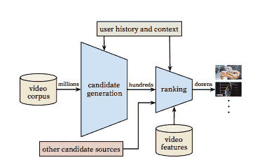

# 让学龄前儿童痴迷于 YouTube 儿童的算法——大西洋

> 原文：<https://www.theatlantic.com/technology/archive/2017/07/what-youtube-reveals-about-the-toddler-mind/534765/?utm_source=wanqu.co&utm_campaign=Wanqu+Daily&utm_medium=website>

初学走路的孩子渴望权力。对他们来说太糟糕了，他们没有。因此出现了愤怒和荒谬的要求。不，我想要这只*香蕉，不是那只，那只看起来完全一样，但是你刚刚开始剥，所以现在对我来说一文不值。)*

他们只想掌权！这种对自主的渴望阐明了一个非常渺小的人类的行为。几位发展心理学家告诉我，这也开始解释 YouTube 在幼儿和学龄前儿童中的流行。

如果你的生活中没有一个 3 岁的孩子，你可能不会知道 YouTube Kids，这是一个基本上是原始视频博客网站的精简版，根据目标观众的年龄过滤视频。因为移动应用程序是为手机或平板电脑设计的，所以孩子们可以在由无数视频组成的数字生态系统中探索自己的道路——所有这些都是以他们为中心的。

出现在应用程序上的视频是由 YouTube 的推荐算法生成的，该算法考虑了用户的搜索历史、观看历史和其他数据。 [*](#Algorithm%20Details) 这种算法基本上是一个漏斗，每一个 YouTube 视频都通过它流入——只有少数视频进入个人屏幕。

这个推荐引擎提出了一个困难的任务，仅仅是因为平台的规模。“YouTube 的推荐负责帮助超过 10 亿用户从不断增长的视频语料库中发现个性化内容，”拥有 YouTube 的谷歌的研究人员在 2016 年关于该算法的论文中写道。这包括每天每秒上传到网站的数小时视频。他们写道，制作一个有价值的推荐系统“极具挑战性”，因为该算法必须不断筛选令人难以置信的内容，并立即识别最新鲜和最相关的视频——同时知道如何忽略噪音。

<picture class="ArticleInlineImageFigure_picture__HoflP"></picture>

The architecture of YouTube’s recommendation system, in which “candidate videos” are retrieved and ranked before presenting only a few to the user. ([Google / YouTube](https://static.googleusercontent.com/media/research.google.com/en//pubs/archive/45530.pdf))

这就是大毒蛇因素出现的地方:孩子们一遍又一遍地看着同样的视频。视频制作者注意到什么是最受欢迎的，然后模仿它，希望孩子们会点击他们的东西。当他们这样做时，YouTube 的算法会注意到，并向孩子们推荐这些视频。孩子们不断点击它们，并不断得到更多同样的东西。这意味着视频制作者继续制作这类视频——希望孩子们会点击。

本质上，这就是所有算法的工作方式。过滤气泡就是这么做的。一点点计算机代码记录了你觉得有趣的东西——你最常看什么样的视频，看的时间最长？—然后给你发更多这类的东西。从某种角度来看，YouTube Kids 提供的节目是专门为孩子们想看的东西量身定制的。孩子们实际上是自己选择的，直到他们失去兴趣，选择其他东西。换句话说，YouTube 应用程序极大地反映了孩子们想要什么。这样，它打开了一扇通向孩子心灵的特殊的窗户。

但它揭示了什么？

威斯康星大学麦迪逊分校人类生态学院人类发展助理教授希瑟·柯克里安说:“直到最近，令人惊讶的是，很少有人关注这个问题。”。“在过去一年左右的时间里，我们实际上看到了一些针对应用程序和触摸屏的研究。才刚刚开始出来。”

儿童视频是 YouTube 历史上观看次数最多的内容之一。例如，根据 YouTube 的统计，这个视频已经被观看了超过 23 亿次:

你可以在 YouTube Kids 上找到一些高质量的动画，还有像 *Peppa Pig* 这样的电视节目片段，以及跟着唱的童谣。“手指爸爸”基本上是 YouTube 上的儿歌，楚楚电视台对流行儿歌的动态诠释是不可避免的。

许多最受欢迎的视频有一种业余的感觉。像惊喜蛋视频这样的玩具演示是巨大的。这些视频就像它们听起来的那样:成年人在玩各种玩具时进行叙述，通常是通过将它们从塑料鸡蛋中拉出，或者剥去几层粘液或 Play-Doh 来展示隐藏的小雕像。

孩子们对这些东西很着迷。

这是 YouTube 儿童视频网站“玩具无限”上的一个视频，已经有超过 2500 万的浏览量。

撇开这些视频的模糊怪异不谈，其实很容易理解为什么孩子们喜欢它们。“谁不想得到惊喜呢？乔治敦大学儿童数字媒体中心主任桑德拉·卡尔弗特说:“这就是我们所有人的运作方式。除了有趣的惊喜之外，许多视频基本上都是玩具广告。([一个人把闪闪发光的 Play-Doh](https://www.youtube.com/watch?v=I8vzbIuvhoo) 按在廉价的迪士尼公主雕像上的视频已经被观看了 5.5 亿次。)他们让孩子们接触到整个互联网的塑料鸡蛋和感知能力。他们可以选择看什么。孩子们喜欢掌控一切，即使是表面上的。

“这有点像快速频道冲浪，”哈佛医学院儿科学教授兼媒体和儿童健康中心主任迈克尔·里奇说。“在许多方面，YouTube Kids 比半小时或一小时的广播节目更适合幼儿的注意力范围——仅仅是因为它的长度。”

里奇和其他人将这款应用程序与《芝麻街》(Sesame Street)等前辈进行了比较，后者在一个较长的节目中引入了较短的片段，部分原因是为了吸引年幼儿童的注意力。几十年来，研究人员一直在观察孩子们对电视的反应。现在，他们正在调查孩子们使用移动应用的方式——他们花了多少时间，使用了哪些应用，等等。

<aside class="ArticlePullquote_root__YtnHv">“Something about the act of choosing ... makes a difference for little kids.”</aside>

研究人员开始注意到这一点是有道理的。在移动互联网时代，同样是那些抛弃了有线电视的千禧一代现在有了孩子，这使得像 YouTube Kids 这样的应用成为时下的屏幕时间选择。一个蹒跚学步的孩子或学龄前儿童可能会被提供 28 分钟的电话时间来玩*丹尼尔·泰格的邻居*应用程序，而不是观看 28 分钟的*罗杰斯先生的邻居*集。丹尼尔·泰格的《邻居》也是一个电视节目，是罗杰斯先生的《T8》和《T9》的衍生节目，面向 2 到 4 岁的观众。

但是就研究人员而言，幼儿和学龄前儿童实际上是非常不同的群体。柯克里安告诉我，一个 2 岁和一个 4 岁的孩子可能都喜欢看丹尼尔·泰格(Daniel Tiger)或者同一个 YouTube 儿童视频，但他们的收获可能会大不相同。3 岁以下的儿童往往很难理解通过屏幕传达给他们的信息，并将其应用到现实生活中。许多研究都得出了类似的结论，除了几个明显的例外。研究人员最近发现，当屏幕时间体验变得互动时——比如说，与祖母面对面——3 岁以下的孩子实际上可以在屏幕上和屏幕外发生的事情之间建立强有力的联系。

Kirkorian 的实验室设计了一系列实验来观察互动在帮助幼儿以这种方式传递信息方面发挥了多大的作用。她和她的同事发现，当幼儿能够与应用程序互动时，与他们只是看着屏幕时，他们所学的知识存在显著差异，即使是两岁以下的孩子也是如此。其他研究人员也发现，加入某种互动有助于儿童更好地记住信息。不同机构的研究人员对“互动”有不同的定义，但在一项实验中，这是一个像按空格键一样简单的动作。

柯克里安说:“因此，选择的行为似乎确实有一些东西，有某种媒介，对小孩子来说有所不同。”"投机的部分是为什么会有所不同."

一个想法是，尤其是孩子们，喜欢一遍又一遍地看同样的东西，直到他们真正理解为止。当我还是个小孩的时候，我看了太多遍《小飞象》( Dumbo)VHS，以至于我会在长途汽车上背诵这部电影。显然，这并不罕见——至少从录像机时代开始，以及随后的点播节目和应用程序。“如果他们有机会选择他们在看什么，那么他们可能会以符合他们学习目标的方式互动，”柯克里安说。“我们知道学习新信息的行为是有回报的，所以他们可能会选择处于最佳状态的信息或视频。”

“孩子们喜欢一遍又一遍地看同样的东西，”乔治敦大学的卡尔弗特说。“有些是理解问题，所以他们会反复看，这样他们才能理解故事。孩子们通常不理解人们的动机，这是故事的主要驱动力。他们往往不明白行动和后果之间的联系。”

年幼的孩子也更容易沉迷于相对狭窄的兴趣。(大象！火车！月亮！冰淇淋！)大约在 18 个月大的时候，许多蹒跚学步的孩子会产生“极其强烈的兴趣”，范德比尔特大学心理学副教授 Georgene Troseth 说。这也是为什么使用 YouTube Kids 等应用程序的孩子经常选择描绘熟悉概念的视频——那些以卡通人物或他们已经被吸引的主题为特色的视频。然而，这给研究带来了挑战。如果孩子们只是因为认识视频而点击视频的缩略图，很难说他们学到了多少东西——或者应用程序环境与其他游戏形式有多大不同。

乔治敦大学的发展心理学家雷切尔·巴尔说，即使是惊喜蛋热也并不新奇。“它们的节奏相对较快，包含了一些小孩子真正喜欢的东西:东西被包装和打开，”她告诉我。“我没有测试过，但孩子们似乎不太可能从这些视频中学习，因为它们没有清晰的结构。”

“互动并不总是一件好事，”她补充道。

研究人员对 YouTube Kids 在多大程度上是一个有价值的教育工具意见不一。显然，这取决于视频和护理人员的参与，以帮助将屏幕上的内容联系起来。但是关于算法如何工作的问题也起了作用。例如，目前还不清楚 YouTube 在其推荐引擎中对之前的观看行为有多重视。如果一个孩子狂看一堆在学习潜力方面质量较低的视频，他们是否会被困在一个只能看到类似低质量节目的过滤泡沫中？

没有人为孩子挑选最好的视频来看。YouTube 的一位发言人告诉我，YouTube 方面唯一的人工输入是监控应用程序是否有不当内容。然而，质量控制[仍然是一个问题](http://www.today.com/money/child-advocacy-groups-say-youtube-kids-rife-inappropriate-videos-t21936)。YouTube Kids 去年推出了一个视频，显示米老鼠式的人物用枪射击彼此的头部，[*报道*](http://www.today.com/parents/moms-warn-disturbing-video-found-youtube-kids-please-be-careful-t101552)*。*

*YouTube 发言人尼娜·奈特(Nina Knight)说:“可用内容不是经过策划，而是通过算法过滤到应用程序中。”“因此，与传统电视不同，在传统电视中，内容是在指定的时间为您选择的，YouTube Kids 应用程序为每个孩子和家庭提供了更多他们喜欢的内容，随时随地都可以观看，这是非常独特的。”*

*与此同时，YouTube 儿童视频的创作者花费了无数时间来尝试游戏算法，以便他们的视频被尽可能多地观看——更多的观看次数转化为他们更多的广告收入。这是一个由玩具和我制作的视频，自 2016 年 9 月发布以来，已经有超过 1.25 亿的浏览量:*

*“你必须做算法想让你做的事情，”娜塔莉·克拉克说，她是一个同样受欢迎的频道“玩具无限”的联合创始人，也是一名前重症监护室护士，她辞去了工作，全职制作视频。"你不能真的在主题之间来回跳跃。"*

*她的意思是，一旦 YouTube 的算法确定某个频道是关于粘液、颜色、形状或其他任何东西的视频的来源——尤其是一旦某个频道有了关于某个特定主题的热门视频——视频制作者就要承担偏离这一分类的风险。“老实说，YouTube 为你挑选，”她说。“现在的趋势是爪子巡逻，所以我们做了很多爪子巡逻。”*

*让 YouTube 上的儿童视频迅速走红还有其他关键策略。她说，做足够多的这些东西，你就会开始了解孩子们想看什么。“我希望我能告诉你更多，”她补充道，“但我不想引入竞争。老实说，没有人真正理解它。”*

*人们还不明白的另一件事是，在移动互联网时代长大将如何改变孩子们对讲故事的看法。儿童数字媒体中心的卡尔弗特说:“大量文献表明，读书多的孩子更有想象力。”。“但在这个互动的时代，不再只是消费别人做的东西。这也是在做你自己的东西。”*

*换句话说，最年轻一代的应用程序用户正在对叙事结构和信息环境产生新的期望。除了学龄前儿童敲击屏幕或无数次观看 Bing Bong Song 视频所带来的兴奋之外，对携带手机的学步儿童的长期影响与生活在高度网络化的按需世界中的所有其他复杂性交织在一起。*

* * *

*一位发言人告诉我，与 YouTube 的主要网站不同，YouTube Kids 不会使用单个孩子的地理位置、性别或年龄来进行推荐。然而，YouTube Kids 确实会询问用户的年龄范围。YouTube 的发言人引用了儿童在线隐私保护规则，这是美国联邦贸易委员会对针对 13 岁以下儿童的网站运营商的要求，但拒绝回答反复提出的问题，即为什么 YouTube Kids 算法使用的输入与原始网站的算法不同。*

