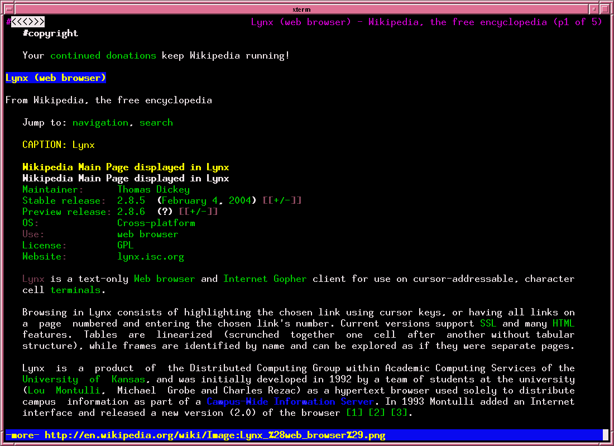
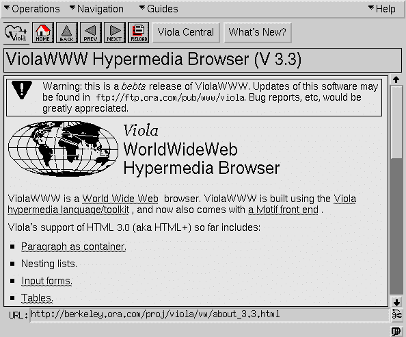

# 几乎成为 CSS 的语言

> 原文：<https://blog.cloudflare.com/the-languages-which-almost-became-css/?utm_source=wanqu.co&utm_campaign=Wanqu+Daily&utm_medium=website>

几乎成为 CSS 的所有语言的历史和风格化网站的发展。

当蒂姆·伯纳斯·李在 1991 年宣布 HTML 时，还没有设计页面样式的方法。一个给定的 HTML 标签是如何呈现的是由浏览器决定的，通常有来自用户偏好的重要输入。对许多人来说，创建一种标准的方式来“建议”页面在风格上如何呈现似乎是一个好主意。

这是根据最初出现在渴望博客上的一篇文章改编的。Eager 现在已经成为新的 [Cloudflare 应用](https://www.cloudflare.com/apps)。

> 事实上，在过去的一年里，我一直很高兴能够不断地告诉那些想要——系好安全带，这就来了——用在 TeX、Microsoft Word 和其他常见文本处理环境中微不足道的方式控制他们的文档外观的人:“**对不起，你完蛋了。**
> 
> —马克·安德森 [`1994`](http://1997.webhistory.org/www.lists/www-talk.1994q1/0648.html)

当蒂姆·伯纳斯·李在 1991 年宣布 HTML 时，还没有设计页面样式的方法。一个给定的 HTML 标签是如何呈现的是由浏览器决定的，通常有来自用户偏好的重要输入。对许多人来说，创建一种标准的方式来“建议”页面在风格上如何呈现似乎是一个好主意。

但是 CSS 在五年内不会被引入，十年内也不会被完全实现。这是一个紧张的工作和创新的时期，导致了许多竞争的造型方法，很容易成为标准。

虽然这些语言今天显然没有被普遍使用，但我们发现想象一下可能的世界是很有趣的。更令人惊讶的是，这些选项中有许多包含了开发人员甚至在今天也希望在 CSS 中出现的特性。

### 第一个提议

1993 年初，马赛克浏览器还没有达到 1.0 版本。那些确实存在的浏览器只处理 HTML。没有指定 HTML 样式的方法，这意味着无论浏览器决定一个`<h1>`应该是什么样子，那就是你得到的。

那年 6 月，Robert Raisch 向 www-talk 邮件列表提出了一项建议，创建一种“易于解析的格式，以便与 Web 文档一起传递文体信息”，这种格式将被称为 RRP。

```
@BODY fo(fa=he,si=18) 
```

如果您不知道这段代码在做什么，请原谅。这个特定的规则是将字体系列(`fa`)设置为 helvetica ( `he`)，将字体大小(`si`)设置为 18 磅。让这种新格式的内容尽可能简洁是有意义的，因为它诞生于 gzipping 之前的时代，当时连接速度徘徊在 14.4k 左右。

这个提议中缺少了一些有趣的东西，没有提到单位，所有的数字都是根据上下文来解释的(例如，字体大小总是以磅为单位)。这可能是因为 RRP 更多地被设计成“对呈现器的一组提示或建议”,而不是一个规范。这被认为是必要的，因为同一个样式表需要同时适用于普通的行模式浏览器(如 [Lynx](https://en.wikipedia.org/wiki/Lynx_(web_browser)) )和越来越流行的图形浏览器。



有趣的是，RRP 包含了一个指定列布局的方法，这个特性直到 2011 年才会出现在 CSS 中。例如，三列，每列宽度为“80 个单位”，如下所示:

```
@P co(nu=3,wi=80) 
```

这有点难以解析，但也许不会比`white-space: nowrap`差太多。

值得注意的是，RRP 不支持任何我们今天与样式表联系在一起的“级联”。一个给定的文档一次只能有一个活动的样式表，这是考虑文档样式的一种合乎逻辑的方式，即使它现在对我们来说是陌生的。

马克·安德森(Mosaic 的创始人，后来成为最受欢迎的浏览器)是[知道 RRP 提案的](http://www.webhistory.org/www.lists/www-talk.1993q4/0266.html)，但它从未被 Mosaic 实施。相反，Mosaic 很快(有点悲剧地)走上了使用 HTML 标签定义风格的道路，引入了像`<FONT>`和`<CENTER>`这样的标签。

### Viola 和原始浏览器战争

> > 那你为什么不实现摆在桌面上的众多样式表提案中的一个呢？如果操作正确，这将很大程度上解决
> > 问题。
> 
> 于是我开始告诉人们，“嗯，你开始学习*这种*语言
> 来写你的文档，然后你开始学习*那种*语言
> 实际上使你的文档看起来像你想要的那样。”哦，他们会喜欢的。
> 
> —马克·安德森 [`1994`](http://1997.webhistory.org/www.lists/www-talk.1994q1/0683.html)

与普遍看法相反，Mosaic 并不是第一个图形浏览器。它早于 ViolaWWW，这是一个图形浏览器，最初由佩-魏源只用了四天时间就完成了。



Pei-Yuan 创建了一个[样式表语言](http://1997.webhistory.org/www.lists/www-talk.1993q4/0264.html)，它支持我们今天在 CSS 中使用的一种嵌套结构形式:

```
(BODY fontSize=normal
      BGColor=white
      FGColor=black
  (H1   fontSize=largest
        BGColor=red
        FGColor=white)
) 
```

在这种情况下，我们将颜色选择应用于主体，并对出现在主体中的`H1`进行特殊的样式化。PWP 没有使用重复的选择器来处理嵌套，而是使用了一个括号系统，这让人想起了像 Stylus 和 SASS 这样的语言使用的缩进系统，这些语言现在被一些开发人员比 CSS 更喜欢。这使得 PWP 的语法至少在一个方面比最终成为网络通用语言的 CSS 语言更有潜力。

PWP 还因为引入了我们今天仍在使用的引用外部样式表的方法而出名:

```
<LINK REL="STYLE" HREF="URL_to_a_stylesheet"> 
```

不幸的是，ViolaWWW 主要是为与只在 Unix 系统上流行的 X 窗口系统(T2)一起工作而编写的。当 Mosaic 被移植到 Windows 上时，它很快就把 Viola 远远甩在了后面。

### Web 之前的样式表

> HTML 是那种只有计算机科学家才喜欢的东西。是的，它表达了文档的底层结构，但是文档不仅仅是结构化的文本数据库；它们具有视觉冲击力。HTML 完全消除了文档设计者可能有的任何视觉创造力。
> 
> —罗伊·史密斯 [`1993`](http://1997.webhistory.org/www.lists/www-talk.1993q3/0238.html)

早在互联网出现之前，人们就需要一种语言来表达文档的风格。

如你所知，我们所知的 HTML 最初是基于一种叫做 SGML 的前互联网语言。1987 年，美国国防部决定研究是否可以用 SGML 来简化他们处理的大量文件的存储和传输。像任何好的政府项目一样，他们没有浪费时间想出一个名字。该小组最初被称为计算机辅助后勤保障小组，然后是计算机辅助采购和后勤保障小组，最后是连续采购和寿命周期保障倡议。无论如何，首字母都是 CALS。

CALS 团队创造了一种称为 FOSI 的语言来设计 SGML 文档，这是一种首字母缩写，无疑代表了四个单词的某种组合。他们出版了这种语言的规范，它既全面又难以理解。它还包括网络上有史以来最好的[无意义信息图之一](https://people.opera.com/howcome/2006/phd/i/fosi.png)。

互联网的一条不可违背的规则是:如果你能在过程中证明某人是错的，那么总会完成更多的事情。1993 年，就在贝聿铭提议的四天后，史蒂文·希尼[提议](http://1997.webhistory.org/www.lists/www-talk.1993q4/0295.html)与其“重新发明轮子”，不如使用 FOSI 的变体来设计网络。

FOSI 文档本身是用 SGML 编写的，考虑到 web 开发人员对 SGML 变体 HTML 的熟悉程度，这实际上是一个合理的举动。一个示例文档如下所示:

```
<outspec>
  <docdesc>
    <charlist>
      <font size="12pt" bckcol="white" fontcol="black">
    </charlist>
  </docdesc>
  <e-i-c gi="h1"><font size="24pt" bckcol="red", fontcol="white"></e-i-c>
  <e-i-c gi="h2"><font size="20pt" bckcol="red", fgcol="white"></e-i-c>
  <e-i-c gi="a"><font fgcol="red"></e-i-c>
  <e-i-c gi="cmd kbd screen listing example"><font style="monoser"></e-i-c>
</outspec> 
```

如果你对什么是`docdesc`或`charlist`有点困惑，那么`www-talk`的
成员也是如此。给出的唯一上下文信息是`e-i-c`表示“上下文中的元素”。然而，FOSI 因引入了`em`单元而引人注目，它现在已经成为比你更了解 CSS 的人设计事物的首选方法。

正在上演的语言冲突实际上和编程本身一样古老。这是函数式“lisp 风格”语法与更多声明性语言的语法之间的战争。裴远自己把他的语法描述为“LISP 式的”，但真正的 LISP 变体进入舞台只是时间问题。

### 图灵完全样式表

尽管如此复杂，FOSI 实际上被视为文档格式化问题的临时解决方案。长期的计划是创建一种基于函数式编程语言方案的语言，这种语言可以实现您所能想象的最强大的文档转换。这种语言被称为 DSSSL。

用撰稿人乔恩·博萨克的话说:

> 把 DSSSL 和脚本语言放在同一个袋子里是错误的。是的，
> DSSSL 是图灵完备的；是的，它是一种编程语言。但是脚本语言(至少我使用这个术语的方式)是程序性的；DSSSL 非常肯定
> 不是。DSSSL 完全是功能性的，而且完全没有副作用。DSSSL 样式表中不会发生任何事情。样式表是一个巨大的函数，它的
> 值是对
> 格式文档的抽象的、独立于设备的、非过程化的描述，它作为显示区域的规范(如果你愿意的话，可以称之为声明)提供给下游的呈现过程。

最简单地说，DSSSL 实际上是一种非常合理的样式语言:

```
(element H1
  (make paragraph
    font-size: 14pt
    font-weight: 'bold)) 
```

因为它是一种编程语言，你甚至可以定义函数:

```
(define (create-heading heading-font-size)
  (make paragraph
    font-size: heading-font-size
    font-weight: 'bold))

(element h1 (create-heading 24pt))
(element h2 (create-heading 18pt)) 
```

并在样式中使用数学构造，例如对表格的行进行“条纹化”:

```
(element TR
  (if (= (modulo (child-number) 2)
        0)
    ...   ;even-row
    ...)) ;odd-row 
```

作为点燃你嫉妒的最后一种方式，DSSSL 可以将继承的值视为
变量，并对它们进行数学运算:

```
(element H1
  (make paragraph
    font-size: (+ 4pt (inherited-font-size)))) 
```

不幸的是，DSSSL 确实有一个致命的缺陷，困扰着所有类似 Scheme 的语言:太多的括号。此外，当它最终发布时，可以说它是一个过于完整的 T2 规范，这让浏览器开发者望而生畏。DSSSL 规范包括超过 210 个独立的可样式化属性。

该团队确实继续创造了 XSL，一种文档转换语言，它同样令人困惑，但肯定会更受欢迎。

### 为什么样式表会越界

CSS 不包含父选择器(一种根据父选择器包含的子元素来设计父元素样式的方法)。这一事实一直被[龙](https://stackoverflow.com/questions/1014861/is-there-a-css-parent-selector) [哀叹](https://stackoverflow.com/questions/45004/complex-css-selector-for-parent-of-active-child?lq=1) [乘](https://stackoverflow.com/questions/2000582/css-selector-for-foo-that-contains-bar?lq=1) [栈](https://stackoverflow.com/questions/4220327/css-selector-element-with-a-given-child?lq=1) [溢](https://stackoverflow.com/questions/21252551/apply-style-to-parent-if-it-has-child-with-css?lq=1)大字报，但事实证明它的缺席是有很充分的理由的。特别是在互联网的早期，在文档完全加载之前页面就可以呈现被认为是至关重要的。换句话说，我们希望能够在构成页面底部的 HTML 完全下载之前，将 HTML 的开始部分呈现到页面上。

父选择器意味着样式必须随着 HTML 文档的加载而更新。像 DSSSL 这样的语言已经完全过时了，因为它们可以在文档本身上执行操作，而这在呈现开始时是不完全可用的。

1995 年 3 月，伯特·波斯第一个提出这个问题，并建议使用一种可行的语言。他的提议还包含了一个早期版本的‘笑脸’表情符号:-)。

语言本身在语法上有点“面向对象”:

```
*LI.prebreak: 0.5
*LI.postbreak: 0.5
*OL.LI.label: 1
*OL*OL.LI.label: A 
```

使用`.`表示直接子代，使用`*`表示祖先。

他的语言还有一个很酷的特性，即定义了链接等特性在样式表中的工作方式:

```
*A.anchor: !HREF 
```

在这种情况下，我们指定 link 元素的目的地是它的`HREF`属性的值。链接等元素的行为应该是可控的这一观点在几个提案中很流行。在 JavaScript 出现之前的时代，还没有一种现有的方法来控制这些事情，所以将它包含在这些新提案中似乎是合乎逻辑的。

1994 年，一位名叫“C.M. Sperberg-McQueen”的男士提出了一项功能性[提案](https://people.opera.com/howcome/2006/phd/archive/tigger.cc.uic.edu/~cmsmcq/style-primitives.html)，其中包含了相同的功能性行为:

```
(style a
  (block #f)     ; format as inline phrase
  (color blue)   ; in blue if you’ve got it
  (click (follow (attval 'href)))  ; and on click, follow url 
```

他的语言还引入了`content`关键字，作为控制样式表中 HTML 元素内容的一种方式，这个概念后来被引入 CSS 2.1。

### 可能会发生什么

在我谈论真正成为 CSS 的语言之前，有必要提一下另一个语言提案，因为它在某些方面是早期 web 开发人员的梦想。

在当时的命名惯例中，PSL96 是“表示规范语言”的 1996 年版本在其核心，PSL 看起来像 CSS:

```
H1 {
  fontSize: 20;
} 
```

它很快变得更有趣。您不仅可以根据为元素指定的大小(`Width`)来表示元素的位置，还可以根据浏览器呈现的实际大小(`Actual Width`)来表示元素的位置:

```
LI {
  VertPos: Top = LeftSib . Actual Bottom;
} 
```

您还会注意到，您可以使用元素的左兄弟作为约束。

您还可以将逻辑表达式添加到样式中。例如，仅样式化具有
`hrefs`的锚元素:

```
A {
  if (getAttribute(self, "href") != "") then
    fgColor = "blue";
    underlineNumber = 1;
  endif
} 
```

这种风格可以扩展到我们今天借助类来完成的所有事情:

```
LI {
  if (ChildNum(Self) == round(NumChildren(Parent) / 2 + 1)) then
    VertPos: Top = Parent.Top;
    HorizPos: Left = LeftSib.Left + Self.Width;
  else
    VertPos: Top = LeftSib.Actual Bottom;
    HorizPos: Left = LeftSib.Left;
  endif
} 
```

对这种功能的支持可能真正实现了将内容与风格分离的梦想。不幸的是，这种语言被可扩展性太强所困扰，这意味着它的实现很可能会因浏览器不同而有很大差异。此外，它是在学术界的一系列论文中发表的，而不是在 www-talk 邮件列表上，大多数功能性工作都是在那里完成的。它从未被集成到主流浏览器中。

### CSS 过去的幽灵

至少在名称上，直接导致 CSS 的语言被称为 CHSS(层叠式 HTML 样式表)，由 kon W Lie 于 1994 年提出。

像大多数好主意一样，最初的提议相当疯狂。

```
h1.font.size = 24pt 100%
h2.font.size = 20pt 40% 
```

注意规则末尾的百分比。这个百分比指的是当前样式表接管这个值的“所有权”。如果以前的样式表将`h2`字体大小定义为`30pt`，拥有`60%`所有权，而这个样式表将`h2` s 定义为`20px 40%`，那么这两个值将根据它们的所有权百分比合并，得到大约`26pt`的值。

这个提议是在基于文档的 HTML 页面时代提出的，这一点非常清楚，因为在我们这个面向应用的世界里，基于妥协的设计是行不通的。然而，它确实包含了样式表应该级联的基本思想。换句话说，应该可以将多个样式表应用于同一个页面。

这个想法，在其最初的表述中，通常被认为是重要的，因为它给了最终用户对他们所看到的东西的控制权。原始页面有一个样式表，web 用户有他或她自己的样式表，这两个样式表将组合起来呈现页面。支持多个样式表被看作是维护网络个人自由的一种方法，而不是支持开发人员的一种方式(开发人员仍然手工编写单独的 HTML 页面)。

用户甚至可以控制他们对页面作者建议的控制程度，如建议中的 ASCII 图表所示:

```
 User                   Author
Font   o-----x--------------o 64%
Color  o-x------------------o 90%
Margin o-------------x------o 37%
Volume o---------x----------o 50% 
```

像这些提议中的许多一样，它包含了几十年内都不会进入 CSS 的特性。例如，可以根据用户的环境编写逻辑表达式:

```
AGE > 3d ? background.color = pale_yellow : background.color = white
DISPLAY_HEIGHT > 30cm ? http://NYT.com/style : http://LeMonde.fr/style 
```

在某种程度上乐观的科幻未来愿景中，人们相信你的浏览器会知道给定内容与你有多相关，允许它以更大的尺寸显示给你:

```
RELEVANCE > 80 ? h1.font.size *= 1.5 
```

### 你知道接下来发生了什么

> 微软绝对致力于开放标准，尤其是在互联网上。
> 
> —约翰·鲁德曼 [`1994`](http://1997.webhistory.org/www.lists/www-talk.1994q4/0003.html)

kon Lie 继续简化他的提议，并与伯特·波斯合作，于 1996 年 12 月发表了 CSS 规范的第一个版本。最终，他会继续写他关于 CSS 创造的博士论文，这份文件对我写这篇文章很有帮助。

与许多其他提议相比，CSS 的一个显著特点是简单。它很容易解析、编写和阅读。正如互联网历史上的许多其他例子一样，初学者最容易掌握的技术胜出了，而不是那些对专家来说最强大的技术。

这本身就提醒了人们，这种创新可能是多么偶然。例如，增加对上下文选择器(`body ol li`)的支持只是因为 Netscape 已经有了一种从超链接图像中去除边框的方法，而且似乎有必要实现流行浏览器所能做的一切。这个功能本身给 CSS 的实现增加了很大的延迟，因为当时大多数浏览器在解析 HTML 时并没有保留标签的“堆栈”。这意味着解析器必须重新设计以完全支持 CSS。

像这样的挑战(以及广泛使用非标准 HTML 标签来定义样式)意味着 CSS 直到 1997 年才可用，并且直到 2000 年 3 月才得到任何单一浏览器的完全支持。任何开发人员都会告诉你，直到几年前，也就是 CSS 发布 15 年后，浏览器支持才接近标准。

### 最后的老板

> 如果 Netscape 4 忽略了应用于`<body>`元素的 CSS 规则，并在页面上的每个结构元素中添加了随机的
> 数量的空白，如果 IE4 得到了
> `<body>`但填充不当，那么编写哪种 CSS 是安全的呢？一些
> 开发者选择根本不写 CSS。其他人写了一个样式表
> 来弥补 IE4 的缺陷，写了另一个样式表来弥补网景 4 的
> 错误。
> 
> —杰弗里·泽尔德曼

Internet Explorer 3 以支持 CSS(有点可怕)而出名。为了竞争，决定 Netscape 4 也应该支持这种语言。尽管如此，我们还是决定通过将 CSS 转换成 JavaScript 并执行它来实现这第三种语言(考虑 HTML 和 JavaScript)。更好的是，人们决定这种“JavaScript 样式表”中间语言应该是 web 开发人员可以访问的。

语法是纯 JavaScript，外加一些特定于样式的 API:

```
tags.H1.color = "blue";
tags.p.fontSize = "14pt";
with (tags.H3) {
  color = "green";
}

classes.punk.all.color = "#00FF00"
ids.z098y.letterSpacing = "0.3em" 
```

您甚至可以定义每次遇到标签时都要计算的函数:

```
evaluate_style() {
  if (color == "red"){
    fontStyle = "italic";
  } else {
    fontWeight = "bold";
  }
}

tag.UL.apply = evaluate_style(); 
```

我们应该简化样式和脚本之间的分界线的想法当然是合理的，并且现在甚至在 [React 社区](https://facebook.github.io/react/tips/inline-styles.html)中经历了某种复兴。

当时 JavaScript 本身是一种非常新的语言，但是通过一些逆向工程，Internet Explorer 已经在 IE3 中添加了对它的支持(作为“JScript”)。更大的问题是社区已经团结在 CSS 周围，而此时，Netscape 被大多数标准社区视为恶霸。当网景公司[向标准委员会提交了](https://www.w3.org/Submission/1996/1/WD-jsss-960822) JSSS 时，委员会置若罔闻。三年后，网景 6 停止了对 JSSS 的支持，它(大部分)安静地死去了。

### 可能会发生什么

由于 W3C 的一些公开羞辱，Internet Explorer 5.5 在 2000 年推出，几乎完全支持 CSS1。当然，正如我们现在所知道的，浏览器 CSS 的实现是错误百出的，并且至少在未来十年内很难使用。

幸运的是，现在情况已经有了很大的改善，允许开发人员最终实现编写一次代码的梦想，并且相信它在不同的浏览器中功能(几乎)是相同的。

我们从所有这些中得出的结论是，我们意识到了支配我们当前工具的许多决策是多么的随意和与环境相关。如果 CSS 是为了满足 1996 年的限制而设计的，那么也许这就允许我们在 20 年后做一些不同的事情。

* * *

*   使用 Cloudflare 应用程序构建可由数百万个站点安装的工具。

    [建立一个应用程序→](https://www.cloudflare.com/apps/developer/docs/getting-started)

    如果您在旧金山、伦敦或奥斯汀:[与我们一起工作](https://blog.cloudflare.com/the-languages-which-almost-became-css/MaILTo:work-with-apps@cloudflare.com?subject=Let%27s%20chat%20about%20working%20on%20the%20apps%20team%21)。