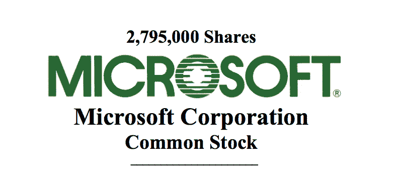
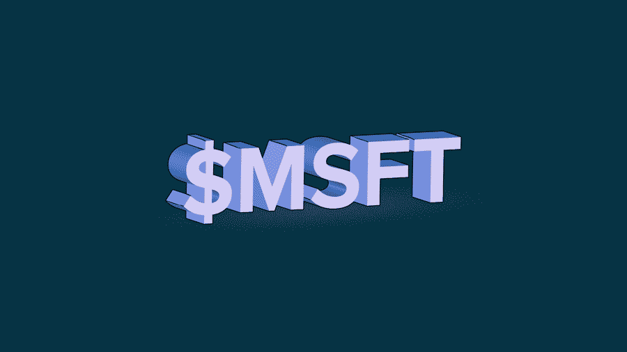

# IPO 回眸:软件成功的微软

> 原文：<https://news.crunchbase.com/news/look-back-ipo-microsoft-software-success/?utm_source=wanqu.co&utm_campaign=Wanqu+Daily&utm_medium=website>

我们正在关注科技巨头的首次公开募股——我们称之为[五大](https://news.crunchbase.com/news/techs-5-biggest-players-now-worth-3-trillion/)的公司。我们从[亚马逊](https://news.crunchbase.com/news/look-back-ipo-amazon-giant-progress/)和[谷歌](https://news.crunchbase.com/news/look-back-ipo-google-profit-machine/)开始。今天，我们来看看微软。

1986 年，微软以每股 21 美元的价格上市，这个价格不仅高于许多人的预期，而且据说比比尔·盖茨想要的价格还要高。

该公司是盈利的，银行里有钱，而且没有来自外部投资者的上市压力。从本质上来说，微软与我们在当前的科技周期中经常看到的完全相反:独角兽一瘸一拐地穿过终点线，护理理发，渴望现金。

*跟随 Crunchbase 新闻上* [*推特*](http://www.twitter.com/crunchbasenews)&

 *到目前为止，我们对科技巨头的首次公开募股进行了一系列的简要回顾，其中包括亚马逊和谷歌，亚马逊的增长令人震惊，亏损相对较小，而谷歌在成立母公司之前只是一家盈利的巨头。微软比书店早出现了十多年，却在不同的时代上市了。

毕竟，1986 年是金属乐队发行《木偶大师》的一年。1997 年，当亚马逊上市时，金属乐队[正忙着推出 Reload——短发和所有东西。如果这不能说明公司上市的不同时期，那就没什么能说明了。](https://www.youtube.com/watch?v=G-Bn_kD6QN4)

对于微软，我们先来看看公司的根源。然后我们将看看它的首次公开募股数字，并以注释结束。我们走吧！

#### IPO 前的简短序言

微软在其 IPO 招股说明书中列出的第一个里程碑出现在 1975 年，当时该公司制造并销售了一款“BASIC 解释器”文件后来指出，1980 年，该公司开始为 IBM 的“个人电脑”制造产品。1981 年，IBM 个人电脑推出了微软的 MS-DOS。

1983 年，微软卖出了第一款鼠标，发布了 Word。1985 年，它开始销售 Excel。同年晚些时候，该公司开始“推出微软视窗系统，一种在微软 MS-DOS 操作系统上运行的图形操作环境。”

1986 年，微软上市。

#### 关于首次公开募股时机、风险资本家和控制的准则

值得注意的是，微软从成立之日起等了 11 年才上市。这有点像现代独角兽，这一群人可能需要比软件公司 7.4 年的先前中位数长得多的时间才能上市。

但微软手里握着两张帮助它避免上市的牌:它从未每年亏损，也从未实质性地感谢风险投资家帮助它成长(大部分情况下)。因此，它的 IPO 之路没有现金储备下降和投资者不耐烦的正常压力。

关于第一点，2013 年 T4 与比尔盖茨在哈佛的一场问答值得我们花时间去了解。一段盖茨言论的[略加清理的删节](https://www.quora.com/How-much-venture-capital-did-Microsoft-raise)很能说明问题。在这里，盖茨讨论了公司运营利润的历史:

> 我们不需要建立任何工厂，我们有现金，我们没有一年亏损。

所以这就是盈利点。盖茨在同一个回答中也提到，有一段时间他没有得到公司的报酬。所以要带点盐拿盈利点。但无论如何，该公司能够自筹资金的事实是公平的。

对于我们的第二点，[盖茨继续说道](https://www.quora.com/How-much-venture-capital-did-Microsoft-raise):

> 我们最终以 2000 万美元的估值，以 100 万美元的价格放弃或出售了公司 5%的股份，只是为了让一家风险投资公司加入我们的董事会，给我们一些关于各种事情的成人建议，这很有帮助。我们在山谷里选了一个，一个叫戴夫·马夸特的家伙加入了我们的董事会，他干得非常出色。
> 
> 那笔钱一直存在银行里，今天仍然存在，所以它与资本无关，而只是为了加入团队。

值得称赞的是，我最初认为它的 Crunchbase 简介是错误的。它列出了来自技术风险投资者的单笔百万美元投资。这就是微软在首次公开募股之前所做的。

简而言之，微软成长，赚钱，推出 Windows，然后上市。让我们到最后一点。

#### 私人增长

在以下段落中，列出的日期和时间范围符合微软的财政日历，在六月底结束。简而言之，微软任何一年的第四财季都与日历上的第二财季相同。同样，任何一年的第三个日历季度都是微软下一财年的第一个季度。如果你不喜欢，就加入俱乐部。

在首次公开募股之前，微软的收入在 80 年代迅速增长。该公司在 1982 年预订了不到 2500 万美元的收入，在 1983 年大约翻了一番，在 1984 年又翻了一番。1985 年，该公司的增长速度放缓至 40%左右。

通过所有这些，根据我们之前的盖茨笔记，该公司实现了盈利。它的净收入从 1982 年的 350 万美元增加到 1985 年的 2400 万美元。在 1985 年结束的 6 个月里，公司净赚了 1700 万美元。

根据其 IPO 招股说明书，该公司上市时手头有 3820 万美元的现金，与它预计在 IPO 中获得的收益(扣除某些费用前为 3940 万美元)相似。如果这些数字听起来很小，回想一下这是木偶大师的时代，而不是重装上阵，[尤其不是圣安格尔](https://www.youtube.com/watch?v=LekSjDC7cKs)(谷歌自己 IPO 前一年)。

那么，一家刚刚突破 1 亿美元营收门槛、拥有长期盈利记录的公司价值几何？

准备好犯错吧。

#### 公共定价

微软的 IPO 过程有一个值得重复的故事情节，因为它将强调我们关于时代差异的观点。微软没有几十倍的收入倍数。相反，它追求的是更接近当今时代不盈利的 SaaS 公司所能满足的东西。

根据发表在*商业和经济案例研究杂志*上的一篇论文，微软的 IPO 之路需要其创始人之一努力压低其初始定价。这真的没用，但是请注意以下几点:

> 这段时间一直处于牛市，现在承销商建议的价格区间为每股 17-20 美元，但初步招股说明书显示可能的报价为每股 16-19 美元。(《纽约时报》，1986)盖茨坚持并得到了较低的价格区间，这对公司高管来说是一个不同寻常的举动。他对 16 美元的最低价格感到放心，认为在这个价格下，降低价格的风险很小，他对 20 美元的价格感到不安，因为这将使微软的市值超过 5 亿美元，他认为这个价格太高了。

微软最终将价格定在了 20 美元以上，最终跌至 21 美元。

与其当时的收入相比，该公司上市后的估值似乎很可笑，自然，与其今天的价值相比也是如此。但是，让我们精确地了解什么是有趣的。 [1986 年《财富》有数据](http://fortune.com/2011/03/13/inside-the-deal-that-made-bill-gates-350000000/):

> 其股票在 3 月 13 日的发行价为 21 美元，在场外交易市场飙升至 35.50 美元，随后回落至最近的 31.25 美元。微软及其股东筹集了 6100 万美元。最大的赢家是该公司的联合创始人兼董事长威廉·h·盖茨三世。他出售的股份仅获得 160 万美元，但上市使他保留的 45%股份的市值达到 3.5 亿美元。

仅用《财富》杂志的粗略计算，价值 350 美元的某个整体的 45%意味着整个独木舟价值约 7.77 亿美元。在这样的倍数下，Snap 买不起 Snapple。

#### Afters 和 Laters

无论如何，微软的首次公开募股做得很好，开启了世界上第三大最有价值的科技公司和世界上第三大最有价值的公司的公众生活。

所有这一切都来了:从[网景传奇](http://www.nytimes.com/1997/09/29/business/microsoft-vs-netscape-the-border-war-heats-up.html)，到[反垄断](http://www.seattletimes.com/business/microsoft/long-antitrust-saga-ends-for-microsoft/)，到[网络过度](http://money.cnn.com/2000/04/24/markets/markets_newyork/)，到 [Windows XP](https://techcrunch.com/2014/03/04/windows-xps-lingering-and-troubling-market-share/) 到 [Windows 7](https://techcrunch.com/2011/09/13/microsoft-sold-450-million-copies-of-windows-7/) ， [8](https://thenextweb.com/microsoft/2012/07/18/microsoft-confirms-windows-8-will-go-on-sale-from-october-26/#.tnw_YW10S99G) ，以及 [10](https://techcrunch.com/2014/09/30/microsoft-announces-windows-10/) ， [Zune](https://thenextweb.com/apps/2010/01/24/zune-music-management-software-existence/#.tnw_vDgZWmbQ) ， [Azure](https://thenextweb.com/microsoft/2012/12/13/microsofts-cloud-vision-how-azure-is-the-linchpin-to-the-firms-new-devices-and-services-corporate-strategy/#.tnw_0RGA37ih) ， [Windows Phone 的失败](https://techcrunch.com/2015/12/04/idc-predicts-sluggish-windows-phone-sales-growth/)，以及[的成功](https://techcrunch.com/2014/05/13/outlook-com-bests-gmails-filters-with-a-new-inbox-automation-system/)

不管怎样，它的基础已经存在。微软已经表明，从软件中赚钱是一个非常好的生意。

苹果和脸书，另外两个非常有趣的首次公开募股，是我们名单上的下一个。在推特上关注 [Crunchbase 新闻，这样你就不会错过了。](https://twitter.com/crunchbasenews)

*插图:[李安天](http://www.li-anne.com/)*

每天通过 Crunchbase 了解最新的融资、收购和更多信息。*