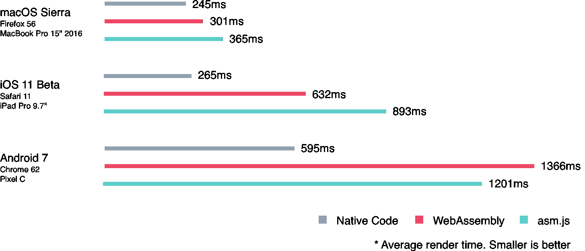

# WebAssembly:新的希望

> 原文：<https://pspdfkit.com/blog/2017/webassembly-a-new-hope/?utm_source=wanqu.co&utm_campaign=Wanqu+Daily&utm_medium=website>


2017 年 3 月， [WebAssembly 社区组就初始(MVP)二进制格式、JavaScript API、引用解释器](https://lists.w3.org/Archives/Public/public-webassembly/2017Feb/0002.html)达成共识。这项令人兴奋的新技术已经在 Chrome 和 Firefox 中推出，并将在 macOS High Sierra 和 iOS 11 中得到全面支持，随后不久将推出 Microsoft Edge 支持。但是什么是 WebAssembly，它对 web 意味着什么？

**不要错过我们的后续帖子:[优化 WebAssembly 启动时间](https://pspdfkit.com/blog/2018/optimize-webassembly-startup-performance/)T3】**

## 在安全浏览器中实现高性能计算的梦想

<center>

[](http://llvm.org/devmtg/2013-11/slides/Zakai-Emscripten.pdf) 

A slide from Alon Zakai’s [presentation about Emscripten][] in 2013.


</center>

2013 年，来自 Mozilla 的 Alon Zakai 开发了一款名为 [Emscripten](https://spectrum.ieee.org/computing/software/webassembly-will-finally-let-you-run-highperformance-applications-in-your-browser) 的编译器，他用它将 C 和 C++编写的游戏编译成 JavaScript 的子集。这个子集名为 [asm.js](http://asmjs.org/faq.html) ，由[卢克·瓦格纳](https://twitter.com/luke_wagner)创建，旨在为语言带来非凡的优化。

通过使用 asm pragma ( `"use asm";`)和漂亮的输入提示，asm.js 允许支持它的 JavaScript 解释器使用低级 CPU 操作，而不是更昂贵的 JavaScript。这使得在我们知道不需要的情况下，绕过许多难以优化的例程成为可能，比如强制和垃圾收集。如果解释器不提供这种支持，代码仍然会以相同的结果执行，尽管速度更慢。

## ASM . js 入门

asm.js 规定了类型提示的使用。例如，`a | 0`用来暗示`a`是 32 位整数或者`+a`是双精度(64 位浮点)。前者之所以有效，是因为规范定义了[位操作符](https://developer.mozilla.org/en/docs/Web/JavaScript/Reference/Operators/Bitwise_Operators)对 32 位序列进行操作。这些表达式没有副作用，因此可以插入到任何需要提示类型的地方——函数调用的参数中，或者函数调用的返回值中。

在下面的例子中，当调用`add`导出时，asm.js 优化的 JavaScript 解释器可能只执行一个 32 位加法，而不支持 asm.js 的解释器将不得不执行更多的指令才能完全遵循 ECMAScript 规范，因为它事先不知道传递给函数的类型:

```
function AsmModule() {
  "use asm";
  return {
    add: function(a, b) {
      a = a | 0;
      b = b | 0;
      return (a + b) | 0;
    },
  }
}
```

为了避免昂贵的垃圾收集例程，内存管理完全委托给应用程序，就像在典型的本机应用程序中，代码必须直接从 RAM 的指定部分分配和释放内存。要实现这一点，首先要分配一个大的内存缓冲区，然后在整个 asm.js 块中使用。asm.js 代码创建类型化视图来访问该缓冲区的片，并将它们用作内存:

```
var heap = new ArrayBuffer(0x100000); // 128kb
var pointer = 0x100;
var view = new Int32Array(heap, pointer, 0x100); // 256 bytes at offset 256
view[0] = 327;
view[1] = 1138;
```

在标记为`"use asm";`的块中，所有高级 JavaScript 特性都可以被停用，直到出现违规为止(例如，直到对象的引用被清除)。

通常，asm.js 代码不是手工编写的，而是从另一种语言(通常是 C 或 C++)编译代码的结果。为了创建 asm.js 优化的代码，创建了[em scripten](https://kripken.github.io/emscripten-site)——一个[LLVM](https://en.wikipedia.org/wiki/LLVM)——到 JavaScript 编译器工具。LLVM 是许多本地开发工具链中的流行工具。它定义了一种中间表示法(LLVM IR ),这是一种类似于汇编语言的低级语言。在原生开发步骤中，这种中间代码已经得到了极大的优化，并可以轻松地转换到目标架构(即代码应该运行的 CPU 架构/指令集，如 x86 或 ARM)。Emscripten 读取这个中间表示，并将其转换为 asm.js，中间还有额外的优化步骤。

<center>


Before asm.js code is generated, LLVM intermediate representation is generated.


</center>

虽然 asm.js 可以显著提高执行速度，并允许没有垃圾收集概念的低级语言(如 C/C++)编译到 web 上，但不幸的是，它也有一些缺点:

1.  类型提示和 JavaScript 语法会产生非常大的 asm.js 文件。

2.  它需要像 JavaScript 一样被解析，这在手机等低端设备上可能很昂贵。

3.  因为 asm.js 需要是有效的 JavaScript，所以向它添加新特性非常复杂，也会影响 JavaScript。

4.  在运行时增加初始堆的开销很大，因为用于存储堆的`ArrayBuffer`是不可变的。要解决这个问题，必须创建一个新的、更大的`ArrayBuffer`，并将内容从第一个缓冲区复制到第二个缓冲区。该操作导致 asm.js 违规，这就是为什么 [Emscripten 警告禁用优化](https://kripken.github.io/emscripten-site/docs/optimizing/Optimizing-Code.html#memory-growth)的原因。

## 街区里新来的小孩

为了解决上述所有问题，2015 年开始开发 WebAssembly，即 *wasm* — [“一种新的、可移植的、大小和加载时间高效的格式，适合编译到网络上”](http://webassembly.org/)。目前部署到所有主流浏览器(Chrome、Firefox、Safari 和 Edge)的第一个版本是 asm.js 的替代品，具有所有相同的功能。与此同时，其他更强大的功能，如线程，也计划在未来的版本中推出。这里需要指出的是，WebAssembly 旨在补充 JavaScript，而不是取代它，并且在浏览器环境中，它只能通过 JavaScript 访问 DOM，而不能直接访问。

<center>

.")

WebAssembly support is rolling out this year in all major browsers. PSPDFKit for Web also supports older browsers by falling back to asm.js.


</center>

WebAssembly 由四个关键概念组成:

1.  **[`Module`](https://developer.mozilla.org/en-US/docs/Web/JavaScript/Reference/Global_Objects/WebAssembly/Module)** —一个编译好的 WebAssembly 单元。与 ES2015 模块类似，WebAssembly 模块向 JavaScript 语言声明导入和导出。

2.  **[`Memory`](https://developer.mozilla.org/en-US/docs/Web/JavaScript/Reference/Global_Objects/WebAssembly/Memory)** —一个*可生长的* `ArrayBuffer`。

3.  **[`Table`](https://developer.mozilla.org/en-US/docs/Web/JavaScript/Reference/Global_Objects/WebAssembly/Table)** —存储函数引用的数组。这提供了在 WebAssembly 中访问 JavaScript 函数的另一种方式，因为这些函数不能直接存储在内存中并以这种方式调用。相反，函数将存储在一个表中，可以用它的索引来调用。主机环境(JavaScript)可以改变表格。

4.  **[`Instance`](https://developer.mozilla.org/en-US/docs/Web/JavaScript/Reference/Global_Objects/WebAssembly/Instance)** —连接到内存和表对象的有状态的初始化模块。

此外，WebAssembly 为语言代码定义了类似于 LLVM IR 的二进制表示，需要编译到主机架构才能使用。一些实现，如微软的 Chakra，使用即时(JIT)策略编译到原生主机架构，其他的，如谷歌的 Chrome，提前编译整个模块。为了避免每次请求 WebAssembly 模块时都进行编译，还可以使用 [IndexedDB](https://developer.mozilla.org/en/docs/Web/API/IndexedDB_API) 将生成的模块保存在客户端上:

```
var importObject = {
  imports: {
    imported_func: function(arg) {
      console.log(arg);
    }
  }
};

fetch("application.wasm").then(response =>
  response.arrayBuffer()
).then(bytes =>
  WebAssembly.instantiate(bytes, importObject)
).then(result =>
  result.instance.exports.exported_func()
);
```

通过这种设计，WebAssembly 解决了我们在上面使用 asm.js 讨论的所有问题:

1.  由于采用了二进制表示，文件大小要小得多。对于我们的产品，WebAssembly 版本大约是 asm.js 版本的一半大小(大约是 gzipped 版本的三分之一)。

2.  WebAssembly 通过加快引擎管道中的多个步骤来缩短执行时间。例如，解析被大大简化了，代码已经是中间格式，只需要进行验证。林·克拉克写了一篇关于 WebAssembly 快速的原因的精彩文章。

3.  WebAssembly 可以用独立于 JavaScript 的新特性来改进。一个很好的例子是 JavaScript 的 SIMD(单指令/多数据)扩展。这种 CPU 驱动的加速是现代汇编中的一个关键优化，但对 JavaScript API 的影响如此之大，以至于由于其复杂性而放弃了将其引入的计划。相反，这个特性将直接添加到 WebAssembly 中，不需要 JavaScript API。

4.  WebAssembly 的内存概念基于 *growable* [`Memory`](https://developer.mozilla.org/en-US/docs/Web/JavaScript/Reference/Global_Objects/WebAssembly/Memory) 类。这使得更动态的内存分配成为可能。

WebAssembly 正在成为将本机代码带到 web 的事实上的解决方案。随着所有主流浏览器的支持和 LLVM 分支内部新的 LLVM 后端 T2 的开发，我们看到了网络的光明未来。

## PSPDFKit 的 WebAssembly

我们最近[发布了 PSPDFKit for Web 2017.5](https://pspdfkit.com/blog/2017/pspdfkit-web-2017-5/) ，这是我们支持独立渲染的 Web 框架的第一个版本，即在客户端上，无需在服务器上运行守护程序。为了完全避免可以读取 PDF 的服务器组件，我们努力将我们的 500，000 LOC C++核心编译为 WebAssembly 和 asm.js。我们可以在所有现代平台上重用 PDF 渲染代码，这对我们来说极其重要，因为 [PDF 渲染很难正确进行](https://pspdfkit.com/guides/ios/troubleshooting/complexities-of-rendering-pdfs)。我们的共享核心为我们提供了随处可见的相同的 PDF 文档的低级渲染和解析，并允许我们完全专注于一个 PDF 引擎。

新的 PSPDFKit for Web 现在还包括了四个工件，分别位于`pspdfkit.js`和`pspdfkit.css`之后:

| 文件名 | 描述 |
| --- | --- |
| `pspdfkit.wasm` | 该文件包含 WebAssembly 二进制代码。 |
| `pspdfkit.wasm.js` | 一个围绕 WebAssembly 模块的小包装器，用于创建与 asm.js 共享的统一 API。 |
| `pspdfkit.asm.js` | 我们的 PDF 后端的 asm.js 版本。 |
| `pspdfkit.asm.js.mem` | 包含 asm.js 版本的初始内存值的二进制文件。 |

当 PDF 查看器初始化时，我们对 WebAssembly 的存在进行功能测试，以及一些附加的 WebAssembly 功能，以决定如何初始化本机模块。

谈论令人兴奋的新技术是一回事，但我们希望您在 PSPDFKit 上体验 WebAssembly 带来的可能性。我们的 PDF 框架的以下演示将在 WebAssembly 可用时使用它，否则回退到 asm.js。当你读这篇文章的时候，我们已经准备好了一切。这只是一个集成 PSPDFKit 有多容易的例子。

<center>**PSPDFKit for Web Using asm.js Fallback**</center>

为了比较 native、WebAssembly 和 asm.js 的渲染性能，我们在各种设备上进行了广泛的基准测试。

<center>



A comparison of PDF-rendering performance across different devices when using native, wasm, and asm.js.


</center>

虽然结果已经令人印象深刻，但我们想指出的是，WebAssembly 非常新，并且正在以惊人的速度发展。新的 LLVM 后端仍然是实验性的，在将 PSPDFKit 移植到 WebAssembly 时，我们发现了许多只能在浏览器供应商的帮助下才能解决的边缘情况。在这一点上，我们想特别感谢 Mozilla 和 Google 的 WebAssembly 团队，特别是 Alon Zakai，感谢他们的帮助。在他们的帮助下，我们能够浏览我们遇到的边缘案例，并构建我们基于 WebAssembly 的 PDF 查看器，甚至在此过程中改进了一点 Emscripten 工具链。

虽然我们对 WebAssembly 的当前状态非常乐观，但我们知道功能较弱的系统仍在与昂贵的渲染操作作斗争。对于这些情况，我们建议您查看我们的服务器支持产品，它已经支持超快速的 PDF 渲染，甚至在低端设备上。在[的未来](https://www.destroyallsoftware.com/talks/the-birth-and-death-of-javascript)，我们还希望服务器支持的安装能够利用 WebAssembly，并且能够按需对客户端呈现的 PDF 文档进行渐进式流式传输。我们相信服务器端和客户端技术的结合将为在网络上显示 PDF 文档提供最佳体验，我们正在努力使其尽可能无缝。

**不要错过我们的后续帖子:[优化 WebAssembly 启动时间](https://pspdfkit.com/blog/2018/optimize-webassembly-startup-performance/)T3】**

您是否对 WebAssembly 和其他 web 技术感兴趣，并且正在寻找一个既能锻炼大脑又能保持工作/生活平衡的工作场所？查看我们当前的工作机会。

