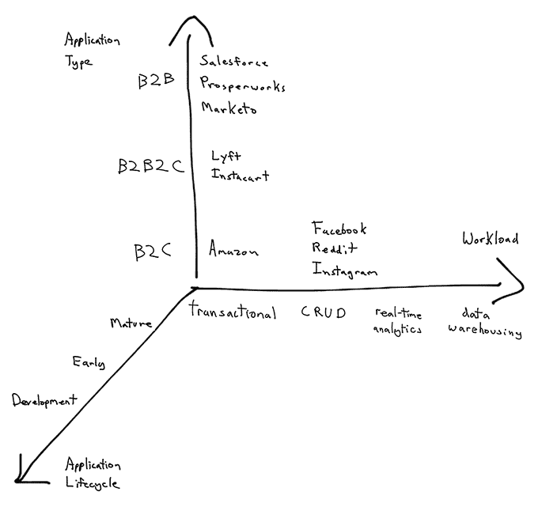
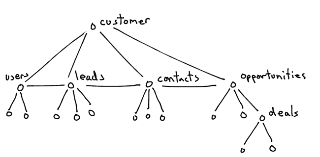
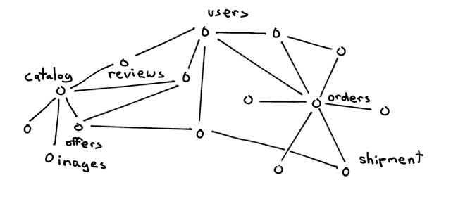

# 关系数据库的分片原则

> 原文：<https://www.citusdata.com/blog/2017/08/09/principles-of-sharding-for-relational-databases/?utm_source=wanqu.co&utm_campaign=Wanqu+Daily&utm_medium=website>

当您的数据库很小(几十 GB)时，很容易投入更多的硬件来解决问题并进行扩展。然而，随着这些表的增长，您需要考虑其他方法来扩展您的数据库。

在某种程度上，分片是最好的扩展方式。分片通过将数据库分成更小的部分，使您能够线性扩展数据库的 cpu、内存和磁盘资源。在其他方面，分片是一个有争议的话题。互联网上到处都是关于分片的建议，从“[扩展数据库基础设施的必要条件](https://www.youtube.com/watch?v=frlsGUHYu04)”到“[为什么你永远不想分片](https://www.percona.com/blog/2009/08/06/why-you-dont-want-to-shard/)”。所以问题来了，你该采纳谁的建议？

我们总是知道，当谈到分片的话题时，答案是“视情况而定”

分片的理论很简单:*选择一个均匀分布数据的键(列)。确保你的大部分问题都可以通过这个键来解决。这个理论很简单，但是一旦你开始对你的数据库进行分片，实践就会变得混乱。*

在 Citus，我们帮助了数百个团队研究他们的数据库分片。当我们帮助他们时，我们看到一些关键的模式出现了。

在这篇博文中，我们将首先看看影响分片项目成功的关键属性。然后我们将深入探究为什么对分片的看法各不相同的根本原因。当谈到对成熟的数据库进行分片时，您正在构建的应用程序的类型比其他任何东西都更能影响您的成功。

### 分片的成功取决于三个关键属性

我们发现，当您考虑对数据库进行分片时，有三个关键属性会影响项目的成功。下图在三个轴上显示了这些属性，并给出了著名公司的名称作为示例。

图表中的 x 轴显示了工作负载类型。这个轴从左边的事务性工作负载开始，一直延伸到右边的数据仓库。在做出扩展决策时，这个维度是最受认可的维度。

z 轴展示了另一个重要的属性:您处于应用程序生命周期的哪个阶段？您的数据库中有多少个表(10、100、1000)或者您的应用程序已经投入生产多久了？一个已经在 PostgreSQL 上运行了几个月的应用程序将比一个已经生产了几年的应用程序更容易使用分片。

在 Citus，我们发现与我们交谈的大多数用户都有相当成熟的应用程序。当您有一个成熟的应用程序时，图中的 y 轴变得至关重要。可悲的是，这个维度并不像其他两个维度那样被认可。事实上，大多数关于分片的文章得出了相互矛盾的结论，这是因为它们在一种应用程序类型的上下文中提供了它们的建议。

### 分片中最重要的是什么:应用类型(B2B 还是 B2C)

图中的 y 轴显示了对成熟的数据库设置进行分片时最重要的属性:您的应用程序类型。在这条轴上，我们在顶部有 B2B 应用程序，其数据模型更适合分片。在这条轴的底部，我们有 B2C 应用程序，如亚马逊和脸书，需要更多的工作来切分。下面，我们挑选三家知名公司，谈谈他们的不同之处。

### B2B 示例:Salesforce

B2B 应用程序的一个很好的例子是 CRM 软件。当你在构建一个 CRM 应用程序时，比如 [Salesforce](http://www.developerforce.com/media/ForcedotcomBookLibrary/Force.com_Multitenancy_WP_101508.pdf) ，你的应用程序将服务于其他客户。例如，通用航空公司将成为您使用 Salesforce 的客户之一。

在通用航空内部，他们有登录到公司仪表板的用户。通用电气还捕捉潜在客户，他们可以与之做生意的人，他们认识并已经有业务关系的人，代表商业实体并有联系人为其工作的客户，以及与客户和一个或多个联系人相关的销售事件的机会。当您在数据库中映射这些复杂的关系时，映射如下图所示。

这个图表一开始看起来很复杂。但是，如果您花更多的时间来研究它，您会发现大多数表都源自 customer 表。然后，通过向所有表中添加一个 customer_id 列，可以将该图转换为下图。

通过这个简单的转换，您的数据库现在有了一个好的分片键:customer_id。这个分片键通常平均分配数据；并且对数据库的大多数查询将包括客户密钥。此外，您可以在 customer_id 上将表放在一起，并继续使用关键的关系数据库特性，比如事务、表连接和外键约束。

换句话说，如果你有 B2B 应用程序，你的数据的本质给了你一个使用分片的基本优势。

### B2C 的例子:Amazon.com

Amazon.com 是一个成熟的 B2C 应用的好例子。如果你今天正在建设 Amazon.com 网站，你需要考虑几个概念。首先，用户来到你的网站，开始看你的产品，如书籍或电子产品。当用户访问一个产品页面，比如说[哈利波特 7](https://www.amazon.com/dp/B0192CTMWS) ，他们会看到与该产品相关的目录信息。示例目录信息包括哈利波特 7 的作者、价格、封面图片和其他图像。

当你的用户登录到你的网站，他们就开始访问用户相关的数据。用户需要经过身份验证，可以对他们喜欢的产品写评论，并可以将商品添加到他们的购物车。在某个时刻，用户决定购买他们购物车中的商品；并下订单。订单现在得到处理，从仓库履行，并成为装运。

当您在关系数据库中映射这些关系时，您会发现它们在一个重要方面与 Salesforce 示例不同。您没有一个维度是所有关系的中心，您至少有三个维度:目录、用户和订单数据。

当你希望分割这种类型的 B2C 数据时，一个选择是将你的应用重构为微服务。例如，拥有目录和提供数据的目录相关服务，以及拥有身份验证和购物车数据的用户相关服务。服务之间的 API 定义了访问底层数据的边界。

当您在您的数据之间创建这种分离时，您就可以分别共享为每个服务或服务组提供支持的数据。事实上，当他们过渡到面向服务的架构时，Amazon.com 使用了类似于分片的方法。

这种分片方法与对 B2B 应用程序进行分片相比，具有明显不同的成本效益比。在好处方面，当您以这种方式将数据分组时，您可以依靠数据库来连接来自不同来源的数据，或者提供跨数据组的事务和约束。在成本方面，您现在需要共享多组数据，而不是一组。

#### B2C2C 示例:Instacart

介于 B2B 和 B2C 之间的一个子类包括 Postmates、Instacart 或 Lyft 等应用程序。例如， [Instacart](https://www.instacart.com/) 从当地商店向用户运送杂货。在某种意义上，Instacart 类似于 Amazon.com 的例子。Instacart 的应用有三个核心维度:提供食品杂货的本地商店、订购这些食品杂货的用户以及送货的司机。所以，很难选择一个键来共享他们的数据库。

当你有 Instacart 这样成熟的 B2C2C 应用时，你可能会遵循不同的策略。您可能会发现大多数数据库表共享一个不同的维度:地理。在这种情况下，您可以选择城市或地理作为分片键，并根据地理键对表进行分片。

一般来说，对 B2B2C / B2C2C 应用程序进行分片处于分片范围的中间。B2B2C 的分片往往比 B2C 的分片有更高的收益成本比，但比 B2B 的要低。

### 关于分片的不同意见:结论性见解

互联网上充斥着关于分片的不同观点。我们发现，这些观点大多是针对一种应用程序或应用程序类型形成的。事实上，你的应用类型(B2B 或 B2C)比其他任何东西都更能影响你在分片上的成功。特别是，如果你有一个 B2B 应用程序，你将有一个更容易的时间分片你的关系数据库。

当然，仅凭这一见解并不能回答所有与分片相关的问题。当您考虑扩展您的数据库时，您需要一个完整的视图，在考虑项目需求的情况下评估所有选项。如果您正在考虑扩展或分片您的数据库，[给我们留言](/about/contact_us),我们很乐意与您交谈！