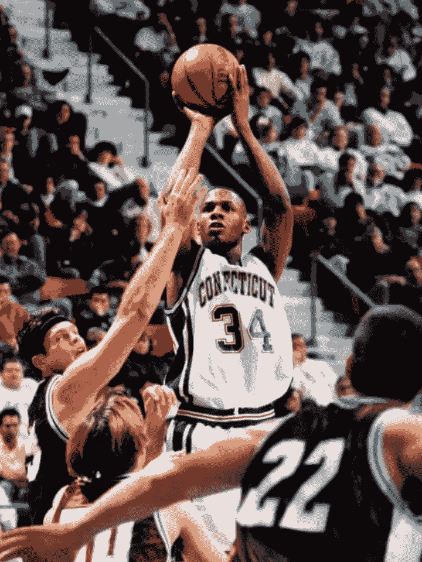
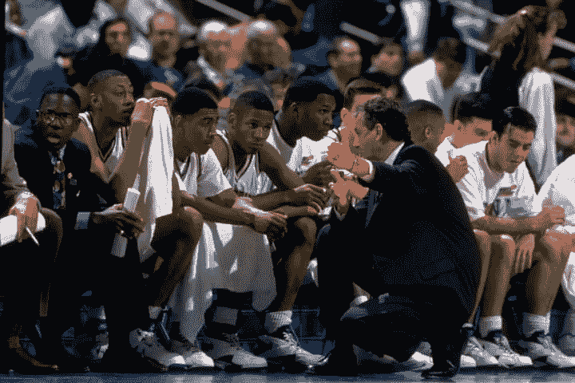
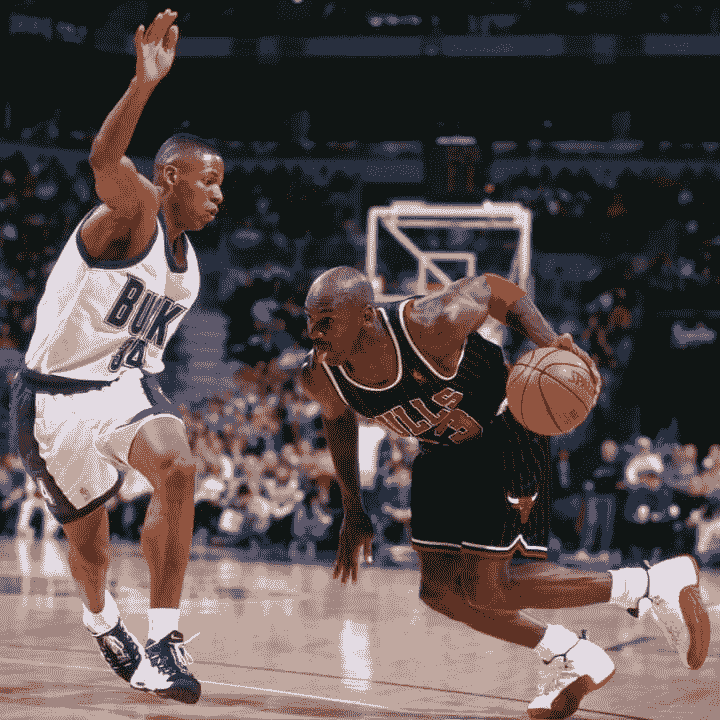
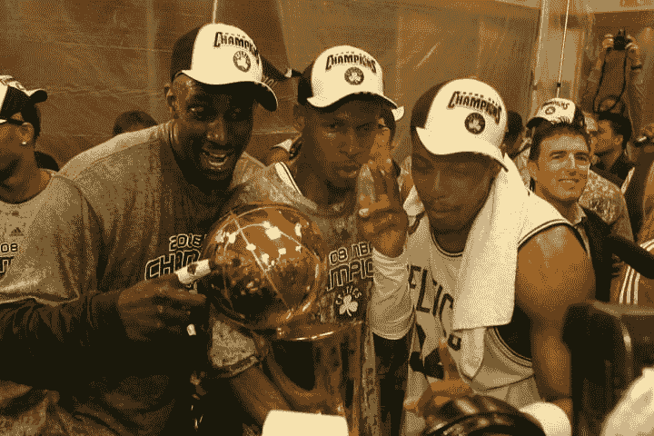
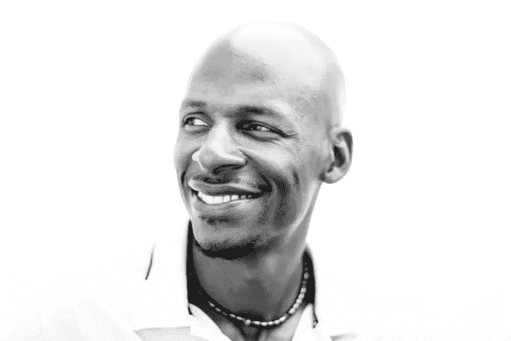

# 写给年轻自己的信

> 原文：<https://www.theplayerstribune.com/ray-allen-letter-to-my-younger-self/?utm_source=wanqu.co&utm_campaign=Wanqu+Daily&utm_medium=website>

亲爱的 13 岁的雷，

当你明天下了校车，你将置身于一个全新的世界。这不是什么新鲜事。每次你父亲进驻新的空军基地，你都要和朋友告别，开始新的生活。三年左右一次都是这样的套路。新学校，新文化，新面孔。
北加州
。然后是德国。然后是俄克拉荷马州。然后是英国。然后是南加州。

而现在，南卡罗来纳州的达尔泽尔。你习惯了做一个无人知晓的孩子。你存在的大部分时间都在试图寻找新朋友，试图向人们展示你是一个好人，你没有恶意。你已经习惯做局外人了。你已经很擅长这个了。

这次虽然不同。现在是学年的中期。每个人都已经互相认识了。你正处于关键年龄，而孩子们只是。孩子们真的很卑鄙。你一生都在一个军人家庭中长大。直到现在，你的朋友都来自军人家庭。你把身份证像狗牌一样挂在脖子上，在附近走来走去，以防一些不熟悉的议员路过。你在英国度过了性格形成的小学时光。所以你自己都没有意识到，但是对某些人来说，你说话很得体。当你明天在南卡罗来纳州走下校车，张开嘴时，那些孩子会把你当成外星人看待。他们会说“你说话像个白人男孩”。

你会环顾学校，看到一群群的孩子都成双成对，你会觉得你没有一个位置。

你会想，我不懂。*我应该是谁？*

我会对你百分百诚实。我希望我能告诉你，事情会变得更容易，你会融入其中，一切都会好起来。但是你不会适应白人孩子，或者黑人孩子…或者书呆子…甚至运动员。你会成为很多人的敌人，仅仅因为你不是那里的人。这将是发生在你身上最艰难也是最美好的事情。我要你做的是:去篮球场。呆在篮球场上。你可以在那里建立你的整个生活。

世界比南卡罗来纳州的达尔泽尔大得多。如果你坚持计划，你会看到的。请记住，当你周六和周日早上躺在床上，听到你父亲的旧面包车的引擎在外面启动。

你知道那声音。不好看。你唯一想做的就是睡觉，但是拿起你的运动鞋跑下楼梯，因为他会离开你。你有两分钟的时间，然后他就会倒车出车道。他现在是军事时间，如果你不能在早上 9 点准时到达空军基地球场，在报名表上签上你的名字，你就要等上一整天才能进去。在球场上你会学到很多东西。作为一个和成年人比赛的 13 岁孩子，你将学会在必要的过渡阶段比赛。你会玩得如此之快，以至于当你走进体育馆时，所有的飞行员都会开始叫你“表演时间”。

在比赛间隙，当你在场边时，我要你非常仔细地听这些家伙讲述的所有故事。在这些球场上，你会听到很多这样的话，“伙计，我本可以……”。

*人啊，要是能时光倒流就好了。*

*我早就走了 D-I.*

*酒劲儿把我镇住了。*

*男人，我就能。…*

*男人，我应该。…*

*我希望我能回到过去，小伙子。雷，永远不要把你自己放在一个希望你能跳进时间机器的位置上。你需要保持专注，因为随着你在球场上取得更多成功，事情只会变得更加复杂。*

<canvas class="style_1e28o3x-o_O-initial_9vayoh"><picture class="base_1emrqjj-o_O-initial_fzbddc-o_O-style_1a1csmw"><source><source><source></picture>

<noscript><picture class="base_1emrqjj"><source srcset="https://images2.minutemediacdn.com/image/upload/c_fill,w_360,ar_3:4,f_auto,q_auto,g_auto/shape%2Fcover%2Fsport%2Fdataimagewebpbase64UklGRsKkAABXRUJQVlA4ILakAAAwMQO-301cda9e693bdaa955914bfae3633440.jpg 1x, https://images2.minutemediacdn.com/image/upload/c_fill,w_720,ar_3:4,f_auto,q_auto,g_auto/shape%2Fcover%2Fsport%2Fdataimagewebpbase64UklGRsKkAABXRUJQVlA4ILakAAAwMQO-301cda9e693bdaa955914bfae3633440.jpg 2x, https://images2.minutemediacdn.com/image/upload/c_fill,w_1080,ar_3:4,f_auto,q_auto,g_auto/shape%2Fcover%2Fsport%2Fdataimagewebpbase64UklGRsKkAABXRUJQVlA4ILakAAAwMQO-301cda9e693bdaa955914bfae3633440.jpg 3x" media="(max-width: 719px)"/><source srcset="https://images2.minutemediacdn.com/image/upload/c_fill,w_720,ar_3:4,f_auto,q_auto,g_auto/shape%2Fcover%2Fsport%2Fdataimagewebpbase64UklGRsKkAABXRUJQVlA4ILakAAAwMQO-301cda9e693bdaa955914bfae3633440.jpg 1x, https://images2.minutemediacdn.com/image/upload/c_fill,w_1440,ar_3:4,f_auto,q_auto,g_auto/shape%2Fcover%2Fsport%2Fdataimagewebpbase64UklGRsKkAABXRUJQVlA4ILakAAAwMQO-301cda9e693bdaa955914bfae3633440.jpg 2x, https://images2.minutemediacdn.com/image/upload/c_fill,w_1440,ar_3:4,f_auto,q_auto,g_auto/shape%2Fcover%2Fsport%2Fdataimagewebpbase64UklGRsKkAABXRUJQVlA4ILakAAAwMQO-301cda9e693bdaa955914bfae3633440.jpg 3x" media="(max-width: 1079px)"/><source srcset="https://images2.minutemediacdn.com/image/upload/c_fill,w_1080,ar_3:4,f_auto,q_auto,g_auto/shape%2Fcover%2Fsport%2Fdataimagewebpbase64UklGRsKkAABXRUJQVlA4ILakAAAwMQO-301cda9e693bdaa955914bfae3633440.jpg 1x, https://images2.minutemediacdn.com/image/upload/c_fill,w_2160,ar_3:4,f_auto,q_auto,g_auto/shape%2Fcover%2Fsport%2Fdataimagewebpbase64UklGRsKkAABXRUJQVlA4ILakAAAwMQO-301cda9e693bdaa955914bfae3633440.jpg 2x, https://images2.minutemediacdn.com/image/upload/c_fill,w_2160,ar_3:4,f_auto,q_auto,g_auto/shape%2Fcover%2Fsport%2Fdataimagewebpbase64UklGRsKkAABXRUJQVlA4ILakAAAwMQO-301cda9e693bdaa955914bfae3633440.jpg 3x" media="(min-width: 1080px)"/></picture></noscript>

</canvas>

Robert W. Stowell Jr./Getty Images

当你开始受到大学的关注时，你自己的一些队友会说这样的话，“康涅狄格大学？你会坐四年的冷板凳。”仅仅因为你不喝酒，他们就会说，“伙计，一旦你上了大学，你就会变成一个酒鬼。你不会准备好的。他们所做的就是在那里喝酒。”

很多人不想看到你成功。不要和这些孩子打架。相信我，它将一事无成。

相反，记得到底是谁说的那些话。

记得他们是怎么说的。

记住他们的面孔。把这些声音留在你的脑海里，每天醒来时把它们当作燃料。那些声音告诉你你就是那个人？那些是应该被阻挡的声音。当你在高中开始得到一些全国的关注时，你会听到这样的话，“雷的跳投是上帝赐予的。”听着:上帝不在乎你下一次是否会跳投。上帝会给你很多东西，但他不会给你跳投。只有努力工作才能做到。不要天真地认为你已经准备好参加大学舞会了。

小伙子，你还没准备好。在高中，你可能认为你知道成为一名伟大的篮球运动员需要什么，但是你真的不知道。当你到了康涅狄格大学，你的教练会告诉你什么是真正的努力。他的名字叫吉姆·卡尔霍恩。别上这个人的黑名单。

<canvas class="style_1e28o3x-o_O-initial_9vayoh"><picture class="base_1emrqjj-o_O-initial_fzbddc-o_O-style_1a1csmw"><source><source><source></picture>

<noscript><picture class="base_1emrqjj"><source srcset="https://images2.minutemediacdn.com/image/upload/c_fill,w_360,ar_3:2,f_auto,q_auto,g_auto/shape%2Fcover%2Fsport%2Fdataimagewebpbase64UklGRooTAQBXRUJQVlA4IH4TAQAw3AW-1c3a602750440a22ddda6289c4710bcf.jpg 1x, https://images2.minutemediacdn.com/image/upload/c_fill,w_720,ar_3:2,f_auto,q_auto,g_auto/shape%2Fcover%2Fsport%2Fdataimagewebpbase64UklGRooTAQBXRUJQVlA4IH4TAQAw3AW-1c3a602750440a22ddda6289c4710bcf.jpg 2x, https://images2.minutemediacdn.com/image/upload/c_fill,w_1080,ar_3:2,f_auto,q_auto,g_auto/shape%2Fcover%2Fsport%2Fdataimagewebpbase64UklGRooTAQBXRUJQVlA4IH4TAQAw3AW-1c3a602750440a22ddda6289c4710bcf.jpg 3x" media="(max-width: 719px)"/><source srcset="https://images2.minutemediacdn.com/image/upload/c_fill,w_720,ar_3:2,f_auto,q_auto,g_auto/shape%2Fcover%2Fsport%2Fdataimagewebpbase64UklGRooTAQBXRUJQVlA4IH4TAQAw3AW-1c3a602750440a22ddda6289c4710bcf.jpg 1x, https://images2.minutemediacdn.com/image/upload/c_fill,w_1440,ar_3:2,f_auto,q_auto,g_auto/shape%2Fcover%2Fsport%2Fdataimagewebpbase64UklGRooTAQBXRUJQVlA4IH4TAQAw3AW-1c3a602750440a22ddda6289c4710bcf.jpg 2x, https://images2.minutemediacdn.com/image/upload/c_fill,w_1440,ar_3:2,f_auto,q_auto,g_auto/shape%2Fcover%2Fsport%2Fdataimagewebpbase64UklGRooTAQBXRUJQVlA4IH4TAQAw3AW-1c3a602750440a22ddda6289c4710bcf.jpg 3x" media="(max-width: 1079px)"/><source srcset="https://images2.minutemediacdn.com/image/upload/c_fill,w_1080,ar_3:2,f_auto,q_auto,g_auto/shape%2Fcover%2Fsport%2Fdataimagewebpbase64UklGRooTAQBXRUJQVlA4IH4TAQAw3AW-1c3a602750440a22ddda6289c4710bcf.jpg 1x, https://images2.minutemediacdn.com/image/upload/c_fill,w_2160,ar_3:2,f_auto,q_auto,g_auto/shape%2Fcover%2Fsport%2Fdataimagewebpbase64UklGRooTAQBXRUJQVlA4IH4TAQAw3AW-1c3a602750440a22ddda6289c4710bcf.jpg 2x, https://images2.minutemediacdn.com/image/upload/c_fill,w_2160,ar_3:2,f_auto,q_auto,g_auto/shape%2Fcover%2Fsport%2Fdataimagewebpbase64UklGRooTAQBXRUJQVlA4IH4TAQAw3AW-1c3a602750440a22ddda6289c4710bcf.jpg 3x" media="(min-width: 1080px)"/></picture></noscript>

</canvas>

Damian Strohmeyer/SI/Getty Images

当你走进体育馆进行第一次练习时，准备好迎接地狱之轮吧。你会很兴奋地穿上你的爱斯基摩犬装备，开始四处射击。但之后蔻驰·卡尔霍恩会改写剧本。

“大一新生！”他会说。“你认为你配穿这身制服吗？你不配拥有这个特权。还没有。”然后助理教练会开始给所有新生分发这些普通的灰色短裤和 t 恤。

“我想看到一些汗水，”蔻驰会说。直到那一刻，你会认为篮球就是走出去，投中一些跳投，展示你的技术。当你完成蔻驰·卡尔霍恩的第一次练习时，你会意识到，哦，这是一场狗娘养的比赛。你将经历人生中最艰难的训练。你会喘着气，弓着背。但问题是，斯托尔斯的健身房是有空调的。你的身体已经习惯了在南卡罗来纳州没有空调的健身房里打球。在训练结束时，卡尔霍恩教练会让每个人站成一排，然后走过去，看着每个球员。当他靠近你时，他会低头看你的衬衫。你的喉结将会渗出一颗汗珠。

他会看着你。然后他会看着小汗珠。然后他会回头看你。

“就这样？我想我们让你做得不够努力，艾伦。”

接下来的练习会更加艰难。这个人几乎要让你崩溃，但他会让你成为一个更好的球员和人。这将向你介绍什么是真正的伟大。几天后，你将迎来人生中最难忘的时刻之一。你将在早上 5:30 醒来，去健身房锻炼，然后回到宿舍，在上课前淋浴。你会穿上衬衫，打好领带，背上背包，穿过校园，去上一天的第一堂课。

时间还早，所以还是安静。树叶在你脚下嘎吱作响。你很酸痛，但你的衣服很性感。你得到了你的工作。你准备好了。你有目标。我不知道这是什么特别的时刻，但是当你走的时候，你会想。我是一名大学生。不管隧道尽头会发生什么，我都要让我的家人感到骄傲。你会说，“因为我能。”

那一瞬间，会觉得自己征服了世界。我可以在这里结束这封信，你可能仍然会对你将要在生活中完成的事情感到兴奋。但是你还有 18 年的 NBA 生涯在等着你。

我如何总结近二十年的 NBA 生涯？你真正需要知道的是什么？什么是真正重要的？

<canvas class="style_1e28o3x-o_O-initial_9vayoh"><picture class="base_1emrqjj-o_O-initial_fzbddc-o_O-style_1a1csmw"><source><source><source></picture>

<noscript><picture class="base_1emrqjj"><source srcset="https://images2.minutemediacdn.com/image/upload/c_fill,w_360,ar_1:1,f_auto,q_auto,g_auto/shape%2Fcover%2Fsport%2Fdataimagewebpbase64UklGRk5iAQBXRUJQVlA4IEJiAQCQ6wa-0b0c984040ed41c5331a379be4a74faf.jpg 1x, https://images2.minutemediacdn.com/image/upload/c_fill,w_720,ar_1:1,f_auto,q_auto,g_auto/shape%2Fcover%2Fsport%2Fdataimagewebpbase64UklGRk5iAQBXRUJQVlA4IEJiAQCQ6wa-0b0c984040ed41c5331a379be4a74faf.jpg 2x, https://images2.minutemediacdn.com/image/upload/c_fill,w_1080,ar_1:1,f_auto,q_auto,g_auto/shape%2Fcover%2Fsport%2Fdataimagewebpbase64UklGRk5iAQBXRUJQVlA4IEJiAQCQ6wa-0b0c984040ed41c5331a379be4a74faf.jpg 3x" media="(max-width: 719px)"/><source srcset="https://images2.minutemediacdn.com/image/upload/c_fill,w_720,ar_1:1,f_auto,q_auto,g_auto/shape%2Fcover%2Fsport%2Fdataimagewebpbase64UklGRk5iAQBXRUJQVlA4IEJiAQCQ6wa-0b0c984040ed41c5331a379be4a74faf.jpg 1x, https://images2.minutemediacdn.com/image/upload/c_fill,w_1440,ar_1:1,f_auto,q_auto,g_auto/shape%2Fcover%2Fsport%2Fdataimagewebpbase64UklGRk5iAQBXRUJQVlA4IEJiAQCQ6wa-0b0c984040ed41c5331a379be4a74faf.jpg 2x, https://images2.minutemediacdn.com/image/upload/c_fill,w_1440,ar_1:1,f_auto,q_auto,g_auto/shape%2Fcover%2Fsport%2Fdataimagewebpbase64UklGRk5iAQBXRUJQVlA4IEJiAQCQ6wa-0b0c984040ed41c5331a379be4a74faf.jpg 3x" media="(max-width: 1079px)"/><source srcset="https://images2.minutemediacdn.com/image/upload/c_fill,w_1080,ar_1:1,f_auto,q_auto,g_auto/shape%2Fcover%2Fsport%2Fdataimagewebpbase64UklGRk5iAQBXRUJQVlA4IEJiAQCQ6wa-0b0c984040ed41c5331a379be4a74faf.jpg 1x, https://images2.minutemediacdn.com/image/upload/c_fill,w_2160,ar_1:1,f_auto,q_auto,g_auto/shape%2Fcover%2Fsport%2Fdataimagewebpbase64UklGRk5iAQBXRUJQVlA4IEJiAQCQ6wa-0b0c984040ed41c5331a379be4a74faf.jpg 2x, https://images2.minutemediacdn.com/image/upload/c_fill,w_2160,ar_1:1,f_auto,q_auto,g_auto/shape%2Fcover%2Fsport%2Fdataimagewebpbase64UklGRk5iAQBXRUJQVlA4IEJiAQCQ6wa-0b0c984040ed41c5331a379be4a74faf.jpg 3x" media="(min-width: 1080px)"/></picture></noscript>

</canvas>

Gary Dineen/NBAE/Getty Images

你将和你心目中的英雄:迈克尔·乔丹和克莱德·德雷克斯勒比赛。你将和名人堂成员一起打球:凯文加内特、保罗·皮尔思、勒布朗詹姆斯、德怀恩韦德。

有时候你会害怕。有时你会觉得自己已经落伍了。但是你会继续每天出现，投入工作。在你的职业生涯中，你会投出超过 26，000 次球。几乎 10 个里面有 6 个都不进去。我告诉过你这是个狗娘养的游戏。

不过不用担心。一个成功的人是由 1000 次失败造就的。或者你的情况是 14000 次失误。你将在波士顿赢得冠军。

你会在迈阿密再赢一次。这两个团队的个性会有所不同，但两个团队都有一个共同点:习惯。

无聊的旧习惯。我知道你想让我告诉你一些在 NBA 成功的大秘密。

秘密是没有秘密的。

那只是无聊的旧习惯。

<canvas class="style_1e28o3x-o_O-initial_9vayoh"><picture class="base_1emrqjj-o_O-initial_fzbddc-o_O-style_1a1csmw"><source><source><source></picture>

<noscript><picture class="base_1emrqjj"><source srcset="https://images2.minutemediacdn.com/image/upload/c_fill,w_360,ar_3:2,f_auto,q_auto,g_auto/shape%2Fcover%2Fsport%2Fdataimagewebpbase64UklGRo6dAQBXRUJQVlA4IIKdAQBQTQa-6c41fda4e766052d69d22219fa2b89ae.jpg 1x, https://images2.minutemediacdn.com/image/upload/c_fill,w_720,ar_3:2,f_auto,q_auto,g_auto/shape%2Fcover%2Fsport%2Fdataimagewebpbase64UklGRo6dAQBXRUJQVlA4IIKdAQBQTQa-6c41fda4e766052d69d22219fa2b89ae.jpg 2x, https://images2.minutemediacdn.com/image/upload/c_fill,w_1080,ar_3:2,f_auto,q_auto,g_auto/shape%2Fcover%2Fsport%2Fdataimagewebpbase64UklGRo6dAQBXRUJQVlA4IIKdAQBQTQa-6c41fda4e766052d69d22219fa2b89ae.jpg 3x" media="(max-width: 719px)"/><source srcset="https://images2.minutemediacdn.com/image/upload/c_fill,w_720,ar_3:2,f_auto,q_auto,g_auto/shape%2Fcover%2Fsport%2Fdataimagewebpbase64UklGRo6dAQBXRUJQVlA4IIKdAQBQTQa-6c41fda4e766052d69d22219fa2b89ae.jpg 1x, https://images2.minutemediacdn.com/image/upload/c_fill,w_1440,ar_3:2,f_auto,q_auto,g_auto/shape%2Fcover%2Fsport%2Fdataimagewebpbase64UklGRo6dAQBXRUJQVlA4IIKdAQBQTQa-6c41fda4e766052d69d22219fa2b89ae.jpg 2x, https://images2.minutemediacdn.com/image/upload/c_fill,w_1440,ar_3:2,f_auto,q_auto,g_auto/shape%2Fcover%2Fsport%2Fdataimagewebpbase64UklGRo6dAQBXRUJQVlA4IIKdAQBQTQa-6c41fda4e766052d69d22219fa2b89ae.jpg 3x" media="(max-width: 1079px)"/><source srcset="https://images2.minutemediacdn.com/image/upload/c_fill,w_1080,ar_3:2,f_auto,q_auto,g_auto/shape%2Fcover%2Fsport%2Fdataimagewebpbase64UklGRo6dAQBXRUJQVlA4IIKdAQBQTQa-6c41fda4e766052d69d22219fa2b89ae.jpg 1x, https://images2.minutemediacdn.com/image/upload/c_fill,w_2160,ar_3:2,f_auto,q_auto,g_auto/shape%2Fcover%2Fsport%2Fdataimagewebpbase64UklGRo6dAQBXRUJQVlA4IIKdAQBQTQa-6c41fda4e766052d69d22219fa2b89ae.jpg 2x, https://images2.minutemediacdn.com/image/upload/c_fill,w_2160,ar_3:2,f_auto,q_auto,g_auto/shape%2Fcover%2Fsport%2Fdataimagewebpbase64UklGRo6dAQBXRUJQVlA4IIKdAQBQTQa-6c41fda4e766052d69d22219fa2b89ae.jpg 3x" media="(min-width: 1080px)"/></picture></noscript>

</canvas>

Nathaniel S. Butler/NBAE/Getty Images

在你去过的每个更衣室里，每个人都会说正确的话。每个人都说他们愿意牺牲一切来赢得冠军。但是这个游戏不是电影。这不是要成为第四节的那个人。这不是说说而已。它每天都在你的工作中出现，当没人注意的时候。

凯文加内特，保罗·皮尔思，勒布朗詹姆斯，德怀恩韦德。和你一起赢得冠军的人将会是完全不同的人。让他们成为冠军的，是那些没人看到的无聊的老习惯。他们比赛看谁能第一个到达体育馆，最后一个离开。那些认为这是老生常谈，或者认为这不适用于他们，因为他们有天赋的同龄人，将会打满整个职业生涯，却没有赢得一个 NBA 总冠军。

但我想让你明白更深层次的东西。冠军不是重点。是的，当你把奖杯举过头顶，想起那些曾经说过你一事无成的人，你会有一种被认可和被证明的感觉。

*四年冷板凳。*

*酒鬼。*

*白衣少年。但是，如果我对你说实话，在你赢得第一个冠军后，你会意识到这种兴奋是短暂的。辩护转瞬即逝。如果你只追求那么高，你最终会非常沮丧。与你每天早上醒来投入工作的感觉相比，冠军几乎是次要的。锦标赛就像你穿着衬衫打着领带坐在康涅狄格大学的教室里。它们只是高潮。你通往那些时刻的蜿蜒小路，就像你在康涅狄格那个宁静的秋天早晨穿过校园一样，是你找到幸福的地方。我真的是发自内心的:生活是关于旅程，而不是目的地。这段旅程将会改变你的为人。让我告诉你最后一个故事，也许能帮助你理解我的意思。

现在是 2013 年 6 月 21 日凌晨。你已经 38 岁了，就在几个小时前，你在迈阿密热火队赢得了 NBA 总决赛的第七场比赛。

你第二次成为 NBA 冠军。*

<canvas class="style_1e28o3x-o_O-initial_9vayoh"><picture class="base_1emrqjj-o_O-initial_fzbddc-o_O-style_1a1csmw"><source><source><source></picture>

<noscript><picture class="base_1emrqjj"><source srcset="https://images2.minutemediacdn.com/image/upload/c_fill,w_360,ar_3:2,f_auto,q_auto,g_auto/shape%2Fcover%2Fsport%2Fdataimagewebpbase64UklGRixxAgBXRUJQVlA4ICBxAgBwKwe-3f238b9ef22d2b0dec60aa07ba4f5a19.jpg 1x, https://images2.minutemediacdn.com/image/upload/c_fill,w_720,ar_3:2,f_auto,q_auto,g_auto/shape%2Fcover%2Fsport%2Fdataimagewebpbase64UklGRixxAgBXRUJQVlA4ICBxAgBwKwe-3f238b9ef22d2b0dec60aa07ba4f5a19.jpg 2x, https://images2.minutemediacdn.com/image/upload/c_fill,w_1080,ar_3:2,f_auto,q_auto,g_auto/shape%2Fcover%2Fsport%2Fdataimagewebpbase64UklGRixxAgBXRUJQVlA4ICBxAgBwKwe-3f238b9ef22d2b0dec60aa07ba4f5a19.jpg 3x" media="(max-width: 719px)"/><source srcset="https://images2.minutemediacdn.com/image/upload/c_fill,w_720,ar_3:2,f_auto,q_auto,g_auto/shape%2Fcover%2Fsport%2Fdataimagewebpbase64UklGRixxAgBXRUJQVlA4ICBxAgBwKwe-3f238b9ef22d2b0dec60aa07ba4f5a19.jpg 1x, https://images2.minutemediacdn.com/image/upload/c_fill,w_1440,ar_3:2,f_auto,q_auto,g_auto/shape%2Fcover%2Fsport%2Fdataimagewebpbase64UklGRixxAgBXRUJQVlA4ICBxAgBwKwe-3f238b9ef22d2b0dec60aa07ba4f5a19.jpg 2x, https://images2.minutemediacdn.com/image/upload/c_fill,w_1440,ar_3:2,f_auto,q_auto,g_auto/shape%2Fcover%2Fsport%2Fdataimagewebpbase64UklGRixxAgBXRUJQVlA4ICBxAgBwKwe-3f238b9ef22d2b0dec60aa07ba4f5a19.jpg 3x" media="(max-width: 1079px)"/><source srcset="https://images2.minutemediacdn.com/image/upload/c_fill,w_1080,ar_3:2,f_auto,q_auto,g_auto/shape%2Fcover%2Fsport%2Fdataimagewebpbase64UklGRixxAgBXRUJQVlA4ICBxAgBwKwe-3f238b9ef22d2b0dec60aa07ba4f5a19.jpg 1x, https://images2.minutemediacdn.com/image/upload/c_fill,w_2160,ar_3:2,f_auto,q_auto,g_auto/shape%2Fcover%2Fsport%2Fdataimagewebpbase64UklGRixxAgBXRUJQVlA4ICBxAgBwKwe-3f238b9ef22d2b0dec60aa07ba4f5a19.jpg 2x, https://images2.minutemediacdn.com/image/upload/c_fill,w_2160,ar_3:2,f_auto,q_auto,g_auto/shape%2Fcover%2Fsport%2Fdataimagewebpbase64UklGRixxAgBXRUJQVlA4ICBxAgBwKwe-3f238b9ef22d2b0dec60aa07ba4f5a19.jpg 3x" media="(min-width: 1080px)"/></picture></noscript>

</canvas>

Joe Murphy/NBAE/Getty Images

你早上五点左右躺在床上，但就是睡不着。最后，在七点左右，你放弃睡觉，蹑手蹑脚地下楼。你所有的朋友和家人都来你家庆祝——他们都在沙发上睡着了。在去厨房做早餐的路上，你踮着脚绕过他们。太阳升起来了，房子很安静。你已经完全实现了你的目标。但你还是不安分。

那么为什么会有这种感觉呢？这不就是你辛辛苦苦争取来的吗？

七点半左右，你坐上车去兜风。你把车停在一栋白色的办公楼前。他们刚刚开始。

当你走进门的时候，接待员看着你说:“雷？什么……你在这里干什么？”

“我睡不着。”

“可是……你刚刚夺冠了。”

“是啊，我就是想出门。”

“可是……现在是早上八点。而你刚刚赢得了冠军。”“嗯，我还有些关于这颗牙齿的工作要做。他在吗？”你的牙医走出他的办公室。

“雷？你这是……什么？”

“睡不着”这就是你眼中成功的样子。你是那种赢得 NBA 冠军后第二天早上就去看牙医的人。我知道，伙计。

我知道。

但是为了实现你的梦想，你会变成另外一种人。你会变得对你的日常事务有点痴迷。这会让你的一些朋友和家人付出沉重的代价。

大多数夜晚，你都不会出门。你的朋友会问为什么。你不会喝酒，永远不会。人们会奇怪地看着你。当你到了 NBA，你不会总是和小伙子们一起打牌。有些人会认为你不是一个好队友。为了工作，你甚至不得不把家庭放在次要位置。

<canvas class="style_1e28o3x-o_O-initial_9vayoh"><picture class="base_1emrqjj-o_O-initial_fzbddc-o_O-style_1a1csmw"><source><source><source></picture>

<noscript><picture class="base_1emrqjj"><source srcset="https://images2.minutemediacdn.com/image/upload/c_fill,w_360,ar_3:2,f_auto,q_auto,g_auto/shape%2Fcover%2Fsport%2Fdataimagewebpbase64UklGRvoAABXRUJQVlA4IO4AABQAAKdA-f6015d500180d5415340f729d41843c4.jpg 1x, https://images2.minutemediacdn.com/image/upload/c_fill,w_720,ar_3:2,f_auto,q_auto,g_auto/shape%2Fcover%2Fsport%2Fdataimagewebpbase64UklGRvoAABXRUJQVlA4IO4AABQAAKdA-f6015d500180d5415340f729d41843c4.jpg 2x, https://images2.minutemediacdn.com/image/upload/c_fill,w_1080,ar_3:2,f_auto,q_auto,g_auto/shape%2Fcover%2Fsport%2Fdataimagewebpbase64UklGRvoAABXRUJQVlA4IO4AABQAAKdA-f6015d500180d5415340f729d41843c4.jpg 3x" media="(max-width: 719px)"/><source srcset="https://images2.minutemediacdn.com/image/upload/c_fill,w_720,ar_3:2,f_auto,q_auto,g_auto/shape%2Fcover%2Fsport%2Fdataimagewebpbase64UklGRvoAABXRUJQVlA4IO4AABQAAKdA-f6015d500180d5415340f729d41843c4.jpg 1x, https://images2.minutemediacdn.com/image/upload/c_fill,w_1440,ar_3:2,f_auto,q_auto,g_auto/shape%2Fcover%2Fsport%2Fdataimagewebpbase64UklGRvoAABXRUJQVlA4IO4AABQAAKdA-f6015d500180d5415340f729d41843c4.jpg 2x, https://images2.minutemediacdn.com/image/upload/c_fill,w_1440,ar_3:2,f_auto,q_auto,g_auto/shape%2Fcover%2Fsport%2Fdataimagewebpbase64UklGRvoAABXRUJQVlA4IO4AABQAAKdA-f6015d500180d5415340f729d41843c4.jpg 3x" media="(max-width: 1079px)"/><source srcset="https://images2.minutemediacdn.com/image/upload/c_fill,w_1080,ar_3:2,f_auto,q_auto,g_auto/shape%2Fcover%2Fsport%2Fdataimagewebpbase64UklGRvoAABXRUJQVlA4IO4AABQAAKdA-f6015d500180d5415340f729d41843c4.jpg 1x, https://images2.minutemediacdn.com/image/upload/c_fill,w_2160,ar_3:2,f_auto,q_auto,g_auto/shape%2Fcover%2Fsport%2Fdataimagewebpbase64UklGRvoAABXRUJQVlA4IO4AABQAAKdA-f6015d500180d5415340f729d41843c4.jpg 2x, https://images2.minutemediacdn.com/image/upload/c_fill,w_2160,ar_3:2,f_auto,q_auto,g_auto/shape%2Fcover%2Fsport%2Fdataimagewebpbase64UklGRvoAABXRUJQVlA4IO4AABQAAKdA-f6015d500180d5415340f729d41843c4.jpg 3x" media="(min-width: 1080px)"/></picture></noscript>

</canvas>

Jed Jacobsohn/The Players Tribune

大多数时候，你会是一个人。

那不会让你成为最受欢迎的人。有些人根本不会理解。代价值得吗？

只有你能回答。

*我应该是谁？明天当你在南卡罗来纳州下校车时，你必须做出选择。

余生的每一天，你都得做出选择。

你是想合群，还是想踏上追求伟大的孤独之路？

今天我以一个即将退役的 41 岁男人的身份给你写下这些。我以一个内心完全平静的人的身份给你写信。下车时你所经历的地狱将是暂时的。篮球将带你远离校园。你将不仅仅是一名篮球运动员。你可以在电影中表演。你会环游世界。你会成为一个丈夫，五个了不起的孩子的父亲。现在，你生活中最重要的问题不是“我应该是谁？”甚至是“我要怎么做才能再赢得一个冠军？”

是“爸爸，猜猜今天数学课发生了什么？”那是在你旅程结束时等待你的奖励。

上朝。待在法庭上。年轻人，开始工作吧。大多数人永远不会真正了解真正的你。但是他们会知道你的工作。*