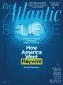

# 当硅谷接管了“新共和国”——大西洋

> 原文：<https://www.theatlantic.com/magazine/archive/2017/09/when-silicon-valley-took-over-journalism/534195/?utm_source=wanqu.co&utm_campaign=Wanqu+Daily&utm_medium=website>

克里斯·休斯是一个神话中的救世主——天真无邪，富有非凡，求知欲强，出人意料的谦逊，骄傲的理想主义者。

我在新共和国的整个职业生涯都在梦想这样一个恩人。多年来，我和我的同事们在互联网时代东奔西跑，从一个所有权团体转到另一个，每个人都渴望拯救这本杂志，拯救它作为顽固的自由主义的知识机构的历史使命。但这些投资者要么缺乏投资我们未来的资源，要么没有足够的信心来完全投入。无休止的寻求赞助让我筋疲力尽，2010 年，我辞去了编辑的职务。

然后，在 2012 年，克里斯走进了门。克里斯不仅仅是一个救世主；他是时代精神的代表。在哈佛，他和马克·扎克伯格是室友，后来他成为了脸书的联合创始人之一。克里斯给了我们过时的旧杂志一个千年认可，一个更大的预算，和一个内部人士对社交媒体的了解。我们觉得好像我们承载了新闻业的希望，那就是渴望找到一个体面的方法来解决所有困扰它的问题。努力是如此之大，令人陶醉。任何人警告说，我们的小实验可能会自行崩溃——我们不会提供一个技术专家拯救新闻业的模型，而是会成为新闻业越来越依赖硅谷的危险的实物教训，我们对此不屑一顾。

<aside class="ArticlePullquote_root__YtnHv">Chris Hughes wasn’t just a savior; he was a face of the zeitgeist.</aside>

初春的一个无风日，克里斯第一次邀请我聊天，我们手里拿着纸咖啡杯，漫无目的地漫步在华盛顿市中心。在他拥有公司的最初几周，克里斯为自己安排了一场无休止的聆听之旅。他似乎渴望与任何曾在该杂志工作过的人，或者可能对此有强烈意见的人交谈。但当我们交谈时，我想知道他是否想要我的建议以外的东西。我开始怀疑他想重新雇用我作为《新共和》的编辑。不久他给了我这份工作，我接受了。

以我的经验来看，新共和国的主人都是老年人，他们已经习惯了自己的财富和观点。克里斯是有趣的不同。他 28 岁，对学习的热情让他看起来更年轻。蜜月期间，他读了*战争与和平*；他在索霍区公寓的长椅上放着几乎所有用英语出版的文学杂志。“当我第一次听说*新共和*要出售时，”他告诉我，“我去了纽约公共图书馆，开始阅读。”当他费力地翻看缩微胶片时，这本杂志历史上的浪漫故事——以及它的传奇作家，其中包括丽贝卡·韦斯特、弗吉尼亚·伍尔夫、埃德蒙·威尔逊、拉尔夫·埃利森和詹姆斯·伍德——帮助他松开了紧握钱包的手。

即使在脸书上市后，给克里斯留下了数亿美元的股票，他似乎对自己的财富漠不关心，或者至少对此感到矛盾。当人们指出他拥有两个庄园和一个宽敞的阁楼时，他会脸红；他喜欢每天穿同样的运动夹克。他的财富来源并不能确定他的身份——事实上，他说起脸书时总是带着一种可爱的超然态度。他甚至没怎么用过，有一次吃饭时他向我坦白。这是一种承认，我觉得既让人放下心来，又极具说服力。我们很快开始翻拍杂志，着手实现我们自己不可思议的高期望。

在过去的一代人中，新闻业被慢慢地吞噬了。我们这个时代蒸蒸日上的媒体公司并不认为自己是一个伟大传统的继承人。有些人喜欢把自己比作科技公司。这种重新定义不仅仅是一点时髦的品牌。随着硅谷向该行业渗透，新闻业开始不健康地依赖大型科技公司，这些公司现在为新闻业提供了很大比例的受众，因此也是其收入的一大部分。

依赖产生绝望——通过脸书疯狂而无耻地追逐点击率，不懈地努力玩弄谷歌的算法。它导致媒体签署了看起来像是自我保护必需品的可怕协议:授予脸书出售广告的权利，或者允许谷歌直接在其快速加载的服务器上发表文章。最终，这样的安排只会让脸书和谷歌把这些公司抓得更紧。

让这些交易如此糟糕的是科技公司的反复无常。迅速转向一个完全不同的方向可能对他们的底线有好处，但对依赖这些平台的媒体公司是有害的。脸书将会决定它的用户更喜欢视频而不是文字，或者更喜欢意识形态上的宣传而不是更客观的事件报道——因此它将不再强调用户反馈中的文字或硬新闻。当它做出这样的转变时，或者当谷歌调整其算法时，流向特定媒体渠道的网络流量可能会直线下降，从而带来连锁收入。然而，问题不仅仅是金融脆弱性。这也是科技公司决定工作模式的方式；他们的影响力可以影响整个行业的风气，降低质量标准，侵蚀道德保护。

我从未想过我们的杂志会走上这条路。我和克里斯一起工作的第一天非常愉快。作为一个局外人，他没有兴趣盲目地坚持公认的智慧。当我们着手重建新共和网站时，我们说服自己采取了一种反动的立场。我们会抵制追逐流量的冲动，抵制用源源不断的点击内容塞满我们的主页的冲动。我们的数字页面会珍视美丽和有限；他们会轻率地宣布我们项目的重要性——他把这个项目描述为不亚于对长期新闻报道和文化严肃性的维护。

克里斯说他相信他能把新共和变成一个盈利的企业。但他关于利润的言辞似乎从未完全真诚过。“我讨厌卖广告，”他会一遍又一遍地告诉我。"这让我觉得不舒服。"在一年多的时间里，他愿意尽情挥霍。事后看来，我本可以对我们的检查更加严格，我指的是 T2，他写道。但他偏爱在黄金地段租赁办公室和雇佣顶级顾问。我喜欢高薪聘请作家环游世界。我很快雇用了一大批员工，包括经验丰富的作家和编辑，他们的价格不菲。克里斯似乎并不介意。“我从未如此快乐或满足，”他会告诉我。“我在和朋友一起工作。”

然而，最终，克里斯还是被这些数字所困扰。钱需要从某个地方来——而这个地方就是网络。流量的大幅增加将带来所需的收入。因此，我们发现自己突然重温了最近的媒体历史，但在一个时间压缩的序列中，十年的痛苦过渡在几个月内崩溃了。

本世纪初，新闻业处于极端时期。经济衰退，加上读者习惯的改变，促使媒体公司赌上一个不受笨重的纸质出版设备阻碍的数字未来。十年间，报纸雇员的数量下降了 38%。随着新闻业的萎缩，它的声望直线下降。一份报告将新闻记者列为美国最糟糕的工作。该行业发现自己被迫重新考虑其存在的理由。所有关于独立的古老秘方突然看起来像是负担不起的奢侈品。

日益增长的流量需要一种新的心态。与电视不同，印刷新闻以前回避对观众的战略追求，认为这是一种肮脏的、有点腐败的事业。新共和国持这种信仰的极端版本。该杂志是进步时代知识分子的发明，几十年来，已经成为一种近乎邪教的东西，迎合了一个忠诚的群体，他们希望阅读关于政治的内幕文章和对文化的高雅思考。然而，在其悠久的历史中，这种读者群无法填满密西西比大学的足球场。

更大的读者群显然触手可及。新闻业的其他人已经吸取了这个教训，BuzzFeed 的创始人 Jonah Peretti 是这样说的:R = z(在流行病学中，*代表传播的概率； *z* 是接触到传染性个体的人数。)这个等式大概说明了一条内容是如何传播开来的。尽管 Peretti 从流行病学中获得了他的公式的想法，但新兴的交通科学实际上是行为科学的一个分支:人们点击得如此之快，他们并不总是完全理解为什么。这些决定是在受认知偏差影响的半意识状态下做出的。吸引读者需要一点操纵，一点隐藏的说服。*

克里斯不仅对交通的必要性感到紧迫，他还知道让交通增长的诀窍。他是数字媒体小组的常客，他从 Upworthy 网站上了解到了病毒式传播，这个网站是他出资帮助创办的。Upworthy 从网上抓取视频和图片，通常是晦涩难懂的东西，然后有条不紊地注入元素，让它们像病毒一样传播。正如心理学家所知，人类乐于接受无知，但他们讨厌被剥夺信息的感觉。Upworthy 利用这种洞察力开创了一种明确戏弄读者的标题风格，只保留足够的信息来刺激他们进一步阅读。对于发布的每一条新闻，Upworthy 会写下 25 个不同的标题，测试所有的标题，并确定其中最能点击的标题。基于这些结果，它揭示了几乎确保命中的语法模式。经典例子:“10 个美国人中有 9 个对这个令人震惊的事实完全错误”和“你不会相信接下来发生了什么。”这些公式在网络上变得司空见惯，直到读者逐渐明白它们。

<aside class="ArticlePullquote_root__YtnHv">Like a manager with a stopwatch, Chartbeat and its ilk now hover over the newsroom.</aside>

Upworthy、 *BuzzFeed* 、Vox Media 和其他新兴互联网巨头的核心观点是，如果你倾听数据，编辑的成功是可以设计的。这种见解被整个行业所接受，并慢慢进入了*新共和国*。克里斯在我们的员工中安装了一个数据专家来增加我们制造病毒点击的几率。这位大师密切关注脸书的热门话题，以及公众在一年前的同一时间渴望什么。“超级碗广告很大，”他在我们的一次每周例会上告诉员工。“我们能创造出什么来达到那个时刻？”诸如此类的问题通常会遭到充满敌意的沉默。

虽然我不喜欢这些策略，但我也没有强烈地抵制它们。克里斯仍然鼓励我们发表长篇文章和深度报道。更重要的是，他问了一个完全合理的问题:我们真的认为自己比《时代周刊》或《T2 华盛顿邮报》更好吗？如果我们能克服自我，像其他人一样写下同样的愤怒，点击就会像雨点般落在我们身上。其他人都这么做是因为它有效。我们需要工作。

在*新共和国*，新闻业新时代的标志之一萦绕着我的生活。每次我坐下来工作的时候，我都会偷偷看一眼——就像我早上醒来的时候，几分钟后刷牙的时候，以及一天中我站在小便池旁的时候。有时候，我只是盯着它的旋转，忽略了我正在编辑的文章或者坐在我对面的人。

我的主人是 Chartbeat，一个为作家、编辑和他们的老板提供网络流量实时统计的网站，显示每篇文章闪烁不定的读者群。Chartbeat 及其竞争对手已经控制了几乎所有的杂志、报纸和博客。有了这些计量器，没有一篇文章有足够的流量——它总是可以通过更好的标题、更好的社交媒体方法、更好的主题、更好的论点来改进。就像一个拿着秒表站在装配线上的经理一样，Chartbeat 和它的同类现在在新闻编辑室上空盘旋。

这是一个危险的转折。新闻业可能从来没有像编辑和作家喜欢认为的那样是一项公益事业。然而这个神话很重要。它推动新闻业挑战权力；这使得记者不愿意屈从于观众的突发奇想；它提供了一种至关重要的超然感。新一代媒体巨头对旧的超然风气没有耐心。这并不是说这些公司不渴望成为伟大的新闻工作者。BuzzFeed 、 *Vice* 和*赫芬顿邮报*投资优秀的报道并雇佣一流的记者——他们已经产生了一些本世纪最令人难忘的调查性新闻。但追求观众是他们的中心使命。他们允许网络无休止的反馈循环来塑造他们的编辑敏感性，决定他们的编辑投资。

<picture class="ArticleInlineImageFigure_picture__HoflP"></picture>

James Gilleard

一旦一个故事吸引了人们的注意力，媒体就会反复愤怒地报道这个话题，榨取这个话题的点击量，直到公众失去兴趣。一个令人难忘却又完全被遗忘的例子:一个关于明尼苏达州猎人杀死一头名叫塞西尔的狮子的故事产生了大约 320 万个故事。事实上，每家新闻机构——甚至《纽约时报》和《纽约客》都试图从塞西尔那里获得一些流量。这需要找到一个新的角度，或者一个足够新的角度。 [*Vox*](https://www.vox.com/2015/7/30/9074547/cecil-lion-chicken-meat) :“吃鸡在道德上比杀死狮子塞西尔更坏。” [*BuzzFeed*](https://www.buzzfeed.com/davidmack/this-woman-claims-she-spoke-with-cecil-the-lion-from-beyond) :“一个灵媒说她在狮子塞西尔死后和他说过话。”TheAtlantic.com:“从狮子塞西尔到气候变化:一场胜人一筹的愤怒风暴。”

在某些方面，这只是一个老式媒体堆砌的数字增强版。但社交媒体放大了加入群体的财务激励。结果是高度衍生的。《The Verge》的创始人约书亚·托波尔斯基哀叹这种缓慢的同质化现象:“所有东西看起来都一样，读起来都一样，似乎在争夺同样的眼球。”

唐纳德·特朗普是这个时代的顶峰。他明白，媒体比近代历史上任何时候都更需要给公众提供它所渴望的马戏。即使媒体对特朗普的暴行不屑一顾，他们也把他塑造成一个看似可信的候选人，在这一点上，他们别无选择，只能报道他。关于特朗普的故事产生了那种取悦数据之神并有利于底线的流量。特朗普以狮子塞西尔开始，最终成为美国总统。

C 有一次，hris 和我坐在华盛顿一家豪华酒店的早餐桌旁，思考着我们将一起重塑的*新共和国*—*新共和国*的核心品质。我们没有明确地这样说，但我们在寻找一个共同点，一个可以把我们团结起来的形容词。如果有白板的话——克里斯喜欢白板——它会被废弃的术语填满。“我们是理想主义者，”他最后说道。"它将我们传奇的过去和我们对解决方案的乐观联系在一起."理想主义是一个让我心软的词，我对达成协议的前景感到无法抑制的喜悦。“嘣。就是这样。”

我们对共同的理想主义抱有理想主义。但是我对世界的看法是道德的和浪漫的；他的理论本质上是技术官僚的。他对系统有信心——规则、效率、组织结构图、生产力工具。在 Chris 拥有杂志两周年之际，他与我分享了杂志未来的修订版愿景。几个月过去了，他变得焦躁不安。他所指的结果是更大的网络流量和更高的收入，需要来得更快。“为了拯救杂志，我们需要改变杂志，”他说。工程师和营销人员将开始在编辑过程中发挥核心作用。他们将给我们的新闻业带来冷静、创新的特色，这将有助于它在市场中脱颖而出。当然，这需要钱，而这些钱将来自资助长篇新闻的预算。他告诉我，我们现在是一家科技公司。(休斯否认说过这话。)对此，我回应道:“这听起来不像是我有资格经营的那种公司。”他向我保证我是。

[<picture class="ArticleMagazinePromo_picture__3DWDM"></picture>](https://www.theatlantic.com/magazine/toc/2017/09/)

## 探索 2017 年 9 月刊

查看本期的更多内容，并找到您的下一个故事来阅读。

[View More](https://www.theatlantic.com/magazine/toc/2017/09/)

两个月后，我从一位同事那里得知，克里斯已经雇佣了我的替代者——而我的替代者正在纽约四处午餐，提供在新共和报的工作机会。在克里斯有机会解雇我之前，我辞职了，杂志编辑部的大多数成员也辞职了。他们的理想主义决定了他们抵制他的理想主义。他们不想为一家其精神气质与硅谷而非新闻业更为一致的出版物工作。他们愿意密切关注脸书，但他们不希望自己的工作被它所限定。这场危机得到了应有的关注，然后这个故事就淡了——这是硅谷吞噬新闻业道路上的一个转折点。

数据已经把新闻变成了一种商品，一种可以被销售、测试和校准的东西。可能媒体的人一直都是这么想的吧。但如果那种冲动存在，它至少被缓冲了。新闻业的领导人对于将社论教会与商业的世俗关注分开保持警惕。我们现在可以看到狂热于在两者之间建造如此厚的墙的原因。

杂志和报纸的制造商过去常常把他们的产品看作一个连贯的整体——一期、一版、一个机构。他们不认为自己是每天在脸书、推特和谷歌上被贩卖的几十个独立作品的出版商。思考将文章捆绑成更大的东西是一种智力解放。编辑们认为高尚而不切实际的文章对于“混合”是必不可少的。如果读者不想要一份关于儿童贫困的报告或者来自南苏丹的新闻报道，他们不会因为你提供了一份而对你评头论足。事实上，他们可能会受宠若惊，因为你认为他们会喜欢读这样的文章。

特朗普获胜后，新闻业的表现如此令人钦佩，以至于越来越难看到该行业的潜在腐败。现在，每一项任务都要经过成本效益分析——这篇文章能赚到足够的流量来证明投资的合理性吗？有时，分析是明确的和有意识的，尽管在大多数情况下，它是潜意识的和委婉的。无论哪种方式，正是这种思路导致编辑宣布一个想法“不值得努力”或担心一篇文章是否会“沉没”新闻业的受众可能比以前多了，但心态却变小了。

* * *

<small>*本文改编自 Franklin Foer 即将出版的新书* [没有头脑的世界:大科技](http://www.amazon.com/exec/obidos/ISBN=1101981113/theatla05-20/)的生存威胁*。*</small>

