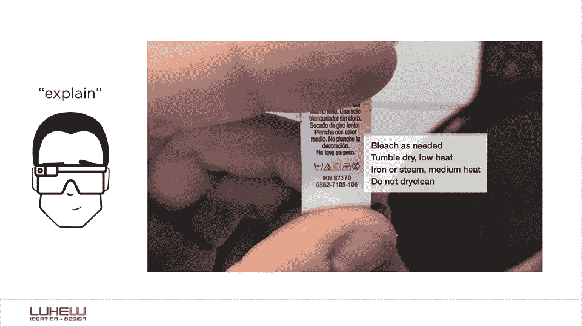
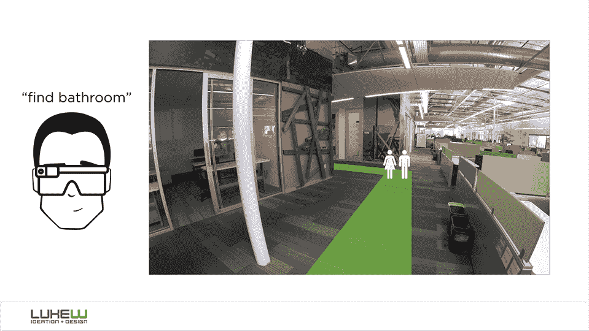
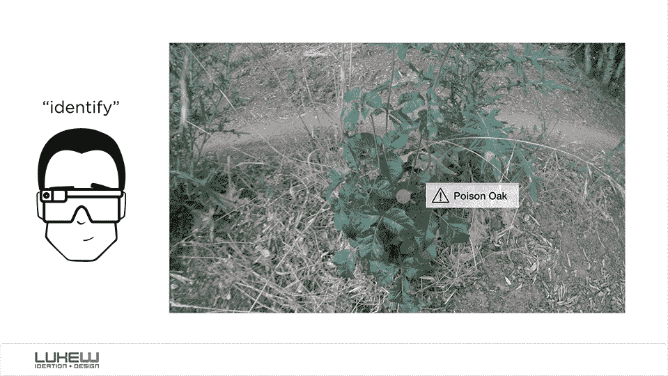
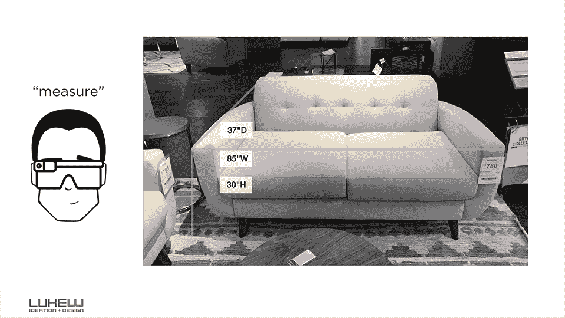
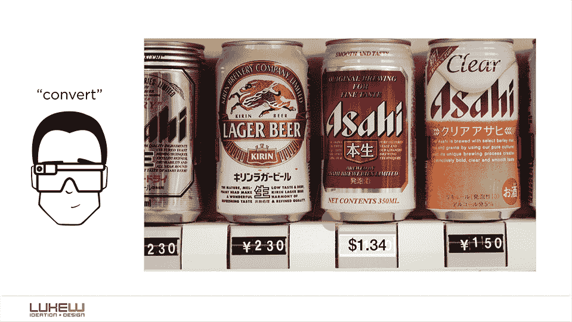
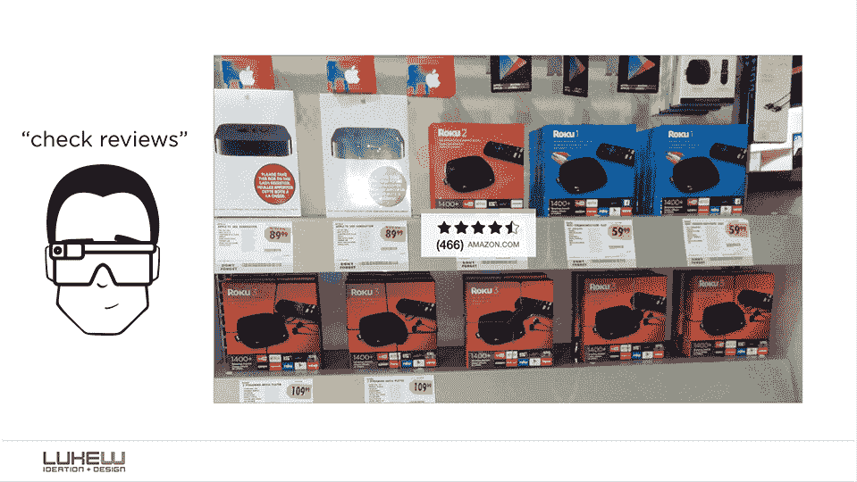
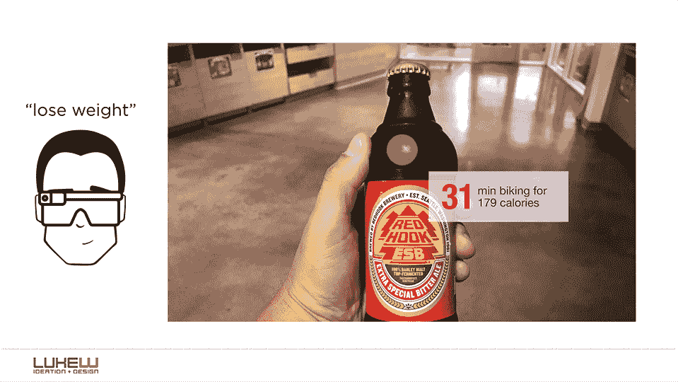

# 什么会增强现实？(1-10)

> 原文：<https://www.lukew.com/ff/entry.asp?1974&utm_source=wanqu.co&utm_campaign=Wanqu+Daily&utm_medium=website>

随着技术行业对增强现实(AR)应用和硬件的忙碌，我认为将斯科特·简森的[值>疼痛定理](https://jenson.org/mobile-apps-must-die/)应用于 AR 设备是值得的。也就是说，“什么价值会超过每天充电和佩戴增强现实耳机的痛苦？”有足够多令人信服的用例让 AR 成为日常必需品吗？

为了尝试回答这个问题，我起草了一系列关于“什么会增强现实？”的插图。对于每个插图，我假设音频输入控制和视线路径/眼睛跟踪用于对象识别。由于这些假设，我特别尝试将最大信息最小阻碍(MIMO)的原则应用到用户界面设计中。

然而，我的高层次目标是真正“增强”现实。也就是说，通过将数字信息和行为纳入物理世界，赋予人们原本不会拥有的能力。以下是我的前十次尝试。

T3】

T3】

T3】

T3】

T3】

T3】

T3】

T3】

T3】

那么，这些用例的价值是否超过了每天佩戴增强现实耳机并为其充电的痛苦？...

