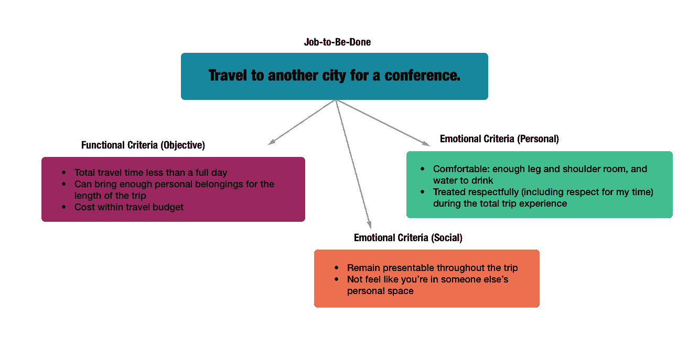
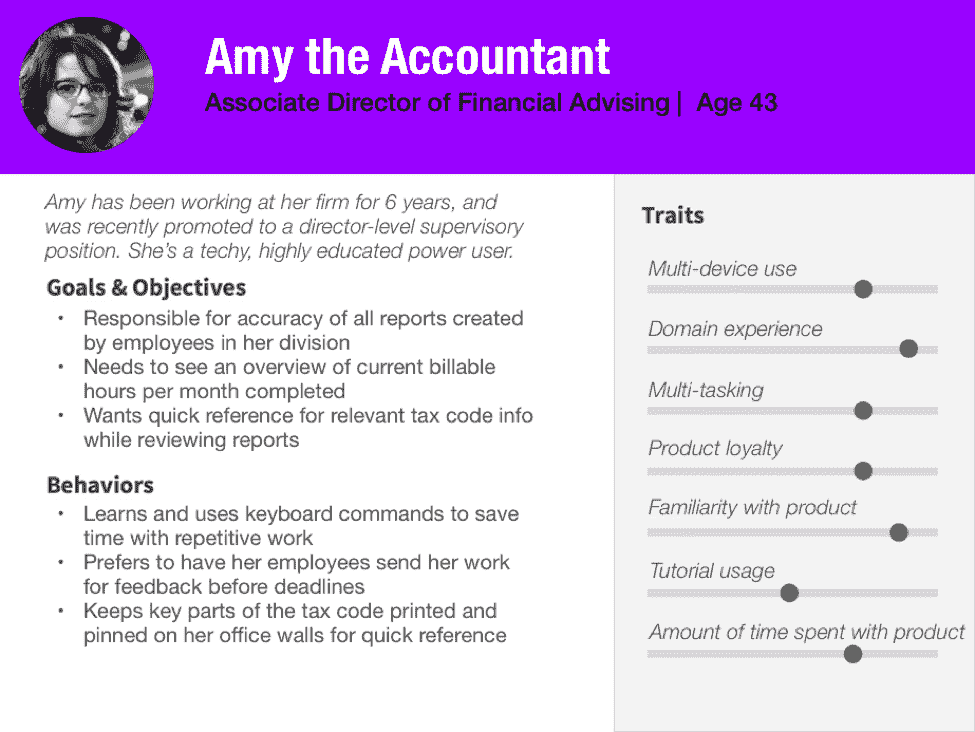

# 人物角色与要做的工作

> 原文：<https://www.nngroup.com/articles/personas-jobs-be-done/?utm_source=wanqu.co&utm_campaign=Wanqu+Daily&utm_medium=website>

## 介绍

在以用户为中心的设计过程中，人物角色一直是一个有用的工具；然而，近年来，**待办事项**，一种关注客户需求的新技术，已经获得了稳定的重视。

定义:**要做的工作(JTBD)** 是一个基于这样一种思想的框架:无论何时用户“雇佣”(即使用)一个产品，他们都是为了一个特定的“工作”(即实现一个特定的结果)。产品的“工作”集合相当于用户需求的综合列表。

随着 JTBD 范式的流行，一些角落里有放弃人物角色的呼声，这表明 JTBD 已经成为一种更有用的技术。这种观点是基于对人物角色主要是用户的人口统计表现的根本误解，忽略了对好的人物角色至关重要的关键行为考虑，这些行为考虑为交互设计和产品策略提供了急需的指导。

## 要做的工作:关注结果而非特征的有用工具

待完成工作框架是用户需求的一种表现形式，产生于定性的用户研究，例如[实地研究](https://www.nngroup.com/articles/field-studies/)，访谈，以及[折扣可用性测试](https://www.nngroup.com/articles/discount-usability-20-years/)。它包括确定客户“雇佣”你的产品的目标(理想情况下，还包括找出这些用户是否准备“解雇”竞争对手的产品)。有了这种理解，产品团队就可以从新的角度思考用户核心问题和需求的本质，并设计出尽可能解决主要需求的产品特性。

虽然 JTBD 框架是新的，但它在许多方面与已建立的方法(如任务分析和用例)相似，这些方法侧重于与产品交互中涉及的上下文、目标和步骤。JTBD 和这些传统的系统分析技术之间的核心区别在于，JTBD 对于用户的任务是什么，以及他们将如何完成它的描述要少得多。任务分析和用例旨在理解产品可以处理用户需要做的典型活动的最佳方式(并且往往最终被现有的解决方案所偏袒)；JTBD 方法将焦点转移到期望的结果上，并质疑那些典型的活动是否是达到用户真正寻求的结果的方式。

例如，如果传统的任务分析发现送货司机经常需要打印出显示如何在日常路线的每个站点之间导航的方向，那么设计团队很可能会专注于使司机尽可能容易地格式化和打印方向；然而，以 JTBD 为中心的方法将专注于送货司机的“工作”(即，在驾驶时获得导航指导)，并将寻找该问题的解决方案(如提供语音指导的 GPS 系统)。

JTBD 框架认为，创新和良好的设计来自于评估客户的真正需求，并创造一个不受满足这些需求的现有产品阻碍的解决方案。然而，[激进的创新可能是一种成本高昂且风险很大的](https://www.nngroup.com/articles/ab-testing-usability-engineering/)产品改进策略。

我们经常听到 JTBD 的拥护者引用西奥多·莱维特的名言，“人们不想买四分之一英寸的钻头，他们想要一个四分之一英寸的洞。”JTBD 框架不是关注一个产品的一系列特性，而是迫使设计师[考虑结果](https://www.nngroup.com/articles/outcomes-vs-features/):用户是否能够(愉快而轻松地)完成他们“雇佣”产品的工作？这个解决方案是否比现有的解决方案提供了更好的结果？

虽然 JTBD 方法没有规定具体的格式或可交付成果，但大多数情况下，要做的工作是以句子形式定义的，注明用户必须做什么，以及任何关键的上下文信息，如为什么或在哪里做。最后，JTBD 描述通常包含功能性成功标准(这份工作成功的客观、明确的要求)，以及情感性成功标准(可以进一步细分为用户的个人情感标准，以及任何社会因素，如他们想象自己会被其他人如何看待)。

*Jobs-to-be-done are typically summarized in a single sentence describing what the user needs to accomplish, and any important context that might impact this job (in this example, work travel for a [conference](http://www.nngroup.com/ux-conference/), rather than vacation travel). Jobs-to-be-done also typically include some information on the objective, functional success criteria as well as the subjective emotional success criteria that cover what counts as a good experience. The emotional criteria are often broken down into two levels: personal criteria and social considerations.*

## 好的人物角色超越了人口统计

许多认为人物角色与 JTBD 的引入无关的观点是基于一个有缺陷的假设，即人物角色主要是对顾客的人口统计描述。人口统计对于产品或设计决策来说很麻烦，因为它们不提供行为或态度数据，并且最适合于做出营销和广告决策。

事实上，人物角色是用户的丰富表现，不仅仅是人口统计或个人信息。大多数精心制作的人物角色包括大量信息，例如:

*   **人口统计细节**，如年龄、婚姻状况或收入
*   **个人详细信息**，例如简短的传记、照片和姓名
*   **态度和/或认知细节**，例如关于人物角色的[心智模型](https://www.nngroup.com/articles/mental-models/)、[痛点](https://www.nngroup.com/articles/spoilers/)和[对需要完成的任务的感受](https://www.nngroup.com/articles/emotional-design-fail/) ed 的信息
*   **使用产品的目标和动机**
*   **行为细节**关于人物角色在使用产品时的行为倾向

人口统计和个人信息的存在有两个主要原因:

1.  在产品团队中建立对用户的共鸣
2.  作为助记手段，帮助团队记住它们

不幸的是，许多人物角色(实际上，市场细分被伪装成人物角色)没有深入到人口统计或个人层面，这就是为什么人物角色经常被嘲笑为在制定设计决策时不如要做的工作有价值。

执行良好的人物角色很大程度上基于丰富的行为特征、[态度数据](https://www.nngroup.com/articles/emotional-design-fail/)和对心智模型的洞察，它们需要对真实用户进行[定性研究](https://www.nngroup.com/articles/which-ux-research-methods/)来揭示用户行为背后的*为什么*。这些丰富的人物角色通常包括与用户在使用产品时必须达到的特定目标相关的信息；这些目标与待完成工作定义中的信息直接相关。

*Well-crafted personas include details about user goals that are similar to those in jobs-to-be-done descriptions, but are enriched with attitudinal, contextual, behavioral, and personal data that can provide a well-rounded set of considerations to guide UX designers and product teams in decision making. (We made up this persona as an example for the report on [Effective Agile UX Product Development](http://www.nngroup.com/reports/agile-development-user-experience/), but it’s representative for personas made in projects that employ a user-centered approach to design.)*

## 待完成的工作不会促进共鸣

人物角色最初关注现实用户描述的一个主要原因是为了摆脱功能和需求列表的复选框思维，并关注用户的体验应该是什么样的*像*。虽然 JTBD 确实包括了一些关于用户目标的情感和社会背景的关键考虑，但是他们在整个用户群中概括了这些考虑，因此错过了关于用户背景的关键意义，并且失去了在设计团队中创造共鸣的机会。

## 人物角色有助于区分不同用户的优先级

想象一下下面的场景:你在一个设计团队中构建一个流行的生产力桌面应用程序的新版本。近年来，竞争对手带着创新产品进入市场，贵公司的领导层希望重新设计应用程序，以便与市场上的新产品竞争。虽然采访你的现有客户和潜在的新客户以了解哪些工作对他们来说是重要的是有用的，但也值得注意这些群体之间的差异:如果你从头开始设计，试图以适合全新用户的方式解决这些工作，你可能会严重改变你的现有客户的工作流程(从而对他们的生产力产生负面影响，因为他们不得不[重新学习产品](https://www.nngroup.com/articles/power-law-learning/))。如果你完全重新设计一个遗留的特性(或者，正如 JTBD 框架经常建议的，创建一个完全不同的、创新的解决方案)，你可能会损害你现有的用户群。

UX 的从业者不得不[在许多不同类型的用户之间平衡设计考虑](https://www.nngroup.com/articles/spoilers/)，这些用户通常有相互竞争的兴趣。虽然所有钻机的购买者都有相同的工作要做，就是在东西上钻孔，但专业承包商会关心工具的耐用性，而在家里挂几张画的人可能更关心价格。这两个考虑是相互冲突的，所以如果我们试图在不区分(和区分优先级)这些用户的情况下处理工作，我们可能会得到一个不令人满意的解决方案，不管它有多创新。

虽然相同的工作对于不同的用户组可能有不同的需求，但是反过来也是一样的:一个用户组(或者角色)可能在不同的环境中为不同的工作“雇佣”产品。例如，我在工作旅行和度假旅行时使用同一个机票预订网站。这些不同类型的旅行最终是截然不同的 JTBD，有着非常不同的考虑，但是，不管我在什么情况下使用该网站，我都分享着相同的关于系统如何工作的心理模型、态度特征和行为特征——无论我是飞往一个 [NN/g UX 会议](https://www.nngroup.com/ux-conference/)，还是去秘鲁徒步印加古道。我可能会有类似于*一些*其他用户的行为和态度，而与其他用户群截然不同。这就是我们创建多个人物角色的原因:反映我们用户之间的关键区别因素，这样我们就可以平衡需求，并在人物角色之间划分优先级。

## 人物角色和要做的工作是兼容的

尽管许多相反的声音认为 JTBD 可以完全取代人物角色，但事实上，两者是完全兼容的。根据您组织的需求，以及您的团队是否已经使用了人物角色或 JTBD，它们可以以互补的方式使用，或者核心的待完成工作信息可以集成到人物角色中。

在已经接受了 JTBD 的组织中，没有必要在人物角色中重复这项工作:每个人物角色工件都可以引用已经存在的适用于该特定人物角色的待完成工作，以及关于该 JTBD 的该人物角色的功能或情感成功标准的任何独特的差异化信息。

如果你的组织已经使用了人物角色，但是它们没有包含丰富的目标和行为细节，而这些是拥有有效人物角色的关键，那么从用类似 JTBD 的信息来扩充人物角色工件开始:不要简单地列出人物角色的目标，考虑将这些信息格式化为待完成的工作，并且问:用户想要完成什么？对这些工作来说，成功的关键因素是什么(功能上和情感上的)？

如果你的组织对创建人物角色有很大的阻力(比如从领导那里获得认同的问题，或者持怀疑态度的同事)，但是有资源和对以用户为中心的数据的偏好来影响产品设计，JTBD 可以是一个有用的替代品。由于 JTBD 是一种新的和流行的技术，在商业文献中有很多支持，可能会有对这种技术的热情。如果你能在以后得到人物角色项目的支持，出现的 JTBD 总是可以和人物角色结合使用(如上所述)。

## 摘要

任何给定设计的可用性只能相对于两个变量来评估:谁是**用户**以及他们需要**做什么**？这就是为什么对可用性研究的有效性来说至关重要的是[招募有代表性的测试用户](https://www.nngroup.com/articles/recruiting-test-participants-for-usability-studies/)并给他们[有代表性的任务去执行](https://www.nngroup.com/articles/task-scenarios-usability-testing/)。一个特定的设计可能对一类用户很好，对另一类用户很糟糕，所以如果你用错误的用户测试，测试结果不会告诉你任何关于真实使用的东西。正是因为这个原因，我们需要在设计过程中指定目标受众*和*他们的目标，这样我们就不会为错误的用户设计或者创建错误的功能。用户和任务:UX 过程要成功，我们需要这两者。

人物角色不仅仅是简单的人口统计或市场细分，它们包括用户目标、需求、痛点和期望的丰富信息，同时将这些信息嵌入到叙事格式中，以促进设计团队之间的共鸣。尽管要做的工作可以提供一种表达特定用户需求的有用方式，但是这些信息已经在执行良好的人物角色中表现出来了。

在我们的全天研讨会中了解更多关于[人物角色的信息。](https://www.nngroup.com/courses/personas/)

