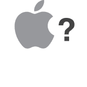
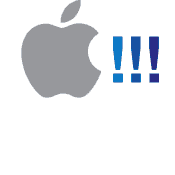

# 恐慌-临时演员-真实的故事

> 原文：<https://panic.com/extras/audionstory/?utm_source=wanqu.co&utm_campaign=Wanqu+Daily&utm_medium=website>

|  |
|  |  |
|  | 

# 我喜欢故事。

作者:恐慌联合创始人只是我吗？我是说，你有没有想过日常用品背后的故事？宝洁公司在最终选择“Swiffer”之前都在考虑哪些名字？(Springle？脊髓灰质炎？Dirtrocker？)有哪些口味的蛋挞从未走出过实验室，有没有哪种涉及到荔枝这种恶魔的水果？有哪些神奇的苹果原型产品永远不会被看到，永远被归入某个可能只存在于我想象中的巨大的旺卡式工业设计工厂？(“Oompa，loompa，digity-dack:来看看这个十二面体 Mac！”).老实说，[“graff le”](popup-graffle.html)到底是什么？好吧，当然，可能只有我。但事实证明，即使像 Mac 应用程序这样看似平凡的东西，也可能有一些有趣的故事，如果不是真正乏味的话。当我们开发出苹果电脑专用的多功能 MP3 应用程序时，史蒂文·弗兰克和我只有一个目标:我们想一边工作一边在电脑上听音乐 CD，我们想让它更时尚。我们没有任何迹象表明 MP3 会在某一天颠覆音乐产业，让它销声匿迹。我们当然不知道像 iPod 这样的东西会突然出现，并真正改变苹果公司。尽管我们并没有真正对任何革命本身负责——相反，我们和许多其他人一起乘坐了革命列车——发生在 Audion 身上的一切都变得井然有序，神奇而又出人意料，就像生活中许多美丽的时刻一样。但是现在，经过多年的努力，我们做出了一个艰难的决定，让 Audion 从积极的开发中“退休”。(喂，等等！放心吧！我们没有破产，没有人离开，Panic 的每个人都在努力开发令人兴奋的新项目，同时更新我们现有的项目。总之。)简单地说，这个退休决定并不容易。为了鼓起勇气做出这个决定，我一直在回想高中年鉴。还记得上学的最后一天，当年鉴到来时，你总是通过塞在最后一页角落里的措辞匆忙、令人心碎的纸条，向你的暗恋对象吐露心声吗？学校的最后一天真的好像是你在地球上的最后一天，你最后一次机会来讲述这个已经渗透了这么久的故事，该死的后果。(当然，两个星期后，你会在一根棍子上的热狗店撞见你的迷恋对象，完全尴尬——伙计，为什么我不干脆写下“祝你有个愉快的夏天”并[在弹簧高跷上画一只长颈鹿](popup-nicesummer.html)——但把它从你的胸口上说出来感觉很好。)想想这是 Audion 高中的最后一天。他仍然会在大学里放松，现在完全免费，可能会留山羊胡子，但他不会像曾经的疯狂野人一样跑来跑去，处于一种——嗯——积极发展的状态。说到这里，我的比喻已经到了极点。简而言之，我们不想让一个华而不实的疯狂的三极管呜咽着死去。我们认为是时候庆祝这一应用程序了——这是数百万个世界中的一个小故事——它为我们做了这么多，它的客户和粉丝帮助我们成为今天的样子，我们欠他们太多了。是时候在伟大的 Mac App 年鉴上落款了。是时候说说 Audion 的故事了。

# 三极管的诞生

 |
|  | 事情是这样的。史蒂夫和我刚刚完成并发布了 Transmit ( [当时它被称为 Transit](popup-transit.html) )，这是我们第一个正式的 Mac 应用程序(嗯，技术上来说是我们的第二个，第一个是[未发布的版本](popup-verso.html))。老实说，我们完全不知道下一步要做什么。没有任何想法的好处就是你没有任何想法。因此，当 1999 年在旧金山参加 Macworld 博览会，真正享受一个激发灵感的展厅时，我们有了一个类似这样的头脑风暴:*苹果菜单吸鸡蛋。*对于那些有幸在麦金塔火车离开 OS X 站时跳上它的人来说(呜-呜！)，苹果菜单——这是在 Mac OS 7/8/9 天——被各种各样的工具和应用程序填满，几乎都是乱七八糟的(除了延斯·阿尔夫克古老的[标签](http://mooseyard.com/Jens/index.php?name=they-made-me-an-offer-i-couldnt-refuse&category_name=me)):一个奇怪的计算器，一个非常黑白的记事本，等等。它还包含一个非常不可或缺的应用程序，叫做 [AppleCD 音频播放器](popup-applecd.html)，可以让你在 Mac 上听 CD。看着苹果菜单，我们突然意识到，虽然我们几乎每天都在使用这些工具，但它们的设计都相当糟糕。“等等，这让我想到了一个主意！”我们中的一个人说，灵感灯泡弹出。"我们去温迪快餐店买些辣椒吧！"后来，手里拿着辣椒，真实的想法出现了:“让我们独自刷新苹果菜单——我们将编写一系列很酷的小应用程序，每个程序做一件事，并把它做好！让我们称之为“PanicPack ”,让它变得可爱，以一个合理的价格将所有的应用程序捆绑在一起！会很酷的！”

# PanicPack =三极管 1.0

 |
|  | 从旧金山回到波特兰，我们立即开始工作。那时，请注意，史蒂文·弗兰克和我都在波特兰西北部的一套两居室公寓里生活和工作；客厅是我们的办公室，厨房是我们的高科技呼叫中心，浴室是我们的浴室。很小，很有趣，也很恐慌。几天之内，PanicPack [设计文档就写好了(。pdf，115k，无聊)](ppack-designdoc.pdf)——有趣的是，我不认为我们已经写了一个设计文档，因为——和往常一样，我立即开始[的工作，在等距立方体的标志](popup-pplogos.html)。我们开始工作的第一个程序是 AppleCD 音频播放器的替代品——一个很酷、很好看的 CD 播放器，我们认为，有一些更有趣的功能，以恐慌的风格完成。“Audion”这个名字在我洗澡的时候突然出现在我的脑海中——我希望有一个更好的、不那么赤裸裸的故事——然后就记住了。三极管关闭并运行。然后有一天，在开发的时候，我们突然想到:*嘿，如果这个东西也能播放 MP3 呢？*Mac 电脑此时只有一个 MP3 播放器:MacAMP。它非常漂亮和高效，但是，除了名字，不太“Mac”——它甚至与 WinAMP 共享相同的皮肤。我们觉得我们可以好好尝试一下——我们可能永远也不会超过 MacAMP，但我们会尽力而为。我们突然非常想成为第一个真正像 Mac 一样播放 MP3 的解决方案，然后，我们开始工作。有时很容易，有时[比](popup-stevedev.html)少很多。在开发过程中，我们实现了一个突破性的突破:alpha 通道。换句话说，Audion 人脸具有自定义透明度级别的能力，并且看起来[通常令人惊叹](popup-audionfaces.html)。这是前所未有的，我们非常兴奋能够实现它——[我们的用户](popup-facesemail.html)也是如此。简单回顾一下历史，在 Mac OS X 和 Quartz 发布之前很久，人们普遍认为，在任何计算机操作系统中，拥有一个可以运行 alpha 通道的窗口都是完全不可能的(或者至少是非常困难的)。换句话说，虽然你可以很容易地创建一个带有透明部分的非正方形窗口(比如从窗口中间切出一个洞)，但不可能让一个柔和的投影投射到窗口上——一个通过不同的透明度水平逐渐与下面的桌面融合的阴影。像我这样的界面设计师——特别是皮肤/面部设计师——拥有 alpha 通道窗口并不是秘密的梦想。简单地说，我不断地就这个想法纠缠史蒂夫。“一定有办法的！”我会说。“怀疑！”他会反击。我一直坚持着，直到有一天我们有了突破:我们可以伪造它！突然，随着这一增加，在我们的脑海中，三极管已经从“普通的音乐播放器”变成了“非常特别的东西”。我开始制作 [SmoothFace](popup-smoothface.html) ，捆绑的 Audion face，虽然不是很漂亮，但有一个完美的投影来展示新的 alpha 系统。当 Audion 完成时，有一件事变得痛苦而清晰——Audion 已经变得比 PanicPack 本身还要大。尽管我曾经为另一个 PanicPack 组件 [ImageFinder](popup-imagefinder.html) 做过一些模型，但我们很快就放弃了。Audion 现在是一个功能非常全面的应用程序，与我们最初的“廉价而愉悦”的蓝图相去甚远。如果我们真的想让四个这种口径的应用成为一个高价值包的一部分，我们会宣布发布 PanicPack..好吧，就现在。PanicPack 悄悄潜入历史，Audion 1.0 终于在 1999 年 8 月 16 日发布。

# 竞争

 |
|  | 如果我能让我们神奇的网络时间机器倒退一点点，当 Audion 已经很好地进行的时候，一些意想不到的事情发生了。史蒂夫第一次参加了在圣何塞举行的苹果全球开发者大会！不，那不是出乎意料的部分。但是在那里，在甜甜圈、杂耍和胡子之间，在一次会议开始之前，在巨大的教室投影仪上显示了某种 MP3 应用程序——奇怪的视觉效果随着音乐旋转，让所有人都可以看到。在那次特别会议上，发言人不假思索地提到，我们正在考虑即将推出的 MP3 播放器，将由现已倒闭的 Casady & Greene 出版，该公司因《保险杠船长》而闻名。从那一刻起，我们已经看到了我们未来敌人的嘴脸:SoundJam。敦敦敦！由比尔·金凯和著名的 Mac 开发者杰夫·罗宾斯创作的 SoundJam 仅比 Audion 早几周发布，尽管我们两人已经在不知不觉中同步开发了几个月。白天被赶去市场的感觉很有趣——想象一下被一只喝醉的袋鼠打了一拳，然后躺在地板上找到了五美元，这是一种同时令人崩溃但最终鼓舞人心的经历。“那应该是我们，”我们哀叹道，“但至少我们有一些他们没有的酷东西！”老实说，SoundJam 被证明是发生在我们身上最好的事情之一——但是，相信我，我们当时不会这么说！我们很快下定决心用一切可能的方式(温和地)击败 SoundJam，尽可能做出最好的产品。在某些情况下，这很容易——就设计而言，我们有强大的 amazing Faces 团队和我们对简洁界面设计的专注——但在其他方面，就不那么容易了——他们已经有了 MP3 编码，这将需要我们花费大量时间来制作 Audion 2。我们还觉得每次我们添加新的和创新的功能时，那些完全相同的功能都会出现在 SoundJam 的下一个版本中——但我敢打赌他们会对我们说同样的话！简而言之，有一个竞争对手意味着我们都推动了自己，客户真正赢了。这里有一个来自“竞争档案”的快速而经典的例子。正如我们之前提到的，Audion 拥有 alpha 通道“面孔”——因此，它足够幸运地吸引了一群令人难以置信的天才艺术家，他们渴望推动 Audion 的极限。与此同时，SoundJam 附带的默认皮肤也是内部恐慌笑声的一个常见来源，因为我们认为它们的外观不够漂亮，从 [Azurite](popup-azurite.html) 到 [WonderJelly](popup-wonderjelly.html) 。他们最终肯定清楚他们不会有任何进展——所以有一天醒来，我们惊讶地发现一个新版本的 SoundJam 突然支持 Audion faces！在经历了愤怒和接受的 10 个阶段后，我们很快意识到他们的面部支持是有根本缺陷的——阿尔法通道本身，我们界面覆盖的皇冠上的真正宝石，不见了！SoundJam 显示我们的脸是平的，没有阴影的，缺少了大块的重要部分。所以，我们肚子里的火现在完全燃烧起来了，我们在我们的网站上创建了一个[特别弹出页面](popup-facessj.html)，提醒现在正在下载 SoundJam 的用户，基本上，他们应该使用 Audion。Respek。几个月过去了，我们没有听到竞争对手的任何消息，最终 SoundJam 更新了...这一次，我们独特的阿尔法通道系统也完全在 SoundJam 中实现了！我们的脸现在看起来和工作得很好...而且在烂节目里！唷。(不仅如此，老实说，他们的 alpha 代码甚至比我们的还要好！)史蒂夫很快努力改进我们的技术，他让我们的技术变得更加流畅，不那么紧张，比他们的技术略胜一筹。但我们都有阿尔法通道，我们都显示音频面孔。2001 年的面子战陷入了僵局，但也造成了一些伤亡。我说的伤亡，是指，呃，两种产品的整体改进。(直到很久以后，当在 Macworld 展示厅与 Jeff 交谈时，他才表达了对我们的“如果你在使用 SoundJam”网页的一些痛苦。“事实上，这一页，”他承认，“是我们复制你的阿尔法通道的东西的唯一原因！”)还有很多对我们来说可能只是有趣的东西:臭名昭著的[愚人节玩笑，面部创作者](popup-aprilfools.html)，神秘的[“是键琴音乐”](popup-harpsi.html)编码复选框，以及[他们的营销](popup-sjsong.html)。唷。大多数情况下，一切都是好脾气的，让事情变得有趣。我只能想象他们对我们的内部笑话...在一天结束的时候(事后才知道),周围有 SoundJam 对我们来说是不亚于梦幻和鼓舞人心的。虽然有时确实有点令人心痛，但杰夫、比尔、大卫和其他 SoundJam 成员都是精明的程序员，他们推动史蒂夫和我进一步创造更好的东西:真的，每个人都赢了。

# 在日本很大

 |
|  | 这里有一个你可能不知道的关于 Audion 的小故事:它在日本获得了巨大成功。真的！在 1999 年 11 月的某一时刻，Audion 在日本卖出的拷贝数超过了任何其他软件——Mac 或 PC！事实上，总的来说，Audion 在日本比在美国卖得好。如此神奇的事情怎么会发生？日本软件分销商 act2 的聪明才智功不可没。当我们开发 Transmit 的时候，他们的美国代表 Matt Arney 问我们是否在做一些有趣的事情。是的，事实上，我们是——一个 MP3 播放器。Matt 看到了新兴 MP3 音频市场的潜在价值，希望我们将其引入日本。看到当时 Audion 缺少 MP3 编码功能，他联系了我们在 Proteron 的朋友，他们开发了流行的 N2MP3 编码应用程序，以创建一个捆绑包。act2 的团队(马特、小野、长谷川、丸本莉子，当然还有 act2 的首席执行官加藤先生)然后非常努力地工作，把一个可怕的最终产品。于是，[一个新的包诞生了](popup-japanboxes.html) : MacMP3！为什么叫它 MacMP3？据我所知，人们普遍认为，如果美国产品重新贴牌，看起来更像日本本土产品，在日本会卖得更好。顶级 Mac 产品传统上是独一无二的，只在日本才有，在其他地方找不到。这种逻辑或许可以解释为什么像 Xbox 这样一款深受美国文化影响但功能出众的产品会在日本遭遇如此令人难以置信的失败——嗯，还有 Xbox 比整个北海道还要大的事实。act2 为 MacMP3 组织了一场[公共营销活动](popup-japansign.html)——看到到处都是广告真是太棒了——很快它开始出现在[零售渠道](popup-japanretail.html)中，因为在线分销现在才在日本站稳脚跟。它首次亮相于 [Macworld Expo Japan](popup-japanexpo.html) (我非常想念这个展会！)，有了自己的[漫画化的手册](popup-japancomic.html)，连[《女伴》](popup-japangirls.html)好像都喜欢！(嗯，我想他们是被收买的。)我们和 act2 一起工作，让 MacMP3 成为现实，度过了一段非常愉快的时光。这是 Audion 更世俗的冒险之一！

# 来自母舰的信号

 |
|  | 我控制不住自己。我一直听说苹果公司的创始人兼首席执行官史蒂夫·乔布斯会阅读他的电子邮件。当你是一个小小的独立 Mac 软件开发者时，这就像一个年轻的外科医生能够直接给医务总监·c·埃弗雷特·库普发电子邮件一样诱人。好吧，所以他不再是卫生局局长了，但我的观点是，当你在战壕里——为一个你几乎完全崇拜的平台编写软件——嗯，如果你知道他会检查他的电子邮件，那么很难拒绝给上帝发电子邮件。所以我发了邮件。1999 年 8 月 16 日，当 Audion 1.0 问世时，几天后我给乔布斯先生写了一封电子邮件。它非常迅速、诚恳，而且切中要害(我自己的爆满的电子邮箱教会了我要简洁)。它用几个简短的句子推销 Audion，并鼓励他下载。就这样。我没有收到回复，但我也没想到会收到。我喜欢想象他读了它，下载并试用了 Audion，与他的同事、家人和理发师分享，但我认为更有可能的是我的信息直接打印到了他办公室的垃圾桶里。然后，一件有趣的事情发生了。9 月 3 日，在我的电子邮件发出几周后，我收到了查尔斯·威尔特根的电子邮件，他当时是苹果全球开发者关系的 QuickTime 技术经理。“我想谈谈音频的未来发展方向，”他说。嗯，这很有趣，我们想。我们在电话里简短地交谈了一下，他似乎有兴趣和我们安排一次会面，谈论 Audion 的一切。我们不知道为什么或如何，但我们肯定很兴奋。然而，在会议开始之前，发生了另一件有趣的事情...

# 美国在线的冒险

 |
|  | 自从 1.0 版本发布以来，我们在 Audion 上的疯狂工作一直没有减少。1.0.1 是在 1.0 的几个星期后发布的，当然，11 月份又发布了 1.2。最后，在 2000 年 2 月 22 日，我们将 Audion 更新到了 1.5 版本。这个版本对我们来说是一个巨大的版本，有许多第一次——它添加了非常受欢迎的分层播放列表，基于 ID3 标签的自动播放列表组织，滑稽且令人惊讶地有效的卡拉 ok 模式，闹钟，一个长期的宿舍最爱，等等。简而言之，我们又一次通过了竞争——至少是几秒钟——我们对 Audion 的位置感觉良好，同时对 Audion 的走向感到不安。竞争继续推动着我们，也许有点过头了。我们觉得我们需要更多的东西来赢得比赛。我们无法摆脱这样一种感觉，即我们陷入了一个无限循环——同时令人难以置信地有趣和乏味——总是用 SoundJam 发布竞争性更新，总是争夺 Mac 用户的心灵和思想，直到有人将事情提升到一个新的水平，并在战略上占据主导地位，就像某种超级书呆子软件开发棋盘游戏一样。基本上，我们想成为吃最多弹珠(不打碎)的河马。我们想给我们的顾客和粉丝一切，成为最好的。是的，我们变得有点狂躁。然后，美国在线突然打来电话。让我解释一下。正如故事所述，这位名叫贾斯汀·弗兰克尔(Justin Frankel)的家伙在和他的朋友汤姆·佩珀(Tom Pepper)创建一个名为 WINAMP 的小程序时，还只是个 19 岁的小伙子。它播放 MP3，涉及羊驼，并几乎启动了整个 MP3 革命，没有它，Audion 就不会存在，这很大程度上归功于贾斯汀。一天，在取得巨大成功后，AOL，可能从很远的地方就嗅到了音乐革命的潜在财富(闻到了他们在班加罗尔的 15，000 个 CD-ROM 生产工厂的刺鼻气味(巧合的是，这些工厂的员工都是牛头人))，猛扑过来，抢购了贾斯汀和汤姆，以及一家名为 Spinner 的互联网广播公司。因此，Spinner / Nullsoft 变成了“一家美国在线公司”，搬到了旧金山一个相当不错的仓库，贾斯汀·弗兰克尔发现自己身上有——至少是相当可观的一部分——86 美元。百万。美元。亲爱的读者们，贾斯汀乘坐了 90 年代末的金钱单轨列车，理论上是赢家。据我所知，不久之后，Nullsoft 发现他们有了一个新的领导者和指路明灯:Rob Lord。在互联网时代无齿翼龙出现前后，罗布曾创建了第一个大型在线独立音乐档案库“IUMA”。最终，Rob Lord 突然向我们提出了一个建议:Nullsoft 已经通过 WINAMP 在 Windows 上占据了主导地位。但是他们没有 Mac 解决方案，而且他们都喜欢 Mac，他们也想拥有 Mac MP3 市场。我们能帮忙吗？问得好。我们开始快速思考。一方面，我们必须为美国在线工作。现在，如果我自由联想“一家小独立软件公司的完美伙伴”，你会马上想到 AOL，不是吗？没错。我们当然不能呆在波特兰，那会很困难。我们会想要放弃恐慌，这个我们用自己的四只手建立起来的东西，去变成别的东西吗？另一方面，会有巨大的金钱帽。虽然这无疑是件好事，但你必须相信我，当我说潜在的财富与这种合作关系带来的真实、诱人、令人垂涎的潜力相比，真的相形见绌:如果 AOL 收购了 Audion，我们会让 Audion 完全免费，即使是编码，如果 Audion 免费，我们就赢了！每个人都会使用我们的程序！没人会用别的东西！没有什么能和免费抗衡！连伏笔都没有！电子邮件快速而疯狂地流动着。

> “当然，埋葬 SoundJam 的一个方法是拥有 AOL /时代华纳等公司的力量。在我们身后。但这是最好的方法吗？我会说:除非我们能保持‘恐慌’，而不是变成(其他什么东西)。”*-我给史蒂文·弗兰克的电子邮件，2000 年 4 月 4 日*

> “如果你需要知道生产什么的帮助，我们这里有人可以帮你组装。我们对您的业务了解得越多，就能越快签署这张金支票。”*-来自罗布·洛德的电子邮件，2000 年 4 月 4 日*

嗯...金色支票。恐慌:一家美国在线公司。恐慌/ Nullsoft？可能只是 Nullsoft。多少钱？让我们的资产负债表井然有序..咨询律师。飞往旧金山。与汤姆·佩珀和贾斯汀·弗兰克尔在 TGI 星期五餐厅共进午餐。谈谈我们对即将到来的 Macworld 博览会的预测。纠缠史蒂芬布卢门菲尔德，Spinner 的首席技术官，一些行动。他正在和弗雷德谈论这件事。试着给恐慌定价。伙计，谁知道我们值多少钱。只有我们两个，老实说可能不值多少钱。但是，嘿，Audion 将是免费的！我们就能支付那些该死的弗劳恩霍夫 MP3 编码专利授权费了！这太棒了。最终，它没有。这笔交易失败得比小米奇嘴里的棒棒糖还快。现实摆在我们面前，美国在线方面缺乏动作让我们意识到一些重要的事情:这可能并不意味着什么。我们最终放弃了。为什么？两个原因:首先，我们的直觉告诉我们，如果被 AOL 拥有，我们的爱好和创作自由将会受到严重阻碍——恐慌不可能像我们希望的那样持续下去。事后看来，这可能是我们最准确的判断——2003 年末，贾斯汀·弗兰克尔在 AOL 毫无预警地终止了他的许多项目(如 Gnutella)后，离开了他自己的公司 Nullsoft。(当然，美国在线必须对世界时代华纳公司做出回应，这些公司合作伙伴可能不喜欢不可阻挡的点对点文件共享网络。)Gnutella 需要被制作出来，我们很高兴 Justin 制作出来了，但是 AOL 就不是那么回事了。早期 Nullsoft 的另一位伟大的合伙人汤姆·佩珀(Tom Pepper)最近也去世了。教训？看起来你要么可以自由地做任何你想做的事情，创造任何你梦想的事情而不需要对任何人负责，要么你可以变得富有。你不可能两者兼而有之。其次，在人们对我们的潜在交易兴奋不已的时候，最初提出这个想法的罗布·洛德(Rob Lord)离开了 Nullsoft。(他去了被雅虎收购的 muse.net，目前正在制作 [Popcast](http://www.popcast.com/index.php) 。)当你的啦啦队员放弃你时会发生什么？你得到的是一群不太积极响应的人，这就是原因。否则你会被淘汰。差不多吧。从那一刻起，美国在线管理层似乎变得异常安静。我们做了正确的决定吗？我真的认为我们过得更好，甚至更好。我们还活着，我们成长了很多，我们很快乐，我们有自由，尽管我们可能一点也不富裕，但至少我们不用离开自己的公司，对吗？我总是相信事情的发生是有原因的，如果事情发生在 AOL 镇，我可能都不会被允许写这篇文章。(因为我会在沙滩上，开着法拉利，喝着李尔喷气机。废话。)史蒂夫·格迪肯(Steve Gedikian)，最后一位留在船上的 Nullsofties 原创者，[很好地总结了这种情况](http://gedikian.com/2004/10/i-havent-forgotten-and-we-will-never.html)——他的第一手知识是任何处于销售边缘的人的必读之作。(史蒂夫也从[离开了 Nullsoft](http://www.betanews.com/article/Death_Knell_Sounds_for_Nullsoft_Winamp/1100111204)——有趣的是，也许具有讽刺意味的是，他现在是 iTunes 团队的一员。)我唯一的遗憾？令我难过的是，那时 Audion 从未有机会免费——真正占据主导地位，掌握在每一个 Mac 用户手中，即使他们负担不起。

# 交叉苹果

 |
|  | 不过，美国在线的故事还有一个有趣的结尾。在激烈的谈判中，苹果公司又出现了。这一次，他们终于准备好在 2000 年 6 月的某个时候与我们见面，讨论“三极管的未来发展方向”。我们也渴望听到他们要说些什么。在纽约 Macworld 大会上看到最新最棒的 Mac OS X 后，我们发现了第一个线索，即苹果正通过创造最基本但非常好看的音乐播放器来变得更加重视 MP3 播放。这让我们更加好奇他们为什么要和我们谈话。会议被苹果公司预定满了，我联系了美国在线的高管——我们仍在与他们深入谈判——以便他们能参与进来。这似乎只是公平的；他们先来找我们，也许这次苹果会议会让他们更快地抓住我们。只不过，他们的日程都被订满了。他们根本没能成功。那些疯狂的商人，我告诉你！所有那些 Palm Pilots，日历屏幕上没有一点空闲时间。因此，我不得不取消与苹果公司的会面。我说，美国在线来不了了。也许我们可以重新安排？与苹果的会面从未发生。嗯（表示踌躇等）..我想知道这是怎么回事？

# 三极管 2.0

 |
|  | 当所有这些额外的事情发生时，史蒂夫和我继续努力工作，为下一个重要的发布 Audion，分心是该死的。这一次，我们决心纠正 Audion 的缺失，同时也发明一些我们自己的伟大创意。快速、完全授权的 MP3 编码(终于！)、工具栏、RIO/Nomad 设备支持、CD 刻录、链接播放列表、基于波形的 MP3 编辑器、DJ 交叉渐变、封面艺术、人气评级和歌曲播放计数、面部[色调变换](popup-hue.html)等等，这个版本简直令人叹为观止！此外，如果不是因为 Audion 2 和新的“速度”效果插件，我们永远不会听到令人震惊、萦绕耳际的花栗鼠*真正的*的声音。2000 年 12 月 18 日，我们终于发布了 Audion 2。很难表达这对我们来说是多么巨大的打击——下载和注册数量创下纪录，每个月都在快速增长。[人们似乎真的很喜欢它。老实说，我们从未经历过这样的事情。](popup-diesel.html)

# 大型电子邮件

 |
|  | 当 Audion 2 即将发布时，我开始听到一些奇怪的声音。(不开玩笑。)我在 Mac 软件行业的各种朋友告诉我，SoundJam 正在发生一些事情，它可能会慢慢从商店中消失。在一次令人捧腹的业余时间商业间谍活动中，我打电话给 Casady & Greene 的办公室，询问“现在购买 SoundJam，你知道，是不是一个好主意”或者其他类似的问题。有趣的是，我在好心支持者的回答中察觉到了一种明显的担忧，你知道，嗯，即使没有别的，它也会在未来得到支持。简单地说，我们非常好奇。更奇怪的是，所有的谣言都指向苹果。由于迫切需要信息，我给苹果公司负责全球产品营销的高级副总裁菲尔·席勒发了一封电子邮件，因为他已经成为了 Audion 的注册用户，这让我们非常兴奋！他也是 6 月份有兴趣与我们会面的人之一。此外，Phil 给我们的印象总是非常酷，非常敏锐，并且非常适合第三方开发。然而，忠实于他的训练，菲尔拒绝透露任何关于可能在库比蒂诺酝酿的信息。理解(但焦虑)，我同意等等看会发生什么。我还顺便向菲尔提到，美国在线的交易已经结束了。然后，Audion 2 一发布，我就参加了自己的“给史蒂夫发电子邮件”的仪式，给他发了一封关于 Audion 2 的简短信件，并鼓励他去看看。再一次，我想象打印机直接进碎纸机，但它仍然感觉很好。然后，几天后——至少是在圣诞夜——它来袭了。*原子弹。*

> from-@ Pixar . com Sun 2000 年 12 月 24 日 07:49:08
> 接收时间:下一个。梅勒(1.148.2)
> 发件人:史蒂夫·乔布斯< - @pixar.com >
> 日期:孙，2000 年 12 月 24 日 07:36:53 -0800
> 收件人:卡贝尔·萨瑟<>
> 主题:回复:音频 2:你有机会看到它了吗？
> 
> 卡贝尔，
> 
> 我听说你和美国在线的交易告吹了。有兴趣和我们一起加入苹果吗？
> 
> 最好的，史蒂夫

*哇。*那是史蒂夫..就像..工作。史蒂夫·乔布斯。史蒂文。乔布斯。那个人..谁做了这件事..有苹果和...在我的收件箱中..沃兹尼亚克..哇哦。他想知道我们是否有兴趣加入他们？我们整个职业生涯基本上都要归功于他，他基本上创造了我们想要拥抱的平台，我们想要压碎成快乐的小块的电脑？正如孩子们说的，看到一些可怕的片段和/或 gibs: OMFG。我从椅子上跳起来，冲着史蒂文(弗兰克)大喊，当然，他正在睡觉。(并不是说史蒂夫在工作时睡觉；确切地说，那是一个周末。周末史蒂夫倾向于睡懒觉，直到世界末日来临。)我敲了几分钟他的卧室门，吓坏了。他摇摇晃晃地站起来，同样震惊地坐下来，试图解析我屏幕上那堆令人反胃的 ASCII 码。这听起来可能有点夸张，但是对于两个制作共享软件的人来说，这是一件非常非常大的事情。起初我们认为这可能是一个残酷的玩笑。然后我们注意到它是由使用 NeXT Mailer 的人发送的[！(这是在 Mac OS X 完成之前，我们认为史蒂夫并不特别喜欢 Mac OS 9。)](popup-nextmailer.html)“嗯，这绝对是真的，”我们同意，努力保持冷静。“但这意味着什么？”我小心翼翼地给乔布斯写了回信，我们暂定了见面时间——几周后的 2001 年 Macworld Expo 期间。至少可以说我们很激动。以至于，我们几乎忘记了一个事实，那就是一周后，我们的音乐堵塞之谜的答案就要在我们眼前揭开了。

# 向 iTunes 问好

 |
|  | “嗯。哼。哇。”这差不多是我们看到 iTunes 时的反应的精炼、非亵渎版本。在 2001 年 1 月的 Macworld 博览会上，史蒂文、我和我的朋友亚历克西斯·克罗夫特坐在一起，真的是如坐针毡——我们听到了谣言，我们几乎对将要发生的事情感到害怕。到了展示 iTunes 的时候，我在椅子上稍微低了一点。界面显示出来的时候，我很快研究了每一个像素。当史蒂夫·乔布斯让它看起来有点像他们发明了可视化工具——“我们想，如果你能看到你的音乐，那该多好啊！嗯，我们就是这么做的”——我们笑了笑。当每个特征被揭示时，我们互相看着对方，试图完全理解我们面对的是什么。一方面，它比 Audion 简单得多——没有 MP3 编辑，没有面孔，没有播放次数，没有评级，没有分级播放列表。但是从另一方面来说，它真的没有那么糟糕——它的界面非常智能——而且，糟糕，它是免费的。当然它必须是免费的。iTunes，当然，我现在要说的是，非常聪明。它单枪匹马地教会了我们一种全新的软件设计哲学。你真的需要那 1%的用户会使用的偏好吗？除了将每个功能放在单独的窗口中，你能找到更好的方法来设计界面吗？你能清理这个吗，即使这意味着它有点不灵活？iTunes 为广大用户开辟了干净、高效的软件设计的道路，这是我们今天积极实践的设计哲学。这是一种让复杂的数字音乐收藏变得简单的方式。当然，它是有限的，但是人类很容易做到。我们对自由装出一副勇敢的面孔。“就像星巴克一样！”我们认为。“所有那些小咖啡店，他们受益于星巴克让咖啡变得更受欢迎，将花式埃塞俄比亚 Yirgacheffe 引入乔·布雷克。同样，iTunes 只会让 MP3 音乐更受欢迎，当一个人不再需要 iTunes 的基本界面时，他们就会来找我们，购买 Audion，我们就会从中受益！”除了那不是真的。这是真的——事实上，我们仍然认为这有很多可说的，并且“pro iTunes”程序有市场——除了一个事实，你知道，星巴克咖啡不是完全免费的。这让事情变得有点棘手。但是，首先。既然 iTunes 已经退出了，苹果公司为什么要和它见面呢？

# 秀场疾风

 |
|  | 我第一次和史蒂夫·乔布斯交谈时，气氛相当紧张。不一定是因为我紧张，或者他生气，或者其他类似的原因，而是因为我们在 Macworld Expo 展厅的中央交谈，周围是一群旁观者，被公关人员可疑地用激光照射。就在 iTunes 向全世界推出几个小时后，离我们在苹果园区的正式会面只有几天了，史蒂文·弗兰克和我正在浏览展厅。“嘿，看，那是乔布斯，”史蒂夫指着一大团像变形虫一样的黑色 t 恤说道。“哦，伙计..我得和他谈谈，”我宣称。我不知道为什么——好像我被一种看不见的力量推着。请注意，我是一个喜欢与人交谈的人，但即使是我也不会贸然行事，比如，你知道，试图在疯狂的时候与苹果公司的首席执行官交谈。但是，我还是说了，我挤进了演播厅的人群，焦急地打着招呼。我们聊了一会儿，回想起来，还是挺有趣的。

> "你好，史蒂夫，我是恐慌频道的卡贝尔。"
> 
> “哦，嘿，卡贝尔！很高兴见到你。告诉我，你觉得 iTunes 怎么样？”
> 
> “嗯，我觉得它看起来很棒！你们做得很好。但是，你知道，我仍然觉得我们会做得很好。”
> 
> “哦，真的吗？很有意思，因为说实话？我不认为你们有机会。”

啊哈！我听说过的一些著名的乔布斯魔术！幸运的是，这看起来更像是戏弄而不是残忍的刺伤——老实说，我很喜欢他的诚实，这让我陷入了一种奇怪的“我准备好了，女朋友！”心情。

> “嗯，史蒂夫，我真的认为它还是会有观众的，”我回答道。“我们有很多高端功能，你们可能永远不会添加。”
> 
> “是吗？比如什么？”
> 
> “嗯，嗯..”我有点被难住了。“您可以统计一首歌曲的播放次数，甚至可以根据流行程度对歌曲进行评级……”
> 
> "...为什么会有人想这么做？”
> 
> “嗯，也许你想按你最喜欢的歌曲对你的播放列表进行排序……”
> 
> "...你必须明白，这只是 1.0，当然。你只能想象到我们发布 2.0 时我们会在哪里！”

(当然，他是对的。例如，我们从来没有想象过 iTunes 音乐商店...)

> “是啊，我相信你们会做大事的，”我鼓励道。“不管怎样，我无意在这里占用你的时间，我只是想打个招呼。”
> 
> “没问题。很高兴与您交谈，我期待着本周晚些时候的会面！”

唷。具有讽刺意味的是，iTunes 的下一个版本在近一年后才问世，而且包括了播放次数*和*歌曲流行率！但是，现在我真的为我们的会面做好了准备——我幸存了下来，不，我真的很喜欢和史蒂夫聊天，我迫不及待地想知道他在想什么。

# 短暂但激烈的会议

 |
|  | 几天后，在与苹果行政助理进行了一轮紧张的日程安排和重新安排后，史蒂夫·弗兰克和我坐上了开往库比蒂诺无限循环路 1 号的地铁列车。那天的事我记不太清了；我们在一家似乎只有工程师的泰国餐厅停下来吃午饭，我吃了一些我希望我没有吃的辛辣咖喱，我们四处闲逛并参观了一家死亡网络公司的现场拍卖网站(Aeron chairs by the buckets！)，我们最终走到[苹果园区](popup-meeting2.html)，坐在大厅里——[可能紧张，也可能兴奋。](popup-meeting3.html)我们被叫去参加会议，第一个和我们打招呼的人是杰弗里·罗宾汉——我们的老对头！耶！到目前为止，还没有真正的公开证实 iTunes 实际上是 SoundJam 的重生，所以在那里看到他有点像是一个案例。在比赛终于结束的情况下，看到他也很高兴。(当然，现在 SoundJam 变成 iTunes 已经是[众所周知了。)](http://www.thinksecret.com/news/wsjcasadygreene.html)菲尔以一条有趣的信息开始了会议:

> “你们还记得上次我们试图和你们见面吗？这实际上是因为我们想让你们制作 iTunes，”菲尔解释道。

哦。所以*这就是*那个从未发生过的早会的内容。因为我们和 AOL 纠缠不清，所以我们从来没有见过面，苹果转向了他们的下一个选择，SoundJam，剩下的就是历史了。另一个你会一直好奇的令人惊奇的“生活交汇点”——*如果我们做了 iTunes 会怎么样？我们会幸福吗？我们会有同样多的乐趣吗？我们会，呃，富有吗？*总之，过了一会儿，史蒂夫·乔布斯亲自走进了苹果公司巨大的董事会会议室，双脚搭在桌子上，抓住了问题的实质。老实说，我的记忆在这里有点压缩，因为整个经历简直是超现实的，难以处理。发现自己——仅仅是两个制作 Mac 共享软件的书呆子——坐在苹果园区，与所有这些杰出的大人物开会，几乎让我们的脑袋持续快速爆炸，至少可以说是谦卑。乔布斯想知道我们有多大，我们做这个有多久了。他想知道一些我都不记得的事情。我记得他问:“对于你想开发的应用程序，你有其他想法吗？”我真诚地回答道，“嗯，我们有一个数码照片管理程序的想法……”他简单的回答道，“是的。不要做那个。”房间里的每个人都笑了，但我不知道为什么——记住，我的头仍然在爆炸——所以史蒂文·弗兰克必须向我解释说，他的意思是，基本上，它已经被制作出来了，当然，它将被称为 iPhoto。哦。我现在明白了。我们似乎还记得乔布斯向我们描绘了一幅生动(但真诚)的画面，描绘了他如何看待 Audion 整流罩与 iTunes 的对比:

> “这就像你们是一辆沿着铁轨行驶的小推车，而我们是一辆将要碾过你们的巨型蒸汽机。”

杰夫·罗宾斯接着问了我们一个显然已经流传了一段时间的有趣问题:“Audion 会做任何特殊的过滤吗？”你看，有史以来，杂志、网站等的新闻评论。，一贯表示，毫无疑问，Audion 听起来比 SoundJam“更好”。直到这个宣言出现在一本非常受人尊敬的高端英国高保真杂志上，人们才开始更加认真地对待它。Audion 总是以“更丰富”或“更甜美”而著称，我们对这方面令人难以置信的成果感到非常自豪。唯一的问题是:我们什么也没做。我们不知道为什么人们觉得三极管听起来更好。我们当然没有添加任何特殊的过滤或“声音更好”的代码。我们的 MP3 解码过程非常普通。理论上，从逻辑上讲，完全没有理由说 Audion 听起来会比 SoundJam 更好或更差。我们吹了一个大秘密，让杰夫的心最终平静下来，不，我们也不知道这个秘密是从哪里来的，但我们肯定不会争论。谁知道呢，也许我们确实在醉酒的阴霾中写了一些“听起来更好”的代码——我们害怕检查！总之，到了总结会议要点的时候，乔布斯用一种非常有说服力和强有力的方式总结了一切:

> “我们希望你们和我们一起工作。你们向我们展示了你们可以用很少的资源做很多事情。你们真了不起。你的软件太棒了。卡贝尔，你的市场营销太棒了。我们认为你做了令人难以置信的工作，我们希望你能加入我们。”

哇哦。*大脑爆炸*。差不多就是这样——乔布斯离开了房间，和我们一起度过了非常难忘的 15 分钟，我们结束了和团队其他人的讨论。有趣的是，我们仍然不知道他们为什么要我们加入——不知何故，我设法忘记了在会议中问这个相对重要的问题。

# 决定

所以，这是故事的重点，我应该告诉你我们痛苦了几个月；我们有机会加入激励我们的团队，成为制造我们喜爱的机器的一部分，我们如此诱惑和困惑于该做什么，以至于我们没有睡觉，成了酒鬼，在地上打滚，等等。然而奇怪的是，事情并非如此。事实上，我要说的是，会议结束后差不多 5 分钟，史蒂夫和我心里都知道时机未到——我们还不想加入苹果公司。在回家的飞机上，我们可能经历了“决定”的动作，但我想我们知道真相。事实是这样的:“这是我们制造恐慌的唯一机会。我们没有孩子，我们没有结婚，我们没有巨大的债务。我们没有把毕生积蓄投入进去，就几百块钱。我们连一辈子的积蓄都没有。我们可能在有生之年不会再有这样的机会——完全冒险、尝试、辞掉日常工作、创办一家肯定会失败的企业、全心投入并努力让它飞起来的机会——尽可能做出最好的麦金塔软件，而没有抵押贷款的威胁或牙套的成本，也没有想知道为什么我们总是不在家的孩子。虽然在我们的生活中可能会有一段时间我们渴望一些稳定，或者可能会有一段时间当事情不顺利时，我们会惊慌失措地回到像苹果这样更大、更棒的团队中，但那段时间肯定不是现在。恐慌的时候到了。”(为了达到最佳效果，在读那一段的时候放《星条旗永不落》。)说真的，苹果公司提供的工作机会让人受宠若惊，惊叹不已。史蒂夫·乔布斯亲自表扬我们的工作极大地增强了我们作为一家公司的信心，也是我们爆头的原因。真的，也许有一天我们真的想为苹果这样稳定的公司工作。但是如果我们要恐慌的话，现在是时候了。从那以后我们就一直这么做。你知道吗？我们非常高兴。

# 三极管 3，见见 iPod

 |
|  | 2001 年 2 月回到波特兰，我们与苹果公司的会面(以及 iTunes 的发布)让我们无意中跨越了一条主要的承诺线:我们要真正做这件令人恐慌的事情。是时候搬出公寓了。是时候雇佣一些员工了。是时候变得更大了——慢慢地，小心地，注意——看看我们能做些什么。我们雇佣了几名新员工，Wade——继 Ian 和 Dave 之后的第五名员工——立即投入到了 Audion 3 的开发工作中，同时也参与了一些新项目。Wade 和他的(同卵双胞胎)兄弟 Will 之前已经自己制作了一个很棒的免费软件 [Audion 控制条模块](popup-audionstrip.html)。(后来，他们还为 Mac OS X 写了一首 [Audion Dockling](popup-audiondockling.html) )。我们真的很喜欢这两个 Audion 配件，并认为韦德将是 Audion 3 工作的合适人选。他搬到了波特兰，很快就开始编写额外的代码。然后，在 2001 年 10 月我们与乔布斯那次命运攸关的会面 10 个月后，iPod 上市了。突然间，苹果对音乐领域的投资变得清晰起来。即使互联网人群没有看到它，甚至我们也很难看到它，苹果当然知道他们的发展方向。(我们会一直想:苹果公司希望我们成为 iPod 团队的一员吗？这就是那个大型会议的目的吗？我们永远不会知道...)很快，我们意识到我们必须给 Audion 添加 iPod 支持。不幸的是，这看起来并不容易 iPod 存储数据库很复杂并且没有文档记录。戴夫一直在努力开发一款代号为“开伞索”的[恐慌产品(我仍然想要它！)，从他的开发计划中抽出几周时间来研究这个问题。幸运的是，作为解锁大师，戴夫成功地对 iPod 的数据库存储格式进行了彻底的逆向工程，使我们能够在瞬间将 iPod 支持添加到 Audion 3 中。但是我们总是对此感到有点不舒服——这很有效，但是能持续多久呢？苹果改变格式怎么办？我们不知道，我们将永远保持领先，并对变化进行逆向工程...退一步说，这让我们对三极管的未来有点紧张。](popup-ripcord.html)不管怎样，Audion 3 于 2002 年 7 月 14 日问世，除了支持 iPod 之外，它还增加了 mp3PRO 编码和播放、广播、录音、批处理编码器、睡眠计时器等功能。这是一个坚实的更新 iPod 的支持很受欢迎——但很快就清楚了，尽管增加了新功能和[实际上为](popup-audionbanners.html)做广告，Audion 还是面临着麻烦。

# 三极管 4 何去何从

 |
|  | 随着 Audion 3 的出现，我们面临着一个两难的境地。毫无疑问，自从 iTunes 发布以来，[的销量一直在下降。另外，说实话，我们有点累了，准备做点新的。最后，还有一个更大的问题:未来有多少人会选择三极管？你为什么会选择 Audion 而不是 iTunes？](popup-chartitunes.html)在我们继续解决这个问题的同时，我们开始研究 Audion 4 的一些细节。当然，我们从[一些界面模型](popup-audion4.html)开始，目标是将 iTunes 的精华与 Audion 的精华结合起来。韦德和我还为 Audion faces 设计了一种全新的格式，它更加现代、高效、易于使用。现在做鬼脸就像将简单的单个图形放入一个包(文件夹)中一样容易，而不是编辑超级复杂的 Mac OS 9 风格的资源分支。我们还为 Audion faces 添加了滑出式抽屉的功能，可以包含额外的控制，如快速跳过轨道的实时滑块。我们甚至编写了一个测试应用程序，在这个新系统[下开发人脸。zip，655k)](FaceDemo.zip) 。与此同时，像杰克·罗德金这样的设计天才开始构思新的创意来利用新的面部格式。保罗·约翰逊，超级界面设计师和不知疲倦的 Audion 啦啦队长，我们非常感谢他，开始为将与 Audion 4 一起发布的新 SmoothFace 的[许多潜在设计](popup-smoothface4-1.html)。与此同时，史蒂夫和我花了大量时间进行“战略性”思考:我们如何才能做到这一点？我们很快意识到，我们所知的播放器/编码器 Audion 不能花钱。于是，我们集思广益:如果我们让 Audion 免费(所以 2000！)，然后创建了一些配套的应用程序——一个专用的流媒体/录音机，也许是一个全功能的声音编辑器——需要花钱？免费的东西会让用户进入我们的沙盒，其余的应用程序会带来收益！这个想法看起来很棒，直到我们现在意识到，在我们已经拥挤的产品和更新的基础上，我们将编写三个完整的应用程序，而不是一个。这是不可能的。我们继续寻找正确的答案。我们想，也许是时候做一些我们以前从未用应用程序做过的事情了...

# 退休

于是，应用 Audion 正式退役。现在，当大多数软件公司停用应用程序时，他们尽可能以最简单的方式进行:他们将应用程序从市场上彻底删除，取消所有下载链接，通知他们的客户，然后继续他们的生活。我们不禁会觉得，即使这是你应该做的，这也是一种苛刻的、最终是极端的处理方式。我们真的一直在绞尽脑汁，试图找到处理这件事的最佳方式，这样我们就可以继续前进，但仍然要向支持我们的每一个人表达我们的谢意。因此，好消息是:我们正在让 Audion 完全免费！没错——现金不再是使用功能齐全的 MP3 播放器/编码器的必要条件。是的，我们将继续提供下载！我们将尽我们所能为长期购买的客户提供帮助。不太好的消息是:Audion 不再处于积极开发中。未来不会有任何更新，因为 Audion 现在已经退休了——舒适地坐在某处的树荫下，啜饮着美味的薄荷酒，抱怨当地 Arby's 缺乏老年人折扣。买了三极管的人呢？当然，我们最紧张的是这个团体——他们支持我们，帮助恐慌变成恐慌，我们绝对不想让任何人不高兴。与此同时，他们购买的三极管将继续正常工作。但我们决定通过电子邮件向购买了 Audion 的人发送一份特别报价，这让我们的会计很是懊恼。幸运的话，这个(公认的小)姿态会让我们的支持者知道，我们真的很感激他们。所以，我相信你会问自己:为什么要让它退役？虽然简单的答案是“iTunes”，但事情远不止如此。**原因 1:技术上跟上 iTunes 越来越难**

> 当 iPod 问世时，我们花了大量时间对存储格式进行逆向工程，以便我们可以在 Audion 中支持它。然而，这让我们处于不得不迎头赶上的脆弱境地——如果苹果在未来的 iPod 中改变格式，使其变得非常不同，或者更加安全，会怎么样？我们会一直玩逆向工程游戏，而且只会越来越难。
> 
> 为了让 Audion 有资格取代 iTunes，我们还需要增加对 Airport Express 流媒体的支持。但是传输到机场快线的数据流是用加密密钥加密的，而我们没有——只有苹果公司有。虽然我们可以，显然，开始一个低层次的“黑客”的努力来解决这个问题，关键可能只会改变，让我们处于一个困难的境地，几乎无法支持 Audion 内的 Airport Express。
> 
> 更重要的是 M4P 文件的大量发行——你从 iTunes 音乐商店购买的 AAC 音频文件。M4P 的文件是用苹果公司的专有系统加密的，所以我们不能像对待 MP3 文件那样打开文件并解码。虽然 QuickTime 确实为第三方应用程序提供了有限的 M4P 回放支持(Quicktime 自己进行解码和回放)，但没有公共方法允许像 Audion 这样的应用程序访问原始音频流。不幸的是，Audion *需要*原始音频流——整个播放引擎都是围绕它构建的，没有原始音频，像效果插件这样的东西就无法工作。同样，我们可以尝试破解它，取消对 M4P 文件的保护，但我们会一直玩猫捉老鼠的游戏。因此，如果你从 iTunes 音乐商店买了一首歌，你就不能在 Audion 上播放——现在不行，将来也可能不行。
> 
> 简而言之，iTunes 中有一些好的功能，与过去的好时光不同，出于(合理的)苹果安全原因，我们实际上不能添加到 Audion 中。当 iTunes 可以做更多现成的事情时，为什么还会有人使用 Audion 呢？

**原因 2:销售疲软**

> 三极管曾有过辉煌的日子。Audion 2 在美国和日本都大受欢迎(就共享软件而言)。但是，当你发现自己在与免费的东西竞争，而你又无法让你的产品免费时，你就面临着巨大的挑战，尤其是如果你的核心受众是临时用户，对他们来说，正确的答案不一定是“更多功能”。

**原因 3:你知道，iTunes 实际上非常棒**

> 我们认为最重要的一点。iTunes 不仅仅是免费的。这也令人印象深刻，而且一天比一天好。当然，它是不灵活的，它可以做得更多。但是苹果用 iTunes 做了一些我们永远也不可能用 Audion 做的事情——一些我们甚至无法想象的事情。这家音乐商店简直太棒了。iPod 改变了音乐。(我认为派对洗牌真的很聪明。)你看，Audion 不仅仅是在对抗一个平庸的免费产品，为潜在的转换者留下了很大的空间(想想 Windows 上的 Internet Explorer 和 Firefox 的出现)，而是在与一个我们实际上使用的产品竞争。当你在早上双击比赛时，这是一个很好的信号，表明你该挂帽子了！

考虑这三点，希望你能理解我们的决定是相对明确的:我们可以把我们的三极管能量和渠道到[其他](http://www.panic.com/unison/) [软件](http://www.panic.com/transmit/)这将完全允许我们再次踢屁股，在一个公平的竞争环境！现在，在我们继续之前，有一件事我必须弄清楚:我们不是在发牢骚或抱怨！真的。不要为我们难过！我们不觉得我们的生意被这个男人不公平地压榨了，即使从某些方面来说，确实是这样。这一行是艰苦的，一切都要逆来顺受。如果不是苹果公司制造了 iTunes，也会有其他人——我们只需要适应，把精力放在其他地方。此外，让我们实话实说:如果我们可以，我们会自己做粉碎！我们也很幸运，因为苹果给了我们许多难以置信的机会——从给我们机会成为 iTunes 的创造者到天知道还有什么——我们永远感激，即使我们选择了独立之路而不是苹果之路。换句话说，他们没有让我们孤立无援。最后，还有一个最重要的事实:由于全球麦金塔用户的友好和大力支持，我们的公司还在坚持着！(感谢上帝的传送！)现在，如果苹果发布 iFTP，*那么*你会为我们感到难过。

# 结论

 |
|  | 如果可以重来，我们会改变什么吗？你猜怎么着不，我们不这么认为。恐慌仍然存在——规模几乎翻了两番！(好吧，那么在我写这篇文章的时候，从两个人到八个人，但是下一站:纳斯达克！)虽然我们可能并不富裕，但我们认为自己非常幸运——我们做着自己喜欢的事情，赚着足够的钱来支付账单，并享受其中的每一分钟。不是地球上的每个人都如此幸运。虽然我们可能没有做成 iTunes，或 iPod，或退休到安提瓜，我们继续跟随我们的心，每天学习新的东西，我们认为自己是非常幸运的混蛋。不，这不是一个悲伤的故事。这只是完成了一个。Audion 是一个幸运的软件——它去过很多地方，见过很多东西，经历过一些伟大的冒险。尽管我们不能合理地继续努力，但我们永远感谢它带给我们的一切。我们感谢史蒂夫、菲尔、新浪以及 iTunes 时代苹果公司的所有人，他们激励了我们，给了我们让恐慌变得“真实”所需的催化剂——我们真诚地希望我们能再次相遇。我们也很幸运能坐在前排观看苹果音乐的发展方向，这是我们做梦都想不到的，更不用说实现了。最重要的是，我们永远感激在这么早的时候购买和支持我们的大批麦金塔用户，让我们能够做我们最擅长的事情:自由地创造。当然，三极管要退休了。所有最好的最终都会这样。现在，我们专注于一件事:**未来，制作更酷的 Mac 软件！** |