# 世界上发展最快的 SaaS 产品发送这些欢迎电子邮件

> 原文：<https://www.crazyegg.com/blog/fastest-growing-saas-send-these-emails/?utm_source=wanqu.co&utm_campaign=Wanqu+Daily&utm_medium=website>

当人们注册你的软件即服务(SaaS)产品时会发生什么？

很有可能，你会给他们发一些电子邮件。

最近，我和一家 SaaS 公司的创始人聊起了 SaaS 公司的入职邮件。他想要一些关于如何改进他们的欢迎邮件的新想法。

我心想，你怎么能知道发展最快的公司在他们的欢迎邮件中发送了什么呢？

我忘记了这个想法，直到我看到了 saas1000.com，这是一份全球增长最快的 SaaS 公司名单。

因此，我用一个全新的 Gmail 账户、我的电话号码和网站注册了快速发展的 618 SaaS 公司。

简单地说，我收到了很多电子邮件。

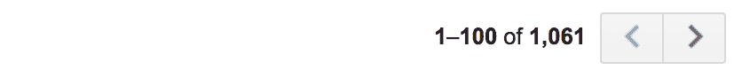

我分析并归类了所有这些收到的“欢迎邮件”。

我的问题很简单:**这些公司发送的欢迎邮件有哪些模式？**

我们可以找到哪些方法来帮助我们向客户发送更好的第一封电子邮件？

## SaaS 铅漏斗统计

在实验过程中，我尝试注册了 618 种不同的 SaaS 产品。在这个过程中看到一些模式是很有趣的。

*   其中 264 款产品允许我创建一个帐户，并立即开始使用它们的免费试用版。
*   238 个 Saas 产品用于销售代表提供的产品演示。
*   82 个网站不让我注册 Gmail 邮箱。
*   21 家公司在注册时需要信用卡。
*   12 家 SaaS 公司要求在签约前进行电话验证。

显然，自助式免费试用模式占主导地位。然而，很大一部分 SaaS 产品通过销售代表获得新的线索

有趣的是，超过 100 家公司选择设置注册障碍，例如只允许商业电子邮件，要求信用卡或要求电话验证。

## 1.消费者成功电子邮件

通常，我发现这些都是 SaaS 的产品，有一个自助销售模式:你注册 30 天的免费试用，然后自己决定产品是否适合你。

例如， [autopilot](http://autopilothq.com) 混合一个 CTA 来安装跟踪代码，以及他们的网络研讨会、文档和“飞行学校”的链接。

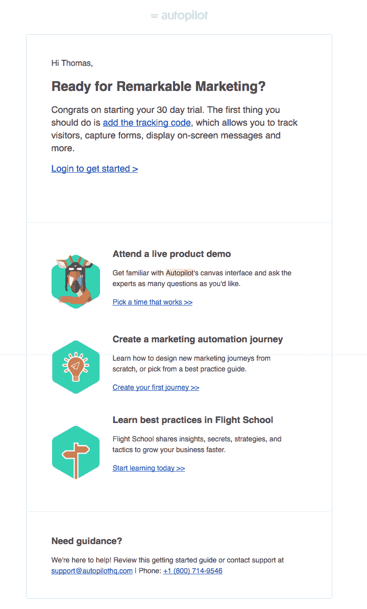

或者，您可以向 CTA 添加一个故事。例如， [InVision](https://www.invisionapp.com/) 用三个不同的视频欢迎你依次观看:

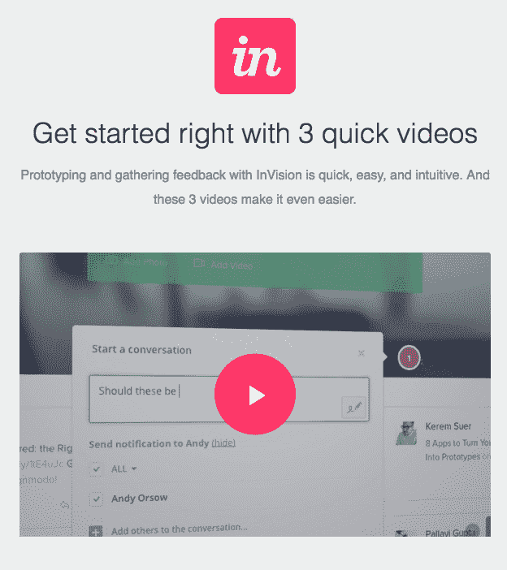

Tomasz Tunguz [将 SaaS 软件世界](http://tomtunguz.com/from-displacer-to-disruptor/)分为:

1.  记录系统
2.  工作流应用

最后一个——工作流应用程序——使人们能够工作。

一封能帮助人们做到这一点的欢迎邮件将意味着你会更加成功。

[MailChimp](http://mailchimp.com) 在第一封欢迎邮件中向您简要介绍了您的 MailChimp 帐户是如何运作的:

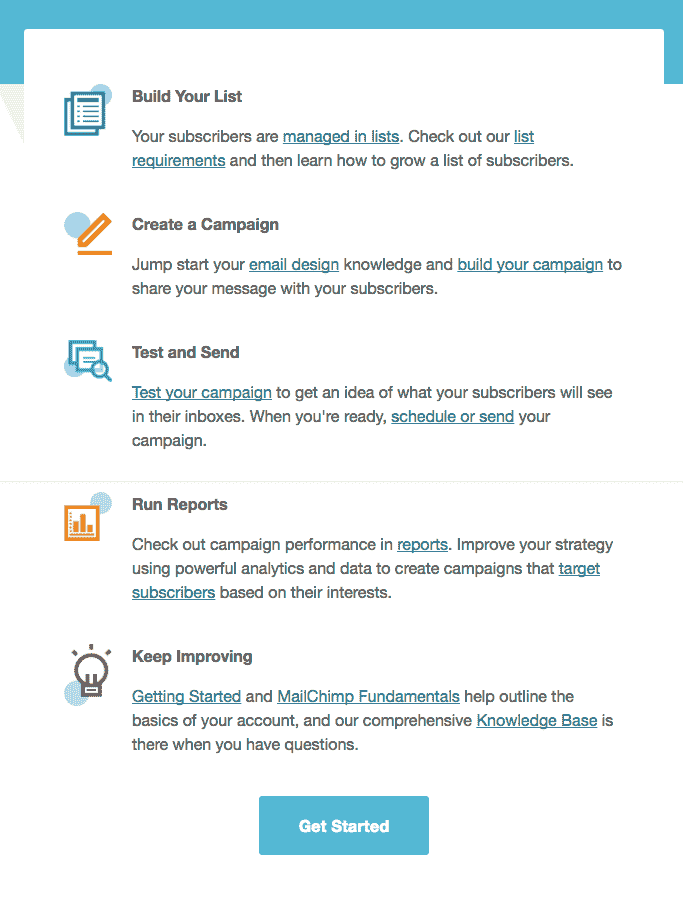

## 2.登录重点欢迎电子邮件

我发现很多 SaaS 产品把他们的第一封欢迎邮件放在一个 CTA 上，目的是让用户登录应用程序。

例如，CoSchedule 会向您发送一封电子邮件，其中仅包含一条欢迎信息和一个大的 CTA，以便您登录您的帐户:

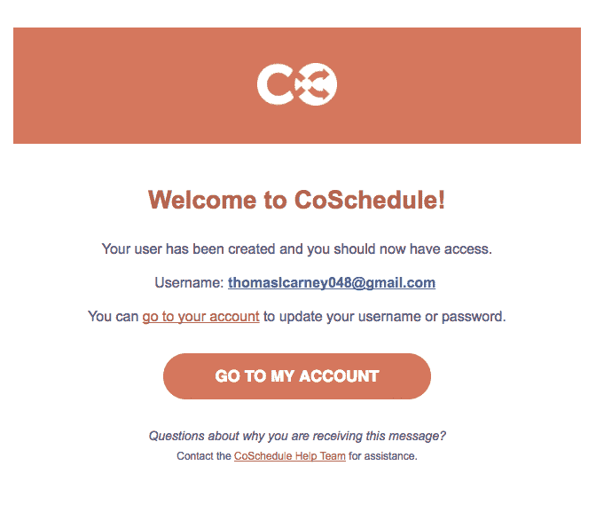

这些简短扼要的电子邮件是一个很好的选择，一旦你登录，你就可以在应用程序的指导下进行入职培训。

您还可以为常见工作流任务添加一些辅助链接，如活动活动所做的那样:

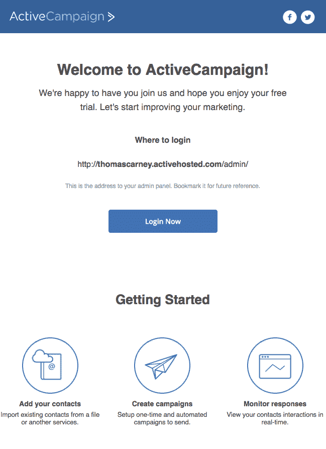

## 3.关注“下一步”的欢迎电子邮件

我对“登录你的帐户”邮件的一个问题是，它并不总是清楚下一步应该做什么。相反，更好的方法是专注于下一步。

[Front](https://frontapp.com) 侧重于邀请队友，这是团队收件箱应用程序的第一步。他们还将其与两个客户成功链接配对，但在设计层次中给予它们较低的优先级。

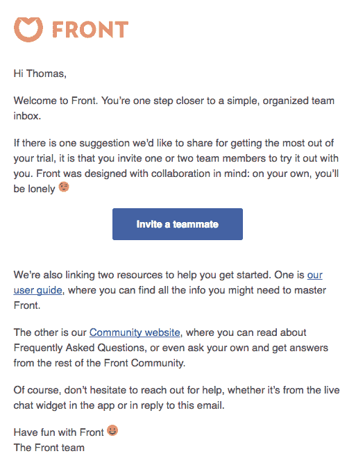

[Calendly 的](https://calendly.com)欢迎邮件超级简短简洁。他们给你一个链接，你可以开始直接与他人分享。

您可以共享该链接，您将开始看到日历中弹出的会议通知。

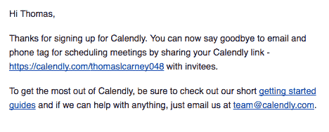

这封电子邮件表明，“下一步行动”不一定是你的客户在你的 SaaS 产品中做的事情。

## 4.专注于安装产品的欢迎电子邮件

SaaS 的产品通常需要你在你的网站上安装一些代码，然后你才能从他们的产品中看到价值。例如，除非你安装了跟踪代码，否则分析应用程序无法显示你的用户数据。

因此，让客户相信产品价值的关键是帮助他们安装他们的代码。

相扑，以他们典型的轻松复制风格，如果你没有安装你的代码，第二天会发一封跟进邮件。它们包括你需要包含的实际代码片段，以及 WordPress 插件和支持文档的两个二级 CTA。

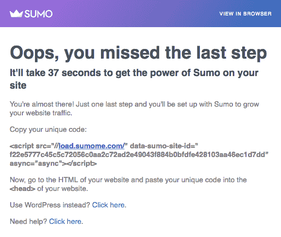

[滚动条](https://rollbar.com/)是 SaaS 产品的错误处理 app。安装 Rollbar 不仅仅是复制/粘贴一个代码片段。这是一个复杂得多的过程，因此他们链接到各种不同编程语言的指令:

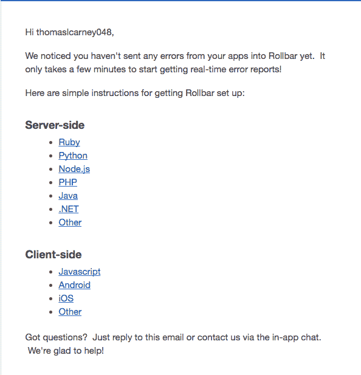

## 5.首席执行官欢迎电子邮件

我第一次从 [GrooveHQ](https://www.groovehq.com/blog/email-onboarding-optimization) 那里听说这封邮件。在“首席执行官电子邮件”中，你发送一封来自首席执行官的个性化电子邮件，要求人们分享他们为什么注册你的产品。

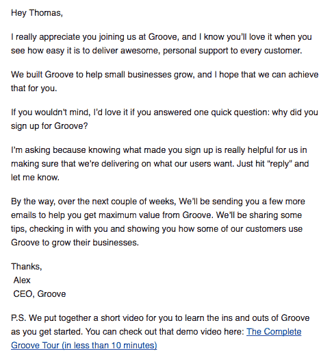

亚历克斯·特恩布尔(Alex Turnbull)认为，它可以帮助你与客户建立个人联系，为你提供注册背后驱动因素的定性数据，并让你定制由客户成功代表发送的高接触度电子邮件。

他还说，他们收到了 40%的回复。

事实证明，他们不是唯一使用这种电子邮件的公司。

[Proposify](https://www.proposify.biz/) 使用类似的模板:

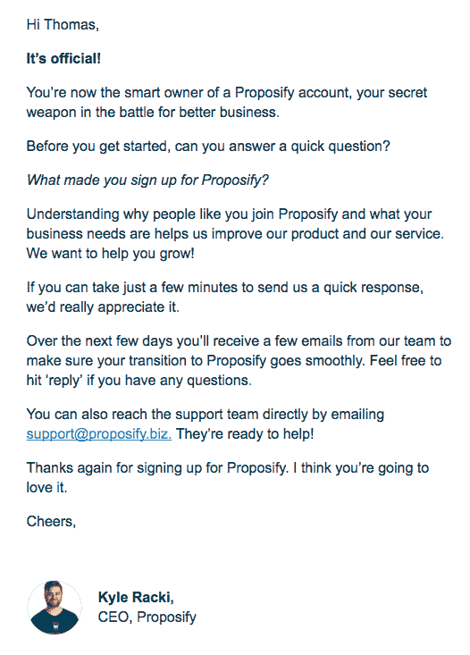

Accello 的乔治·麦昆明确表示，你可以直接与他们的首席执行官联系:

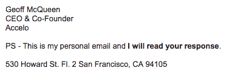

首席执行官的电子邮件非常受欢迎。在大约 618 家 SaaS 公司中，我总共收到了 57 封“来自首席执行官的电子邮件”。

从我在 [Plan.io](https://plan.io) 、**工作的个人经验来看，CEO 发来的邮件是我们目前收到回复最多的邮件**。正如亚历克斯·特恩布尔所说，这也是一个很好的定性反馈来源。

## 6.“销售代表演示”电子邮件

SaaS 产品漏斗的很大一部分是通过销售代表引导的。这意味着你在公司网站上的表格中输入你的电子邮件、姓名和一些细节，然后销售代表会联系你安排电话。

这是因为在潜在客户购买之前，更贵的软件通常需要更多的交互。

我报名参加了 238 家公司的演示。

大多数公司只是发送相当短的电子邮件，询问打电话的最佳时间，或者提供一个约会安排应用程序的链接，如 Calendly。

邮件通常是这样的:

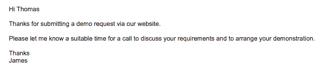

来自[提及](https://mention.com)的 Alexandre Gosset 更进了一步，他在邮件中附上了这张 GIF 图，向你展示*如何准确地*安排电话:

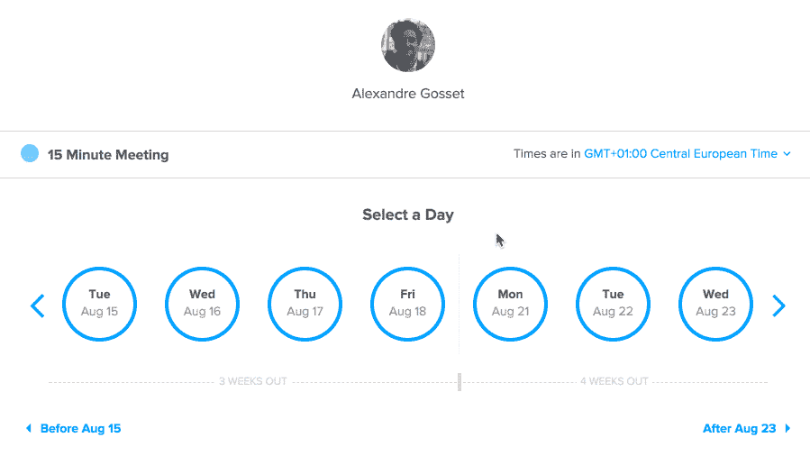

这张 GIF 图通过向人们展示在适合他们的时间安排一个电话是多么容易，而不是强迫他们找出另一个约会安排系统，从而减少了认知负荷。

Miva 的 Katherine Mindigo 提供了一个登录页面链接，介绍他们的解决方案如何以高于行业平均水平 2 倍的速度实现投资回报。令人惊讶的是，很少有销售开发代表使用这种策略，在他们的电子邮件中包含客户成功的内容，如案例研究或 ROI 结果。

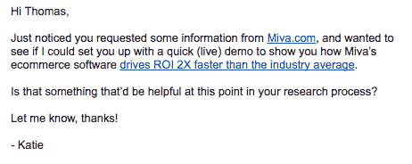

[Classy](http://classy.org) 立即发送电子邮件告诉你，你将很快收到销售代表的来信。他们还向您概述了您对致电的期望，以及接下来的流程。最后，他们添加了一个链接来了解价格。

经典不止于此。它们还包括一个页脚链接到经典 100，这是一个快速增长的前 100 名非营利组织的名单，并对他们是如何做到的有深刻的见解。

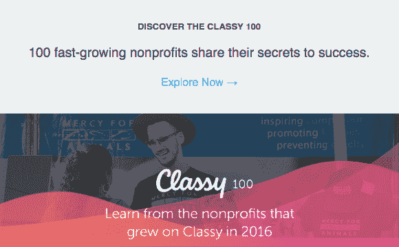

## 从收到的 1000 多封电子邮件中总结

很明显，SaaS 公司在销售和营销过程中会发送大量电子邮件。如果你的潜在客户通常会在决定一个解决方案之前查看几个解决方案，请记住，他们的收件箱会非常繁忙。

所有这些邮件的一个副作用是，近 50 家公司最终被列入了垃圾邮件文件夹。确保你的电子邮件遵循最佳实践是很重要的，这样你就不会被放在垃圾邮件文件夹里。如果你发送的是推广冷邮件，考虑为这些邮件使用单独的 IP 地址和域名。

与此同时，当我在数百个表格中输入我的电话号码时，我只收到了销售代表打来的几个电话，而那些销售代表发来了大量的后续电子邮件，询问打电话的时间。也许一些公司应该更习惯于打电话给潜在客户！

对于 SaaS 产品，你有什么好的欢迎邮件的想法或例子吗？请在下面的评论中告诉我。

**关于作者:**托马斯·卡尼曾在慕尼黑、巴黎和现在的柏林的科技公司工作。不在电脑上的时候，他在 CrossFit 或者尝试用 Aeropress 咖啡机煮出完美的咖啡。他在自己的网站上写了关于 SaaS 产品的[营销。](https://thomascarney.org)