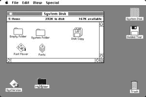
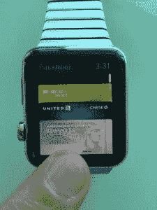

# 加州滚动规则:熟悉的做不同的事

> 原文：<https://www.nirandfar.com/2015/06/california-role-rule.html?utm_source=wanqu.co&utm_campaign=Wanqu+Daily&utm_medium=website>

加州卷提供了一个发现日本料理的门户，需求激增。在接下来的几十年里，一度局限于沿海大城市、几乎只为日本顾客服务的寿司店突然成为主流。今天，寿司在农村小镇、机场、购物中心都有供应，在当地超市的熟食区也有出售。美国人现在每年消费 22.5 亿美元的寿司。

<noscript></noscript>

加州卷是寿司进入数百万美国人口中的门户。

加州卷的教训很简单——人们不想要真正新的东西，他们想要熟悉的东西有所不同。有趣的是，这一教训既适用于食物口味，也同样适用于创新的传播。

例如，图形用户界面，个人电脑普及的一个里程碑，使用了文件夹、记事本、窗口和垃圾桶等熟悉的视觉隐喻来吸引被[命令行界面](https://en.wikipedia.org/wiki/Command-line_interface)吓到的主流用户(可能比吃生鱼的想法还要多)。下面的电脑还是老样子，然而熟悉的面板突然让它变得触手可及。

<noscript></noscript>

苹果早期的外形设计是个人电脑的加州卷。

对熟悉事物的古怪但不必要的描述成了苹果产品的标志。正如克莱尔·埃文斯为[主板](https://motherboard.vice.com/read/a-eulogy-for-skeumorphism)写的那样，“在已故史蒂夫·乔布斯的指导下，苹果的设计美学严重倾向于外形。众所周知，苹果桌面日历是用浓郁的科林斯皮革制成的；它的书架闪着木质贴面的光，它的铬合金总是被刷过，它的书页被缝合或撕破，它的桌面感觉是绿色的。”

<noscript></noscript>

迷你信用卡是苹果移动支付的加州版。

既然苹果服务于熟悉其产品运作方式的一代人，可以说它可以引导他们从加州卷到生鱼片。“我们知道人们已经习惯了触摸玻璃，”[苹果公司的 Jony Ive 解释道。“他们不需要实体按钮，他们知道这样做的好处。”](https://www.usatoday.com/story/tech/2013/09/19/apple-jony-ive-craig-federighi/2834575/)

然而，每当苹果公司希望用户采用一种新的行为时，它仍然使用其屡试不爽的方法。例如，[更名后的苹果钱包](https://www.macworld.com/article/2932541/apple-replaces-passbook-with-wallet-as-apple-pay-expands-to-u-k.html)通过让支付选项看起来像迷你信用卡，帮助用户对这项技术感到舒适。尽管这样做没有技术上的原因，但苹果明白熟悉的力量。