# Waymo 训练自动驾驶汽车的秘密世界——大西洋

> 原文：<https://www.theatlantic.com/technology/archive/2017/08/inside-waymos-secret-testing-and-simulation-facilities/537648/?utm_source=wanqu.co&utm_campaign=Wanqu+Daily&utm_medium=website>

在 Alphabet 园区的一个角落里，有一个团队正在开发一款软件，这可能是无人驾驶汽车的关键。迄今为止，还没有记者见过它的实际应用。他们称之为 Carcraft，以流行游戏《魔兽世界》命名。

这个软件的创造者是一位头发蓬松、长着一张娃娃脸的年轻工程师，名叫詹姆斯·斯托特(James Stout)，他坐在我旁边，戴着耳机，安静地坐在开放式办公室里。屏幕上是一个环形交叉路口的虚拟图像。对人类的眼睛来说，它看起来没什么:一个简单的线条画渲染到道路纹理背景上。我们看到一辆中等分辨率的自动驾驶克莱斯勒 Pacifica，以及一个指示另一辆车存在的简单线框。

<picture class="ArticleInlineImageFigure_picture__HoflP">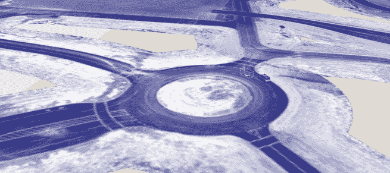</picture>

Carcraft, Waymo’s simulation building software (Waymo)

几个月前，一个自动驾驶汽车团队在德克萨斯州遇到了这样的环岛。这种情况的速度和复杂性让汽车不知所措，所以他们决定在一个测试设施中建造一条类似的物理路面。我现在看到的是学习过程的第三步:现实世界驾驶的数字化。在这里，一个单一的现实世界驾驶操作——就像一辆车在环形交叉路口超车——可以被放大成数千个模拟场景，以探测汽车的能力。

*Listen to the audio version of this article:**Feature stories, read aloud: [download the Audm app for your iPhone.](https://goo.gl/YvgNvt)*

像这样的场景构成了该公司强大模拟设备的基础。斯托特告诉我:“绝大多数工作——新功能工作——都是受模拟中看到的东西的激励。这是加速 Waymo 自动驾驶汽车开发的工具，Alphabet (née Google)于 2016 年 12 月从其“登月”研究部门 X 中剥离出来。

如果 Waymo 能够在未来几年内交付完全自动驾驶的汽车，Carcraft 应该作为一个虚拟世界被人们记住，它在重塑其所基于的现实世界方面发挥了巨大作用。

最初是作为一种“回放”汽车在公共道路上行驶时经历的场景、汽车工艺和模拟的方式开发的，在自动驾驶程序中发挥了越来越大的作用。

在任何时候，现在都有 25，000 辆虚拟自动驾驶汽车在奥斯汀、山景城和凤凰城的完全建模版本以及测试赛道场景中行驶。Waymo 可能会在一天内模拟在一条特别棘手的道路上行驶数十万次*。总的来说，他们现在每天在虚拟世界中行驶 800 万英里。2016 年，他们记录了 25 亿虚拟英里，而谷歌在公共道路上行驶的 IRL 自动驾驶汽车仅行驶了 300 多万英里。至关重要的是，虚拟里程专注于 Waymo 人总是称之为“有趣”的里程，在这些里程中他们可能会学到一些新东西。这些不是无聊的公路通勤里程。*

这些模拟是 Waymo 开发的复杂流程的一部分。他们将他们的汽车在公路上行驶的数百万英里与他们在中央山谷一个他们称之为城堡的秘密基地进行的“结构化测试”计划紧密结合在一起。

Waymo 之前从未推出过这一系统。他们在普通道路上行驶的里程数显示出他们需要额外练习的地方。他们在 Castle 的土地上雕刻出他们需要的空间，这让他们可以在原地运行数千种不同的场景。在这两种真实世界的测试中，他们的汽车捕获了足够的数据，可以在未来的任何时间点创建完整的数字娱乐。在虚拟空间中，他们可以摆脱现实生活的限制，创造出任何单一场景的数千种变化，然后驾驶一辆数字汽车穿过所有这些场景。随着驾驶软件的改进，它被下载到实体汽车中，这些汽车可以行驶更多更艰难的里程，循环又开始了。

要到达城堡，你从旧金山湾向东行驶，然后在 99 号公路上向南行驶，这条中央山谷公路向南延伸到弗雷斯诺。玉米地毗邻子开发区；地平线消失在农业薄雾之后。它比旧金山热 30 度，而且如此平坦，以至于约翰·麦克菲称之为“土海”的等级只能用激光来测量。你在小镇阿特沃特附近下车，这里曾经是城堡空军基地的所在地，曾经雇用 6000 人为 B-52 项目服务。现在，它位于小型默塞德大都市区的北部边缘，那里的失业率在 2010 年代初突破了 20%，但仍很少低于 10%。这里百分之四十的人说西班牙语。我们穿过一些铁轨，来到 1621 英亩的老基地，这里现在拥有从默塞德县动物控制中心到阿特沃特美国监狱的一切设施。

我手机上的指示不是指向一个地址，而是一组 GPS 坐标。我们沿着高高的不透明的绿色栅栏前行，直到谷歌地图告诉我们停下来。没有任何迹象表明有一扇门。它只是看起来像另一段栅栏，但我的 Waymo 主机很有信心。果然不出所料:一名保安出现了，他从栅栏上一条越来越宽的裂缝中溜了出来，检查我们的证件。

<picture class="ArticleInlineImageFigure_picture__HoflP">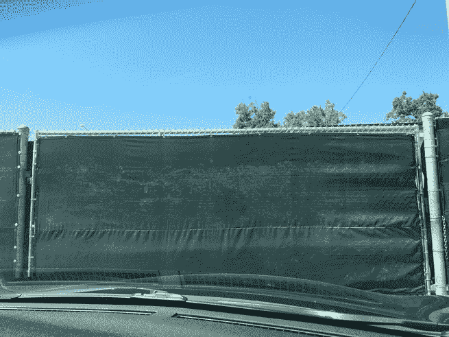</picture>

The fence (Alexis Madrigal)

篱笆分开了，我们开车进入一个熙熙攘攘的小校园。穿着短裤戴着帽子的年轻人走来走去。有便携式建筑、圆顶车库，以及——在主楼的停车场——自动驾驶汽车。这里有几种类型的自动驾驶汽车:你最有可能在公路上看到的雷克萨斯车型，已经退役的普锐斯，以及新的克莱斯勒 Pacifica 小型货车。

自动驾驶汽车很容易识别。它们布满了传感器。最突出的是汽车顶部的激光扫描仪(通常称为激光雷达)。但是 Pacificas 也有更小的啤酒罐大小的激光雷达在它们的侧镜附近旋转。它们后面有雷达，看起来像白色的史莱克耳朵。

当汽车的传感器工作时，即使在停车时，旋转的激光雷达也会发出奇怪的声音。它介于呜呜声和撞击声之间，令人不快只是因为它太新奇了，我的耳朵无法像伴随我长大的其他汽车噪音一样过滤掉它。

主楼对面停着一辆更特别的车。红色胶带上画满了大小不一的 X。那是四级车。这些级别是汽车工程师协会对汽车自主程度的指定。我们在路上听到的大多数是一级或二级，旨在允许高速公路上的智能巡航控制。但是红 X 车完全是另一种动物。它不仅是全自动的，而且它*不能由里面的人驾驶，所以他们不想让它和他们的其他汽车混淆。*

当我们驶进停车场时，有一股曼哈顿计划、科学前哨、科技创业的味道。在主建筑里，一个教室大小的便携式，我遇到了这个非凡的地方背后的动力。她叫斯蒂芬·维勒加斯。

V illegas 穿一件合身的白色长领衬衫，巧妙撕破的牛仔裤，灰色针织运动鞋，每一点都像她在谷歌之前在旧金山时装店 Azalea 的工作一样时尚。她在伯克利山那边的东湾郊区长大，在 2011 年进入自动驾驶汽车项目之前，她是加州大学伯克利分校的美术专业学生。

“你*是*的司机？”我问。

“永远是司机，”维尔加斯说。

<aside class="ArticlePullquote_root__YtnHv">“Being in the car a lot, I can feel what the car is doing—it sounds weird, but—with my butt.”</aside>

她花了无数时间在 101 和 280 公路上来来回回，这两条公路是旧金山和山景城之间的高速公路。像其他车手一样，她开始感受赛车在公路上的表现。这被视为自动驾驶项目中一种重要的知识。他们对汽车的难点有了直觉。“在新软件上做一些测试，并在团队中任职一段时间后，我开始思考我们可能挑战系统的方法，”她告诉我。

因此，Villegas 和一些工程师开始编造并上演罕见的场景，让他们能够以可控的方式测试新的行为。他们开始占领海岸线圆形剧场对面的停车场，在所有入口派驻人员，以确保只有经过批准的谷歌员工才能进入。

“这就是它开始的地方，”她说。“每周都是我和几个司机。我们想出了一组想要测试的东西，把我们的供应品装上卡车，然后把卡车开到停车场进行测试。”

这些成为了自动驾驶项目中的第一次结构化测试。事实证明，困难的部分并不是人们想象的那种“如果一个僵尸在路上吃掉一个人”的场景，而是在正常交通的无尽变化中，像人类司机一样自信而可靠地前进。

维尔加斯开始从她能找到的任何地方收集道具:假人、圆锥体、假植物、儿童玩具、滑板、三轮车、洋娃娃、球、小摆设。他们都进了道具仓库。(最终，这些道具被储存在一个帐篷里，现在在城堡，在一个完整的储存单元里。)

<picture class="ArticleInlineImageFigure_picture__HoflP">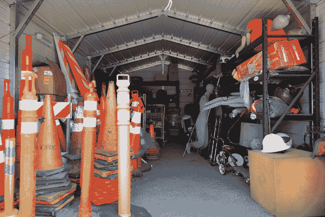</picture>

The prop garage at Castle (Alexis Madrigal)

但是有一些问题。他们想开得更快，使用街灯和停车标志。海岸线圆形剧场的音乐会季节经常打乱他们的计划。“这就像是，‘嗯，金属乐队要来了，所以我们要上路了，’”她说。

他们需要一个基地，一个秘密基地。这就是卡塞尔所提供的。他们签了租约，开始建造他们梦想中的虚拟城市。“我们在设计住宅区街道、高速公路风格的街道、死胡同、停车场之类的东西时，做出了有意识的决定，”她说，“所以我们会有一个有代表性的集中特征，我们可以开车到处逛。”

我们从拖车办公室走向她的车。她递给我一张地图，我们离开去参观这个地方。“就像在迪斯尼乐园一样，所以你可以跟着去，”她说。这张地图是精心制作的。在一个角落里，有一个拉斯维加斯风格的标志，上面写着，“欢迎来到加州神话般的城堡。”校园的不同部分甚至有自己的命名惯例。在我们正在穿越的片段中，每条道路都以一辆名车(DeLorean、Bullitt)命名，或者以该计划早期最初的普锐斯车队中的一辆车(如 Barbaro)命名。

我们经过一群粉红色的建筑，旧的军事宿舍，其中一个已经翻新:这是 Waymo 人无法回到海湾时睡觉的地方。除此之外，测试区域内没有任何建筑物。这是一个真正的机器人汽车之城:重要的是在柏油路上和紧靠柏油路的地方有什么。

<picture class="ArticleInlineImageFigure_picture__HoflP">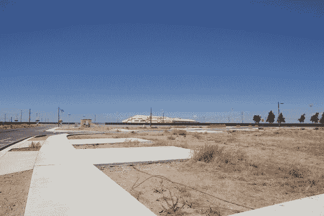</picture>

A “neighborhood” in Castle (Alexis Madrigal)

作为一个人，它感觉像一个没有非玩家角色的电子游戏级别。从林荫大道到有水泥车道的街道，再到郊区的十字路口，减去我们与这些地方联系在一起的建筑，真是不可思议。我不断瞥见我感觉走过的路。

我们把车停在一个大型的双车道环形交叉路口。在中心，有一圈白色的栅栏。“这个环形交叉路口是在我们体验了德克萨斯州奥斯汀的多车道环形交叉路口后特别安装的，”Villegas 说。“我们最初有一个单车道环岛，就像是，‘哦，我们有了。我们已经搞定了。然后，我们遇到了一个多车道，就像，'不同颜色的马！谢谢你，德克萨斯。所以，我们安装了这个坏男孩。"

<picture class="ArticleInlineImageFigure_picture__HoflP">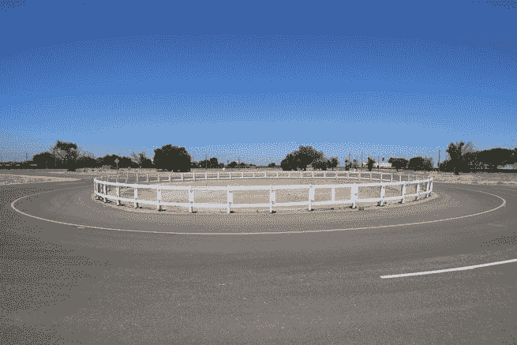</picture>

The two-lane roundabout (Alexis Madrigal)

我们停下来，维勒加斯凝视着新增加的一部分:两条汽车道和一条自行车道穿过一片草地旁边的平行停车场。“我真的很想在它旁边安装一个平行停车场。这种事情发生在郊区的商业区。核桃溪。山景。“帕洛阿尔托，”她说。“人们正从店面或公园里走出来。人们在车与车之间行走，也许还会提着东西过马路。”这条小路就像是她自己的记忆碎片，她被埋在沥青和混凝土的泥土中，这将使它成为一种更抽象的形式，一种机器人处理家乡地形的改进能力。

她开车送我回总部，我们跳上一辆自动驾驶货车，一辆克莱斯勒 Pacificas。我们的“左座”司机是布兰登·凯恩。他的“右座”副驾驶将在一台笔记本电脑上使用名为 XView 的软件跟踪汽车的性能。

然后是测试助理，他们称之为“狐狸”，这个绰号是从“人造”一词演变而来的。他们开车，创造交通，扮演行人，骑自行车，举着停车标志。他们或多或少都是演员，他们的观众是汽车。

我们要做的第一个测试是“简单的通过和切入”，但速度很快，在这里意味着每小时 45 英里。我们准备沿着一条他们称之为高速公路的宽阔道路直行。

在福克斯切断我们的路线后，Waymo 汽车将会刹车，团队将检查一个关键的数据点:我们的减速度。他们正试图制造一些场景，让汽车不得不紧急刹车。有多难？介于“老鼠，不会让光”和“我的腋窝开始不由自主地出汗，我的手机飞到地板上”之间的某个地方*真的*硬停。

我来说点可笑的:这不是我第一次乘坐自动驾驶车辆出行。在过去，我已经进行了两次不同的自动驾驶:第一次，在一辆雷克萨斯 SUV 上，我在山景城的街道上行驶；第二次，在谷歌可爱的小萤火虫上，它在谷歌大楼的屋顶上蹦蹦跳跳。他们都是不起眼的游乐设施，这才是重点。

但是，这是不同的。这是两辆快速行驶的汽车，其中一辆预计会以一种用 Waymo 的艺术术语来说是“辛辣”的举动来拦截我们

该走了。凯恩让我们继续前进，汽车发出一点声音，说:“自动驾驶。”另一辆车靠近并切断了我们的路，就像一个保时捷司机试图抢在我们前面离开。我们用力快速平稳地刹车。我印象深刻。

然后他们检查减速数字，并意识到我们没有足够努力地刹车。我们必须再做一次。再一次。再一次。另一辆车以不同的角度和不同的方式挡住了我们。他们称之为“覆盖”

<picture class="ArticleInlineImageFigure_picture__HoflP">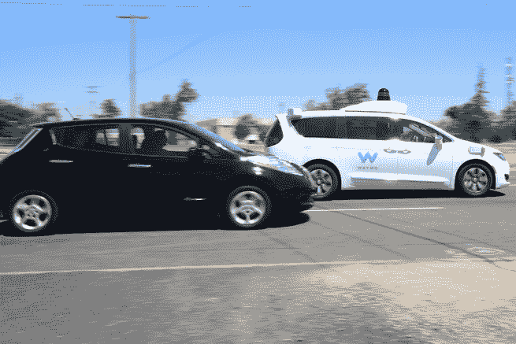</picture>

Two cars merging at high speed, one driving itself (Alexis Madrigal)

我们还经历了另外三项测试:高速并线，遇到一辆正在退出车道的汽车，而第三辆汽车挡住了自动驾驶汽车的视线，以及当行人将篮球扔进我们的道路时，汽车平稳地停下来。每一个都以自己的方式令人印象深刻，但那个截止测试是我坚持的一个。

当我们准备再次跑步时，凯恩在他的座位上移动。“你看过*环太平洋*吗？”凯恩问我。你知道那部吉尔莫·德尔·托罗电影吧，里面的人穿着巨大的机器人服与怪物战斗。“我试图与汽车保持同步。我们分享一些想法。”

我请凯恩解释他所说的与汽车同步实际上是什么意思。“我正努力适应车里人的体重差异，”他说。“经常坐在车里，我能感觉到车在做什么——这听起来很奇怪，但是——用我的屁股。我有点知道它想做什么。”

远离城堡的阴霾和炎热，谷歌舒适的总部位于山景城。我来拜访 Waymo 的工程师，他们在技术上被安置在 X 内部，你可能知道这是谷歌 X，该公司的长期、高风险研究部门。2015 年，当谷歌重组为一家名为 Alphabet 的企业集团时，X 从名称中去掉了谷歌(他们的网站字面意思是 [X.company](https://x.company/) )。大重组一年后，X/Alphabet 决定将自动驾驶汽车项目“毕业”到自己的公司，就像之前对其他几个项目所做的那样，而这家公司就是 Waymo。Waymo 就像谷歌的孩子，一旦被移除，还是什么的。

所以，Waymo 的办公室仍在母舰内，不过，就像两个小团体慢慢理清自己一样，我被告知，Waymo 的人现在都坐在一起。

X/Waymo 大楼又大又通风。到处都有 Project Wing 的飞行无人机原型。我看到了公司制造的可爱的小萤火虫车。(“你自己建造的东西有一些可爱的地方，”维尔加斯在城堡里说过。“但是他们没有空调，所以我不想念他们。”)

从自助餐厅往上，夹在机翼一角的是 Waymo 模拟集群。在这里，每个人的屏幕上似乎都有 Carcraft 和 XView。黑色背景上的多边形比比皆是。这些人创造了 Waymo 的汽车驶过的虚拟世界。

<picture class="ArticleInlineImageFigure_picture__HoflP">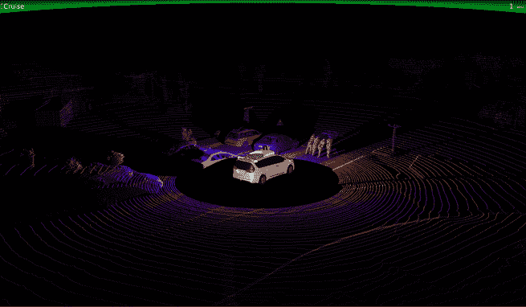</picture>

What it looked like to a Waymo car’s laser scanner when four people were pushing a car (Waymo)

等待我的是詹姆斯·斯托特，Carcraft 的创造者。他从未公开谈论过他的项目，他的热情溢了出来。卡克拉夫特是他的孩子。

“我只是浏览了一下招聘信息，看到无人驾驶汽车团队正在招聘，”他说。"我无法相信他们刚刚贴出了一份工作。"他加入了团队，并立即开始构建工具，现在每天运行 800 万虚拟英里。

当时，他们主要使用该工具来看看在人类驾驶员接管汽车控制权的棘手情况下，他们的汽车*会做什么*。他们开始从这些时刻制作场景。斯托特说:“很快就清楚了，这是一个非常有用的东西，我们可以利用它做很多事情。”。Carcraft 能力的空间范围扩大到包括整个城市，汽车的数量增长成一个巨大的虚拟车队。

斯托特带来了埃琳娜·科拉罗夫，他们称之为“场景维护”团队的负责人来运行控制。她面前有两个屏幕。在右边，她打开了 XView，这个屏幕显示了汽车“看到”了什么。汽车使用相机、雷达和激光扫描来识别其视野内的物体——并在软件中将其表示为小线框形状，即真实世界的轮廓。

绿线从形状中延伸出来，以显示汽车预计物体可能移动的可能方式。在底部，有一个图像条，显示汽车上的常规(即可见光)摄像机拍摄的内容。科拉罗夫还可以打开激光扫描仪(LIDAR)返回的数据，这些数据以橙色和紫色的点显示。

我们在城堡的环形交叉路口看到了真实的融合回放。科拉罗夫切换到模拟版本。它看起来一样，但它不再是一个数据日志，而是汽车必须解决的新情况。唯一不同的是，在 XView 屏幕的顶部，用红色的大字写着“模拟”。斯托特说，他们不得不加上这一点，因为人们混淆了模拟和现实。

<picture class="ArticleInlineImageFigure_picture__HoflP">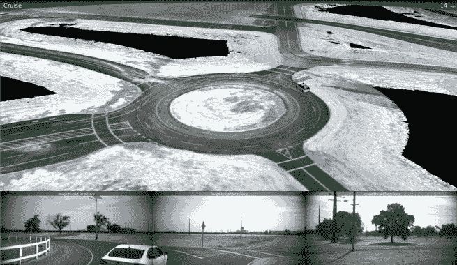</picture>

The Castle roundabout as seen in an XView simulation (Waymo)

他们加载了另一个场景。这个在凤凰城。科拉罗夫缩小显示他们的城市模型。对于整个地方，他们有“所有车道在哪里，哪些车道通向其他车道，停车标志在哪里，交通灯在哪里，路缘在哪里，车道中心在哪里，你需要知道的一切，”斯托特说。

<picture class="ArticleInlineImageFigure_picture__HoflP">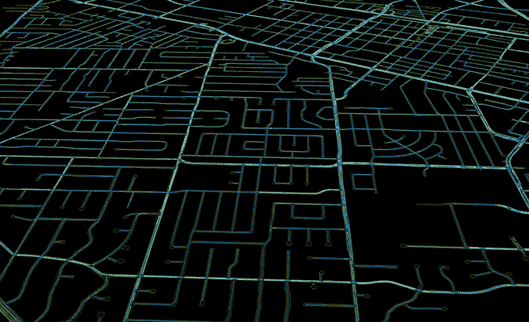</picture>

A piece of the world that Waymo has modeled for its cars in Chandler, Arizona, near Phoenix (Waymo)

我们放大到凤凰城附近的一个四路停车点。然后科拉罗夫开始在合成汽车、行人和骑自行车的人身上下降。

<picture class="ArticleInlineImageFigure_picture__HoflP">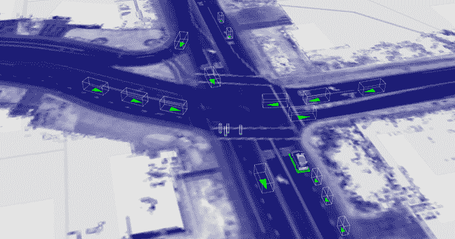</picture>

Creating a synthetic scenario in Carcraft (Waymo)

按下热键，屏幕上的对象开始移动。汽车就像汽车一样，在自己的车道上行驶，转弯。骑自行车的人就像骑自行车的人。他们的逻辑是从该团队已经完成的数百万英里的公路驾驶中模拟出来的。在这一切之下，有一个超详细的世界地图和场景中不同代理的物理模型。他们模拟了橡胶和路面。

<picture class="ArticleInlineImageFigure_picture__HoflP">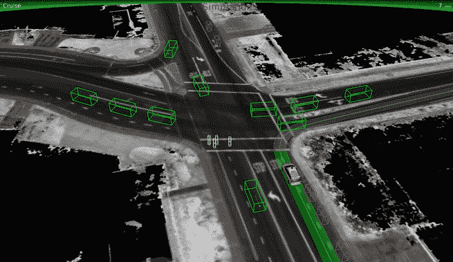</picture>

The scenario being simulated in Xview (Waymo)

毫不奇怪，最难模拟的是其他人的行为。就像老家长看到的:“我不担心你开车。我担心路上的其他人。”

“我们的汽车看世界。他们了解这个世界。然后，对于环境中的任何动态参与者——汽车、行人、骑自行车的人、摩托车——我们的汽车都理解意图。仅仅通过空间追踪一个东西是不够的。你必须明白它在做什么，”Waymo 的工程副总裁 Dmitri Dolgov 告诉我。“这是建造一辆有能力、安全的自动驾驶汽车的关键问题。这种建模，这种对世界上其他参与者行为的理解，与模拟他们的任务非常相似。”

有一个关键的区别:在现实世界中，他们必须接受关于环境的新鲜、实时数据，并将其转换为对场景的理解，然后进行导航。但是现在，在该项目上工作多年后，他们有信心做到这一点，因为他们已经进行了“一系列测试，表明我们可以识别各种各样的行人，”斯托特说。

因此，对于大多数模拟来说，他们跳过了物体识别这一步。他们不是向汽车提供原始数据来识别行人，而是简单地告诉汽车:这里有行人。

在四向停车站，科拉罗夫正在给自动驾驶汽车制造麻烦。她按下 V，一个车辆的热键，一个新的物体出现在 Carcraft 中。然后，她将鼠标移到右边的下拉菜单上，菜单上有一堆不同的车辆类型，包括我最喜欢的:bird_squirrel。

不同的对象可以被告知遵循 Waymo 为它们建模的逻辑，或者 Carcraft scenario builder 可以对它们进行编程，以精确的方式移动，以便测试特定的行为。斯托特说:“在控制一个场景和只是把东西放进去然后让它们离开之间有一个很好的范围。”。

一旦他们有了一个场景的基本结构，他们就可以测试它包含的所有重要变化。因此，想象一下，对于一个四向停靠点，您可能想要测试各种汽车、行人和骑自行车的人的到达时间，他们停留的时间，他们移动的速度，以及其他等等。他们只需输入这些值的合理范围，然后软件创建并运行这些场景的所有组合。

他们称之为“模糊化”，在这种情况下，这种四向停止产生了 800 个场景。它创建了一个漂亮的花边图表，工程师可以进去看看不同的变量组合如何改变汽车决定采取的路径。

<picture class="ArticleInlineImageFigure_picture__HoflP"></picture>

A Carcraft “fuzzing” chart (Waymo)

问题实际上变成了分析所有这些场景和模拟，以找到可以指导工程师更好地驾驶的有趣数据。第一步可能只是:汽车卡住了吗？如果是的话，这是一个有趣的工作场景。

在这里，我们看到一个视频，展示了这样一种情况。这是发生在山景城真实生活中的一个复杂的四向停车。当汽车向左转时，一辆自行车靠近，导致汽车停在路上。工程师们解决了这类问题，重新编写了软件，以正确地解决问题。视频显示的是真实的情况，然后是在其上运行的模拟。当两种情况出现分歧时，您会看到模拟汽车继续行驶，然后出现一个虚线框，标签为“shadow_vehicle_pose”那个虚线框显示了现实生活中发生的事情。对 Waymo 人来说，这是进步最清晰的可视化。

<picture class="ArticleInlineImageFigure_picture__HoflP"><source media="(prefers-reduced-motion)" srcset="https://cdn.theatlantic.com/thumbor/xu6MuH0x5Jg-KJ32iKWela5BFJ4=/0x0:640x398/640x398/filters:still()/media/img/posts/2017/08/WaymoMovieGIF/original.gif">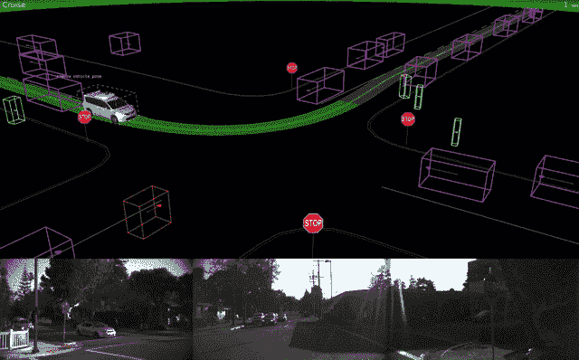</picture>

A Waymo simulation showing improved vehicle navigation (Waymo)

但是他们不仅仅要寻找什么时候车卡住了。他们可能想要寻找过长的决策时间或超出正确范围的制动曲线。工程师正在学习或调整的任何东西，他们将模拟寻找问题。

斯托特和 Waymo 软件负责人多尔戈夫都强调，模拟有三个核心方面。首先，它们比实体车队行驶的里程要多得多——体验也很好。第二，这些里程关注的是有趣但仍然困难的汽车互动，而不是无聊的里程。第三，软件的开发周期可以快得多。

“迭代周期对我们来说非常重要，我们在模拟方面所做的所有工作都允许我们大幅缩短它，”多尔戈夫告诉我。“在项目初期需要几周时间的周期现在只需几分钟。”

嗯，我问他，路上的浮油怎么办？或者爆胎，奇怪的鸟，天坑大小的坑，普遍的疯狂。他们模拟了吗？多尔戈夫很乐观。他说，当然，他们可以，但是“你能把模拟器沿着那个轴的保真度推到多高？也许这些问题中的一些你得到了更好的价值，或者你通过在现实世界中运行一系列测试得到了你的模拟器的确认。”(参见:城堡。)

<aside class="ArticlePullquote_root__YtnHv">The deeper humans understand the cars, the deeper the cars understand humans.</aside>

Carcraft 虚拟世界的力量不在于它们是真实世界的美丽、完美、逼真的渲染。强大之处在于，它们以对自动驾驶汽车意义重大的方式反映了现实世界，并允许它比物理测试多行驶数十亿英里。对于运行模拟的驾驶软件来说，它不像在现实世界中做决策。这和在现实世界中做决定是一样的*。*

*它正在工作。加州 DMV 要求公司[报告他们每年自主驾驶的里程数，以及试驾者的脱离情况](https://www.dmv.ca.gov/portal/dmv/detail/vr/autonomous/disengagement_report_2016)。Waymo 不仅比其他任何人多开了三个数量级的里程，而且他们的脱离数量也迅速下降。*

*2015 年 12 月至 2016 年 11 月，Waymo 行驶了 635，868 英里的自动驾驶里程。在所有这些英里中，他们只脱离了 124 次，平均每 5000 英里一次，或每 1000 英里 0.20 次。前一年，他们驾驶了 424，331 英里的自动驾驶，有 272 次脱离，平均每 890 英里一次，或每 1，000 英里 0.80 次脱离。*

*虽然每个人[都不厌其烦地注意到](https://www.wired.com/2017/02/california-dmv-autonomous-car-disengagement/)这些并不是完全对等的数字，但让我们现实一点:这些是我们得到的最好的比较，至少在加利福尼亚，其他人都开了大约 20，000 英里。*合起来*。*

*外部专家对 Waymo 采取的策略并不感到意外。“现在，你几乎可以通过他们对模拟的认真程度来衡量一个 autonomy 团队——无人机团队、汽车团队——的成熟度，”安德森·霍洛维茨(Andreessen Horowitz)的风险投资家克里斯·迪克森(Chris Dixon)说，他领导了该公司对模拟公司 Improbable 的投资。“而 Waymo 处于最顶端，也是最复杂的。”*

*我向好事达保险公司(Allstate Insurance)的创新主管苏尼尔·钦塔金迪(Sunil Chintakindi)询问了关于 Waymo 的计划。“如果没有一个强大的模拟基础设施，你就无法建立(更高水平的车辆自主性)。”他说。"我不会和任何有不同想法的人交谈."*

*其他自动驾驶汽车研究人员也在追求类似的道路。Huei Peng 是密歇根大学自动驾驶和联网汽车实验室 Mcity 的主任。彭表示，任何适用于自动驾驶汽车的系统都将是“99%以上的模拟加上一些精心设计的结构化测试和一些道路测试的组合。”*

<aside class="ArticlePullquote_root__YtnHv">**This* is making a massive leap forward in artificial intelligence, even for a company inside Alphabet.*</aside>

*他和一名研究生[提出了一个将道路里程与模拟交织的系统](https://mcity.umich.edu/wp-content/uploads/2017/05/Mcity-White-Paper_Accelerated-AV-Testing.pdf)来快速加速测试。这与 Waymo 执行的操作并无不同。“所以我们所争论的只是砍掉驾驶中无聊的部分，专注于有趣的部分，”彭说。"这可以让你加速数百倍:一千英里变成一百万英里."*

**令人*惊讶的是 Waymo 项目的规模、组织和强度。我描述了谷歌对彭进行的结构化测试，包括城堡结构化测试团队模拟的 20，000 个场景。但他听错了，开始说，“那 2000 个场景令人印象深刻，”当我插话纠正他时，“是 20000 个场景。”他停顿了一下。“两万，”他想了想说。"*那是*令人印象深刻."*

*事实上，这 20，000 个场景只代表了 Waymo 测试的全部场景的一小部分。它们只是结构化测试的产物。他们甚至拥有比公共驾驶和想象更多的场景。*

*“他们做得很好，”彭说。“就第四级而言，他们远远领先于其他所有人，”这是汽车完全自主的行话简写。*

*但彭也提出了传统汽车制造商的立场。他说，他们正试图做一些根本不同的事情。他们的目标不是全自动登月，而是试图增加驾驶辅助技术，“赚点小钱”，然后朝着全自动前进。将 Waymo 与雪佛兰这样的汽车制造商进行比较是不公平的，Waymo 拥有资源和企业自由，可以在汽车顶部安装价值 7 万美元的激光测距仪，而雪佛兰可能会将 4 万美元视为其大众市场采用的价格上限。*

*“通用、福特、丰田和其他公司都在说‘让我减少车祸和死亡人数，提高大众市场的安全性吧。’“他们的目标是完全不同的，”彭说我们需要考虑数百万辆汽车，而不仅仅是几千辆。"*

*即使在完全自主的竞争中，Waymo 现在也比以前有更多的挑战者，特别是特斯拉。克里斯·格迪斯是斯坦福大学汽车研究中心的主任。18 个月前，他告诉我的同事 Adrienne LaFrance，Waymo“比任何人都更能洞察问题的深度，以及我们离解决问题有多近。”上周我问他是否仍然认为这是真的，他说“很多事情都变了。”*

<aside class="ArticlePullquote_root__YtnHv">*It is driving as a human social activity that they’re working on now.*</aside>

*“福特和通用汽车等汽车制造商已经部署了自己的车辆，并建立了道路数据集，”他说。“特斯拉现在已经从自动驾驶部署中积累了海量数据，了解了该系统在客户体验的确切条件下是如何运行的。他们在静音模式下测试车载算法的能力和他们快速扩大的车辆基础相结合，形成了一个令人惊叹的试验台。”*

*在模拟领域，Gerdes 说他已经看到了许多有实质性项目的竞争者。“我确信有相当多的模拟能力，但我已经看到了一些看起来很可靠的东西，”他说。“在这方面，Waymo 看起来不再那么独特。他们当然很早就取得了领先，但现在有很多团体在寻找类似的方法。因此，现在的问题更多的是谁能做得最好。”*

*这并不是神经网络“类脑”能力的低风险展示。这是人工智能领域的一次巨大飞跃，即使对于 Alphabet 内部一直在积极采用人工智能的公司来说也是如此。这不是谷歌照片，一个错误并不意味着什么。这是一个将完全自主地在人类世界中生活和互动的系统。它会理解我们的规则，传达它的愿望，在我们的眼睛和头脑中清晰可辨。*

*Waymo 似乎已经将驾驶作为一项技术技能——速度和方向部分——放下了。他们现在致力于将驾驶作为一种人类社会活动。什么是“正常”驾驶，而不仅仅是“合法”驾驶？一个人如何教一个人工智能这意味着什么？*

*事实证明，构建这种人工智能不仅仅需要无尽的数据和工程技术。这些是必要的，但还不够。相反，构建这种人工智能需要人类与汽车同步，像它们一样理解世界。正如任何人所能做到的那样，卡塞尔的车手们知道作为一辆这样的车是什么样的，像他们一样去观察和做决定。也许这也是双向的:人类对汽车理解得越深，汽车对人类的理解也就越深。*

*奥斯汀环岛的记忆变成了城堡的一部分变成了无人驾驶汽车数据日志变成了汽车工艺场景变成了模拟网络变成了新软件，最终自动驾驶汽车回到了德克萨斯州的环岛。*

*即使在人工智能用来认识世界的模拟的多边形抽象中，也有人类梦的痕迹，回忆的片段，司机的感觉。这些组成部分不是错误，也不是要擦掉的人类污点，而是这个系统的必要组成部分，可以彻底改变交通、城市和几乎所有其他事物。*

