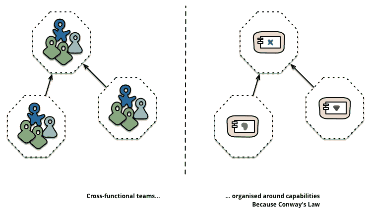

# 每个开发者都应该知道的 5 条定律

> 原文：<http://blog.ippon.tech/5-laws-every-developer-should-know/?utm_source=wanqu.co&utm_campaign=Wanqu+Daily&utm_medium=website>

法律——或者说原则——可以给我们指引，从我们同伴的错误中给我们教训。在本文中，我将向您介绍在设计或实现软件时我脑海中始终存在的五条法则。有些与纯开发有关，有些与系统组织有关。所有这些对你作为软件工程师的成长都应该是有用的。

# 墨菲法则

> “如果有什么事情会出错，那它一定会出错。”

[这条定律](https://en.wikipedia.org/wiki/Murphy%27s_law)是由航天工程师艾迪·墨菲创造的，以应对 50 年代初一次失败的火箭测试。
这条定律的思想是始终为系统的关键部分创建一个防御设计……因为在某个时刻，某些东西最终会出错！

这个定律很容易被翻译到软件工程领域。当你将软件展示给最终用户时，他们会找到创造性的方法来输入你没有计划的东西并破坏系统。因此，您需要让您的软件足够健壮，能够检测到意外行为并发出警报。

当你在一台机器上运行该软件时，任何东西都可能出故障——从支持操作系统的磁盘到数据中心的电源。因此，您需要确保在您的体系结构的所有级别上都为故障做好了设计。

我已经有几次机会遇到墨菲定律了。
例如，我并不认为在我使用的批处理框架中使用默认值“null”来表示空字符串是有害的，直到某个名为“null”的人传递了一个交易订单，并中断了我们的报告链几个小时……
或者，在另一个项目中，一切似乎都准备好了部署生产环境，直到 Azure 发生了一个基础设施事故，导致我们用来运行自动化脚本的服务器宕机。
这些现实世界的教训以惨痛的方式提醒了我，如果有什么事情会出错，它就会出错。

所以，永远记住墨菲，设计健壮的软件。

！【来源:https://commons . wikimedia . org/wiki/File:Murphys-law . jpg】(https://raw . githubusercontent . com/ippontech/blog-USA/mastimg/2017/08/Murphys-law . jpg)

# 克努特定律

> "过早的优化是编程中所有罪恶(或者至少是大部分罪恶)的根源."

这条法则(或者我应该说是唐纳德·克努特最著名的名言之一)提醒我们，永远不要试图过早地优化应用程序的代码，或者直到有必要的时候。

事实上，考虑到简单性和可读性而生成的源代码将满足 99%的性能需求，并将极大地提高应用程序的可维护性。从一个更简单的解决方案开始，当性能问题出现时，也更容易迭代和改进。

字符串连接通常是垃圾收集语言过早优化的一个例子。在 Java 或 C#中，字符串是不可变的，我们被教导使用其他结构来动态构建字符串，如 [StringBuilder](https://docs.oracle.com/javase/8/docs/api/java/lang/StringBuilder.html) 。但实际上，在对应用程序进行概要分析之前，您并不真正知道一个字符串将被创建多少次，以及对性能有什么影响。因此，首先用尽可能清晰的代码编写它，然后在必要时进行优化，通常会更有意义。

然而，这条规则不应该妨碍学习语言的性能权衡以及何时使用正确的数据结构。
而且，像其他性能问题一样，在开始优化任何东西之前，你应该总是先*测量*。

！【来源:http://www . si-units-explained . info/time/index _ htm _ files/3739 . jpg】(https://raw . githubusercontent . com/ippontech/blog-USA/mastimg/2017/08/performance-timer . jpg)

# 诺斯定律

> “每一个决定都是一种取舍。”

好吧，我承认这句话引自丹·诺斯的一次演讲- [决策，决策](https://www.youtube.com/watch?v=EauykEv_2iA) -还不是(还没有！)公认为法律。
但是这句话对我做决定的方式产生了如此大的影响，我想我应该把它写在这里。

在开发人员的日常生活中，我们每天都要做出大量的决策——无论是大的还是小的。从命名变量到定义平台的架构，通过自动化(或不自动化)任务。

这句话强调了无论你做什么选择，你总是在放弃一些东西，一个或多个选择。但这不是最重要的。
最重要的是有意识地做出决定，意识到其他选择以及你为什么没有选择它们。你应该经常根据你当时所知道的来权衡利弊，从而做出决定。
但是，如果你在事后才知道新的信息，那么事后发现你做出的决定是错误的也没关系。关键是要记住你为什么做这个决定，重新评估新的选择，做出一个新的有意识的选择。

又来了。

> “每一个决定都是一种取舍。”

所以做出选择，提高你对自己选择的意识。

！

# 康威定律

> “设计系统的组织...被限制生产这些组织的通信结构的复制品。”

在 60 年代，一位名叫梅尔文·康威的工程师注意到组织的结构会影响他们所生产的系统的设计。他在一篇论文中描述了这个想法，并将这个想法命名为“T1”康威定律。

这一法则在软件开发领域得到了很好的诠释，甚至在代码层面也有所体现。组织团队交付软件组件的方式将直接影响每个组件的设计。例如，一个并置的开发团队将开发一个具有耦合组件的整体应用程序。另一方面，多个分布式团队将产生多个分离的(微)服务，每个服务都有更清晰的关注点分离。
设计没有好坏之分，但它们都受到团队沟通方式的影响。
开源项目，有全球多个个体，通常是模块化和可重用库的好例子。

如今，当前的趋势是将单片应用程序分解为微服务。这太棒了，它将使更高的速度更快地将项目交付到生产中。但是你应该永远记住康威法则，在公司组织和技术选择上尽可能多的努力。

# 琐碎定律(帕金森琐碎定律)

> "一个组织的成员对琐碎的问题给予了不相称的重视。"

这条定律的论点是，花在会议议程任何一项上的时间与所涉及的金额成反比。
的确，比起复杂的问题，人们更倾向于关注他们完全理解并有意见的主题。

帕金森举了一个会议的例子，会上一个委员会正在审查两个决定:为公司建造一个核反应堆和为员工建造一个自行车棚。建造反应堆是一项庞大而复杂的任务，人们无法完全掌握。相反，他们完全依赖他们的过程和系统专家，并迅速接受项目。另一方面，建造自行车棚是一件普通人可以做的事情，每个人都可以对颜色有自己的看法。事实上，每个委员会成员都将确保表达自己的意见，而骑自行车的决定将相应地比反应堆花费更多的时间。

这一定律已经在软件世界得到推广——并以这个故事命名为[自行车棚效应](https://en.wiktionary.org/wiki/bikeshedding)。

例如，开发人员可能会花更多的时间讨论函数的正确缩进或命名，而不是真正讨论类的责任或应用程序的架构。这是因为，同样，每个人都可以想象一些字符变化的影响，但需要更大的认知负荷来预测架构的变化。

另一个你会注意到很多自行车效果的地方是 Scrum 演示。不要误解我，我喜欢演示，我认为这是一个面对用户并获得应用反馈的好机会。但是通常，在 Scrum 演示中的讨论会滑向装饰性的问题和特定的行为，而不是着眼于更大的画面。这些讨论也很重要，但是你必须小心地平衡这些与最重要和最复杂的问题。

一旦你知道了这种模式，你就会开始在很多会议和人际交往中注意到这种行为。我并不是要你减少对“小”问题的讨论，但是提高你的意识将有助于你关注真正的问题，并为这些会议做好更充分的准备。

# 结论

这 5 条法则只是我们行业中过去经验的几个例子。当在软件开发领域获得更多的经验时，有更多的东西需要学习和发现。

即使其中一些现在可能被视为常识，我坚信了解这些原则将有助于您识别模式并对其做出反应。

**图片来源:**

