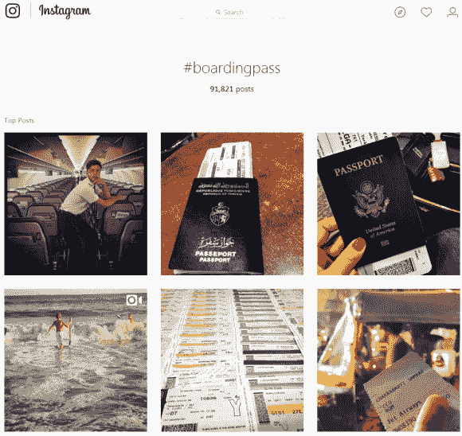

# 为什么张贴或丢弃你的航空公司登机牌仍然是一个坏主意——关于安全的克雷布斯

> 原文：<https://krebsonsecurity.com/2017/08/why-its-still-a-bad-idea-to-post-or-trash-your-airline-boarding-pass/?utm_source=wanqu.co&utm_campaign=Wanqu+Daily&utm_medium=website>

2015 年 10 月发表在这里的一篇关于扔掉或在网上发布你的航空公司登机牌的潜在危险的文章仍然是这个网站上阅读量最大的故事之一。一个原因可能是这些建议仍然是及时和相关的:最近在捷克安全会议上的一次演讲推进了这项研究，并提供了几个提醒，说明不小心使用登机牌会如何危及你的隐私，甚至会导致旅途中断。

登机牌上的条形码是什么？KrebsOnSecurity 讲述了一个读者的故事，他的朋友在脸书上贴了一张登机牌的照片。读者可以使用航空公司的网站，结合登机牌上打印的数据，发现关于他朋友的更多信息。这些数据包括未来旅行的细节，更改或取消即将到来的航班的能力，以及访问旅行者常旅客账户的关键组件。

在 Instagram 上搜索“登机牌”，返回 91000+个结果。

最近，安全研究员[Michal paek](https://www.michalspacek.com/)在捷克共和国的一次会议上做了一次演讲，他解释了从网上发布的一位朋友的登机牌照片中收集到的一些细节如何让他能够通过航空公司的网站查看朋友的护照信息，并更改另一位朋友的**联合航空**常旅客账户的密码。

从一个朋友发布到 **Instagram** 上的**英国航空**登机牌开始，帕切克发现他可以使用六位数的**预订代码**(又名 **PNR** 或**p**assenger**n**ame**r**ecord)和乘客的姓氏(两者都显示在 BA 的正面)登录该航空公司的乘客预订页面

进入朋友的账户后，paek 发现他可以取消未来的航班，并查看或编辑朋友的护照号码、国籍、到期日期和出生日期。在我 2015 年的故事中，我展示了这种精确的技术如何允许访问汉莎航空客户的相同信息(这似乎仍然是这种情况)。

帕切克还提醒读者在网上发布登机牌条形码或二维码的危险，指出有几个条形码扫描应用程序和网站可以提取条形码和二维码中存储的文本数据。登机牌条形码和二维码通常包含登机牌正面显示的所有数据，一些登机牌条形码实际上隐藏的个人信息甚至比登机牌上打印的还要多*。*

 *正如我在 2015 年指出的那样，**联合航空**将其客户的常旅客号码视为秘密访问代码。例如，如果你正在寻找你的**联合里程加**号码，而你没有他们寄给你的原始文件或会员卡，那么祝你在与该公司的电子邮件通信中找到这些信息。

当 United 在通信中包含此代码时，除最后三个字符外，所有字符都被替换为星号。美联航的登机牌也是如此。但是，如果您花时间解码任何一张联合航空登机牌上的条形码，就可以获得客户的完整里程数。

直到最近，如果你知道美联航客户的里程数加号码和姓氏，你就可以通过猜测关于客户的两个秘密问题的多项选择答案[来重置他们的常旅客账户密码。然而，美联航后来增加了第三个步骤——要求客户点击电子邮件中的链接，当有人成功猜出两个秘密问题的多项选择答案时，就会生成该链接。](https://krebsonsecurity.com/2016/08/united-airlines-sets-minimum-bar-on-security/)

令人疯狂的是，许多人在各种社交网站上发布他们的登机牌照片，通常是在他们现有的旅行之前和/或期间。例如，在 **Instagram** 上搜索[“登机牌”](https://www.instagram.com/explore/tags/boardingpass/)，会返回超过 91000 张这样的图片。并非所有这些图片都包括完整的条形码或登机记录定位器，但足够多了，这只是一个社交网络。

对于任何对今天的航空业在多大程度上仍然依赖于默默无闻的安全感兴趣的人来说，看看安全研究人员 **Karsten Nohl** 和 **Nemanja Nikodijevic** 去年在柏林**混沌通信大会** (CCC)上的精彩演讲。 Nohl 指出，六位数字的订票代码或 PNR 实际上是由航空公司发布的临时密码，然后被汇总打印在所有行李标签上和所有登机牌条形码内。

“你可以想象，如果他们把它当作等同于密码，那么他们会像密码一样保密，”诺尔说。“只是，他们没有，而是把它印在你从航空公司得到的所有东西上。例如，每件行李上都有你的姓氏和六位数字(PNR)代码。”

在他的演讲中，Nohl 展示了这些 pnr 如何在航空公司之间的代码共享协议中使用，这意味着访问他人的常旅客帐户可能会泄露与该客户在其他航空公司的帐户相关的信息。

Nohl 和他的合作者还展示了一些第三方旅游网站如何几乎不阻止自动程序快速提交相同的姓氏并更改 PNR，实质上是让攻击者[暴力破解目标客户的 PNR。](http://searchsecurity.techtarget.com/definition/brute-force-cracking)

我的建议是:避免在网上吹嘘即将到来的旅行或假期的诱惑。想要在你的区域抢劫的小偷会很高兴在网上看到这种信息。

不要在网上发布你的登机牌或其他任何带有条形码的照片(例如，Instagram 上目前有 [42，000 个关于“音乐会门票”的搜索结果](https://www.instagram.com/explore/tags/concerttickets/))。

最后，在下飞机前，不要把登机牌丢在机场的垃圾桶里或塞在你面前的椅背口袋里。相反，把它带回家撕碎。更好的是，根本不要纸质登机牌(用手机)。*