# Grammarly 如何在 9 年内悄无声息地发展到 690 万日用户|产品习惯

> 原文：<https://producthabits.com/how-grammarly-quietly-grew-its-way-to-7-million-daily-users/?utm_source=wanqu.co&utm_campaign=Wanqu+Daily&utm_medium=website>

# Grammarly 是如何在 9 年内悄悄发展到每天 690 万用户的

自 2008 年以来，Grammarly 已经悄然成长为网络上最成功的自费产品之一。

联合创始人 Alex Shevchenko 和 Max Lytvyn 在过去九年中开发了一个广泛的产品，并获得了广泛的采用。迄今为止，Grammarly 的免费 Chrome 扩展已经被下载了 1000 万次，该公司拥有[690 万日活跃用户](https://www.axios.com/grammarly-adds-110-million-to-help-you-write-better-2400027108.html)。年复一年，Grammarly 的[用户和收入等关键指标每年翻一番。](https://www.prlog.org/12141222-grammarly-welcomes-world-class-marketing-advisor-christine-petersen.html)

今年，它首次筹集了资金——由通用催化剂公司牵头的 1.1 亿美元投资。

Grammarly 通过不懈地专注于一个核心价值实现了所有这些:帮助人们在每天的在线写作中更好地交流。让我们深入了解一下 Grammarly 如何将他们的业务发展到每天近 700 万用户——以及他们可以从这里走向何方。

## 语法的成长之路

如果你熟悉 Grammarly，你可能是通过谷歌 Chrome 的免费浏览器扩展第一次遇到它的。

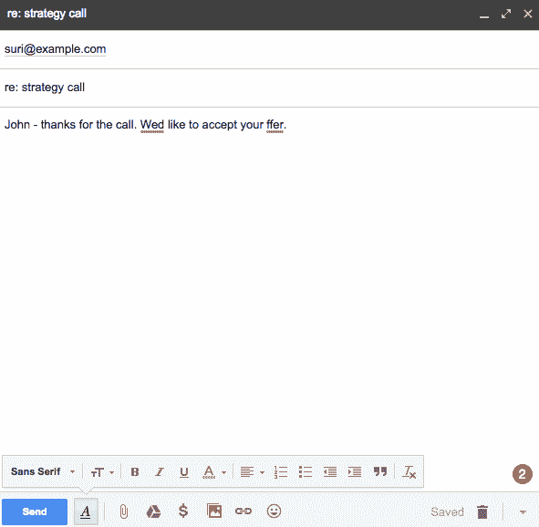

免费的扩展突出了你在网上任何地方输入时犯的任何主要拼写错误。升级到付费计划可以让你获得更深入的功能集，包括语法和抄袭检查，以及上下文建议，以改善你的写作。

核心的语法检查和写作产品是 Grammarly 多年来一直提供的服务。有趣的是，与大多数公司不同，Grammarly 并不是以免费增值业务开始的。它实际上是[反向货币化](https://wistia.com/blog/monetizing-backwards)。

作为一家自筹资金的公司，Grammarly 是从销售给企业开始的。他们利用大学的收入来改进核心产品，然后再扩展到消费市场。当 Grammarly 过渡到免费增值时，它已经有了数百万用户，可以为一个免费增值计划提供资金，从而获得更多的新用户。

然后，该公司扩展了其产品，使用户可以直接在微软 Office 中使用该工具，然后通过谷歌 Chrome 扩展使用网络应用程序。这是他们的用户增长真正起飞的时候。

让我们来看看 Grammarly 业务发展的每个阶段——从最初的企业产品到现在的免费增值发电站。

## 2008-2011 年:通过向大学销售，打造一款有利可图的产品

今天，Grammarly 的产品使用复杂的算法和机器学习，每月吐出[十亿条写作建议](https://www.wsj.com/articles/grammarly-with-110-million-brings-artificial-intelligence-to-writing-1494243003)。但是回到 2008 年，当 Grammarly 刚开始的时候，他们试图用有限的资源拼凑一个产品。

在早期，Grammarly 的联合创始人 Alex Shevchenko 和 Max Lytvyn 专注于两件事来实现这一目标:

1.  围绕一个他们熟悉的空间，在那里他们可以快速找到付费客户，以及
2.  利用这些客户的反馈和收入来改进产品。

当你自己投资一个产品时，你通常不会有很多现金投入到这个业务中。你必须尽快与付费用户签约，以控制你的烧钱速度。

 *###### 在 Grammarly 出现之前，就有了 MyDropbox，这是一个针对大学的在线剽窃检查工具

在 Grammarly 之前，两位联合创始人已经在 2002 年开发了一款名为 MyDropbox 的剽窃检查软件。到 2007 年，我的 Dropbox 已经扩展到 800 所大学和大约 200 万名学生。问题是该产品的使用案例狭窄，限制了增长潜力。联合创始人不会说他们把我的 Dropbox 卖了多少钱，除了[说金额很少](http://escadra.com.ua/en/kak-dvoe-kievlyan-sozdali-servis-proverki-anglijskogo-pravopisaniya-stoimostyu-100-mln.html)。

通过他们的下一个产品 Grammarly，舍甫琴科和利特温吸取了教训。从一开始，Grammarly 就被设计成一个真正帮助人们更好地写文章的产品——这个问题比我的 Dropbox 有更大的市场机会。虽然剽窃是大学关心的问题，但写作和交流是每个人都关心的问题**。**

尽管如此，文法上还是要赚钱。因此，当联合创始人在语法上有所发展时，他们利用他们在大学阶段的关系作为起点——他们知道他们最终会扩展到更广泛的受众。舍甫琴科解释说:“我们在大学里仍有许多朋友。与乌克兰[教育机构]不同，西方教育机构对新技术持开放态度。”

Grammarly 的早期登录页面向大学和学生推销 Grammarly 的 web 编辑器产品:

Grammarly 2008-2009:Grammarly 最初的基本产品只是一个所见即所得的编辑器，你可以将文本复制并粘贴到其中。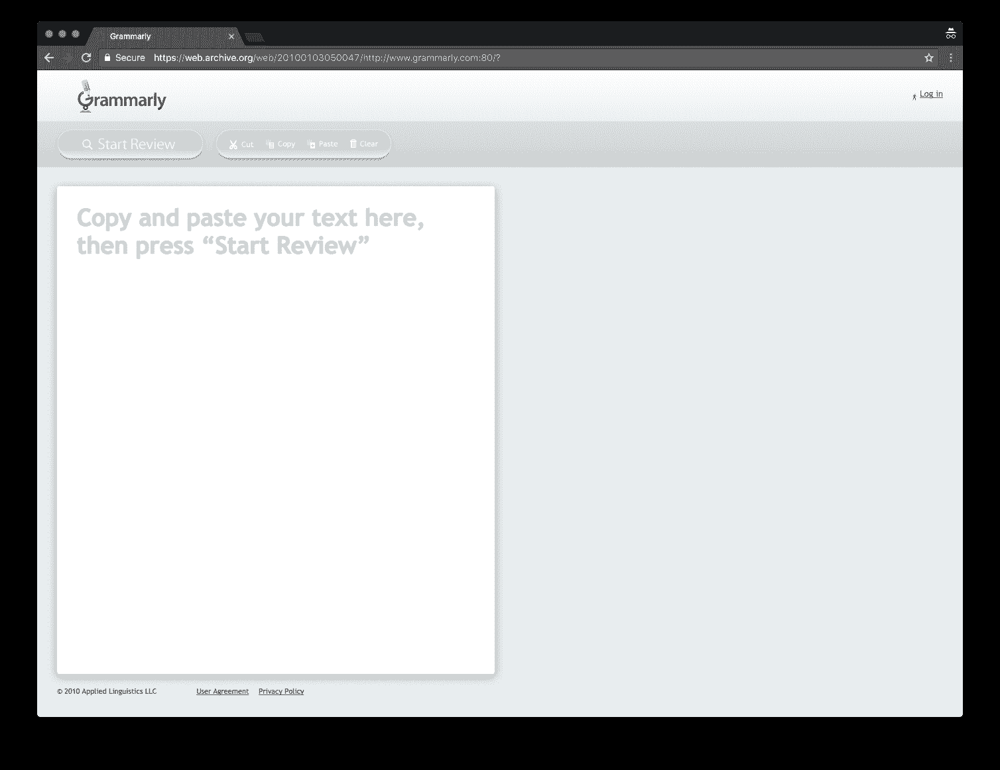 ** 2010 年:**Grammarly 最初发展其产品时，在其登陆页面上关注学生和教育。当时，Grammarly 的注册用户超过了 15 万名学生。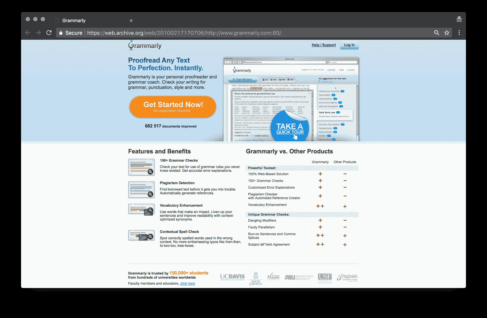 **2011:** 文法继续开拓教育市场。到 2011 年，Grammarly 的注册用户有 30 万名学生，客户有 250 多所大学。Grammarly 的早期产品是一个简单的网络应用程序。你可以将文本复制粘贴到网页编辑器中，然后点击“开始查看”按钮。该产品会突出文本中的任何错误，并提供一个建议写作改进的列表。不像微软 Word 的拼写检查，它只扫描明显的拼写和语法错误，语法处理一切——从上下文拼写到风格。

###### 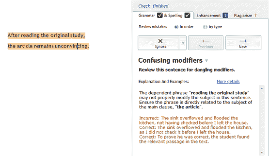

早期产品开发的关键限制是技术复杂性。创建一个足够智能的算法来理解英语需要时间和金钱。为此，Grammarly 做了一些非常简单的事情:他们向用户征求反馈。舍甫琴科指出:“我们的系统并不完美，所以我们增加了一个选项，对整改的正确/错误进行投票。从语法上来说，正如我们今天所看到的，完全是我们客户贡献的结果。"

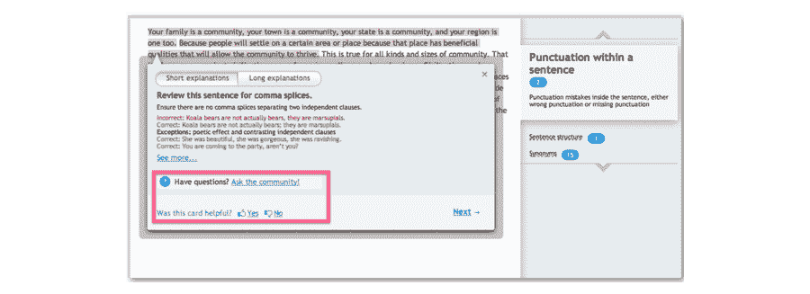

从第一天开始，Grammarly 就没有试图构建一个完美而昂贵的算法，而是依赖用户的建议来改进其产品。这种稳定的反馈意味着 Grammarly 在不断改进，而像 Microsoft Word 这样的竞争产品却停滞不前。

正如舍甫琴科所说，“我们的目标是关注问题和解决方案，而不是吸引投资者。”这意味着向大学推销并改进他们的语法检查产品。这个简单的早期策略非常成功。据一位消息人士称，Grammarly 在 2012 年成立三年后，已经实现了每年 1000 万美元的收入。

## 2012-2015 年:拓展消费者业务

当你开始盈利并看到成功时，那正是你必须踩下油门扩张的时候。虽然 Grammarly 取得了很少公司看到的早期成功，成长为数百万美元的业务，但他们没有坐以待毙。

卖给大学是有利可图的，并为 Grammarly 的早期业务提供了资金，但增长受到了漫长销售周期的阻碍。与此同时，Grammarly 注意到学生和学者以外的客户群体增长迅速。这两个因素扭转了局势，推动团队建立消费者业务。

联合创始人 Max Lytvyn [说](http://www.huffingtonpost.com/billrobinson/hows-your-grammarly-mines_b_5602188.html):

“我们发布了我们的第一个(语法上的)产品，并明确认为语言学习者和学生是我们的第一批客户。但是后来我们看到有更多不同的用户:记者、销售人员、顾问、政府和技术/医学作家…..**看到我们的用户如此兴奋，这是一种神奇的体验。**

虽然 Grammarly 总是旨在帮助人们更好地写作，但看到所有这些不同类型的用户被该产品吸引，证明了消费者市场的商业可行性。随着市场的扩大，这也意味着 Grammarly 可以获得继续改进核心产品所需的数据。正如 Lytvyn [所说的](https://www.wsj.com/articles/grammarly-with-110-million-brings-artificial-intelligence-to-writing-1494243003)，“如果我们(专注于)一个特定的垂直领域，我们会极大地限制系统的学习能力。”

对于消费者计划，Grammarly 提供了 7 天的免费试用，而付费的年度计划每月收费 11.99 美元。在接下来的几年里，消费者订阅超过了企业合同——最终增长到总收入的 80%。

让我们来看看 Grammarly 的信息是如何随着公司建立消费者业务而改变的:

2012 年:随着语法转向瞄准更广泛的消费者受众，他们开始在脸书和 Twitter 等社交渠道上大举投资。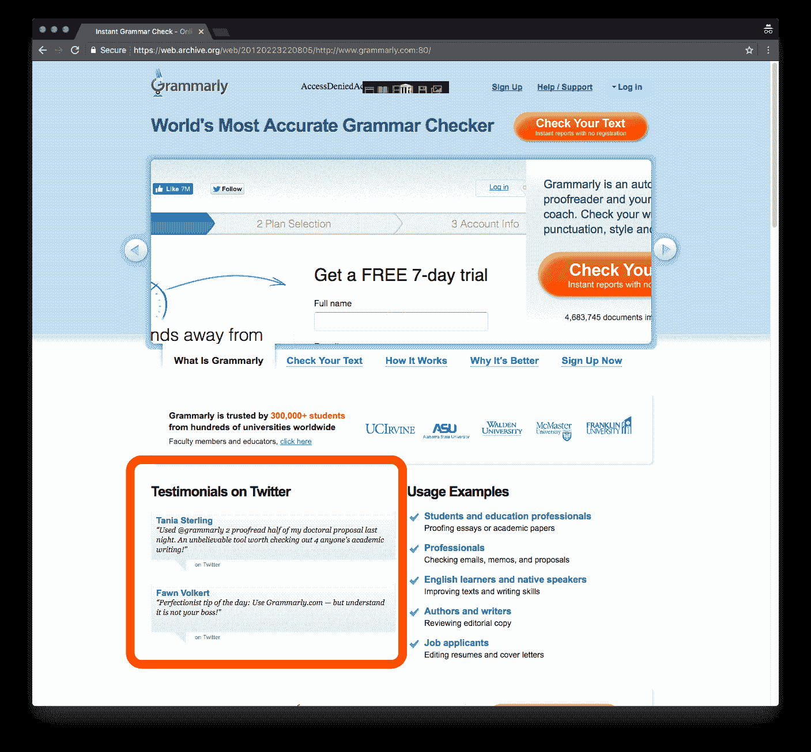 **2013:** 语法上开始调整其登陆页面，以瞄准更广阔的市场。登录页面上的标语是“世界上最好的语法检查器”，而社交证明的片段是“受到 300 万人的信任”(而不仅仅是学生)。与此同时，Grammarly 的脸书粉丝已经超过了 100 万。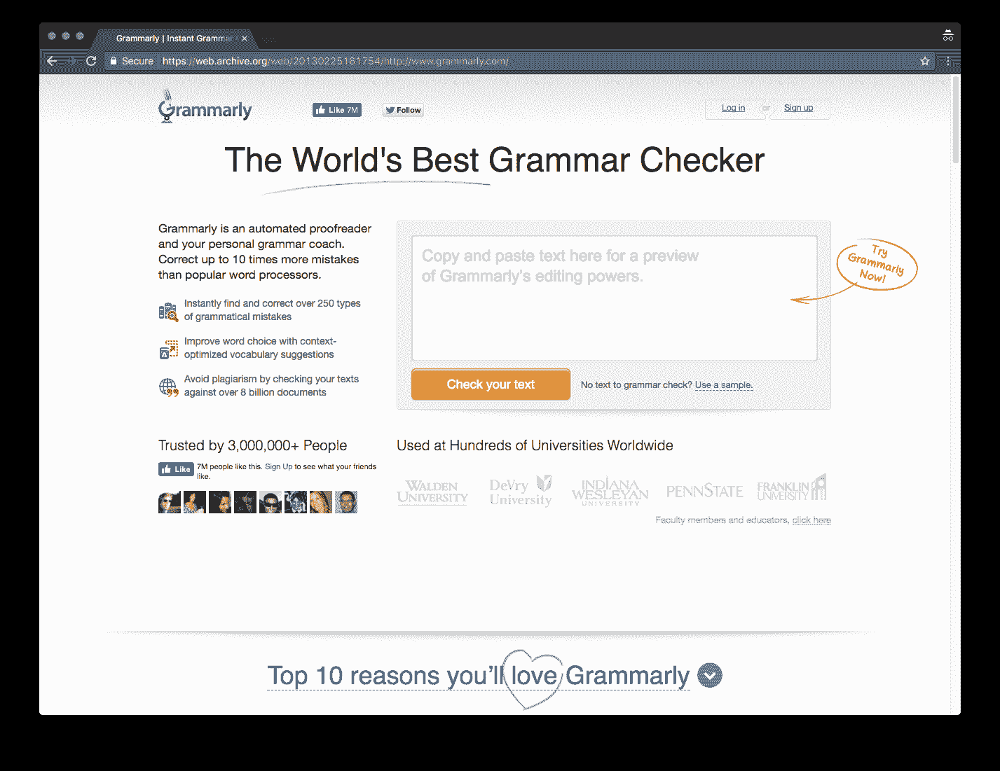 ** 2014: ** Grammarly 推出 MS Office 插件，允许用户在 Word 和 Outlook 中直接访问 Grammarly 的语法检查器和抄袭检测技术。

转向消费者市场意味着 Grammarly 必须更加关注营销以及新客户如何进入其漏斗顶端。早期，Grammarly 创建了针对语法爱好者的内容，并将其发布到脸书。但正如社交媒体经理金伯利·乔基(Kimberly Joki)说的那样，“这是一个很小的、专业的受众群体，它只是没有实现。”因此，该公司重新配置了它的方法。

该公司不再简单地发布常见的语法错误，而是开始围绕各种用例精心制作内容——从简历写作技巧的帖子，到与[怪异艾尔](https://twitter.com/alyankovic)的采访，再到专业的电子邮件写作建议。到 2013 年，Grammarly 已经拥有超过一百万的脸书粉丝。到 2016 年，他们有 700 万人。

营销策略的这种转变与团队开发产品的方式密切相关。使用 Grammarly 的网络编辑器，用户必须将文字从文字处理器复制粘贴到浏览器，这是一个很大的摩擦来源。正如 Max Lytvyn 所说，“我们不想把用户带到语法上，而是想把语法带到人们写作的任何地方。我们正在向这样一个方向发展，我们的产品将位于组织文档的存储之间，并在人们编写文档时自动检查文档。”

实现这个目标的第一步是为 Microsoft Word 和 Outlook 开发一个插件。突然间，用户可以在他们花费大部分时间实际写作的地方访问语法。

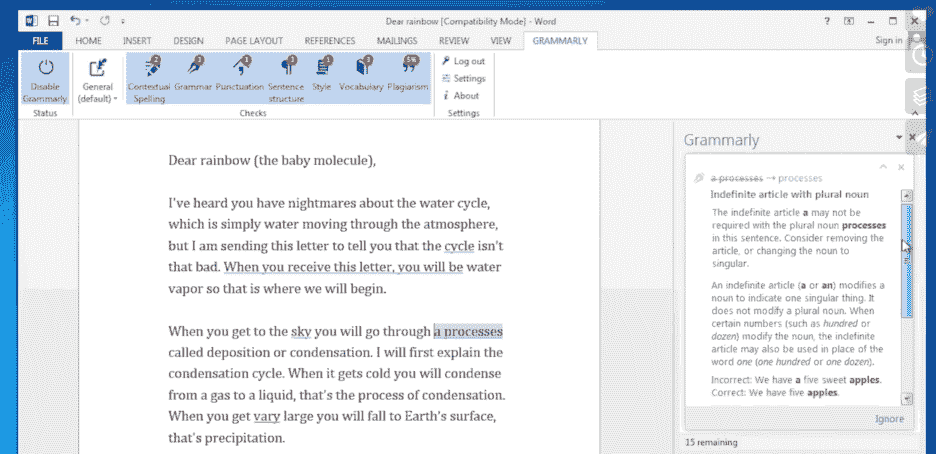

语法上的理解是，你不能某天醒来就决定改变你的核心客户群。你必须通过你的渠道、营销和产品有意识地执行这种转变。

从语法上来说，这种经过计算的方法是有效的。到 2013 年，Grammarly 已经实现了比 2009 年 2，326%的收入增长，注册用户超过 300 万。

## 2015 年至今:向免费增值过渡

建立消费者业务和 MS Office 插件是 Grammarly 接近 700 万日活跃用户的第一步。Grammarly 推出免费的谷歌 Chrome 扩展，并过渡到免费增值商业模式，这是推动增长引擎的下一步。

微软 Office 插件的成功让 Grammarly 的团队更加确信，他们必须把他们的产品放在人们实际书写的地方。这意味着在网络浏览器中的实时性。到 2015 年，语法用户不仅仅是用微软 Word 写东西。他们在谷歌文档中写备忘录，在浏览器中输入电子邮件，在网上填写求职申请。凭借其免费的浏览器扩展，通过将产品放在任何有在线表单域的地方，从语法上减少了用户的摩擦。

在一次采访中，增长部的语法主管塞维多夫·蒂门说:“全世界有超过 20 亿的英语作家，我们相信我们的产品可以而且应该被所有人使用。”转向免费增值的商业模式意味着 Grammarly 可以再次扩大市场，将自己直接放在用户面前。

让我们看看 Grammarly 的消息传递是如何随着免费增值计划发展的:

2015 年: Grammarly 推出了谷歌 Chrome 和 Safari 的免费浏览器扩展。该公司转向了免费增值的消费者模式。Grammarly 的登陆页面让安装 Chrome 扩展变得很容易，只需点击“Get Grammarly-it ' s free”即可。

 ** 2016: ** Grammarly 继其广受欢迎的 Chrome 扩展之后，又为 Safari 和 Firefox 增加了额外的扩展。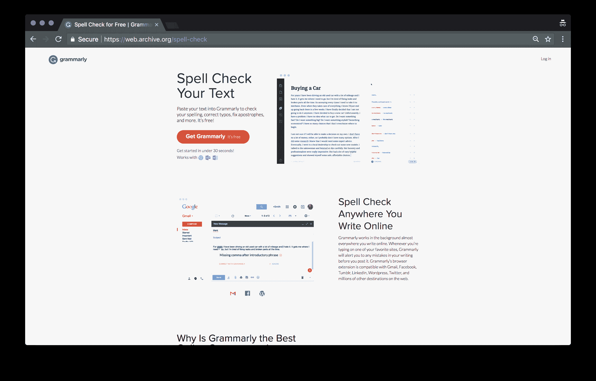 **2017:** 推出两年后，仅 Grammarly 的免费 Chrome 扩展就拥有超过[800 万活跃用户](https://instapage.com/podcast/sequential-messaging-digital-advertising)，Chrome 网络商店上的下载量超过 800 万。Grammarly 的营销网站已经改版，让新用户立即安装扩展。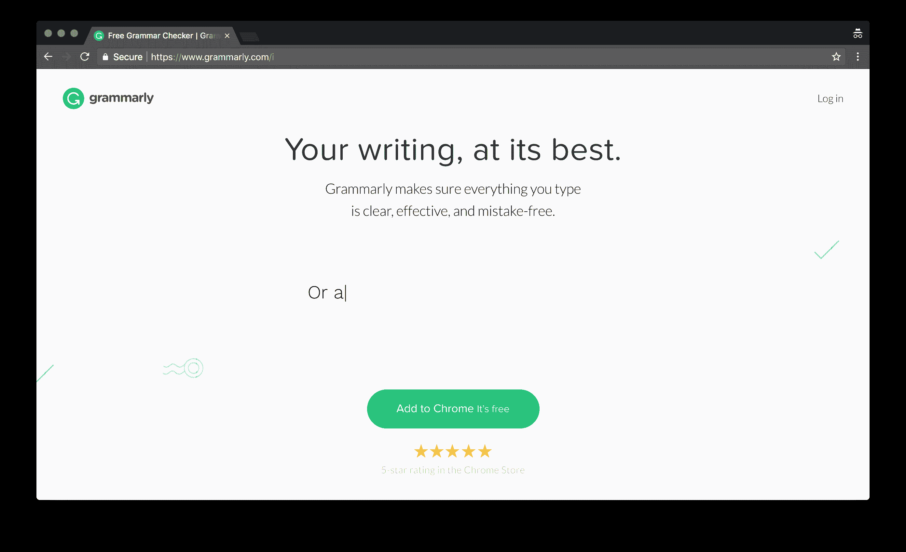从战略上讲，围绕 Chrome 扩展建立免费增值业务有两大目的。

首先，通过减少摩擦和使其产品更易于使用，Grammarly 使自己领先于微软 Word 和谷歌 Docs 等潜在竞争对手。虽然这些产品有内置的拼写检查器，但 Grammarly 的产品不仅好 10 倍，而且可以在人们输入的任何地方访问。

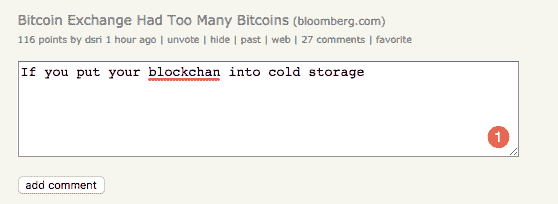

其次，它通过向新用户免费提供即时实用工具，为 Grammarly 的优质产品创造了一个更大的漏斗和更合理的向上销售途径。Grammarly 可以监控免费计划的使用情况，并使用这些数据来驱动转换，而不是在七天免费试用后试图转换用户。

这种方法之所以有效，部分原因是因为它在语法上提供了一些更重要的功能——风格推荐、抄袭检测和高级语法检查。通过让用户首先围绕免费产品建立习惯，他们最终可以将用户推向高级版本。正如 Grammarly 的产品营销负责人[所说的](https://www.salesforce.com/blog/2015/10/grammarly-data-driven-marketing.html)，“我们的目的是确保我们的用户知道他们现在可以使用哪些功能，以及高级升级，并平衡追加销售信息。”

*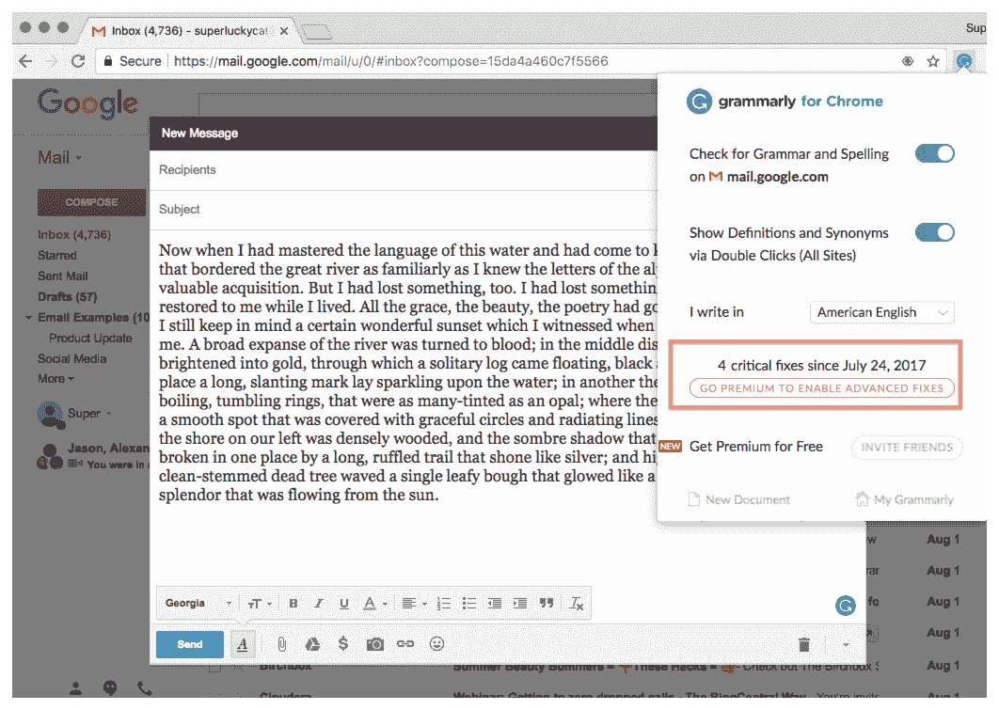*

 *在浏览器中，Grammarly 的 Chrome 扩展向用户显示了免费计划中 Grammarly 通过追加销售消息启用了多少修复。

*他们还会给用户发一封[周写邮件](https://www.salesforce.com/blog/2015/10/grammarly-data-driven-marketing.html):*

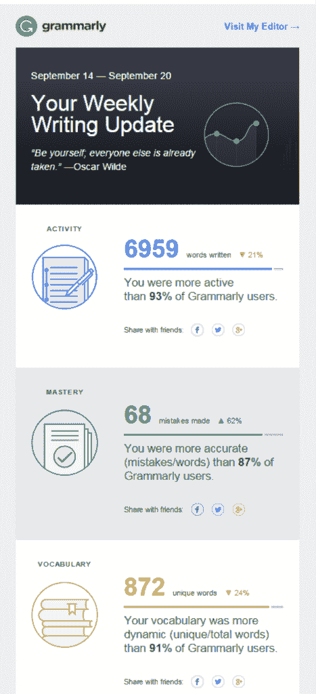

*根据用户行为对每封电子邮件进行语法上的个性化处理，只有当收件人充分使用产品以证明其价格合理时，才会在电子邮件中添加促销信息。*

像 Dropbox 和 Trello 这样的公司已经使用了针对消费者的免费增值商业模式来“拓展”更大的商业和企业账户。语法上恰恰相反。它专注于教育和大学等有利可图的领域，为其不断增长的产品提供资金，然后建立免费增值业务以快速扩张。

## 语法将何去何从

语法学了九年，才刚刚开始。今年，该公司首次获得融资，在由 General Catalyst 牵头的一轮融资中筹集了 1.1 亿美元，以增加招聘人数，以及为其产品提供支持的机器学习算法。

在一次采访中，General Catalyst 常务董事 Hemant Taneja 说:“公司正处于一个非常有趣的转折点。他们有稳定的用户增长和可持续的业务，但要真正大胆地完成使命，他们需要扩大团队规模，寻求一些难题的真正解决方案。同时，他们可能需要拓宽他们支持的用户的使用案例和类型。”

虽然人工智能和机器学习在当前的技术宣传周期中风靡一时，但 Grammarly 实际上正在使用这些新技术来解决数百万人每天面临的实际问题。

公司显然还有很大的发展空间。以下是 Grammarly 未来可能扩展的几种方式:

*   **机器学习和人工智能:**每当有人在使用 Grammarly 的 Chrome 扩展、web 应用程序或 MS Office 插件时打字，该公司就在收集他们可以用来改进其产品的数据。这方面的最新应用是推出了 [Grammarly Insights 2.0](https://www.grammarly.com/blog/new-grammarly-insights/) 。Insights 每周向用户发送一份关于他们写作方式的趋势报告，其中包括从词汇指标到生产率的所有内容。在未来，Grammarly 可能不仅会使用机器学习来提供更好的算法，还会向用户提供高度个性化的推荐。
*   **攻击新渠道:**随着 Grammarly 的营销努力开始挖掘付费搜索和内容渠道，该公司有很大的空间来尝试新的收购渠道。其中之一是电视。我[和 Grammarly 的增长主管塞维多夫·蒂门一起主持了一个小组讨论，他谈到了公司在电视广告和广告牌方面的努力。有了如此广泛的产品，任何人都可以使用，这些广播频道给了 Grammarly 一个扩大其覆盖范围的机会。](https://blog.drift.com/growth-hacking-secrets/)
*   **回到企业:**对 Grammarly 最大的威胁来自微软和谷歌——这两家公司都有很多机器学习专业知识，并且正在接近生产力领域。Grammarly 可以通过回到企业领域来抵御这种威胁。随着 Grammarly 扩大其市场，它将继续建立其自助式企业产品 Grammarly @ edu，以大学和机构为目标。

虽然人工智能和机器学习在当前的科技[炒作周期](https://hitenism.com/hype-cycle-and-the-norm/) 中风靡一时，但 Grammarly 正在使用这些新技术来解决数百万人每天面临的实际问题。

## 从语法上吸取的教训

Grammarly 的网站上写道:“我们的使命是通过更好的交流帮助每个人成功。”这是一个非常雄心勃勃的目标——也是语法上多年来取得重大进展的目标。

想像 Grammarly 一样创业？以下是你可以从公司的成功中吸取的一些重要经验:

### **第一课:把你的产品带到顾客所在的地方**

许多产品驱动的公司陷入了“建立它，他们会来”的陷阱。他们犯了一个错误，即专注于困难的技术问题，认为收入自然会随之而来。语法上的成功是因为:1)。创造了一个伟大的产品和 2)。烘烤产品进入销售。

如果 Grammarly 坚持构建最好的检查语法的 web 应用程序，它就会在像 Microsoft Office 或 Google Docs 这样的产品上多加一层。如果微软或谷歌建立了一个稍微好一点的原生语法检查器，客户就没有理由为 Grammarly 支付额外的 12.99 美元/月。

构建一个免费的 Chrome 扩展减少了人们使用语法的摩擦，这反过来增加了人们使用产品的方式。作为 Chrome 的一个扩展，Grammarly 可以跟随用户在网上的任何地方——无论他们是发送工作邮件，在 Google Docs 上写书，在 Reddit 上发表评论，还是在 Twitter 上发布消息。区别在于:是开发一个人们每周使用一到两次来检查重要邮件语法的产品，还是开发一个人们每天都可以在任何地方使用的产品。

我并不是说建造一台计算语言学机器很容易。但是我怀疑 Grammarly 的成功与产品的销售以及它的运作有多大关系。

### **第 2 课:随着时间的推移，赢面会越来越大**

每个人都喜欢谈论为其他公司带来两位数增长的增长秘诀。虽然这些策略造就了好故事，但一次性的成功并不能建立一个可持续的业务。Grammarly 已经能够通过小的、增量的胜利，使每年的客户获取和收入等指标翻倍。

凭借一个中等规模的团队，Grammarly 没有足够的带宽来同时尝试一系列营销渠道。相反，他们把重点放在把脸书建设成营销推广的主要中心。Grammarly 的社交媒体经理[解释说](https://contently.com/strategist/2015/04/23/how-grammarly-built-a-social-media-empire-of-7-million-grammar-geeks/)“在早期，我们采取的第一步是比较已经存在的渠道，并决定哪一个将是时间和资源的最佳投资。”

他们尝试了多种内容形式，从图像到文本帖子。然后，他们将这些知识应用于新的渠道，如 Twitter 和电视。

如果你想推动一家公司的发展，不要试图同时应对每一个渠道。找出你的客户在网上花时间的地方，找到他们最有效的渠道是什么。在进入下一个频道之前，完善你在那个频道的外展。

### **第三课:发展你的商业模式**

许多企业忘记思考他们的商业模式。如今，很多公司，尤其是 SaaS 的公司，专注于向其他初创公司和小公司出售早期产品，以推动初期增长。然后，他们转向高端市场，以获得更多收入和更大的合同。

语法上恰恰相反。他们开始向企业销售，然后转向互联网上最成功的免费增值公司之一。它之所以奏效，是因为 Grammarly 产品的核心是帮助人们写得更好——这是他们每天都在做的事情。虽然教育市场是该产品最明显的出发点，但坚持教育会限制 Grammarly 的增长。语法上修改了它的商业模式，以挖掘其产品的最大机会。

创业没有一成不变的公式。如果你今天正在创建一家公司，仔细看看你是如何将你的产品货币化的——以及你没有这样做的所有方式。你目前的摇钱树通常不会在五年或十年后继续扩大业务。

在过去的九年里，Grammarly 已经悄悄地建立了一个最成功的企业，有很大的发展空间。世界上有超过 20 亿人说英语，Grammarly 正在努力让尽可能多的人迷上它的产品。我很期待看到公司下一步的发展方向！**