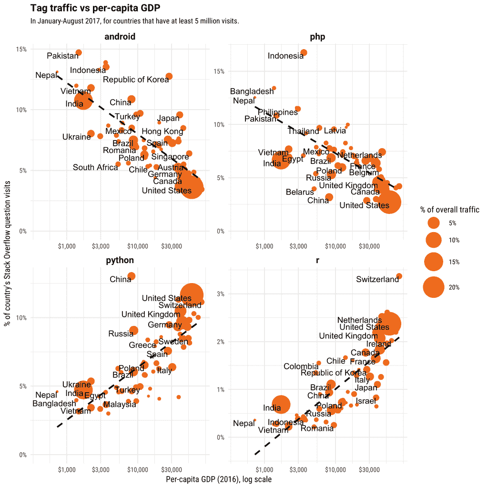
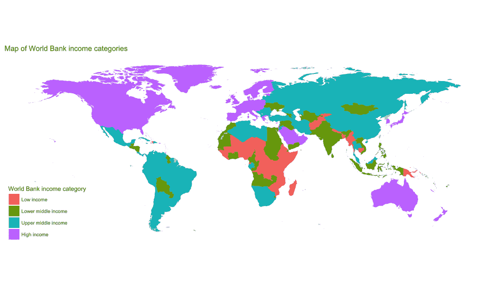
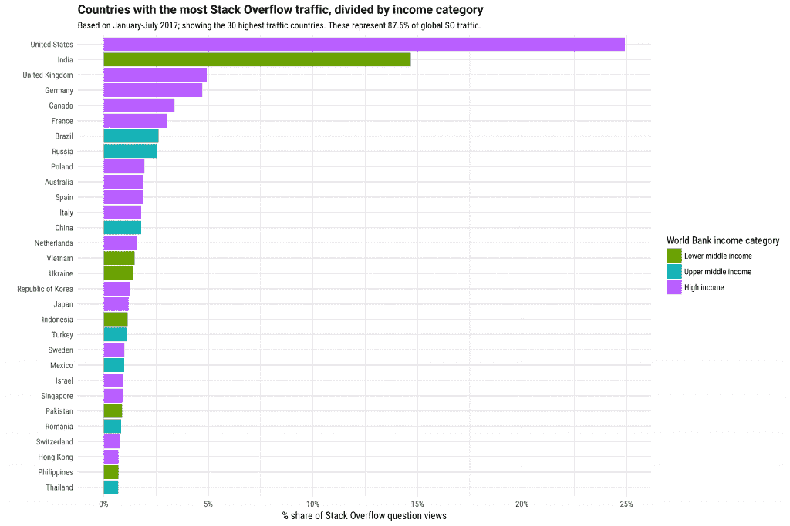
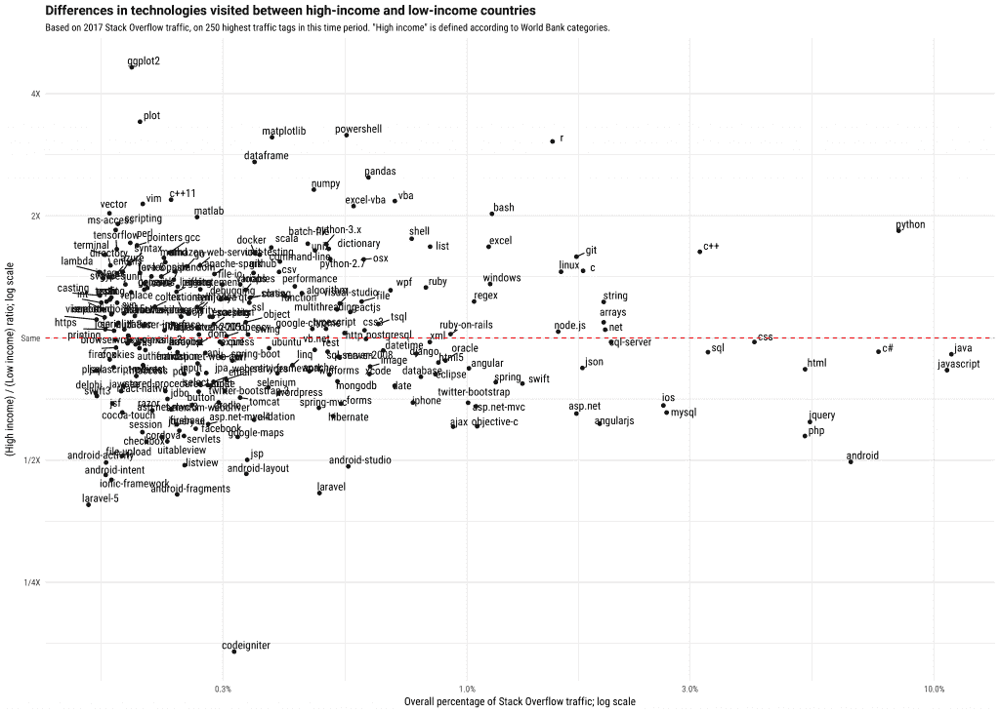
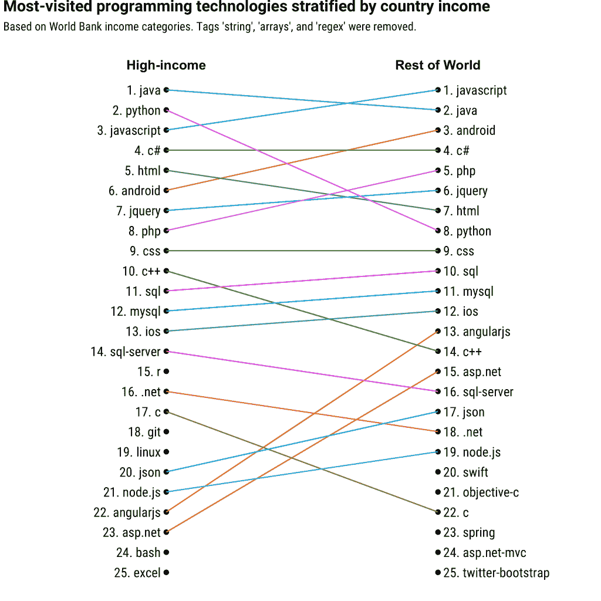

# 两个行业的故事:富裕国家和发展中国家的编程语言有何不同

> 原文：<https://stackoverflow.blog/2017/08/29/tale-two-industries-programming-languages-differ-wealthy-developing-countries/?utm_source=wanqu.co&utm_campaign=Wanqu+Daily&utm_medium=website>

在 Stack Overflow，我们有兴趣使用我们的数据来分享关于全球软件开发社区的见解。[最近这篇关于移动开发者分布的文章](https://stackoverflow.blog/2017/08/22/world-mobile-development/?utm_source=so-owned&utm_medium=blog&utm_campaign=gen-blog&utm_content=blog-link&utm_term=income-countries)就是一个很好的例子:它研究了来自世界各地的 Android 问题流量，发现低收入国家比高收入国家更倾向于访问 Android。

这让我们想知道富国和穷国之间的编程技术还有什么不同，以及这如何影响我们对全球软件开发行业的看法。在本帖中，我们将探究这些差异，并展示将软件开发行业划分为高收入国家和世界其他地区是有用的。

这里探讨的所有分析都是在 2017 年到目前为止(1 月至 8 月)，在那段时间内流量最大的 250 个标签上进行的。为了减少噪音的影响，我们只分析了在此期间至少有 500 万次问题访问的 64 个国家。同样值得注意的是，这些数据代表了懂英语的开发人员的活动(对西班牙语网站和葡萄牙语网站的一些分析表明，类似的趋势也适用于墨西哥和巴西等非英语国家)。

### 与人均国内生产总值相关的技术

在最近的一篇帖子中，我们看到 Android 问题的流量(占一个国家栈溢出访问量的百分比)往往与一个国家的人均 GDP 呈负相关。这可能会让我们怀疑其他标签是否也是如此。

当我们探索主要的编程语言和平台时，除了 Android 之外，一些突出的包括 PHP、 [Python](https://stackoverflow.blog/2017/09/06/incredible-growth-python/) 和 r。

Android 和 PHP 的流量与一个国家的收入负相关，Python 和 R 正相关。在每种情况下，我们都可以看到例外(韩国使用的 Android 比我们预期的多，中国使用的 Python 多)，但总体来说相关性很强。(每个都有大约 0.5-6 的 R 2 ，经过多次测试调整后的 p 值< 10 -6 )。

我们要强调的是，我们在这里并没有暗示任何因果关系。我们当然不是说编程语言的选择会影响一个国家的平均收入，但我们也不是说一个国家的财富会直接影响他们对技术的使用。我们怀疑，这些驱动因素可能是经济和社会因素(教育水平、软件行业的年龄、外包水平)的混合，通常与一个国家的财富相关。

### 我们如何将软件开发行业一分为二？

当我们研究趋势时，谈论两组国家(高收入和非高收入)是有用的，而不是考虑一堆相关性。作为一个有用的预先存在的分类，我们可以使用[世界银行收入分类](https://datahelpdesk.worldbank.org/knowledgebase/articles/906519-world-bank-country-and-lending-groups)，它是基于人均国民总收入(见[此处](https://datahelpdesk.worldbank.org/knowledgebase/articles/378831-why-use-gni-per-capita-to-classify-economies-into)对这一分类的讨论)。

有 78 个高收入经济体，主要由美国和加拿大、西欧、中东和东亚部分地区以及澳大利亚/新西兰组成。我对国家间差异的基本驱动因素做了一些分析(如[主成分分析](https://en.wikipedia.org/wiki/Principal_component_analysis))，表明这是一种合理的划分，比我们划分它们的其他方式更有意义，如东半球对西半球。(例如，就被访问的技术而言，澳大利亚通常更类似于美国和欧洲，而不是中国或印度尼西亚)。

该部门将堆栈溢出流量分成大约三分之二和三分之一的组: **63.7%** 的堆栈溢出流量来自高收入国家。(这可能是由于软件开发比例更高、互联网接入更广泛以及说英语的人比例过高的综合因素)。来自非高收入国家的大部分流量来自印度，其次是巴西、俄罗斯和中国。

### 高收入国家使用的技术有何不同？

我们现在已经将软件开发世界分成了两个部分。高收入国家和非高收入国家使用的技术有何不同？

我们可以提取几个有趣的见解:

*   **数据科学技术的差异**:正如我们前面看到的，Python 和 R 与一个国家的收入有关。Python 在高收入国家的访问量大约是世界其他地方的两倍，R 大约是世界其他地方的三倍。我们可能还会注意到，在较小的标签中，许多最大的变化出现在科学 Python 和 R 包中，如[熊猫](https://stackoverflow.com/questions/tagged/pandas)、 [numpy](https://stackoverflow.com/questions/tagged/numpy) 、 [matplotlib](https://stackoverflow.com/questions/tagged/matplotlib) 和 [ggplot2](https://stackoverflow.com/questions/tagged/ggplot2) 。这表明，这两种语言的收入差距部分可能是由于它们在科学和学术研究中的作用。这在较富裕的工业化国家会更普遍，这是有道理的，在这些国家，科学研究占经济的更大部分，程序员更有可能拥有更高的学位。
*   C/C++ : C/C++是另外两种受高收入国家青睐的著名语言。一种假设是，这可能与教育有关:正如我们在[的前一篇文章](https://stackoverflow.blog/2017/02/15/how-do-students-use-stack-overflow/)中看到的，C 和 C++是美国大学中访问量最大的语言之一。这也可能与电子和制造业的地理分布有关。
*   **PHP 和 Android** :我们在[的上一篇文章](https://stackoverflow.blog/2017/08/22/world-mobile-development/)中探索了全球的 Android 开发，但是 PHP 是另一项与低收入国家有显著联系的技术。有趣的是，PHP 开源框架 CodeIgniter 是来自低收入国家的*最多*访问的标签，比例很大。进一步的研究表明，它在南亚/东南亚(特别是印度、印度尼西亚、巴基斯坦和菲律宾)的访问量特别大，而来自美国和欧洲的流量很少。CodeIgniter 可能是建设网站的外包公司的常见选择。

### 结论:为什么这很重要？

我当然对这些结果感兴趣，因为它们是关于编程语言生态系统的有趣事实。但它也暗示了我们将在不久的将来发布的其他数据探索。

当我们问关于软件开发行业的问题时，重要的是要知道我们实际上是在回答两个已经“混合”在一起的独立问题，并且将它们分开有时可以给我们提供更多信息的答案。

例如，我们通常有兴趣了解哪些技术驱动了最多的流量，例如[检查像 Flash 这样随着时间推移而缩小的技术](https://stackoverflow.blog/2017/08/01/flash-dead-technologies-might-next/)。如果我们要创建一个最常访问的编程技术列表，那么高收入和低收入国家的情况会有所不同:

例如，2017 年到目前为止，Python 是高收入国家中第二大访问量标签，而在世界其他地区仅排名第八。我选择的语言 R 是高收入国家中第 15 个被访问次数最多的标签，但在其他地方，它甚至没有进入**前 50 个**被访问次数最多的标签。

当我们使用堆栈溢出数据来了解开发人员生态系统时，这是一个重要的上下文。一名对该行业的未来感兴趣的美国科技招聘人员需要一套不同的答案，而不是一名想知道该学什么语言的印度学生，或者一名希望了解肯尼亚科技公司的投资者。

在以后的文章中，当我们继续探索全球开发者生态系统时，我们有时会提到这个部门。

* * *

如果你想在世界任何地方寻找开发人员的工作，那就去寻找堆栈溢出工作的机会吧。有从[伦敦](https://stackoverflow.com/jobs/developer-jobs-in-london?utm_source=so-owned&utm_medium=blog&utm_campaign=dev-c4al&utm_content=c4al-link)到[曼谷](https://stackoverflow.com/jobs/developer-jobs-in-bangkok?utm_source=so-owned&utm_medium=blog&utm_campaign=dev-c4al&utm_content=c4al-link)的发布，也有不受地点限制的[远程工作](https://stackoverflow.com/jobs/remote-developer-jobs?utm_source=so-owned&utm_medium=blog&utm_campaign=dev-c4al&utm_content=c4al-link)。