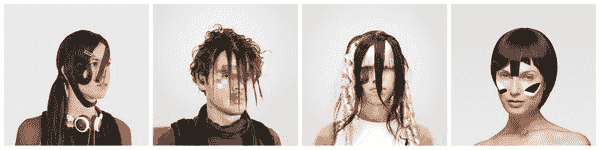
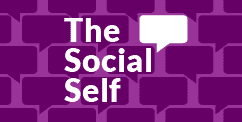

# 你脸上的反监视伪装——大西洋

> 原文：<https://www.theatlantic.com/technology/archive/2014/07/makeup/374929/?utm_source=wanqu.co&utm_campaign=Wanqu+Daily&utm_medium=website>

国家安全局让我在脸上涂了厚厚的化妆品。

或者说，确切地说，这并没有使我成为我。但去年春天，我发现自己第一次穿着炫目的迷彩服在华盛顿特区闲逛。这是一个阳光明媚的周六，首都沼泽既不寒冷也不闷热——非常适合散步。我花了 45 分钟化好所有的妆，把铅笔涂好，头发也垂下来。

我花了一天时间和一些朋友在亚当斯摩根附近闲逛，这个社区似乎是由前嬉皮士开发的，他们进入了非营利的高级套房或开设了精品餐厅酒吧。我告诉我的朋友为什么我的脸上有深色化妆品的斑点，但没有对其他人说太多，这就是我开始看起来的原因。

 <gpt-ad class="GptAd_root__2eqVh ArticleInjector_root__fjDeh s-native s-native--standard s-native--streamline" format="injector" sizes-at-0="mobile-wide,native,house" targeting-pos="manual-injector" sizes-at-976="desktop-wide,native,house">我应该退后。为了躲避电脑，我在脸上涂了厚厚的一层颜料。我涂颜料的图案很重要:对于面部识别算法的像素计算机制来说，它们把我的脸变成了一堆不起眼的像素。在电脑的视觉里，我的脸引起了瞬间的一阵混乱。

这就是为什么这些图案被称为计算机视觉炫目(或 CV 炫目)。当它工作时，CV dazzle 会阻止面部识别算法看到人脸。这项技术的名字来源于两次世界大战中令人眼花缭乱的伪装:大国海军试图保护他们的船只，不是将它们隐藏在海浪中，而是通过模糊它们的大小和运动。CV dazzle 是由艺术家、设计师和企业家亚当·哈维开发的，他在 NYU 互动电信项目的学生时代创造了这些图案。

<picture class="ArticleInlineImageFigure_picture__HoflP"></picture>

Examples of CV dazzle makeup from Adam Harvey’s “Look Book.” (More [here](http://cvdazzle.com).)

CV dazzle 背后的想法很简单。面部识别算法在分析图像时会寻找某些模式:颧骨上的明暗模式，或者鼻梁上的颜色分布方式——对称的基线量。这些特征都暴露了人类面容的独特性。如果你挡住了它们，该算法就无法将一张脸从任何其他像素带中分离出来。

CV dazzle 是炫耀性的，看起来很酷，以一种快乐的、反主题的方式。三年前，我第一次看到它时，我觉得它很有魅力，很迷人。这是一项将计算机与光和颜色混淆的技术。从那以后，越来越多的人了解了这项技术。哈维[向*纽约时报*](http://www.nytimes.com/interactive/2013/12/14/opinion/sunday/20121215_ANTIFACE_OPART.html) 贡献了关于炫脸的 op-art，发烧友[举办了面部炫脸派对](http://antirecognition.tumblr.com/)。在来自斯诺登文件的文件显示美国国家安全局已经从网络图像中获取了一个巨大的人脸数据库后,“简历炫目”似乎变得更加迫切。

然而，我找不到一个人经历过真正的挑战:在日常生活中戴着炫目的东西好几天。那个最后的障碍留给了我去克服。

因此，在春天和夏天的一些日子里，我在华盛顿特区出差时戴着面部炫酷产品。我眼花缭乱地去上班；我买了汉堡和冰棍。

在华盛顿——这个城市的规划渴望一个曾经的世界的几何形状和声望，并被暗示未来世界的复杂监视行动所包围——我在计算机算法的监视下从一个地方偷偷溜到另一个地方。我让自己看起来很可笑。

<aside class="callout">

* * *

##### 网络世界中的数字文化
[阅读更多](https://www.theatlantic.com/special-report/social-self)

* * *

</aside>

穿上炫酷的第一件事是每个人都看着你。你永远不会忘记你戴着它。当你在自动扶梯上等候，在人行道上经过，在博物馆或餐馆里坐着的时候，人们会看着你的脸，他们的目光会停留在你身上。这不仅仅是快速的双摄或转头:他们的眼睛锁定，他们凝视。一段时间。你穿着戏服，基本上，就像走在街上的吉祥物一样格格不入。你一点也不隐形。

当你和穿着正常的人在一起时，这不是什么大问题。那你就是某人的朋友了。你可能要去看一场演出。你在搞恶作剧。带着别人认可的安心印记，你不会引起怀疑。

第一天，直到离开朋友，我才开始遇到问题。在一个兼具酒吧和熟食店功能的有机市场，两个女人问我为什么化妆。我试图解释这项技术背后的前提:我是一名技术记者，这些模式让我看不到计算机视觉，整个事情是一种实验。他们似乎明白了——在某种程度上。他们礼貌地点点头，说:“哦，好的！”然后他们继续喝啤酒。

 <gpt-ad class="GptAd_root__2eqVh ArticleInjector_root__fjDeh s-native s-native--standard s-native--streamline" format="injector" sizes-at-0="mobile-wide,native,house" targeting-pos="manual-injector" sizes-at-976="desktop-wide,native,house">我后来意识到，我忘了告诉他们，我并不真的相信我到处都被面部识别程序跟踪。这是一种实验。

我遇到的那些嗯和眼神暗示了——这是我学到的第二件关于戴炫彩的事情——看起来奇怪会以奇怪的方式扭曲公众的信任。

<aside class="ArticlePullquote_root__YtnHv">The first time I saw the makeup, I found it captivating. Here was a technology that confounded computers with light and color.</aside>

 <gpt-ad class="GptAd_root__2eqVh ArticleInjector_root__fjDeh s-native s-native--standard s-native--streamline" format="injector" sizes-at-0="mobile-wide,native,house" targeting-pos="manual-injector" sizes-at-976="desktop-wide,native,house">一天晚上，当我戴上 dazzle 时，一阵令人窒息的恶心袭来。我抓住一根灯柱作为支撑。穿着粉蓝色礼服衬衫的男人和穿着铅笔裙的女人从两边走过。整个场景给人留下了超现实的延时电影 *[的最佳印象，Koyaanisqatsi:失去平衡的生活](http://en.wikipedia.org/wiki/Koyaanisqatsi)* ，我想:如果我在街上生病了——真的生病了——有人会帮我吗？或者是眼花缭乱有效地选择了我吗？我让自己看起来很奇怪，是不是让自己失去了公众的信任？

请注意我在这里的假设:在受伤或生病的情况下，一些善良的撒玛利亚人将不可避免地从匿名的城市公众中出现，并确保我的安全。这甚至不是一个假设，而是一个真实的经历:在过去的一年里，有两次，一次哮喘发作和一次严重的自行车受伤把我送到了人行道上，两次都有陌生人在路上停下来，确保我没事。

我想，这部分是因为我是谁。我是一个 20 多岁的白人男性，(穿着 t 恤和短裤或者有纽扣的裤子)我的外表和穿着符合社会对我的期望。走在街上，我不担心被拦下搜身或被袭击。

Dazzle 让我对自己的安全感到不安——我担心我脸上的标记会让我变得如此“另类”,以至于无法帮助，或者恶作剧或假装我的痛苦。这让我不可思议地引人注目。

在我第一次穿上这款炫酷服装后不久，我听到亚当·哈维在普林斯顿大学的一次活动中讲述了这款服装的起源。他说，CV Dazzle 是出于令人惊讶的平凡原因而创造的。在它创建的时候，脸书已经实现了一个面部识别功能，建议用户在照片中标记其他用户。这是作为一个有用的功能出售的(自动标记！)，但它使其他人的照片更容易锁定到信息的网格中。这并不总是最佳的:如果一个受人尊敬的成年人在泡吧时被拍照，哈维问道，并且不想让脸书把它的算法鼻子插进他的酒吧蜂蜡中，那会怎么样？

因此，哈维研究了面部算法是如何工作的，并创造了 dazzle:一种喧闹的东西，是场景的产物。

也有一点特权。在同一场会议上，社交媒体研究员杰伊·欧文斯(Jay Owens)问哈维关于他的 dazzle 样本肖像，其中包括大量裸露的女性皮肤和裸露上身的暗示。

她指出，哈维的项目是关于计算机如何看待事物的，但他对男性的凝视有什么看法呢？

他回答说，他的照片是为了让自己看起来像时装一样。他把自己的肖像拍得看起来“迷人”

 <gpt-ad class="GptAd_root__2eqVh ArticleInjector_root__fjDeh s-native s-native--standard s-native--streamline" format="injector" sizes-at-0="mobile-wide,native,house" targeting-pos="manual-injector" sizes-at-976="desktop-wide,native,house">作为一项技术，我发现 CV dazzle 的工作并不完美。你不能用假眼印遮住你的脸颊，把你的头发披在你的眼前，然后期待它会起作用。这是一种艺术:黑色和白色的脸比蓝色和白色的脸更容易混淆程序，也许是因为它更暗。刘海不仅要垂下来，还要垂下来，这样才能遮住鼻梁和至少一只眼睛。以我 iPhone 中的面部识别算法为指导——在相机模式下，它会在任何它认为是脸的东西上加一个黄色框——我试了五次，只有三次成功伪装了我的脸。当我有胡子的时候，我从未成功过。

更意想不到的是 CV dazzle 教会了我关于物理世界的知识。这让我想起了我做过的另一个科技实验:

我手机的提醒应用程序可以将一条信息绑定到一个特定的地方，每当用户来到 500 英尺以内，它就会触发一个提示音。我试着把这些提醒绑在另一个不同的地方——华盛顿特区的 176 个大使馆和外交使团。每当我走到离其中一个不到几百英尺的地方，我的手机就会给我发送一个小信号:“冰岛。”“泰国。”"赤道新几内亚"

或者，至少，这是理想状态。它在实践中并不完美。有时我路过一个大使馆，我的手机会保持沉默。或者，在纽约度过了一个漫长的周末后，当我回到家时，我的手机会想起——哦，天哪，你在华盛顿特区！罗伯，你离大使馆很近了！— 同时提醒我所有这些问题的紧迫性。

<aside class="ArticlePullquote_root__YtnHv">The very thing that makes you invisible to computers makes you glaringly obvious to other humans.</aside>

这就是说:将 176 个城市地标输入我的手机，很快让我意识到手机在位置感上的所有打嗝和差距。我的手机通过不同的方式知道它在世界上的位置:Wifi 网络直接告诉它，或者它在手机信号塔和 GPS 卫星之间进行三角测量。我本打算让这个实验告诉我大使馆的网络，但它却告诉我我的手机的寻路基础设施在哪里出了故障。试着把自己直接插入网格，找到一个位置，你很快就会意识到接缝。

正如我的大使馆警报一样，CV dazzle 也是如此——只不过基础设施不是技术性的，而是社会性的。不像它隐藏你的电脑，化妆品看起来不像科技产品——尽管它是。戴了几天似乎在拽亲身社区的接缝，[肉空间](http://www.urbandictionary.com/define.php?term=meatspace)的社会。

因为这就是 CV dazzle 奇怪之处的本质:正是这个让你对电脑隐形的东西让你对其他人非常明显。在我一次比较成功的炫目旅行中，如果有人碰巧拍下了我的照片并把它发布到脸书，它对传感器来说就像是另一个物体，实际上，比它更小——一组像素，与周围的像素沼泽无法区分。一个寻找人脸的算法早就错过了。

但是对于一个人类观众来说——无论是亲自还是看着那些像素——CV dazzle 让我的脸非常显眼。也许甚至难以忘怀。</gpt-ad></gpt-ad></gpt-ad></gpt-ad> 