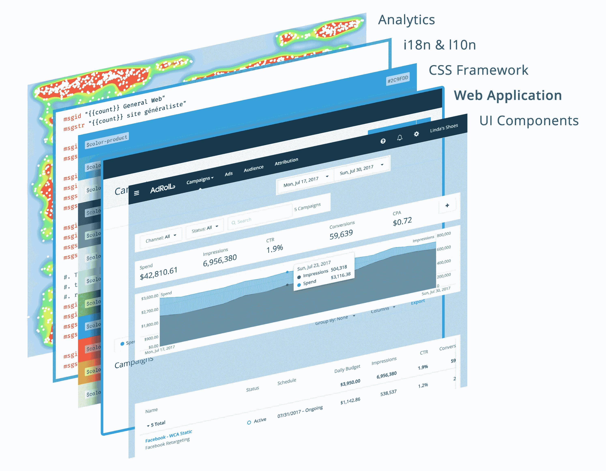
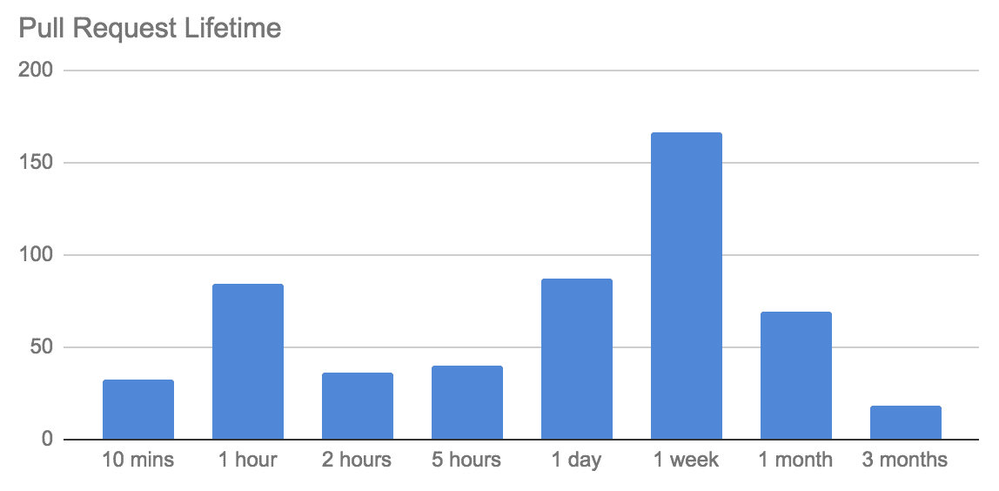
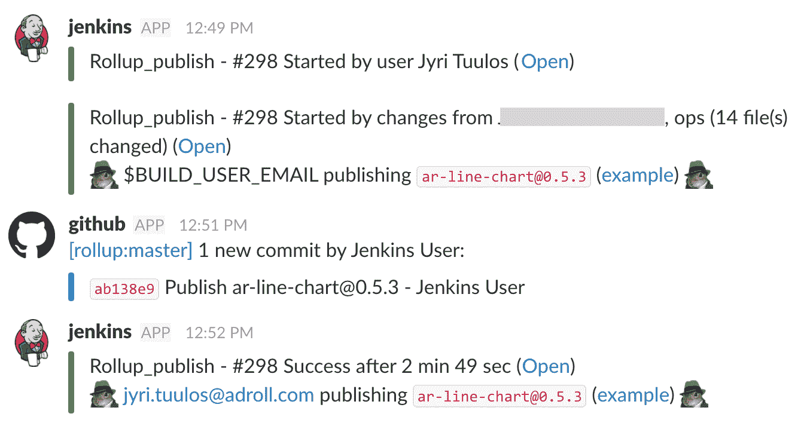
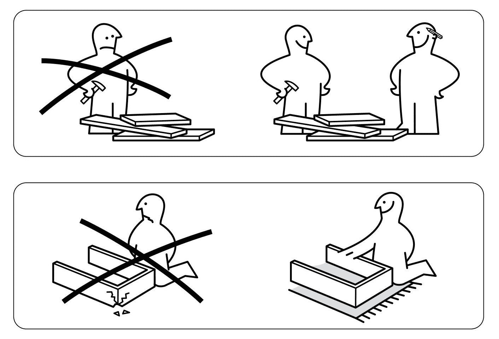
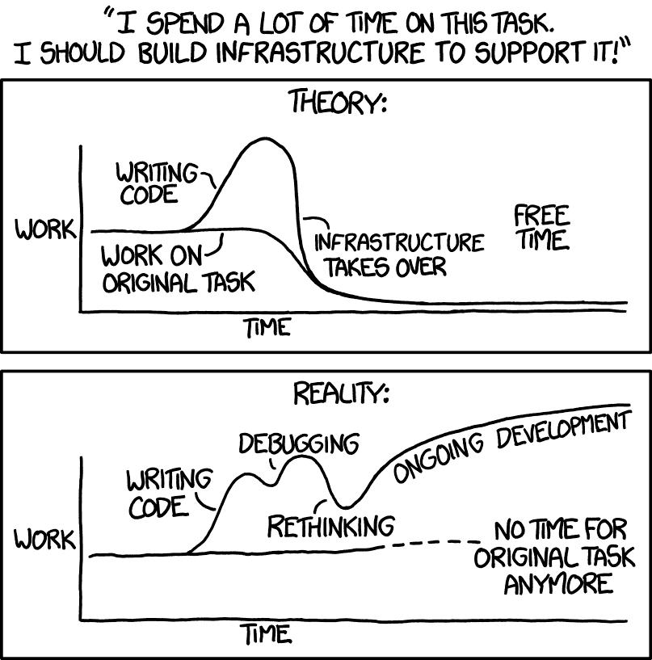

# 如何运营前端基础架构团队- NextRoll

> 原文：<http://tech.adroll.com/blog/frontend/2017/08/29/how-to-run-a-front-end-infrastructure-team.html?utm_source=wanqu.co&utm_campaign=Wanqu+Daily&utm_medium=website>

## 如何管理前端基础设施团队

由...所写

Jyri Tuulos

，2017 年 8 月 29 日

在过去的几年里，AdRoll 已经从一个围绕单一功能建立的不起眼的初创公司成长为一个拥有[多样化产品套件](https://www.adroll.com/product)的全球营销平台。随着公司的发展，我们投入了大量的工作来为用户界面开发构建一个坚实的基础设施。在本帖中，我们将讨论在多个工程团队之间共享的前端项目的人的方面。

Every web application at AdRoll relies on multiple layers of front-end infrastructure

我们当前的前端基础设施由 [UI 组件](/blog/frontend/2015/11/05/rollup-shared-ui-components.html)、一个 [UX 模式库](https://medium.com/adroll-design/the-journey-to-design-consistency-ee26bef2fd88)和各种用于国际化(i18n)、分析和 A/B 测试的 JavaScript 包组成。我们认为所有这些项目都是“内部开源”的。这意味着我们鼓励我们的工程师将对这些项目的贡献作为一种跨团队边界共享知识的方式。最终，我们相信[利用更广泛的想法会使软件更加健壮](https://en.wikipedia.org/wiki/The_Cathedral_and_the_Bazaar)。

如果我们的一个垂直产品团队想要提议对基础设施进行更改，他们需要从可能会受到影响的其他团队那里收集反馈。在最简单的情况下，这可能意味着通过属性使 UI 组件中的样式可自定义。在更高级的情况下，这可能意味着构建一个全新的共享库(比如 API 客户端),以从其他工程团队中抽象出复杂性。

虽然这个模型允许每个团队构建他们需要的精确的解决方案，但是让那些唯一的目的是考虑所有东西如何组合在一起的人也很重要。如果没有适当的所有权和监督，共享基础架构往往会变成一堆复杂的补丁，看起来更像是一个瓶颈，而不是一个有用的工具。

## 前端核心团队

自 2015 年以来，我们构建的每个新产品和内部工具都被实现为[微服务](https://en.wikipedia.org/wiki/Microservices)。这种松散耦合的架构让我们能够更快地迭代新功能，但它也分散了我们的 UI 开发方法。最初，一组高级工程师能够为我们当前的前端基础架构构建一个基础，但仍然不清楚谁应该作为确定任务优先级和分类问题的第一联系人。

2016 年，我们成立了一个名为 Frontend Core 的团队，正式确定了我们维护前端基础架构的方法。今天，这个团队与我们的前端工程师、UI 设计师和产品负责人密切合作，以确保我们的 web 应用程序在所有团队中构建一致。最重要的是，前端核心团队监督和维护我们所有的协作前端项目。

这篇文章的其余部分涵盖了由我们的前端核心团队在五个部分提出的 UI 开发指南。每一节都解释了我们处理该主题的一般方法，并提供了在其他组织中采用类似做法的实用技巧列表:

## 消除迭代的瓶颈

随着基础设施项目变得越来越复杂，越来越多的团队依赖于它们，在不破坏现有功能的情况下进行更改变得越来越困难。考虑到这一点，我们一直在围绕我们的前端基础设施简化开发工作流程。我们的最终目标是让我们的共享项目成为一种工作乐趣，这样更多的人会采用它们并不断改进。

自 2016 年初以来，我们已经有 47 个内部参与者对我们的前端基础架构进行了更改，产生了超过 500 个拉取请求。每个变化都经过了代码审查和一套自动化测试，以防止意想不到的副作用。我们的前端核心团队密切关注开放拉取请求，并确保它们尽快得到审查。

为了度量流程中的改进，我们还收集了一段时间内拉请求生命周期的统计数据。下面的图表显示了代码审查的典型双峰分布:大多数变更需要大约一周的时间来审查，但是有一部分快速变更(比如产品补丁)在打开 pull 请求的一个小时内部署。

To get charts like this for your GitHub project, we recommend checking out [this open source tool](https://github.com/pgjones/push-pull)

以下是如何消除 UI 开发过程中的常见瓶颈:

*   让简单的改变变得快速，让复杂的改变变得可能。生产问题通常可以通过 UI 更改来缓解，因此请确保尽快审查和发布补丁。鼓励在实际编程工作之前讨论大的变化。
*   考虑在 monorepo 中捆绑相似的 JavaScript 包。与完全独立的项目相比，单个代码库允许包共享构建工具和测试脚本，并且开销更少。见[巴别塔](https://github.com/babel/babel/blob/19c4dd2d8c99b909b02ccca27de7b0b32eb416ea/doc/design/monorepo.md)的一个流行的例子和[勒纳](https://github.com/lerna/lerna)的一个预先存在的工具包。
*   对 GitHub 项目使用[拉请求模板](https://help.github.com/articles/creating-a-pull-request-template-for-your-repository/)和[代码所有者文件](https://help.github.com/articles/about-codeowners/)。PR 模板应该包括一个通常被忽视的 UI 开发方面的清单，比如可重用性、可翻译性和风格一致性。使用代码评审作为在 UI 团队之间传递知识的一种方式。
*   **为功能分支设置临时部署。**拥有一个现场演示意味着评审者不必总是在本地运行代码。 [Storybook](https://storybook.js.org/) 是为 React 组件构建演示的优秀工具。
*   **不要过度优化。**想知道应该花多少时间来改进常见任务？ [XKCD 有答案](https://xkcd.com/1205/)。

## 跨越团队界限进行沟通

内部开源项目在宣布新特性和突破性变化时非常依赖沟通。基础设施团队最重要的角色之一是共享上下文，并充当参与者之间的中继。

在 AdRoll，前端核心团队每两周与我们所有产品团队的工程师和设计师举行一次会议。在会议中，团队分享他们正在进行的任何重大前端更改的更新，即使这些更改不会直接影响我们的基础架构。事实证明，像这样的定期会议对于确定团队之间令人惊讶的联系非常有用。

当一个团队提到他们正在开发一个新特性时，另一个团队可能会提到他们已经有了一个解决方案。在其他情况下，我们已经确定了基础架构中每个人都感觉到但还没有人解决的痛点。这些讨论通常会在我们的前端核心 backlog 或开发过程的更新中产生新的标签。

围绕前端基础设施的对话可能具有挑战性，因为 UI 开发涉及如此多不同的专业。设计师、工程师和产品经理经常根据他们的背景对同样的事情使用不同的词语(例如“下拉菜单”和“选择输入”)。对于单个开发人员来说，获得对他们可用的所有资源(例如，全局颜色变量和 CSS 类)的高级概述也可能是困难的。

为了建立一种通用的概念语言并帮助发现，我们建立了一个 [UX 模式库](http://ux.adroll.com/)并作为资源在公司内外发布。为了补充模式库，我们还有一个内部网站，列出了我们所有的 UI 组件，并让开发人员比较多个版本的功能(见下面的视频)。这些网站允许公司中的每个人都可以全面了解我们的前端基础设施，并在引用特定的 UI 元素时使用显式 URL。

<iframe class="youtube-embed" src="http://www.youtube.com/embed/enZuX4RuSB8" frameborder="0" allowfullscreen="">视频</iframe>

Our internal site for demoing shared UI components, built using the [AWS JavaScript S3 Explorer](https://github.com/awslabs/aws-js-s3-explorer)

以下是一些改善基础设施沟通的方法:

*   **为前端基础设施设立专门的讨论通道。**公共松弛频道或电子邮件列表很好地实现了这个目的。如有必要，为紧急问题建立一个单独的支持渠道。
*   尽可能进行视觉交流。截图、截屏和现场演示抵得上一千条聊天消息。
*   **发布共享包时使用[语义版本](http://semver.org/)。**正确的版本管理有助于在工程团队之间建立信任。从突破性变化、新特性和错误修复的角度来考虑，对于影响面向用户功能的更新来说，这是一个有用的框架。
*   帮助团队完成突破性的变革。在内部开源项目中，你可以直接与每个用户沟通。通过支持升级组件的团队，尽最大努力减少破坏性更改带来的痛苦。
*   对反馈和建议持开放态度。基础设施是你的产品，工程师是你的用户。鼓励新工程师质疑技术选择，提出新想法。

## 寻找常见问题和解决方案

即使有开放和积极的沟通渠道，痛点也不总是以明确的方式出现。当你的一个同事面临一个问题时，他们可能没有意识到这是其他人的共同问题。一个优秀的前端基础设施维护者能够将围绕 UI 开发的喋喋不休提炼为清晰的问题陈述，并致力于最常见问题的解决方案。

从基础设施的角度来看，以下是一些典型的信息及其含义:

> *   我希望我们有…
> *   *既然我们没有 X，我们就不能……*
> *   *我一直想建造…*
> *   我们支持 X 了吗？
> 
> 类似这样的消息可能是基础设施不支持某些用例的标志。联系个人或团队，了解背景，看看他们是否能成为贡献者。
> 
> *   *我看到这个错误是因为……*
> *   *你怎么跑……*
> *   *我想不出 X*
> *   你知道我做错了什么吗？
> 
> 当人们提到错误或寻求帮助时，这可能是一个真正的错误，或者是项目没有被很好地记录的迹象。帮助这个人解决问题，看看你以后如何更新项目中的说明。
> 
> *   *它花了很长时间，所以我……*
> *   *X 太简单了，所以我不得不…*
> *   *我不能使用那个选项，所以……*
> *   *这是 hacky 但是……*
> 
> 软件工程师以解决问题为荣。当人们提到 hacky 解决方案时请注意，并相应地改进基础设施。随着时间的推移，官方解决方案比特定于应用程序的黑客更容易维护。
> 
> *   *哦，我忘了再次运行测试*
> *   乔，你能部署一下吗？
> *   *我在等泰德……*
> *   你认为他们准备好合并了吗？
> 
> 围绕内部开源项目的程序性讨论可能是一个迹象，表明开发过程并没有尽可能地简化。考虑自动化测试，培训更多的人担任维护人员。

随着时间的推移，维护人员应该尽可能地自动化他们项目的日常任务，这样他们就可以专注于长期的改进。不能自动化的任务应该被很好地记录下来，这样它们就很容易被重复。例如，当审查我们的共享 UI 组件的变化时，我们总是注意全局名称空间的变化——CSS 类、全局 [SASS](http://sass-lang.com/) 变量和 [Redux](http://redux.js.org/) 动作。

文档和指导也可以自动化:不要让人们去查阅像维基页面这样的静态文档，而是设计一个开发工作流程，给用户足够的指导，让他们可以自己解决问题。React 的错误代码系统是自我文档化软件的一个很好的例子:如果开发人员做错了什么，该库本身会警告他们，并指引他们到一个有用的文档页面。

保持基础设施稳定的最有效方法之一是抽象出大多数贡献者不需要修改的代码库部分。这意味着把你的开发工作流程想象成一系列的黑盒。就像您通常不会修改代码编辑器或 web 浏览器的源代码一样，基础设施项目中的贡献者不应该需要修改构建过程或测试工具。

对我们来说，这样的改进之一是自动化我们共享的 UI 组件的发布过程。以前发布一个组件的新版本需要多个手动步骤，只有少数高级工程师拥有运行这些步骤所需的证书。根据每个出版商的当地环境，结果也略有不同。一旦我们将整个过程转移到一个 [Jenkins](https://jenkins.io/%5C) 任务中，我们就可以通过从列表中选择一个组件的名称并输入版本号来发布它。这允许更多的贡献者发布他们自己的变更，并减少了我们前端核心团队的工作量。

Slack notifications from the Jenkins job that publishes our shared UI components

以下是我们构建自文档化项目的一些技巧:

*   使用类型检查来强化代码中的假设。我们共享的 UI 组件大量使用了 [React 属性](https://facebook.github.io/react/docs/typechecking-with-proptypes.html)。我们也在试验[打字稿](https://www.typescriptlang.org/)。
*   对你的代码进行广泛的测试和测试。确保针对每个提议的变更自动运行测试和测试。像 [ESLint](https://eslint.org/) 和 [scss-lint](https://github.com/brigade/scss-lint) 这样的 Linters 甚至可以帮助提高应用程序的运行时性能。
*   **在命令行工具中记录指令和后续步骤。**例如，当启动开发服务器时，确保本地 URL 显示在控制台输出中。
*   从构建系统发送通知。如果贡献者破坏了构建或部署，应该通知他们。维护人员应该抄送给他们，这样他们就可以发现重复出现的问题。
*   编写可操作的错误信息。不要指望所有人都熟悉最新的前端工具。内部服务中的错误页面应该为用户提供调试问题的方法。

## 降低成功的门槛

UI 开发的成功不仅仅意味着让最终用户获得新的功能，还意味着新的功能必须与产品中的其他功能无缝融合。UI 开发中的糟糕实践会直接导致糟糕的用户体验。这给前端工程师带来了很大的压力，迫使他们在公司生命周期中比面向后端的同事更早考虑共享基础架构。

当一名工程师在现有基础设施的基础上构建一些东西时，他们应该感觉自己站在巨人的肩膀上，就像他们可以实现他们不知道自己可以实现的东西。前端基础设施应该使每个工程师能够构建美观、用户友好的功能，并且可以轻松地进行测试、监控和部署。

为了保持有用性，基础设施必须与公司一起成长。根据我们的经验，保证一个项目长期存在的最好方法是关注开发人员的参与。这就是为什么我们相信开源过程与软件基础设施如此匹配:当人们知道他们参与了一个项目的建设时，他们更有可能关心它(也被称为[宜家效应](https://en.wikipedia.org/wiki/IKEA_effect))。

IKEA helps people succeed with their famous assembly instructions

以下是让开发人员参与协作项目的方法:

*   决策要透明。你的工程师同事应该知道为什么某样东西是这样建造的，为什么你选择了某种技术而不是另一种。
*   帮助人们更多地了解基础设施及其使用方式。鼓励人们阅读设计文档和源代码。开放使用指标和网站分析。
*   确保维护人员和其他人一样遵循同样的指导方针。没有人应该凌驾于代码审查或测试指南之上。当不得不做出例外时，要公开其背后的原因。
*   突出个人层面的成就。庆祝首次做出前端贡献的工程师获胜。让人们通过演示和截屏在会议上展示他们自己的作品。
*   让别人来领导和承担责任。拥有值得信任的贡献者是扩展开发流程的必要条件。将专门化 UI 组件的所有权委托给构建它们的团队。

## 继续实验

我们所了解的关于前端基础设施的几乎一切都是受控实验的结果。我们在开发过程中不断尝试新的有前途的技术和改进。每当我们发现解决同一个问题的不同方法时，我们会尝试最有希望的方法，并在之后回顾结果。

最好记住，即使最好的基础设施也会有一些开销。每一段共享代码最终都会中断或过时。实验心态的一个重要部分是质疑你所做的选择，并知道什么时候标准化不是正确的方法。

Adapted from [XKCD #1319 "Automation"](https://xkcd.com/1319/)

我们正在进行的前端基础架构实验包括:

*   用 Webpack 代替 Browserify 和 Gulp 作为标准的前端构建过程
*   将 [Redux](http://redux.js.org/) 动作集成到我们共享的 React 组件中
*   扩展我们的[公共风格指南](http://ux.adroll.com/)
*   使用定制的 JavaScript 库统一使用分析、异常跟踪和 A/B 测试
*   用酶标准化整合测试(正如[在 7 月 13 日 ReactJS SF 会议上介绍的](https://speakerdeck.com/jessicagrist/redux-apps-with-enzyme)
*   为引导 web 应用程序构建一个约曼生成器
*   在我们共享的 UI 组件库中使用[故事书](https://storybook.js.org/)进行现场演示

* * *

感谢阅读！我们希望这篇文章对那些希望改进 UI 开发过程的人有所帮助。如果您想了解更多关于特定主题的信息或分享您在维护前端基础设施方面的经验，请在下面发表评论。

PS: [我们正在招聘](https://www.adroll.com/about/careers)远程和本地工程师！