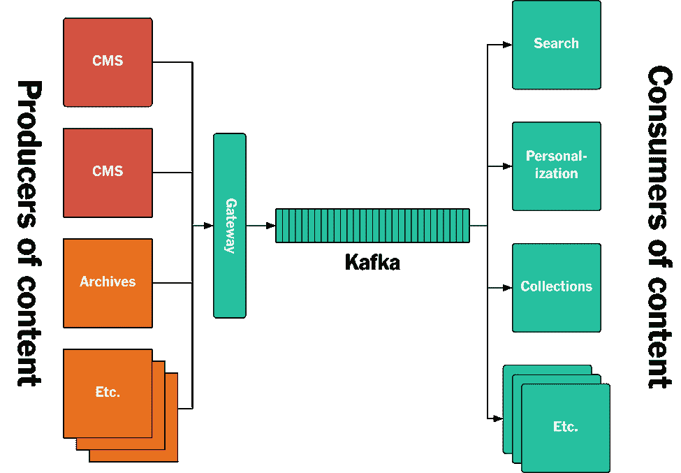
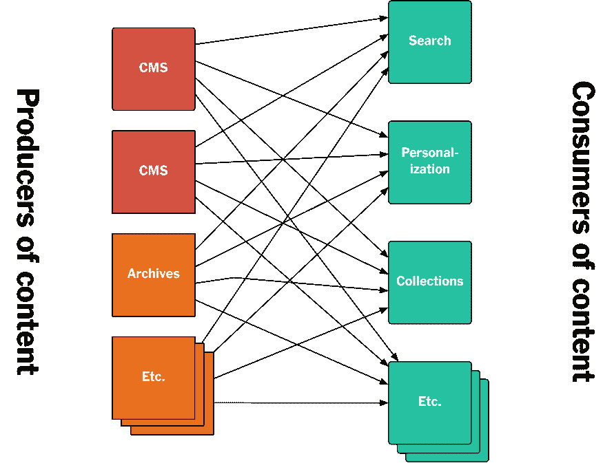
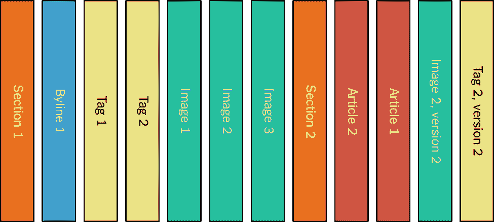
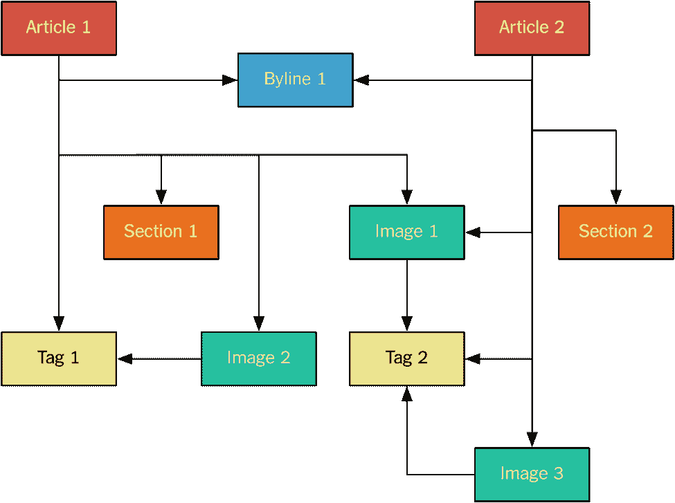
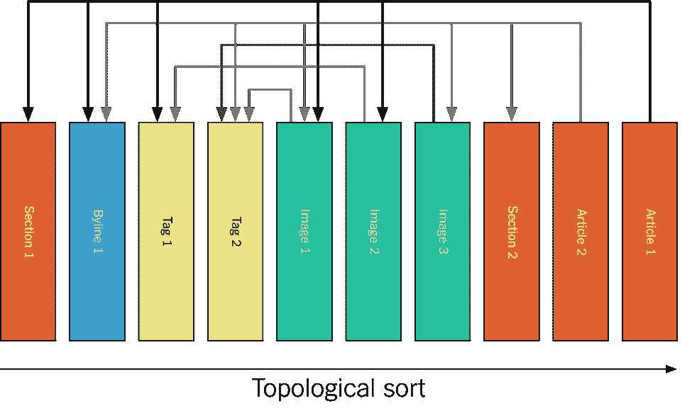
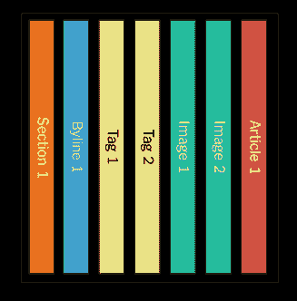
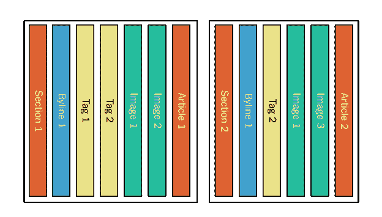
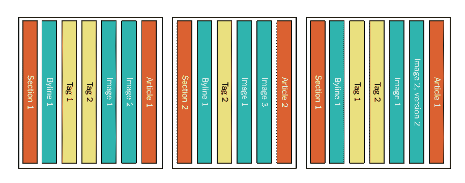
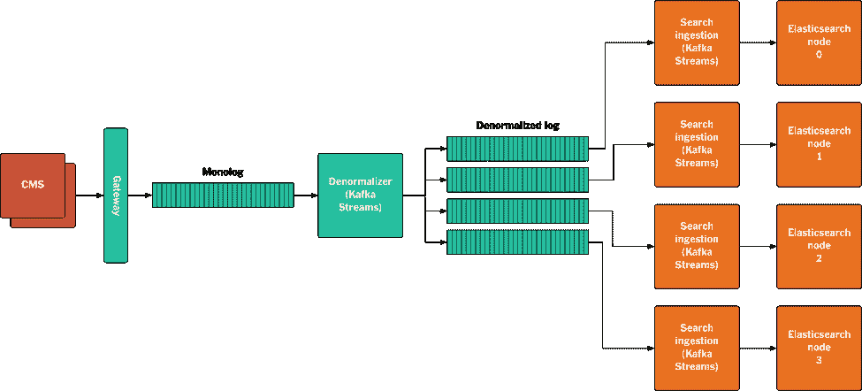
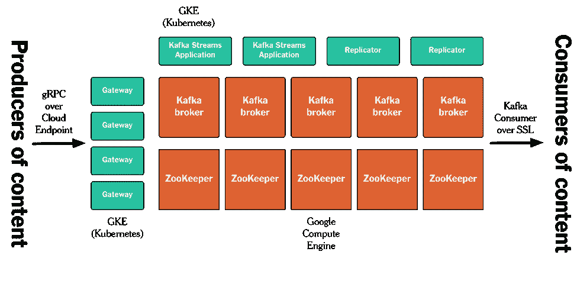

# 与阿帕奇·卡夫卡一起在《纽约时报》出版

> 原文：<https://www.confluent.io/blog/publishing-apache-kafka-new-york-times/?utm_source=wanqu.co&utm_campaign=Wanqu+Daily&utm_medium=website>

《纽约时报》有许多不同的系统用于制作内容。我们有几个内容管理系统，我们使用第三方数据和有线新闻。此外，鉴于 161 年的新闻业历史和 21 年的在线内容发布历史，我们有大量的内容存档，这些内容仍然需要在线提供，需要可搜索，并且通常需要可供不同的服务和应用程序使用。

这些都是我们所谓的*发布内容*的来源。这是已经写好、编辑过的内容，被认为是可供公众消费的。

另一方面，我们有各种各样的服务和应用程序需要访问这些发布的内容——有搜索引擎、个性化服务、feed 生成器，以及所有不同的前端应用程序，如网站和原生应用程序。无论何时发布资产，它都应该以非常低的延迟对所有这些系统可用——毕竟这是新闻——并且没有数据丢失。

本文描述了我们开发的一种新方法来解决这一问题，该方法基于 Apache Kafka 支持的基于日志的架构。我们称之为*出版管道*。本文的重点将放在后端系统上。具体来说，我们将介绍 Kafka 如何用于存储《纽约时报》发表的所有文章，以及 Kafka 和 Streams API 如何用于将发布的内容实时提供给各种应用程序和系统，使其可供我们的读者使用。下图总结了新的架构，我们将在本文的剩余部分深入研究该架构。

****T4】**

图 1:新的基于纽约时报日志/卡夫卡的出版架构。

### 基于 API 的方法的问题是

需要访问已发布内容的不同后端系统具有非常不同的需求:

*   我们有一项为网站和本地应用程序提供实时内容的服务。该服务需要在资产发布后立即使其可用，但是它只需要每个资产的最新版本。
*   我们有不同的服务提供内容列表。这些列表有些是手动整理的，有些是基于查询的。对于基于查询的列表，每当发布与查询匹配的资产时，对该列表的请求需要包括新的资产。类似地，如果发布的更新导致资产不再匹配查询，那么应该从列表中删除它。我们还必须支持对查询本身的更改，以及新列表的创建，这需要访问以前发布的内容来(重新)生成列表。
*   我们有一个支持网站搜索的弹性搜索集群。在这里，延迟要求不太严格——如果在资产发布后一两分钟，搜索才能找到它，这通常不是什么大问题。然而，搜索引擎需要方便地访问以前发布的内容，因为每当 Elasticsearch 模式定义改变时，或者当我们改变搜索接收管道时，我们都需要重新索引所有内容。
*   我们的个性化系统只关心最近的内容，但是当个性化算法改变时，需要重新处理这些内容。

我们之前让所有不同的消费者访问已发布内容的方法包括构建 API。内容的生产者将提供用于访问该内容的 API，以及您可以订阅的用于发布新资产的通知的提要。其他后端系统，即内容的消费者，将调用这些 API 来获取他们需要的内容。

图 2:我们以前的基于 API 的架构的草图，它已经被本文中描述的新的基于 log/Kafka 的架构所取代。

这种方法，一种相当典型的基于 API 的架构，有许多问题。

由于不同的 API 是由不同的团队在不同的时间开发的，它们通常以截然不同的方式工作。可用的实际端点是不同的，它们有不同的语义，并且它们接受不同的参数。当然，这是可以解决的，但是这需要许多团队之间的协调。

更重要的是，他们都有自己隐式定义的模式。一个 CMS 中的字段名不同于另一个 CMS 中的相同字段名，相同的字段名在不同的系统中可能有不同的含义。

这意味着每个需要访问内容的系统都必须知道所有这些不同的 API 和它们的特性，然后它们需要处理不同模式之间的标准化。

另一个问题是很难访问以前发布的内容。大多数系统都没有提供一种高效地传输内容归档的方法，而且它们用于存储的数据库也不支持这种方法(下一节将详细介绍)。即使您有一个所有已发布资产的列表，进行一个单独的 API 调用来检索每个单独的资产也会花费很长时间，并且会给 API 带来很多不可预知的负载。

### 基于日志的架构

本文描述的解决方案使用基于日志的架构。这是一个由 Martin Kleppmann 在*用 Apache Samza*[【1】](#_ftn1)*设计数据密集型应用*[【2】](#_ftn2)中首次提出的想法。日志作为一种通用数据结构包含在*日志:每个软件工程师都应该知道的实时数据的统一抽象[【3】](#_ftn3)*中。在我们的例子中，日志是 Kafka，所有发布的内容都按照时间顺序附加到 Kafka 主题中。其他服务通过使用日志来访问它。

传统上，数据库被用作许多系统的事实来源。尽管有很多明显的好处，但从长远来看，数据库可能很难管理。首先，更改数据库的模式通常很棘手。添加和删除字段并不太难，但是如果不停机，更基本的模式更改可能很难组织。一个更深层次的问题是数据库变得难以替代。大多数数据库系统没有很好的 API 来支持流更改；您可以拍摄快照，但它们会立即过时。这意味着也很难创建衍生商店，比如我们用来在 nytimes.com 和原生应用中进行网站搜索的搜索索引——这些索引需要包含曾经发布的每一篇文章，同时还需要随着新内容的发布而更新。解决方法通常是客户端同时写入多个存储，当其中一个写入成功而另一个失败时，会导致一致性问题。

正因为如此，数据库，作为 state 的长期维护者，往往最终成为复杂的整体，试图成为每个人的一切。

基于日志的架构通过让日志成为事实的来源来解决这个问题。数据库通常存储某个事件的结果，而日志存储事件本身，因此日志成为系统中发生的所有事件的有序表示。使用此日志，您可以创建任意数量的自定义数据存储。这些存储成为日志的物化视图(T2)——它们包含派生的内容，而不是原始的内容。如果您想要更改这种数据存储中的模式，您可以创建一个新的模式，让它从头开始使用日志，直到它跟上，然后丢弃旧的模式。

有了日志作为事实的来源，不再需要所有系统都必须使用的单一数据库。相反，每个系统都可以创建自己的数据存储(数据库)——自己的物化视图——以对该系统最有用的形式只表示它需要的数据。这极大地简化了数据库在体系结构中的角色，并使它们更适合每个应用程序的需要。

此外，基于日志的架构简化了内容流的访问。在传统的数据存储中，访问完全转储(即作为快照)和访问“实时”数据(即作为馈送)是不同的操作方式。使用日志的一个重要方面是这种区别消失了。您在某个特定的偏移量开始使用日志——这可以是开始、结束或中间的任何点——然后继续下去。这意味着，如果您想要重新创建一个数据存储，您只需在一开始就开始使用日志。在某些时候，您将赶上实时流量，但这对日志的消费者是透明的。

因此，日志消费者“总是在重播”。

在部署系统时，基于日志的架构也提供了很多好处。在部署到虚拟机时，无状态服务的不可变部署一直是一种常见的做法。通过从头开始重新部署一个新的实例，而不是修改一个正在运行的实例，一大类问题就迎刃而解了。有了日志作为事实的来源，我们现在可以进行有状态系统的不可变部署。因为任何数据存储都可以从日志中重新创建，所以我们可以在每次部署更改时从头开始创建它们，而不是就地更改——本文后面给出了一个实际的例子。

### 为什么谷歌 PubSub 或者 AWS SNS/SQS/Kinesis 对这个问题不起作用

Apache Kafka 通常用于解决两种截然不同的用例。

到目前为止，最常见的是 Apache Kafka 被用作消息代理。这可以涵盖分析和数据集成两种情况。可以说 Kafka 在这方面有很多优势，但是像 [Google Pub/Sub](https://cloud.google.com/pubsub/docs/overview) 、 [AWS SNS](https://aws.amazon.com/sns/) / [AWS SQS](https://aws.amazon.com/sqs/) 和 [AWS Kinesis](https://aws.amazon.com/kinesis/) 这样的服务有其他方法来解决同样的问题。这些服务都允许多个消费者订阅由多个生产者发布的消息，跟踪他们已经看到和没有看到的消息，并在没有数据丢失的情况下妥善处理消费者停机时间。对于这些用例，Kafka 是一个日志的事实是一个实现细节。

像本文中描述的基于日志的架构是不同的。在这些情况下，日志不是实现细节，而是核心特性。这些要求与其他服务提供的非常不同:

1.  我们需要日志来永久保留所有事件，否则不可能从头重新创建数据存储。
2.  我们需要订购原木消耗量。有因果关系的事件如果处理顺序不对，结果就会是错误的。

只有卡夫卡同时支持这两个要求。

### 独白

独白是我们发布内容的新的真实来源。每一个创建内容的系统，当它准备好发布的时候，会把它写到独白，在那里它被附加到结尾。实际的写入是通过网关服务进行的，它验证发布的资产是否符合我们的模式。

图 3:独白，包含了《纽约时报》发表过的所有资产。

独白包含了自 1851 年以来出版的所有资产。它们完全是根据出版时间排序的。这意味着消费者可以选择想要开始消费的时间点。需要所有内容的消费者可以在时间开始时(即，在 1851 年)开始，其他消费者可能只想要未来的更新，或者在两者之间的某个时间。

例如，我们有一个提供内容列表的服务——由特定作者发布的所有资产，应该放在科学部分的所有内容，等等。这个服务在一开始就开始使用 Monolog，并构建这些列表的内部表示，准备好根据请求提供服务。我们还有另一个服务，它只提供最新发布的资产列表。这个服务不需要自己的永久存储:相反，它只是在启动时在日志上回溯几个小时，并在那里开始消费，同时在内存中维护一个列表。

资产以规范化的形式发布到独白，也就是说，每个独立的内容片段都作为单独的消息写入 Kafka。例如，图像独立于文章，因为几篇文章可能包含相同的图像。

图中举例:

*图 4:标准化资产。*

这非常类似于关系数据库中的规范化模型，在资产之间存在多对多的关系。

在这个例子中，我们有两篇引用其他资产的文章。例如，署名是分开发表的，然后被两篇文章引用。所有资产都使用形式为*nyt://article/577d 0341-9a0a-46df-b454-ea 0718026d 30*的 URIs 进行识别。我们有一个本地资产浏览器，它(使用操作系统级别的方案处理程序)让我们点击这些 URIs，以 JSON 形式查看资产，并跟踪引用。资产本身作为 [protobuf](https://github.com/google/protobuf) 二进制文件发布给独白。

在 Apache Kafka 中，独白被实现为单分区主题。它是单分区的，因为我们希望保持总排序，具体来说，我们希望确保当您使用日志时，您总是在资产进行引用之前看到被引用的资产。这确保了顶级资产的内部一致性——如果我们在添加引用图像的文本的同时向文章添加图像，我们不希望在图像出现之前看到对文章的更改。

以上意味着资产实际上被发布到拓扑排序的日志中。对于上面的例子，它看起来是这样的:

*图 5:发布顺序中的标准化资产。*

作为日志消费者，您可以轻松地构建日志的物化视图，因为您知道引用的资产版本始终是您在日志中看到的该资产的最后版本。

因为这个主题是单分区的，所以由于 Kafka 存储分区的方式，它需要存储在单个磁盘上。这在实践中对我们来说不是问题，因为我们所有的内容都是由人类产生的文本——我们现在的总语料库不到 100GB，磁盘增长的速度超过了我们的记者可以写的速度。

### 非规范化的日志和卡夫卡的流 API

对于想要标准化数据视图的消费者来说，独白非常有用。对于一些消费者来说，情况并非如此。例如，为了索引 [Elasticsearch](https://www.elastic.co/products/elasticsearch) 中的数据，您需要一个非规范化的数据视图，因为 Elasticsearch 不支持对象之间的多对多关系。如果您希望能够通过匹配图像标题来搜索文章，那么这些图像标题必须在文章对象中表示。

为了支持这种数据视图，我们还有一个非规范化日志。在非规范化日志中，组成顶级资产的所有组件一起发布。对于上面的例子，当文章 1 发布时，我们向非规范化日志写入一条消息，在一条消息中包含文章及其所有依赖项:

 *图 6:发布* *后的反规格化日志第一篇* *。***T11】**

为 Elasticsearch 提供信息的 Kafka 消费者只需从日志中挑选出这条信息，将资产重组为所需的形状，然后推送至索引。当发布第 2 篇文章时，所有的依赖项再次被捆绑，包括那些已经为第 1 篇文章发布的依赖项:

 *图 7:发布* *后的反规范化日志第二篇*。

如果一个依赖关系被更新，整个资产将被重新发布。例如，如果图像 2 被更新，文章 1 的所有内容将再次被记录:

 *图 8:更新* *图像 2 * *后的反规格化日志，用于* *文章 1* 。

被称为*反规格化器*的组件实际上创建了反规格化日志。

反规格化器是一个 Java 应用程序，它使用了 Kafka 的 Streams API 。它使用独白，并维护每个资产的最新版本的本地存储，以及对该资产的引用。当发布资产时，该存储会不断更新。当发布顶级资产时，反规范化器从本地存储中收集该资产的所有依赖关系，并将其作为一个包写入反规范化日志。如果发布了由顶级资产引用的资产，则反规范化器会重新发布所有将其作为依赖项引用的顶级资产。

由于该日志被反规格化，它不再需要全排序。我们现在只需要确保同一个顶级资产的不同版本以正确的顺序出现。这意味着我们可以使用分区日志，并让多个客户端并行使用日志。我们使用 Kafka Streams 来实现这一点，并且从非规范化日志中读取的应用程序实例的数量能够让我们非常快速地重放我们的整个发布历史—下一节将展示一个这样的示例。

### 弹性搜索示例

下面的草图展示了后端搜索服务的端到端设置。如上所述，我们使用 Elasticsearch 来支持在[NYTimes.com](https://www.nytimes.com/):的站点搜索

*图 9:显示发布的资产如何通过系统从 CMS 流向 Elasticsearch 的示意图。*

数据流程如下:

*   资产由 CMS 发布或更新。
*   资产作为 protobuf 二进制文件写入网关。
*   网关验证资产，并将其写入独白。
*   反规格化器消耗独白中的资源。如果这是一个顶级资产，它将从其本地存储中收集所有依赖项，并将它们一起写入非规范化日志。如果该资产是其他顶级资产的依赖项，则所有这些顶级资产都将被写入非规范化日志。
*   Kafka partitioner 根据顶级资产的 URI 将资产分配给分区。
*   搜索摄取节点都运行一个使用 Kafka 流来访问非规范化日志的应用程序。每个节点读取一个分区，创建我们想要在 Elasticsearch 中索引的 JSON 对象，并将其写入特定的 Elasticsearch 节点。在重放过程中，我们关闭了 Elasticsearch 复制，以加快索引速度。当我们在新索引上线之前赶上实时流量时，我们会重新打开复制。

### 履行

这个发布管道运行在[谷歌云平台/GCP](https://cloud.google.com) 上。我们设置的细节超出了本文的范围，但是高级架构看起来像下面的草图。我们在 [GCP 计算机](https://cloud.google.com/compute/docs/)实例上运行卡夫卡和动物园管理员。所有其他进程网关、所有 Kafka 复制器、用 Kafka 的 Streams API 构建的反规格化器应用程序等等。—在 [GKE](https://cloud.google.com/container-engine/) / [库伯内特](https://kubernetes.io)的容器中运行。我们使用 [gRPC](https://grpc.io) / [云端点](https://cloud.google.com/endpoints/)作为我们的 API，并使用相互 SSL 认证/授权来保证 Kafka 本身的安全。

 *图 10:在 Google 云平台上的实现。*

### 结论

我们已经为这个新的出版架构工作了一年多。我们现在处于生产阶段，但仍处于早期阶段，我们有许多系统仍需要转移到发布渠道。

我们已经看到了很多优势。事实上，所有的内容都通过相同的管道，这简化了我们的软件开发过程，包括前端应用程序和后端系统。部署也变得更加简单——例如，当我们对分析器或模式进行更改时，我们现在开始对新的 Elasticsearch 索引进行完整重放，而不是尝试对实时索引进行适当的更改，我们发现这很容易出错。此外，我们还在构建一个更好的系统来监控发布的资产如何通过堆栈。通过网关发布的所有资产都被分配了一个唯一的消息 ID，该 ID 被提供给发布者，并通过 Kafka 传递给消费应用程序，使我们能够跟踪和监控每个系统处理每个更新的时间，一直到最终用户应用程序。这对于跟踪性能和在出现问题时查明问题都很有用。

最后，这是一种构建应用程序的新方式，对于习惯于使用数据库和传统发布/子模型的开发人员来说，这需要思想上的转变。为了充分利用这种设置，我们需要以这样一种方式构建应用程序，即易于部署使用 replay 来重新创建日志的物化视图的新实例，我们正在努力提供工具和基础结构来简化这一过程。

*我要感谢 Martin Kleppmann、Michael Noll 和 Mike Kaminski 对这篇文章的评论。*T3】

### 关于阿帕奇卡夫卡的流 API

如果你喜欢这篇文章，你可能想继续阅读下面的资源来学习更多关于 Apache Kafka 的 Streams API:

————————————————————————————————————————————–

[【1】](#_ftnref1)[用 Apache Samza-Martin Kleppmann](https://martin.kleppmann.com/2015/03/04/turning-the-database-inside-out.html)把数据库翻个底朝天 2015 年 3 月 4 日。访问时间为 2017 年 7 月 14 日。
[【2】](#_ftnref2)[设计数据密集型应用](http://dataintensive.net/)访问时间为 2017 年 7 月 14 日。
[【3】](#_ftnref3)[《日志:每个软件工程师都应该知道的实时知识](https://engineering.linkedin.com/distributed-systems/log-what-every-software-engineer-should-know-about-real-time-datas-unifying)……》2013 年 12 月 16 日。访问时间为 2017 年 7 月 14 日。