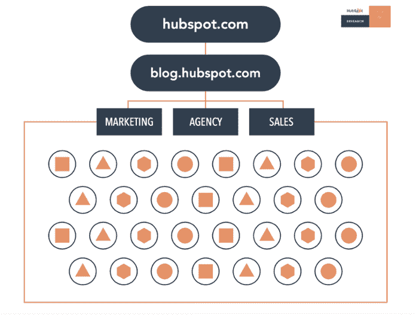
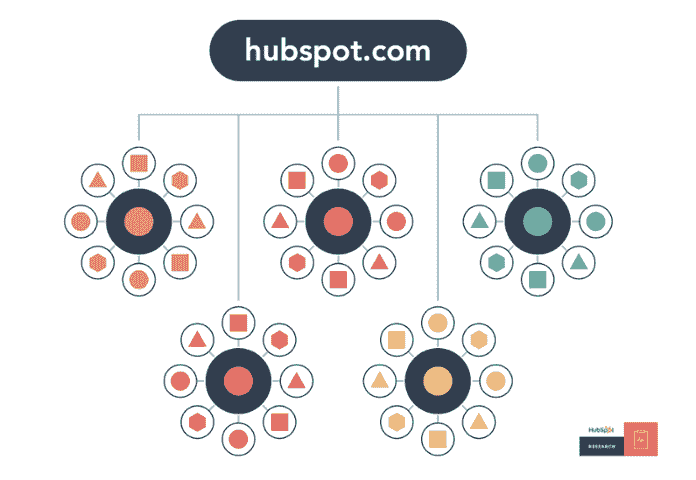
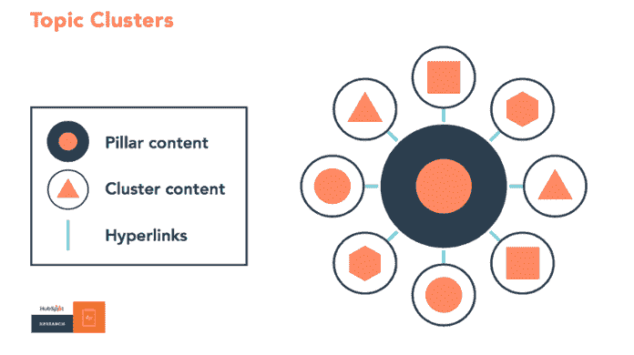
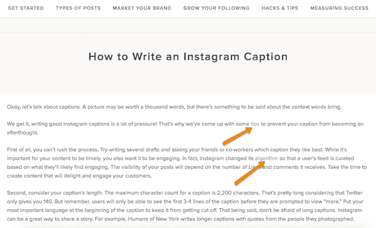

# 什么是支柱页？(以及为什么它对你的 SEO 策略很重要)

> 原文：<https://blog.hubspot.com/marketing/what-is-a-pillar-page?utm_source=wanqu.co&utm_campaign=Wanqu+Daily&utm_medium=website>

 就在你以为自己懂 SEO 的时候...搜索已更改。又来了。

“理解”是个很强烈的词。搜索引擎算法变化如此之快，很难跟上优化你的博客在 SERPs 的第一页排名的最佳策略。但是这个变化是一个大问题，所以抓住你的关键词。

人类搜索行为已经改变，用于解释和提供搜索结果的技术也发生了变化。优化博客内容以对长尾关键词进行排名不再是在搜索引擎结果中排名的最佳方式——而你的博客架构与此有关。

T6】

在这篇博客文章中，我们将带你了解搜索已经改变的方式，关于主题集群的独家新闻，以及 pillar 页面如何适应这个等式。

## 什么是主题群？

正如我们之前提到的:人们搜索的方式已经改变，反过来，这也开始改变 SEO 和 bloggers 创建内容的方式。这里有一个基本的入门——但是更多细节，请阅读我们最新的关于搜索进化的[研究](https://research.hubspot.com/reports/topic-clusters-seo)和[博客文章](https://blog.hubspot.com/marketing/search-has-changed-content-needs-to-evolve)。

### 人们正在提交更长、更具对话性的搜索查询。

在进入谷歌搜索之前想象一下你自己。如果你想找一个吃寿司的地方，你会搜索“餐馆”，还是搜索“我附近的日本餐馆”？

如果你选择第二个选项，你会成为大多数: [64%的搜索](https://ahrefs.com/blog/long-tail-keywords-research/)是四个词或更多，我们看到越来越多的这种更长形式的对话搜索查询，帮助人们找到他们正在寻找的确切信息。

这部分是由于语音搜索的兴起。在 Siri 和谷歌助手之间， [20%的移动谷歌搜索](http://searchengineland.com/google-reveals-20-percent-queries-voice-queries-249917)是通过语音搜索进行的，由于亚马逊 Echo 和谷歌 Home 设备的崛起，这一比例肯定会上升。

但是语音搜索并不是人们提交更长查询的唯一原因。首先，有大量的内容存在——质量比数量重要得多。人们提交更详细的查询来整理垃圾，更快地获得他们需要的信息。人们也越来越多地浏览内容——通常依靠博客文章的标题或谷歌的特色信息来快速获得问题的简单答案。

搜索引擎在整理成千上万的内容方面变得越来越好，以尽可能提供最好、最准确的结果。接下来会有更多。

### 搜索引擎更善于准确地提供搜索者想要的东西。

谷歌的算法不断发展，为搜索者的查询提供最佳答案。其中一些变化包括惩罚太多不相关的内部链接，将对话查询作为一个整体而不是单独的关键词来解释，以及使用机器学习来提供对特定术语的更准确的解释。

所有这些意味着:谷歌正在帮助搜索者找到尽可能准确的信息——即使这并不完全是他们搜索的内容。例如，如果你搜索“跑鞋”，谷歌现在也会为你提供“运动鞋”的搜索结果这意味着博客作者和 SEO 需要在创建和组织内容方面做得更好，以解决任何可能阻止搜索者从您的网站获得他们需要的信息的差距。

现在，你的网站需要根据不同的主要主题进行组织，关于具体的、对话式的长尾关键词的博客文章彼此超链接，以解决关于特定主题的尽可能多的搜索。进入主题聚类模型。

### 主题聚类帮助更多的网页排名，给搜索者更好的答案。

大多数博客目前的结构(包括我们自己的博客，直到最近)，博客作者和 SEO 一直致力于创建针对特定关键字排名的个人博客帖子。结果是杂乱无章的，用户很难找到他或她需要的确切信息。当你发表多个关于相似主题的博客文章时，也会导致你自己的网址在搜索引擎排名中相互竞争。

下面是我们的博客架构使用这个旧剧本时的样子:

现在，为了在搜索中排名并最好地回答搜索者提交的新类型的查询，解决方案是使用**主题集群模型**:选择您想要排名的广泛主题，然后基于与该主题相关的特定关键字创建内容，所有这些关键字相互链接，以创建更广泛的搜索引擎权威。使用这种模式，这就是我们的博客基础设施现在的样子——特定主题被与该主题相关的博客帖子包围，通过超链接连接到集群中的其他 URL:

这种模式使用一种更为谨慎的网站架构来组织和链接 URL，以帮助您网站上的更多页面在谷歌中排名，并帮助搜索者更容易地找到您网站上的信息。这个架构由三个组件组成——支柱内容、集群内容和超链接:

接下来，我们将深入支柱内容——它代表了博客和 SEO 试图通过创建更具体的集群内容来排名的主要主题。

## 什么是支柱页？

支柱页面是构建主题集群的基础。一个支柱页面在一个页面上涵盖了该主题的所有方面，还可以在链接回支柱页面的更详细的集群博客文章中进行更深入的报道。

支柱页面广泛涵盖特定的**主题**，而**集群内容**应该深入阐述与该主题相关的特定关键词。例如，你可以写一个关于内容营销的支柱页面——一个广泛的主题——和一个关于博客的集群内容——一个主题中更具体的关键词。

支柱页面比典型的博客文章要长——因为它们涵盖了你想要排名的主题的所有方面——但是它们不够深入。这就是集群内容的用途。您希望创建一个支柱页面来回答关于特定主题的问题，但是要为后续的相关集群内容中的更多细节留出空间。

比如，这是我们关于 [Instagram 营销](https://www.hubspot.com/instagram-marketing)的支柱页面。它提供了如何使用 Instagram 的全面概述，并链接到具体的集群内容片段——就像这篇关于[如何写好 Instagram 标题的博文](https://blog.hubspot.com/marketing/write-good-instagram-caption?&_ga=2.197509608.636685699.1503921459-798140974.1486135114#sm.000rvdmgjzttdj910p21yrhy4q16f)。在这种情况下，我们试图对与 Instagram 相关的主题进行排名。支柱页面是 Instagram 营销的 101 指南，而集群内容则深入到 Instagram 营销的一个特定方面——撰写出色的标题文案。

## 如何创建一个支柱网页

创建一个支柱页面的第一步是不要仅仅用关键字来考虑你的网站。开始思考你想排在第一位的*主题*，然后，根据与更广泛的主题相关的更具体的关键词，头脑风暴[博客主题想法](https://www.hubspot.com/blog-topic-generator)。

思考你的核心受众人物角色的最大兴趣和挑战，为你的支柱页面内容提供思路。选择一个足够宽泛的主题，这样可以产生更多相关的博客文章作为集群内容，但不要过于宽泛，以至于无法在一个单独的专栏页面上涵盖整个主题。

例如，在我们的例子中，“社交媒体”是一个太宽泛的话题，但是“Instagram 标题”就太窄了。“Instagram 营销”足够宽泛，我们可以链接更多更详细地深入 Instagram 的博客帖子，但也足够具体，我们可以就此写一个全面的专栏页面。

支柱页面应该回答搜索者可能对某个主题的任何问题或询问——这将使他们在输入谷歌搜索术语时想点击你的支柱页面。然后，他们将点击您的支柱页面以获得他们问题的答案，这将链接到支柱页面上超链接的更具体的集群内容。

例如，下面是我们的 [Instagram 营销支柱页面](https://www.hubspot.com/instagram-marketing)上的内容:

这些段落涵盖了 Instagram 营销的各个方面，这些超链接指向与主题相关的更具体的集群内容。有道理吗？

如果没有，不要担心——我们将很快教你更多关于 pillar 页面和如何构造它们，以及更多杀手级的例子。深入我们的[最新研究](https://research.hubspot.com/reports/topic-clusters-seo)以了解更多关于这种组织和构建内容的新方法，并观看下面的视频，了解主题集群和支柱页面如何工作。

T6】

