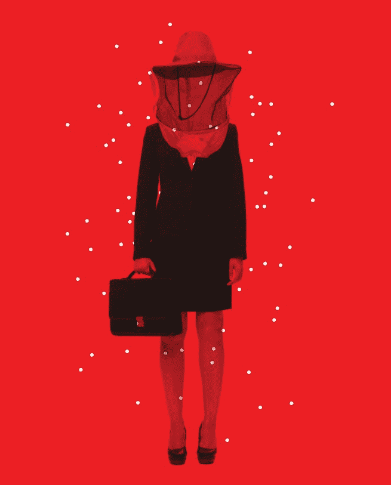

# 为什么女性在工作中会互相欺负——大西洋

> 原文：<https://www.theatlantic.com/magazine/archive/2017/09/the-queen-bee-in-the-corner-office/534213/?utm_source=wanqu.co&utm_campaign=Wanqu+Daily&utm_medium=website>

*<small>2017 年 8 月 3 日更新</small>*

母狗，为  香侬看见了，进来了三个品种。她在她的个人博客上对他们进行了分类，在一篇名为“小心女性重婚伴侣”的文章中。

首先是“好斗的婊子”——在她工作的公司里，某一种地位很高的女人，她会毫不犹豫地“口头攻击任何人”当一个这样的合作伙伴的名字出现在来电显示上时，香农告诉我，“我们会吓坏的。”

接下来是两面派的“消极攻击的婊子”，她的“微妙、半粗鲁的电子邮件”暗示“你真的不应该在 6:30 之前离开。”可以说，她比那个好斗的婊子更糟糕，因为你可能永远不知道自己的立场。

最后但并非最不重要的一点，香农写道，“被冷落、漠不关心的婊子，忙于工作和家庭，以至于他们没有时间做任何事情……这位合伙人并不是想刻薄，但是，嘿，他们是合伙人的时候，半夜就有任务。你也会的。

“显然也有例外，”她补充道。“但是不多。”

*Listen to the audio version of this article:**Feature stories, read aloud: [download the Audm app for your iPhone.](https://app.adjust.com/yvncvp)*

你可能会认为像 Shannon(她要求我只使用她的名字)这样的人会在一家精英律师事务所茁壮成长。当她在 2000 年代中期从宾夕法尼亚大学法学院毕业时——她帮助编辑了宪法期刊，并在一个地区法院法官那里实习过——她有了自己的工作机会。她知道去一家大公司，她就意味着接受了惩罚性的工时，但她有六位数的学生贷款要还，她希望自己外向的性格能赢得老板和潜在导师的青睐。

结果并不完全是这样。

公司的步伐和她担心的一样疯狂。她说，合伙人会在一天的晚些时候分配项目，有时会迫使同事通宵工作，结果却在第二天早上宣布根本不需要这项任务。当 Shannon 想在晚上 7 点离开时，她会偷偷溜出办公室，悄悄走过电梯，走楼梯下楼以避开她的老板。她开始抽烟来缓解压力。

早些时候，香农注意到一个惊人的动态。尽管她所在的法学院班级男女比例大致相当，但该公司的女性合伙人非常少。这并不罕见:当时，全国仅有 17%的法律合伙人是女性，而且自那以后，她们只上升了几个百分点。而且，至少在她的公司，似乎没有人喜欢少数女性合伙人。“他们被认为是泼妇，专横，不想听借口，”香农告诉我。

有一次，她发现一位女性合伙人在出租车停靠站对员工大喊大叫，因为车开得不够快。另一个人会当面称赞香农，然后派一名高级助理告诉她工作太慢。有一次，Shannon 给一位女性合伙人发了一封电子邮件——一种消极进取的类型——说:“附件是我们需要客户提供的问题和文件的修订清单。让我知道我可能已经离开了。”

据 Shannon 说，这是你不自信的另一个例子。“‘我可能已经停止了’这句话与其说是关心我的想法，不如说是暗示对你的清单的完整性缺乏信心。”

香农承认她可能有点敏感，但她不是唯一注意到这一点的人。“几乎每个女孩都会在某个时候哭过，”她说。她说，有些男性伴侣可能有些粗鲁，但其他人很好。另一方面，几乎所有的女性伴侣都非常强硬。

尽管如此，高级女性的行为对她来说还是有意义的。他们盲目地投入到工作中，经常工作到晚上九点或十点。成为伴侣意味着要么不要孩子，要么雇佣日间和夜间保姆来照顾他们。“成功的女性中有敌意，”她说。“就像是，‘我放弃了这个。你也必须放弃它。 "

16 个月后，Shannon 觉得她受够了。她去了一家工作时间更宽松的公司，后来又请假去陪她的孩子们。她现在说，如果她回到一家大公司，她会小心翼翼地为女性工作。她认为，一个女人会因为她退出职场而对她做出评价:“女人似乎在贬低女人。”

她对女性伴侣的指责让我吃惊，因为人们通常不会公开指责历史上被边缘化的群体。当我联系其他女性，询问她们是否有类似的经历时，一些人被这个问题吓坏了，就好像我是菲利斯·施拉弗利从坟墓那边打来的电话。但是他们会说“好吧，曾经有过一次……”然后女性破坏的故事就会蔓延开来。当我进行几十次采访时，我开始觉得自己像一个牧师，女人们正在向他忏悔她们反对女权主义的罪恶。

他们的故事形成了一种肆意刻薄的模式。另一名律师瑟琳娜·帕伦博(Serena Palumbo)告诉我，有一次她回意大利续签签证，回来后发现一名女同事告诉他们的老板，“我的表现平平，注意力不集中。”卡特琳·帕克(Katrin Park)是一名公关主管，她告诉我，一名女性前经理对一个小小的违规行为的反应是尖叫:“你这么无能，我怎么工作？!"我的一个朋友，我称她为凯瑟琳，她的老板在一家非营利机构工作几个月后，语气变得异常严厉。“这是你不顾一切向前跑的一个完美例子，完全不考虑我说的任何事情，”这名女子在一封电子邮件中说，随后对凯瑟琳大发雷霆。许多女性告诉我，男性也曾伤害过她们，但当这件事发生在一个女性、一个所谓的盟友身上时，感觉就不一样了——更糟糕。

甚至一位曾经给我的职业生涯带来推动的女性也加入了合唱团。几年前，住在佛罗里达州的作家苏珊娜·布雷斯林通过在她的博客上推广我的作品，把我从默默无闻中拉了出来。因此，在这篇报道中，当她告诉我，她将过去的女性经理分为“龙女”和“温柔的向上爬的人”时，我有点吃惊。她宁愿为男人工作，因为她说，他们更直率。“对女性来说，我一部分是根据我的能力被评判的，另一部分是根据我是否是‘一个朋友’、‘好’或者‘有趣’被评判的，”她告诉我。"那是一些操场上的废话。"

与此同时，我采访的其他女性承认，她们曾试图从一位女同事手中抢走 Aeron 椅子。在一次女性社交聚会上，我遇到了阿比盖尔，她是一家咨询公司的年轻财务总监，曾经因为一位同事休了六周产假而怨恨她。“我认为自己非常支持女性和女权主义者，”阿比盖尔说。尽管如此，她承认，“如果我不是那么在意自己的反应，我可能会说，‘也许我们应该想办法解雇她。’ "

<aside class="ArticlePullquote_root__YtnHv">Study participants said female bosses are “emotional,” “catty,” or “bitchy.”</aside>

当然，这些只是轶闻。我也听到了关于女性同事的正面故事，包括来自外交政策和新闻业等领域的杰出女性，她们描述了其他女性是如何指导她们或充当非官方支持团体的。(我很幸运自己有过这两种经历。)此外，研究表明，从某些方面来看，女性实际上比男性更适合做管理者。

然而，不管公平与否，许多女性似乎和 Shannon 一样担心，她们的性别成员倾向于互相排挤。皮尤(Pew)和盖洛普(Gallup)的大型调查以及几项学术研究显示，当女性对其老板和同事的性别有偏好时，这种偏好主要是针对男性的。例如，2009 年发表在《管理中的性别》杂志上的一项研究发现，尽管女性认为其他女性可以成为优秀的管理者，但“女性员工实际上并不想为她们工作。”女性工作的时间越长，就越不希望有女老板。

2011 年，加州大学洛杉矶分校(UCLA)讲师金·埃尔塞瑟(Kim Elsesser)分析了 6 万多人的回答，发现女性——甚至那些自己就是经理的女性——更希望有一个男老板，而不是女老板。参与者解释说，女老板是“情绪化的”、“阴险的”或“恶毒的”(男性也更喜欢男上司，但比例比女性参与者低。)

在一项对 142 名律师事务所秘书的较小规模调查中——几乎所有人都是女性——没有人说她或他更喜欢为女性合伙人工作，只有 3%的人表示他们喜欢向女性同事汇报工作。(将近一半的人没有偏好。)“我避免为女性工作，因为(她们)是个讨厌鬼！”一位女士说。在另一项研究中，向女老板报告的女性比那些为男性工作的女性有更多的痛苦症状，如失眠和头痛。

有些人觉得这些研究简直难以置信。(当 ABA 杂志发表了一篇关于法律秘书调查的文章时，愤怒的读者要求撤回。《华尔街日报》就这一争议写了一篇后续文章，并对受到伤害的感情发表了温和的道歉。)事实上，很难相信女性会对自己的性别持有强烈的偏见。也许部分是因为这是一个如此棘手的话题，这种现象往往要么被忽视(这里没什么可看的)，要么被认为是不可避免的(女人天生狡猾)。但事实上，心理学家几十年来一直试图解释这一现象——他们的研究结果表明，女性不是这个故事的反面角色。

去年秋天的一个晚上，当我走进华盛顿特区宾夕法尼亚大道上的一家高档餐厅时，我并没有寻找寻找  的淫荡行为，但它找到了我。我在那里参加了一个女性高管的小型聚会。当我介绍自己是记者时，几个女人做了个鬼脸，所以当我走近她们中的一群人时，我开始说，如果她们不想接受采访，就不必接受采访。

这时，一个穿着豹纹夹克的中年金发女郎看着我说，“当你去看心理医生时，你会说，‘没人喜欢我！没人想和我说话吗？”

我难以置信地眨了眨眼睛，然后问她是否曾经因为自己的沟通方式而遭到拒绝。

这位名叫苏珊(Susan)的女性说，她的直率实际上是她在金融服务公司担任顾问的一个优势，正如她所描述的那样，这是一个非常类似《广告狂人》(Mad Men)的环境。“我有一种不同的交流方式，更像一个男人，”她说。“我参加了很多体育活动，我希望我们能四处走动，在比赛结束时仍然是朋友。像我这样的人。”

不过，对她办公室里的其他女性来说，兄弟会的环境似乎没那么好。她公司的大部分财务顾问是男性，但大部分助理是女性——苏珊称这种情况为“不良行为的温床”“这些女性获得的空间是有限的，”她说。"他们在他们的小监狱里，他们都在互相吞噬。"

事实证明，对于为什么会发生这种情况，研究人员有相互竞争的理论——为什么女性有时会发现自己陷入困境并相互攻击。

波士顿伊曼纽尔学院的心理学家乔伊斯·本纳森认为，从进化的角度来看，女性注定不会与和自己没有血缘关系的女性合作。她的研究表明，妇女和女孩比男人和男孩更不愿意与地位较低的同性个体合作；更容易解除同性友谊；并且更愿意在社交上互相排斥。她指出类人猿也有类似的模式。雄性黑猩猩比雌性黑猩猩更喜欢互相梳理毛发，并且经常一起合作狩猎或巡逻边境。雌性黑猩猩不太可能组成联盟，甚至被发现在交配的阵痛中强迫自己站在雌性对手和她的配偶之间。

Benenson 认为，女性之间互相破坏，因为她们总是不得不为配偶和后代的资源而竞争。帮助另一个女人可能会让那个女人在狂热的约会市场上获得优势，或者可能会让她的孩子比你的孩子更有优势，所以你冷淡地冷落她。贝纳森告诉我，女性“可以聚在一起微笑、大笑，进行礼貌、亲密甚至热情的交谈，同时毁掉彼此的职业生涯”。"这种对比很不协调。"

也许不足为奇的是，贝纳森的理论是有争议的——以至于她说她在学术界感到被边缘化和“非常孤立”。 [*](#Correx%20Anchor)

如果贝纳森是对的，女性将不得不奋力修复她们有害的动力，因为这是生物学上根深蒂固的。但是许多其他研究人员认为女性并非生来如此。相反，他们认为，恶毒是现代工作场所的副产品。

20 世纪 80 年代末，时任耶鲁大学管理学院研究生的罗宾·伊利(Robin Ely)开始试图理解为什么女性在办公室的互动有时会变得有害。“我工作中最困难的关系是和一个女人，”伊利告诉我，“但女人也给了我最惊人的支持。”她不相信任何一种关于女性的流行刻板印象——认为她们是养育地球母亲或操纵他人的叛徒。相反，她的假设很简单，“女人，像所有人一样，对她们所处的环境做出反应。”

为了测试这个想法，Ely 打开了一个律师事务所目录，选择了一些男性占主导地位的公司，其中女性合伙人不超过 5%，以及一些女性在高层中的比例略高的公司。然后，她询问了这两类公司的女律师对女同事的看法。

无论在哪里，律师们都要忍受艰苦的工作环境。但是伊利说，在男性占绝对优势的公司里，女性之间的竞争是“激烈的、令人不安的、个人的”。与女性在男性占主导地位的公司中得到更好的代表相比，女性在男性占主导地位的环境中对彼此的评价更低，提供的支持也很弱。伊利说，这些公司的女性合伙人“几乎遭到了普遍的唾骂”。一位年轻的律师形容她的老板是“一个没有法律天赋的控制欲极强的婊子。”

或许最持久的教训是:在男性主导的公司中，女性认为只有这么多人能进入高层，她们会相互竞争这些职位。现任哈佛大学商学教授的伊利发现了一种叫做象征主义的动态。研究显示，当女性的机会似乎很少时，女性开始将自己的性别视为障碍；他们避免联合起来，有时互相攻击。

想想那个“酷女孩”，她漫不经心地说，“我所有的朋友都是男人”——好像这是自然而然的事情。或者是把最严厉的反馈留给女同事，而办公室里的男人们却在谈论体育和拳脚相加。我在华盛顿遇到的金融顾问苏珊(Susan)这样的女性，用她的话说，“更好地与男性相处”，因为与高层相处是有好处的。

大约在伊利进行象征主义研究的同时，荷兰心理学家娜奥米·埃尔默斯在阿姆斯特丹担任助理教授，她试图理解学术界几乎完全没有资深女性的现象。当时，女性仅占荷兰所有正教授的 4%。Ellemers 认为可能是有偏见的男性阻碍了女性的发展。

埃尔默斯整理了一份全国所有女教授的名单，并给她们(以及一份男教授样本)邮寄了一份关于她们与同事关系的调查。她的发现表明，女性实际上是问题的一部分。女教授形容自己和男教授一样“好斗”和“强势”；她们觉得得不到女同事的支持，不想和其他女性一起工作。

11 年后，Ellemers 调查了阿姆斯特丹和意大利的博士生和大学教师，发现了类似的结果。尽管年轻的男性和女性事实上同样致力于他们的工作，但女教授认为年轻女性不那么敬业。埃尔默斯称这些年长的女性——她们通过强调自己与其他女性的不同来应对性别歧视——为“蜂王”，重新使用了密歇根大学(University of Michigan)的研究人员在 20 世纪 70 年代首次创造的一个术语。

这些研究发表后，Ellemers 沮丧地阅读新闻文章，鼓吹它们是女人本性肮脏的证据。“一些记者非常乐意成为女性互相诽谤的头条新闻，”她沮丧地告诉我。她想过放弃这方面的研究，但她的一个学生，贝尔·德克斯，说服她继续探索。

2011 年，Ellemers 和 Derks 与他们的一些其他同事一起进行了一项小型研究，他们要求 63 名荷兰女警察回忆她们在工作中遭受性别歧视的经历，这些女警察的数量远远超过了她们的男同事。这一提醒促使许多官员强调他们与其他女性的不同之处，并淡化性别歧视的盛行。换句话说，考虑到身为女性有多糟糕，某些官员不想被视为女性。这不仅仅是女性做的事情:在另一项小型研究中，当 Derks 和其他研究人员让荷兰的苏里南移民回忆起他们群体遭受歧视的一个例子时，许多人对彼此的评价更低，表现得更像典型的荷兰人。

由此，Ellemers 和 Derks 认为他们已经找到了蜂王出现的条件:当女性在工作场所是一个被边缘化的群体，为自己的职业做出了巨大牺牲，或者已经倾向于表现出很少的“性别认同”——与其他女性的同志情谊。(想想雅虎前首席执行官玛丽莎·梅耶尔(Marissa Mayer)对她的另一份旧工作的评价:“我在谷歌并不是一个真正的女人；我是谷歌的极客。”Ellemers 说，像这样的女性“艰难地认识到，在职场上取得成功的方法是确保人们意识到她们与其他女性不同。这和这些女人无关。这是他们学会的在组织中生存的方式。”

值得注意的是，Ellemers 和 Derks 的一些发现并不十分可靠。但是其他研究人员已经发表了与他们相呼应的工作。康奈尔大学管理学教授米歇尔·杜吉德研究了一种名为“偏袒威胁”的现象，即女性担心如果她们互相帮助，会显得有偏见。在一篇工作论文中，杜吉德指出，过去帮助过其他女性的“象征性”女性在有机会时会避免再次这样做。在另一项研究中，她发现，与那些在声望较低或有更多女性同事的环境中工作的女性相比，处于“高声望”环境中的象征性女性更不愿意招募女性候选人加入他们的团队。

<picture class="ArticleInlineImageFigure_picture__HoflP"></picture>

Paul Sahre

正如加州大学黑斯廷斯法学院的著名教授琼·c·威廉姆斯对我说的那样:“女人也是人。如果获得成功的唯一途径是拼命逃离其他女人，有些女人就会这么做。”研究表明，这种疏远也发生在少数群体中，这意味着这些动态对有色人种女性来说可能会加倍艰难，因为她们面临性别和种族偏见。

即使头脑冷静的女权主义女性有时也会表现出蜂后行为的元素，她们不一定要身居高位。我听说的最大问题是所谓的“竞争威胁”，即女性担心新来的女性会胜过她。她可能会试图先发制人地削弱她的竞争对手——正如我采访的一位女性所遭遇的那样，她的工作朋友散布谣言说她滥交且不合格。或者，她可能会用贬低的言论抨击她的竞争对手，正如 2016 年对科技行业女性的调查中，70%的受访者遇到的情况一样。一位受访者写道:“我的两位女同事建议我试着让自己看起来‘不那么漂亮’,以便得到更多的重视。”。"有人建议缩小乳房。"

这种行为会造成损失。我的朋友凯瑟琳一直是我们小组中最镇定、最开朗的，但在和一只蜂王相处了大约六个月后，她开始感觉自己像“一个惊恐的水坑中的人”，她说。她觉得胃不舒服，上班时吃午饭都有困难。“每当电话铃响，我的腿就会发抖，”她说。"每当我们在通话时，她的声音响起，我就不寒而栗."

大约 15 年前，玛格丽塔·罗森菲德(Margarita Rozenfeld)发现自己要向一只蜂王汇报工作，她现在是华盛顿特区的一名领导力教练。罗森菲德的老板才 30 出头，但她的穿着和举止让她看起来老多了。她对团队中的每个人都有很高的期望，包括 Rozenfeld，当她的下属没有表现出和她一样的雄心时，她会抱怨。

一天，在上班的路上，罗森菲德在停车场的台阶上绊倒了，扭伤了脚踝。随着时间的推移，伤口越来越大，她担心情况会变得更糟。她不是特别忙，就敲了老板的门，问能不能早点走去看医生。她的老板让罗森菲德进来把门关上。

“你知道，我对你有很高的期望，”罗森菲尔德记得她说。她的老板质疑，当“发生这样的事情”时，为什么“你觉得你可以离开”

“但我觉得我不能走路了，”罗森菲德说。

“我会告诉你一些关于我的职业生涯，以及我是如何走到今天这一步的，”她的老板继续说道。“你知道我和基本上性骚扰我的男人合作过多少次吗？你知道吗，那边那个人错过了他孩子的高中毕业典礼，因为他在忙一个提案。你扭伤了脚踝，你认为可以离开吗？”

当热泪盈眶的时候，罗森菲德意识到她永远不会成为她老板想要的那种员工。六个月后，她辞职了。

复杂的是，情人眼里出西施，*蜂王*这个词有时会被用在那些只想做好本职工作的女性身上。你可以称之为女性管理:许多研究表明，人们——无论男女——都不能容忍女性表现出一丝强硬，即使是在她掌权的时候。

最臭名昭著的双重标准是女性不能进入重要的工作岗位，除非她们为自己辩护并赢得尊重。但他们也会被人唾骂，除非他们表现得像一个爽朗、自嘲的团队成员，永远把功劳留给别人。罗格斯大学的社会心理学家劳里·鲁德曼说，这种困境的“典型代表”是希拉里·克林顿，根据调查，她在任时比竞选时更受欢迎。去年夏天，前佛蒙特州州长马德琳·梅·库宁在《波士顿环球报》上撰文指出，唐纳德·特朗普的行为标准远低于克林顿:“男孩是男孩，但女孩必须是女神。”

鲁德曼第一次目睹这种趋势是在她还是明尼苏达大学的研究生时，当时她是一个公开教授职位招聘委员会的成员。鲁德曼告诉我，女性候选人吹嘘自己的记录，说“我很幸运，我为我的导师找到了某某人”。与此同时，一名男性候选人大摇大摆地走进来，双臂交叉，宣称:“我将在未来五年内改变心理学的面貌。”委员会挑选了这个人。

“女性很难要求权力，”鲁德曼说。“如果你伸出你的脖子说‘我希望被考虑升职’，有人正在背后加速链锯的运转。”

<aside class="ArticlePullquote_root__YtnHv">When women do slip outside the lines and behave assertively, other women are sometimes the ones who blast them for it.</aside>

鲁德曼获得博士学位后，她开始研究为什么女性不能像男性那样逍遥法外。她的工作有助于解释为什么男老板可以坦诚，而女经理却只能端上恭维三明治来缓和他们的批评。在她的一项实验中，与同样坦率的男性相比，给出诚实反馈的女性更不受欢迎，也更不容易被录用。其他学者认为，员工只是不像男老板那样尊重女老板——这促使老板对员工更差，这导致员工更瞧不起他们的老板，等等。

鲁德曼发现，一些女性对其他女性的贬低可以用所谓的“系统正当性”来解释，这是一个心理学概念，在这个概念中，长期受压迫的群体努力理解不公平的世界，将负面的刻板印象内在化。在美国生活中，女性没有和男性同等的地位。所以当人们想，我想和谁一起工作？，他们下意识地默认了，这个历史上备受尊崇的——男人。有的女人环顾四周，看到很少有女人在跑事情，就假设女人本身一定有问题。

事实上，加州大学洛杉矶分校(UCLA)讲师金埃尔塞瑟(Kim Elsesser)在他的研究中发现了对男性老板的偏好，他指出了该研究中另一个有趣的问题:只有在被问及总体上更愿意为哪种性别的人工作时，参与者才会对女性产生偏见。“当参与者被问及他们现在的老板时，偏见消失了，”埃尔塞瑟说。

当女人越线并表现出自信时，其他女人有时会为此指责她们。在一系列研究中，鲁德曼要求参与者为一轮电脑化的危险游戏挑选队友。他们可以在不自信和自信的男人和女人中进行选择。提供了现金奖励，所以参与者理所当然要选出有能力的人。尽管自信的男女参赛者被认为比不自信的更有能力，但女性参与者仍然在不自信的女人和自信的女人之间徘徊。

鲁德曼说，总的来说，研究显示，男性在工作中比女性本身更歧视女性。但至少在这种情况下，男性参与者毫不犹豫地选择了自信的女性而不是不自信的女性，并且在自信的男性和自信的女性之间没有偏好。另一方面，没有一个女性参与者选择了自信的女性而不是自信的男性。“我简直不敢相信！鲁德曼惊叫道，发出一声长长的“呜哇”

她认为这是心理学家所谓的害群之马效应的一个迹象，即人们对自己群体中违反规则的成员比对其他部落中的异常者更严厉。正如鲁德曼告诉我的那样，我在脑海中回放了我一生中一个人在团队项目中完全失误的各种时刻，我原谅了他，认为他要么是一个疯狂的教授，要么是一个讨厌乏味细节的恶魔。对我的公事公办的温迪来说，他就是淘气的彼得潘:我会自己处理的，你这个小淘气！然而，如果一个女人有这样的行为，我更有可能起草一打从未发出的电子邮件，问她有什么问题。

一些作家和研究人员认为真正的蜂王极其罕见，这个概念被厌恶女人的人借用来显示女人有多可怕。甚至连创造了“T2 蜂王”这个词的社会心理学家卡罗尔·塔夫里斯也被引用来否定这个概念。“我讨厌它，”她在 2013 年的【今日 T4】节目中说。

1974 年，Tavris 在《今日心理学》上发表了一篇文章，她和两位同事 Graham Staines 和 Toby Epstein Jayaratne 写道:

> 有一群反女权主义者就是我们所说的蜂王综合症的例证……真正的蜂王在工作的“男人世界”中取得了成功，同时用左手管理家务和家庭。“如果我没有一个完整的运动来帮助我就能做到，”她的态度是，“那么其他所有的女人也能做到。”

当我打电话到她在洛杉矶的家时，Tavris 说她的理论被曲解了，被刻成了攻击女性的棍棒。毕竟，如果女性是自己最大的敌人，人们为什么要推动女性的职场晋升呢？她感到遗憾的是，给一种复杂的行为模式起一个“朗朗上口的名字”有助于将蜂王主义作为“一种东西”推出——尽管自 20 世纪 70 年代以来职业女性取得了所有成就，但这种现象仍然存在。发表那篇论文后，她继续研究心理学的其他课题。

我可以理解为什么 Tavris 想远离这项研究——谁想和互联网上的性别歧视者交更多的朋友？鉴于蜂王现象的复杂性，它的流行程度是不可能确定的。尽管如此，蜂王显然是一个真实的事情，忽视这个问题不会让它消失。也许通过了解其原因，我们可以最终开始解决它们。

根据内奥米·埃尔默斯和其他研究人员的说法，要记住的关键一点是，蜂王行为是在特定情况下产生的——比如当一个女人认为通往成功的道路如此狭窄时，她几乎无法挤过自己，更不用说试图带别人一起走了。

<aside class="ArticlePullquote_root__YtnHv">She glared at me and turned bright red. Then she screamed at me like I had never been screamed at before.</aside>

当我最初给 Tavris 发电子邮件要求采访时，她回复说，“你的要求让我很难过。”但是，当我描述我采访过的妇女的经历时，她承认在某些情况下，妇女有时确实会互相欺负——就像其他受歧视群体的成员一样。

在我们谈话的最后，Tavris 称赞了 Ellemers 的研究。她说，我们在工作中的表现取决于“我们在工作中的安全感”。“我们的工作给了我们发展的机会吗？还是我们在每一步都感到受挫？”

我曾经和一只蜂后——一个比我大几十岁的女人一起工作。(她职位比我高，但不是我的主管。)刚开始不久，我和她就单独在我们的共享工作区了。这是忙碌的一天，但我需要问她一个关于内部流程的问题。我一直等到傍晚，然后问。

她瞪着我，脸红了。然后她冲我尖叫，就像我从来没有被一个和我没有血缘关系的人尖叫过一样。(后来我投诉她的时候，老板解释说，办公室就是一个家庭式的环境。)

那可能是我们最糟糕的遭遇，但不是唯一的一次。她会因为我无法控制的事情而对我大发脾气，并向老板抱怨我。有一次，在一个令人沮丧的电话后，我叹了口气，她痛斥我似乎有资格。另一个同事无意中听到，告诉她冷静下来。

“对不起，她有口气！”她回答道，像一个被无礼的帮助激怒的男爵夫人。

走进工作的时候开始肚子疼，出冷汗。尽管如此，我还是不太恨这个女人。很明显，她在工作中很痛苦，每次我看着她毫无压力的眼睛，我都能看到自己的影子。

这是未来奥尔加的鬼魂吗？，我有时会想。当你做出完全正常的、社会认可的选择——努力工作时，会发生这种情况吗？生孩子；为晋升而拼命工作；去度个小假，不要太久！；回来更加努力——加起来不就是你预想的生活吗？你在会上说了正确的话，不是吗？你帮助了这个重要的项目。那为什么*不是*你呢？这将是令人愤怒的。

事实是，我有时也觉得这一天太累了，我不可能优雅地处理更多的事情。我喜欢认为我没有拿我的同事出气。但是我的蜂后比我过得更艰难，在进行 90 年代风格的敏感性训练之前，她一直在往上爬。她可能经历过那种不需要莎拉·劳伦斯学位就能嗅出来的性别歧视，那种你的男性平等地叫你“亲爱的”，或者预先告诉你，你不属于这里。我不得不问自己，*这样的治疗需要多少年才能让我变得像她一样刻薄？*十年？二十？还是只需要合适的机会——比如异常糟糕的一天，没有其他人在身边？

为了了解职业大师们对如何应对蜂王有什么看法，我浏览了一些针对女性的畅销“成功”书籍。我的发现令人大开眼界，但不是以我希望的方式。

例如，最初于 2004 年出版的 2014 年“修订和更新”版*好女孩得不到角落办公室*，指出女性“经常小题大做，这让她们的男同事非常惊愕。”2006 年出版的《T2 女孩成为老板指南(不做泼妇)》一书的作者讲述了一个有着泼妇老板的女人的悲惨故事，然后简单地写道，如果你(老板)觉得你是个泼妇，你应该参加一个愤怒管理课程。问题解决了。

在《像男人一样玩，像女人一样赢》中，美国有线电视新闻网前副总裁盖尔·埃文斯建议，不要在办公室外与同事有任何接触，以避免工作中的紧张气氛。如果一种情绪在工作时间以某种方式出现，一个真正的高管跟踪女孩会把它塞回去。“如果你情不自禁地对一位女同事生气，”埃文斯写道，“为了我们其他人的利益，不要说出去。”

就业律师告诉我，即使职场欺凌变得严重，如果折磨她们的人是另一名女性，女性也不太可能起诉性别歧视，因为人们往往认为女性会互相照顾。(一位律师说，这就是为什么公司经常任命“受保护阶层”的成员，如少数民族和女性，担任人力资源职位。让这些团队中的某个人来处理解雇事件会增加起诉不当解雇的难度。)

然而，正如我采访的一些女性建议的那样，答案不能是简单地向蜂王投降。即使你后来辞职了，你也只是把你糟糕的老板强加给了下一个下属。在另一个女性社交聚会上，我遇到了一位名叫玛丽的女士，当我问她是否曾与女老板发生过冲突时，她会意地笑了起来。在之前的一份国防工业分析师的工作中，玛丽有两个老板，一男一女。2010 年地震发生时，她被指派报道海地，这迫使她长时间艰苦工作。男经理夸她，女的却把她当靶子。当玛丽在一份报告中忘记结束一个引号时，她的女老板谴责她是一个剽窃者，并最终将她赶了出去。玛丽的建议:“你不应该超过老板。”

护士可能有更好的解决办法。她们的职业充斥着女性欺凌，但一群护士提出了一个想法，即医院将有经济激励来消除员工内斗。根据这项计划，欺凌的程度将被测量，公开报道，并计入医院从联邦政府获得的提供优质医疗服务的付款中。

对职业母亲的更好支持也会有所帮助。从我的报道来看，虽然关爱家庭的政策很重要，但有一个认同这些政策的老板也同样重要。例如，我采访的一位女士，当她的孩子生病时，技术上允许她在家工作，但她的年长女经理每次都会让她感觉很糟糕，从而否定了政策的意义。

雇主也可以更加努力向有才华的女性展示他们的价值，因为对职业前景感到乐观的女性不太可能互相拆台。“我们需要改变我们的社会，让女性看到其他女性在各种角色上取得成功成为一种规范，”劳里·鲁德曼说。事实上，新的行业，因此缺乏根深蒂固的社会角色，往往是这种变化发生的地方。

在我们谈话的最后，鲁德曼强调，对于高成就女性来说，拥有自己的成功是多么重要，而不是把这一切归功于导师和运气，即使这样做是有代价的。鲁德曼说，只有当我们中有足够多的人击败女性领导人时，关于女性领导人应该如何表现的刻板印象才会改变。我觉得我在和一个时髦的、女权主义的阿姨说话，我从来没有过这样的阿姨。

"你有没有感觉到成功的阻力？"她问我。

偶尔，我说，想起有几次人们有点过于尖锐地想知道，我是如何赢得这样或那样的职业生涯的。

她问，我对此做了什么？

“我说我只是运气好，”我回答，“或者想出了一些借口。”

“YAAAAA！”她哭了。“看到了吗？看到了吗？所以你认为女性应该重新考虑这个策略吗？或许女性应该开始增强我们的信心？”

我承认这是一个好主意，但“有些事情让我无法以更自信的方式行事，尽管这通常对女性有益。”

“这对女性整体来说是有好处的，”鲁德曼说。“但首先必须击落单个女性。你不会想成为其中之一的。我也不怪你。”

不过，总得有人率先行动——表现得自信，冒着同事下意识怨恨的风险，而不是针对他们。但如果我们能像蜂巢那样做就简单多了。

*<small>[*](#Text%20anchor) 这篇文章已经更新，以更好地反映贝纳森对她学术孤立的描述。</small>*

