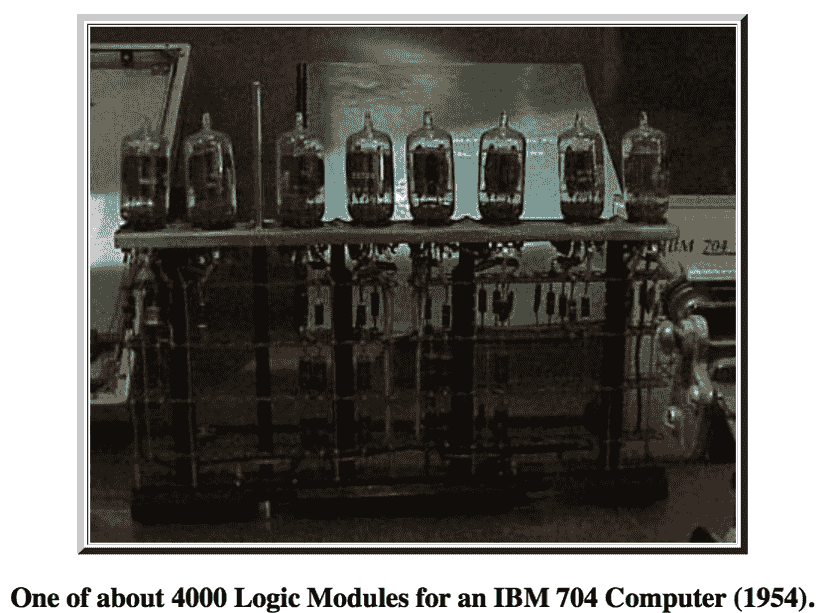
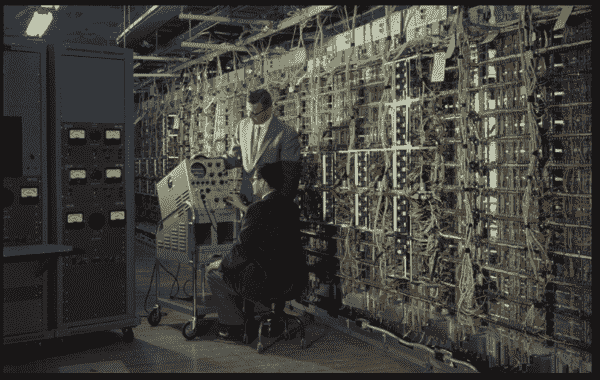
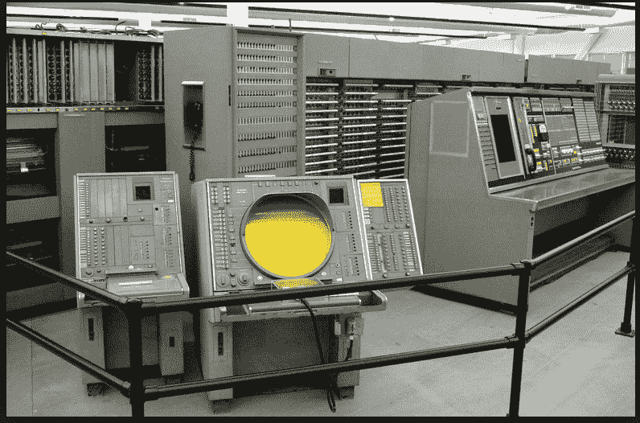

# “他们”真的会说:“技术进步在放缓”吗？

> 原文：<http://www.bradford-delong.com/2017/09/do-they-really-say-technological-progress-is-slowing-down.html?utm_source=wanqu.co&utm_campaign=Wanqu+Daily&utm_medium=website>

考虑一下 256 GB 内存的 iPhone X:1957 年在真空管中实现，仅 iPhone X 中的晶体管就有:

*   相当于今天的 150 万亿美元:是今天全球年产值的 1 . 5 倍
*   占据了一座 300 米高，3 千米长和宽的百层方形建筑
*   汲取了 150 太瓦的能量——是目前世界发电量的 30 倍

* * *

iPhoneX:

*   A-11 中的 43 亿个晶体管[https://www.apple.com/iphone-8/#a11](https://www.apple.com/iphone-8/#a11)
*   256 GB 内存中有 2，199，023，255，552 位，每一位都需要一个晶体管(和一个电容器)
*   假设有 2.5 万亿个晶体管...
*   你可以花 100 美元买到 256 GB 的内存——比如说，其中 1/4 是晶体管的成本。
*   比如说，一台 iPhoneX 中价值 125 美元的晶体管

60 年前，也就是 1957 年，你买一个真空管要花多少钱？

*   嗯，在 1959 年，你可以花 65 美元买一个 1 字节 8 位的 Phister 366[http://jcmit.net/memoryprice.htm](http://jcmit.net/memoryprice.htm)
*   所以，比方说，8 美元一点。
    *   根据 https://www.measuringworth.com/的 GDP 缩减指数，1957 年的 8 美元相当于今天的 60 美元
    *   1957 年的 8 美元相当于今天的 160 美元
    *   作为美国名义 GDP 的一部分，1957 年的 8 美元相当于今天的 320 美元

**早在 20 世纪 50 年代末，iPhoneX 中的晶体管在真空管中实现，具有**:

*   相当于今天的 150 万亿美元，也就是:
    *   是今天全球年产量的 1 . 5 倍，
    *   是今天美国年国民生产总值的七倍多
    *   是 1957 年美国国民生产总值的 40 倍
    *   1957 年全球年产量的 14 倍
*   占据了 1000 亿平方米的建筑面积
    *   那就是(每层楼的天花板高度为 3 米):一座 300 米高、3 千米长和 3 千米宽的一百层正方形建筑
*   汲取了 150 太瓦的能量——是目前世界发电量的 30 倍

哦。和时钟速度。安/FSQ-7 飞机的工作频率是 75 千赫。A-11 是一款 6 核 24 mhz 处理器:

*   2000 年 1000 亿平方米的建筑，每栋都是 100 层楼，高 300 米，长 3 公里，宽 3 公里
*   **3000** 乘以今天的全球年产值
*   300 千兆瓦的电力——是目前世界发电量的 60，000 倍

20 世纪 50 年代末的真空管匹配一台 iPhoneX...

我们甚至还没有开始硬件架构，或者快速模仿 20 世纪 50 年代末的 iPhoneX 所需的软件和维护支持...

* * *

