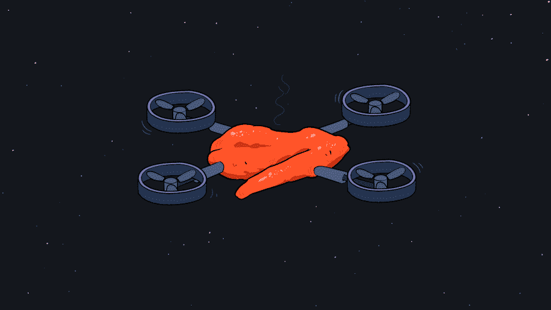
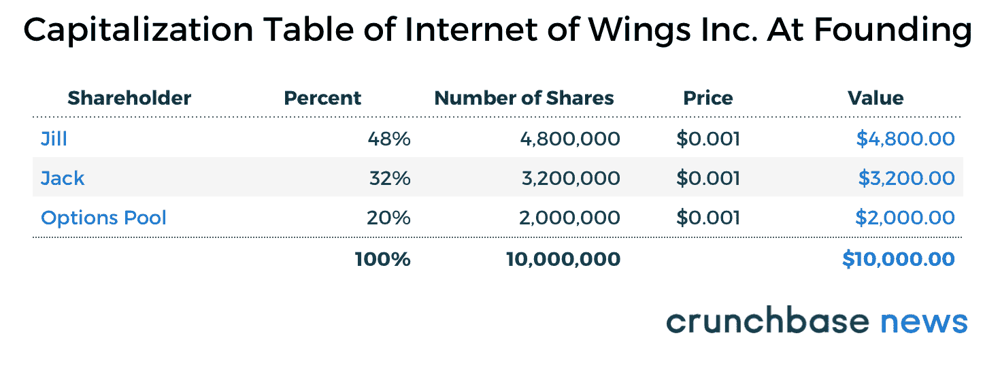
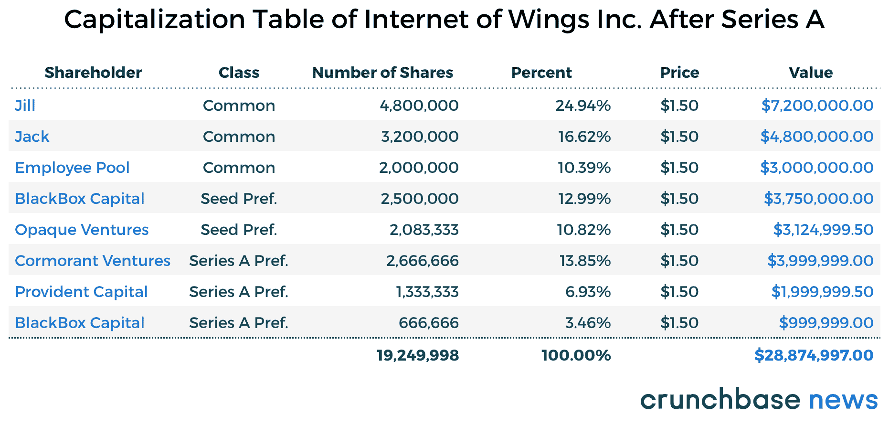
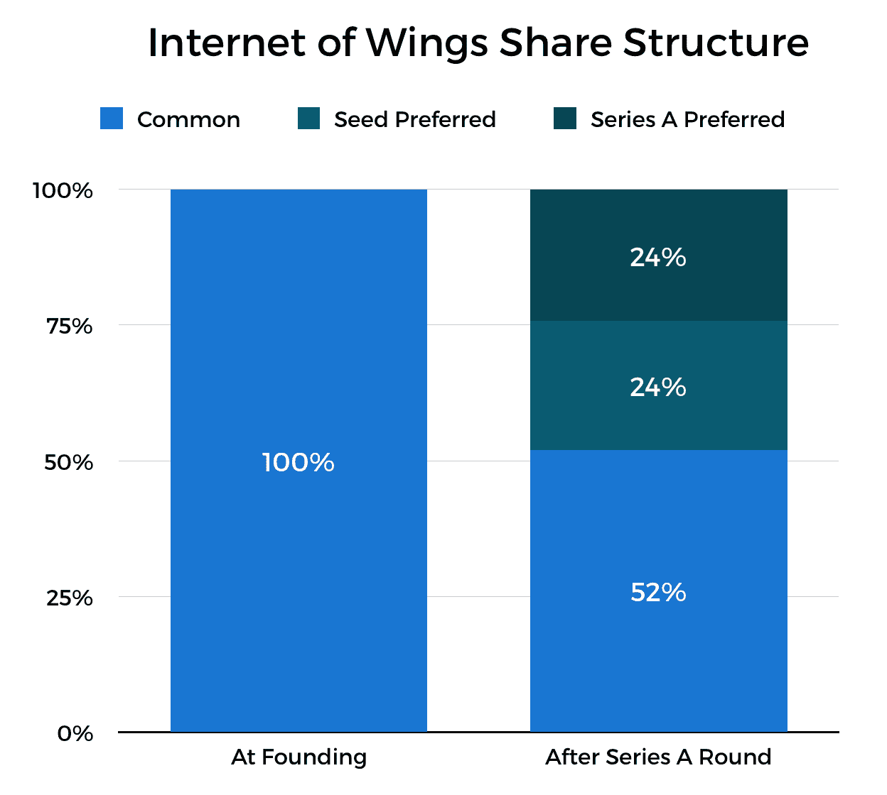
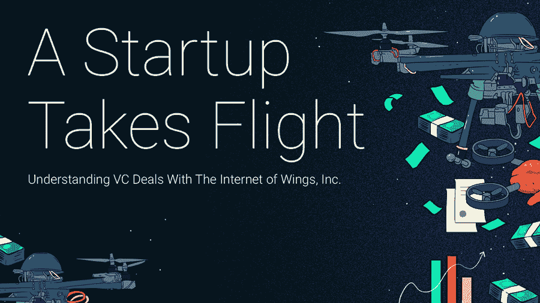

# 资本表、股权结构、估值，天哪！早期融资案例研究

> 原文：<https://news.crunchbase.com/news/cap-tables-share-structures-valuations-oh-case-study-early-stage-funding/?utm_source=wanqu.co&utm_campaign=Wanqu+Daily&utm_medium=website>

对于许多企业家，尤其是第一次创业的人来说，筹集外部资本可能会令人望而生畏。在所有这些新词汇之间——比如“[条款清单](http://www.investopedia.com/terms/t/termsheet.asp)、“[资本表](http://www.investopedia.com/terms/c/capitalization-table.asp)、“[按比例](http://www.investopedia.com/terms/p/pro-rata.asp)”和不同的估值指标——以及正在签署的协议的非常真实的法律含义，很容易让人不知所措。

*跟随 Crunchbase 新闻上* [*推特*](http://www.twitter.com/crunchbasenews)&

 *当你第一次开始时(或者只是需要复习)，从例子中学习通常是最好的。这就是我们今天要做的。我们将解释第一轮融资的基本机制，涉及的一些关键术语，以及不同类型的金融工具和交易结构是如何工作的。我们开个公司，建个资本化表吧！而且，为了保持这种可访问性，我们将尽量保持术语简单。

(另请注意:本文中提到的所有公司和基金都是虚构的，只是为了举例说明。与真实公司的任何相似之处纯属巧合。)

### 创建新公司

让我们从头开始。想象两个创始人，杰克和吉尔。他们的想法是:翅膀的互联网，这是一家布法罗鸡餐厅，以无人机向整个硅谷及更远的地方送货为特色。

他们与一名律师合作成立了一家公司。两人决定以 60 比 40 的比例分割他们的股份，大部分股份归吉尔，因为她将担任首席执行官，并且拥有使该业务的可扩展部分——基于无人机的交付——成为现实的技术背景。他们还决定为未来的员工留出 20%的股权。所以，这是所有权在开始时是如何分解的:

*   吉尔占 48%
*   杰克赢了 32%
*   20%用于员工池

互联网之翼公司(缩写为 IoW，类似 IoT，但涉及家禽)成立于特拉华州 C 公司，是风险投资支持的初创公司的标准法律实体类型，发行了 10，000，000 股普通股，每股面值为 0.001 美元。就凭这一点，从法律的角度来看，该公司现在的价值为 10，000 美元。这是该公司此时的资本化表:

杰克着手开发一种鸡肉三明治，这种三明治看起来是手工制作的，即使是在工业规模下生产。他可能会也可能不会从苹果的[专利披萨盒](https://www.theverge.com/2017/5/16/15646154/apple-pizza-box-patent-come-on)中获得“灵感”,在从 IoW 租用的厨房空间到客户的短暂空运过程中，他创造包装来保持三明治完整和温暖，但不潮湿。与此同时，吉尔组装了一架无人机，可以把鸡肉三明治飞来飞去。

经过几个月的夜间和周末工作后，他们去了公园——他们的小鹰——并成功进行了首次飞行，这被视频捕捉到，随后在 Periscope 上疯传。有了对新创意的明显需求，但没有现金来支付业务成本，Jill 决定是时候在种子期筹集一些外部资本了。

### 种子圆形动力学

种子轮有两种主要形式:有价和无价。定价种子轮与任何其他融资轮都很相似，因为公司会得到一个估值，投资者会以该估值确定的价格用现金购买公司的股票。

但今天，由于它们相对于定价的同类产品的受欢迎程度，以及它们独特的结构和金融工具，我们将在这一部分重点关注未定价的种子轮。

顾名思义，在无定价轮中，公司不会被给予估值，投资者在投资时不一定购买已知数量的股权。相反，这是投资者和公司之间在未来发行股票的协议，在未定价的种子交易达成时，以现金注入为交换条件进行定价。

未定价种子轮中最常见的两种金融工具是可转换票据和所谓的未来股权简单协议(或“安全票据”)。可转换票据是一种金融工具，首先作为债务发行，然后在预定条件下转换为股权，如筹集一轮定价融资。安全票据类似于可转换票据，只是它不是债务工具，这意味着安全票据没有支付利息的义务。由硅谷著名的孵化器项目 Y Combinator 于 2013 年末推出的安全票据通常被认为比可转换票据更有利于创始人，因为它们不像债务一样对待，所以它们没有到期日或利息支付。此外，为了方便起见，协议往往很短，创始人可以协商的条款也相对较少。

#### 风险管理

由于种子投资者通过投资非常早期的公司承担了很大的风险，他们经常会在投资协议中添加一些条款，以确保他们获得足够大的公司股份来证明这种风险是合理的。无定价回合中最常见的两个条款是“折扣”和“估价上限”。

顾名思义，折价条款赋予投资者在下一轮融资中以低于股价的价格购买股票的权利。在这种情况下，下一轮是首轮融资，这通常是公司经历的第一轮定价融资(也是可转换票据或外管局转换为股票的时点)。另外，估值上限对公司的估值设定了上限，这样投资者就可以确保他们获得公司一定比例的股份。这有助于防止失控的估值挤压他们能够购买的公司股份百分比。

#### 种子交易

回到杰克和吉尔。他们决定为他们的创业公司筹集资金。他们估计需要筹集 500 万美元来启动他们的公司。在从他们的网络中寻求引荐，以及许多来回之后，他们发现两个投资者渴望投入整轮投资。

Opaque Ventures 同意一个 250 万美元的保险箱，提供 20%的折扣条款，BlackBox Capital 将向一个保险箱投资 250 万美元，该保险箱对该公司的投前估值有 1000 万美元的估值上限。协议签订后，钱汇入了公司的银行账户，杰克和吉尔继续他们的创业过程。

值得注意的是，在这个时候，没有新的股份被创造出来，公司的价值保持不变，因为，再次，这是一个“无价格”的一轮，没有新的价值被分配。

### A 系列动态

快进 18 个月。生意蒸蒸日上，一队无人机在海湾地区嗡嗡作响，给饥饿的顾客送鸡肉三明治。吉尔和杰克已经从他们的种子期筹集了资金，在 R&D 进行了大量投资，雇佣了一些优秀的工程师，并与海外的无人机制造商达成了一些协议。但尽管增长迅速，该公司并未盈利，在现金告罄之前只剩下八个月的时间。

是时候融资 A 轮了。如果一家公司还没有进行融资，A 轮融资通常是初创公司的股票获得首次估值的时候。

在风险资本家和其他创业投资者中，经常听到提到两种类型的估值:“前期投资”和“后期投资”。简而言之，融资前估值是该轮注资前(因此称为“预”)公司的价值。融资后估值是该轮融资完成后公司的价值，通常通过将该轮融资的金额与融资前估值相加来计算。

#### 交易

杰克和吉尔去沙丘筹集他们的首轮资金。他们想筹集 700 万美元。他们会见了许许多多的投资者，最终与两家新公司达成了协议。他们之前的投资者之一 BlackBox 选择参与此轮投资。这是细目分类:

*   Cormorant Ventures 将在这轮投资中领投 400 万美元
*   Provident Capital 投资 200 万美元参与其中
*   BlackBox Capital 以 100 万美元完成了这一轮

Cormorant Ventures 的分析师认为，在进行任何投资之前，互联网之翼公司的价值为 1500 万美元。这是它的“钱前估值”。虽然很容易认为该公司的融资后估值为 2200 万美元(通过将融资前估值和此处筹集的金额相加)，但我们会看到，由于种子投资者使用的折扣和上限条款，融资后估值实际上有点高。

随着公司向投资者发行新股，支票和法律文书的最终签署引发了一连串的转换和资本化表调整。

#### 种子转化

让我们从种子投资者开始，他们的投资将在这个阶段转换为股权。

Opaque Ventures 在一个保险箱中投资了 250 万美元，该保险箱能够以 A 轮融资前估值的 20%的折扣购买股票。A 轮融资的价格为每股 1.50 美元(1500 万美元的融资前估值除以 1000 万股，这是公司成立时最初创建的股票数量，我们之前提到过)，因此，在 20%的折扣下(每股 1.20 美元)，Opaque Ventures 的 250 万美元投资转换为 2，083，333 股股票(250 万美元除以每股 1.20 美元)

在种子轮中，BlackBox Capital 向一个估值上限为 1000 万美元的保险箱投资了 250 万美元。这允许他们以每股 1.00 美元的价格购买股票(1000 万美元上限/1000 万股已发行股票)，从而从他们的种子投资中购买了 250 万股股票。按照 1.50 美元的新股价，BlackBox Capital 的种子投资现在价值 375 万美元，是投入资本的 1.5 倍。

#### 首轮投资者

Cormorant Ventures 以 1.50 美元的 A 轮股价用 400 万美元的投资购买了 2，666，666 股股票。节约储金以其 200 万美元的投资购买了 1，333，333 股股票。BlackBox Capital 在首轮融资中获得了 100 万美元的后续资金，另外购买了 666，666 股 A 轮股票。

### 所有权分解

以下是公司所有权在首轮融资后的分解。首轮融资完成后，让我们先从我们的资本表开始。

该公司在首轮融资后的估值约为 2887.5 万美元。回想一下，我们曾经说过，融资后的估值应该是 2200 万美元(1500 万美元的融资前估值加上本轮融资中筹集的 700 万美元)，但在这种情况下，这是不正确的。

像估值上限和折扣这样的条款允许投资者以低于当前每股价格的价格购买股票。这增加了他们能够购买的股票数量，从而导致更多的股票被创造出来。

为了进一步说明这一点，让我们想想如果 IoW 的种子投资者不实施上限或折扣会发生什么。他们将以每股 1.50 美元的正常价格发行股票，因此，他们在公司的股份比例会更小。他们在投资协议中加入的条款不仅通过产生更多股份提高了公司的融资后估值，还让这些投资者获得了更大的公司股份，如果他们以首轮投资者支付的每股 1.50 美元的价格购买股票，他们将无权获得更多股份。

这是该公司种子期和首轮融资之间不同股票类别的百分比明细。

需要注意的另一件重要事情是，按百分比计算，Jack、Jill 和员工权益池在公司中的相对份额已经减少。这就是所谓的稀释。从财务角度来看，稀释并不是什么大问题，因为如果馅饼的规模——公司的价值——继续增长，那么即使是众所周知的馅饼中不断缩小的一块也仍然是有价值的。例如，虽然普通股持有人在公司首轮融资后仅拥有 52%的股份，但他们的集体股份现在价值 1500 万美元。只要股价在随后的几轮中继续上涨，他们的股票价值就会继续上涨，即使它们继续被稀释。

(本轮下跌颠倒了数学原理，既稀释了现有股东的股权，也压低了他们所持股份的价值。在接下来的文章中会有更多的介绍。)

然而，稀释的问题在于公司的控制和投票结构。在大多数投票协议中，投票权通常与特定股东所持股份的数量和类型相关联，创始人和其他投资者可能会发现，在关键投票中，他们的人数多于自己，因为他们对公司的所有权比例被稀释了。这是许多投资者加入反稀释条款的主要原因，以维持他们对公司的控制。

#### 我们学到了什么

筹集外部资金是企业家更深奥的方面之一，但它不需要令人困惑。虽然我们在这里使用了相对简单的术语，但我们讨论了融资前和融资后估值的差异，了解了不同类型的交易条款如何影响估值和所有权百分比，并解释了新一轮融资如何随着时间的推移导致创始人和早期投资者在公司的股份稀释。

现实世界中的事情往往要混乱得多，但这里讨论的基本机制仍然适用。

[T2】](https://news.crunchbase.com/tag/a-startup-takes-flight/)

*图片来源:iStockPhoto / [戈罗登科夫](http://www.istockphoto.com/portfolio/gorodenkoff?mediatype=photography)T3】*

每天通过 Crunchbase 了解最新的融资、收购和更多信息。*