# DuckDuckGo:在游戏 FourWeekMBA 中击败谷歌的(前)Solopreneur

> 原文：<https://fourweekmba.com/duckduckgo-vs-google/?utm_source=wanqu.co&utm_campaign=Wanqu+Daily&utm_medium=website>

DuckDuckGo 是一个优先考虑隐私的搜索引擎。因此，它会在执行搜索时丢弃您的数据。事实上，它只是使用来自用户的关键字和地理数据(如果即时共享的话)。此外，搜索引擎是通过会员链接赚钱的。因此 [DuckDuckGo 的商业模式](https://fourweekmba.com/duckduckgo-business-model/)为[谷歌的商业模式](https://fourweekmba.com/google-business-model/)提出了替代方案。

# **为什么是 DuckDuckGo？**T3】

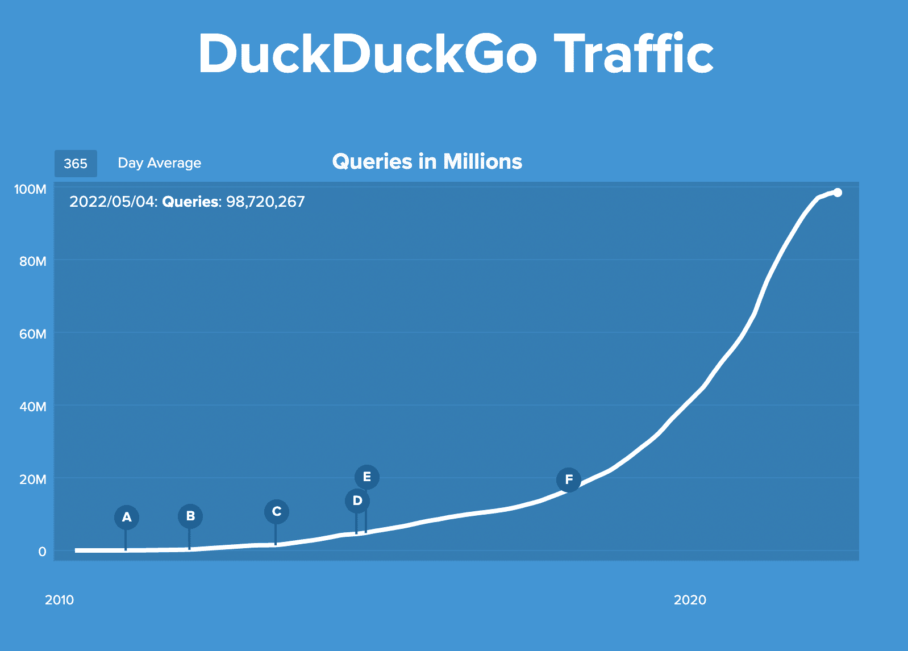

<noscript>T3】</noscript>

几年来，人们一直在质疑 DuckDuckGo 是否会继续增长，因为隐私在未来可能会变得不那么令人担忧。

然而，我喜欢称之为[隐私作为一种商业模式](https://fourweekmba.com/privacy-as-a-business-model/)已经被证明对 DuckDuckGo 来说是极其强大的。隐私成为一种[商业模式](https://fourweekmba.com/what-is-a-business-model/ "business model ")，因为它影响整个商业。

## **什么是 DuckDuckGo？**T3】

<u>[duck duck go](https://duck.co/help/company/what-is-duckduckgo)</u><u>是一个通用搜索引擎，专注于隐私。虽然我会称之为搜索引擎 DuckDuckGo 更多的是一个**混合引擎**。简而言之，它一方面使用专有爬虫。另一方面是其他网站的 API。</u>

 <u>任务很明确，DuckDuckGo 不存储你的个人信息。因此，您的个人信息也不会被共享。简而言之，它们解决了一个感觉到的问题，那就是隐私。

然而，这并不是 DuckDuckGo 开始时的主要任务，而是在过程中进行的调整，这使得它[获得了牵引力](https://fourweekmba.com/business-development/)(我们将在以后看到这一点)。

作为一个通用引擎，DuckDuckGo 的使命是为用户提出的尽可能多的问题提供即时答案。在我们深入技术问题之前，让我们先回答一个问题，当我开始了解更多信息时，我就有这个问题:

这一切是如何开始的？

## **撰写本文时的 duck duck go**

DDG 远远不是搜索引擎行业的顶级玩家。通过 SimilarWeb 的快速比较，我们可以理解 DDG 仍然是多么小。

[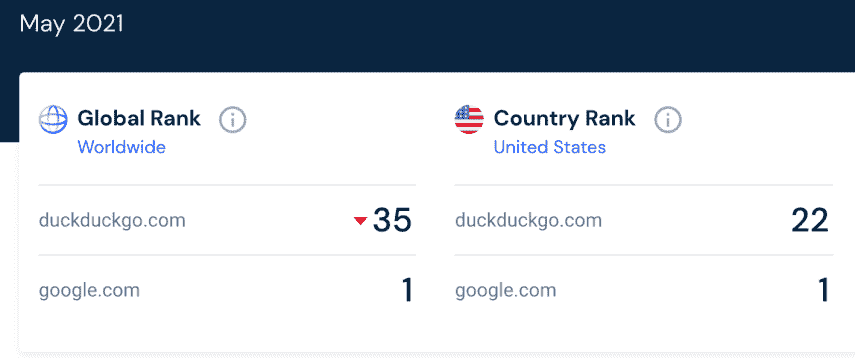

<noscript></noscript>](https://fourweekmba.com/duckduckgo-vs-google/screenshot-2021-06-09-at-17-31-01/) [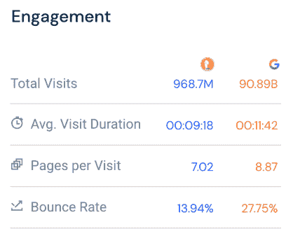

<noscript></noscript>

T11】](https://fourweekmba.com/duckduckgo-vs-google/screenshot-2021-06-09-at-17-31-08/)

正如你从 SimilarWeb 数据中看到的，DDG 仍然是谷歌流量的 1/100。

然而，它正在快速增长，鉴于数字广告领域越来越多的变化，从长远来看，它可能会对谷歌的整体商业模式构成威胁。

然而，仅仅将其与谷歌进行比较是不公平的，因为 DDG 仍然是一个专注于隐私的利基搜索引擎。因此，我们可以说这是一个相当大的问题。

众所周知，历史是由胜利者书写的，到目前为止，谷歌已经塑造了网络的未来。然而，如果说有一件事是历史教给我们的，也是技术强化的，那就是看似意想不到的事情往往会发生。

因此，当我开始钻研 DuckDuckGo 的故事时，一个问题突然出现在我的脑海中，那就是“如果 DuckDuckGo 取代谷歌征服了网络，会怎么样？网络会是什么样子？”

我浪漫的一面试图让我相信另一个网络是可能的。我们不应该有广告占主导地位、假新闻以光速传播、社交媒体成为主流的互联网！

另一方面，我理性的一面带来了一些有趣的观点。首先，到底是谁说我们应该拥有网络？那么，为什么不惊讶地看着我们成功建造的东西呢？即使社交媒体是网络的产物，它也是博客。

如果博客不存在，我就不会在这里告诉你我的故事。所以毕竟事情看起来并不像我浪漫的一面希望我相信的那么糟糕。这就是为什么我要如实对待这个故事，尽可能保持中立。

简而言之，让我们开始说**这是一个公司试图建立一个不同的网络**的故事。一个商人掌握了牵引的[艺术的故事。](https://fourweekmba.com/business-development/)

加布里埃尔·温伯格的故事不止于此。这是一个 27 岁的男人独自坐在房间里的叙述。思考下一步该做什么。一个摆脱了经济需求的人带着无聊离开了，无聊是所有发明之母！

## **duck duck go 之前:加布里埃尔·温伯格是谁？**T3】

加布里埃尔·温伯格出生于 1979 年，曾就读于麻省理工学院。他一离开麻省理工学院(那是在 2000 年)，就创办了一家名为 Learnection 的教育软件公司。目的是让父母更多地参与孩子的学校生活。

换句话说，一个原始的社交网络。正如加布里埃尔·温伯格在接受《福布斯》采访时所报道的那样，

> 我三年后毕业。但是我很幸运，我的祖母给我留下了四年大学的学费。我用它筹集了一些朋友和家人的钱。我损失了所有的钱，在 30，000 到 45，000 美元之间。

作为一名企业家，这些开端并不光明。当被问及失败的原因时，加布里埃尔·温伯格强调他做了很多错事，包括雇佣他的朋友，这被证明不是最好的选择。

他接下来做了什么？在接受福布斯采访时，他回答道:

> 我又创办了四到六家各种各样的公司。其中一个成功了。它是一家早期的社交网络公司。该产品被称为 NamesDatabase。这是找到老同学和老朋友的一种方式。鉴于脸书，这是一个完全不合时宜的概念，但这是在 2003 年至 2006 年之间。2006 年，我以 1000 万美元的价格把它卖给了 classmates.com。

据 Gabriel Weinberg 称，names database——为 DuckDuckGo 搭建舞台的公司——之所以成功，是因为它在推出产品之前就专注于获得用户！

他喜欢称之为**牵引**。简而言之，要使一个企业成功，你必须把一半时间花在产品上，另一半时间花在获得客户上。从业务和产品开发的结合来看，有牵引力。

尽管 NamesDatabase 是一个成功的企业，但它还缺少一些东西。加布里埃尔·温伯格承认自己不是一个社交网络高手。

简而言之，他对自己正在做的事情缺乏激情。因此，他自然而然想到的下一个问题是“**我能做些什么让我保持至少十年的热情？**

事实上，加布里埃尔·温伯格认为，这是一家企业取得成功并获得适当规模增长的牵引力所需的最短时间。这个问题的答案很快就出来了。

# **个体户之道**

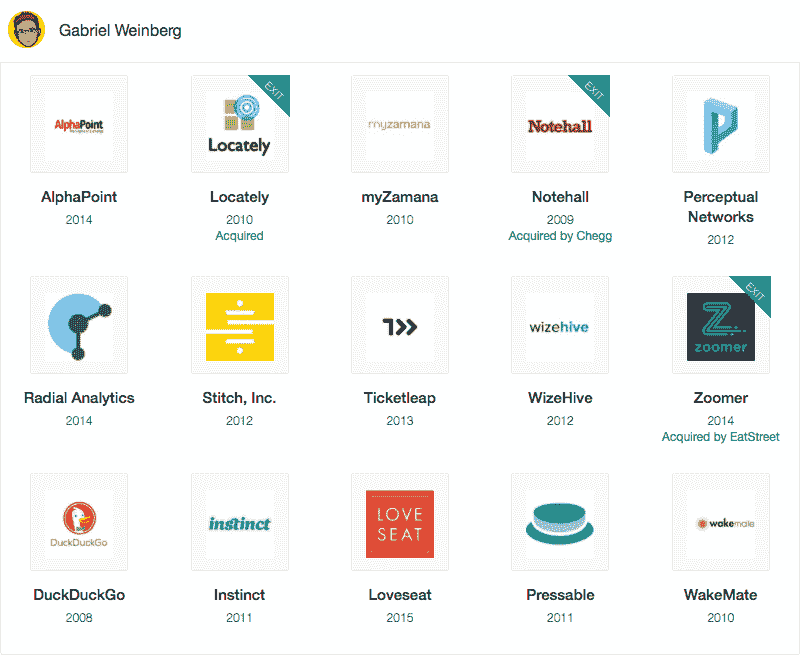

<noscript>T3】</noscript>

**来源:**【angel.co】T2

加布里埃尔·温伯格独自坐在费城的新家里，生平第一次无所事事。2006 年 3 月，他卖掉了自己联合创立的名为 Opobox 的公司。)

这是一项社交网络服务，以 1000 万美元的价格卖给了。

在成功退出的时候，加布里埃尔和他的妻子正从波士顿附近的一套 865 平方英尺的公寓搬到费城郊外的一栋乡间别墅。

当时还是 27 岁的加布里埃尔·温伯格还太年轻，不能退休。他独自一人，无事可做，在他家方圆数百英里内也没有一个认识的人，他开始修补东西。

有了这些钱，下一步该做什么？他没有什么可失去的，所以他开始了一些副业。

从抓取维基百科到寻找任何问题的答案；从识别垃圾邮件和分类分析到社区建设。

正如 Gabriel Weinberg 在他的书的序言中所回忆的那样，在[牵引](https://www.amazon.com/Traction-Startup-Achieve-Explosive-Customer-ebook/dp/B00TY3ZOMS)和一系列[对创始人电影的采访](https://www.youtube.com/watch?v=IQfIxBint4w)中，他达到了**可以同时承担几十个副业项目的地步**。

他的目标很简单:**确定他不喜欢的项目，同时继续做他觉得有激情的项目**。这就是他如何开始数千个兼职项目的原因。他发现最有趣的副业是那些围绕搜索的项目。

他对搜索的观点很独特。事实上，在人工智能处于萌芽阶段的时代，加布里埃尔·温伯格(Gabriel Weinberg)持有不同寻常的观点。

他一直认为最有趣的信息在人们的头脑中。算法的工作是识别这些信息，并给出其他人正在寻找的答案。

今天[谷歌称之为特色片段](https://fourweekmba.com/featured-snippet-vs-knowledge-panel/)，作为发现用户问题的尝试，DuckDuckGo 从第一天起就称之为即时答案。

换句话说，DuckDuckGo 的主要任务之一就是试图回答尽可能多的问题。

搜索引擎不是让算法制造答案，而是作为一种媒介，在人们的头脑之间架起桥梁，分享他们所知道的东西。

我相信这个故事中还有另外两件特别的事情。首先， **DuckDuckGo 并不是从一个试图寻找终极算法的书呆子开始的**。

相反，他只是想让搜索不那么垃圾，更注重隐私，能够找到更多即时答案。第二，尽管加布里埃尔·温伯格并不热爱社交网络(尽管他通过出售一个社交网络获得了财务自由)。

他理解社区的价值。事实上，一个名为 Hacker News 的在线社区将率先看到 DuckDuckGo 的行动，并帮助它获得一些牵引力。

## 是时候进行更多的修补了:加布里埃尔·温伯格在卖掉他的第一个成功的创业公司后做了什么？T3】

在所有这些修补之后，加布里埃尔·温伯格注意到了两件事。

首先，谷歌经常用一堆垃圾广告来回馈网站。我们不要忘记[谷歌是一家广告公司，](https://fourweekmba.com/how-does-google-make-money/)它的大部分收入来自广告。

在我们继续这个故事之前，我想给你一个关于谷歌商业模式的快速展望。我查了谷歌 2016 年的 10K。这是公司必须向证券交易委员会提交的年度报告。

<colgroup><col> <col> <col> <col></colgroup>
| **谷歌 10K 报告——以百万计** | **2014 年** | **2015 年** | **2016 年** |
| **总收入** | Sixty-six thousand and one | Seventy-four thousand nine hundred and eighty-nine | Ninety thousand two hundred and seventy-two |
| **广告收入** | Fifty-nine thousand six hundred and twenty-four | Sixty-seven thousand three hundred and ninety | Seventy-nine thousand three hundred and eighty-three |
| **广告/收入百分比** | 90.34% | 89.87% | 87.94% |

*如你所见，2016 年，**谷歌 790 亿美元的收益来自广告**。这几乎代表了 T4 总收入的 88%。尽管 2014 年来自广告的收入更高(超过 90%)，但谷歌绝对是一家广告公司，没有什么能让我们相信未来会发生变化。我为什么要告诉你这些？作为一家大部分收入来自广告的公司，谷歌可能会偏向于独立于用户利益的广告利润最大化。*

*那么 [DuckDuckGo 商业模式](https://fourweekmba.com/duckduckgo-business-model/)呢？DuckDuckGo 怎么赚钱？稍后我们会更详细地看到它。*

**第二个**，找东西的时候，Google 没有提供答案。这使得 Gabriel Weinberg 去维基百科和 IMDb 等主要网站寻找答案。仅仅这两件事就让他意识到，仍然有空间创造一个搜索引擎，能够根据网络社区提供的信息提供他后来称之为*的即时答案*。这就是一年半后他意识到自己有所发现的原因。某样东西即将成为一个以鸭子为标志的搜索引擎。

## **扳动开关:单飞**

一天，当加布里埃尔·温伯格和他的妻子散步时，一个名字突然出现在他的脑海里。几乎就像那些进入你脑海的东西一样，加布里埃尔·温伯格可以听到“DuckDuckGo”

这就是他如何决定不管他的下一个公司是什么，他都会把它叫做 DuckDuckGo！(虽然名字本身来源于儿童[游戏鸭鸭鹅](https://en.wikipedia.org/wiki/DuckDuckGo#History))

然后 2008 年到了。他已经把拼图拼在一起，创造出他心目中可行的搜索引擎版本。

准备启动加布里埃尔·温伯格开始谈论他即将启动的项目。大多数听到他谈论这个项目的人都觉得他疯了，而不是变得兴奋。

一个 30 多岁的年轻人如何与谷歌这样的巨头竞争？那时，谷歌已经价值约 1000 亿美元。当谷歌被证明相当可靠时，为什么还有人会转向其他搜索引擎呢？

它的算法不仅给了用户他们正在寻找的东西(或者至少是他们认为他们正在寻找的东西)，而且还有一个基于谷歌和试图弄清楚谷歌算法如何工作的在线营销人员之间斗争的整个行业的兴起:SEO 行业。一个新的搜索引擎会引起这个行业的注意吗？它可能不会，事实上，它没有。

Gabriel Weinberg solo 于 2008 年 9 月 25 日推出。

在国际报纸上，没有 DuckDuckGo 发射的踪迹。这没有发生，因为这不是加布里埃尔·温伯格所寻求的。

他只是想知道他是否在正确的轨道上建立他心目中的那种搜索引擎。

那一天，他就是这样在一个名为黑客新闻的论坛上发布了 DuckDuckGo，

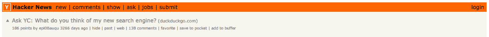

<noscript>T3】</noscript>

反馈很快就到了，

[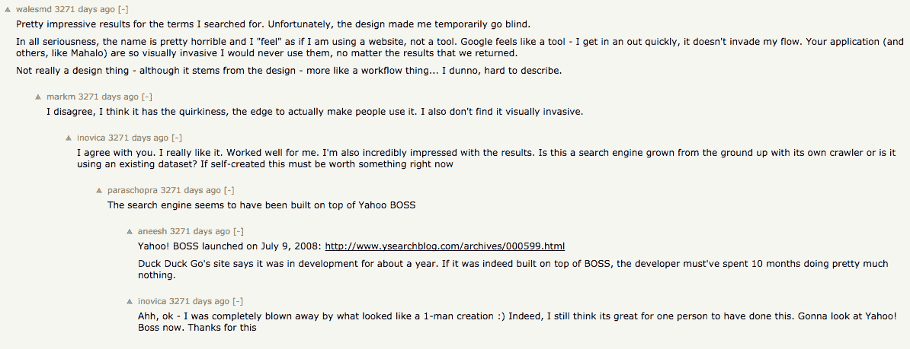

<noscript></noscript>](https://i0.wp.com/fourweekmba.com/wp-content/uploads/2017/09/Screen-Shot-2017-09-10-at-08.54.05.png?ssl=1) 

**来源** : [新闻。y 合成器](https://news.ycombinator.com/item?id=315142)

从“可怕的名字”到人们被 DuckDuckGo 对个人开发和发布的效率所震惊；毕竟，加布里埃尔·温伯格明白他卷入了一些事情。是时候开始专注于获得牵引力了！

## 对 DuckDuckGo 第一位用户的简短采访

我有幸采访到了 DuckDuckGo 的第一位用户 Michael Wales:**[**@**Wales MD](https://twitter.com/walesmd)**

 **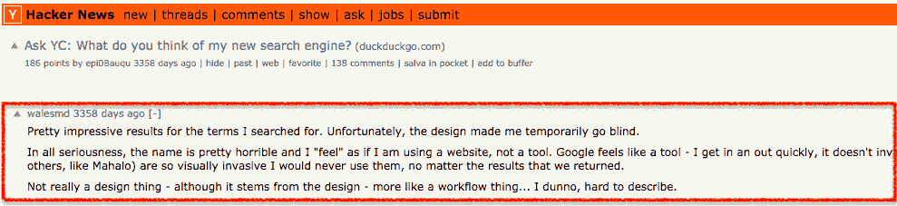

<noscript>T3】</noscript>

***我** : 你愿意告诉我你的故事吗，你是如何见证 DDG 这些年的发展的？*

**MW** :他(*指的是 DuckDuckGo 的首席执行官，Gabriel Weinberg* )非常善于接受反馈，并随着时间的推移对重要的部分进行改进/迭代。但他也不只是屈服于每个人的要求。  玩长线游戏，有足够的经济能力去修补他需要的东西，真的很有帮助。    我似乎记得早在斯诺登事件之前，隐私/禁止跟踪就被“精选”并经常被谈论。    说实话，黑客新闻社区正是那种把隐私/安全之类的事情看得很重的人，所以很多人都愿意为了那些回报去处理一些痛苦。

许多人编写插件之类的东西来把他们的浏览器切换到 DDG。这个群体与 Reddit 的交叉率也很高，所以那里有很多[增长](https://fourweekmba.com/growth-hacking/ "growth")。

出版商对即时回答有些担忧，谷歌也因此受到了抨击；因为它减少了网站的流量。

有一篇很好的文章，作者是一个维护名人净资产数据库的人，他写了谷歌的即时回答如何摧毁了他的收入(因为它从他的肯定中获得数据，但没有人点击，这是在卡片上)。

***我**:你还记得你第一次见到 DDG 的感觉吗？比如当你偶然发现它时你在做什么，或者有什么特别的事情突然出现在你的脑海中，但你没有在评论中分享？*

MW :所以，那是 2008 年 9 月。我当时在黑客新闻上非常活跃，因为我即将离开空军，并试图进入一个工程师的角色——我在中学时是一名自学成才的开发人员。

《黑客新闻》是我了解科技新动态并提出自己的产品想法的途径。本质上，我是一个连续创业者。    当我第一次看到这个帖子的时候，我在想，“伟大的另一个孩子写了一个可怕的索引器，并认为他们将解决谷歌。”有点像每个人都想把 MMORPG 作为他们的第一个游戏…不会发生。这个设计也无助于缓解任何第一印象。太丑了！把每一个“Web 2.0”的配色方案、渐变和阴影都用上。    但是，后来……我搜了。这时候一切都变了。结果真的很好，与谷歌竞争。比起产品本身，我对它背后的技术更感兴趣。很明显，这个人知道他们在做什么，我很高兴他坚持下去。这几年改进了很多，包括设计。    最后，对我来说，隐私成分还不够大，不足以让我去切换。我有一部谷歌手机、谷歌主页和 2 个 GSuites(所以我所有的文件、电子邮件，所有的东西)。我不得不承认，谷歌对我的了解总是比我知道的多，我相信他们会利用这一点来改善我对他们产品的体验。另外，我在国家安全局工作了 3 年

<noscript></noscript> 

## 挑战现状:当你是最后一个进入市场的人时，你如何让人们转向你的服务？T3】

就像任何一家开始进入由其他公司主导的市场的公司一样，最大的挑战是让用户转向你的产品或服务。同样的问题也适用于 DuckDuckGo。

当你已经对谷歌的答案很满意的时候，为什么还有人会转向一个名字奇怪的搜索引擎呢？另外，当你可以通过世界上最受欢迎的网站浏览网页时，你为什么要换到一个不知名的网站呢？

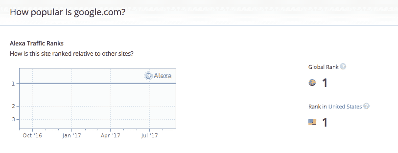

<noscript>T3】</noscript>

找到这些问题的答案意味着 DuckDuckGo 的成败。是时候找到一个钩子了，一个能吸引人们足够长时间注意力的东西，让他们转向这个新的搜索引擎。

# **成长的 19 个通道:DuckDuckGo 是如何开始获得牵引力的？**T3】

DuckDuckGo 的[成长](https://fourweekmba.com/growth-hacking/ "growth")不是一天发生的，而是花了六年多的时间。在 2008 年 9 月推出后，Gabriel Weinberg 花了两年时间改进 DuckDuckGo。正如他在 2016 年[福布斯采访中承认的那样，](https://www.forbes.com/sites/forbestreptalks/2016/02/19/the-founder-of-duckduckgo-explains-how-to-get-customers-before-you-have-a-product-and-why-challenging-google-isnt-insane/2/#267b3bb71d46)

> 我在 2008 年底创办了 DuckDuckGo，2009 年 3 月，我的第一个儿子出生了，我决定至少在最初的两年里和他呆在家里。在那两年里，我只是坚持不懈地摆弄它。在 2010 年底，该项目的所有迭代工作都变得更好了。有东西点击了一下，人们开始转向它。然后在 2011 年，我开始把它当成一个真实的东西，在 2011 年底，我从联合广场风险投资 T5 那里筹集了 300 万美元。

筹到钱后，是时候考虑生意了。正如我们所见，加布里埃尔·温伯格从他以前的投资中了解到，如果他想创办一个成功的企业，他必须照顾好分销方面。他还认为，对于一家初创公司来说，[增长](https://fourweekmba.com/growth-hacking/ "growth")过程并不是太线性。

简而言之，对于每个[增长](https://fourweekmba.com/growth-hacking/ "growth")阶段，都有有效的渠道和无效的渠道。通常，要想在某个阶段突破创业公司的[增长](https://fourweekmba.com/growth-hacking/ "growth")，你必须尝试几种渠道。

与此同时，当达到一个阈值[增长](https://fourweekmba.com/growth-hacking/ "growth")时，一些通道停止工作，你必须试验新的通道。这些想法在他的书《牵引》中成熟了。

在这本书里，**加布里埃尔·温伯格确定了 19 条[增长](https://fourweekmba.com/growth-hacking/ "growth") :** 的渠道

1.  瞄准博客
2.  宣传
3.  非常规公关
4.  搜索引擎营销
5.  社交和展示广告
6.  线下广告
7.  搜索引擎优化
8.  内容营销
9.  电子邮件营销
10.  病毒式营销
11.  工程营销
12.  业务发展
13.  销售额
14.  加盟计划
15.  现有平台
16.  贸易展
17.  离线事件
18.  演讲约会
19.  社区建设

**来源** : [媒介](https://medium.com/@yegg/the-19-channels-you-can-use-to-get-traction-93c762d19339)

然而，这些渠道中的每一个都必须经过测试。你如何确定一个渠道是否适合[增长](https://fourweekmba.com/growth-hacking/ "growth")？加布里埃尔·温伯格的回答依赖于靶心框架！

## 什么是牛眼框架？

靶心框架遵循三个简单的步骤，目的是击中一个目标:牵引力！

第一层是关于什么是可能的。换句话说，这是一个头脑风暴阶段，团队开始为每个渠道收集至少一个[策略](https://fourweekmba.com/business-strategy/ "strategy")，用于开始“移动[增长](https://fourweekmba.com/growth-hacking/ "growth")的针”

第二层是关于可能发生的事情。简而言之，这是你开始试验和测试第一步中头脑风暴的策略的阶段。在这里，从廉价的测试开始是至关重要的。

这不是你必须全押的阶段。把它看作是一个测试阶段。在那里你开始测试市场，看看什么行得通，什么行不通。

**内圈就是靶心**。这就是你确定推动[增长](https://fourweekmba.com/growth-hacking/ "growth")的渠道。

因此，至少要关注他们，直到他们将引导你的创业进入下一个[成长](https://fourweekmba.com/growth-hacking/ "growth")阶段。最终，你将重新开始这个过程，以确定哪个或哪些渠道将在下一个[增长](https://fourweekmba.com/growth-hacking/ "growth")阶段发挥作用(要深入了解，请转到[中期](https://medium.com/@yegg/the-bullseye-framework-for-getting-traction-ef49d05bfd7e))。

[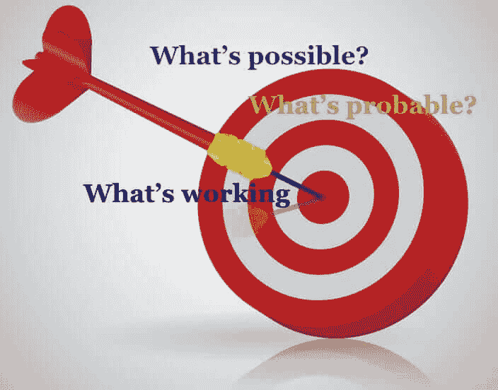

<noscript></noscript>](https://i0.wp.com/fourweekmba.com/wp-content/uploads/2017/09/Untitled.001.jpg?ssl=1) 

## DuckDuckGo 成长，解释

DuckDuckGo 稳步增长，直到 2013 年其[增长](https://fourweekmba.com/growth-hacking/ "growth")复合增长。部分[增长](https://fourweekmba.com/growth-hacking/ "growth")归功于 Gabriel Weinberg 确定的渠道。一个渠道非常适合推动其[增长](https://fourweekmba.com/growth-hacking/ "growth")，这在某种程度上是意料之外的:病毒式传播。

DuckDuckGo 的[成长](https://fourweekmba.com/growth-hacking/ "growth")到目前为止主要由四个阶段组成(我认为 Safari 和 Firefox 处于同一个[成长](https://fourweekmba.com/growth-hacking/ "growth")阶段)。让我们看看它们是如何进化的，

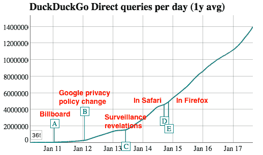

<noscript>T3】</noscript>

**来源:**<u>[【duckduckgo.com】](https://duckduckgo.com/traffic.html)</u>

## 第一阶段，广告牌

[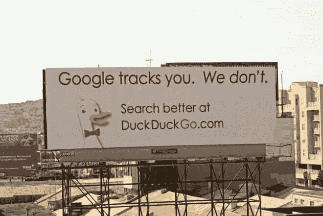

<noscript></noscript>](https://i0.wp.com/fourweekmba.com/wp-content/uploads/2017/09/ddg_billboard2-660x441.jpg?ssl=1) 

**来源** : [连线](https://www.wired.com/2011/01/duckduckgo-google-privacy/)

2011 年，加布里埃尔·温伯格(Gabriel Weinberg)开始尝试用广告牌做线下广告，上面写着“谷歌跟踪你”。我们没有。”

据《连线》报道，**这场运动为期四周，耗资 7000 美元，从*在* *科技密集的索玛区、**沿高速公路开始，将汽车从海湾大桥卸到三藩市。***

这不是加布里埃尔·温伯格尝试的第一个频道。事实上，在此之前，DuckDuckGo 已经通过两个主要渠道达到了每天超过 160，000 次的查询(根据 [Wired](https://www.wired.com/2011/01/duckduckgo-google-privacy/) ):黑客新闻(当 DuckDuckGo 推出时我们看到了)和 Stumbleupon。毕竟对于一次单独发射来说还不错！(虽然 2011 年 DuckDuckGo 更有结构)。是时候破解第二个[成长](https://fourweekmba.com/growth-hacking/ "growth")阶段了。

## 第二阶段，谷歌隐私政策变更

2012 年[谷歌更新了隐私政策](https://www.washingtonpost.com/business/technology/faq-googles-new-privacy-policy/2012/01/24/gIQArw8GOQ_story.html?utm_term=.4d392c941aaa)，整合了 Gmail、YouTube 和其他 57 项谷歌服务的所有数据。虽然谷歌开始将其服务提升到一个新的水平是一个伟大的举动(这种整合使谷歌能够为其用户提供更多“酷东西”)，但它也开始引起人们对隐私的第一次关注。事实上，用户不能选择退出该政策。这也是[成长的第三阶段](https://fourweekmba.com/growth-hacking/ "growth")出乎意料的地方。

## 第三阶段，监控揭露

2013 年，中情局电脑分析师爱德华·斯诺登泄露了机密信息，揭露了美国国家安全局和其他机构的几个全球监控项目。**公众舆论对隐私的担忧就是这样产生的。**

**这也是 DuckDuckGo 最终理解其吸引用户从其他搜索引擎转移的方式**(隐私从一开始就是该公司的主要使命之一，但在 2013 年，它成为了[增长的主要驱动力](https://fourweekmba.com/growth-hacking/ "growth"))。

从那时起，隐私成了公司的首要任务(以及寻找即时答案)，也是促使[增长的因素](https://fourweekmba.com/growth-hacking/ "growth")。事实上，正如加布里埃尔·温伯格一直强调的那样，你不需要通过跟踪别人来用广告赚钱。

### 不追踪用户怎么赚钱？

你只需要一个关键词。例如，假设我正在寻找一台新电脑，我在搜索框中输入关键字“新电脑”,你要给我看的就是与之相关的广告。我不一定要看到我过去一直在寻找的所有东西。

这就是为什么我经常找到建议去买我已经有的东西。此外，我的计算机可能已经被其他人使用过，这使得我的导航历史对于我所需要的来说毫无价值。简而言之，当广告与一个搜索词而不是你的导航历史联系在一起时，可能会更有效。

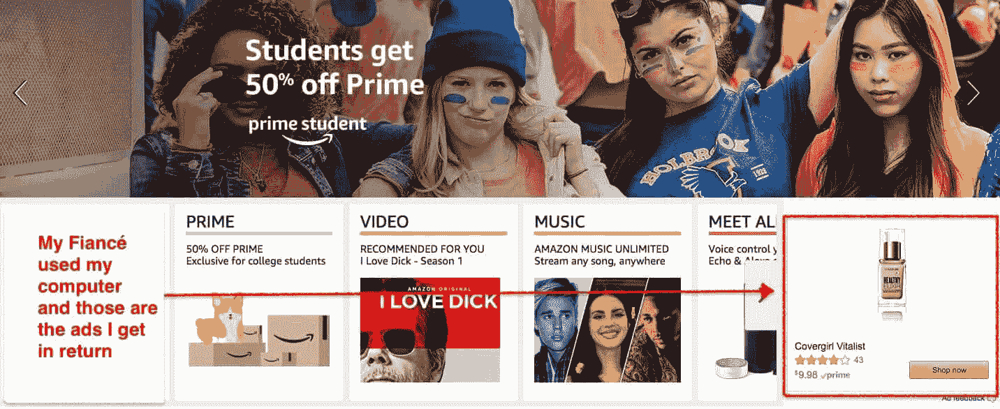

<noscript>T3】</noscript>

一旦斯诺登事件在全球扩散，加布里埃尔·温伯格明白他必须全力以赴保护隐私！

### **寻找钩子:以隐私为使命宣言**

最初，该公司的主要目的不仅仅是隐私。事实上，当 DuckDuckGo 推出时，他们主要关注的是清除垃圾邮件，并找到尽可能多的即时答案。

然而，在发布之后，加布里埃尔·温伯格被媒体问及隐私问题，这是他从未想过的。所以他去寻找它，他发现了一些让他深思熟虑的事情。

首先，**数据是最私人的，因为你不会考虑你在搜索什么**。换句话说，当你想解决一个问题时，你脑子里想的都是你的目标。你不关心你的隐私。因此，你在没有意识到的情况下放弃了最明智和最隐私的信息。这些信息被跟踪和存储。

其次，被跟踪和存储的数据最终会被分发给政府和营销人员。

第三，搜索也可以在不追踪个人数据的情况下进行。这些事情使 DuckDuckGo 改变了道路，开始将它的使命集中在隐私上。那是 2007 年初。从那时起，隐私就成了公司关注的焦点之一。

这就是为什么以及如何在 2013 年斯诺登事件爆发时，DuckDuckGo 发现自己处于完全有利的位置来充分利用丑闻。那是一只积极的黑天鹅！

## 第四阶段，Safari 和 Firefox

2015 年，DuckDuckGo 终于登陆了 [Safari](https://duck.co/blog/post/89/safari) 和 [Firefox](https://duck.co/blog/post/126/firefox) 内置搜索选项。除了对 DuckDuckGo 的[增长](https://fourweekmba.com/growth-hacking/ "growth")的重要性，这也是混合动力引擎最终被行业巨头(谷歌、雅虎和必应)接受的关键一步。

***注**:即使我把 DuckDuckGo 的[成长](https://fourweekmba.com/growth-hacking/ "growth")分为四个阶段；事实上，自其推出以来，它从未停止增长。2012 年，Gabriel Weinberg 确认 DuckDuckGo 已经在以每年 500%的速度增长。*

## 黑客新闻:强大的社区对创业的重要性

正如我们到目前为止所看到的，[成长](https://fourweekmba.com/growth-hacking/ "growth")是一个通过掌握可用获取渠道的能力的过程。要掌握这些，重要的是不断测试，只选择在[增长](https://fourweekmba.com/growth-hacking/ "growth")过程的每个阶段都能推动指针的渠道。牛眼框架是一个用来测试和选择这些渠道的好框架。

然而，这也是对任何创业公司的成长至关重要的另一个方面。这是一个支持你的强大社区。这里的支持不是指财务上的，而是指产品开发方面的；这样你才能尽快达到所谓的产品/市场契合度。

在 DuckDuckGo 事件中，黑客新闻在维持和推动不跟踪你的搜索引擎的增长方面发挥了关键作用。回到 2015 年 10 月 8 日，加布里埃尔·温伯格承认了这一点:

> 感谢 HN:帮助我获得 DuckDuckGo 和牵引书——AMA 的牵引力
> 
> (这是我的旧用户名，我认为它很适合这篇文章。你现在可能知道我叫耶格。)
> 
> 七年前在 HN(当时是创业新闻)上推出 duck duck go:[https://news.ycombinator.com/item?id=315142](https://news.ycombinator.com/item?id=315142)和五年前牵引书的想法:[https://news.ycombinator.com/item?id=2098068](https://news.ycombinator.com/item?id=2098068)。如果我没有在这些帖子中得到鼓励和兴奋(我做到了！)然后我可能很快就戒掉了。所以谢谢你！
> 
> 在 2009-2010 年，当我在努力为 DuckDuckGo 吸引眼球时，我开始在我的博客上对成功的创始人进行一系列采访，讲述他们是如何吸引眼球的，试图揭示这样做的结构化过程。很自然地，我采访了很多 HN 的名人，如 patio11 (Patrick McKenzie)，justin (Justin Kan)，garry (Garry Tan)，kno thing(Alexis Ohanian)和其他创业偶像如 Eric Ries，吉米·多纳尔·威尔士等。去年我在 YouTube 上放了一些早期的采访，如果你想看的话:[https://www.youtube.com/user/tractionbook](https://www.youtube.com/user/tractionbook)T3】
> 
> 如果我不是 HN 社区的一员，我可能不会接受这些采访，也不会发表一系列博客文章，这些文章吸引了我的写作，反过来也吸引了 DuckDuckGo。
> 
> HN 的许多人都使用过 DuckDuckGo 并阅读了这本书，对这两者都给出了很好的反馈，我们对其中的许多内容采取了行动，从而使这些东西成为今天的样子。想到这一点的直接原因是这本书的第二版昨天出版了，我正在反思。
> 
> 我非常感激能成为这个社区的一员。问我任何问题，我会尽力帮忙。

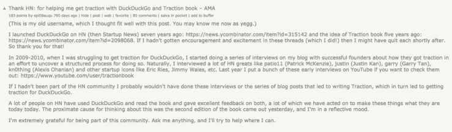

<noscript>T3】</noscript>

你可以在这里看到原消息[。](https://news.ycombinator.com/item?id=10346268)

像任何处于成长初期的创业公司一样，如果你想让它持续发展，你必须找到一个对你的项目有信心的社区(也可以是一个很小的社区)。

此时出现了一个问题，

鸭鸭哥内部: 鸭鸭哥 如何赚钱？

DuckDuckGo 通过两种简单的方式赚钱:

**广告**:根据你在搜索框中输入的关键词显示广告

**代销商收入**:通过亚马逊和易贝代销商计划。当用户通过 [DuckDuckGo](https://fourweekmba.com/duckduckgo-business-model/) 到达那里后购买时，公司会得到一小笔佣金

广告方面很简单。正如我们所看到的，你必须跟踪用户来做广告是一个神话。事实上，一旦一个人在搜索框中输入一个关键词，如果这个关键词可能与一个产品相关，那么搜索引擎可能会在结果中返回一个广告。例如，如果我正在搜索“汽车保险”，那么搜索引擎将返回一个与之相关的广告。就这么简单！

## duck duck go 盈利吗？

据 Gabriel Weinberg 在 2015 年所说，[公司已经盈利](http://fortune.com/2015/10/09/duckduckgo-profitable/)，其[收入超过 100 万美元](https://www.forbes.com/sites/forbestreptalks/2016/02/19/the-founder-of-duckduckgo-explains-how-to-get-customers-before-you-have-a-product-and-why-challenging-google-isnt-insane/#1bae7c354e89)。**相比谷歌的 749 亿！简而言之， [DuckDuckGo 收入](https://fourweekmba.com/duckduckgo-business-model/)占谷歌收入的 0.001%。**

然而，在这种情况下，比较这两个商业搜索引擎可能会产生误导。事实上，谷歌有一个稍微不同的[商业模式](https://fourweekmba.com/what-is-a-business-model/)。事实上，尽管它的大部分收入来自广告，但它采用了不同的方式。谷歌有两个主要网络:

简而言之，b 企业可以通过 AdWords 赞助他们的产品或服务，并对关键词进行竞价。点击赞助链接，像“汽车保险报价”这样的关键词，成本低至 2 美元，高至 54.91 美元所谓的每次点击费用(CPC)

另一方面，出版商可以通过 AdSense 托管 AdWords 网络公司部分的横幅广告或广告，将他们的内容货币化。出版商从每一千次展示中获得报酬。这就是所谓的每千分之一成本(CPM)或每千成本。

这些不仅是谷歌商业模式的组成部分，也是其中重要的一部分。

搜漏:DuckDuckGo 是怎么工作的？

如[DuckDuckGo.com](https://duckduckgo.com/privacy)所述

> 在其他搜索引擎，当你进行搜索并点击链接时，**你的搜索词会被发送到你点击的那个网站(在** **[HTTP referrer 头](https://duckduckgo.com/HTTP_referrer))。我们称这种个人信息的共享为“搜索泄露”**

[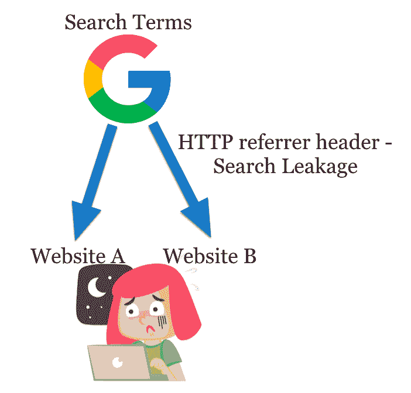

<noscript></noscript>](https://i0.wp.com/fourweekmba.com/wp-content/uploads/2017/09/Screen-Shot-2017-09-10-at-00.23.51.png?ssl=1) 

问题是你不仅与搜索引擎分享个人信息，还与你登陆的网站分享。显然，这些信息也可能被用来追踪你。

DuckDukcGo 呢？

> DuckDuckGo 默认防止搜索泄露。相反，当您点击我们网站上的链接时，我们会将该请求进行路由(重定向),使其不会将您的搜索词发送到其他网站。其他网站仍然知道你访问过他们，但是他们不知道你之前输入了什么搜索。

这同样适用于搜索历史和所有可以从存储的数据中找到的相关信息。要查看更多细节，请前往 [DuckDuckGo](https://duckduckgo.com/privacy) 。

如果 DuckDuckGo 不追踪你，它怎么知道你在哪？

## duck duck go 怎么知道我在哪里？T3】

> 参见我们的 [本地结果](https://duck.co/help/results/local-results) 帮助页面。TL；dr:我们可以匿名地从网络浏览器自动发送的信息中获得位置，并在即时提供本地结果(如天气或餐馆信息)后立即丢弃它。T9】

DuckDuckGo 创始人兼首席执行官加布里埃尔·温伯格在 Quora 上回答道。

好吧，与谷歌相比，DuckDuckGo 有更好的隐私政策。然而它的用法呢？**duck duck go 相比 Google 有多有效？**

## 搜索:DuckDuckGo vs. Google

DuckDuckGo 提供了一些有趣的功能。

首先，*刘海*。简而言之，通过在搜索栏中插入一个网站它将返回给我的网页，该网站的所有结果，我在寻找什么。比如，我在 DuckDuckGo 搜索框中插入了“*！* tc" *DuckDuckGo* 其中" *tc"* 代表 *tech crunch* 后跟 *DuckDuckGo。*简而言之，我是说在 Tech Crunch 中寻找所有关于 DuckDuckGo 的信息，

[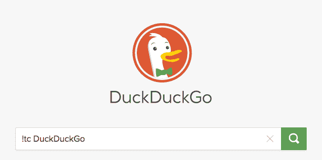

<noscript></noscript>](https://i0.wp.com/fourweekmba.com/wp-content/uploads/2017/09/Screen-Shot-2017-09-10-at-15.59.56.png?ssl=1) 

我将登陆目标网站中的一个页面，这是一种搜索或分类页面，

[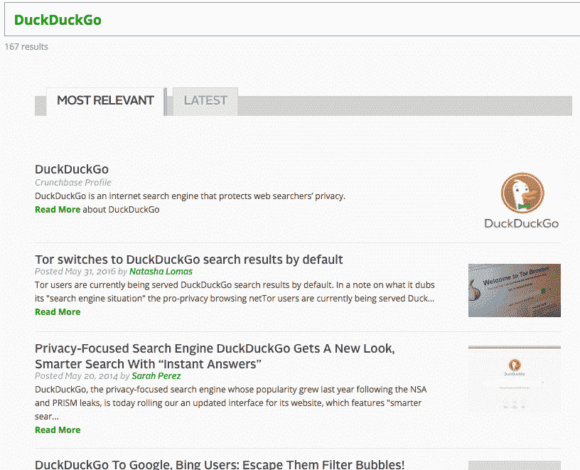

<noscript></noscript>](https://i0.wp.com/fourweekmba.com/wp-content/uploads/2017/09/Screen-Shot-2017-09-10-at-16.02.01.png?ssl=1) 

另一个有趣的功能是即时回答。从一开始，加布里埃尔·温伯格就致力于为用户的问题提供答案。今天我们所知道的谷歌上的[特色片段](https://fourweekmba.com/featured-snippet-vs-knowledge-panel/)。DuckDuckGo 的即时回答比 Google 的特色片段更有效率吗？

## 即时回答与精选片段

搜索的未来越来越与答案有关。此外，随着语音搜索的出现，人们将会更频繁地与他们的网站交谈，并寻找相关的答案。简而言之，搜索引擎匹配关键词的时代正在慢慢结束。Gabriel Weinberg 早在 2008 年就明白答案应该是搜索引擎的主要目的。当人类寻找某样东西时，提出问题(即使谷歌教我们用关键词思考)。

来自 DuckDuckGo 的答案被称为即时答案，来自各种来源(他们说总共超过 400 个)。

你输入一个问题，DuckDuckGo 匹配并触发答案，

[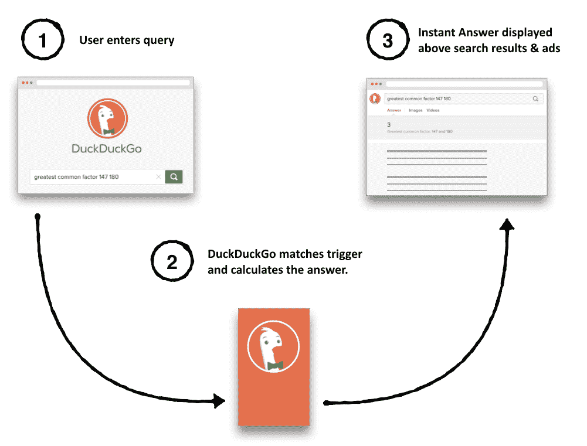

<noscript></noscript>](https://i0.wp.com/fourweekmba.com/wp-content/uploads/2017/09/basic_goodie_flow.png?ssl=1) 

**来源**:【docs.duckduckhack.com】T2

这就是你如何得到你一直在寻找的答案！

[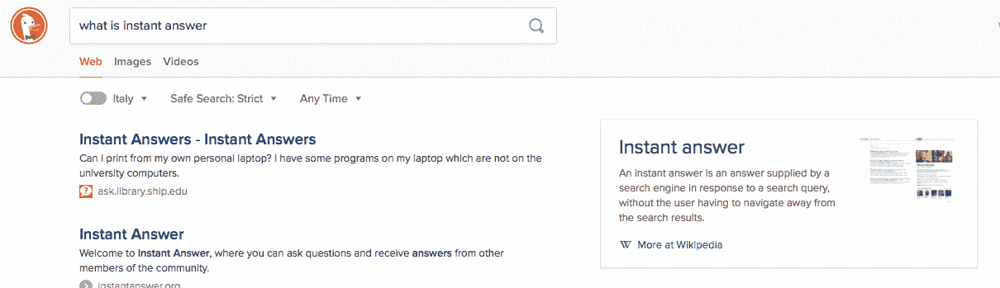

<noscript></noscript>](https://i0.wp.com/fourweekmba.com/wp-content/uploads/2017/09/Screen-Shot-2017-09-10-at-22.01.49.png?ssl=1) 

谷歌在给出答案方面也很强大；他们称之为特色片段，

[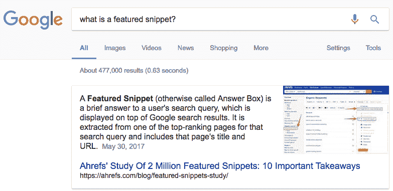

<noscript></noscript>](https://i0.wp.com/fourweekmba.com/wp-content/uploads/2017/09/Screen-Shot-2017-09-10-at-16.25.48.png?ssl=1) 

根据 [Stone Temple](https://www.stonetemple.com/featured-snippets-new-Insights-new-opportunities/) 的一项研究，2017 年，以片段为特色的查询超过 35 万次，

[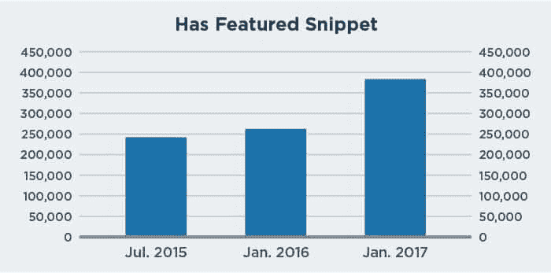

<noscript></noscript>](https://i0.wp.com/fourweekmba.com/wp-content/uploads/2017/09/featured-snippets-growth-chart-3.jpg?ssl=1) 

**来源**:【StoneTemple.com】T2

虽然 DuckDuckGo 解释了它的即时答案是如何成为特色的，但我们只能猜测谷歌。在 Stone Temple 所做的同样的分析中，谷歌的特色片段似乎比其他任何东西都更喜欢表格，

[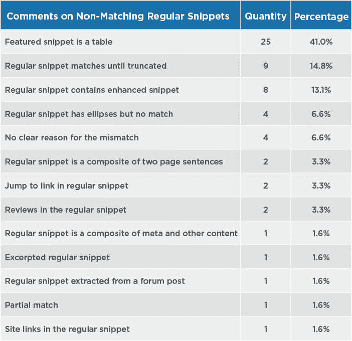

<noscript></noscript>](https://i0.wp.com/fourweekmba.com/wp-content/uploads/2017/09/detailed-regular-snippet-analysis-1.jpg?ssl=1) 

事实上，这也是为什么在线营销人员与谷歌合作更有吸引力。该公司和试图找出其算法的营销人员之间存在某种竞争。这种逆向工程也使谷歌比其他搜索引擎更有吸引力，比如 DuckDuckGo，在那里你所要做的就是上 [GitHub](https://github.com/duckduckgo/duckduckgo) 并通过 DuckDuckHack 帮助改善即时回答。

然而，这也是它令人恐惧的地方。想象一下，你有一个 99%的流量来自谷歌的网站。如果有一天谷歌决定对它的算法做一个小小的更新。这个更新会对你的网站产生巨大的影响。如果你的业务与你的网站紧密相连，那么你的财务自由取决于谷歌的情绪变化！

## DuckDuckGo 值多少钱？

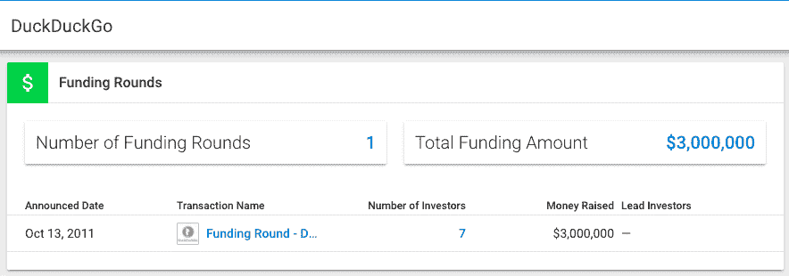

<noscript>T3】</noscript>

对一家未上市的公司进行估值，其价值基于其用户的稳定增长可能更像是一种智力练习。话虽如此，尝试给 DuckDuckGo 设定一个$ number 的估值区间还是值得的。

正如 Simple409A.com 创始人 [奈杰尔·特纳克利夫](https://www.quora.com/profile/Nigel-Tunnacliffe) 在 [Quora](https://www.quora.com/How-much-is-DuckDuckGo-worth) : 上所解释的

> 纯粹根据我从网上收集的信息，我的最佳猜测是 2000 万到 3000 万美元。我的推理如下:
> 
> 去年 10 月，他们筹集了 300 万美元。为此，他们可能放弃了 20-40%，10 月份他们的贴钱价值为 750-1500 万美元。为了便于讨论，我们假设是 1000 万美元。当时，它每天处理大约 300，000 个搜索查询，这个数字在过去的一年里以每月 10%多一点的速度增长。
> 
> 在第 4 季度，每日直接查询每月增长约 15%,然后在 1 月和 2 月，搜索量几乎翻了一番，从 3 月开始，每日直接查询超过 150 万次。
> 
> 我想公司在 10 月份的估值是基于当时他们的月增长率(T2)的小幅增长。如果我们假设投资将有助于刺激[增长](https://fourweekmba.com/growth-hacking/ "growth")从每月 10%上升到 15%,那么到 3 月份，该公司预计每天将进行 60 万次搜索。如果是这样的话，那么在这段时间内，企业价值可能会有很小的变化。
> 
> 然而，搜索量的增长速度比预期快了 4 倍。我可以合理地估计，企业价值会相应增加，在 3 月份可能会达到 4000 万美元左右。
> 
> 随着搜索量从 5 月到现在(7 月)处于平稳状态，我会想象 3 月的任何兴奋都会被夏季冲淡，并且会有一个调整。
> 
> 我敢打赌，如果他们今天或在下一次重大的价值创造活动之前再融资一轮，我们将看到 2000 万至 3000 万美元的估值。

答案随后在 2015 年更新:

> 更新 10/2015
> 自从我在 2013 年 1 月写下这个答案以来，直接流量已经增长了>6 倍，公司已经达到了一些重要的里程碑。考虑到他们稳定的[增长率](https://fourweekmba.com/growth-hacking/ "growth")，被主流浏览器收录，以及据报道他们盈利的事实，他们的估值可能是 2.5 年前的 10-20 倍，在 5 亿美元左右。如果是出售，收购公司可能会支付两倍的价格，尤其是在有多个竞标者的情况下。

然而，截至 2022 年 5 月，平均每天有超过 9000 万个查询通过 DuckDuckGo:

<noscript>T3】</noscript>

换句话说，自 2015 年以来，流量稳步增长了两倍多(回到 2015 年 10 月，平均每天有近 800 万个查询通过 DuckDuckGo)。另外，不跟踪你的搜索引擎一个里程碑一个里程碑的打。

事实上，在 11 月 27 日星期一，超过 2100 万个直接查询通过了 DuckDuckGo！这种[增长](https://fourweekmba.com/growth-hacking/ "growth")会让估值(如果上述假设证明是正确的)超过 10 亿美元大关吗？

由 [指定奈杰尔·特纳克利夫](https://www.quora.com/profile/Nigel-Tunnacliffe) ，Simple409A.com 创始人:

### *相关***</u> 

