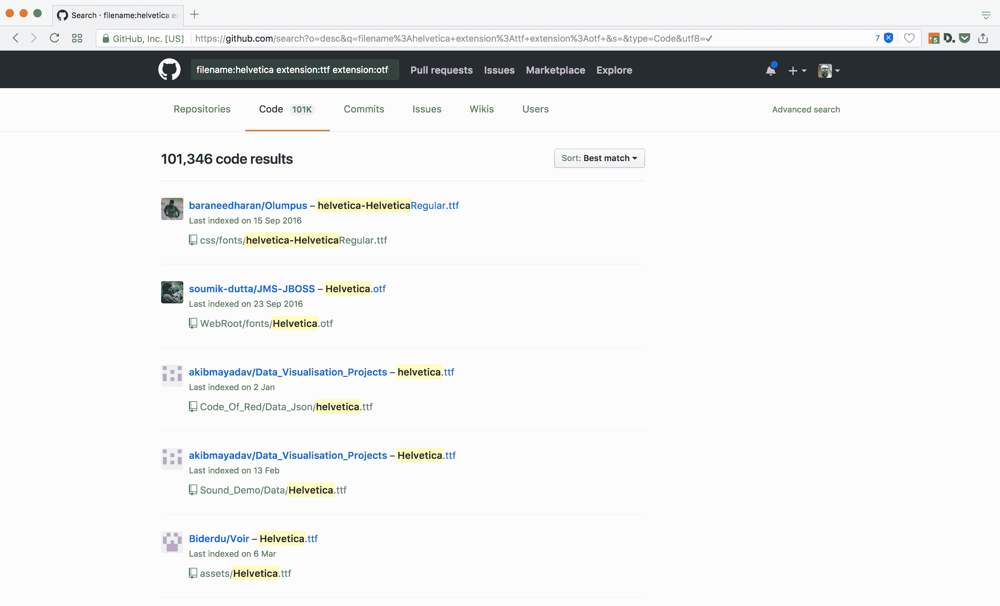

# Github 如何成为网络上最大的字体盗版网站(以及如何修复)——Pixelambacht

> 原文：<https://pixelambacht.nl/2017/github-font-piracy/?utm_source=wanqu.co&utm_campaign=Wanqu+Daily&utm_medium=website>


# Github 如何成为网络上最大的字体盗版网站(以及如何修复它)

2017 年 9 月 21 日

字体和其他软件一样，有两种版本:商业版和免费版。免费字体附带一个许可，允许你免费使用它们。一些许可证甚至允许你编辑字体，并以另一个名字重新发布。

另一方面，商业字体，你必须购买许可。这个许可证告诉你你能做什么和不能做什么。最值得注意的是，你不能把它给别人——除非他们自己买许可证，你替他们买，或者许可证允许你转让许可证。如果你想在你的网站上使用一种字体，许可证必须首先允许网络使用。您通常不能在 web 项目中只使用“桌面字体”(通过许可证购买，用于 Photoshop 或 InDesign 等应用程序)。网络字体的收费通常取决于你网站的访问量，所有这些都取决于你购买的许可证。

当一种商业字体出现在不该出现的地方时——比如一个巨大的、可自由搜索的代码数据库——它肯定会违反许可条款，一旦从那里下载，它就变成了盗版字体。

## 找到 Helvetica 了吗？

让我们使用 Github 搜索 API ,看看我们是否能找到这个星球上最普遍的商业字体:Helvetica。是的，在 Github 上可以找到超过 [10 万份拷贝。(这个链接只有在你登录 Github 后才能使用。)](https://github.com/search?utf8=%E2%9C%93&q=extension%3Attf+extension%3Aotf+filename%3A%22helvetica%22&type=Code)



A simple search shows that over 100,000 copies of Hevetica can be found on Github


我们只搜索 TTF 或 OTF 文件——没有 WOFF/WOFF2 或像 EOT 和 SVG 这样的传统格式(否则你会得到近 150.000 次点击)。诚然，这也发现了 Helvetica 的其他版本，如新 Helvetica(通常被称为 Helvetica 新)，或不同权重的 Helvetica，如`helvetica-bold.ttf`。但是，仍然有超过 100，000 个文件不应该在那里。

## Github 上还有什么？

最大和最好的商业字体销售商之一是 MyFonts。他们的收藏目前包含超过 [33，000 种字体家族](http://www.myfonts.com/search/*/fonts/)，几乎所有都是商业字体，也就是说，你必须付费购买许可。例如，他们出售大约一打 Helvetica T5 的 T4 版本。

如果在 Github 上搜索 MyFonts 的产品呢？

我就是这么做的。我跳过了可能导致误报的通用名称:像[黑色](http://www.myfonts.com/fonts/intellecta/black/)、[拉丁](http://www.myfonts.com/fonts/woodentypefonts/latin/)或[文本](http://www.myfonts.com/fonts/fw-alias/text/)这样的名称，并将其余的输入 Github 搜索 API。

结果呢？在 29，951 种经过重复数据删除的字体中，有 7，617 种出现在 Github 上——这是整个 MyFonts 集合的四分之一。在他们标有“畅销书”的字体中，49 种字体中有 39 种可以在 Github 上找到，还有 30 种标有“顶级网络字体”的字体中的 28 种。

总共有 316.358 个不同的存储库在 Github 上存储了一种或多种这样的字体。这是一个非常保守的数字，因为 Github API 只返回前 1000 个结果。对于 Helvetica，这剩下 99，000 个结果，我无法检查它们在哪个回购中。

请注意，我只搜索了 OTF 或 TTF 字体。没有分支，没有除主服务器之外的分支，也没有搜索更早的提交。我还查询了 MyFonts 网站上显示的字体名称，因此没有找到重命名或混淆的版本。

以下是 Github 上上传最多的商业字体列表，加上截至 2017 年 9 月的结果数量:

1.  Helvetica (100，194)
2.  下一个新版本(67.810)
3.  Myriad Pro (38，794)
4.  未来(32，327)
5.  博物馆(31，825)
6.  露西达(27，225 英镑)
7.  Futura (20，872)
8.  Fraktur (18，908 英镑)
9.  Nexa (7，071)
10.  信使(6 644 人)

当然，不仅仅是我的丰姿。甚至来自独立代工厂的字体最终也会出现在 Github 上。来自世界各地的独立字体设计师联盟日益壮大，其在 Github 上的收藏约占一半。

## 这些字体是怎么出现在 Github 上的？

一个全新的说法是，“永远不要把开发者没有意识到在他们的公开回购协议中添加许可字体的后果而充分解释为恶意”。

你建立了新的网络项目，将你的网络字体与其他资产如图片和 JavaScript 库放在一起，并将你的东西提交给 Github 上的公共回购。没有意识到这违反了商业字体的许可，你现在把它们提供给任何可以使用 Github 搜索功能的人。很显然，这是常有的事。

## 修复问题

你可能正在阅读这篇文章，并想“哦，见鬼，我可能不小心做到了这一点”。您可以删除有问题的文件，提交更改，字体就会消失:


```
$ git rm assets/fonts/helvetica.otf
```


嗯，还没有完全消失:如果你在删除之前*检查一个提交，字体仍然会在那里。要将它们从你的回购中永久删除，你可以使用`git filter-branch`，或者更加用户友好的工具 [BFG 回购清理器](http://rtyley.github.io/bfg-repo-cleaner/):*


```
$ bfg --delete-files assets/fonts/helvetica.otf
```


这将从您的回购中删除字体，但不会对 fork 或 clones 这样做。要在那里删除它们，您可以联系所有者或自己提交一个 pull 请求。

注意:像这样清除文件会改写你的回购历史。Github 有更彻底的关于[永久删除文件](https://help.github.com/articles/removing-sensitive-data-from-a-repository/)的信息。

## 那么，如何处理商业字体呢？

那么，当你想使用商业字体并保持其合法性时，该怎么做呢？

长话短说，你不能把它们提交给公共存储库。这真的没有办法:如果你不被允许与不属于它的许可的人共享字体，你就不能让它成为你的回购的一部分。

你的选择是进行私人回购，或者在你的公共回购中保留一个通知，告诉那些将使用你的项目的人许可他们自己添加字体。将你的`assets/fonts`目录放在一个`.gitignore`中，这样你就永远不会不小心提交它们，这就是你的叔叔。

# 装酷

当然，还有更大的网站为字体盗版提供便利。Github 的不同之处在于，大多数字体最终出现在那里是因为人们没有意识到他们做错了什么。我很难相信所有的 33，000 名开发者会说“哈哈，让我们上传一些 w4r3z 吧！”

所以要冷静:检查你的回购，确保没有不应该出现的字体。

感谢[因德拉·库普费尔施密德](http://kupferschrift.de/cms/)、[布拉姆·斯坦](https://www.bramstein.com/)和[斯蒂芬·科尔斯](http://stephencoles.org/)对本文早期草稿的反馈。

