# Booking.com 如何操纵你

> 原文：<https://ro-che.info/articles/2017-09-17-booking-com-manipulation?utm_source=wanqu.co&utm_campaign=Wanqu+Daily&utm_medium=website>

如今，许多网站和应用程序都是为了欺骗你去做它们的创造者想要的事情。下面是来自 [timewellspent.io](http://www.timewellspent.io/) 的一些例子:

*   YouTube 自动播放更多视频，让我们不离开。
*   Instagram 一次显示一个新的赞，让我们继续查看更多。
*   脸书想展示让我们继续滚动的东西。
*   Snapchat 将对话变成了我们不想失去的条纹。
*   我们的媒体把事件变成突发新闻，让我们继续关注。

但我遇到过的最具操纵性的网站之一是大型酒店搜索和预订服务公司 Booking.com。

如果你曾经使用过 Booking.com，你可能会注意到(并希望抵制！)它会以一些方式促使你预订你正在寻找的任何房产:

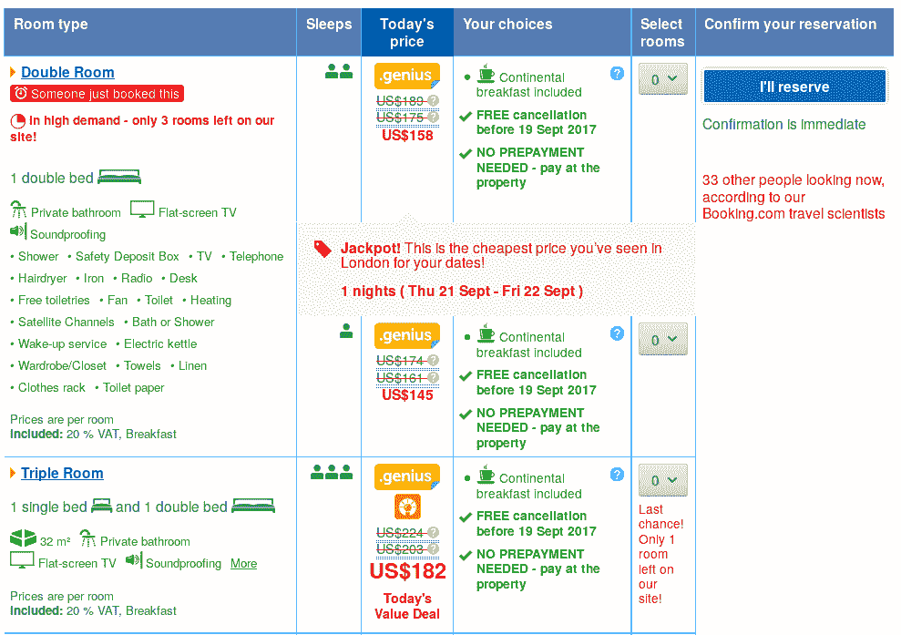

让我们看看这是怎么回事。

## 价格

首先，它试图说服你价格很低。“头奖！这是你在伦敦约会见过的最便宜的价格了！”当然是——这是这些天来我第一次看到这样的价格——所以这种说法是重复的。**我看到的第一个价格自然会是我见过的最低价格，不管它会高得多离谱。**陈述“这是你在伦敦约会时见过的最高价格！”会同样有效。

同样，穿透价格是用来锚定你，让实际价格看起来很划算。删除的 175 美元是在应用我的 10%的“天才”折扣之前——好的，这是公平的。但是 189 美元从何而来？让我们将目光停留在价格上，以获得解释:

我想象大多数人会被复杂的描述吓倒，跳到最后一句，得到的印象是“与其他入住日期相比，你以更低的价格获得了相同的房间”。(如果不是这种情况，Booking.com 的营销部门会改变措辞，使其如此。)

但是它实际上在说什么呢？如果只有一个这种类型的房间，那么 90%的时间会出现一个幸运的交易。你应该读到的是“如果我选择了这个，我就不是一个彻底的失败者”。如果有 3 种不同价格的可比房型，就更没有理由对此感到高兴了——你已经成功避开了最差的 3%的房型。

## 紧急

Booking.com 操纵你的另一种方式是传达紧迫感。

"在高需求-只有 3 个房间留在我们的网站上！"

“33 其他人现在看起来，根据我们的 Booking.com 旅行科学家”(什么？)

“最后一次机会！我们网站只剩 1 个房间了！”

为了证明他们不是在开玩笑，他们会向你展示一些你已经错过的东西:

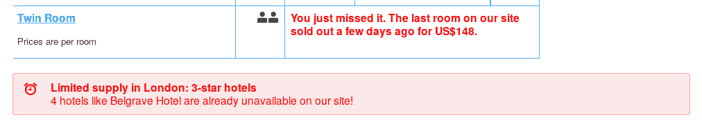

但我最喜欢的是这个红色徽章:

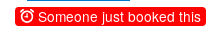

虽然在截图上看不到，但当你打开页面时，徽章并不会马上出现。相反，**它会在一两秒钟后弹出，看起来像是实时通知**——闹钟图标强化了这种印象。明确地说，它不是实时的，除了欺骗你之外，没有理由延迟它的显示:

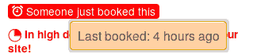

从上次预订到现在已经过去了多长时间，这并不是简单地利用我们的非理性情绪。这是一条有价值的信息，可以用来估计这些房间的预订率。通过一个类似于 [Gott](https://en.wikipedia.org/wiki/J._Richard_Gott#Copernicus_method_and_Doomsday_theory) 的论证(参见 [Algorithms to Live By](https://www.goodreads.com/book/show/32708206-algorithms-to-live-by) 的精彩解释)，如果最后一次预订是在 4 个小时前，你可以估计大约每 8 个小时就有一个房间被预订。有足够的时间放松和比较你的选择。另一方面，如果最后一次预订发生在两秒钟前，你最好不要在输入你的信用卡号码前再浪费一秒钟。

值得称赞的是，Booking 至少在工具提示窗口中提供了实际信息(我想知道是什么规定让他们这样做的)，但不是所有用户都会悬停阅读它，即使这样，你经历的一些事情(弹出的徽章)可能会优先于你后来阅读的内容。

“有人刚刚预订了这个”徽章不只是让你担心你正在考虑的房间很快就会被抢走；这也让你放心。如果其他人都在积极预订这个楼盘，那肯定是好的。当然，4 小时前预订房间的人还没有去过酒店，所以他可能比你知道的多一点。他们预订的决定很可能在某种程度上受到同一个红色徽章的影响。在这种情况下，每个人都依赖于其他人来获得准确的信息，这在的[算法中也有很好的描述。](https://www.goodreads.com/book/show/32708206-algorithms-to-live-by)

## 复习

而不是听刚订了房源但还没去过的人说，应该求助去过的人，对吧？这就是评论的作用！

但是 Booking.com 也设法应付了评论。有相当多的蹩脚酒店，尤其是在较便宜的一端。这些是你我都想避开的酒店，但如果我们避开了，预订也不会从中赚钱。

一个极端的例子是我现在住的酒店，新联。从它的 Booking.com 页面你不会认为它有什么问题，你会吗？

如果你花足够的时间仔细阅读这一页，你最终会发现“小字”:

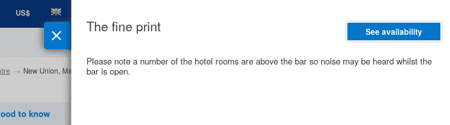

“酒吧营业时可能会听到噪音”是一种保守的说法；音乐声太大了，我房间的地板震动得非常明显，酒吧一直开到深夜/凌晨。为什么这个警告藏在小字里而不是一个他妈的大红色徽章里？

平心而论，这更多的是酒店的错，而不是预订的错。此外，我应该已经阅读了小字。或者评论。但是等等，我已经看过评论了:

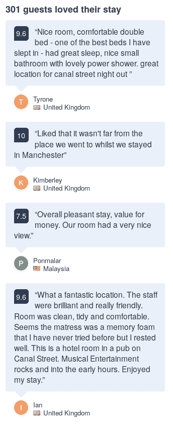 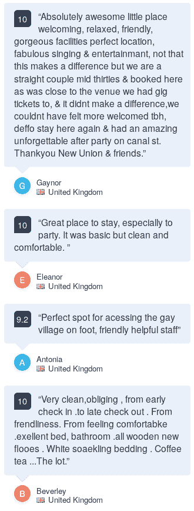

我没有意识到的是，浏览一个超载的网页时，主页上显示的评论是经过精心挑选的。完整的评论列表可从单独的页面获得，例如

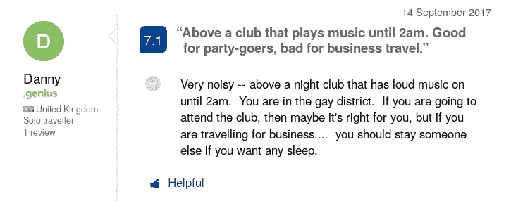

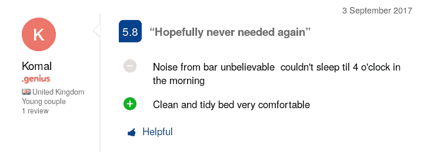

## 等级

请注意这里有一些有趣的事情:第一个中度负面的评论给了这个地方 7 分(满分 10 分)，第二个评论，可能是最负面的，给了它几乎 6 分。因此，该物业的总体评分很高(7.6)，甚至评级的分布看起来也不惊人:

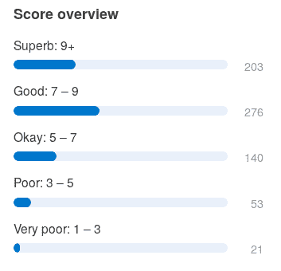

不像 IMDB 或亚马逊那样，你只是简单地给一部电影或一个产品打几颗星，当你评价你在 Booking.com 的逗留时，你会根据几个因素进行评估:位置、清洁度、设施等。

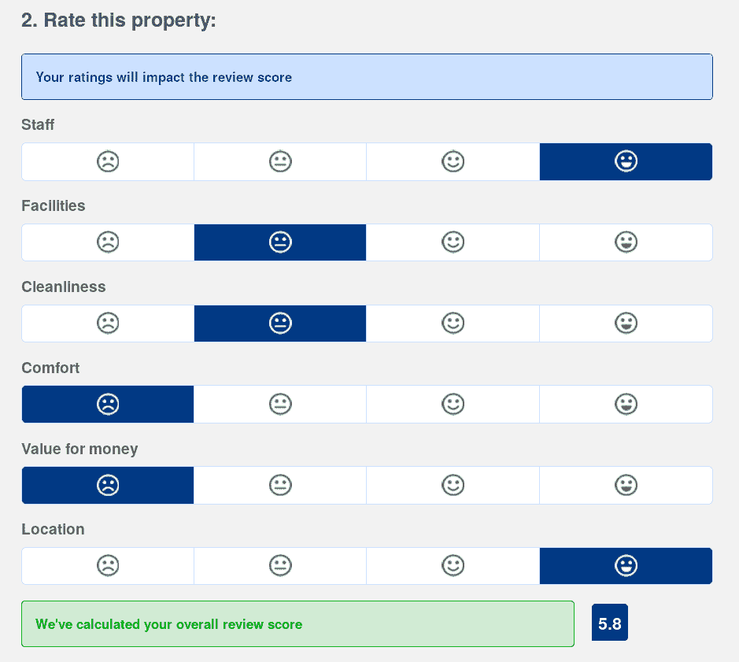

但 Booking.com 并不提供个人评级；它给出了平均值(如 7.1 或 5.8)和平均值的平均值(对物业的总体评级)。不太可能所有因素都同时变坏，但其中一个因素出现问题就可能很容易毁了你的旅行。绝佳的地理位置无法补偿不眠之夜，但 Booking.com 不这么认为。

巴兰·托帕雷和@tqenn 都指出了 Booking.com 收视率膨胀的另一种方式:

(解释一下 Booking 的系统，每个因素的评分都在{2.5，5，7.5，10}的标度上，综合评分是所有因素的算术平均值。)

我同意，除了在互联网上的评级几乎从来没有 0 为基础。星星的数量通常从 1 到 5。但是，如果他们真的想要一个 4 分制的最高分是 10 分，他们可以选择等级{1，4，7，10}。所以没错，这是 Booking.com 人为提高酒店评级的另一种方式。

## 如何处理所有这些

坦率地说，我不认为我会停止使用 Booking.com。我不知道任何其他服务有类似数量的属性和评论。

相反，我们需要意识到预订试图欺骗我们的所有方式，并尝试应对它们:

1.  忽略引起紧急情况的红色文字和被突破的价格。
2.  不要依赖评级的大小。我觉得用它们作为排序标准还是可以的。
3.  不要阅读主页上精选的评论。转到评论页面(“我们的客人的经历”)，从最新到最早对评论进行排序，以获得最新的、希望没有偏见的选择。

正如我从黑客新闻上的几个评论者那里了解到的，这些操纵技巧被称为“黑暗模式”，它们在 darkpatterns.org 的 T2 被编目。

