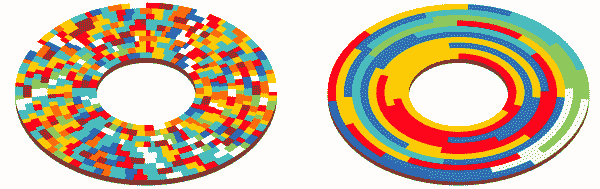
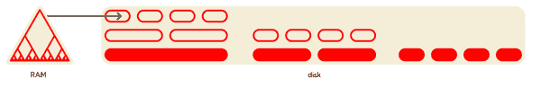

# Yandex 中数据结构的演变。Metrica -高可扩展性-

> 原文：<http://highscalability.com/blog/2017/9/18/evolution-of-data-structures-in-yandexmetrica.html?utm_source=wanqu.co&utm_campaign=Wanqu+Daily&utm_medium=website>

Yandex。Metrica 是全球第二大网络分析系统。Metrica 接收代表网站或应用程序上发生的事件的数据流。我们的任务是处理这些数据，并以可分析的形式呈现出来。

 
处理数据本身不是问题。真正的困难在于试图确定处理后的结果应该以什么形式保存，以便于使用。在开发过程中，我们不得不多次彻底改变我们的数据存储组织方法。我们从 MyISAM 表开始，然后使用 LSM 树，最终开发出面向列的数据库 [ClickHouse](https://clickhouse.yandex/) 。在本文中，我将解释是什么让我们选择了最后一个选项。

Yandex。Metrica 于 2008 年推出，现已运行了九年多。过去，每次我们改变数据存储方法，都是因为某个特定的解决方案被证明效率低下:要么是性能储备不足，要么是解决方案不可靠，要么是它使用了太多的计算资源，要么是它不允许我们实施我们需要的东西。

旧时的 Yandex。Metrica for websites 有 40 多种“固定”报告类型(例如，访问者地理报告)，几个页面内分析工具(如点击地图)，Webvisor(允许您详细研究单个用户的操作)，以及单独的报告构造器。

借助新的 Metrica 和 Appmetrica，您可以定制每份报告，而不是处理“固定”类型。你可以添加新的维度(例如，在一个搜索词报告中，你可以通过登录页面进一步细分数据)，细分和比较(比如说，所有访问者与来自旧金山的访问者之间的流量来源)，改变你的指标集，等等。因此，新系统需要一种与我们以前使用的完全不同的数据存储方法。

## 我的天

Metrica 成立时是 Yandex 的一个分支。搜索广告服务 Direct。带有 MyISAM 引擎的 MySQL 表直接用于存储统计数据，这就是我们在 Metrica 中开始使用的。我们使用 MyISAM 来存储从 2008 年到 2011 年的“固定”报告。

让我解释一下，例如，当处理地理信息时，报表应该采用什么样的结构。针对特定站点(或者更准确地说，针对特定的 Metrica 计数器标识符)编写了一份报告。这意味着主键应该包含 CounterID。用户可以选择任意报告周期。为每一对日期存储数据没有意义，所以为每个日期保存数据，然后通过查询为所选的时间间隔累积数据。因此，主键包含日期。

报告中的数据以列表或由国家、地区和城市组成的树的形式显示。因此，将 RegionID 放在表的主键中并在应用程序代码端而不是数据库端将数据收集到一个树中是有意义的。

假设我们也要考虑平均会话持续时间。这意味着表列应该包含会话数和总会话持续时间。

因此，生成的表将具有以下结构:CounterID，Date，RegionID - > Visits，SumVisitTime，…现在，我们来看看当我们请求一个报告时会发生什么。使用条件进行选择查询，其中 CounterID =且日期介于 min_date 和 max_date 之间。换句话说，读取的是主键范围。

### 数据实际上是如何存储在磁盘上的？

MyISAM 表由一个数据文件和一个索引文件组成。如果没有从表中删除任何内容，并且行的长度在更新期间没有变化，则数据文件将由按插入顺序连续排列的序列化行组成。索引(包括主键)是一个 B 树，其中的叶子包含数据文件中的偏移量。当我们读取索引范围数据时，从索引中提取数据文件中的一组偏移量。然后通过这组偏移量读取数据文件。

我们来看看现实生活中索引在 RAM(MySQL 中的键缓存或者系统页面缓存)中，但是里面的数据没有缓存的情况。让我们假设我们正在使用硬盘。读取数据所需的时间取决于需要读取的数据量以及需要执行多少次寻道操作。寻道次数由磁盘上数据的位置决定。

Metrica 事件的接收顺序几乎与它们实际发生的顺序相同。在这个传入流中，来自不同计数器的数据完全是随机分散的。换句话说，传入数据在时间上是本地的，但在计数器编号上不是本地的。当写入 MyISAM 表时，来自不同计数器的数据也会随机放置。这意味着，要读取数据报告，您将需要执行与我们在表中需要的行数一样多的随机读取。

典型的 7200 RPM 硬盘每秒可以执行 100 到 200 次随机读取。如果使用得当，RAID 阵列可以按比例执行更多任务。一个使用了七年的固态硬盘每秒可以执行 30，000 次随机读取，但我们无法负担将数据保存在固态硬盘上的费用。使用这个系统，如果我们需要为一个报告读取 10，000 行，将需要 10 秒以上的时间，这是完全不可接受的。

InnoDB 更适合读取主键范围，因为它使用了一个聚集主键(即数据以有序的方式存储在主键上)。但是 InnoDB 由于其缓慢的写入速度而无法使用。如果这让你想起了 TokuDB，那么请继续阅读。

我们应用了一些技巧来使 MyISAM 在选择主键范围时工作得更快。

表格排序。因为数据必须增量更新，所以对表排序一次是不够的，但每次都排序是不可能的。然而，这可以针对旧数据定期进行。

分区。一个表被分成许多更小的主键范围。这样做是希望来自一个分区的数据将或多或少地存储在本地，并且对主键范围的查询将被更快地处理。该方法可被称为聚集主键的手动实现。它确实会降低数据插入的速度。然而，在选择分区数量时，通常可以在插入速度和读取速度之间达成折衷。

按世代分离数据。在一种分区方案下，选择可能会太慢，而在另一种方案下，插入速度会太慢。当使用中间选项时，两者都变慢。这个问题的解决方案是将数据分成几个独立的代。例如，第一代我们称之为运营数据；在这种情况下，分区要么在插入数据时发生(按时间顺序)，要么根本不发生。我们称之为第二代存档数据；这是在读取数据时进行分区的地方(通过计数器编号)。数据通过脚本代代传递，但不要太频繁(例如，一天一次),并立即从所有代读取。这很有帮助，但也造成了很多困难。

这些(以及其他)招数在 Yandex 中被使用。Metrica 一段时间，使一切工作。

我们来总结一下之前系统的弊端:

*   磁盘上数据的局部性很难支持
*   在插入过程中，表被锁定
*   复制慢；副本经常滞后
*   硬件故障后的数据一致性无法保证
*   像独立用户数量这样的总量很难计算和存储
*   数据压缩难以使用并且效率低下
*   索引会占用大量空间，并且不完全适合内存
*   数据必须手动分片
*   在选择之后，许多计算必须在应用程序代码方面进行
*   维护和操作困难

 图片:磁盘上数据的位置(艺术渲染)

总之，MyISAM 使用起来极其不方便。白天，服务器在磁盘阵列上以 100%的负载工作(磁头不断移动)。在这种情况下，磁盘故障比平常更多。我们在服务器上使用磁盘架。换句话说，我们必须非常频繁地恢复 RAID 阵列。有时副本滞后太多，我们需要丢弃并重新创建它们。切换复制主真的不方便。尽管有缺点，截至 2011 年，我们在 MyISAM 表中存储了超过 5800 亿行。然后所有的东西都被重新转换成内存，被删除，最后很多服务器都被释放了。

## Metrage 和 OLAPServer

自 2010 年以来，我们一直使用 Metrage 存储固定报告。假设您有以下场景:

*   数据不断地以小批量写入数据库
*   写入流相对较大(至少每秒几十万行)
*   读取请求相对较少(每秒几千个查询)
*   主键范围的所有读取(每个查询多达数百万行)
*   行相当短(大约 100 字节未压缩)

一种相当常见的数据结构，LSM 树，很适合这种情况。这种结构由磁盘上相对较小的一组数据“块”组成，每个块包含按主键排序的数据。新数据最初放在某种类型的 RAM 数据结构(MemTable)中，然后以新的、已排序的块的形式写入磁盘。周期性地，一些排序后的块将在后台被压缩成一个更大的块。这样就维护了一个相对较小的块集。

这种数据结构用在 HBase 和 Cassandra 中。在嵌入式 LSM 树数据结构中，实现了 LevelDB 和 RocksDB。随后，RocksDB 被用于 MyRocks、MongoRocks、TiDB、CockroachDB 和许多其他应用程序中。

Metrage 也是 LSM 树。任意数据结构(在编译时固定)可以在其中用作“行”。每一行都是一个键/值对。键是一个具有相等和不相等比较运算的结构。该值是一个任意结构，具有更新(添加内容)和合并(与另一个值聚合或组合)操作。简而言之，这是一个 CRDT。

简单的结构(整数元组)和更复杂的结构(如用于计算独立访问者数量的哈希表或点击图结构)都可以作为值。使用更新和合并操作，在以下点持续执行增量数据聚合:

*   在 RAM 中形成新批次时的数据插入期间
*   在后台合并期间
*   在读取请求期间

Metrage 还包含我们需要的在查询过程中执行的特定领域逻辑。例如，对于区域报告，表中的键将包含最低区域(城市、村庄)的 ID，如果我们需要国家报告，国家数据将在数据库服务器端完成聚合。

这种数据结构的主要优点如下:

*   数据位于硬盘的本地；读取主键范围很快。
*   数据被压缩成块。因为数据是以有序的方式存储的，所以当使用快速压缩算法时，压缩工作得相当好(2010 年我们使用 QuickLZ，从 2011 - LZ4 开始)。
*   存储按主键排序的数据使我们能够使用稀疏索引。稀疏索引是每第 N 行(数千的 N 阶)的主键值的数组。这个索引是最紧凑的，并且总是适合内存。

由于读取并不经常执行(即使在读取时会读取许多行),因此拥有许多块和解压缩数据块所导致的延迟增加并不重要。因为索引稀疏而读取额外的行也没有什么区别。

写入的大块数据不被修改。这允许您在不锁定的情况下进行读写——获取数据的快照以供读取。使用了简单统一的代码，但是我们可以很容易地实现所有必要的特定于领域的逻辑。

我们不得不写一个方法，而不是修改一个现有的解决方案，因为真的没有。LevelDB 在 2010 年还不存在，当时 TokuDB 是专有的。

所有实现 LSM 树的系统都适用于存储非结构化数据和从一个 BLOB 到另一个 BLOB 的略有变化的地图。但是要使这种类型的系统适应任意的 CRDT 将会比开发 Metrage 花费更长的时间。将数据从 MySQL 转换到 Metrage 相当耗时:虽然转换程序只花了大约一周的时间，但它的主要部分却花了大约两个月的时间。

将报告传输到 Metrage 后，我们立即发现 Metrica 接口速度有所提高。我们已经使用 Metrage 五年了，事实证明这是一个可靠的解决方案。在那段时间里，只有一些小故障。它的优点是简单有效，这使它成为比 MyISAM 更好的存储数据的选择。

截至 2015 年，我们存储了 3.37 万亿行数据，并为此使用了 39 * 2 台服务器。然后，我们不再将数据存储在 Metrage 中，并删除了大多数表。这个系统有它的缺点；它只对固定报告有效。Metrage 聚合数据并保存聚合的数据。但是为了做到这一点，你必须提前列出所有你想聚集数据的方法。因此，如果我们以 40 种不同的方式来做，这意味着 Metrica 将包含 40 种类型的报告，仅此而已。

为了缓解这个问题，我们不得不暂时为定制报告向导保留一个单独的存储，称为 OLAPServer。它是面向列的数据库的一个简单且非常有限的实现。它在编译时只支持一个表集——一个会话表。与 Metrage 不同，数据不是实时更新的，而是每天更新几次。唯一支持的数据类型是 1-8 字节的固定长度数字，所以它不适合包含其他类型数据的报告，例如 URL。

## 钟房

使用 OLAPServer，我们了解了面向列的 DBMS 如何处理非聚合数据的即席分析任务。如果您可以从非聚合数据中检索任何报告，那么它回避了数据是否需要预先聚合的问题，就像我们对 Metrage 所做的那样。

 图片:面向列的数据库中的查询处理

一方面，预聚合数据可以减少报表页面加载时使用的数据量。然而，另一方面，聚合数据并不能解决所有问题。以下是原因:

*   您需要提前准备好用户需要的报告列表
*   换句话说，用户不能创建自定义报告
*   当聚合大量键时，数据量不会减少，聚合是无用的
*   当有很多报告时，有太多的聚合选项(组合爆炸)
*   当聚合高基数键(例如，URL)时，数据量不会减少太多(不到一半)
*   因此，在聚合过程中，数据量可能不会减少，反而会增加
*   用户不会看到我们为他们计算的所有报告(换句话说，很多计算证明是无用的)
*   当存储大量不同的聚合时，很难保持逻辑一致性

As you can see, if nothing is aggregated and we work with non-aggregated data, then it's possible that the volume of computations will even be reduced. But only working with non-aggregated data imposes very high demands on the effectiveness of the system that executes the queries.

So if we aggregate the data in advance, then we should do it constantly (in real time), but asynchronously with respect to user queries. We should really just aggregate the data in real time; a large portion of the report being received should consist of prepared data.

If data is not aggregated in advance, all the work has to be done at the moment the user request it (i.e. while they wait for the report page to load). This means that many billions of rows need to be processed in response to the user's query; the quicker this can be done, the better.

For this you need a good column-oriented DBMS. The market didn’t have any column-oriented DBMS's that would handle internet-analytics tasks on the scale of Runet (the Russian internet) well enough and would not be prohibitively expensive to license.

Recently, as an alternative to commercial column-oriented DBMS's, solutions for efficient ad-hoc analytics of data in distributed computing systems began appearing: Cloudera Impala, Spark SQL, Presto, and Apache Drill. Although such systems can work effectively with queries for internal analytical tasks, it is difficult to imagine them as the backend for the web interface of an analytical system accessible to external users.

At Yandex, we developed and later [opensourced](https://github.com/yandex/ClickHouse/) our own column-oriented DBMS — ClickHouse. Let's review the basic requirements that we had in mind before we proceeded to development.

Ability to work with large datasets. In current Yandex.Metrica for websites, ClickHouse is used to store all data for reports. As of September, 2017, the database is comprised of 25.1 trillion rows. It’s made up of non-aggregated data that is used to retrieve reports in real-time. Every row in the largest table contains over 500 columns.

The system should scale linearly. ClickHouse allows you to increase the size of cluster by adding new servers as needed. For example, Yandex.Metrica's main cluster has increased from 60 to 426 servers in three years. In the aim of fault tolerance, our servers are spread across different data centers. ClickHouse can use all hardware resources to process a single query. This way more than 2 terabyte can be processed per second.

High efficiency. We really focus on our database's high performance. Based on the results of internal tests, ClickHouse processes queries faster than any other system we could acquire. For example, ClickHouse works an average of 2.8-3.4 times faster on web analytics queries than one of top performing commercial column-oriented DBMS (let's call it DBMS-V).

Functionality should be sufficient for Web analytics tools. The database supports the SQL language dialect, subqueries and JOINs (local and distributed). There are numerous SQL extensions: functions for web analytics, arrays and nested data structures, higher-order functions, aggregate functions for approximate calculations using sketching, etc.

ClickHouse was initially developed by the Yandex.Metrica team. Furthermore, we were able to make the system flexible and extensible enough that it can be successfully used for different tasks. Although the database can run on large clusters, it can be installed on single server or even on a virtual machine.

ClickHouse is well equipped for creating all kinds of analytical tools. Just consider: if the system can handle the challenges of Yandex.Metrica, you can be sure that ClickHouse will cope with other tasks with a lot of performance headroom to spare.

ClickHouse works well as a time series database; at Yandex it is commonly used as the [backend for Graphite](https://github.com/yandex/graphouse/) instead of Ceres/Whisper. This lets us work with more than a trillion metrics on a single server.

ClickHouse is used by analytics for internal tasks. Based on our experience at Yandex, ClickHouse performs at about three orders of magnitude higher than ancient methods of data processing (scripts on MapReduce). But this is not a simple quantitative difference. The fact of the matter is that by having such a high calculation speed, you can afford to employ radically different methods of problem solving.

If an analyst has to make a report and they are competent at their job, they won't just go ahead and construct one report. Rather, they will start by retrieving dozens of other reports to better understand the nature of the data and test various hypotheses. It is often useful to look at data from different angles in order to posit and check new hypotheses, even if you don't have a clear goal.

This is only possible if the data analysis speed allows you to conduct instant research. The faster queries are executed, the more hypotheses you can test. Working with ClickHouse, one even gets the sense that they are able to think faster.

形象地说，在传统系统中，数据就像一个重物。可以操纵，但是很费时间，不方便。不过，如果你的数据在 ClickHouse 中，那么它的可塑性就大得多:你可以在不同的截面中研究它，并深入到数据的各个行。

经过一年的开源，ClickHouse 现在被全球数百家公司使用。例如， [CloudFlare](https://blog.cloudflare.com/how-cloudflare-analyzes-1m-dns-queries-per-second/) 正在使用 ClickHouse 分析 DNS 流量，每天接收大约 750 亿个事件。另一个例子是 [Vertamedia](https://www.dropbox.com/s/l0qx4feez3kokd9/Go%20July%20meetup.%20Go%20-%20ClickHouse%20-%20Grafana.pdf?dl=0) (一个视频 SSP 平台)，它每天在 ClickHouse 中处理 2000 亿个事件，每秒钟的摄取率约为 300 万行。

## 结论

Yandex。Metrica 已经成为世界上第二大网络分析系统。Metrica 接收的数据量从 2009 年的每天 2 亿次事件增长到 2017 年的超过 250 亿次。为了向用户提供多种多样的选择，同时还能跟上不断增长的工作负载，我们不得不不断修改我们的数据存储方法。

有效的硬件利用率对我们来说非常重要。根据我们的经验，当您拥有大量数据时，最好不要太担心系统的可扩展性，而是关注每个硬件单元的使用效率:每个处理器内核、磁盘和 SSD、RAM 和网络。毕竟，如果您的系统已经使用了数百台服务器，并且您必须将工作效率提高十倍，那么无论您的系统有多大的可伸缩性，您都不太可能继续安装数千台服务器。

为了最大限度地提高效率，定制您的解决方案以满足特定工作负载类型的需求非常重要。没有一种数据结构能很好地处理完全不同的场景。例如，很明显，键值数据库不适用于分析查询。系统负载越大，所需的专门化就越窄。人们不应该害怕对不同的任务使用完全不同的数据结构。

我们能够进行设置，以便 [Yandex。Metrica](https://metrica.yandex.com/) 的硬件相对便宜。这使我们能够向非常大的网站和移动应用程序免费提供服务，甚至比 Yandex 自己的应用程序还要大，而竞争对手通常会开始要求付费订阅计划。