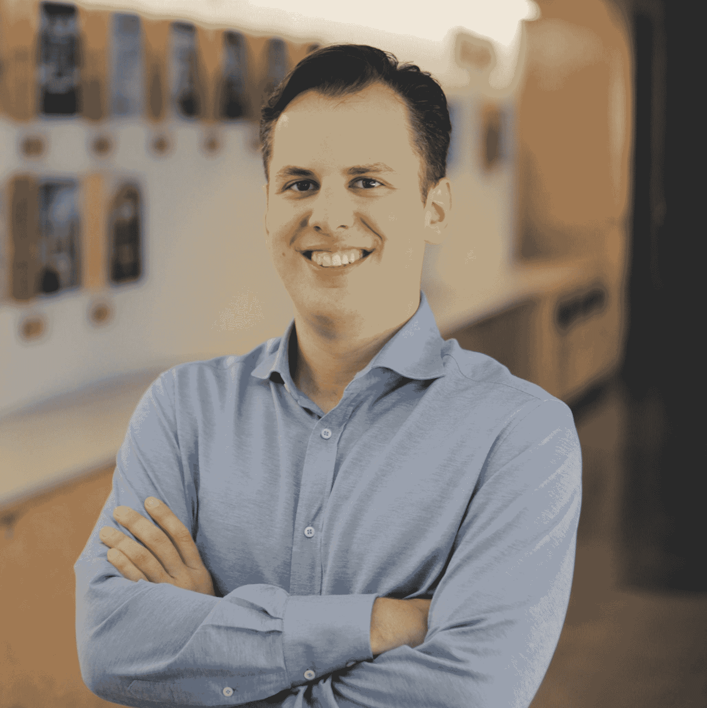

# Instagram 联合创始人 Mike Krieger 如何将其工程组织从 0 人发展到 300 人|首轮评论

> 原文：<http://firstround.com/review/how-instagram-co-founder-mike-krieger-took-its-engineering-org-from-0-to-300-people/?utm_source=wanqu.co&utm_campaign=Wanqu+Daily&utm_medium=website>

无论用什么标准来衡量，Instagram 的主要里程碑都是惊人的。当脸书在公司成立仅一年半后以 1B 美元的价格收购它时，整个创业生态系统都刮目相看了。但这既是其用户群令人难以置信的指数级增长的结果，也是其开始，从 2012 年收购时的每月 3000 万活跃用户，到两年后的 2 亿用户，再到今天的 7 亿多用户。

在内部，联合创始人兼首席技术官迈克·克里格(Mike Krieger)有他自己的一系列重要里程碑——与他的技术团队如何扩展和发展以达到其庞大的受众密切相关。在收购**的时候，他只有六名通才开发者**。如今，他领导着一个 300 多人的工程团队，迅速推出新功能和产品。在短短的七年时间里，Krieger 自己从第一次担任经理到领导一个由专业工程师组成的多层组织，其中许多人都是各自领域的佼佼者。

在这次独家采访中，他分享了他从这次经历中学到的东西，以及他希望在 2010 年回到过去告诉自己的事情。对于其他希望复制这种成功的创业公司，他讲述了如何从早期技术团队优雅地过渡到更成熟的技术团队，如何引入新的管理层，以及如何建立一个不断改进和创新的引擎。

# 建立您的早期团队，以满足您的早期需求

要启动一家初创公司，你需要几样充足的东西——勤奋、精力和解决问题的能力是其中最重要的。专业工程师？通常不会。多面手在这个阶段出类拔萃 Krieger 定义了几个关键特质和能力，根据他的经验，这些特质和能力对于建立一个多面手团队至关重要，这个团队将把你的创业带入下一个阶段:

**1。知道什么时候给牦牛剃毛。**

“你听说过那个说法吗，‘给牦牛剃毛’？”克里格说。“有时候编程意味着解决超级复杂的技术问题。但很多时候，你最终会遇到一长串的任务，这些任务是到达目的地所必需的，例如，“我需要让这个 iPhone 应用程序在我的设备上运行，这意味着我需要生成这个预置描述文件，这意味着我需要设置这个帐户，等等。”最后，你在为一头牦牛剃毛来完成最初的动作——你与它是如此的分离。"

当你在建立一个通才工程团队时，你需要那些准备好并愿意跟随这些线索直到最后的人。你需要那些渴望学习他们不知道的东西——可能超出他们工作描述的东西——的人来执行任务。

为了找到这些人，这里有一些你可以尝试的面试问题:

和他们谈谈最近的副业或工作项目；在开始真正的工作之前，他们要刮哪些“牦牛”的毛？

问他们一个跨多个学科的项目经历，甚至是他们在开始项目之前并不熟悉的学科。

**2。知道什么时候牦牛不值得剃。**

话虽如此，对一家初创公司来说，没有什么比工程时间更有价值了，你应该确保自己明智地使用了这些时间。“人们会对刮牦牛毛上瘾，”克里格说。一个高效的工程通才知道何时继续前进。

克里格回忆起 Instagram 早期的一个时刻，当时他刚刚得到了他仍然认为是他最好的建议之一:**监控一切**。

最初，这意味着要花四五个小时来实现领先的基础设施监控服务 Nagios。“最后，我想，‘我必须回去开发产品。我将满足于一个稍差的警报解决方案，它不够灵活，我知道我今天可以完成，然后继续前进。"

类似地，您可能会遇到您可以自己构建一些东西的情况。但是如果一个好的解决方案已经存在，你应该这样做吗？“最初，我们想，‘好吧，我们可以想出如何做我们自己的推送通知。但是城市飞艇就在这里"把骄傲放在一边，专注于你真正的目标. "目标不是建立 Nagios 或 Munin。我们的目标是发布软件，这样你就可以让人们使用它。"

**这是他鉴别刮牦牛毛上瘾者的最佳试金石:**

Krieger 和他的团队会让工程师们花几个小时来构建一个简单的移动应用程序或后端系统，如果他们有问题，可以完全访问 Instagram 团队。他说:“这有助于从那些(不是开玩笑)花了四个小时中的两个小时来设置编辑器环境的工程师中识别出务实的工程师。”注意他们是否明智地利用了时间，而不仅仅是结果。

**3。注重行动。**

你不可能一次做所有的事情，那么你的创业公司需要首先解决的首要、次要和第三任务是什么？你记录它们的系统不需要很复杂，但是你需要有一个。在 Instagram 的早期，Krieger 和他的团队在一个滚动的谷歌文档中记录了他们的行动项目，并按主题进行了组织。

“我们的主题之一是成为世界上最快的照片分享应用。在这一主题下，我们努力的方向是什么？接下来，我们想让照片看起来不可思议，远远超出你对手机的期望。我们在做什么？任何不符合这些条件的都被搁置了。你希望工程师们能接受这一点。”

Google Doc 是一个完美的最低限度可行的产品，用于跟踪团队的所有任务，并确保每一项任务都符合组织最重要的目标或优先事项之一。它被分成几天，几天又分成几个主题。每个主题下未完成的任务被迁移到第二天。最高优先级的任务被如此标记。这样，就不会在混乱中丢失任何东西，人们很容易评论和提问，并且他们的眼睛总是盯着他们需要实现的目标的下一步。

对于 Krieger 来说，在早期建立一个团队是至关重要的，这个团队可以使用这种类型的系统，并专注于与公司成功相关的永无止境的任务冲突。这意味着不要雇用或与那些会离开去做他们自己的事情而不关注公司范围内的执行计划的人，或者那些会浪费时间挑选不太紧迫的任务来完成事情的人一起工作。

下面是对这种注重行动的人的要求:

请告诉我们一个你为自己在功能完整性、完善性和时间性之间取得的平衡感到特别自豪的时候。“要寻找的答案是微妙的，而不是绝对的，”克里格说。“也就是说，‘我们只在准备好的时候发货’或者‘我们会在每个截止日期前发货’两个我都听过。"

# 招募热情灵活的多面手

虽然大公司有机械化招聘团队的好处，但初创公司有自己的优势:他们可以跳出框框思考和招聘——那些可能不符合现有公开招聘要求的人。克里格回忆起他和联合创始人[凯文·斯特罗姆](https://en.wikipedia.org/wiki/Kevin_Systrom "null")的第一个工程招聘[沙恩·斯威尼](https://www.linkedin.com/in/shaynesweeney "null")，这是一个典型的例子。“他从未完成大学学业。他是一个完全自学成才的程序员。我们见到他是因为我们是在 38 号码头的 [Dogpatch Labs](http://dogpatchlabs.com/ "null") 孵化的，他的桌子在我们对面。但他体现了创业精神，即“我有一个想法，我会学习一切来实现它”"

但是，除了观察坐在你对面桌子上的人，你怎么能评估这种驱动力呢？在克里格的经验中，**它作为一种基本的人格特质**与普遍而明显的好奇心密切相关。因此，首先，在谈话中倾听天生好奇的迹象。“让我们感到兴奋的候选人是那些会说‘这个星期我对围棋真的很感兴趣，所以我建造了一个围棋原型并学习了这个东西’的人。”而不是，‘嗯，我工作的公司用 React，所以我用 React。"

你也可以通过一些战略性的面试问题来激发好奇心。“我喜欢问，尤其是在早期阶段，‘有哪些让你感到兴奋的副业项目？你上一次在一个特定的项目中陷入困境是什么时候？你学到了什么？”克里格说。

当人们眼前一亮，某件事让他们兴奋时，你会迸发出激情，而不仅仅是天职。你需要早期的激情，因为工作肯定不会掉进一个小盒子里。

灵活性在一开始也是至关重要的——这可能意味着*而不是*雇佣一些你最有技能的候选人(并对此无动于衷)。

“我们采访了一个我认识的人，他是我见过的最好的 iOS 工程师之一。但在我们的谈话中，他基本上是说，‘你要知道，我拒绝做服务器端的工作。我认为这是浪费我的时间。这是一个有效的观点，”克里格说。问题是，对于 Instagram 当时的情况来说，这种思维模式过于专业化了。”我们不希望有人碰壁后说，‘嘿，我需要服务器端的工作。"

雇佣能够在不同堆栈之间跳跃的人可以让早期的工程组织保持敏捷。它还可以帮助你避免一些陷阱。克里格说:“我记得和**谈论 Digg 的时候，他说他们早期犯的最大错误之一是招聘的工程师和他们使用的技术太匹配了**。“这是一个问题，原因有二。第一，你最终会想要发展你的技术。第二，如果人们把自己的工作安全与继续使用 PHP 联系在一起，你最终会做出错误的技术选择。”

他的最后一个建议是，优先招聘多元化人才，这比新公司通常做的要快得多。雇佣多元化团队的好处是多方面的，在最近的科技文献中有充分的报道。但在狂热的早期，初创公司可能会认为这些教训并不适用于他们——或者它仍然落在优先列表的底部。

“在早期阶段，我们没有足够重视雇佣一个多元化的团队，”克里格说。这使得一旦妇女和代表不足的少数民族和背景成长起来，就更难培养他们。“如果你正在面试你的第一位女工程师，她出现了，心想，‘哇，这个团队真大，而且都是男生’，这只会让障碍变得更高。这种情况确实会发生，如果你能避免这种情况，你的情况会好得多。”

不过，尽早建立一个多元化的团队，你会收获良性循环的好处。“一旦有几名女性加入这个团队，我们很高兴能更容易地吸引更多女性，”克里格说。“从做活动到采访，再到写科技博客，仅仅是引人注目，它就催化了一个更强大的团队。”不要低估对此直言不讳的价值。仅仅在招聘对话中说这是一个优先事项不会建立你的渠道或者引起你真正想要的候选人的兴趣。直到潜在的候选人听到或看到你说过至少两次，可能是三次，直到你的团队反映出你的目标，他们才会开始理解。

# 不要对抗专业化的需求

Instagram 故事的下一部分现在是硅谷传说的一部分:2012 年，当时只有 13 个人的公司被脸书收购。到那时，克里格和西斯特罗姆既可以独立招募，也可以从脸书的训练营招募。手里拿着一个真正的品牌，他们也突然面临着带着不同期望而来的候选人。**当然，并不是每个初创公司都具备这些条件，但无论你的环境如何，接下来在技术团队多元化和专业化方面发生的事情都是相关的。**

随着对功能和增长的需求越来越多，该团队感到有必要将特定和专注的技能纳入进来——即职业 iOS 和 Android 工程师，他们可以分解产品的各个部分，并使它们比以往任何时候都更好。这是创业公司生活中常见的时刻。你需要朝着这个方向前进的信号包括:

你正在发明一些超越你正在工作的平台通常所提供的能力的东西。

你开始进入需要高度调整代码的新市场。在 Instagram 的案例中，这使得视频在新兴市场表现良好。

您的代码库已经扩展，需要技术来引导未来的增长。

随着越来越多的专业专家(即职业 iOS 和 Android 工程师)加入 Instagram，现有团队的能干、通才能量第一次与专业化发生碰撞。

“我们了解到做事有规范的方式。有时候是教条；克里格说:“有时候它的存在是有原因的。他回忆起一个简单甚至愚蠢的例子:Instagram 是他和 Systrom 的第一个大型 Python 项目，所以他们很早就一起决定了一些代码约定。“后来，Python 工程师会说，‘你为什么要在等号两边加空格？’我们只是觉得这样更好看。他们说，‘没人会这么做。’"

最终，您希望朝着行业标准前进，因为这使得新人更容易加入您的团队。(是的，Krieger 最终确实回去把他的 Python 代码做得和其他人的一样。)你可能会在某种程度上抵制专业化，坚持你早期的、好斗的方式。抵制诱惑。你雇佣专家是有原因的，所以让他们发挥自己的专长。

我用胶带把一个基础设施粘在一起，以我当时的理解水平，它出奇的坚固。但在某些时候，你需要有人过来，在你搭好脚手架的地方建造真正的墙。

当涉及到将现有的团队成员安排到一个日益专业化的结构中时，这通常会自行解决。"即使是我们的多面手也喜欢其中的一个领域."这仅仅是向每个工程师解释成熟的组织需要什么，并看到他们在哪里被自动吸引。一些人显然被 iOS 吸引，另一些人则被基础设施等吸引。一旦你观察到这一点，让他们坐下来，非常明确地说，如果他们愿意，你可以把他们的大脑全部用在那个特定的领域。承认他们的技能有多优秀，以及他们会给公司带来什么好处。

专业化也不意味着抛弃所有让你起步的灵活性，或者仅仅为了它而建造坚硬的墙。“事实上，你早期的多面手有广泛的意识，使他们成为更好的工程师，”克里格说。

接受他的第一份工作吧，肖恩。“我们一度试图加快测试周期。构建和部署需要很长时间。这个解决方案最终成为了一个基础设施，这需要大量的 Python 脚本。我没有把基础设施团队的人拉进来，而是说，Shayne，你知道端到端的东西。你会想出这些点子，然后在你的办公桌上创建 MacBuildServer。"

拥有深厚端到端知识的人是一笔总资产，远远超出了你的专长。他们可以让团队的其他成员更有效率。

# 在你认为你需要经理之前，你需要经理

正如你的工程师团队将会发展一样，你的领导力也需要成熟。一开始，你的组织可能是扁平的。不必要的管理手段只会损害小公司最大的资产——开放性和灵活性。尽管如此，这并不意味着创始人可以简单地离开他们早期的团队去领导自己。

你希望在正式管理之前，团队中就有管理者的行为。

“经理行为”是如何体现的？举个简单的例子:一对一。“在我们开始做之前，我们花了整整一年半，两年的时间，”克里格说。最后，Instagram 在 Benchmark 的首席合伙人马特·科勒(Matt Cohler)推了他一把。“我记得第一次与人一对一交谈时，我想，‘哇，表面下有很多没人谈论的东西。’"

回想起来，克里格发现压力越来越大，幸运的是他们及时释放了压力。“但对我来说，这是一个大开眼界的时刻。他说:“当你是一名创始人时，你肯定会很开心——或者这根本不是你该问的问题，因为公司是你的孩子，你正努力让它成长。”“加入的人投资于它的成功，但他们也是活生生的、有欲望、有需求、有问题的人。多面手和专家之间的过渡时刻是我们开始有更多管理的时候。现在回想起来，我本可以更快地完成。”

实施管理行为本身是至关重要的，但它也是一个有价值的衡量标准。当你，一个创始人或早期领导者，不能满足你自己的工作产品和管理任务的需求时，是时候让另一个经理加入了。当你认为你*可能*十有八九需要的时候，你真的真的需要。

在 Instagram 和我提供咨询的公司，我一次又一次地看到，一旦你增加了一个管理职位——一个你甚至不确定自己是否准备好的职位——你会意识到你只意识到需要完成的前 5%的工作。克里格说:“另外 95%的工作没有完成，因为没有专人负责。”。“对于我们的经理来说，这是加快我们的招聘流程，规划活动，思考应用程序的未来。我每周只有一天思考这些事情是完全不够的。”

以下是他如何建议从公司内外招聘经理的:

**1。从内部提升。**

Krieger 从这种方法开始，Instagram 最初的工程经理本质上是团队中任期最长的成员。这提供了几个天然的优势，主要是对团队的其他成员来说很容易。“选择任期最长的人的好处是，他们通常是招募他们现在报告的人。这已经感觉像是经理的行为，而且这已经成为他们与团队中其他人互动的动力。”

尽管如此，他承认他很幸运这种方法奏效了，因为它并不总是自动的或最好的举措。他说:“看任期总是识别你的技术领先优势的一个极好的方法，但它不一定是识别你的经理的正确方法。”只有当他们有兴趣以这种方式成长时，你才想让他们成为经理。所以一定要搞清楚。

现在，Krieger 确保他的所有经理都与他们的团队进行职业对话，并让他们寻找对管理感兴趣或有天生亲和力的工程师。“我的理念是，如果我们有感兴趣的工程师，通常我们应该让他们尝试一下，并为他们提供指导。”

也向新经理报到，让他们知道如果他们需要的话，有一个出口。甚至那些认为自己想要这个角色的人最终也会发现这让他们很痛苦。“在此过程中，比如说每六个月进行一次检查。你还开心吗？你想承担更多吗？你想回到个人贡献者的状态吗？确保人们正在从事他们最感兴趣的工作。如果他们不是，他们会不高兴并离开，或者他们的团队会不高兴。"

**2。从外面招聘。**

即使你从内部晋升开始，你最终也需要从外部寻找新的管理者。在 Instagram 的案例中，基础设施团队需要一名经理，而现有的工程师没有一个对此感兴趣。“如果从内部提拔经理很可怕，那么聘用我们的第一位外部经理要可怕 10 倍。这是我们面试的第一位经理，”他说。

目前管理一支年轻团队的人很少会出去找工作，所以这些候选人少之又少。“如果你处于那个阶段，你通常会拼命坚持，努力壮大你的团队。”最常见的情况是，你在招聘渠道中寻找的人是曾经在那里工作过，现在管理着一个大得多的组织的人。“也许他们感觉脱离了工作，并对重新投入工作感到兴奋。真正了解他们为什么想加入你这个更小、更有战斗力的团队。”

筛选掉那些对你的小团队规模不感兴趣、看不到成长潜力的人。“如果你看看 2012 年的 Instagram，我们有大约 8 人的工程团队和 3000 万个月。你知道我们必须成长。没有办法雇佣一个能够亲自处理这件事的人。”

克里格回忆起与 2015 年被他聘为工程主管的吉姆·埃弗林汉姆的一次谈话。“他之前在雅虎负责一个千人团队，现在将加入一个 120 人的团队。他告诉我，‘这个团队在几年内将会有 500 人。’"克里格自己也对这个数字感到惊讶。"但吉姆知道，”他说。这些是强有力的候选人——那些你不需要推销的人，因为他们已经能预见未来。

简而言之，你要找的是一个对建设有真正热情的人——这种热情如此之高，以至于在很多情况下，他们愿意从一个大型的、成熟的团队变成多年来第一次随叫随到的人。作为交换，创始人欠那些早期管理者开放和坦诚。

作为第一次创业的人，你必须对自己诚实，你正在学习。你必须谦逊地对你更有经验的经理说，‘我将管理你，因为我管理工程团队，但我很高兴向你学习。“你找到了什么作品？”

从如何组织团队会议开始，所有的事情都可以在早期输入。不要试图向你的经理隐瞒你缺乏经验；相反，利用他们的专业知识。

“建立这种关系非常有价值。能够说，‘看，我们在一起学习。我知道为什么 Instagram 是这样运作的。我凭直觉知道我们应该做什么。但你有经验能够凭直觉行事。"

# 让你的团队接受新的管理

即使你和你的早期经理很容易达成共识，你仍然需要让团队的其他成员明白环境和他们的角色发展的有多快。首先，不要害羞。当需要雇佣经理的时候，让每个人都知道这件事正在发生。“总是从一个为什么开始。我不知所措。我们需要有人来扩大团队。这奠定了基础。"

说到招聘本身，有几条路可以走。“你可以走共识驱动的道路，你决定让团队中的所有工程师都来面试候选人。你决定让他们一致同意，他们想和一个有招聘标准的人一起工作。”不过，请记住，这些团队成员本身并不是经理，他们的评估通常会归结为他们是否喜欢某个候选人。“这很难，你可能无法达成共识。”

克里格倾向于对早期管理人员采取一种相关但温和的方法。首先，评估候选人的资格，依靠有经验的领导人；他招募了脸书的其他经理，尽管其他公司没有同样的支持，可能会吸引投资者或其他企业家。然后，一旦聘用条款确定下来——但在签署任何东西之前——把应聘者带到办公室呆一整天。

“你很少会从现有的团队中获得欣喜若狂的兴奋感——毕竟这是一种改变。这个团队过去直接向你汇报。现在他们向另一个人汇报。但你至少可以得到红色警报，‘不要雇用这个人’这种信号，”克里格说。

你不太可能得到那种破坏交易的回应，但要敏感地认识到，你的工程师可能仍然有顾虑，而且他们的顾虑可能不一样。“我和同一个高管教练共事多年。她告诉我的一件事是，如果有人在一个领域枯竭，而你在另一个领域给他们丰富，那就没用了。这就像如果有人对他们的爱情生活感到沮丧，你说，'但你的工作进行得很好。'这并不是他们倒下的原因。"

(顺便提一句，辅导是克里格向新领导者推荐的首要内容之一。“我从没有管理过一个团队，到管理一个几十人、然后几百人的团队。没有教练指导，我是做不到的。”通过一个脸书管理教练项目的介绍，他与马库斯·白金汉公司的玛吉·亨索一起工作。)

特别是，当你提拔你的一两个经理时，问问自己:这对团队中的每个人有什么影响。“当我们聘用第一位经理时，我的一位工程师说，‘看，我刚从一家两年内换了八位经理的公司过来。两个月后我会有另一个经理吗？那个人需要我提供担保。所以我说，‘不，我认为他会长期留在这里。这是连续性的计划。这些是我要移交给他的优先事项。让我们继续一起一对一几个星期吧。"

此外，提醒你的早期团队，这些变化对公司和他们个人都是积极的。“告诉他们，‘你也要向这个人学习。你会成长的，”克里格说。“我想我所有的早期工程师都会完全同意他们已经做到了。”

# 从个人身份转移到团队身份

随着组织的成熟，你不仅仅是细化你的工程师的角色。你也在团队层面创造了一个新的身份单元。“人们会觉得他们以前什么都做，现在却没有。现在他们有了一个团队。”当这种情况发生时，开始重新关注他们的影响。“我会告诉人们，‘你现在正在开发的功能？克里格说:“一旦它上线，它的用户数量将超过你刚开始在这里工作时 Instagram 的所有用户。

这不仅仅是嘴上说说。伴随着增长而来的是更多的机会，不仅可以塑造你公司的产品，还可以塑造它的精神气质。Krieger 指出了工程组织发展的两个关键阶段，每个阶段都对公司的发展有重大影响:

**从多面手到平台团队。**你在这个阶段雇佣和培养的工程师——当你处于扩展的尖端时——将决定你长期的工程文化。“很明显，早期的建造者让我们离开了地面。但事实上，我们今天有一个成功的工程组织，我认为这要归功于在现阶段围绕工程建立了正确的环境、正确的质量标准和正确的风气。”

早期，你的牦牛刮毛通才可能没有倾向或带宽来考虑规模建设。然而，当你向更高的专业化迈进时，创造这种期望是至关重要的。“你需要创造人们可以在其中操作的通道，而不是一个绝对混乱的过程，从现在起两年后，你已经创造了大量的技术债务。”对于 Instagram 来说，这意味着围绕平台培养身份认同。

“作为 Instagram 的 iOS 工程师、Android 工程师或基础设施工程师，我们创造了一个非常强大的身份。我希望人们认为，‘我们现在只有 8 名安卓工程师，但几年后我们可能会变成 30 或 40 岁。“我们今天需要做些什么来帮助我们解决问题呢？”"

通过围绕平台进行组织，克里格可以加倍关注团队的质量。“以安卓为例。从一开始，我们就想发布一款高质量、精致的 Android 应用，甚至超出了平台当时允许我们做的事情。”这种专注影响了他们的工作方式和雇佣的人员。

“我们说先做简单的事情，力求简单，而不是过度抽象。克里格说:“为结果感到自豪，而不是为你为实现目标而创造的抽象概念感到自豪。这些价值观对 Instagram 的成功至关重要，在公司发展的这一阶段得到了具体化。

人们常常把你被平台组织起来的阶段视为通往产品团队的必经之路。我觉得其实就是你形成你的工程文化的时候。

**从平台团队到产品团队。**几年后，Instagram 已经超越平台，成为其核心工程单位。现在，他们围绕产品团队建立身份。

说到这种转变，时机就是一切。做得太早，你会失去文化建设中间阶段的好处。但是，如果做得太晚，你可能会播下不和的种子。“我们在 150 名工程师左右进行了调整，但为时已晚，”克里格说。“我认为，当你的产品经理和工程经理开始互相憎恨时，这个转折点——也是我们需要改变的最明显的迹象。”

在转换之前，任何新产品的产品经理都必须找到每个工程经理，从他们的团队中招募一名工程师。“太好了，现在你正与四名工程经理和至少四名工程师合作完成一件事，”克里格说。"你让真正聪明的人成为人力资源分配者."与此同时，没有人对该公司正在从事的工作有一个大致的了解。“每个人都在试图做出全球优先决策，但他们只在本地可见。”

通过围绕产品进行组织，克里格恢复了以目标为导向的效率(和良好意愿)。就像从通才到专业文化的最初转变一样，克里格发现这在很大程度上是自我选择。他说:“你所做的只是把以前隐含的偏好变得明确。”。“例如，我们会说，‘谁想从事现代化工作？’尽管我们过去有一群来自不同平台团队的乌合之众，但现在他们在一起工作。"

当你围绕你所有的核心产品建立团队时，你也可能会发现没有人超级感兴趣的差距——这没关系。“现在你有了下一步行动，那就是去招募那些对 iOS 增长感兴趣的人。”

最终，7 年过去了，300 个人过去了，Instagram 的工程组织的使命与那个滚动的谷歌任务文档的时代并没有改变。“你得记得再问一次，目标是什么？你在解决什么问题？墙外没有人关心我们如何到达那里，他们只关心产品的质量。作为一项指导原则，我们一直在组建工程团队，以培养创造高质量产品的共同责任，最终，这就是你们在任何规模或阶段都应该努力实现的目标。”