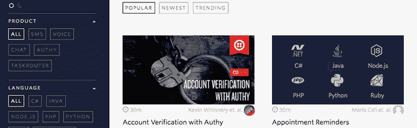
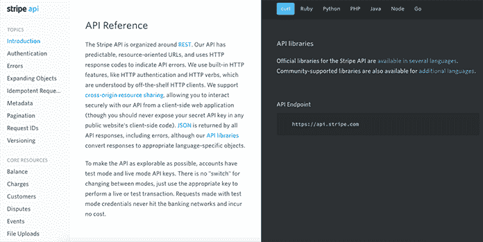
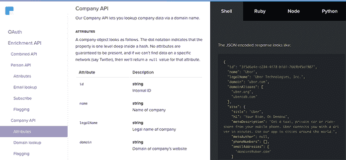
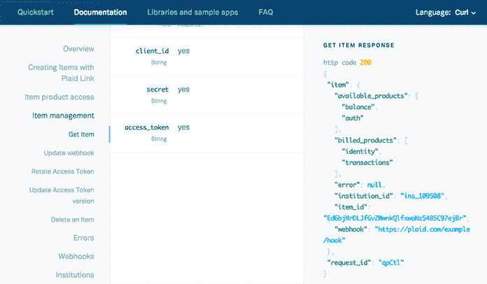

# 优秀 API 文档的十大要素——一个单独的列表

> 原文：<https://alistapart.com/article/the-ten-essentials-for-good-api-documentation?utm_source=wanqu.co&utm_campaign=Wanqu+Daily&utm_medium=website>

API 文档是任何实现 API 的人的首选参考，它可以深刻地影响开发人员的体验。因为它描述了应用程序编程接口提供什么服务以及如何使用这些服务，所以您的文档将不可避免地对您的产品产生印象——无论是好是坏。

下文继续

在这个由两部分组成的系列文章中，我将分享我对 API 文档的了解。这一部分讨论了帮助您创建好的 API 文档的基础知识，而在第二部分，优秀 API 文档的十个附加部分，我将向您展示改进和微调您的文档的其他方法。

知道你的写作对象是谁，以及你如何能最好地支持他们，将有助于你对文档的设计、结构和语言做出决定。你必须知道谁访问了你的 API 文档，以及他们想用它做什么。

您的 API 文档可能会被以下受众访问和使用。

基于他们的技能、经验和在项目中的角色，开发人员通常是最大和最多样化的群体。他们会以不同的方式使用你的文档。

在 Pronovix，我们开始与我们的客户一起举办开发人员门户研讨会，帮助他们更多地了解开发人员需要什么，如何最好地支持他们的工作，以及他们在 API 文档中真正需要什么。这也得到了可靠研究的支持，例如斯蒂芬妮·斯坦哈特在梅泽堡应用科学大学为期两年的研究项目后发表在 [Stephanie Steinhardt 的文章](https://www.parson-europe.com/en/blog/440-api-documentation.html)中的发现。

新手:缺乏 API 经验的开发人员往往最需要支持。他们将利用快速入门指南，鼓励他们开始使用您的 API——针对最重要主题的清晰、简明、循序渐进的教程，以及帮助他们了解如何在实际项目中使用它的示例代码和示例。如果你能让新来的人感到愉快，他们将更有可能致力于学习你的 API 的每一个细微差别。

外部开发人员:已经在使用你的 API 的开发人员会反复回到你的文档中，并把它们作为参考资料。他们将需要你的 API 提供的所有功能的快速信息，以一种容易理解的方式来帮助他们快速找到他们所需要的。

**调试器:**使用您的 API 的开发人员会不时遇到错误，并使用您的文档来分析突然出现的响应和错误。

内部开发人员: API 提供者倾向于过多地关注他们的外部受众，以至于忘记了他们自己的开发人员；从事 API 工作的内部团队也将使用 API 文档。

这些只是最常见的用例。

像首席技术官和产品经理这样的决策者也会检查你的 API 文档并评估你的 API。他们需要确定你的 API 是否适合他们的项目，所以这个团队能够方便快捷地找到他们想要的东西对你的业务至关重要。

虽然不常见，但记者、技术作者、支持人员、开发人员、甚至你的竞争对手都可能会阅读你的 API 文档。

## 记住文件的目的[#第 6 节](#section6)

API 文档的基础是对每个调用和参数的清晰解释。

作为最低要求，您应该详细描述:

*   API 中每个调用的作用
*   每个参数及其所有可能的值，包括它们的类型、格式、规则以及它们是否是必需的。

### 基于上下文的结构 [#section7](#section7)

人们不会按顺序阅读你的 API 文档，你无法预测他们会停留在哪个部分。这意味着，你必须提供他们在上下文中需要的所有信息。因此，遵循基于主题的创作的最佳实践，您应该在每个调用的解释中包含所有必要的相关信息。

[上下文。例如，IO](https://docs.context.io/) 很好地记录了他们的每个 API 调用，分别提供了参数及其可能值的详细信息，以及有用的提示和相关主题的链接。

为了能够实现您的 API，开发人员需要理解它以及它所涉及的领域(例如，电子商务)。真实世界的例子减少了他们熟悉你的产品所需的时间，同时也提供了领域知识。

将以下内容添加到每个呼叫的描述中:

*   一个如何打电话的例子
*   对请求的解释
*   样本响应

研究表明，当了解一个新的 API 时，一些开发人员立刻喜欢钻研编码。他们从一个例子开始工作。对眼球追踪记录的分析表明，视觉元素，如示例代码，吸引了浏览页面的开发人员的注意力，而不是逐行阅读。许多人在开始阅读描述之前查看了代码示例。

使用正确的例子是改进 API 文档的可靠方法。在我即将发表的文章“伟大的 API 文档的十个额外因素”中，我将使用例子来探索将优秀的 API 文档转化为伟大的 API 文档的方法。

当开发过程中出现问题时，在没有详细文档的情况下修复问题可能会成为一个令人沮丧且耗时的过程。为了使这个过程尽可能顺利，错误消息应该帮助开发人员理解:

*   问题是什么；
*   错误是源于他们的代码还是源于 API 的使用；
*   以及如何解决问题。

所有可能的错误——包括边缘情况——都应该用错误代码或简短的、人类可读的信息记录在错误消息中。错误消息不仅应该包含与特定调用相关的信息，还应该解决通用的问题，如身份验证或 HTTP 请求以及其他不受 API 控制的情况(如请求超时或未知的服务器错误)。

来自 Box 的这篇[帖子讨论了服务器端错误处理和通信的最佳实践，比如返回一个与错误条件非常匹配的 HTTP 状态代码、人类可读的错误消息和机器可读的错误代码。](https://blog.box.com/blog/get-developer-hugs-with-rich-error-handling-in-your-api/)

开始实现您的 API 的新手面临许多障碍:

*   他们正处于陡峭的学习曲线的起点
*   他们可能不熟悉 API 背后的结构、领域和思想
*   他们很难想出从哪里开始。

如果你不使学习过程对他们来说更容易，他们会感到不知所措，并避免钻研你的 API。

许多开发人员在实践中学习得最好，所以快速入门指南是一个很好的选择。该指南应该简短，面向新手，列出完成一项有意义的任务所需的最少步骤(例如，下载 SDK 并将一个对象保存到平台)。快速入门指南通常必须包含关于领域的信息，并更详细地介绍与领域相关的表达式和方法。最保险的做法是假设开发人员从未听说过您的服务。

Stripe 的和 [Braintree 的](https://developers.braintreepayments.com/start/overview)快速入门指南就是很好的例子；两者都提供了您希望使用 API 执行的最有可能的任务的概述，以及相关信息的链接。如果您需要帮助，它们还包含联系某人的链接。

教程是一步一步的演练，涵盖了开发人员可以用您的 API 实现的特定功能，如 SMS 通知、帐户验证等。

API 教程应该遵循编写任何一种分步帮助的最佳实践。每一步都应该包含该点所需的所有信息——除了之外*。这样，用户可以专注于手头的任务，而不会被他们不需要的信息超载。*

步骤的描述应该简单易懂。清晰和简洁有助于学习过程，是各种文档的最佳实践。尽可能避免行话；用户将学习与领域相关的语言和新技术，行话可能会造成混乱。尽可能让所有的描述易于理解，以此来帮助他们。

演练应该是让用户完成任务的最小可能块。如果一个过程太复杂，考虑把它分解成小块。这确保了用户可以获得他们需要的帮助，而不必经历他们不感兴趣的步骤。

[Twilio’s tutorials](https://www.twilio.com/docs/tutorials?filter-product=sms&filter-product=voice&order_by=-popularity_rank) explain the most-likely use cases with sample apps in a wide variety of programming languages and frameworks.

要实现您的 API，开发人员需要了解一些更大的主题，例如:

*   **认证。**由于每种 API 的处理方式不同，认证(例如 OAuth)通常是一个复杂且容易出错的过程。解释如何获取凭证，如何将凭证传递给服务器，并展示 API 键如何与示例代码一起工作。
*   **错误处理。**目前，错误处理还没有标准化，所以你应该帮助开发者理解你的 API 是如何回传错误信息的，为什么会出现错误，以及如何修复错误。
*   **HTTP 请求。**您可能还需要记录与 HTTP 相关的信息，比如内容类型、状态代码和缓存。

用一个单独的部分来解释这些主题，并从每个相关的 API 调用链接到这个部分。这样你可以确保开发者清楚地看到你的 API 如何处理这些主题，以及 API 调用如何基于它们改变行为。

## 布局和导航[#第 13 节](#section13)

布局和导航对于用户体验来说是至关重要的，尽管对于所有 API 文档来说没有通用的解决方案，但是有一些最佳实践可以帮助用户与材料进行交互。

大多数 API 文档的好例子都使用动态布局，因为当用户在大量文档中查找特定主题时，动态布局比静态布局更容易导航。从可扩展的动态布局开始也将确保您可以根据需要轻松扩展您的文档。

如果你的 API 文档不是很大，那就采用单页设计，让用户一眼就能看到整体结构。从那里介绍细节。长的单页文档也让读者可以使用浏览器的搜索功能。

[Stripe](https://stripe.com/docs/api#intro) managed to present extensive documentation in an easy to navigate single page.

### 持续导航[#第 16 节](#section16)

保持导航始终可见。用户不想滚动寻找一个消失的导航条。

两栏或三栏布局在左边有导航，在右边有信息和例子。它们通过在上下文中显示端点和例子来使理解更容易。

[Clearbit’s](https://clearbit.com/docs) three-column layout displays persistent navigation (table of contents) on the left, references in the middle, and code examples on the right.

通过突出语法来提高示例的可读性，使得代码更容易理解。

The syntax highlighter in action on [Plaid’s](https://plaid.com/docs/api/) API documentation site.

如果你想开始试验你的文档的布局，你可能想看看一些免费的开源 API 文档生成器。

为了了解在开发人员门户环境中组织 API 文档的不同方法的优缺点，[这是 Nordic APIs 的一篇优秀文章](https://nordicapis.com/3-ways-organize-api-developer-docs/)。

你发表的所有作品都应该经过编辑过程。对于文章和其他出版物来说，这是常识，但是对于技术文档来说也同样重要。

你的 API 文档的作者应该以**清晰**和**简洁**为目标，确认所有必要的信息都在那里，并且结构合理，主题不会被不必要的内容冲淡。

编辑应该校对你的文档，找出语法错误和任何难以阅读或理解的部分。他们还应该对照你的技术文档风格指南检查文档，并在需要时提出修改建议。

一旦文档的一部分准备好发布，向目标读者展示它是一个好主意，尤其是那些自己没有处理过文档的开发人员。他们可以捕捉到不一致的地方，并洞察到遗漏了什么。

尽管当您必须关注 API 的许多其他方面时，编辑过程可能会感觉像是一种负担，但几次迭代可以在最终副本和您留下的印象中产生巨大的差异。

如果您的 API 文档已经过时，用户会因为碰到不再存在的特性和缺少文档的新特性而感到沮丧。这可能会很快削弱您通过在文档中投入大量工作而建立起来的信任。

在维护您的 API 文档时，您应该关注以下几个方面:

*   **已弃用的功能。**删除不推荐使用的功能的文档，并解释它们不推荐使用的原因。
*   **新功能。**在发布前记录新功能，并确保为新内容留出足够的编辑时间。
*   **反馈。**您从支持部门或分析部门获得的有用反馈应反映在您的文档中。很有可能你不能一次就让你的文档变得完美，但是基于用户所说的，你可以不断地改进它们。

为了让所有这些工作，您必须建立一个维护文档的工作流。考虑一下上述方面、编辑和发布的检查点和流程。如果你能建立一个定期回顾你的文件的程序(例如每季度一次)也会有所帮助。

遵循这些最佳实践，您可以为您的 API 文档建立一个坚实的基础，随着您对用户如何与他们进行交互有了更多的了解，您可以不断地对其进行改进。请继续关注第二部分，在那里我会给你一些如何把好的 API 文档变成令人惊奇的文档的技巧。