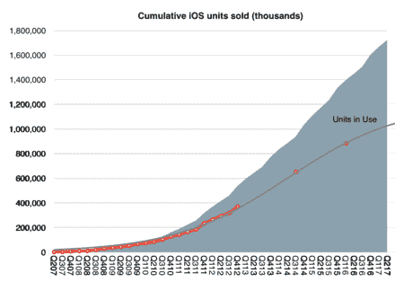

# 硅谷——asym co

> 原文：<http://www.asymco.com/2017/10/02/silicon-valley/?utm_source=wanqu.co&utm_campaign=Wanqu+Daily&utm_medium=website>

你可能听说过苹果公司的乔尼，但可能不知道张诗钟。

乔尼是一位知名高管，被称为苹果设计的代言人。张诗钟是苹果整个产品线中负责定制硅和硬件技术的高管。

在张诗钟的领导下，苹果已经在 20 多个型号和 11 代产品中发运了 17 亿个处理器。目前，苹果的微处理器出货量超过了英特尔。

[T2】](http://www.asymco.com/wp-content/uploads/2017/10/Screen-Shot-2017-10-02-at-3.37.02-PM.png)

苹果 A11 仿生处理器拥有 43 亿个晶体管，6 个核心和一个使用 10 纳米 FinFET 技术的苹果定制 GPU。它的性能似乎是竞争对手的两倍，在一些基准测试中超过了当前笔记本电脑的性能。

在承诺控制其(移动)产品中的关键子系统十年后，苹果已经到了主导处理器领域的地步。但是他们并没有止步于处理器。这项工作现在涵盖了硅的所有方面，包括显示器、存储器、传感器和电池的控制器。Apple Watch 中的 S 系列，MacBook 中的 haptic T 系列，AirPods 中的 wireless W 系列都是正在进行的努力。GPU 在去年被攻克。与高通的诉讼表明，通信栈是下一个目标。

这种对硅片的一刀切的方法既不容易，也不快速，也不便宜。这一持续多年、价值数十亿美元的承诺源于乔布斯的观察，即现有的供应商网络不足以满足你的需求。微型耳机、智能手表、增强现实、自适应声学都需要你把问题的所有部分都包起来。it 要求的集成和控制与将现成组件组装成足够好的配置的模块化方法形成对比。

模块在某些时候和某些地方是合适的，而在某些时候和某些地方则不合适。这个决定取决于你是在创造新的体验或新的“绩效衡量标准”，还是在现有的体验或绩效衡量标准内优化成本。

微处理器的概念是对之前分立元件设计的摒弃。早期计算机的中央处理器由许多分立元件组成。VLSI 代表强调集成的超大规模集成电路。随着计算向环境和无处不在的方向发展，使用分立元件的想法再次成为规范，但苹果认为这还不够。

因此，尽管硅谷的“硅”已被视为不合时宜，但今天的硅发展意味着竞争优势。唯一的问题是，建立竞争力需要几年甚至几十年的时间。与 Jony Ive 领导的苹果公司成为以设计为中心的企业所用的时间相同。

苹果现在也需要从张诗钟·斯鲁吉领导的以硅为中心的工程角度来理解。