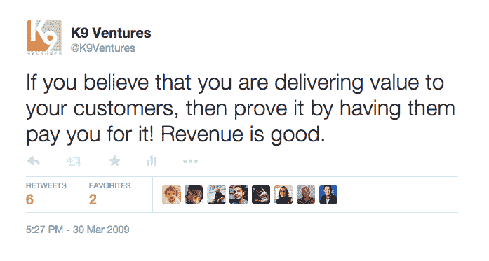

# 反对 FREE | K9 Ventures 的理由

> 原文：<http://www.k9ventures.com/blog/2009/05/10/the-case-against-free/?utm_source=wanqu.co&utm_campaign=Wanqu+Daily&utm_medium=website>

首先，我承认这篇文章的目的是希望引发一场讨论，点燃一把火，让你和你的创业公司认真思考你的商业模式应该是什么。这篇文章的标题“反对免费的案例”是对[克里斯·安德森](http://www.longtail.com/the_long_tail/about.html)在[连线杂志](http://www.wired.com)中的[封面故事](http://www.wired.com/techbiz/it/magazine/16-03/ff_free?currentPage=all)的回溯，标题为[免费:为什么 0.00 美元是商业的未来](http://www.wired.com/techbiz/it/magazine/16-03/ff_free?currentPage=all)，但是，这篇文章并不是真的打算对克里斯·安德森的观点进行详尽的反驳。这让我有了一个有趣的标题来表达我对创业商业模式的看法(或者经常缺乏这种模式)。

我论点的核心是一条我在 Twitter 上至少发了两次的简短推文:

[T2】](https://www.k9ventures.com/wp-content/uploads/2009/05/Case-against-free-tweet.png)

具体来说:太多的初创公司觉得他们起步的正确价位是“免费”他们没有意识到的是，一旦你开始免费提供有价值的服务，以后就很难对同样的服务收费。如果这种服务恰好是你所能提供的核心价值，那么你就已经放弃了。是的，你可以声称使用“免费增值”模式，以便对核心服务之外的附加功能或服务收费，但是，如果你放弃了服务中最有价值的部分，转向付费高级服务的人数不会很高。

我见过太多的公司落入这个陷阱。在很多情况下，公司因为竞争而落入这个陷阱。是的，竞争对消费者来说是件好事；它鼓励公司制造更好的产品，提供更好的价值，在某些情况下，免费赠送一切。最后一部分是我要反对的。价格竞争并不总是一件好事。如果你想竞争，就通过创新竞争，通过超越智慧竞争，通过质量竞争，通过以更好的方式解决客户的问题竞争。如果你通过让你最有价值的产品的价格为零来竞争，那么你所成功做的就是给自己制造了一个“被零除”的问题，如果你是一个小小的极客，你会知道那是一个[难](http://en.wikipedia.org/wiki/NaN)。

与克里斯·安德森对免费的观点相反，**我坚信最好的收入模式是金钱直接转手的地方**。你给我带来了真正的价值，我很乐意为此付给你合理的金额。这一直是商业的根本基础，而且在可预见的未来仍将是商业的根本基础。金钱易手以获得价值的核心原则是每一个真实的、可持续发展的企业都必须遵循的不变原则。不管你是通过直接交换还是三方交换还是其他方式都没多大关系。如果你不赚钱，那么你就没有真正建立一个可持续发展的企业(难怪这么多初创公司被戏称为“非盈利公司！”).

在我看来，这三种商业模式很少有成功的。谷歌显然是一个成功的例子，而且非常成功。但并不是每个创业公司都能够做到这一点，尤其是不是每一种产品。广告一直是一个三方模式，很多(好吧，也许“一些”在这里是一个更好的词)公司利用广告模式赚了很多钱(比如谷歌)；但我更倾向于直接收入模式。这是我的观点，我一直坚持。

我举个例子: [Plaxo](http://www.plaxo.com) 。我经常抱怨 Plaxo，因为我相信他们一开始就有一个绝妙的想法。管理联系人是一个巨大的问题，老实说，没有人比 Plaxo 更好地解决了这个问题。他们做对了几件事:更新在网络上传播的能力在概念上很棒。将我所有的联系人都备份到云上，并且能够在多台机器和设备之间进行同步，这太棒了。但是，他们也犯了一些错误:他们对电子邮件的使用过于宽松，以至于让人觉得他们是垃圾邮件的制造者。最重要的是，Plaxo 犯的最大错误(在我看来)是他们开始免费赠送他们的核心价值。Plaxo 提供的核心价值是*备份*和*同步*Outlook 中的数据。Outlook 崩溃或计算机崩溃的情况有很多，恢复有价值的联系人数据的唯一方法是与 Plaxo 重新同步，我真的很感谢他们！但是，他们免费赠送，然后从未真正找到一个合理的追加销售，为公司建立一个真正的商业模式。

我甚至不会开始谈论我所谓的“临界质量游戏”——那些*希望*基于流量和广告来赚钱的业务。这个模型没有缺陷，只是过于乐观了。很少有公司能够达到足够的临界质量来使其运转。

你最不想做的事情就是在商品市场上竞争。“免费”的心态和先获得用户，然后再想办法赚钱的心态(见下一篇即将发表的关于商业模式迭代的文章)正在创造一种环境，将我们的公司置于商品市场。我们真的在卖瘦肉猪还是咖啡？我以为我们处在一个创新很重要的行业。如果创新很重要，那就通过制造更好的产品来证明这一点——你的客户会乐意为你支付真正的美元。