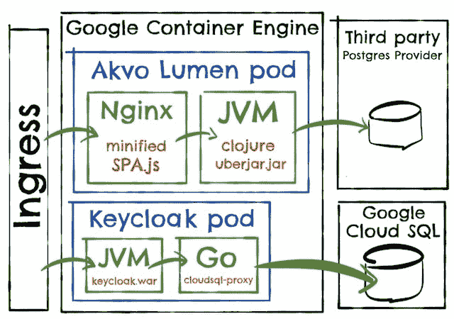
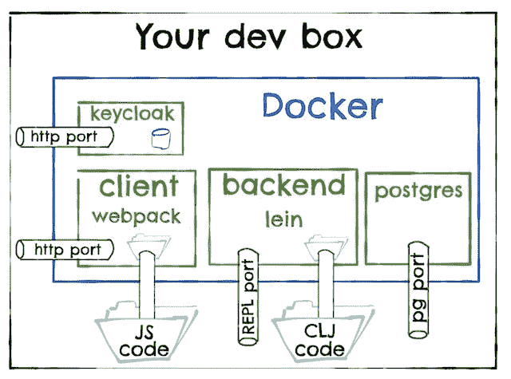

# 如何构建一个开发者环境:一个开源的例子

> 原文：<http://danlebrero.com/2017/09/25/how-do-docker-compose-development-environement/?utm_source=wanqu.co&utm_campaign=Wanqu+Daily&utm_medium=website>

一个高效的团队需要有一个建立开发环境的简单方法。这是一个如何做的详细例子。

正如我们在[之前的博客文章](/2017/09/01/a-docker-compose-environment/#content)中提到的，你应该努力为你的项目建立一个简单且可重复的开发环境。

在这篇博文中，我们将详细介绍一个来自 Akvo 的开源项目的例子。

依我看，有一种不痛不痒的方式来建立一个开发环境是为开源项目的贡献者消除一些摩擦的关键方面之一。

## Akvo 流明建筑

我们要看的项目叫做 [Akvo Lumen](https://github.com/akvo/akvo-lumen) ，是一个[“易于使用的数据混搭、分析和发布平台”](http://akvo.org/products/akvo-lumen/)。

Akvo Lumen 是一个带有 Clojure 后端的 Javascript 单页应用程序(SPA ),如下所示:



*   Keycloak 是一款开源的单点登录应用。它与其他 Akvo 产品共享。
*   Nginx 为 SPA 提供服务，并将请求代理到后端。
*   后端就是后端…

## 在 docker 撰写之前

设置开发环境的指令是我们称之为“经典”的:安装 Postgres，运行这个 init 脚本，下载这个构建工具，运行这个命令…

但是在这个特殊的例子中，它们被分成了三个文件: [keycloak](https://github.com/akvo/akvo-lumen/tree/21882586987927bc496e94c76e3faf6cbf965085/keycloak) 、[后端](https://github.com/akvo/akvo-lumen/tree/21882586987927bc496e94c76e3faf6cbf965085/backend)和[温泉](https://github.com/akvo/akvo-lumen/tree/21882586987927bc496e94c76e3faf6cbf965085/client)。

就我个人而言，在按照说明操作时，我没有意识到我必须在本地运行 KeyCloak，并且其中一个 npm 依赖项不能在我的开发者盒子中编译。我仍然不知道为什么。我真的不想知道。

当然，还有更好的方法。

## docker 编写后的说明

docker 合成后的新指令这里是[这里是](https://github.com/akvo/akvo-lumen/blob/d0c535166a8f276242d4de48f869c5d4ae931859/README.dev.md)，可以概括为:

```
sudo sh -c 'echo "127.0.0.1 t1.lumen.localhost t2.lumen.localhost auth.lumen.localhost" >> /etc/hosts'
docker-compose up -d && docker-compose logs -f --tail=10 
```

第一步是必需的，因为 Lumen 是一个多租户产品，租户基于主机。

第二步基本上和 *docker-compose up* 一样，但是没有 docker-compose 挟持你的主机。

有趣的是，注意说明书中没有任何 *npm 安装*或 *mvn 安装*。

之后，我们将运行:



## docker 撰写文件

整个 docker 编写文件可以在[这里](https://github.com/akvo/akvo-lumen/blob/develop/docker-compose.yml)找到。

### Postgres 和 Keycloak

让我们从 Postgres 图像开始:

```
postgres:
  build: postgres
  ports:
   - "5432:5432" 
```

严格地说，我们不需要公开 Postgres 端口，但是在开发过程中使用一些 UI 工具检查 DB 表是很有用的。

[Dockerfile](https://github.com/akvo/akvo-lumen/blob/f72db9d8efe4900f8f8b3a42d5d89f4eded4b50e/postgres/Dockerfile) 非常简单:

```
FROM postgres:9.5
ADD ./provision  /docker-entrypoint-initdb.d/ 
```

按照 [Postgres 官方映像](https://hub.docker.com/_/postgres/)的指示，我们复制我们的[初始设置脚本](https://github.com/akvo/akvo-lumen/blob/f72db9d8efe4900f8f8b3a42d5d89f4eded4b50e/postgres/provision/setup.sh)，它们将在容器第一次启动时运行。

这些脚本只是创建了一堆空数据库。Lumen 后端创建所需的表和引用数据，作为 DB 迁移逻辑的一部分。

[键盘锁图像](https://github.com/akvo/akvo-lumen/blob/f72db9d8efe4900f8f8b3a42d5d89f4eded4b50e/keycloak/Dockerfile)非常相似，但是以[键盘锁方式](https://github.com/akvo/akvo-lumen/blob/f72db9d8efe4900f8f8b3a42d5d89f4eded4b50e/keycloak/akvo.json)设置初始用户、密码和凭证。

### 流明后端

Lumen 后端是一个 Clojure 服务。它的 docker 编写配置如下所示:

```
backend:
 build:
   context: ./backend
   dockerfile: Dockerfile-dev
 volumes:
    - ./backend:/app
    - ~/.m2:/root/.m2
    - ~/.lein:/root/.lein
 links:
    - keycloak:auth.lumen.localhost
 ports:
    - "47480:47480" 
```

第一个有趣的地方是，它使用了一个[不同于](https://github.com/akvo/akvo-lumen/blob/e0881e38cc1c4bf77692cbaa611427af3db288ab/backend/Dockerfile-dev)[生产文件](https://github.com/akvo/akvo-lumen/blob/e0881e38cc1c4bf77692cbaa611427af3db288ab/backend/Dockerfile)的 Dockerfile 。

在开发期间，我们需要我们的构建工具，在我们的情况下是 [Lein](https://leiningen.org/) ，加上我们想要一个[好的 REPL 提供的](http://vvvvalvalval.github.io/posts/what-makes-a-good-repl.html)的快速反馈周期，而在生产中，我们只是想要一个快速的启动时间。

请注意，因为我们的构建工具是 Docker 映像的一部分，所以团队中的每个人都将在完全相同的 JVM 和 OS 上运行完全相同的 Lein 版本。其他项目可以使用不同的 Lein 版本，或者不同的工具，但是容器将一个项目与其他项目隔离开来。

我们不希望每次修改源文件时都要重新构建和重新启动后端 Docker 映像，所以第一行“volumes”*(-。/backend:/app)* 使 Docker 容器可以使用源代码:源文件中的任何更改都会在容器中立即可见。

我们挂载的第二个卷是本地 maven 存储库 *(- ~/.m2:/root/.m2)* 。这在某种程度上污染了您的开发者盒子，因为删除 Docker 容器不会消除下载的依赖项，但理论上您的本地 maven 存储库只是一个缓存，所以当它变得太大时，您可以删除它而没有任何影响。

如果你根本不想污染你的开发者盒子，你可以利用层的[,在项目文件有变化的时候下载依赖项。](http://bitjudo.com/blog/2014/03/13/building-efficient-dockerfiles-node-dot-js/)

最后一卷 *(- ~/。lein:/root/。lein)* 使 [Lein 全局概要文件](https://jakemccrary.com/blog/2015/01/11/overview-of-my-leiningen-profiles-dot-clj/)对容器可用。小心使用，因为你想避免任何“它在我的机器上工作”的问题。

即使后端可以使用主机名“Keycloak”访问 keycloak 容器，我们也需要链接*(-key cloak:auth . lumen . localhost)*，因为 JWT 验证要求客户端(浏览器)和后端的单点登录主机相同。

最后，我们使 REPL 端口可用，所以你可以用你最喜欢的 IDE 连接到它。您将需要显式地配置 lein *:repl-options* 来监听该端口，并允许来自[任何主机](https://github.com/akvo/akvo-lumen/blob/e0881e38cc1c4bf77692cbaa611427af3db288ab/backend/project.clj#L74)的连接

### Lumen 客户端

Lumen 客户机映像是一个 Nginx，它为 SPA 提供服务，并将其他请求代理到后端。

```
client:
 build:
   context: ./client
   dockerfile: Dockerfile-dev
 volumes:
    - ./client:/lumen
 ports:
    - "3030:3030" 
```

同样，对于开发，我们优先考虑快速反馈周期，因此[生产](https://github.com/akvo/akvo-lumen/blob/e0881e38cc1c4bf77692cbaa611427af3db288ab/client/Dockerfile)和[开发](https://github.com/akvo/akvo-lumen/blob/e0881e38cc1c4bf77692cbaa611427af3db288ab/client/Dockerfile-dev)之间的 Docker 图像是不同的。

在这种情况下，我们用一个 [webpack 开发服务器](https://github.com/webpack/webpack-dev-server)替换了 Nginx，它将重新编译 SPA，并在我们对源代码进行更改时在您的浏览器上进行[热代码重新加载](https://github.com/akvo/akvo-lumen/blob/e0881e38cc1c4bf77692cbaa611427af3db288ab/client/webpack.config.js)。挂载的卷是为了让容器内部的源代码可以被访问。

公开的端口只是主应用程序入口点。

## 运行测试和其他构建任务

由于您不需要在本地机器中安装任何 npm、lein 或 maven，要运行这些工具提供的任何任务，您只需要从 Docker 容器中运行它们。

例如，要运行后端测试:

```
docker-compose exec backend lein test 
```

或者，如果您打算运行几个命令，您总是可以启动一个 bash shell:

```
docker-compose exec backend bash 
```

*提示:*如果您想保留 bash 历史，只需在 Docker Compose 文件中添加另一个卷来挂载主目录。

## 关于启动依赖的一个注释

Docker Compose 为确保容器的启动顺序提供了很少的帮助。

由您来确保依赖容器等待足够长的时间，以使依赖关系准备就绪，通常是通过一些最大时间限制的轮询。

对于这个项目，后端依赖于 Keycloak 和 Postgres，但是后端启动时间总是比两者都长，所以我们现在忽略这个问题。

其他项目中关于如何处理启动依赖问题的例子:

1.  通过查询为某些数据创建的最后一个表，检查[数据库是否准备好](https://github.com/akvo/akvo-maps/blob/4aaaea55230b3eb7f704ecee73d89db115ccc3fa/end-to-end-tests/test/windshaft_test/core_test.clj#L11)
2.  通过列出主题并找到最后创建的主题，检查 [Kafka 是否准备好了](https://github.com/dlebrero/kafka-streams-and-ktable-example/blob/master/our-service/src/our_service/util.clj#L41)

## 环境升级

恰好 Akvo Lumen 的一个新功能就是提供一些交互式地图。

这意味着该项目现在需要:

1.  安装在 Postgres 上的 [PostGis](http://postgis.net/) 扩展。
2.  一个[风切变](https://github.com/akvo/akvo-maps/tree/develop) node.js 服务器。
3.  A [重定向](https://redis.io/) DB。

现在我们有了 Docker Compose，可以用它来完成:

```
--- a/postgres/Dockerfile
+++ b/postgres/Dockerfile
-FROM postgres:9.5
+FROM mdillon/postgis:9.6 

--- a/postgres/provision/helpers/create-extensions.sql
+++ b/postgres/provision/helpers/create-extensions.sql
+CREATE EXTENSION IF NOT EXISTS postgis WITH SCHEMA public;

--- a/docker-compose.yml
+++ b/docker-compose.yml
+ redis:
+   image: redis:3.2.9
+ windshaft:
+   image: akvo/akvo-maps:2469ae0cb95ba090412f042fdfa8c7038273fe0e
+   environment:
+     - NODE_ENV=development
+   volumes:
+      - ./windshaft/config/dev:/config 
```

和一个*docker-compose down；docker-compose up-build*之后，整个团队都在享受新的设置。

那不是很美吗？