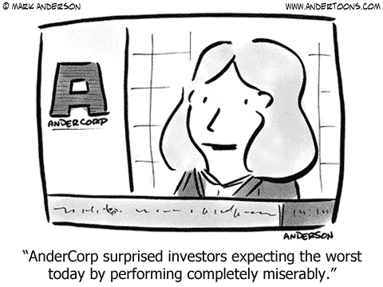
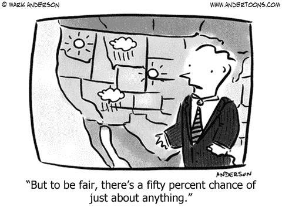
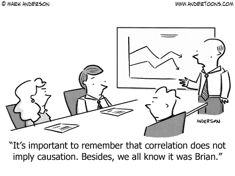

# 控制创业规模的力量的基本经验

> 原文：<https://blog.asmartbear.com/scale.html?utm_source=wanqu.co&utm_campaign=Wanqu+Daily&utm_medium=website>

[T2】](https://www.andertoons.com/weight/cartoon/7574/im-not-letting-myself-go-im-scaling)

理想主义的创始人认为，当他们扩大规模时，他们会打破模式，而不是变成一个“典型的大公司”他们的意思是:没有假设员工愚蠢或邪恶的愚蠢规则，没有每件事都要花费十倍于应该花费的时间，没有到处碰壁的会议，没有雇佣不到人才库前 1%的人，等等。

也就是说，保持一个小组织的积极特征，避免更大组织的共同问题，通过保留他们现有的价值观和流程，只是与更多的人一起做，并在我们前进的过程中弄清楚它，就像我们一直做的那样。

为什么他们从不成功？当你有 500 名员工时，为什么这是不可能的？大规模改变组织的基本力量是什么？

### **从易碎到坚固**

以“人均产出”来衡量，“一个人的团队”是最快、最高效的团队  沟通和决策占用尽可能少的时间。也许从事这方面工作的人是“英雄”——工作时间长，对问题空间有经验。小公司这样经营是必然的，而且很管用！  这是它们行动迅速的一大原因。

但是，疾病会将产品的速度或支持的质量从卓越降低到零。如果那个人离开了，你就失去了六个月的时间去雇佣和恢复工作。  或九个月，因为没有任何流程和文档，也因为只有一个人，不需要那些东西，因为毕竟我们发展得太快了！

或者这是致命的，因为那是一个联合创始人。“创始人问题”[是创业死亡的主要原因](http://fortune.com/2014/09/25/why-startups-fail-according-to-their-founders/)(尽管数据也显示只有一个创始人的[公司更有可能失败](https://pando.com/2013/07/23/what-do-failed-startups-have-in-common/)，所以结论只是创业总是有可能失败！)

[T2】](https://www.andertoons.com/pirate/cartoon/5924/i-dunno-first-mate-has-been-done-to-death-how-about-this-co-pirate)

一个人的团队很脆弱，但速度很快。当你很小的时候，这是一个很好的权衡，因为速度对于打击那些不断要杀死公司的东西是至关重要的。  当你很大的时候，你可能有 15-25%的年员工流动率，更不用说生病、休假和家庭，同样的结构会立刻让你陷入困境。

因此，任何项目都不能少于，比如说，三个人，加上人员管理，可能还有某种形式的产品或项目管理。但是四人团队不会比单人团队多 4 倍生产力；人均生产率下降，以换取稳健性和连续性。

另一方面，当小公司因为失去一个关键员工而损失了 9 个月的时间，甚至崩溃时，大公司是稳定的海龟，每个月像时钟一样增加成千上万的客户，赢得比赛。

**可预测性**

当你很小的时候，没有必要去预测这个特性什么时候发布。营销部门没有安排发布时间，招聘部门没有安排客户服务和销售部门下 50 名员工的开始日期。这意味着你可以——也应该！—针对上市速度进行近视优化。

小公司吹嘘他们的速度是一个优势，但很容易看出为什么大公司实际上有巨大的优势。当然，当 WP Engine 推出新产品时，营销部门需要对推出日期的可预测性，但这是因为它是一个技术高超、资金充足的团队，通过媒体、活动、活动、社交媒体和时事通讯爆炸，在一周内吸引的注意力比一家小公司一年获得的还要多。还有一支分布在全球各地的武装销售和支持团队，因此我们每月向 70，000 名现有客户和数千名新客户销售产品，这意味着我们最终在一个月内增加的新收入将超过一家小公司一整年的收入。

然而，代价是可预测性。我们没有安排好媒体和销售材料，也没有确保代码质量高到足以在第一天就进行扩展，没有可预测性。可预测性意味着走得更慢。可预测性需要更多的估计(需要时间)、协调(需要时间)、计划(需要时间)、文档(需要时间)，以及当计划不可避免地与预测不同时调整计划(需要时间)。

[T2】](https://www.andertoons.com/news/cartoon/4713/surprised-investors-expecting-worst-performing-miserably)

健康的团队成长也需要可预测性。考虑添加技术支持团队成员的时间表。首先，招聘是寻找潜在的候选人。然后安排和执行面试。然后等他们辞掉工作，休息一周。然后是新员工导向。然后是课堂训练。然后与楼层中的高级人员配对，提高他们的技能和舒适度。最后，在(比如说)四个月之后，他们达到了速度。

由于这需要四个月的时间，我们必须能够提前至少四个月预测对技术支持的需求，因为我们现在就必须为未来的需求进行招聘。如果我们低估了，我们的支持人员会被太多的工作压得喘不过气来，他们的生活质量会受到影响，对每个客户的服务也会受到影响；如果我们高估了，我们有太多的人，这是一个成本惩罚。当然，后者是比前者更好的失效模式，但两者都是次优的，解决方案是可预测性。

在精益和敏捷思维的激励下，这家小公司坚称:“未来本来就是不可预测的”。事实上，天马行空的发明和执行很难预测。但这也是一个自我实现的预言；坚持认为未来是不可预测的，就是忽略了可以让未来变得更可预测的工作，这当然让未来对那个人来说实际上是不可预测的。

[T2】](https://www.andertoons.com/weather/cartoon/5221/but-to-be-fair-theres-fifty-percent-chance-of-just-about-anything)

小公司没有数据、客户、机构知识、专业技能，通常也没有个人经验和技能来预测未来，所以他们说这不可能通常是正确的。但不是原则上不可能，对他们来说不可能。在规模上，它变得必不可少。不是因为华尔街需要它，或者投资者需要它，或者不可预测的组织提出的任何其他扔掉的贬义借口，而是因为它对健康的规模扩张至关重要。

**实质性阈值**

如果谷歌推出一款能产生 10，000，000 美元/年收入的新产品，这样好吗？不，这是一个巨大的失败。他们本可以把产品开发所花费的数千万美元拿出来，让他们现有的运营效率仅仅提高 0.01%，就能赚到同样多的钱。

在近 1000 亿美元/年的收入中，谷歌只能将有潜力产生 100 亿美元/年 1B 收入的产品视为绝对底线，如果情况比预期的好，有潜力增长到 100 亿美元/年。比如 YouTube、云、自动驾驶汽车。

这一原则被称为“实质性阈值”，也就是说，一个项目要对业务产生实质性影响，它必须做出的最小贡献是什么。

对于小企业，重要性门槛接近 0 美元。帮助你在这个月获得几个新客户的新功能是值得做的。每周增加两次注册的营销活动是成功的。几乎你做的任何事都是有价值的。这很简单，向前迈进的感觉很好。但这很容易，因为门槛太低了。

大公司的财务成功决定了一个重要的实质性门槛。这很难。即使是一个中等规模的公司也需要数百万的新产品收入，乐观的情况下可能需要数千万。很少有产品能产生这样的收入，无论是由灵活创新的初创公司还是庄严成熟的公司发明的。作为证据，考虑到绝大多数创业公司从未达到 1000 万美元/年的运行率，即使有像样的产品和非常敬业和有能力的团队。

然而，发明、发现、设计、实现和培育这些产品是中型公司产品经理的工作——这是大多数企业家永远不会成功的事情。艰难的工作！

**招聘**

员工#2 将[加入一家创业公司以获得经验](https://blog.asmartbear.com/startup-hiring-advice.html)。即使大幅减薪，即使公司倒闭——这是最有可能的结果。为了故事、影响、潜力、刺激、控制、友情、鸡尾酒会上的谈话，这是值得的。

因为这些原因，200 号员工不会加入。员工#200 的生活和职业生涯会有不同的风险状况。员工#200 会对不同种类的问题感兴趣，比如本文中列出的问题，而不是那些你试图理解为什么 7 个人买了软件而接下来的 3 个人没有的问题。200 号员工不会为减薪而工作。

小公司可能会将此视为一种优势，以低于市场水平的价格招聘优秀人才肯定是有利的。但如今 WP Engine 有几十名甚至几百名员工，他们在专业领域的技能比我在小公司遇到的任何人都要高。为什么？因为在发展了专业知识之后，他们发现只有在更大的环境中应用他们的技能才是可能的和令人愉快的。

例如，有些先进的营销技巧对小公司来说毫无意义，但对大公司来说却很吸引人，很有挑战性，对收入有很大影响。有些有才华的人喜欢这种挑战，他们讨厌“回到营销的幼儿园”[用 2000 美元/月的预算刮出一个 AdWords 活动](https://blog.asmartbear.com/low-budget-marketing.html)或者组装 SEO 的雏形或者仅仅是[试图让一个单一的营销渠道工作](https://blog.asmartbear.com/one-channel.html)或者被称为“增长黑客”,因为他们骗取了一次性的流量增长。

但是，这牵涉到薪酬，你如何发现人才，以及为什么这个人想在你的公司工作，而不是街区那头能付更多钱的人。因此，关键是要有一个真正重要的使命，有有意义和有趣的工作要做，[将每个人的工作与比我们任何人都大的事情联系起来](https://blog.asmartbear.com/emptiness.html)。这些在规模上更重要，因为它们是人才加入并留下来的支柱和主要原因。

[T2】](https://www.andertoons.com/business/cartoon/5966/i-dont-get-it-weve-got-mission-statement-credo-and-mantra)

**通信**

一个公司有四个人，任何需要分享的信息都可以只告诉另外三个人。每个人都可以知道一切。如果有 5%的机会出现重大误解，那这种事情就不会经常发生。

在四百人的情况下，一条信息不可能在短时间内得到可靠的传达。5%的误解几率意味着 20 个人被搞糊涂了。在软件术语中，沟通挑战的等级为 O(n 2 )。

[不是](https://ux.useronboard.com/slack-i-m-breaking-up-with-you-54600ace03ea)[答案](https://medium.com/the-flux/why-slack-hurts-your-teams-productivity-af9804d06606) 。“电子邮件”不是答案。(顺便说一句，你的邮件可能有 40%的时间被误解。)重复是答案，在不同的时间，以不同的形式，由许多领导人来做，但仍然不是 100%。

**科技&基础设施**

在云时代管理 10，000 台虚拟服务器听起来很容易。自动化一切，那么任何适用于 100 台服务器的流程，只要重复做同样的事情，就能适用于 10，000 台服务器——这正是计算机所擅长的。

从来都不是那样的。Reddit 花了 18 个月的时间 才获得大规模运作的“点赞数”。 [StackOverflow 用了 4 *年*](https://nickcraver.com/blog/2017/05/22/https-on-stack-overflow/) 才把一切都转换成 HTTPS。《连线》杂志在“仅仅”18 个月内就完成了这一转变。一切都难以衡量。

那些故事中的模式是什么？

一个是[规模化让稀有的东西变得普通](https://blog.asmartbear.com/scaling-startups.html)。罕见的事情很难预测，也很难预防。通常它们甚至难以识别，有时甚至无法复制。这是根本性的困难。

另一个是与现有技术的连续性或兼容性。新公司可以从零开始，但大规模公司必须转型。新公司喜欢取笑大公司转型有多难，却忽略了困难的原因可能也是创造 1 亿美元的收入。

另一个是瓶颈。所有的硬件和软件系统都有瓶颈。在小范围内，您不会遇到任何瓶颈，或者至少您遇到的瓶颈可以通过简单的技术解决，如[增加容量](https://blog.asmartbear.com/utilization.html)。最终一些困难的事情发生了，你必须重新构建栈来解决它。即使是像将 HTTP 链接转换成 HTTPS 或者实时更新“赞数”这样简单的事情，也会成为一个巨大的建筑挑战。

这不仅减缓了发展，还增加了投资。将会有整个团队专注于基础设施、扩展、部署、成本管理、开发流程等等，其中没有一个是客户直接可见或驱动的，但是对于管理扩展的复杂性是必要的。

**风险缓解**

对于小公司来说，最有可能的死因是[自杀](https://techcrunch.com/2011/06/27/startups-don%E2%80%99t-die-they-commit-suicide/)。通常是饥饿——无法获得足够多的客户(分销)来支付足够长时间的足够多的钱(产品/市场契合度)。还有一些事情，比如创始人分手，没有足够的动力自筹资金或获得下一轮融资，不得不回去工作，等等。

在规模上，风险完全不同。WP Engine 本月不会签下数千新客户的风险非常低。然而，其他风险不仅可能，而且很有可能。正面应对这些风险是一个健康和可持续发展的企业能够持续多年的必要条件。

在灾难情况下承担业务连续性风险。如果亚马逊在弗吉尼亚州的所有可用区都被禁用一周会怎么样？我们需要多长时间才能让所有客户恢复正常运行？即使成千上万的其他企业也试图同时在其他亚马逊数据中心加速服务器运行，这种情况会是真的吗？我们能不能快速简单地与客户沟通，这样我们的支持团队就不会因为向近十万名忧心忡忡的客户重复同样的信息而不知所措？

[T2】](https://www.andertoons.com/science/cartoon/7252/correlation-does-not-imply-causation-we-know-it-was-brian)

降低风险甚至可以带来增长。认真的客户希望看到他们的供应商了解并降低风险；这种成熟成为一个卖点。这就是为什么企业供应商总是无视他们对 SOC 2 和 ISO 27001 等标准的遵从。小公司取笑这些东西，往好里说是不必要的，往坏里说是一种虚假的安全感，但当他们忙着证明这一点时，大公司正忙着签下三年期数百万美元的客户。

在早期，您不需要灾难恢复计划。这不会扼杀企业，如果一个年轻的企业面临这种风险，你的客户会理解的。后来，这变得至关重要，值得投资。

**扩展的基本挑战:接受并实施从小到大的转变**

这些力量导致大公司与小公司有着本质的不同。这不是坏事也不是好事。这是两码事。

一些理想主义创始人认为，规模问题的根本原因是“命令和控制”的组织结构。但是上面的例子都没有提到任何组织结构。这是普遍现象。这就是为什么 Holacracy 和 Teal 组织在实践中没有解决这些问题。对组织结构进行试验可能是一个奇妙的想法，但上述基本力量不会通过角色和组织的重组而消除。

扩展是困难的，道路是多雾和弯曲的，它会持续数年，你需要的一组人可能是不同的，没有人会毫发无损。所以，如果你在与这些力量角力时遇到困难，这并不是灾难的征兆。每个人都这样。

灾难是当一家公司在扩大规模，但领导者不欣赏这些力量，不不断努力相应地改变组织，不引入有经验的人才，认为他们可以在没有帮助的情况下解决所有问题。相反，它应该意味着新的人，新的角色，新的价值观，新的流程，新的招聘，新的故事，新的限制，新的机会。

太多的创始人和领导者愿意相信“是什么让我们走到这一步，是我们的重要和独特之处，因此我们应该保留所有的一切。其他公司失败是因为他们“表现得像大公司”，但我们会避免这一切，因为我们比他们聪明。作为我们敏锐的证据，看看我们迄今为止的成功就知道了。我们将一如既往，在未来继续取得成功。”

但是他们错了。

应该有几个值保持不变，这是真的。否则[没有任何意义](https://blog.asmartbear.com/emptiness.html)。但是细节[必须改变](https://blog.asmartbear.com/change.html)。

许多创始人和领导者无法实现转变。这总是伤害公司，有时甚至扼杀公司。这个世界充满了那些恐怖故事。这很可悲，因为这是一种可以避免的机会浪费，有时是数百人一年的努力。

不要成为那些警示故事中的一个。