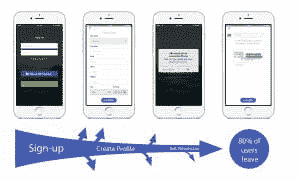
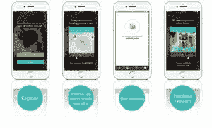
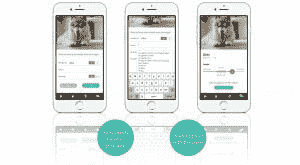

# 5 个产品设计技巧:从一开始就让你的应用有粘性——关注产品

> 原文：<https://www.mindtheproduct.com/2017/10/5-product-design-tips-making-app-sticky-start/?utm_source=wanqu.co&utm_campaign=Wanqu+Daily&utm_medium=website>

消费者的购买之旅正在改变，然而今天的产品设计并不总是反映这一点。过去，消费者通常会阅读产品评论，然后购买最能反映他们需求的产品。产品很简单，只有几个按钮和简单的指示。

然而今天，许多产品都配有应用程序，这影响了购买行为。消费者仍然会阅读评论并进行自己的研究，但现在在购买产品之前，他们喜欢下载并使用该产品的应用程序。如果他们最终喜欢这个应用程序，喜欢产品评论，他们可能最终会购买该产品。但是他们可以很容易地去别处寻找。

同样，移动应用生态系统在过去 10 年里蓬勃发展——例如，现在 iOS 应用商店中有超过 200 万个应用程序，Android 应用商店中有超过 300 万个应用程序——但用户只能访问安装在他们手机上的三分之一到二分之一的应用程序，并定期卸载应用程序。对产品开发者来说，最大的挑战是:**我如何让用户第一次就坚持使用我的应用？**

我们在市场上看到的许多应用程序都不是很简单，需要时间来学习。设计师需要记住的是，这些用户不仅仅是在玩应用程序，他们希望看到真正的好处，他们希望很快看到。

据数字趋势报道，超过 80%的应用程序在被删除前只使用一次。这里有五个关键的方法可以改变这些几率，通过更好的产品设计来增加产品的采用。虽然其中一些似乎显而易见，但其他一些往往在创新的热潮中被忽视。每一个对吸引和留住今天的用户都很重要。

**1。让用户在没有附加条件的情况下尝试一下**

我们在应用程序中经常遇到的第一个大错误是，在我们能够进入应用程序之前，被迫注册一些东西。公司通常假设用户已经购买了他们的产品，或者想要注册每周更新，但现在情况并非总是如此。这种产品设计错误会立即削减潜在客户，他们只是在购买产品之前测试和探索应用程序。

最好的学习方法是边做边学。用户不想在能够使用一个产品或应用程序之前阅读大量的手册，他们只想出去尝试一下。进行互动参观，而不是让他们阅读手册或教程，可以帮助他们更好地了解你的应用和产品。

**2。远离间接竞争对手**

每个人都知道他们的大竞争对手，但公司通常不会考虑他们的间接竞争对手。这可能是在使用你的应用程序时可能会分散你的用户注意力的任何人或任何事。例如，告诉用户确认码已经发送到他们的电子邮件，会将他们推到电子邮件应用程序，在那里他们很容易分心。在产品设计中，重要的是防止用户偏离正题，以增加你的客户采用率。

**3。首先宣传可能性和好处**

与用户建立联系很重要，第一印象也很重要。一个应用的最初阶段是向用户宣传你的产品的绝佳机会，然而许多产品却将他们拒之门外。第一页应该展示你的产品的好处，并允许用户探索和使用你的应用程序。如果你从一开始就建立了关系，随着时间的推移，展示你的优势会容易得多。但是如果你连第一印象都迈不过去，你就没有机会指出你产品的好处了。

用户不关心你的产品在技术上有多先进，他们关心的是他们能从中获得多少好处。不要仅仅强调你的产品的特点，比如“我们在这个和那个上都有专利”，你应该指出它的好处，比如“你的狗会很安全，你可以安心。”这是一种用户可以欣赏的语言。

**4。少即是多**

不要一开始就给用户太多选择。不要让用户在六个不同的选项中选择，而是使用两个或三个选项，这样他们就可以在选项中快速移动。他们必须做出的每一个额外的选择都会让他们慢下来，并可能让他们离开。你不希望你的用户想太多；相反，你希望它们能很容易地从一页流到下一页，尤其是在这个过程的开始。

实体产品也需要摆脱一些老产品的“杂乱”。按钮和功能可以移动到应用程序中，而不是显示在物理产品上。这种极简主义，少即是多的思想在今天更加重要。

**5。弥合现实世界和数字世界之间的鸿沟**

过去，UI 设计师主要关注屏幕上发生的事情。他们通常不会深入思考实体产品。对于今天的产品来说，弥合实体产品和数字产品之间的差距是许多公司未能做到的事情。与一个不仅了解用户界面和 UX，而且了解工业设计、工程和实体产品生产的设计团队合作是非常重要的。

当实体产品与数字产品不匹配时，用户会感到两者之间的脱节。以一个附带应用程序的联网扬声器为例。如果实体产品使用旋转旋钮来改变音量，但应用程序有一个滑动按钮来改变音量，这就有很大的脱节。你必须让你的应用与你连接的硬件产品的工作方式保持一致。这是一个拥有更广泛的技能和更综合的方法的团队的优势所在。

最终，你的产品设计应该为你的用户带来更好的生活。如果你能够成功地做到这一点，你会注意到更高的客户满意度，更多的用户会坚持使用你的产品，而不是在第一次尝试后就放弃它。消费者并不依恋一件产品——他们依恋的是它带给他们的*体验*和*价值*。

#### 关于

Soyun Kim 是 StudioRed 的高级产品设计师，StudioRed 是硅谷一家屡获殊荣的产品开发咨询公司，提供设计研究；工业和 UI/UX 设计；机械、结构和光学工程；原型制作；和生产服务。在加入 StudioRed 之前，Soyun 曾与 GoPro Inc、fuseproject、RKS 和 Lunar design 合作，她的客户包括惠普、LG、JBL、Hamilton medical、联合利华、SC Johnson、SanDisk 和 Epson。她的作品获得了美国工业设计师协会(IDSA)、西区学生优秀奖、IDEA、Core77、CES 创新奖、星火奖以及优秀设计奖的认可。你可以在 www.studiored.com 看到她的作品。