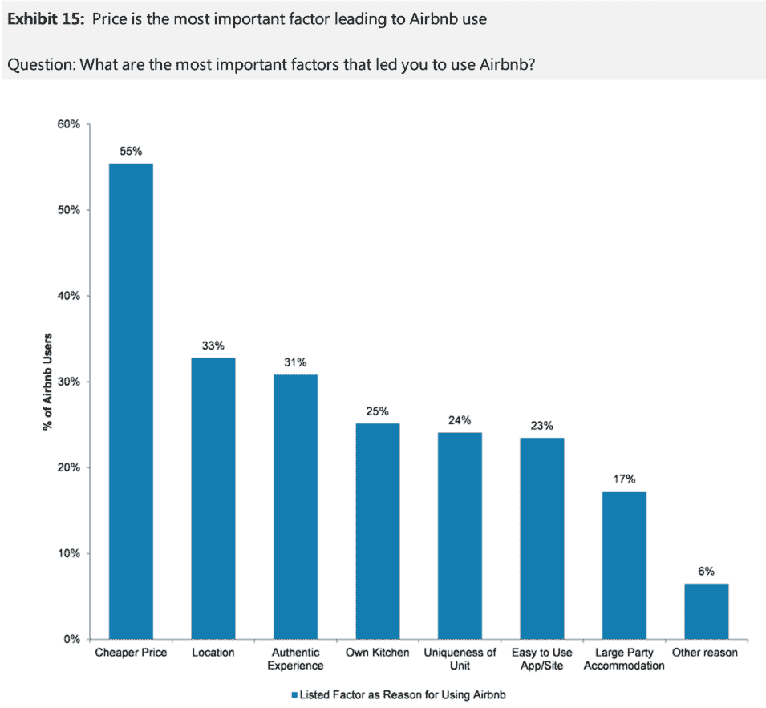
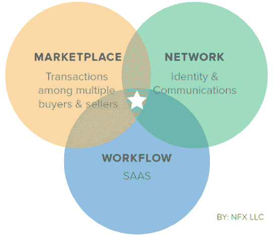
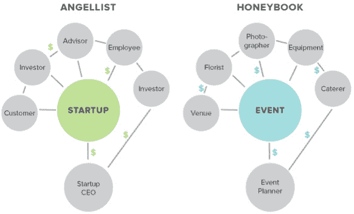

# 如何建立一个十亿美元的数字市场——来自优步、易贝、Craigslist 和 andrewchen 更多网站的例子

> 原文：<http://andrewchen.co/how-to-build-a-billion-dollar-digital-marketplace-examples-from-uber-ebay-craigslist-and-more/?utm_source=wanqu.co&utm_campaign=Wanqu+Daily&utm_medium=website>

市场很容易被低估
当市场变大时，它们会变得非常大。一些有史以来最大的科技成功——易贝、Airbnb、阿里巴巴、优步——都是价值数百亿美元的市场。

然而，市场往往始于小规模，在互联网的利基和奇怪的角落。众所周知，当易贝在 1995 年成立时，它专注于收藏品。著名的风险投资公司 Bessemer Venture Partners 传递了一项著名的早期投资:

> “邮票？硬币？漫画书？你一定是在开玩笑，”贝塞麦的合伙人大卫·考恩想道。"简单的传球"

在易贝的早期投资很快就会从首轮融资到 IPO 后产生 50，000%的回报，因为该公司开始帮助处理从电子产品、汽车、家居用品等所有东西。

易贝成立 20 年后，一个类似的故事展开了，这次是在优步(我现在的雇主！)和出租车市场。NYU 大学教授 Aswath Damodaran 断言，在 2014 年的一轮投资后，优步被高估了。基于全球出租车和汽车服务市场的数据点，他得出结论，实际数字应该是 59 亿美元。自 2014 年发表那篇文章以来，优步已经超出他的估计 10 倍，并有顶线收入支持。还不错。正如投资者比尔·格利[指出的那样](http://abovethecrowd.com/2014/07/11/how-to-miss-by-a-mile-an-alternative-look-at-ubers-potential-market-size/)，这一估计如此之差的原因是优步超越了出租车的使用案例，并通过开放许多新的交通类别来大幅增长市场。这是另一个随着时间的推移从利基市场进入更多用例的例子。

(顺便说一句，受众和用例的扩张略有不同，这一次导致了严重的低估——这是我的错误:[为什么我怀疑脸书能够建立十亿美元的业务，以及我从严重错误中学到了什么](http://andrewchen.co/why-i-doubted-facebook-could-build-a-billion-dollar-business-and-what-i-learned-from-being-horribly-wrong/)

**从小做起，下一步做什么** 在易贝和优步的例子中，我们看到你可以从一个利基市场开始——无论是地理位置还是产品线——然后迅速扩大到一个庞大的买家和卖家网络。事实证明，实现这一目标有几个关键步骤，今天我将通过过去几十年的例子来强调一些主要策略:

1.  拓展新的地理市场
2.  添加新产品和价格点
3.  减少从注册到成功交易的摩擦
4.  增长供给+需求粘性

让我们深入了解每一个问题。

**1。扩展到新的地理市场**
像优步、OpenTable、Craigslist 等市场本质上是超本地化的，必须在有限的地理范围内快速建立临界质量的供应/需求。如果客户试图预订旧金山 Hayes Valley 附近的餐馆，您不会太在意曼哈顿平台上有多少餐馆。

正如你所想象的，打入每个新的本地市场会非常痛苦。市场公司通常最终会雇佣“启动者”团队，这是一个专注于开发新城市的专业运营角色。

Chris Ballard 在 Quora 上写了一篇关于优步发射团队的精彩文章(这些天，通用汽车公司):

> 优步的“启动者”角色是一个人可能遇到的最具体力、情感和智力挑战的角色之一。这也是最有意义的事情之一。[…]
> 
> 一旦进入城市，发射器必须同时:
> 
> *   招募、雇佣和培训本地团队
> *   发展合作伙伴关系，管理与当地出租汽车运营商的关系(注意:优步没有任何车辆。我们与现有的认证、许可和保险租车车主合作)
> *   制定营销策略，扩大客户群，提高知名度
> *   探索业务发展机会(赞助/合作伙伴关系/联合促销)
> *   与当地媒体建立关系
> *   举办一场传奇的发布会，正式拉开这座城市的序幕！
> 
> 这次旅行很紧张。发射器每年有 300 多天都在路上。我们生活在手提箱里，我们最重要的财产是我们的 MacAirs 和我们的护照。如果几天后你容易想家，或者除非在自己的床上，否则睡不好，这绝对不适合你。

启动是一项艰巨的工作，但关于这些超本地化市场的好消息是，如果它在一个市场有效，那么它可能会在数百个市场有效。有时，跨地域的跨网络增长会比你最初想象的更强劲，这是由 Airbnb 的全球旅行用例等因素促成的，这些因素可以极大地推动你的目标市场。

此外，如果你是一家新的创业公司，你可以在你的竞争对手较弱的超本地化市场中发展，并建立一个难以摆脱的本地网络效应。

**2。添加新产品和价格点**
市场可以发挥作用的下一个变量是产品线和价格点的扩展。这两者都直接开启了新的使用案例和可开拓的市场，有很多强有力的例子说明了这是如何发生的。Craigslist，所有自由市场之母，从事件开始，然后扩展到工作和公寓。

在 2016 年接受 Inc 采访时，克雷格·纽马克回忆了 Craigslist 的早期形式——字面上只是一个电子邮件列表——以及他如何随着时间的推移直观地添加产品类别:

> Craigslist 始于 1995 年的一封电子邮件——你只是分享在旧金山发生的有趣的事情。第一封邮件里写了什么？第一批与两个事件有关:乔氏数字餐厅，人们将展示多媒体技术的使用。那时它刚刚出现。我们十几个人会围着一张大桌子吃晚饭——总是意大利面和肉丸。还有一个名为 Anon Salon 的派对，非常戏剧化，但也注重技术。
> 
> 第一封邮件发给了多少人？十点到十二点。
> 
> **然后呢？人们不断给我发邮件，要求将他们的地址添加到抄送列表中，或者最终添加到列表服务器中。随着任务开始变得繁重，我通常会写一些代码来自动化它们。我一直在听。起初，电子邮件只是艺术和技术活动。然后人们问我是否可以传递一个关于工作或出售的东西的帖子。我能感觉到公寓越来越短缺，所以我也请人们发送公寓通知。**

如今，Craigslist 遍布 57，000 多个城市，每年产生 7 亿美元的收入(工作列表费！)只有 50 名员工。太神奇了。

一个相关的举措是向市场提供新的价格点，这可以打开新的使用案例，并扩大潜在市场。这方面的一个很好的例子是 Airbnb，与他们的酒店竞争对手相比，它为客人提供了更广泛的产品，从超便宜到超贵。低端支持新的、更高频率的用例出现，比如周末度假。高端允许大型家庭聚会，如婚礼或聚会，所有人一起分享一个巨大的房子。

定价是一个关键的战略举措，因为它通常是客户的主要因素，正如摩根士丹利对 Airbnb 客户的调查所示:

当然，我们也看到了 Airbnb 的直接产品扩张，通过他们的新体验产品，除了住宿之外，还可以进行追加销售。

**3。减少从注册到成功交易的摩擦** 地理和产品扩张的双重杠杆是强大的，减少在市场上进行交易的摩擦会放大这两者。这以两种方式增长了 TAM)首先，直接增长了市场，因为更低的摩擦交易意味着更多的销售。2)但是，更微妙的是，当您的市场可以融入到需要可靠性和易用性的新用例中时，它会开启更多的交易。

例如，很少有人使用出租车通勤，因为服务可能很贵/不可靠，而许多人使用优步池通勤，因为它可靠和负担得起。当餐厅库存更新时，您肯定会更多地使用 OpenTable 来获取最后一分钟的预订，这使得即使是非正式聚会也很方便。

减少摩擦的方法有很多，但我们尤其应该从客户(包括买方和卖方)的角度，从注册到交易的整个过程来看待这个问题:

*   减少从注册到第一笔交易的摩擦
    *   注册和入职
    *   设置付款
    *   寻找想要的交易
    *   信任基础设施(取决于产品:评论/照片–或 ETA–或可用性日历)
*   减少从交易到接受产品/服务的摩擦:
    *   可靠性和一致性——由市场流动性和 UX 共同驱动
    *   确定合适的价格
    *   完成交易的时间和物流
    *   解决交易后问题

专注于减少上述摩擦不仅会为市场带来更多收入，还会带来更好的客户体验。

**4。增长供给+需求粘性** 交易需要需求和供给的强大留存，如果一个市场能够提高粘性，平台上就能产生更多的活动。在许多方面，这只是一个典型的保留问题，除非生态系统中有多个参与者。就像在社交网络产品上一样，你可以使用传统的增长方法:

*   **通知**:创建一个强大的通知平台，在合适的时间吸引买家/卖家
*   **用例**:了解用例以及如何追加销售和交叉销售最棘手的用例
*   **优惠/促销**:在整个日历周期中使用优惠和内容进行互动
*   **优化** : A/B 测试增长杠杆——从电子邮件/短信/推送广告——到何时/如何拓展

然而，除了传统技术之外，我们还看到了一个趋势，即在一个平台内，买家和卖家的工作流程更加产品化。最近几年，詹姆斯·库里耶和 NFX 团队提出了这个解决方案，即建立一个“[市场网络](http://essays.nfx.com/the-last-10-years-have-been-about-social-networks-the-next-10-will-be-about-market-networks/)”，其中一部分是 SaaS 的工具，一部分是市场。

提醒一下，市场网络为市场的每一方提供了有用的工具——例如，OpenTable 的座位系统，你完全通过效用获得粘性。结合市场，你会得到更强的效果。

这是一张展示生态系统的图表:

下面是一些基于 AngelList 和 Honeybook 的例子——展示了市场网络生态系统中的多个参与者可能如何相互作用。

正如你所看到的，有时生态系统参与者之间的这些关系是通过金钱发生的，有时是通过内容/社区。这些丰富的互动，由一个伟大的产品 UX 促成，可以留住多个玩家，并产生丰富的交易流。市场网络仍处于早期阶段，我很高兴看到这一领域的发展。

市场可以从小规模开始，以大规模结束。非常大。
要建立一个价值十亿美元的市场，你必须从第一天起就在你的模型中建立扩张。

对于一些人来说，这看起来像是专注于地理增长和建立你的团队。对于其他人来说，这将是快速增加新的产品线和价位，为您的市场创造新的使用案例。或者你可以通过提高效率来改善核心平台——无论这意味着入职还是每笔交易的摩擦。其他人可以通过构建实用程序和工作流自动化来加倍保留，从而为更多交易奠定基础。

这些变动都是有效的，不同的市场会有不同的表现。或者全部都是！

**PS. Get new updates/analysis on tech and startups**

我写一份高质量的每周时事通讯，报道硅谷发生的事情，关注创业、营销和移动领域。

在本网站链接的“内容”(包括帖子、播客、视频)中或在社交媒体和其他平台(统称为“内容分发渠道”)中发表的观点是我自己的，并不是 AH Capital Management、l . l . c .(“a16z”)或其各自附属公司的观点。AH 资本管理公司是一家在证券交易委员会注册的投资顾问公司。注册为投资顾问并不意味着任何特殊技能或培训。这些帖子不针对任何投资者或潜在投资者，也不构成出售或购买任何证券的要约，不得用于或依赖于评估任何投资的价值。

内容不应被解释为或以任何方式依赖于投资、法律、税务或其他建议。您应该向您自己的顾问咨询有关任何投资的法律、商业、税务和其他相关事宜。这些材料中表达的任何预测、估计、预测、目标、前景和/或观点可能会在不通知的情况下发生变化，并且可能与他人表达的观点不同或相反。此处提供的任何图表仅供参考，在做出任何投资决策时不应依赖。此处包含的某些信息来自第三方来源。虽然这些信息来自据信可靠的来源，但我并未独立核实这些信息，也未对这些信息的持久准确性或其在特定情况下的适当性做出任何陈述。该内容仅在所示日期有效。

在任何情况下，本网站或相关内容分销渠道上提供的任何帖子或其他信息都不应被解释为 a16z 人员发起、讨论或提及的任何集合投资工具中的任何证券或权益的购买或销售要约。也不应被理解为提供投资咨询服务的要约；投资 a16z 管理的集合投资工具的要约将单独提出，并且仅通过特定集合投资工具的保密要约文件提出，这些文件应完整阅读，并且仅提供给符合联邦证券法规定的特定资格的人。这些投资者被定义为合格投资者和合格购买者，通常被认为有能力评估潜在投资和财务事项的优点和风险。不能保证 a16z 的投资目标会实现或投资策略会成功。对 a16z 管理的投资工具的任何投资都包含很高的风险，包括损失全部投资金额的风险。提及、提及或描述的任何投资或投资组合公司并不代表 a16z 管理的所有投资工具，也不能保证这些投资将会盈利，也不能保证将来进行的其他投资会有类似的特征或结果。a16z 管理的基金所做的投资清单可在 https://a16z.com/investments/.获得。该清单不包括发行人未允许 a16z 公开披露的投资，以及对公开交易的数字资产的未宣布投资。Andreessen Horowitz 投资、集合投资工具或投资策略的过去结果不一定代表未来结果。请参见[https://a16z.com/disclosures](https://a16z.com/disclosures)了解更多重要信息。