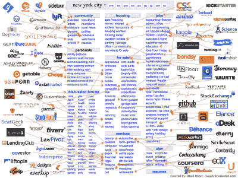
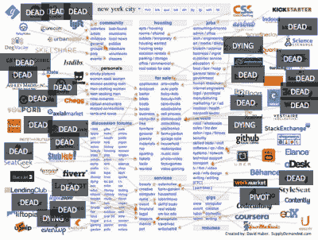
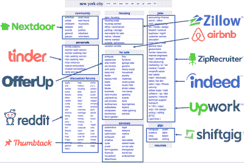

# 拥挤的空间，Craigslist 的重新捆绑

> 原文：<http://acrowdedspace.com/post/166470695392/the-rebundling-of-craigslist?utm_source=wanqu.co&utm_campaign=Wanqu+Daily&utm_medium=website>

在过去的 7 年里，我们在 Craigslist 上看到了这张经典的攻击图片。Spark Capital 的分析师安德鲁·帕克和大卫·哈伯在这张分解图表上做得很好。

我一直对这张图表有一点疑问，因为它暗示了破坏 Craigslist 的正确方式是挑选小块，建立一个垂直市场。问题是，垂直并不总是正确的解决方案，而且往往效果不好。问题在于交易的频率或规模。查看我对[横向与纵向市场](http://acrowdedspace.com/post/116567620957/vertical-or-horizontal)的看法。

得益于 Craigslist 第一个分类图表发布以来的 5-7 年时间，我们可以对图表进行一些小的更新:

许多最初有特色的垂直市场都失败了。我知道，作为一名消费者，我真的不想去 60 个不同的网站或应用程序来完成我的购物、演出和其他事情。狭窄的垂直市场已经消亡，取而代之的是水平市场。他们中的许多人缺乏使用频率(例如，Getable)来建立一个大型的可持续网络，或者他们缺乏大型项目的货币化潜力来建立一个利润丰厚的业务(如 Airbnb)。

这就是获胜的前景:

从上面的原始分类图表中会有一些小赢家，但每个类别中真正大的赢家是整个类别的横向平台，例如社区、论坛、个人、分类广告等。这满足了注意力单位有限的真人的需求。它也反映了现实世界，人们可能会申请几个不同的职位(事实上)，对出售二手家具和二手车感兴趣(OfferUp)，为你的房子雇佣一名油漆工和一名勤杂工(Thumbtack)，或者只是在在线论坛上讨论技术和政治。这些类别中的每一个都只能支持 1 或 2 个大型平台企业，这些企业可以发展成为价值数十亿美元的公司。

也有一些像 Airbnb 这样的案例，Craigslist 的单个部分就足以催生 10 亿以上的公司。

我们的投资组合公司 OfferUp 和 Upwork 都是本地商务(OfferUp)或远程工作(Upwork)的横向平台。他们将继续扩大规模，排挤那些选择狭窄垂直市场的小型垂直市场参与者。每个品类都会发生同样的情况。