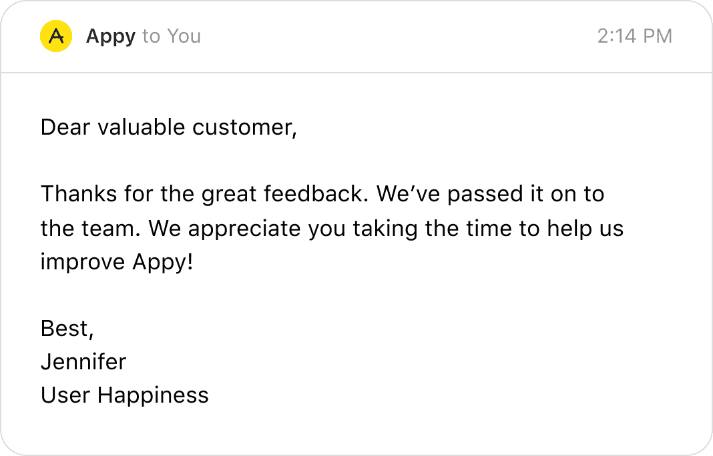
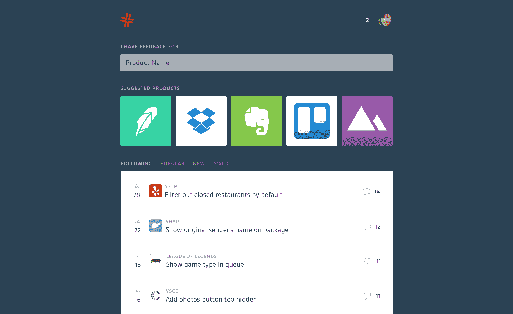
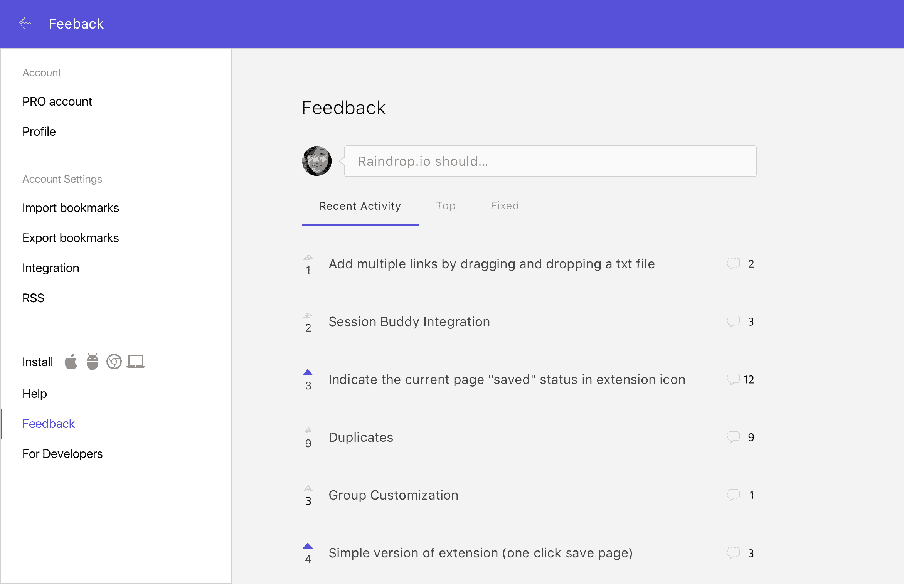
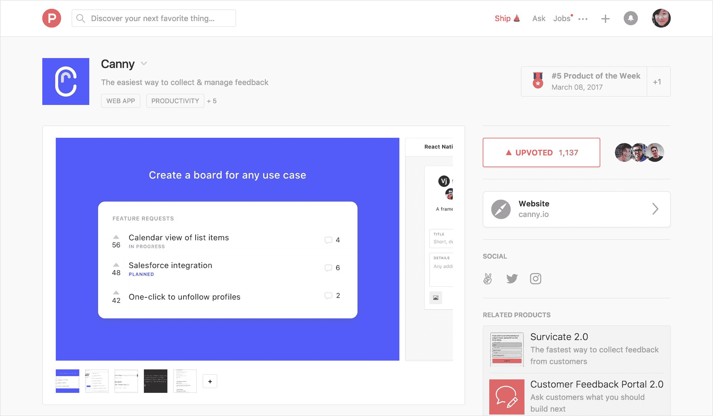
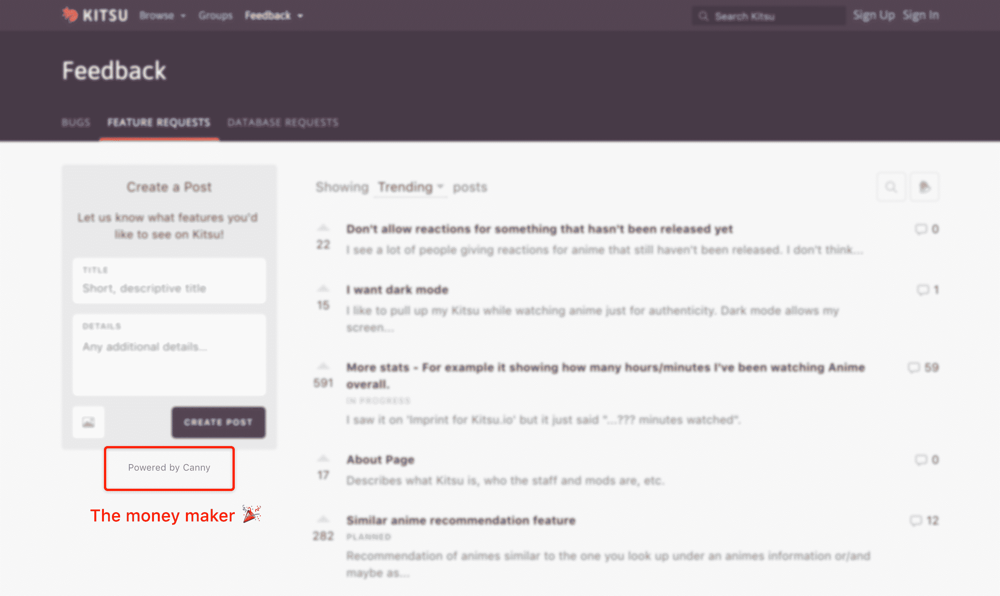
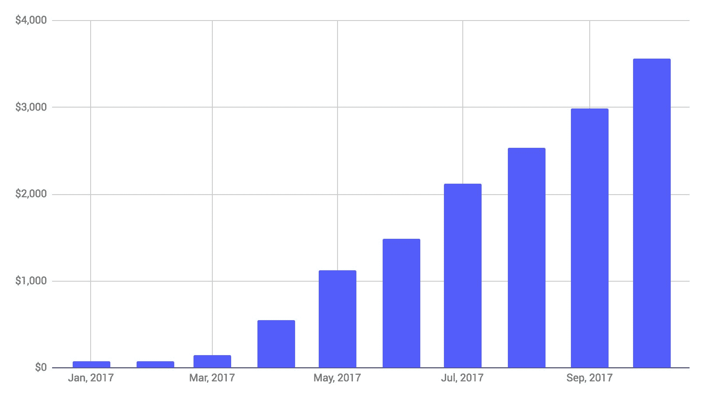
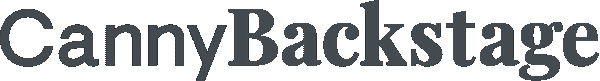

# 我们如何启动我们的 SaaS 创业拉面盈利-精明的博客

> 原文：<https://blog.canny.io/saas-startup-ramen-profitability/?utm_source=wanqu.co&utm_campaign=Wanqu+Daily&utm_medium=website>

我们在 SaaS 的创业公司已经运营了七个月，我们已经实现了拉面的盈利。Canny 的收入足以支付自己的开销和我们个人的生活费用。

这比我们在脸书工作赚的钱少得多，但对我们的创业公司来说，这是一个巨大的里程碑。我们已经消除了失败的最大风险之一:资金告罄。

在这篇文章中，我将讲述我们是如何走到这一步的，以及我们学到了什么。

## 我们如何发现我们的燃眉之急

我不会用泛泛的建议来烦你。你已经听过一千遍了。解决一个燃题！做出人们想要的东西！伟大的建议，但不是超级可行的。

相反，我将分享我们如何发现我们的燃眉之急。

我们实际上从自己的问题开始，然后转向一个更有价值的问题。

## 我们最初的问题

我们听从了保罗·格拉厄姆的建议，从我们自己的问题着手:

作为用户，感觉公司不太听我们的反馈。他们会说“谢谢，我们会把它传递给团队”，但什么也没发生。这是令人沮丧的。应用程序漏洞百出，缺少有用的功能。修复它们意味着让所有的软件体验变得更好。

Sad, generic reply

我们建立了一个社区，在那里人们可以公开发表对任何产品的反馈并进行投票。

大约 5000 人对数百种产品的创意进行了投票。这是一个很好的测试版，但是用户的忠诚度很低。很难让团队订阅关于他们产品的反馈。

**经验教训**:我们只是假设我们的问题是正确的，然后开始构建产品。我们应该先和更多的人谈谈。这会节省我们几个月的时间。我们会意识到这不是人们真正需要或愿意支付的东西。

MRR:0 美元(2016 年 10 月)

## 更大的问题

我们开始和很多团队讨论用户反馈。

*   你如何从用户那里收集反馈？
*   你如何跟踪用户的反馈？
*   你如何决定建造什么？

事实证明，公司没有听取我们的反馈是有原因的。因为他们不是。

他们不是不在乎。他们非常关心。只是反馈很乱。产品经理没有时间阅读每一条聊天信息、电子邮件和支持单。即使他们知道，他们也不会全部记住。

这时，我们意识到是业务问题导致了我们的消费者问题。

为了验证我们的新发现，我们构建了一个小部件来帮助团队收集和跟踪用户反馈。

我仍然记得第一次有人为它支付 19 美元/月。我们欣喜若狂。这是我们第一次卖自己做的东西。最棒的是:一年后的今天，他们仍然在使用我们。

吸取教训:与人交谈是发现和验证问题的好方法。写代码不是。收钱是验证的终极形式。如果一个完全陌生的人为你的产品买单，他们一定会认为你在为他们解决问题。

**MRR**:100 美元(2016 年 12 月)

## 了解我们的价值主张

在这一点上，我们知道我们必须做什么:叉回购和重新营销我们的社区作为 SaaS 工具。

莎拉是产品设计师，我是软件工程师。建立 MVP 是容易的部分。

但是如何制作一个登陆页面呢？上面有什么字？你是怎么定价的？

这些是我们以前从未面临过的销售和营销问题。我们了解到，解决这些问题的方法是理解您的价值主张:

*   你解决什么问题？
*   谁有那个问题？
*   他们如何描述这个问题？
*   问题有多大？
*   他们愿意为解决方案支付多少钱？
*   还有什么其他的解决方案吗？
*   你如何变得更好/不同？

没有这些问题的答案，你只是在猜测。

**经验教训**:销售和营销是关于理解你所解决的问题，并清楚地传达出来。如果你在与他们斗争，你可能不明白你的价值主张。我们花了很多时间阅读关于销售和营销的博客帖子。我们应该花时间与我们的目标客户交谈。

**MRR**:100 美元(2017 年 3 月)

## 推出我们的 MVP

我们首先对已经在使用我们的团队进行了试运行。

当我们发布 pivot 时，我们能够将所有人从旧站点迁移过来。核心产品非常相似。

这是从第一天就让一群人尝试我们的“付费”产品的好方法。我们让它运行了一两个星期，解决了问题，然后开始寻找产品。

我们的发布会非常成功。那一周有超过 350 家公司尝试 Canny。在我们 30 天的试用后，有几十人最终支付了费用。

我们的成功上市有几个因素:

*   我们为软件公司解决一个问题。Product Hunt 的社区主要是从事技术工作的人。这些观众与我们息息相关。
*   我们向在我们社区留下反馈的 5000 人发送了电子邮件。我们让他们知道我们的支点，以及我们正在推出产品搜索。
*   我们已经有一些付费客户了。这意味着我们知道我们有其他人也会为之付费的东西。
*   克里斯·梅西纳追杀我们。谢谢克里斯！(他有一张表格，你可以让他也来找你)

学习经验:如果你向科技公司销售，寻找产品是一个很好的切入点。这是一次性触发，而不是你的营销策略。如果你早点做，你会得到有价值的反馈。如果你以后做，你会得到付费客户。我很高兴我们后来做到了。

**MRR**:1000 美元(2017 年 5 月)

## 构建入站引擎

我们有 100 个付费客户，但我们从未做过任何对外销售。我们最强的渠道是有机渠道，通过“由 Canny 提供动力”。

这是构建面向用户的 SaaS 产品的巨大好处之一。所谓面向用户，我的意思是我们的产品被我们客户的客户使用。

每天有成千上万的人使用我们的产品。这些人中有一部分是项目经理或创始人，他们有我们解决的问题。然后，他们注册了 Canny，希望将其用于自己的产品。

我的联合创始人莎拉是一位超级天才设计师，这一事实推动了这个频道的发展。我们的一些客户已经从竞争对手那里专门转向我们的设计。

由于我们已经有了大量的入站流量，我们大部分时间都在迭代我们的漏斗:

*   **登陆页面→定价页面**:迭代并简化了我们的登陆页面。尝试了标题。包括的关键功能。
*   **定价页面→注册页面**:修改并简化了我们的定价。添加了一个滑块，以消除对缩放定价的焦虑。
*   **注册页面→免费试用**:简化我们的注册表格。
*   **免费试用→使用试用**:增加了用户入职以鼓励关键行为。更容易整合。
*   **使用试用→付费**:在对讲机中创建滴滴活动，鼓励关键行动。添加了账单提醒。
*   **付费→保留**:提供友好、及时的客户服务。培养以确保人们获得价值。及时修复 bugs 在有意义的地方构建特性。添加 Slack + Zapier 之类的粘性集成。

因此，我们的漏斗变得相当不错，大多数月份我们的流失率为零。我们的有机渠道在短短几个月内增长了两倍多。

**吸取教训**:早点开始营销。少写代码。因为我们是工程师+设计师，所以我们经常陷入“产品思维”。功能很棒，但它们通常不是推动业务的最佳方式。

**MRR**:3500 美元(2017 年 10 月)

MRR: Up and to the right!

订阅 Canny 后台

你好，我是 Canny 的联合创始人。在那之前，我是脸书的一名软件工程师。我喜欢 JavaScript、攀岩、展望未来和 SaaS。

[所有帖子](https://canny.io/blog/author/a13n/ "All posts by Andrew Rasmussen") [推特](http://www.twitter.com/a13n "Twitter")

## 嗯，你怎么靠 3500 美元生活？

如果你住在旧金山，你可能想知道 3500 美元/月怎么会接近拉面的盈利水平。

四个月前，我们搬出了旧金山舒适的公寓，成了数字游民。现在我们在西班牙的巴伦西亚。我们也是一对。

我们将以每月 1000 美元的价格租一个 Airbnb，在咖啡馆工作，吃得很便宜。Canny 一个月花几百，大部分花在主机和其他 SaaS 上。

吸取教训:如果你能侥幸逃脱，你可以省下一大笔游牧工作的钱。只要你有无线网络，你就可以在任何地方工作。实际上，我们远程工作效率更高，因为我们认识的人没那么多。我们所做的就是吃饭、睡觉、工作和探索。

**好奇？**查看我们的[旅游 Instagram](https://instagram.com/carryoncode "travel Instagram") 或阅读莎拉的帖子[将我们的创业公司打造为数字游牧民](https://canny.io/blog/building-startup-digital-nomads/)。

## 拉面盈利里程碑之后的下一个节目

我们已经建立了一个坚实的引擎，将游客转化为付费客户。是时候换个方式关注交通了。

*   博客:对于像我们这样的 SaaS 公司来说，似乎很有效。我们喜欢 Eoghan 关于内容的说法:你越少尝试让它转化，它就做得越好。我们专注于让我们的目标客户受益的帖子，而不是试图兜售精明。
*   广告:我们已经开始尝试 FB +谷歌广告。如果 Y > X，那么把 X 变成 Y 似乎是一件很容易的事情
*   兼职项目:有一个想法，你可以开发一个有用的产品，并免费提供。比如前面建的 reallygoodemails.com。如果做得好，这些项目可以成为巨大的商业驱动力。我们是产品人员，所以这让我们做我们最擅长的事情。

我们会在下一篇文章中告诉你进展如何！感谢阅读。

请到后台来，我们一起坦诚地看待 Canny 的建设。当我们发布新内容时，您将是第一个知道的人。

你好，我是 Canny 的联合创始人。在那之前，我是脸书的一名软件工程师。我喜欢 JavaScript、攀岩、展望未来和 SaaS。

[所有帖子](https://canny.io/blog/author/a13n/ "All posts by Andrew Rasmussen") [推特](http://www.twitter.com/a13n "Twitter")